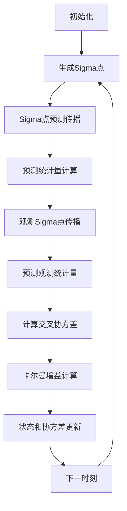

# 第6章：无迹卡尔曼滤波（UKF）

::: tip 学习目标
- 理解无迹变换的基本原理
- 掌握sigma点的选择和权重计算
- 比较UKF与EKF的优缺点
:::

## 无迹变换原理

无迹卡尔曼滤波（UKF）通过**无迹变换**（Unscented Transform）来处理非线性系统，避免了EKF中复杂的雅可比计算。

### 核心思想

::: note 无迹变换的哲学
"近似概率分布比近似非线性函数更容易"
- 用确定性采样点（sigma点）表示概率分布
- 将采样点通过非线性函数传播
- 重构变换后的分布统计特性
:::

### Sigma点生成

对于$n$维状态向量$x$，生成$2n+1$个sigma点：

**均值点**：
$$\chi_0 = \bar{x}$$

**正向点**：
$$\chi_i = \bar{x} + (\sqrt{(n+\lambda)P})_i, \quad i=1,2,...,n$$

**负向点**：
$$\chi_{i+n} = \bar{x} - (\sqrt{(n+\lambda)P})_i, \quad i=1,2,...,n$$

其中：
- $\lambda = \alpha^2(n+\kappa) - n$：缩放参数
- $\alpha \in [10^{-4}, 1]$：sigma点分布控制参数
- $\kappa$：通常设为$3-n$或0
- $(\sqrt{(n+\lambda)P})_i$：矩阵平方根的第$i$列

## UKF算法流程



### 权重计算

**均值权重**：
$$W_0^{(m)} = \frac{\lambda}{n+\lambda}$$
$$W_i^{(m)} = \frac{1}{2(n+\lambda)}, \quad i=1,2,...,2n$$

**协方差权重**：
$$W_0^{(c)} = \frac{\lambda}{n+\lambda} + (1-\alpha^2+\beta)$$
$$W_i^{(c)} = \frac{1}{2(n+\lambda)}, \quad i=1,2,...,2n$$

其中$\beta$是高阶矩信息参数，对高斯分布通常取$\beta=2$。

## UKF实现

```python
import numpy as np
from scipy.linalg import sqrtm, cholesky
from typing import Callable, Optional

class UnscentedKalmanFilter:
    """
    无迹卡尔曼滤波器实现
    """

    def __init__(self, dim_x: int, dim_z: int,
                 f: Callable, h: Callable,
                 alpha: float = 1e-3,
                 beta: float = 2.0,
                 kappa: Optional[float] = None):
        """
        初始化UKF

        参数:
        dim_x: 状态维度
        dim_z: 观测维度
        f: 状态转移函数
        h: 观测函数
        alpha: sigma点分布参数
        beta: 高阶矩参数
        kappa: 辅助缩放参数
        """
        self.dim_x = dim_x
        self.dim_z = dim_z
        self.f = f  # 状态转移函数
        self.h = h  # 观测函数

        # UKF参数
        self.alpha = alpha
        self.beta = beta
        self.kappa = kappa if kappa is not None else 3 - dim_x

        # 计算sigma点参数
        self.lambda_ = alpha**2 * (dim_x + self.kappa) - dim_x
        self.num_sigma = 2 * dim_x + 1

        # 计算权重
        self._compute_weights()

        # 状态和协方差
        self.x = np.zeros((dim_x, 1))
        self.P = np.eye(dim_x)

        # 噪声协方差
        self.Q = np.eye(dim_x)
        self.R = np.eye(dim_z)

        # Sigma点存储
        self.sigma_points_x = np.zeros((self.num_sigma, dim_x))
        self.sigma_points_f = np.zeros((self.num_sigma, dim_x))
        self.sigma_points_h = np.zeros((self.num_sigma, dim_z))

        # 中间结果
        self.x_prior = None
        self.P_prior = None
        self.K = None
        self.y = None
        self.S = None

    def _compute_weights(self):
        """计算sigma点权重"""
        # 均值权重
        self.Wm = np.full(self.num_sigma, 1. / (2 * (self.dim_x + self.lambda_)))
        self.Wm[0] = self.lambda_ / (self.dim_x + self.lambda_)

        # 协方差权重
        self.Wc = self.Wm.copy()
        self.Wc[0] = self.lambda_ / (self.dim_x + self.lambda_) + (1 - self.alpha**2 + self.beta)

    def _generate_sigma_points(self, x: np.ndarray, P: np.ndarray):
        """
        生成sigma点

        参数:
        x: 状态均值
        P: 状态协方差

        返回:
        sigma_points: (2n+1, n) sigma点矩阵
        """
        n = len(x)
        sigma_points = np.zeros((self.num_sigma, n))

        # 计算矩阵平方根
        try:
            sqrt = cholesky((n + self.lambda_) * P).T
        except np.linalg.LinAlgError:
            # 如果Cholesky分解失败，使用特征值分解
            eigenvals, eigenvecs = np.linalg.eigh((n + self.lambda_) * P)
            sqrt = eigenvecs @ np.diag(np.sqrt(np.maximum(eigenvals, 0)))

        # 生成sigma点
        sigma_points[0] = x.flatten()

        for i in range(n):
            sigma_points[i + 1] = x.flatten() + sqrt[i]
            sigma_points[n + i + 1] = x.flatten() - sqrt[i]

        return sigma_points

    def predict(self, u: Optional[np.ndarray] = None):
        """
        预测步骤
        """
        # 生成sigma点
        self.sigma_points_x = self._generate_sigma_points(self.x, self.P)

        # 通过状态转移函数传播sigma点
        for i in range(self.num_sigma):
            x_sigma = self.sigma_points_x[i].reshape(-1, 1)
            self.sigma_points_f[i] = self.f(x_sigma, u).flatten()

        # 计算预测状态均值
        self.x = np.zeros((self.dim_x, 1))
        for i in range(self.num_sigma):
            self.x += self.Wm[i] * self.sigma_points_f[i].reshape(-1, 1)

        # 计算预测状态协方差
        self.P = np.zeros((self.dim_x, self.dim_x))
        for i in range(self.num_sigma):
            y = self.sigma_points_f[i].reshape(-1, 1) - self.x
            self.P += self.Wc[i] * (y @ y.T)

        # 添加过程噪声
        self.P += self.Q

        # 保存先验估计
        self.x_prior = self.x.copy()
        self.P_prior = self.P.copy()

    def update(self, z: np.ndarray):
        """
        更新步骤
        """
        # 确保z是列向量
        if z.ndim == 1:
            z = z.reshape(-1, 1)

        # 生成当前状态的sigma点
        sigma_points = self._generate_sigma_points(self.x, self.P)

        # 通过观测函数传播sigma点
        for i in range(self.num_sigma):
            x_sigma = sigma_points[i].reshape(-1, 1)
            self.sigma_points_h[i] = self.h(x_sigma).flatten()

        # 计算预测观测均值
        z_pred = np.zeros((self.dim_z, 1))
        for i in range(self.num_sigma):
            z_pred += self.Wm[i] * self.sigma_points_h[i].reshape(-1, 1)

        # 计算观测协方差
        Pzz = np.zeros((self.dim_z, self.dim_z))
        for i in range(self.num_sigma):
            y = self.sigma_points_h[i].reshape(-1, 1) - z_pred
            Pzz += self.Wc[i] * (y @ y.T)

        # 添加观测噪声
        Pzz += self.R

        # 计算交叉协方差
        Pxz = np.zeros((self.dim_x, self.dim_z))
        for i in range(self.num_sigma):
            dx = sigma_points[i].reshape(-1, 1) - self.x
            dz = self.sigma_points_h[i].reshape(-1, 1) - z_pred
            Pxz += self.Wc[i] * (dx @ dz.T)

        # 计算卡尔曼增益
        self.K = Pxz @ np.linalg.inv(Pzz)

        # 计算残差
        self.y = z - z_pred

        # 状态更新
        self.x = self.x + self.K @ self.y

        # 协方差更新
        self.P = self.P - self.K @ Pzz @ self.K.T

        # 保存中间结果
        self.S = Pzz
```

## UKF应用示例

### 示例1：非线性振子跟踪

```python
def nonlinear_oscillator_tracking():
    """
    非线性振子跟踪示例
    """

    # 状态：[位置, 速度]
    # 非线性动力学：位置 = 位置 + 速度*dt，速度 = 速度 - ω²*sin(位置)*dt

    def f(x, u, dt=0.1):
        """非线性状态转移"""
        omega = 1.0  # 振子频率
        pos, vel = x[0, 0], x[1, 0]

        new_pos = pos + vel * dt
        new_vel = vel - omega**2 * np.sin(pos) * dt

        return np.array([[new_pos], [new_vel]])

    def h(x):
        """观测函数（观测位置）"""
        return np.array([[x[0, 0]]])

    # 创建UKF
    ukf = UnscentedKalmanFilter(dim_x=2, dim_z=1, f=f, h=h)

    # 初始化
    ukf.x = np.array([[0.1], [0.0]])  # 初始状态
    ukf.P = np.array([[0.1, 0], [0, 0.1]])  # 初始协方差

    ukf.Q = np.array([[0.001, 0], [0, 0.001]])  # 过程噪声
    ukf.R = np.array([[0.1]])  # 观测噪声

    # 模拟和滤波
    true_states = []
    observations = []
    estimates = []

    # 真实系统初始状态
    true_state = np.array([0.1, 0.0])

    for k in range(200):
        # 真实系统演化
        dt = 0.1
        omega = 1.0
        pos, vel = true_state[0], true_state[1]
        new_pos = pos + vel * dt
        new_vel = vel - omega**2 * np.sin(pos) * dt
        true_state = np.array([new_pos, new_vel])

        true_states.append(true_state.copy())

        # 生成观测
        true_obs = true_state[0]
        noisy_obs = true_obs + np.random.normal(0, np.sqrt(0.1))
        observations.append(noisy_obs)

        # UKF步骤
        ukf.predict()
        ukf.update(np.array([noisy_obs]))

        estimates.append(ukf.x.flatten())

    # 绘制结果
    import matplotlib.pyplot as plt

    true_states = np.array(true_states)
    estimates = np.array(estimates)
    observations = np.array(observations)

    plt.figure(figsize=(14, 10))

    plt.subplot(3, 1, 1)
    plt.plot(true_states[:, 0], 'g-', label='真实位置', linewidth=2)
    plt.plot(observations, 'r.', label='观测', alpha=0.7, markersize=3)
    plt.plot(estimates[:, 0], 'b-', label='UKF估计', linewidth=2)
    plt.legend()
    plt.title('非线性振子位置跟踪')
    plt.ylabel('位置')

    plt.subplot(3, 1, 2)
    plt.plot(true_states[:, 1], 'g-', label='真实速度', linewidth=2)
    plt.plot(estimates[:, 1], 'b-', label='UKF估计', linewidth=2)
    plt.legend()
    plt.ylabel('速度')

    plt.subplot(3, 1, 3)
    pos_error = true_states[:, 0] - estimates[:, 0]
    vel_error = true_states[:, 1] - estimates[:, 1]
    plt.plot(pos_error, 'r-', label='位置误差')
    plt.plot(vel_error, 'b-', label='速度误差')
    plt.axhline(y=0, color='k', linestyle='--', alpha=0.5)
    plt.legend()
    plt.xlabel('时间步')
    plt.ylabel('误差')

    plt.tight_layout()
    plt.show()

    return true_states, observations, estimates

# 运行示例
# nonlinear_oscillator_tracking()
```

### 示例2：金融中的Heston随机波动率模型

```python
def heston_volatility_ukf():
    """
    Heston随机波动率模型的UKF估计
    """

    # 状态：[log_price, variance]
    # Heston模型：
    # dS = μS dt + √V S dW₁
    # dV = κ(θ - V) dt + σ√V dW₂

    def f(x, u, dt=1/252):  # 日频数据
        """Heston模型状态转移（欧拉离散化）"""
        log_S, V = x[0, 0], x[1, 0]

        # Heston参数
        mu = 0.05      # 漂移率
        kappa = 2.0    # 回归速度
        theta = 0.04   # 长期方差
        sigma = 0.3    # 波动率的波动率

        # 确保方差非负
        V = max(V, 1e-8)

        # 欧拉离散化
        new_log_S = log_S + (mu - 0.5 * V) * dt
        new_V = V + kappa * (theta - V) * dt

        # 确保新方差非负
        new_V = max(new_V, 1e-8)

        return np.array([[new_log_S], [new_V]])

    def h(x):
        """观测函数：观测股价"""
        log_S = x[0, 0]
        return np.array([[np.exp(log_S)]])

    # 创建UKF
    ukf = UnscentedKalmanFilter(dim_x=2, dim_z=1, f=f, h=h,
                               alpha=1e-3, beta=2.0, kappa=1.0)

    # 初始化
    ukf.x = np.array([[np.log(100)], [0.04]])  # log(S₀), V₀
    ukf.P = np.array([[0.01, 0], [0, 0.001]])

    # 噪声协方差
    dt = 1/252
    ukf.Q = np.array([[0.01*dt, 0], [0, 0.001*dt]])
    ukf.R = np.array([[1.0]])

    # 模拟数据
    prices = []
    volatilities = []
    estimated_vols = []

    # 模拟Heston过程生成真实数据
    np.random.seed(42)
    S = 100.0
    V = 0.04

    for k in range(252):  # 一年数据
        # 模拟真实价格
        dW1 = np.random.normal(0, np.sqrt(dt))
        dW2 = np.random.normal(0, np.sqrt(dt))

        # Heston参数
        mu, kappa, theta, sigma = 0.05, 2.0, 0.04, 0.3
        rho = -0.5  # 相关性

        # 相关随机数
        dW2 = rho * dW1 + np.sqrt(1 - rho**2) * dW2

        # 更新价格和波动率
        V = max(V + kappa * (theta - V) * dt + sigma * np.sqrt(max(V, 0)) * dW2, 1e-8)
        S = S * np.exp((mu - 0.5 * V) * dt + np.sqrt(V) * dW1)

        # 添加观测噪声
        observed_price = S + np.random.normal(0, 1.0)

        prices.append(observed_price)
        volatilities.append(V)

        # UKF步骤
        ukf.predict()
        ukf.update(np.array([observed_price]))

        estimated_vols.append(ukf.x[1, 0])

    # 绘制结果
    plt.figure(figsize=(14, 8))

    plt.subplot(2, 1, 1)
    plt.plot(prices, 'b-', label='观测价格', linewidth=1)
    plt.legend()
    plt.title('Heston模型：价格和波动率估计')
    plt.ylabel('价格')

    plt.subplot(2, 1, 2)
    plt.plot(volatilities, 'g-', label='真实波动率', linewidth=2)
    plt.plot(estimated_vols, 'r--', label='UKF估计波动率', linewidth=2)
    plt.legend()
    plt.xlabel('交易日')
    plt.ylabel('波动率')

    plt.tight_layout()
    plt.show()

    return prices, volatilities, estimated_vols

# 运行示例
# heston_volatility_ukf()
```

## UKF vs EKF 比较

### 优势对比

| 特性 | UKF | EKF |
|------|-----|-----|
| **雅可比计算** | 不需要 | 需要解析或数值微分 |
| **实现复杂度** | 中等 | 高（需要导数） |
| **数值稳定性** | 更好 | 依赖雅可比精度 |
| **高阶项** | 捕获到3阶 | 只到1阶 |
| **计算复杂度** | O(n³) | O(n³) |
| **参数调优** | 需要调α,β,κ | 较少参数 |

### 性能比较实验

```python
def compare_ukf_ekf():
    """
    UKF与EKF性能比较
    """

    # 高度非线性系统
    def f_nonlinear(x, u):
        """强非线性状态转移"""
        return np.array([[x[0, 0] + 0.1 * np.sin(x[0, 0])],
                        [x[1, 0] + 0.1 * np.cos(x[0, 0])]])

    def h_nonlinear(x):
        """非线性观测"""
        return np.array([[x[0, 0]**2 + x[1, 0]**2]])

    # EKF需要的雅可比函数
    def f_jac(x, u):
        return np.array([[1 + 0.1 * np.cos(x[0, 0]), 0],
                        [-0.1 * np.sin(x[0, 0]), 1]])

    def h_jac(x):
        return np.array([[2 * x[0, 0], 2 * x[1, 0]]])

    # 创建滤波器
    ukf = UnscentedKalmanFilter(2, 1, f_nonlinear, h_nonlinear)
    ekf = ExtendedKalmanFilter(2, 1, f_nonlinear, h_nonlinear, f_jac, h_jac)

    # 相同初始化
    for filt in [ukf, ekf]:
        filt.x = np.array([[1.0], [1.0]])
        filt.P = np.eye(2)
        filt.Q = 0.01 * np.eye(2)
        filt.R = np.array([[0.1]])

    # 运行比较
    true_states = []
    ukf_estimates = []
    ekf_estimates = []

    true_x = np.array([1.0, 1.0])

    for k in range(100):
        # 真实状态演化
        true_x = f_nonlinear(true_x.reshape(-1, 1), None).flatten()
        true_x += np.random.multivariate_normal([0, 0], 0.01 * np.eye(2))
        true_states.append(true_x.copy())

        # 观测
        obs = h_nonlinear(true_x.reshape(-1, 1)) + np.random.normal(0, np.sqrt(0.1))

        # UKF
        ukf.predict()
        ukf.update(obs)
        ukf_estimates.append(ukf.x.flatten())

        # EKF
        ekf.predict()
        ekf.update(obs)
        ekf_estimates.append(ekf.x.flatten())

    # 计算误差
    true_states = np.array(true_states)
    ukf_estimates = np.array(ukf_estimates)
    ekf_estimates = np.array(ekf_estimates)

    ukf_rmse = np.sqrt(np.mean((true_states - ukf_estimates)**2, axis=0))
    ekf_rmse = np.sqrt(np.mean((true_states - ekf_estimates)**2, axis=0))

    print(f"UKF RMSE: {ukf_rmse}")
    print(f"EKF RMSE: {ekf_rmse}")

    return true_states, ukf_estimates, ekf_estimates

# 运行比较
# compare_ukf_ekf()
```

## 参数调优指南

### Alpha参数

::: note Alpha的作用
- **Alpha → 0**：sigma点更集中于均值，适合线性系统
- **Alpha → 1**：sigma点分布更广，适合强非线性系统
- **推荐值**：1e-4 到 1e-1
:::

### Beta参数

::: note Beta的意义
- **Beta = 2**：高斯分布的最优值
- **Beta > 2**：适合重尾分布
- **Beta < 2**：适合轻尾分布
:::

### 自适应参数调优

```python
class AdaptiveUKF(UnscentedKalmanFilter):
    """
    自适应参数调优的UKF
    """

    def __init__(self, *args, **kwargs):
        super().__init__(*args, **kwargs)
        self.innovation_history = []

    def adapt_parameters(self, window_size=20):
        """基于创新序列自适应调参"""
        if len(self.innovation_history) < window_size:
            return

        # 计算创新的统计特性
        innovations = np.array(self.innovation_history[-window_size:])
        innovation_norm = np.linalg.norm(innovations, axis=1)

        # 如果创新过大，增加alpha
        if np.mean(innovation_norm) > np.std(innovation_norm) * 2:
            self.alpha = min(self.alpha * 1.1, 1.0)
            self._compute_weights()

        # 如果创新过小，减少alpha
        elif np.mean(innovation_norm) < np.std(innovation_norm) * 0.5:
            self.alpha = max(self.alpha * 0.9, 1e-4)
            self._compute_weights()

    def update(self, z):
        """带自适应的更新"""
        super().update(z)
        self.innovation_history.append(self.y.flatten())
        self.adapt_parameters()
```

::: tip 下一章预告
下一章我们将学习粒子滤波，这是处理高度非线性和非高斯系统的强大方法，不局限于高斯假设。
:::