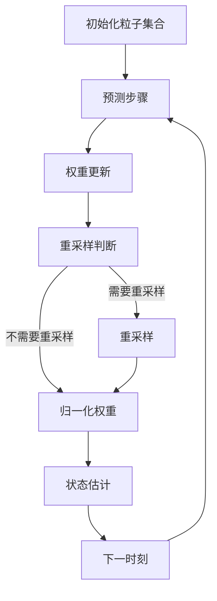

# 第7章：粒子滤波与高级滤波技术

::: tip 学习目标
- 理解粒子滤波的基本思想和算法流程
- 掌握重采样技术和粒子退化问题
- 了解其他高级滤波方法（集合卡尔曼滤波等）
:::

## 粒子滤波基本原理

粒子滤波（Particle Filter，PF）是一种基于**蒙特卡洛方法**的非参数贝叶斯滤波技术，适用于高度非线性和非高斯系统。

### 核心思想

::: note 粒子滤波哲学
用大量随机样本（粒子）来近似后验概率分布，每个粒子代表状态空间中的一个可能状态。
:::

**概率分布近似**：
$$p(x_k|z_{1:k}) \approx \sum_{i=1}^N w_k^{(i)} \delta(x_k - x_k^{(i)})$$

其中：
- $x_k^{(i)}$：第$i$个粒子的状态
- $w_k^{(i)}$：第$i$个粒子的权重
- $\delta(\cdot)$：狄拉克函数
- $N$：粒子数量

### 算法流程



## 序列重要性采样（SIS）

### 重要性采样原理

**基本思想**：从易于采样的分布$q(x)$中抽样，用权重补偿分布差异。

对于目标分布$p(x)$，有：
$$E_p[f(x)] = \int f(x)p(x)dx = \int f(x)\frac{p(x)}{q(x)}q(x)dx \approx \frac{1}{N}\sum_{i=1}^N w^{(i)}f(x^{(i)})$$

其中权重为：$w^{(i)} = \frac{p(x^{(i)})}{q(x^{(i)})}$

### 序列重要性采样算法

**递推权重更新**：
$$w_k^{(i)} = w_{k-1}^{(i)} \frac{p(z_k|x_k^{(i)})p(x_k^{(i)}|x_{k-1}^{(i)})}{q(x_k^{(i)}|x_{k-1}^{(i)}, z_k)}$$

**状态估计**：
$$\hat{x}_k = \sum_{i=1}^N w_k^{(i)} x_k^{(i)}$$

## 粒子滤波实现

```python
import numpy as np
from scipy.stats import multivariate_normal
import matplotlib.pyplot as plt
from typing import Callable, Optional

class ParticleFilter:
    """
    粒子滤波器实现
    """

    def __init__(self, num_particles: int, dim_x: int, dim_z: int,
                 f: Callable, h: Callable,
                 initial_state_sampler: Callable):
        """
        初始化粒子滤波器

        参数:
        num_particles: 粒子数量
        dim_x: 状态维度
        dim_z: 观测维度
        f: 状态转移函数
        h: 观测函数
        initial_state_sampler: 初始状态采样函数
        """
        self.N = num_particles
        self.dim_x = dim_x
        self.dim_z = dim_z
        self.f = f  # 状态转移函数
        self.h = h  # 观测函数

        # 粒子和权重
        self.particles = np.zeros((num_particles, dim_x))
        self.weights = np.ones(num_particles) / num_particles

        # 噪声协方差
        self.Q = np.eye(dim_x)  # 过程噪声
        self.R = np.eye(dim_z)  # 观测噪声

        # 初始化粒子
        for i in range(num_particles):
            self.particles[i] = initial_state_sampler()

        # 重采样参数
        self.resample_threshold = 0.5  # 有效样本比例阈值

    def predict(self, u: Optional[np.ndarray] = None):
        """
        预测步骤：根据状态转移模型传播粒子
        """
        for i in range(self.N):
            # 状态转移 + 过程噪声
            self.particles[i] = self.f(self.particles[i], u) + \
                              np.random.multivariate_normal(np.zeros(self.dim_x), self.Q)

    def update(self, z: np.ndarray):
        """
        更新步骤：根据观测更新粒子权重
        """
        # 计算每个粒子的似然
        for i in range(self.N):
            # 预测观测
            z_pred = self.h(self.particles[i])

            # 计算似然 p(z|x_i)
            likelihood = multivariate_normal.pdf(z, z_pred, self.R)

            # 更新权重
            self.weights[i] *= likelihood

        # 归一化权重
        self.weights += 1e-300  # 避免除零
        self.weights /= np.sum(self.weights)

    def resample(self):
        """
        重采样：解决粒子退化问题
        """
        # 计算有效样本数
        N_eff = 1.0 / np.sum(self.weights**2)

        if N_eff < self.resample_threshold * self.N:
            # 系统重采样
            indices = self._systematic_resample()

            # 更新粒子和权重
            self.particles = self.particles[indices]
            self.weights = np.ones(self.N) / self.N

    def _systematic_resample(self):
        """
        系统重采样算法
        """
        # 计算累积分布函数
        cumulative_sum = np.cumsum(self.weights)
        cumulative_sum[-1] = 1.0  # 确保最后一个值为1

        # 生成均匀分布的起始点
        u = np.random.random() / self.N

        indices = np.zeros(self.N, dtype=int)
        i = 0
        for j in range(self.N):
            while u > cumulative_sum[i]:
                i += 1
            indices[j] = i
            u += 1.0 / self.N

        return indices

    def estimate(self):
        """
        计算状态估计
        """
        return np.average(self.particles, weights=self.weights, axis=0)

    def get_covariance(self):
        """
        计算协方差估计
        """
        mean = self.estimate()
        diff = self.particles - mean
        return np.average(diff[:, :, np.newaxis] * diff[:, np.newaxis, :],
                         weights=self.weights, axis=0)
```

## 重采样技术

### 重采样的必要性

::: warning 粒子退化问题
随着时间推移，大部分粒子的权重会趋于零，只有少数粒子权重较大，导致：
1. 计算效率下降
2. 估计精度降低
3. 粒子多样性丢失
:::

### 重采样算法比较

```python
class AdvancedParticleFilter(ParticleFilter):
    """
    带有多种重采样算法的粒子滤波器
    """

    def multinomial_resample(self):
        """多项式重采样"""
        indices = np.random.choice(range(self.N), size=self.N,
                                 p=self.weights, replace=True)
        return indices

    def stratified_resample(self):
        """分层重采样"""
        positions = (np.random.random(self.N) + np.arange(self.N)) / self.N
        indices = np.zeros(self.N, dtype=int)
        cumulative_sum = np.cumsum(self.weights)

        i, j = 0, 0
        while i < self.N:
            if positions[i] < cumulative_sum[j]:
                indices[i] = j
                i += 1
            else:
                j += 1

        return indices

    def residual_resample(self):
        """残差重采样"""
        # 确定性部分
        N_copies = (self.N * self.weights).astype(int)
        N_residual = self.N - np.sum(N_copies)

        # 构造索引
        indices = []
        for i in range(self.N):
            indices.extend([i] * N_copies[i])

        # 残差部分
        if N_residual > 0:
            residual_weights = self.N * self.weights - N_copies
            residual_weights /= np.sum(residual_weights)

            residual_indices = np.random.choice(range(self.N),
                                              size=N_residual,
                                              p=residual_weights,
                                              replace=True)
            indices.extend(residual_indices)

        return np.array(indices)

    def resample(self, method='systematic'):
        """
        选择重采样方法
        """
        N_eff = 1.0 / np.sum(self.weights**2)

        if N_eff < self.resample_threshold * self.N:
            if method == 'multinomial':
                indices = self.multinomial_resample()
            elif method == 'stratified':
                indices = self.stratified_resample()
            elif method == 'residual':
                indices = self.residual_resample()
            else:  # systematic
                indices = self._systematic_resample()

            self.particles = self.particles[indices]
            self.weights = np.ones(self.N) / self.N
```

## 粒子滤波应用示例

### 示例1：非线性增长模型跟踪

```python
def nonlinear_growth_tracking():
    """
    非线性增长模型的粒子滤波跟踪
    """

    # 状态转移：x_k = 0.5*x_{k-1} + 25*x_{k-1}/(1+x_{k-1}^2) + 8*cos(1.2*(k-1)) + w_k
    def f(x, u=None, k=0):
        return 0.5 * x + 25 * x / (1 + x**2) + 8 * np.cos(1.2 * k)

    # 观测函数：z_k = x_k^2/20 + v_k
    def h(x):
        return x**2 / 20

    # 初始状态采样
    def initial_sampler():
        return np.random.normal(0, 5)

    # 创建粒子滤波器
    pf = AdvancedParticleFilter(num_particles=1000, dim_x=1, dim_z=1,
                               f=f, h=h, initial_state_sampler=initial_sampler)

    # 设置噪声协方差
    pf.Q = np.array([[10]])  # 过程噪声
    pf.R = np.array([[1]])   # 观测噪声

    # 模拟真实系统
    true_states = []
    observations = []
    estimates = []

    true_x = 0.1
    T = 50

    for k in range(T):
        # 真实状态演化
        true_x = f(true_x, k=k) + np.random.normal(0, np.sqrt(10))
        true_states.append(true_x)

        # 生成观测
        true_obs = h(true_x)
        noisy_obs = true_obs + np.random.normal(0, 1)
        observations.append(noisy_obs)

        # 粒子滤波步骤
        # 修改f函数以包含时间参数
        def f_k(x, u=None):
            return f(x, u, k)
        pf.f = f_k

        pf.predict()
        pf.update(np.array([noisy_obs]))
        pf.resample(method='systematic')

        estimates.append(pf.estimate()[0])

    # 绘制结果
    plt.figure(figsize=(12, 8))

    plt.subplot(2, 1, 1)
    plt.plot(true_states, 'g-', label='真实状态', linewidth=2)
    plt.plot(estimates, 'b-', label='粒子滤波估计', linewidth=2)
    plt.legend()
    plt.title('非线性增长模型跟踪')
    plt.ylabel('状态值')

    plt.subplot(2, 1, 2)
    errors = np.array(true_states) - np.array(estimates)
    plt.plot(errors, 'r-', label='估计误差')
    plt.axhline(y=0, color='k', linestyle='--', alpha=0.5)
    plt.legend()
    plt.xlabel('时间步')
    plt.ylabel('误差')

    plt.tight_layout()
    plt.show()

    return true_states, observations, estimates

# 运行示例
# nonlinear_growth_tracking()
```

### 示例2：金融中的跳跃扩散模型

```python
def jump_diffusion_pf():
    """
    跳跃扩散模型的粒子滤波估计
    """

    # 跳跃扩散模型：dS = μS dt + σS dW + S dJ
    # 其中 dJ 是泊松跳跃过程

    def f(x, u=None, dt=1/252):
        """
        状态转移：[log_price, volatility, jump_intensity]
        """
        log_S, vol, lambda_j = x[0], x[1], x[2]

        # 基本参数
        mu = 0.05
        vol_of_vol = 0.1
        mean_jump = -0.1
        std_jump = 0.2

        # 连续部分
        new_log_S = log_S + (mu - 0.5 * vol**2) * dt + vol * np.sqrt(dt) * np.random.normal()

        # 跳跃部分
        if np.random.poisson(lambda_j * dt) > 0:
            jump = np.random.normal(mean_jump, std_jump)
            new_log_S += jump

        # 波动率演化（均值回归）
        new_vol = vol + 0.1 * (0.2 - vol) * dt + vol_of_vol * np.sqrt(dt) * np.random.normal()
        new_vol = max(new_vol, 0.01)  # 确保正值

        # 跳跃强度演化
        new_lambda = lambda_j + 0.01 * np.random.normal()
        new_lambda = max(new_lambda, 0.001)  # 确保正值

        return np.array([new_log_S, new_vol, new_lambda])

    def h(x):
        """观测函数：观测股价"""
        log_S = x[0]
        return np.array([np.exp(log_S)])

    def initial_sampler():
        """初始状态采样"""
        log_S = np.log(100) + np.random.normal(0, 0.1)
        vol = 0.2 + np.random.normal(0, 0.05)
        lambda_j = 0.1 + np.random.normal(0, 0.02)
        return np.array([log_S, max(vol, 0.01), max(lambda_j, 0.001)])

    # 创建粒子滤波器
    pf = AdvancedParticleFilter(num_particles=2000, dim_x=3, dim_z=1,
                               f=f, h=h, initial_state_sampler=initial_sampler)

    # 设置噪声协方差
    pf.Q = np.diag([0.001, 0.001, 0.0001])
    pf.R = np.array([[1.0]])

    # 模拟和滤波
    prices = []
    true_vols = []
    true_lambdas = []
    estimated_vols = []
    estimated_lambdas = []

    for k in range(100):
        # 模拟观测价格
        sim_price = 100 * np.exp(0.001 * k) * (1 + 0.1 * np.random.normal())
        prices.append(sim_price)

        # 粒子滤波
        pf.predict()
        pf.update(np.array([sim_price]))
        pf.resample(method='stratified')

        # 提取估计
        estimate = pf.estimate()
        estimated_vols.append(estimate[1])
        estimated_lambdas.append(estimate[2])

    # 绘制结果
    plt.figure(figsize=(15, 10))

    plt.subplot(3, 1, 1)
    plt.plot(prices, 'b-', label='观测价格')
    plt.legend()
    plt.title('跳跃扩散模型：粒子滤波估计')
    plt.ylabel('价格')

    plt.subplot(3, 1, 2)
    plt.plot(estimated_vols, 'r-', label='估计波动率')
    plt.legend()
    plt.ylabel('波动率')

    plt.subplot(3, 1, 3)
    plt.plot(estimated_lambdas, 'g-', label='估计跳跃强度')
    plt.legend()
    plt.xlabel('时间')
    plt.ylabel('跳跃强度')

    plt.tight_layout()
    plt.show()

    return prices, estimated_vols, estimated_lambdas

# 运行示例
# jump_diffusion_pf()
```

## 高级滤波技术

### 1. 集合卡尔曼滤波（EnKF）

集合卡尔曼滤波结合了卡尔曼滤波和蒙特卡洛方法：

```python
class EnsembleKalmanFilter:
    """
    集合卡尔曼滤波器
    """

    def __init__(self, ensemble_size: int, dim_x: int, dim_z: int,
                 f: Callable, h: Callable):
        self.N = ensemble_size
        self.dim_x = dim_x
        self.dim_z = dim_z
        self.f = f
        self.h = h

        # 集合矩阵
        self.X = np.random.randn(dim_x, ensemble_size)

        # 噪声协方差
        self.Q = np.eye(dim_x)
        self.R = np.eye(dim_z)

    def predict(self, u=None):
        """预测步骤"""
        for i in range(self.N):
            # 集合成员传播
            self.X[:, i] = self.f(self.X[:, i], u) + \
                          np.random.multivariate_normal(np.zeros(self.dim_x), self.Q)

    def update(self, z):
        """更新步骤"""
        # 计算集合均值
        x_mean = np.mean(self.X, axis=1, keepdims=True)

        # 计算偏差矩阵
        A = self.X - x_mean

        # 预测观测
        H_X = np.zeros((self.dim_z, self.N))
        for i in range(self.N):
            H_X[:, i] = self.h(self.X[:, i])

        h_mean = np.mean(H_X, axis=1, keepdims=True)
        H_A = H_X - h_mean

        # 计算协方差
        P_xz = A @ H_A.T / (self.N - 1)
        P_zz = H_A @ H_A.T / (self.N - 1) + self.R

        # 卡尔曼增益
        K = P_xz @ np.linalg.inv(P_zz)

        # 更新集合
        for i in range(self.N):
            innovation = z + np.random.multivariate_normal(np.zeros(self.dim_z), self.R) - H_X[:, i]
            self.X[:, i] = self.X[:, i] + K @ innovation

    def estimate(self):
        """集合均值估计"""
        return np.mean(self.X, axis=1)
```

### 2. 自适应粒子滤波

```python
class AdaptiveParticleFilter(AdvancedParticleFilter):
    """
    自适应粒子数量的粒子滤波器
    """

    def __init__(self, *args, **kwargs):
        super().__init__(*args, **kwargs)
        self.min_particles = 100
        self.max_particles = 5000
        self.adaptation_rate = 0.1

    def adapt_particles(self):
        """自适应调整粒子数量"""
        # 基于有效样本数调整
        N_eff = 1.0 / np.sum(self.weights**2)

        if N_eff < 0.3 * self.N and self.N < self.max_particles:
            # 增加粒子
            new_N = min(int(self.N * 1.2), self.max_particles)
            self._resize_particles(new_N)
        elif N_eff > 0.8 * self.N and self.N > self.min_particles:
            # 减少粒子
            new_N = max(int(self.N * 0.8), self.min_particles)
            self._resize_particles(new_N)

    def _resize_particles(self, new_N):
        """调整粒子数量"""
        if new_N > self.N:
            # 增加粒子：通过复制现有粒子
            indices = np.random.choice(range(self.N), size=new_N - self.N,
                                     p=self.weights, replace=True)
            new_particles = self.particles[indices]
            new_particles += np.random.multivariate_normal(
                np.zeros(self.dim_x), 0.01 * self.Q, size=new_N - self.N)

            self.particles = np.vstack([self.particles, new_particles])
            self.weights = np.ones(new_N) / new_N
        else:
            # 减少粒子：保留权重大的粒子
            indices = np.random.choice(range(self.N), size=new_N,
                                     p=self.weights, replace=False)
            self.particles = self.particles[indices]
            self.weights = np.ones(new_N) / new_N

        self.N = new_N

    def predict(self, u=None):
        """预测步骤（带自适应）"""
        super().predict(u)
        self.adapt_particles()
```

## 性能评估与比较

### 滤波算法比较

```python
def compare_filters():
    """
    比较不同滤波算法的性能
    """

    # 定义测试系统
    def f_test(x, u=None):
        return 0.5 * x + 25 * x / (1 + x**2) + 8 * np.cos(1.2 * len(true_states))

    def h_test(x):
        return x**2 / 20

    # 算法列表
    algorithms = {
        'PF_systematic': lambda: AdvancedParticleFilter(1000, 1, 1, f_test, h_test,
                                                       lambda: np.random.normal(0, 5)),
        'PF_stratified': lambda: AdvancedParticleFilter(1000, 1, 1, f_test, h_test,
                                                       lambda: np.random.normal(0, 5)),
        'EnKF': lambda: EnsembleKalmanFilter(100, 1, 1, f_test, h_test)
    }

    results = {}
    true_states = []

    # 生成真实轨迹
    true_x = 0.1
    for k in range(50):
        true_x = f_test(true_x) + np.random.normal(0, np.sqrt(10))
        true_states.append(true_x)

    # 测试每种算法
    for name, filter_creator in algorithms.items():
        if 'PF' in name:
            filt = filter_creator()
            filt.Q = np.array([[10]])
            filt.R = np.array([[1]])

            estimates = []
            for k, true_state in enumerate(true_states):
                obs = h_test(true_state) + np.random.normal(0, 1)

                filt.predict()
                filt.update(np.array([obs]))

                method = 'systematic' if 'systematic' in name else 'stratified'
                filt.resample(method=method)

                estimates.append(filt.estimate()[0])

            results[name] = estimates

    # 计算RMSE
    for name, estimates in results.items():
        rmse = np.sqrt(np.mean((np.array(true_states) - np.array(estimates))**2))
        print(f"{name} RMSE: {rmse:.4f}")

    return results

# 运行比较
# compare_filters()
```

## 粒子滤波的局限性

::: warning 主要挑战
1. **维度灾难**：高维状态空间需要指数增长的粒子数
2. **计算复杂度**：O(N)复杂度，N通常很大
3. **权重退化**：大部分粒子权重趋于零
4. **样本贫化**：重采样后粒子多样性降低
:::

### 改进策略

```python
def improved_particle_filter_strategies():
    """
    粒子滤波改进策略示例
    """

    # 1. 辅助粒子滤波（Auxiliary PF）
    class AuxiliaryParticleFilter(ParticleFilter):
        def predict_and_weight(self, z):
            """同时进行预测和权重计算"""
            aux_weights = np.zeros(self.N)

            for i in range(self.N):
                # 预测粒子
                x_pred = self.f(self.particles[i])
                z_pred = self.h(x_pred)

                # 计算辅助权重
                aux_weights[i] = self.weights[i] * \
                               multivariate_normal.pdf(z, z_pred, self.R)

            # 归一化辅助权重
            aux_weights /= np.sum(aux_weights)

            # 重采样
            indices = np.random.choice(range(self.N), size=self.N, p=aux_weights)
            self.particles = self.particles[indices]
            self.weights = self.weights[indices]

    # 2. 正则化粒子滤波
    class RegularizedParticleFilter(ParticleFilter):
        def resample(self):
            """带核密度估计的重采样"""
            super().resample()

            # 添加核密度估计的噪声
            h_opt = np.power(4.0 / (3 * self.N), 1.0 / (self.dim_x + 4))
            cov = np.cov(self.particles.T)

            for i in range(self.N):
                self.particles[i] += np.random.multivariate_normal(
                    np.zeros(self.dim_x), h_opt**2 * cov)

    print("改进策略已定义：辅助粒子滤波和正则化粒子滤波")

# improved_particle_filter_strategies()
```

::: tip 下一章预告
下一章我们将学习卡尔曼滤波在金融中的基础应用，包括股价建模、波动率估计和利率期限结构建模。
:::