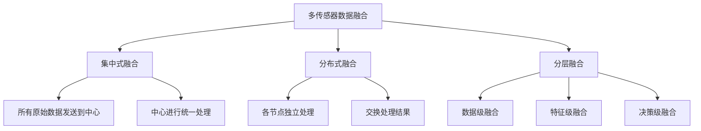

# 第11章：多传感器融合与分布式滤波

::: tip 学习目标
- 掌握集中式和分布式融合架构
- 理解信息滤波和协方差交集方法
- 学会处理异步传感器数据
:::

## 多传感器融合概述

### 融合的必要性

在现代金融系统中，信息来源多样化：

::: note 金融多数据源
- **市场数据**：价格、成交量、订单簿
- **新闻数据**：财经新闻、公告、分析师报告
- **另类数据**：社交媒体、卫星图像、信用卡交易
- **宏观数据**：经济指标、央行政策、国际贸易
- **内部数据**：风险模型、交易记录、客户行为
:::

### 融合架构分类



## 集中式卡尔曼滤波

### 多传感器集中式融合

```python
import numpy as np
import matplotlib.pyplot as plt
from scipy.linalg import block_diag
import warnings
warnings.filterwarnings('ignore')

class CentralizedMultiSensorKF:
    """
    集中式多传感器卡尔曼滤波器
    """

    def __init__(self, dim_x, sensors_config):
        """
        参数:
        dim_x: 状态维度
        sensors_config: 传感器配置列表，每个元素包含 {'H': 观测矩阵, 'R': 噪声协方差}
        """
        self.dim_x = dim_x
        self.sensors = sensors_config
        self.n_sensors = len(sensors_config)

        # 状态和协方差
        self.x = np.zeros((dim_x, 1))
        self.P = np.eye(dim_x)

        # 系统矩阵
        self.F = np.eye(dim_x)
        self.Q = np.eye(dim_x)

        # 构建增广观测矩阵和噪声协方差
        self._build_augmented_matrices()

    def _build_augmented_matrices(self):
        """构建增广的观测矩阵和噪声协方差"""
        H_list = []
        R_list = []

        for sensor in self.sensors:
            H_list.append(sensor['H'])
            R_list.append(sensor['R'])

        # 垂直堆叠观测矩阵
        self.H_aug = np.vstack(H_list)

        # 块对角化噪声协方差矩阵
        self.R_aug = block_diag(*R_list)

        self.dim_z_aug = self.H_aug.shape[0]

    def predict(self):
        """预测步骤"""
        self.x = self.F @ self.x
        self.P = self.F @ self.P @ self.F.T + self.Q

    def update(self, observations):
        """
        更新步骤

        参数:
        observations: 观测列表，按传感器顺序
        """
        # 处理缺失观测
        available_sensors = []
        available_observations = []

        for i, obs in enumerate(observations):
            if obs is not None:
                available_sensors.append(i)
                if np.isscalar(obs):
                    available_observations.append([obs])
                else:
                    available_observations.append(obs)

        if not available_sensors:
            return  # 没有可用观测

        # 构建可用传感器的增广矩阵
        H_available = []
        R_available = []

        for sensor_idx in available_sensors:
            H_available.append(self.sensors[sensor_idx]['H'])
            R_available.append(self.sensors[sensor_idx]['R'])

        H_aug = np.vstack(H_available)
        R_aug = block_diag(*R_available)

        # 扁平化观测向量
        z_aug = np.concatenate(available_observations).reshape(-1, 1)

        # 标准卡尔曼更新
        y = z_aug - H_aug @ self.x
        S = H_aug @ self.P @ H_aug.T + R_aug
        K = self.P @ H_aug.T @ np.linalg.inv(S)

        self.x = self.x + K @ y
        self.P = (np.eye(self.dim_x) - K @ H_aug) @ self.P

def centralized_fusion_example():
    """
    集中式融合示例：多个金融数据源
    """
    # 状态：[价格趋势, 波动率]
    dim_x = 2

    # 三个传感器配置
    sensors_config = [
        {
            'name': '市场价格',
            'H': np.array([[1, 0]]),  # 直接观测价格趋势
            'R': np.array([[0.1]])
        },
        {
            'name': '技术指标',
            'H': np.array([[0.8, 0.2]]),  # 趋势和波动率的组合
            'R': np.array([[0.2]])
        },
        {
            'name': '情绪指标',
            'H': np.array([[0.6, -0.3]]),  # 反向波动率影响
            'R': np.array([[0.5]])
        }
    ]

    # 创建集中式滤波器
    kf = CentralizedMultiSensorKF(dim_x, sensors_config)

    # 设置系统动态
    kf.F = np.array([[0.95, 0.1], [0, 0.9]])  # 价格趋势衰减，波动率持续
    kf.Q = np.array([[0.01, 0], [0, 0.005]])

    # 初始化
    kf.x = np.array([[0], [0.2]])
    kf.P = np.array([[1, 0], [0, 0.1]])

    # 模拟数据
    np.random.seed(42)
    T = 100

    true_states = []
    all_observations = []
    estimates = []

    # 真实状态演化
    true_state = np.array([0, 0.2])

    for t in range(T):
        # 真实状态更新
        true_state = kf.F @ true_state + np.random.multivariate_normal([0, 0], kf.Q)
        true_states.append(true_state.copy())

        # 生成观测（有些可能缺失）
        observations = []

        for i, sensor in enumerate(sensors_config):
            # 模拟传感器故障（20%概率缺失）
            if np.random.random() > 0.2:
                true_obs = sensor['H'] @ true_state
                noisy_obs = true_obs + np.random.multivariate_normal(
                    np.zeros(sensor['R'].shape[0]), sensor['R'])
                observations.append(noisy_obs[0] if len(noisy_obs) == 1 else noisy_obs)
            else:
                observations.append(None)  # 缺失观测

        all_observations.append(observations)

        # 滤波更新
        kf.predict()
        kf.update(observations)
        estimates.append(kf.x.flatten().copy())

    # 绘制结果
    true_states = np.array(true_states)
    estimates = np.array(estimates)

    fig, (ax1, ax2) = plt.subplots(2, 1, figsize=(12, 10))

    # 价格趋势
    ax1.plot(true_states[:, 0], 'g-', linewidth=3, label='真实价格趋势')
    ax1.plot(estimates[:, 0], 'b-', linewidth=2, label='融合估计')

    # 绘制各传感器的观测（当可用时）
    colors = ['red', 'orange', 'purple']
    for i, sensor in enumerate(sensors_config):
        sensor_obs = []
        sensor_times = []
        for t, obs_list in enumerate(all_observations):
            if obs_list[i] is not None:
                # 从观测反推趋势分量（简化）
                if sensor['H'][0, 0] != 0:
                    trend_obs = obs_list[i] / sensor['H'][0, 0]
                    sensor_obs.append(trend_obs)
                    sensor_times.append(t)

        if sensor_obs:
            ax1.scatter(sensor_times, sensor_obs, c=colors[i], alpha=0.6,
                       s=20, label=f"{sensor['name']}观测")

    ax1.set_ylabel('价格趋势')
    ax1.set_title('多传感器融合：价格趋势估计')
    ax1.legend()
    ax1.grid(True, alpha=0.3)

    # 波动率
    ax2.plot(true_states[:, 1], 'g-', linewidth=3, label='真实波动率')
    ax2.plot(estimates[:, 1], 'b-', linewidth=2, label='融合估计')
    ax2.set_xlabel('时间')
    ax2.set_ylabel('波动率')
    ax2.set_title('波动率估计')
    ax2.legend()
    ax2.grid(True, alpha=0.3)

    plt.tight_layout()
    plt.show()

    # 计算性能
    trend_rmse = np.sqrt(np.mean((true_states[:, 0] - estimates[:, 0])**2))
    vol_rmse = np.sqrt(np.mean((true_states[:, 1] - estimates[:, 1])**2))

    print(f"价格趋势 RMSE: {trend_rmse:.4f}")
    print(f"波动率 RMSE: {vol_rmse:.4f}")

    # 传感器可用性统计
    availability = []
    for i in range(len(sensors_config)):
        available_count = sum(1 for obs_list in all_observations if obs_list[i] is not None)
        availability.append(available_count / len(all_observations))
        print(f"{sensors_config[i]['name']} 可用性: {availability[i]:.1%}")

# 运行示例
# centralized_fusion_example()
```

## 分布式卡尔曼滤波

### 信息滤波形式

```python
class InformationFilter:
    """
    信息滤波器（卡尔曼滤波的对偶形式）
    """

    def __init__(self, dim_x):
        self.dim_x = dim_x

        # 信息矩阵和信息向量
        self.Y = np.eye(dim_x)  # 信息矩阵 Y = P^(-1)
        self.y = np.zeros((dim_x, 1))  # 信息向量 y = P^(-1) * x

        # 系统矩阵
        self.F = np.eye(dim_x)
        self.Q = np.eye(dim_x)

    @property
    def x(self):
        """状态估计：x = Y^(-1) * y"""
        try:
            return np.linalg.inv(self.Y) @ self.y
        except np.linalg.LinAlgError:
            return np.zeros((self.dim_x, 1))

    @property
    def P(self):
        """协方差矩阵：P = Y^(-1)"""
        try:
            return np.linalg.inv(self.Y)
        except np.linalg.LinAlgError:
            return np.eye(self.dim_x) * 1e6

    def predict(self):
        """信息滤波预测"""
        # 转换到协方差形式进行预测
        P_prev = self.P
        x_prev = self.x

        # 标准预测
        x_pred = self.F @ x_prev
        P_pred = self.F @ P_prev @ self.F.T + self.Q

        # 转换回信息形式
        self.Y = np.linalg.inv(P_pred)
        self.y = self.Y @ x_pred

    def update(self, z, H, R):
        """信息滤波更新"""
        z = z.reshape(-1, 1)

        # 信息贡献
        R_inv = np.linalg.inv(R)
        i = H.T @ R_inv @ z  # 信息向量贡献
        I = H.T @ R_inv @ H  # 信息矩阵贡献

        # 信息融合
        self.y += i
        self.Y += I

    def fuse_information(self, other_y, other_Y):
        """
        与另一个信息滤波器融合

        参数:
        other_y: 其他节点的信息向量
        other_Y: 其他节点的信息矩阵
        """
        self.y += other_y
        self.Y += other_Y

class DistributedKalmanFilter:
    """
    分布式卡尔曼滤波器网络
    """

    def __init__(self, n_nodes, dim_x):
        self.n_nodes = n_nodes
        self.dim_x = dim_x

        # 创建信息滤波器节点
        self.nodes = [InformationFilter(dim_x) for _ in range(n_nodes)]

        # 通信拓扑（全连接）
        self.communication_graph = np.ones((n_nodes, n_nodes)) - np.eye(n_nodes)

    def distributed_update(self, observations, H_matrices, R_matrices):
        """
        分布式更新步骤

        参数:
        observations: 各节点的观测列表
        H_matrices: 各节点的观测矩阵列表
        R_matrices: 各节点的噪声协方差列表
        """
        # 第一步：各节点独立预测和更新
        for i, (obs, H, R) in enumerate(zip(observations, H_matrices, R_matrices)):
            self.nodes[i].predict()

            if obs is not None:
                self.nodes[i].update(obs, H, R)

        # 第二步：信息交换和融合
        self._exchange_information()

    def _exchange_information(self):
        """信息交换（简化的一轮共识）"""
        # 收集所有节点的信息
        all_y = [node.y.copy() for node in self.nodes]
        all_Y = [node.Y.copy() for node in self.nodes]

        # 计算全局信息（集中式等价）
        global_y = sum(all_y)
        global_Y = sum(all_Y)

        # 分发给所有节点（实际应用中会更复杂）
        for node in self.nodes:
            node.y = global_y / self.n_nodes
            node.Y = global_Y / self.n_nodes

    def get_consensus_estimate(self):
        """获取共识估计"""
        # 简单平均（实际中应该是一致的）
        all_estimates = [node.x for node in self.nodes]
        return np.mean(all_estimates, axis=0)

def distributed_fusion_example():
    """
    分布式融合示例
    """
    # 系统设置
    dim_x = 2
    n_nodes = 3

    dkf = DistributedKalmanFilter(n_nodes, dim_x)

    # 设置各节点的系统矩阵
    F = np.array([[1.0, 1.0], [0, 0.95]])
    Q = np.array([[0.01, 0], [0, 0.01]])

    for node in dkf.nodes:
        node.F = F
        node.Q = Q

    # 各节点的观测配置
    H_configs = [
        np.array([[1, 0]]),      # 节点1：观测位置
        np.array([[0, 1]]),      # 节点2：观测速度
        np.array([[1, 1]])       # 节点3：观测位置+速度
    ]

    R_configs = [
        np.array([[0.1]]),
        np.array([[0.2]]),
        np.array([[0.15]])
    ]

    # 模拟数据
    np.random.seed(42)
    T = 50

    true_states = []
    distributed_estimates = []

    # 初始真实状态
    true_state = np.array([0, 1])

    for t in range(T):
        # 真实状态演化
        true_state = F @ true_state + np.random.multivariate_normal([0, 0], Q)
        true_states.append(true_state.copy())

        # 生成各节点观测
        observations = []
        for i in range(n_nodes):
            if np.random.random() > 0.1:  # 90%概率有观测
                true_obs = H_configs[i] @ true_state
                noisy_obs = true_obs + np.random.multivariate_normal(
                    np.zeros(R_configs[i].shape[0]), R_configs[i])
                observations.append(noisy_obs)
            else:
                observations.append(None)

        # 分布式更新
        dkf.distributed_update(observations, H_configs, R_configs)

        # 获取共识估计
        consensus_estimate = dkf.get_consensus_estimate()
        distributed_estimates.append(consensus_estimate.flatten())

    # 比较：集中式 vs 分布式
    # 集中式版本
    centralized_kf = CentralizedMultiSensorKF(dim_x, [
        {'H': H_configs[0], 'R': R_configs[0]},
        {'H': H_configs[1], 'R': R_configs[1]},
        {'H': H_configs[2], 'R': R_configs[2]}
    ])

    centralized_kf.F = F
    centralized_kf.Q = Q

    centralized_estimates = []

    # 重新运行集中式（使用相同的随机种子数据）
    np.random.seed(42)
    true_state = np.array([0, 1])

    for t in range(T):
        true_state = F @ true_state + np.random.multivariate_normal([0, 0], Q)

        observations = []
        for i in range(n_nodes):
            if np.random.random() > 0.1:
                true_obs = H_configs[i] @ true_state
                noisy_obs = true_obs + np.random.multivariate_normal(
                    np.zeros(R_configs[i].shape[0]), R_configs[i])
                observations.append(noisy_obs[0] if len(noisy_obs) == 1 else noisy_obs)
            else:
                observations.append(None)

        centralized_kf.predict()
        centralized_kf.update(observations)
        centralized_estimates.append(centralized_kf.x.flatten().copy())

    # 绘制比较结果
    true_states = np.array(true_states)
    distributed_estimates = np.array(distributed_estimates)
    centralized_estimates = np.array(centralized_estimates)

    fig, (ax1, ax2) = plt.subplots(2, 1, figsize=(12, 10))

    # 位置比较
    ax1.plot(true_states[:, 0], 'g-', linewidth=3, label='真实位置')
    ax1.plot(centralized_estimates[:, 0], 'b-', linewidth=2, label='集中式估计')
    ax1.plot(distributed_estimates[:, 0], 'r--', linewidth=2, label='分布式估计')
    ax1.set_ylabel('位置')
    ax1.set_title('集中式 vs 分布式融合：位置估计')
    ax1.legend()
    ax1.grid(True, alpha=0.3)

    # 速度比较
    ax2.plot(true_states[:, 1], 'g-', linewidth=3, label='真实速度')
    ax2.plot(centralized_estimates[:, 1], 'b-', linewidth=2, label='集中式估计')
    ax2.plot(distributed_estimates[:, 1], 'r--', linewidth=2, label='分布式估计')
    ax2.set_xlabel('时间')
    ax2.set_ylabel('速度')
    ax2.set_title('速度估计')
    ax2.legend()
    ax2.grid(True, alpha=0.3)

    plt.tight_layout()
    plt.show()

    # 性能比较
    cent_pos_rmse = np.sqrt(np.mean((true_states[:, 0] - centralized_estimates[:, 0])**2))
    dist_pos_rmse = np.sqrt(np.mean((true_states[:, 0] - distributed_estimates[:, 0])**2))

    cent_vel_rmse = np.sqrt(np.mean((true_states[:, 1] - centralized_estimates[:, 1])**2))
    dist_vel_rmse = np.sqrt(np.mean((true_states[:, 1] - distributed_estimates[:, 1])**2))

    print("性能比较:")
    print(f"位置 RMSE - 集中式: {cent_pos_rmse:.4f}, 分布式: {dist_pos_rmse:.4f}")
    print(f"速度 RMSE - 集中式: {cent_vel_rmse:.4f}, 分布式: {dist_vel_rmse:.4f}")

# 运行示例
# distributed_fusion_example()
```

## 协方差交集方法

### CI融合算法

当传感器间的相关性未知时，协方差交集（Covariance Intersection, CI）提供保守但一致的融合：

```python
class CovarianceIntersection:
    """
    协方差交集融合方法
    """

    def __init__(self):
        pass

    def fuse_two_estimates(self, x1, P1, x2, P2, omega=None):
        """
        融合两个估计

        参数:
        x1, P1: 第一个估计的均值和协方差
        x2, P2: 第二个估计的均值和协方差
        omega: 权重参数 [0,1]，如果为None则自动优化

        返回:
        x_fused, P_fused: 融合后的估计
        """
        if omega is None:
            omega = self._optimize_omega(P1, P2)

        # CI融合公式
        P1_inv = np.linalg.inv(P1)
        P2_inv = np.linalg.inv(P2)

        P_fused_inv = omega * P1_inv + (1 - omega) * P2_inv
        P_fused = np.linalg.inv(P_fused_inv)

        x_fused = P_fused @ (omega * P1_inv @ x1 + (1 - omega) * P2_inv @ x2)

        return x_fused, P_fused

    def _optimize_omega(self, P1, P2):
        """
        优化权重参数以最小化融合协方差的迹

        参数:
        P1, P2: 两个协方差矩阵

        返回:
        optimal_omega: 最优权重
        """
        def trace_objective(omega):
            try:
                P1_inv = np.linalg.inv(P1)
                P2_inv = np.linalg.inv(P2)
                P_fused_inv = omega * P1_inv + (1 - omega) * P2_inv
                P_fused = np.linalg.inv(P_fused_inv)
                return np.trace(P_fused)
            except:
                return 1e10

        # 简单的黄金分割法优化
        from scipy.optimize import minimize_scalar

        result = minimize_scalar(trace_objective, bounds=(0, 1), method='bounded')
        return result.x

    def fuse_multiple_estimates(self, estimates_list):
        """
        融合多个估计

        参数:
        estimates_list: 估计列表，每个元素是 (x, P) 元组

        返回:
        x_fused, P_fused: 融合后的估计
        """
        if len(estimates_list) < 2:
            return estimates_list[0] if estimates_list else (None, None)

        # 两两融合
        x_fused, P_fused = estimates_list[0]

        for i in range(1, len(estimates_list)):
            x_i, P_i = estimates_list[i]
            x_fused, P_fused = self.fuse_two_estimates(x_fused, P_fused, x_i, P_i)

        return x_fused, P_fused

def ci_fusion_example():
    """
    协方差交集融合示例
    """
    # 创建CI融合器
    ci = CovarianceIntersection()

    # 模拟场景：三个不同的金融模型对同一资产进行估计
    np.random.seed(42)
    T = 100

    # 真实状态：[价格, 波动率]
    true_states = []
    true_state = np.array([100, 0.2])

    # 三个模型的估计
    model1_estimates = []  # 技术分析模型
    model2_estimates = []  # 基本面分析模型
    model3_estimates = []  # 情绪分析模型

    ci_estimates = []

    for t in range(T):
        # 真实状态演化
        true_state[0] *= (1 + np.random.normal(0.001, true_state[1] / np.sqrt(252)))
        true_state[1] = 0.8 * true_state[1] + 0.2 * 0.2 + np.random.normal(0, 0.01)
        true_state[1] = max(true_state[1], 0.05)  # 最小波动率
        true_states.append(true_state.copy())

        # 模型1：技术分析（对价格敏感，对波动率不敏感）
        x1 = true_state + np.random.multivariate_normal([0, 0], [[1, 0], [0, 0.01]])
        P1 = np.array([[1, 0.1], [0.1, 0.01]])

        # 模型2：基本面分析（对长期趋势敏感）
        x2 = true_state + np.random.multivariate_normal([0, 0], [[4, 0], [0, 0.005]])
        P2 = np.array([[4, 0], [0, 0.005]])

        # 模型3：情绪分析（对波动率敏感）
        x3 = true_state + np.random.multivariate_normal([0, 0], [[2, 0.5], [0.5, 0.02]])
        P3 = np.array([[2, 0.5], [0.5, 0.02]])

        model1_estimates.append(x1)
        model2_estimates.append(x2)
        model3_estimates.append(x3)

        # CI融合
        estimates_list = [(x1.reshape(-1, 1), P1), (x2.reshape(-1, 1), P2), (x3.reshape(-1, 1), P3)]
        x_ci, P_ci = ci.fuse_multiple_estimates(estimates_list)

        ci_estimates.append(x_ci.flatten())

    # 转换为数组
    true_states = np.array(true_states)
    model1_estimates = np.array(model1_estimates)
    model2_estimates = np.array(model2_estimates)
    model3_estimates = np.array(model3_estimates)
    ci_estimates = np.array(ci_estimates)

    # 绘制结果
    fig, ((ax1, ax2), (ax3, ax4)) = plt.subplots(2, 2, figsize=(15, 12))

    # 价格估计
    ax1.plot(true_states[:, 0], 'g-', linewidth=3, label='真实价格')
    ax1.plot(model1_estimates[:, 0], 'r:', linewidth=1, alpha=0.7, label='技术分析')
    ax1.plot(model2_estimates[:, 0], 'b:', linewidth=1, alpha=0.7, label='基本面分析')
    ax1.plot(model3_estimates[:, 0], 'm:', linewidth=1, alpha=0.7, label='情绪分析')
    ax1.plot(ci_estimates[:, 0], 'k-', linewidth=2, label='CI融合')
    ax1.set_ylabel('价格')
    ax1.set_title('价格估计比较')
    ax1.legend()
    ax1.grid(True, alpha=0.3)

    # 波动率估计
    ax2.plot(true_states[:, 1], 'g-', linewidth=3, label='真实波动率')
    ax2.plot(model1_estimates[:, 1], 'r:', linewidth=1, alpha=0.7, label='技术分析')
    ax2.plot(model2_estimates[:, 1], 'b:', linewidth=1, alpha=0.7, label='基本面分析')
    ax2.plot(model3_estimates[:, 1], 'm:', linewidth=1, alpha=0.7, label='情绪分析')
    ax2.plot(ci_estimates[:, 1], 'k-', linewidth=2, label='CI融合')
    ax2.set_ylabel('波动率')
    ax2.set_title('波动率估计比较')
    ax2.legend()
    ax2.grid(True, alpha=0.3)

    # 价格误差
    ax3.plot(np.abs(true_states[:, 0] - model1_estimates[:, 0]), 'r:', label='技术分析误差')
    ax3.plot(np.abs(true_states[:, 0] - model2_estimates[:, 0]), 'b:', label='基本面误差')
    ax3.plot(np.abs(true_states[:, 0] - model3_estimates[:, 0]), 'm:', label='情绪分析误差')
    ax3.plot(np.abs(true_states[:, 0] - ci_estimates[:, 0]), 'k-', linewidth=2, label='CI融合误差')
    ax3.set_ylabel('价格绝对误差')
    ax3.set_title('价格估计误差')
    ax3.legend()
    ax3.grid(True, alpha=0.3)

    # 波动率误差
    ax4.plot(np.abs(true_states[:, 1] - model1_estimates[:, 1]), 'r:', label='技术分析误差')
    ax4.plot(np.abs(true_states[:, 1] - model2_estimates[:, 1]), 'b:', label='基本面误差')
    ax4.plot(np.abs(true_states[:, 1] - model3_estimates[:, 1]), 'm:', label='情绪分析误差')
    ax4.plot(np.abs(true_states[:, 1] - ci_estimates[:, 1]), 'k-', linewidth=2, label='CI融合误差')
    ax4.set_xlabel('时间')
    ax4.set_ylabel('波动率绝对误差')
    ax4.set_title('波动率估计误差')
    ax4.legend()
    ax4.grid(True, alpha=0.3)

    plt.tight_layout()
    plt.show()

    # 性能统计
    models = {
        '技术分析': model1_estimates,
        '基本面分析': model2_estimates,
        '情绪分析': model3_estimates,
        'CI融合': ci_estimates
    }

    print("性能比较 (RMSE):")
    print("-" * 40)
    for name, estimates in models.items():
        price_rmse = np.sqrt(np.mean((true_states[:, 0] - estimates[:, 0])**2))
        vol_rmse = np.sqrt(np.mean((true_states[:, 1] - estimates[:, 1])**2))
        print(f"{name:12} - 价格: {price_rmse:.3f}, 波动率: {vol_rmse:.4f}")

# 运行示例
# ci_fusion_example()
```

## 异步数据处理

### 时间同步和插值

```python
class AsynchronousDataFusion:
    """
    异步数据融合处理器
    """

    def __init__(self, dim_x, buffer_size=100):
        self.dim_x = dim_x
        self.buffer_size = buffer_size

        # 数据缓冲区
        self.data_buffer = {}  # sensor_id -> [(timestamp, observation, H, R), ...]

        # 状态历史
        self.state_history = []  # [(timestamp, x, P), ...]

        # 当前状态
        self.current_time = 0
        self.x = np.zeros((dim_x, 1))
        self.P = np.eye(dim_x)

        # 系统参数
        self.F = np.eye(dim_x)
        self.Q = np.eye(dim_x)

    def add_observation(self, sensor_id, timestamp, observation, H, R):
        """
        添加异步观测

        参数:
        sensor_id: 传感器ID
        timestamp: 时间戳
        observation: 观测值
        H: 观测矩阵
        R: 观测噪声协方差
        """
        if sensor_id not in self.data_buffer:
            self.data_buffer[sensor_id] = []

        self.data_buffer[sensor_id].append((timestamp, observation, H, R))

        # 保持缓冲区大小
        if len(self.data_buffer[sensor_id]) > self.buffer_size:
            self.data_buffer[sensor_id].pop(0)

        # 处理新到达的数据
        self._process_pending_observations()

    def _process_pending_observations(self):
        """处理待处理的观测"""
        # 收集所有待处理的观测
        all_observations = []
        for sensor_id, buffer in self.data_buffer.items():
            for obs_data in buffer:
                timestamp, observation, H, R = obs_data
                if timestamp > self.current_time:
                    all_observations.append((timestamp, sensor_id, observation, H, R))

        if not all_observations:
            return

        # 按时间戳排序
        all_observations.sort(key=lambda x: x[0])

        # 逐个处理
        for timestamp, sensor_id, observation, H, R in all_observations:
            self._process_single_observation(timestamp, observation, H, R)

            # 移除已处理的观测
            self.data_buffer[sensor_id] = [
                obs for obs in self.data_buffer[sensor_id]
                if obs[0] != timestamp
            ]

    def _process_single_observation(self, timestamp, observation, H, R):
        """处理单个观测"""
        # 预测到观测时间
        dt = timestamp - self.current_time
        if dt > 0:
            self._predict_to_time(dt)

        # 更新
        observation = np.array(observation).reshape(-1, 1)
        y = observation - H @ self.x
        S = H @ self.P @ H.T + R
        K = self.P @ H.T @ np.linalg.inv(S)

        self.x = self.x + K @ y
        self.P = (np.eye(self.dim_x) - K @ H) @ self.P

        # 更新时间
        self.current_time = timestamp

        # 保存状态历史
        self.state_history.append((timestamp, self.x.copy(), self.P.copy()))

    def _predict_to_time(self, dt):
        """预测到指定时间"""
        # 离散化系统矩阵
        F_dt = np.linalg.matrix_power(self.F, int(dt)) if dt == int(dt) else self.F
        Q_dt = self.Q * dt

        self.x = F_dt @ self.x
        self.P = F_dt @ self.P @ F_dt.T + Q_dt

    def get_state_at_time(self, query_time):
        """获取指定时间的状态估计（插值）"""
        if not self.state_history:
            return self.x, self.P

        # 找到最近的历史状态
        before_states = [(t, x, P) for t, x, P in self.state_history if t <= query_time]
        after_states = [(t, x, P) for t, x, P in self.state_history if t > query_time]

        if not before_states:
            # 外推到过去
            t_after, x_after, P_after = after_states[0]
            dt = t_after - query_time
            F_inv = np.linalg.inv(self.F)
            x_interp = F_inv @ x_after
            P_interp = F_inv @ P_after @ F_inv.T
            return x_interp, P_interp

        elif not after_states:
            # 外推到未来
            t_before, x_before, P_before = before_states[-1]
            dt = query_time - t_before
            F_dt = self.F  # 简化
            Q_dt = self.Q * dt
            x_interp = F_dt @ x_before
            P_interp = F_dt @ P_before @ F_dt.T + Q_dt
            return x_interp, P_interp

        else:
            # 插值
            t_before, x_before, P_before = before_states[-1]
            t_after, x_after, P_after = after_states[0]

            # 简单线性插值
            alpha = (query_time - t_before) / (t_after - t_before)
            x_interp = (1 - alpha) * x_before + alpha * x_after
            P_interp = (1 - alpha) * P_before + alpha * P_after

            return x_interp, P_interp

def asynchronous_fusion_example():
    """
    异步融合示例
    """
    # 创建异步融合器
    adf = AsynchronousDataFusion(dim_x=2)

    # 设置系统参数
    adf.F = np.array([[1, 1], [0, 0.95]])
    adf.Q = np.array([[0.01, 0], [0, 0.01]])

    # 初始化
    adf.x = np.array([[0], [1]])
    adf.P = np.array([[1, 0], [0, 1]])

    # 模拟异步数据流
    np.random.seed(42)

    # 传感器配置
    sensors = {
        'sensor_A': {'H': np.array([[1, 0]]), 'R': np.array([[0.1]]), 'rate': 1.0},
        'sensor_B': {'H': np.array([[0, 1]]), 'R': np.array([[0.2]]), 'rate': 0.5},
        'sensor_C': {'H': np.array([[1, 1]]), 'R': np.array([[0.15]]), 'rate': 0.3}
    }

    # 生成真实状态序列
    true_states = []
    timestamps = []
    true_state = np.array([0, 1])

    T = 100
    for t in range(T):
        true_state = adf.F @ true_state + np.random.multivariate_normal([0, 0], adf.Q)
        true_states.append(true_state.copy())
        timestamps.append(t)

    # 生成异步观测
    all_observations = []

    for sensor_id, config in sensors.items():
        H, R, rate = config['H'], config['R'], config['rate']

        # 生成该传感器的时间戳
        sensor_times = []
        t = 0
        while t < T:
            t += np.random.exponential(1.0 / rate)  # 泊松过程
            if t < T:
                sensor_times.append(t)

        # 为每个时间点生成观测
        for obs_time in sensor_times:
            # 插值得到该时间的真实状态
            if obs_time <= T - 1:
                idx = int(obs_time)
                alpha = obs_time - idx
                if idx + 1 < len(true_states):
                    true_state_interp = (1 - alpha) * true_states[idx] + alpha * true_states[idx + 1]
                else:
                    true_state_interp = true_states[idx]

                # 生成观测
                true_obs = H @ true_state_interp
                noisy_obs = true_obs + np.random.multivariate_normal(np.zeros(R.shape[0]), R)

                all_observations.append((obs_time, sensor_id, noisy_obs, H, R))

    # 按时间排序并添加到融合器
    all_observations.sort(key=lambda x: x[0])

    for obs_time, sensor_id, observation, H, R in all_observations:
        adf.add_observation(sensor_id, obs_time, observation, H, R)

    # 获取同步时间点的估计
    synchronized_estimates = []
    for t in range(T):
        x_est, P_est = adf.get_state_at_time(t)
        synchronized_estimates.append(x_est.flatten())

    synchronized_estimates = np.array(synchronized_estimates)

    # 绘制结果
    fig, (ax1, ax2, ax3) = plt.subplots(3, 1, figsize=(12, 12))

    # 状态估计
    ax1.plot(timestamps, np.array(true_states)[:, 0], 'g-', linewidth=3, label='真实位置')
    ax1.plot(timestamps, synchronized_estimates[:, 0], 'b-', linewidth=2, label='异步融合估计')

    # 标记观测时间
    colors = {'sensor_A': 'red', 'sensor_B': 'orange', 'sensor_C': 'purple'}
    for obs_time, sensor_id, observation, H, R in all_observations[:50]:  # 只显示前50个
        if H[0, 0] > 0:  # 如果观测包含位置信息
            ax1.scatter(obs_time, observation[0] / H[0, 0], c=colors[sensor_id],
                       s=20, alpha=0.6)

    ax1.set_ylabel('位置')
    ax1.set_title('异步多传感器融合：位置估计')
    ax1.legend()
    ax1.grid(True, alpha=0.3)

    # 速度估计
    ax2.plot(timestamps, np.array(true_states)[:, 1], 'g-', linewidth=3, label='真实速度')
    ax2.plot(timestamps, synchronized_estimates[:, 1], 'b-', linewidth=2, label='异步融合估计')
    ax2.set_ylabel('速度')
    ax2.set_title('速度估计')
    ax2.legend()
    ax2.grid(True, alpha=0.3)

    # 观测时间分布
    sensor_obs_times = {sensor: [] for sensor in sensors.keys()}
    for obs_time, sensor_id, _, _, _ in all_observations:
        sensor_obs_times[sensor_id].append(obs_time)

    for i, (sensor_id, obs_times) in enumerate(sensor_obs_times.items()):
        ax3.scatter(obs_times, [i] * len(obs_times), c=colors[sensor_id],
                   label=f'{sensor_id} ({len(obs_times)} obs)', alpha=0.7)

    ax3.set_xlabel('时间')
    ax3.set_ylabel('传感器')
    ax3.set_title('异步观测时间分布')
    ax3.legend()
    ax3.grid(True, alpha=0.3)

    plt.tight_layout()
    plt.show()

    # 性能评估
    pos_rmse = np.sqrt(np.mean((np.array(true_states)[:, 0] - synchronized_estimates[:, 0])**2))
    vel_rmse = np.sqrt(np.mean((np.array(true_states)[:, 1] - synchronized_estimates[:, 1])**2))

    print(f"异步融合性能:")
    print(f"位置 RMSE: {pos_rmse:.4f}")
    print(f"速度 RMSE: {vel_rmse:.4f}")

    # 传感器统计
    total_observations = len(all_observations)
    print(f"\n传感器观测统计:")
    for sensor_id in sensors.keys():
        count = sum(1 for obs in all_observations if obs[1] == sensor_id)
        print(f"{sensor_id}: {count} 次观测 ({count/total_observations:.1%})")

# 运行示例
# asynchronous_fusion_example()
```

::: tip 下一章预告
下一章我们将学习卡尔曼滤波在投资组合管理中的应用，包括动态投资组合优化、风险因子估计和资产配置策略。
:::