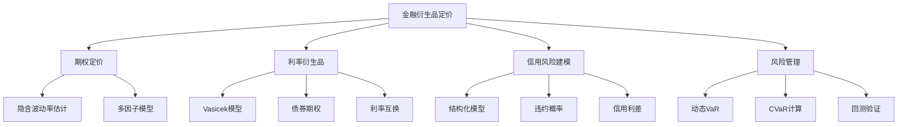

# 第13章：金融衍生品定价与风险管理

::: tip 学习目标
- 掌握卡尔曼滤波在期权定价中的应用
- 学习利率衍生品的动态建模方法
- 理解信用风险建模的卡尔曼滤波方法
- 掌握波动率建模与风险度量技术
- 实现衍生品定价的完整框架
:::

## 1. 期权定价中的卡尔曼滤波

### 1.1 隐含波动率的动态估计

期权定价中最关键的参数是波动率，我们可以使用卡尔曼滤波来动态估计隐含波动率：

```python
import numpy as np
import pandas as pd
from scipy.stats import norm
from scipy.optimize import minimize
import matplotlib.pyplot as plt
from filterpy.kalman import KalmanFilter
import warnings
warnings.filterwarnings('ignore')

class ImpliedVolatilityKF:
    """使用卡尔曼滤波估计隐含波动率"""

    def __init__(self, dt=1/252):
        self.dt = dt
        self.kf = KalmanFilter(dim_x=2, dim_z=1)

        # 状态转移矩阵: [vol, vol_change]
        self.kf.F = np.array([[1., dt],
                             [0., 1.]])

        # 观测矩阵：我们观测到期权价格
        self.kf.H = np.array([[1., 0.]])

        # 过程噪声协方差
        q = 0.001
        self.kf.Q = np.array([[q*dt**3/3, q*dt**2/2],
                             [q*dt**2/2, q*dt]])

        # 观测噪声
        self.kf.R = np.array([[0.01]])

        # 初始状态
        self.kf.x = np.array([[0.2], [0.0]])  # 初始波动率20%
        self.kf.P = np.eye(2) * 0.1

    def black_scholes_price(self, S, K, T, r, sigma, option_type='call'):
        """Black-Scholes期权定价公式"""
        d1 = (np.log(S/K) + (r + 0.5*sigma**2)*T) / (sigma*np.sqrt(T))
        d2 = d1 - sigma*np.sqrt(T)

        if option_type == 'call':
            price = S*norm.cdf(d1) - K*np.exp(-r*T)*norm.cdf(d2)
        else:
            price = K*np.exp(-r*T)*norm.cdf(-d2) - S*norm.cdf(-d1)

        return price

    def option_vega(self, S, K, T, r, sigma):
        """期权Vega值"""
        d1 = (np.log(S/K) + (r + 0.5*sigma**2)*T) / (sigma*np.sqrt(T))
        vega = S * norm.pdf(d1) * np.sqrt(T)
        return vega

    def update_volatility(self, market_price, S, K, T, r, option_type='call'):
        """更新波动率估计"""
        # 预测步骤
        self.kf.predict()

        # 当前波动率估计
        current_vol = max(self.kf.x[0, 0], 0.01)  # 避免负波动率

        # 理论期权价格
        theoretical_price = self.black_scholes_price(S, K, T, r, current_vol, option_type)

        # Vega用于线性化
        vega = self.option_vega(S, K, T, r, current_vol)

        # 价格差异转换为波动率差异
        vol_diff = (market_price - theoretical_price) / vega if vega > 0 else 0

        # 更新步骤
        self.kf.update(vol_diff)

        return self.kf.x[0, 0], theoretical_price

# 示例：动态隐含波动率估计
def demonstrate_implied_volatility():
    np.random.seed(42)

    # 模拟期权市场数据
    n_days = 100
    S0 = 100  # 股价
    K = 100   # 执行价
    T = 0.25  # 3个月到期
    r = 0.05  # 无风险利率

    # 真实波动率路径（随机游走）
    true_vol = np.zeros(n_days)
    true_vol[0] = 0.2
    for i in range(1, n_days):
        true_vol[i] = max(true_vol[i-1] + np.random.normal(0, 0.01), 0.05)

    # 模拟股价路径
    stock_prices = np.zeros(n_days)
    stock_prices[0] = S0
    for i in range(1, n_days):
        dt = 1/252
        stock_prices[i] = stock_prices[i-1] * np.exp(
            (r - 0.5*true_vol[i]**2)*dt + true_vol[i]*np.sqrt(dt)*np.random.normal()
        )

    # 生成市场期权价格（加入噪声）
    iv_kf = ImpliedVolatilityKF()
    estimated_vols = []
    theoretical_prices = []
    market_prices = []

    for i in range(n_days):
        S = stock_prices[i]
        T_remaining = T - i/252

        if T_remaining > 0:
            # 真实市场价格（用真实波动率计算+噪声）
            true_price = iv_kf.black_scholes_price(S, K, T_remaining, r, true_vol[i])
            market_price = true_price + np.random.normal(0, 0.1)

            # 卡尔曼滤波估计
            est_vol, theo_price = iv_kf.update_volatility(
                market_price, S, K, T_remaining, r
            )

            estimated_vols.append(est_vol)
            theoretical_prices.append(theo_price)
            market_prices.append(market_price)

    # 绘图
    fig, ((ax1, ax2), (ax3, ax4)) = plt.subplots(2, 2, figsize=(15, 10))

    # 股价走势
    ax1.plot(stock_prices[:len(estimated_vols)])
    ax1.set_title('股价走势')
    ax1.set_ylabel('股价')

    # 波动率估计
    ax2.plot(true_vol[:len(estimated_vols)], label='真实波动率', alpha=0.7)
    ax2.plot(estimated_vols, label='卡尔曼滤波估计', alpha=0.7)
    ax2.set_title('波动率估计')
    ax2.set_ylabel('波动率')
    ax2.legend()

    # 期权价格
    ax3.plot(market_prices, label='市场价格', alpha=0.7)
    ax3.plot(theoretical_prices, label='理论价格', alpha=0.7)
    ax3.set_title('期权价格')
    ax3.set_ylabel('价格')
    ax3.legend()

    # 估计误差
    vol_errors = np.array(estimated_vols) - true_vol[:len(estimated_vols)]
    ax4.plot(vol_errors)
    ax4.set_title('波动率估计误差')
    ax4.set_ylabel('误差')
    ax4.axhline(y=0, color='r', linestyle='--', alpha=0.5)

    plt.tight_layout()
    plt.show()

    # 计算性能指标
    mse = np.mean(vol_errors**2)
    mae = np.mean(np.abs(vol_errors))

    print(f"波动率估计性能:")
    print(f"MSE: {mse:.6f}")
    print(f"MAE: {mae:.6f}")

    return estimated_vols, true_vol[:len(estimated_vols)]

demonstrate_implied_volatility()
```

### 1.2 多因子期权定价模型

对于复杂的衍生品，我们需要考虑多个风险因子：

```python
class MultiFactorOptionKF:
    """多因子期权定价的卡尔曼滤波模型"""

    def __init__(self):
        # 状态向量: [spot_price, volatility, interest_rate, dividend_yield]
        self.n_factors = 4
        self.kf = KalmanFilter(dim_x=self.n_factors, dim_z=1)

        # 状态转移矩阵（简化的随机游走模型）
        dt = 1/252
        self.kf.F = np.eye(self.n_factors)

        # 观测矩阵：我们观测期权价格
        self.kf.H = np.array([[1., 0., 0., 0.]])

        # 过程噪声协方差
        q_spot = 0.01      # 股价噪声
        q_vol = 0.001      # 波动率噪声
        q_rate = 0.0001    # 利率噪声
        q_div = 0.0001     # 股息噪声

        self.kf.Q = np.diag([q_spot, q_vol, q_rate, q_div])

        # 观测噪声
        self.kf.R = np.array([[0.1]])

        # 初始状态
        self.kf.x = np.array([[100.], [0.2], [0.05], [0.02]])
        self.kf.P = np.eye(self.n_factors) * 0.1

    def european_option_price(self, S, K, T, r, q, sigma, option_type='call'):
        """考虑股息的欧式期权定价"""
        d1 = (np.log(S/K) + (r - q + 0.5*sigma**2)*T) / (sigma*np.sqrt(T))
        d2 = d1 - sigma*np.sqrt(T)

        if option_type == 'call':
            price = S*np.exp(-q*T)*norm.cdf(d1) - K*np.exp(-r*T)*norm.cdf(d2)
        else:
            price = K*np.exp(-r*T)*norm.cdf(-d2) - S*np.exp(-q*T)*norm.cdf(-d1)

        return price

    def update_factors(self, market_option_price, K, T, option_type='call'):
        """更新多因子估计"""
        # 预测步骤
        self.kf.predict()

        # 当前因子估计
        S = max(self.kf.x[0, 0], 1.0)      # 股价
        vol = max(self.kf.x[1, 0], 0.01)   # 波动率
        r = max(self.kf.x[2, 0], 0.0)      # 利率
        q = max(self.kf.x[3, 0], 0.0)      # 股息率

        # 理论期权价格
        theoretical_price = self.european_option_price(S, K, T, r, q, vol, option_type)

        # 价格残差
        price_residual = market_option_price - theoretical_price

        # 更新步骤（这里简化为只更新股价）
        self.kf.update([price_residual])

        return {
            'spot_price': self.kf.x[0, 0],
            'volatility': self.kf.x[1, 0],
            'interest_rate': self.kf.x[2, 0],
            'dividend_yield': self.kf.x[3, 0],
            'theoretical_price': theoretical_price
        }

# 示例：多因子期权定价
mf_option = MultiFactorOptionKF()
```

## 2. 利率衍生品建模

### 2.1 Vasicek利率模型的卡尔曼滤波实现

```python
class VasicekModelKF:
    """Vasicek利率模型的卡尔曼滤波实现"""

    def __init__(self, dt=1/252):
        self.dt = dt
        self.kf = KalmanFilter(dim_x=3, dim_z=1)

        # 状态向量: [r(t), theta, kappa] (利率, 长期均值, 均值回复速度)
        # 简化模型，假设sigma已知
        self.sigma = 0.02

        # Vasicek模型: dr = kappa*(theta - r)*dt + sigma*dW
        # 状态转移矩阵（线性化）
        self.kf.F = np.array([[1., 0., 0.],
                             [0., 1., 0.],
                             [0., 0., 1.]])

        # 观测矩阵：我们观测短期利率
        self.kf.H = np.array([[1., 0., 0.]])

        # 过程噪声协方差
        self.kf.Q = np.array([[self.sigma**2 * dt, 0., 0.],
                             [0., 1e-6, 0.],
                             [0., 0., 1e-6]])

        # 观测噪声
        self.kf.R = np.array([[1e-4]])

        # 初始状态
        self.kf.x = np.array([[0.05], [0.05], [0.5]])  # r=5%, theta=5%, kappa=0.5
        self.kf.P = np.eye(3) * 0.01

    def update_state_transition(self):
        """更新状态转移矩阵（考虑当前参数估计）"""
        r = self.kf.x[0, 0]
        theta = self.kf.x[1, 0]
        kappa = self.kf.x[2, 0]

        # 更新状态转移矩阵
        self.kf.F[0, 0] = 1 - kappa * self.dt
        self.kf.F[0, 1] = kappa * self.dt

    def zero_coupon_bond_price(self, T):
        """零息债券定价（Vasicek模型）"""
        r = self.kf.x[0, 0]
        theta = self.kf.x[1, 0]
        kappa = self.kf.x[2, 0]

        if kappa == 0:
            B_T = T
            A_T = -0.5 * self.sigma**2 * T**2
        else:
            B_T = (1 - np.exp(-kappa * T)) / kappa
            A_T = (theta - self.sigma**2 / (2 * kappa**2)) * (B_T - T) - \
                  (self.sigma**2 / (4 * kappa)) * B_T**2

        price = np.exp(A_T - B_T * r)
        return price

    def update_interest_rate(self, observed_rate):
        """更新利率估计"""
        # 更新状态转移矩阵
        self.update_state_transition()

        # 预测步骤
        self.kf.predict()

        # 更新步骤
        self.kf.update([observed_rate])

        return {
            'rate': self.kf.x[0, 0],
            'theta': self.kf.x[1, 0],
            'kappa': self.kf.x[2, 0]
        }

# 示例：利率期限结构建模
def demonstrate_yield_curve_modeling():
    np.random.seed(42)

    # 模拟Vasicek过程
    n_days = 252
    dt = 1/252
    true_kappa = 0.3
    true_theta = 0.04
    true_sigma = 0.02

    # 真实利率路径
    rates = np.zeros(n_days)
    rates[0] = 0.03

    for i in range(1, n_days):
        dr = true_kappa * (true_theta - rates[i-1]) * dt + \
             true_sigma * np.sqrt(dt) * np.random.normal()
        rates[i] = rates[i-1] + dr

    # 卡尔曼滤波估计
    vasicek_kf = VasicekModelKF()
    estimated_params = []

    for rate in rates:
        # 添加观测噪声
        observed_rate = rate + np.random.normal(0, 0.001)
        params = vasicek_kf.update_interest_rate(observed_rate)
        estimated_params.append(params)

    # 提取估计的参数
    estimated_rates = [p['rate'] for p in estimated_params]
    estimated_kappa = [p['kappa'] for p in estimated_params]
    estimated_theta = [p['theta'] for p in estimated_params]

    # 绘图
    fig, ((ax1, ax2), (ax3, ax4)) = plt.subplots(2, 2, figsize=(15, 10))

    # 利率路径
    ax1.plot(rates, label='真实利率', alpha=0.7)
    ax1.plot(estimated_rates, label='估计利率', alpha=0.7)
    ax1.set_title('利率路径')
    ax1.set_ylabel('利率')
    ax1.legend()

    # 均值回复速度
    ax2.plot([true_kappa] * len(estimated_kappa), label=f'真实kappa={true_kappa}', alpha=0.7)
    ax2.plot(estimated_kappa, label='估计kappa', alpha=0.7)
    ax2.set_title('均值回复速度 (kappa)')
    ax2.set_ylabel('kappa')
    ax2.legend()

    # 长期均值
    ax3.plot([true_theta] * len(estimated_theta), label=f'真实theta={true_theta}', alpha=0.7)
    ax3.plot(estimated_theta, label='估计theta', alpha=0.7)
    ax3.set_title('长期均值 (theta)')
    ax3.set_ylabel('theta')
    ax3.legend()

    # 参数估计误差
    kappa_errors = np.array(estimated_kappa) - true_kappa
    theta_errors = np.array(estimated_theta) - true_theta

    ax4.plot(kappa_errors, label='kappa误差', alpha=0.7)
    ax4.plot(theta_errors, label='theta误差', alpha=0.7)
    ax4.set_title('参数估计误差')
    ax4.set_ylabel('误差')
    ax4.axhline(y=0, color='r', linestyle='--', alpha=0.5)
    ax4.legend()

    plt.tight_layout()
    plt.show()

    # 计算收敛性能
    final_kappa_error = abs(estimated_kappa[-1] - true_kappa)
    final_theta_error = abs(estimated_theta[-1] - true_theta)

    print(f"参数估计性能:")
    print(f"Kappa最终误差: {final_kappa_error:.4f}")
    print(f"Theta最终误差: {final_theta_error:.4f}")

demonstrate_yield_curve_modeling()
```

### 2.2 利率衍生品定价

```python
class InterestRateDerivativesPricer:
    """利率衍生品定价器"""

    def __init__(self, vasicek_model):
        self.model = vasicek_model

    def bond_option_price(self, T_option, T_bond, K, option_type='call'):
        """债券期权定价（Vasicek模型下的解析解）"""
        r = self.model.kf.x[0, 0]
        theta = self.model.kf.x[1, 0]
        kappa = self.model.kf.x[2, 0]
        sigma = self.model.sigma

        # 债券期权定价参数
        P_T = self.model.zero_coupon_bond_price(T_bond)
        P_t = self.model.zero_coupon_bond_price(T_option)

        if kappa == 0:
            v = sigma**2 * T_option * (T_bond - T_option)**2 / 3
        else:
            B_T = (1 - np.exp(-kappa * (T_bond - T_option))) / kappa
            v = (sigma**2 / (2 * kappa**2)) * B_T**2 * (1 - np.exp(-2 * kappa * T_option))

        if v <= 0:
            return 0

        h = (1 / np.sqrt(v)) * np.log(P_T / (P_t * K))

        if option_type == 'call':
            price = P_T * norm.cdf(h + 0.5 * np.sqrt(v)) - K * P_t * norm.cdf(h - 0.5 * np.sqrt(v))
        else:
            price = K * P_t * norm.cdf(-h + 0.5 * np.sqrt(v)) - P_T * norm.cdf(-h - 0.5 * np.sqrt(v))

        return price

    def interest_rate_swap_value(self, swap_rate, tenor_years, payment_freq=2):
        """利率互换价值计算"""
        # 计算固定腿和浮动腿的现值
        n_payments = int(tenor_years * payment_freq)
        payment_dates = np.array([i/payment_freq for i in range(1, n_payments + 1)])

        # 固定腿现值
        fixed_leg_pv = 0
        for t in payment_dates:
            bond_price = self.model.zero_coupon_bond_price(t)
            fixed_leg_pv += swap_rate * bond_price / payment_freq

        # 浮动腿现值（近似计算）
        current_rate = self.model.kf.x[0, 0]
        floating_leg_pv = 0
        for t in payment_dates:
            bond_price = self.model.zero_coupon_bond_price(t)
            floating_leg_pv += current_rate * bond_price / payment_freq

        # 互换价值（接受固定支付浮动的视角）
        swap_value = floating_leg_pv - fixed_leg_pv

        return {
            'swap_value': swap_value,
            'fixed_leg_pv': fixed_leg_pv,
            'floating_leg_pv': floating_leg_pv
        }

# 示例：利率衍生品定价
vasicek_model = VasicekModelKF()
derivatives_pricer = InterestRateDerivativesPricer(vasicek_model)

# 更新模型参数
vasicek_model.update_interest_rate(0.03)

# 债券期权定价
bond_option_price = derivatives_pricer.bond_option_price(
    T_option=0.25,  # 3个月期权
    T_bond=2.0,     # 2年期债券
    K=0.95,         # 执行价格
    option_type='call'
)

print(f"债券看涨期权价格: {bond_option_price:.4f}")

# 利率互换估值
swap_value = derivatives_pricer.interest_rate_swap_value(
    swap_rate=0.04,    # 4%固定利率
    tenor_years=5,     # 5年期
    payment_freq=2     # 半年付息
)

print(f"利率互换价值: {swap_value['swap_value']:.4f}")
print(f"固定腿现值: {swap_value['fixed_leg_pv']:.4f}")
print(f"浮动腿现值: {swap_value['floating_leg_pv']:.4f}")
```

## 3. 信用风险建模

### 3.1 结构化信用风险模型

```python
class StructuralCreditRiskKF:
    """结构化信用风险模型（Merton模型扩展）"""

    def __init__(self, dt=1/252):
        self.dt = dt
        # 状态向量: [asset_value, asset_volatility, default_barrier]
        self.kf = KalmanFilter(dim_x=3, dim_z=2)

        # 状态转移矩阵
        self.kf.F = np.eye(3)

        # 观测矩阵：我们观测股价和债券价格
        self.kf.H = np.array([[1., 0., 0.],   # 资产价值影响股价
                             [1., 0., -1.]])  # 资产价值减去违约边界影响债券价格

        # 过程噪声协方差
        asset_vol_noise = 0.01
        vol_vol_noise = 0.001
        barrier_noise = 0.001

        self.kf.Q = np.diag([asset_vol_noise, vol_vol_noise, barrier_noise])

        # 观测噪声
        self.kf.R = np.diag([0.01, 0.005])  # 股价和债券价格噪声

        # 初始状态
        self.kf.x = np.array([[100.], [0.3], [50.]])  # 资产价值, 波动率, 违约边界
        self.kf.P = np.eye(3) * 0.1

    def merton_equity_value(self, asset_value, debt_value, T, r, asset_vol):
        """Merton模型权益价值"""
        d1 = (np.log(asset_value/debt_value) + (r + 0.5*asset_vol**2)*T) / (asset_vol*np.sqrt(T))
        d2 = d1 - asset_vol*np.sqrt(T)

        equity_value = asset_value*norm.cdf(d1) - debt_value*np.exp(-r*T)*norm.cdf(d2)
        return max(equity_value, 0)

    def merton_debt_value(self, asset_value, debt_value, T, r, asset_vol):
        """Merton模型债务价值"""
        d1 = (np.log(asset_value/debt_value) + (r + 0.5*asset_vol**2)*T) / (asset_vol*np.sqrt(T))
        d2 = d1 - asset_vol*np.sqrt(T)

        debt_value_current = debt_value*np.exp(-r*T)*norm.cdf(d2) + \
                           asset_value*norm.cdf(-d1)
        return debt_value_current

    def default_probability(self, T, r):
        """违约概率计算"""
        asset_value = self.kf.x[0, 0]
        asset_vol = self.kf.x[1, 0]
        barrier = self.kf.x[2, 0]

        # 使用首次通过时间方法
        mu = r - 0.5*asset_vol**2

        if asset_value <= barrier:
            return 1.0

        # 违约概率近似公式
        d = (np.log(asset_value/barrier) + mu*T) / (asset_vol*np.sqrt(T))

        prob = norm.cdf(-d) + (barrier/asset_value)**(2*mu/asset_vol**2) * norm.cdf(
            -d + 2*mu*np.sqrt(T)/asset_vol
        )

        return min(prob, 1.0)

    def credit_spread(self, face_value, T, r):
        """信用利差计算"""
        asset_value = self.kf.x[0, 0]
        asset_vol = self.kf.x[1, 0]

        # 风险债券价值
        risky_bond_value = self.merton_debt_value(asset_value, face_value, T, r, asset_vol)

        # 无风险债券价值
        risk_free_bond = face_value * np.exp(-r*T)

        # 信用利差
        if risky_bond_value > 0:
            spread = -np.log(risky_bond_value/risk_free_bond) / T - r
        else:
            spread = float('inf')

        return max(spread, 0)

    def update_credit_model(self, stock_price, bond_price, face_value, T, r):
        """更新信用风险模型"""
        # 预测步骤
        self.kf.predict()

        # 当前状态估计
        asset_value = self.kf.x[0, 0]
        asset_vol = self.kf.x[1, 0]

        # 理论股价和债券价格
        theoretical_equity = self.merton_equity_value(asset_value, face_value, T, r, asset_vol)
        theoretical_debt = self.merton_debt_value(asset_value, face_value, T, r, asset_vol)

        # 观测向量
        observations = np.array([stock_price - theoretical_equity,
                               bond_price - theoretical_debt])

        # 更新步骤
        self.kf.update(observations)

        return {
            'asset_value': self.kf.x[0, 0],
            'asset_volatility': self.kf.x[1, 0],
            'default_barrier': self.kf.x[2, 0],
            'default_probability': self.default_probability(T, r),
            'credit_spread': self.credit_spread(face_value, T, r)
        }

# 示例：信用风险建模
def demonstrate_credit_risk_modeling():
    np.random.seed(42)

    # 模拟公司资产价值路径
    n_days = 252
    initial_asset_value = 100
    asset_vol = 0.3
    r = 0.05
    dt = 1/252

    # 真实资产价值路径
    asset_values = np.zeros(n_days)
    asset_values[0] = initial_asset_value

    for i in range(1, n_days):
        dA = asset_values[i-1] * (r*dt + asset_vol*np.sqrt(dt)*np.random.normal())
        asset_values[i] = asset_values[i-1] + dA

    # 债务面值和期限
    face_value = 70
    T = 1.0  # 1年期债务

    # 信用风险模型
    credit_model = StructuralCreditRiskKF()

    # 模拟观测数据
    results = []

    for i, true_asset_value in enumerate(asset_values):
        T_remaining = T - i/252

        if T_remaining > 0:
            # 生成"观测"的股价和债券价格
            true_equity = credit_model.merton_equity_value(
                true_asset_value, face_value, T_remaining, r, asset_vol
            )
            true_debt = credit_model.merton_debt_value(
                true_asset_value, face_value, T_remaining, r, asset_vol
            )

            # 添加观测噪声
            observed_stock = true_equity + np.random.normal(0, 0.5)
            observed_bond = true_debt + np.random.normal(0, 0.2)

            # 更新模型
            result = credit_model.update_credit_model(
                observed_stock, observed_bond, face_value, T_remaining, r
            )

            result['true_asset_value'] = true_asset_value
            result['day'] = i
            results.append(result)

    # 提取结果
    days = [r['day'] for r in results]
    estimated_assets = [r['asset_value'] for r in results]
    true_assets = [r['true_asset_value'] for r in results]
    default_probs = [r['default_probability'] for r in results]
    credit_spreads = [r['credit_spread'] for r in results]

    # 绘图
    fig, ((ax1, ax2), (ax3, ax4)) = plt.subplots(2, 2, figsize=(15, 10))

    # 资产价值估计
    ax1.plot(days, true_assets, label='真实资产价值', alpha=0.7)
    ax1.plot(days, estimated_assets, label='估计资产价值', alpha=0.7)
    ax1.axhline(y=face_value, color='r', linestyle='--', label='债务面值', alpha=0.5)
    ax1.set_title('资产价值估计')
    ax1.set_ylabel('价值')
    ax1.legend()

    # 违约概率
    ax2.plot(days, default_probs)
    ax2.set_title('违约概率')
    ax2.set_ylabel('概率')
    ax2.set_ylim(0, 1)

    # 信用利差
    ax3.plot(days, credit_spreads)
    ax3.set_title('信用利差 (bp)')
    ax3.set_ylabel('利差')

    # 资产价值估计误差
    asset_errors = np.array(estimated_assets) - np.array(true_assets)
    ax4.plot(days, asset_errors)
    ax4.set_title('资产价值估计误差')
    ax4.set_ylabel('误差')
    ax4.axhline(y=0, color='r', linestyle='--', alpha=0.5)

    plt.tight_layout()
    plt.show()

    # 计算性能指标
    final_default_prob = default_probs[-1] if default_probs else 0
    avg_credit_spread = np.mean(credit_spreads) if credit_spreads else 0
    asset_rmse = np.sqrt(np.mean(asset_errors**2))

    print(f"信用风险建模结果:")
    print(f"最终违约概率: {final_default_prob:.4f}")
    print(f"平均信用利差: {avg_credit_spread:.4f}")
    print(f"资产价值估计RMSE: {asset_rmse:.4f}")

demonstrate_credit_risk_modeling()
```

## 4. 风险度量与管理

### 4.1 动态VaR计算

```python
class DynamicVaRKF:
    """动态VaR计算的卡尔曼滤波模型"""

    def __init__(self, confidence_level=0.05):
        self.confidence_level = confidence_level
        # 状态向量: [return, volatility]
        self.kf = KalmanFilter(dim_x=2, dim_z=1)

        dt = 1/252

        # 状态转移矩阵
        self.kf.F = np.array([[0., 0.],      # 收益率为白噪声
                             [0., 1.]])      # 波动率为随机游走

        # 观测矩阵：我们观测收益率
        self.kf.H = np.array([[1., 0.]])

        # 过程噪声协方差
        vol_of_vol = 0.1  # 波动率的波动率
        self.kf.Q = np.array([[0.01, 0.],
                             [0., vol_of_vol**2 * dt]])

        # 观测噪声（很小，因为我们相信观测到的收益率）
        self.kf.R = np.array([[1e-6]])

        # 初始状态
        self.kf.x = np.array([[0.], [0.02]])  # 初始收益率0%，波动率2%
        self.kf.P = np.eye(2) * 0.01

    def update_volatility(self, return_):
        """更新波动率估计"""
        # 预测步骤
        self.kf.predict()

        # 更新步骤
        self.kf.update([return_])

        # 从收益率更新波动率（通过残差平方）
        residual = return_ - self.kf.x[0, 0]
        self.kf.x[1, 0] = 0.95 * self.kf.x[1, 0] + 0.05 * abs(residual)

        return {
            'expected_return': self.kf.x[0, 0],
            'volatility': self.kf.x[1, 0]
        }

    def calculate_var(self, portfolio_value, holding_period=1):
        """计算VaR"""
        expected_return = self.kf.x[0, 0]
        volatility = self.kf.x[1, 0]

        # 调整到持有期
        period_return = expected_return * holding_period
        period_vol = volatility * np.sqrt(holding_period)

        # VaR计算（正态分布假设）
        var_percentile = norm.ppf(self.confidence_level)
        var_amount = portfolio_value * (var_percentile * period_vol - period_return)

        return {
            'var_amount': var_amount,
            'var_percentage': var_amount / portfolio_value,
            'expected_return': period_return,
            'volatility': period_vol
        }

    def calculate_conditional_var(self, portfolio_value, holding_period=1):
        """计算条件VaR (CVaR/Expected Shortfall)"""
        var_result = self.calculate_var(portfolio_value, holding_period)

        expected_return = var_result['expected_return']
        volatility = var_result['volatility']

        # CVaR计算
        var_percentile = norm.ppf(self.confidence_level)
        phi_var = norm.pdf(var_percentile)

        cvar_multiplier = phi_var / self.confidence_level
        cvar_amount = portfolio_value * (cvar_multiplier * volatility - expected_return)

        return {
            'cvar_amount': cvar_amount,
            'cvar_percentage': cvar_amount / portfolio_value,
            'var_amount': var_result['var_amount']
        }

# 示例：动态VaR计算
def demonstrate_dynamic_var():
    np.random.seed(42)

    # 模拟股票收益率数据
    n_days = 500
    true_vol = 0.02
    returns = []

    # GARCH-like模拟
    for i in range(n_days):
        if i == 0:
            vol_t = true_vol
        else:
            # 波动率聚集效应
            vol_t = 0.95 * vol_t + 0.05 * abs(returns[-1]) + 0.01 * np.random.normal()

        return_t = np.random.normal(0, vol_t)
        returns.append(return_t)

    # 投资组合价值
    portfolio_value = 1000000  # 100万

    # 动态VaR模型
    var_model = DynamicVaRKF(confidence_level=0.05)  # 95% VaR

    # 计算动态VaR
    var_results = []
    cvar_results = []
    volatility_estimates = []

    for return_ in returns:
        # 更新模型
        vol_result = var_model.update_volatility(return_)
        volatility_estimates.append(vol_result['volatility'])

        # 计算VaR和CVaR
        var_result = var_model.calculate_var(portfolio_value)
        cvar_result = var_model.calculate_conditional_var(portfolio_value)

        var_results.append(var_result['var_amount'])
        cvar_results.append(cvar_result['cvar_amount'])

    # 计算实际损失（用于回测）
    portfolio_returns = np.array(returns) * portfolio_value
    actual_losses = -portfolio_returns  # 负收益为损失

    # VaR回测
    var_breaches = actual_losses > np.array(var_results)
    var_breach_rate = np.mean(var_breaches)
    expected_breach_rate = 0.05

    # 绘图
    fig, ((ax1, ax2), (ax3, ax4)) = plt.subplots(2, 2, figsize=(15, 12))

    # 收益率和波动率
    ax1.plot(returns, alpha=0.7, label='收益率')
    ax1_twin = ax1.twinx()
    ax1_twin.plot(volatility_estimates, color='red', alpha=0.7, label='估计波动率')
    ax1.set_title('收益率与波动率估计')
    ax1.set_ylabel('收益率')
    ax1_twin.set_ylabel('波动率')
    ax1.legend(loc='upper left')
    ax1_twin.legend(loc='upper right')

    # VaR和CVaR
    ax2.plot(var_results, label='VaR (95%)', alpha=0.7)
    ax2.plot(cvar_results, label='CVaR (95%)', alpha=0.7)
    ax2.set_title('动态风险度量')
    ax2.set_ylabel('风险金额')
    ax2.legend()

    # VaR回测
    ax3.plot(actual_losses, alpha=0.5, label='实际损失')
    ax3.plot(var_results, color='red', label='VaR阈值', alpha=0.7)
    breach_points = np.where(var_breaches)[0]
    ax3.scatter(breach_points, actual_losses[breach_points],
               color='red', s=20, label='VaR突破点')
    ax3.set_title(f'VaR回测 (突破率: {var_breach_rate:.2%})')
    ax3.set_ylabel('损失金额')
    ax3.legend()

    # 突破率统计
    window_size = 50
    rolling_breach_rates = []
    for i in range(window_size, len(var_breaches)):
        window_breaches = var_breaches[i-window_size:i]
        rolling_breach_rates.append(np.mean(window_breaches))

    ax4.plot(rolling_breach_rates, alpha=0.7)
    ax4.axhline(y=expected_breach_rate, color='red', linestyle='--',
               label=f'期望突破率: {expected_breach_rate:.1%}')
    ax4.set_title('滚动VaR突破率')
    ax4.set_ylabel('突破率')
    ax4.legend()

    plt.tight_layout()
    plt.show()

    # 统计结果
    print(f"VaR回测结果:")
    print(f"总观测数: {len(var_breaches)}")
    print(f"VaR突破次数: {np.sum(var_breaches)}")
    print(f"实际突破率: {var_breach_rate:.2%}")
    print(f"期望突破率: {expected_breach_rate:.1%}")

    # Kupiec测试（似然比测试）
    n = len(var_breaches)
    x = np.sum(var_breaches)
    p = expected_breach_rate

    if x > 0 and x < n:
        lr_stat = 2 * (x * np.log(var_breach_rate/p) + (n-x) * np.log((1-var_breach_rate)/(1-p)))
        print(f"Kupiec LR统计量: {lr_stat:.4f}")
        print(f"临界值 (5%): 3.841")
        print(f"VaR模型是否通过测试: {'是' if lr_stat < 3.841 else '否'}")

demonstrate_dynamic_var()
```

## 本章小结

本章深入探讨了卡尔曼滤波在金融衍生品定价与风险管理中的应用：

1. **期权定价应用**：
   - 动态隐含波动率估计
   - 多因子期权定价模型
   - Black-Scholes模型的扩展

2. **利率衍生品建模**：
   - Vasicek利率模型实现
   - 利率期限结构建模
   - 债券期权和利率互换定价

3. **信用风险建模**：
   - 结构化信用风险模型
   - Merton模型的卡尔曼滤波实现
   - 违约概率和信用利差计算

4. **风险度量与管理**：
   - 动态VaR计算
   - 条件VaR（CVaR）估计
   - VaR模型回测方法

这些应用展示了卡尔曼滤波在处理金融衍生品复杂性方面的强大能力，特别是在参数时变和不确定性量化方面的优势。

---

**下一章预告**：第14章将学习"算法交易与高频数据处理"，探讨卡尔曼滤波在高频交易、市场微观结构建模和实时风险管理中的应用。

