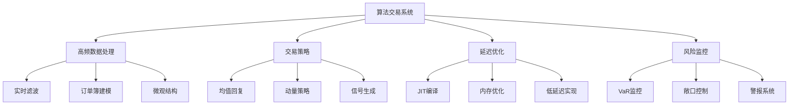

# 第14章：算法交易与高频数据处理

::: tip 学习目标
- 掌握卡尔曼滤波在高频交易中的实时应用
- 学习市场微观结构建模方法
- 理解订单簿动态与价格发现机制
- 掌握延迟敏感的算法交易策略
- 实现高性能的实时数据处理系统
:::

## 1. 高频数据的实时处理

### 1.1 实时价格滤波与降噪

高频交易中，价格数据包含大量噪声，需要实时滤波处理：

```python
import numpy as np
import pandas as pd
from collections import deque
import time
from threading import Thread, Lock
import matplotlib.pyplot as plt
from filterpy.kalman import KalmanFilter
import warnings
warnings.filterwarnings('ignore')

class RealTimePriceFilter:
    """实时价格滤波器"""

    def __init__(self, alpha=0.1, beta=0.01):
        self.alpha = alpha  # 价格平滑参数
        self.beta = beta    # 趋势平滑参数

        # 卡尔曼滤波器设置
        self.kf = KalmanFilter(dim_x=3, dim_z=1)

        # 状态向量: [price, velocity, acceleration]
        dt = 0.001  # 1毫秒

        # 状态转移矩阵
        self.kf.F = np.array([[1., dt, 0.5*dt**2],
                             [0., 1., dt],
                             [0., 0., 1.]])

        # 观测矩阵
        self.kf.H = np.array([[1., 0., 0.]])

        # 过程噪声协方差
        q = 0.01
        self.kf.Q = np.array([[q*dt**4/4, q*dt**3/2, q*dt**2/2],
                             [q*dt**3/2, q*dt**2, q*dt],
                             [q*dt**2/2, q*dt, q]])

        # 观测噪声
        self.kf.R = np.array([[0.001]])

        # 初始状态
        self.kf.x = np.array([[100.], [0.], [0.]])
        self.kf.P = np.eye(3) * 0.1

        # 数据存储
        self.raw_prices = deque(maxlen=1000)
        self.filtered_prices = deque(maxlen=1000)
        self.timestamps = deque(maxlen=1000)

        # 线程安全
        self.lock = Lock()

    def update_price(self, price, timestamp=None):
        """更新价格数据"""
        if timestamp is None:
            timestamp = time.time()

        with self.lock:
            # 预测步骤
            self.kf.predict()

            # 更新步骤
            self.kf.update([price])

            # 存储数据
            self.raw_prices.append(price)
            self.filtered_prices.append(self.kf.x[0, 0])
            self.timestamps.append(timestamp)

        return {
            'filtered_price': self.kf.x[0, 0],
            'velocity': self.kf.x[1, 0],
            'acceleration': self.kf.x[2, 0],
            'raw_price': price
        }

    def get_current_estimate(self):
        """获取当前估计"""
        with self.lock:
            return {
                'price': self.kf.x[0, 0],
                'velocity': self.kf.x[1, 0],
                'acceleration': self.kf.x[2, 0]
            }

    def get_price_trend(self, lookback=50):
        """获取价格趋势"""
        with self.lock:
            if len(self.filtered_prices) < lookback:
                return 0

            recent_prices = list(self.filtered_prices)[-lookback:]
            return (recent_prices[-1] - recent_prices[0]) / len(recent_prices)

# 实时数据流模拟器
class HighFrequencyDataSimulator:
    """高频数据模拟器"""

    def __init__(self, initial_price=100, volatility=0.02):
        self.current_price = initial_price
        self.volatility = volatility
        self.is_running = False
        self.subscribers = []

    def add_subscriber(self, callback):
        """添加数据订阅者"""
        self.subscribers.append(callback)

    def start_simulation(self, duration=60, tick_interval=0.001):
        """开始数据模拟"""
        self.is_running = True

        def simulate():
            start_time = time.time()
            tick_count = 0

            while self.is_running and (time.time() - start_time) < duration:
                # 生成价格变化
                dt = tick_interval
                price_change = np.random.normal(0, self.volatility * np.sqrt(dt))

                # 添加微观结构噪声
                microstructure_noise = np.random.normal(0, 0.001)

                # 添加跳跃
                if np.random.random() < 0.001:  # 0.1%概率的跳跃
                    jump = np.random.normal(0, 0.01)
                    price_change += jump

                self.current_price += price_change
                noisy_price = self.current_price + microstructure_noise

                # 通知订阅者
                timestamp = time.time()
                for callback in self.subscribers:
                    callback(noisy_price, timestamp)

                tick_count += 1
                time.sleep(tick_interval)

        # 在新线程中运行模拟
        self.simulation_thread = Thread(target=simulate)
        self.simulation_thread.start()

    def stop_simulation(self):
        """停止模拟"""
        self.is_running = False
        if hasattr(self, 'simulation_thread'):
            self.simulation_thread.join()

# 示例：实时价格滤波
def demonstrate_realtime_filtering():
    print("开始实时价格滤波演示...")

    # 创建价格滤波器
    price_filter = RealTimePriceFilter()

    # 创建数据模拟器
    data_simulator = HighFrequencyDataSimulator(initial_price=100, volatility=0.02)

    # 数据收集
    results = []

    def price_callback(price, timestamp):
        result = price_filter.update_price(price, timestamp)
        results.append({
            'timestamp': timestamp,
            'raw_price': price,
            'filtered_price': result['filtered_price'],
            'velocity': result['velocity'],
            'acceleration': result['acceleration']
        })

    # 添加回调函数
    data_simulator.add_subscriber(price_callback)

    # 运行模拟
    data_simulator.start_simulation(duration=10, tick_interval=0.001)

    # 等待模拟完成
    time.sleep(11)
    data_simulator.stop_simulation()

    print(f"收集到 {len(results)} 个数据点")

    # 转换为DataFrame进行分析
    df = pd.DataFrame(results)
    df['timestamp'] = pd.to_datetime(df['timestamp'], unit='s')

    # 绘图
    fig, ((ax1, ax2), (ax3, ax4)) = plt.subplots(2, 2, figsize=(15, 10))

    # 原始价格 vs 滤波价格
    ax1.plot(df.index, df['raw_price'], alpha=0.3, label='原始价格')
    ax1.plot(df.index, df['filtered_price'], label='滤波价格', linewidth=2)
    ax1.set_title('价格滤波效果')
    ax1.set_ylabel('价格')
    ax1.legend()

    # 价格速度
    ax2.plot(df.index, df['velocity'])
    ax2.set_title('价格变化速度')
    ax2.set_ylabel('速度')
    ax2.axhline(y=0, color='r', linestyle='--', alpha=0.5)

    # 价格加速度
    ax3.plot(df.index, df['acceleration'])
    ax3.set_title('价格加速度')
    ax3.set_ylabel('加速度')
    ax3.axhline(y=0, color='r', linestyle='--', alpha=0.5)

    # 滤波效果统计
    noise_reduction = np.std(df['raw_price']) / np.std(df['filtered_price'])
    correlation = np.corrcoef(df['raw_price'], df['filtered_price'])[0, 1]

    ax4.text(0.1, 0.8, f'噪声降低倍数: {noise_reduction:.2f}', transform=ax4.transAxes)
    ax4.text(0.1, 0.7, f'相关系数: {correlation:.4f}', transform=ax4.transAxes)
    ax4.text(0.1, 0.6, f'数据点数: {len(df)}', transform=ax4.transAxes)
    ax4.text(0.1, 0.5, f'处理频率: {len(df)/10:.0f} Hz', transform=ax4.transAxes)
    ax4.set_title('滤波性能统计')
    ax4.set_xlim(0, 1)
    ax4.set_ylim(0, 1)

    plt.tight_layout()
    plt.show()

    return df

# 运行演示
filtered_data = demonstrate_realtime_filtering()
```

### 1.2 订单簿动态建模

```python
class OrderBookKalmanFilter:
    """订单簿动态建模的卡尔曼滤波器"""

    def __init__(self):
        # 状态向量: [mid_price, spread, imbalance, volatility]
        self.kf = KalmanFilter(dim_x=4, dim_z=3)

        dt = 0.001  # 1毫秒

        # 状态转移矩阵
        self.kf.F = np.array([[1., 0., 0., 0.],    # 中间价
                             [0., 0.9, 0., 0.],   # 价差（均值回复）
                             [0., 0., 0.8, 0.],   # 失衡（均值回复）
                             [0., 0., 0., 0.95]]) # 波动率（持续性）

        # 观测矩阵：观测买卖价格和交易量失衡
        self.kf.H = np.array([[1., 0.5, 0., 0.],   # 买价 = 中间价 + 价差/2
                             [1., -0.5, 0., 0.],   # 卖价 = 中间价 - 价差/2
                             [0., 0., 1., 0.]])    # 失衡直接观测

        # 过程噪声协方差
        self.kf.Q = np.diag([0.001, 0.0001, 0.01, 0.0001])

        # 观测噪声协方差
        self.kf.R = np.diag([0.001, 0.001, 0.01])

        # 初始状态
        self.kf.x = np.array([[100.], [0.01], [0.], [0.02]])
        self.kf.P = np.eye(4) * 0.01

        # 订单簿数据
        self.bid_prices = deque(maxlen=100)
        self.ask_prices = deque(maxlen=100)
        self.bid_sizes = deque(maxlen=100)
        self.ask_sizes = deque(maxlen=100)

    def calculate_imbalance(self, bid_size, ask_size):
        """计算订单簿失衡"""
        total_size = bid_size + ask_size
        if total_size == 0:
            return 0
        return (bid_size - ask_size) / total_size

    def update_order_book(self, bid_price, ask_price, bid_size, ask_size):
        """更新订单簿状态"""
        # 计算观测值
        imbalance = self.calculate_imbalance(bid_size, ask_size)

        # 存储历史数据
        self.bid_prices.append(bid_price)
        self.ask_prices.append(ask_price)
        self.bid_sizes.append(bid_size)
        self.ask_sizes.append(ask_size)

        # 卡尔曼滤波更新
        self.kf.predict()

        observations = np.array([bid_price, ask_price, imbalance])
        self.kf.update(observations)

        return {
            'mid_price': self.kf.x[0, 0],
            'spread': self.kf.x[1, 0],
            'imbalance': self.kf.x[2, 0],
            'volatility': self.kf.x[3, 0]
        }

    def predict_next_price(self, horizon=1):
        """预测下一个价格"""
        # 临时复制滤波器状态
        temp_x = self.kf.x.copy()
        temp_P = self.kf.P.copy()

        # 多步预测
        for _ in range(horizon):
            temp_x = self.kf.F @ temp_x
            temp_P = self.kf.F @ temp_P @ self.kf.F.T + self.kf.Q

        predicted_mid = temp_x[0, 0]
        predicted_spread = temp_x[1, 0]

        return {
            'predicted_mid': predicted_mid,
            'predicted_bid': predicted_mid - predicted_spread/2,
            'predicted_ask': predicted_mid + predicted_spread/2,
            'prediction_uncertainty': np.sqrt(temp_P[0, 0])
        }

# 订单簿模拟器
class OrderBookSimulator:
    """订单簿数据模拟器"""

    def __init__(self, initial_price=100):
        self.mid_price = initial_price
        self.spread = 0.01
        self.is_running = False

    def generate_order_book(self):
        """生成订单簿数据"""
        # 价格变化
        price_change = np.random.normal(0, 0.001)
        self.mid_price += price_change

        # 动态价差
        spread_change = np.random.normal(0, 0.0001)
        self.spread = max(0.005, self.spread + spread_change)

        # 生成买卖价格
        bid_price = self.mid_price - self.spread/2
        ask_price = self.mid_price + self.spread/2

        # 生成订单大小（与失衡相关）
        base_size = 1000
        imbalance_factor = np.random.normal(0, 0.2)

        if imbalance_factor > 0:  # 买方压力
            bid_size = base_size * (1 + abs(imbalance_factor))
            ask_size = base_size * (1 - abs(imbalance_factor)/2)
        else:  # 卖方压力
            bid_size = base_size * (1 - abs(imbalance_factor)/2)
            ask_size = base_size * (1 + abs(imbalance_factor))

        return {
            'bid_price': bid_price,
            'ask_price': ask_price,
            'bid_size': max(100, bid_size),
            'ask_size': max(100, ask_size),
            'true_mid': self.mid_price,
            'true_spread': self.spread
        }

# 示例：订单簿动态建模
def demonstrate_order_book_modeling():
    print("开始订单簿动态建模演示...")

    # 创建订单簿滤波器和模拟器
    ob_filter = OrderBookKalmanFilter()
    ob_simulator = OrderBookSimulator(initial_price=100)

    # 数据收集
    results = []
    predictions = []

    # 模拟数据生成和处理
    for i in range(1000):
        # 生成订单簿数据
        ob_data = ob_simulator.generate_order_book()

        # 更新滤波器
        state = ob_filter.update_order_book(
            ob_data['bid_price'],
            ob_data['ask_price'],
            ob_data['bid_size'],
            ob_data['ask_size']
        )

        # 价格预测
        prediction = ob_filter.predict_next_price(horizon=5)

        # 存储结果
        result = {**ob_data, **state, 'step': i}
        results.append(result)
        predictions.append({**prediction, 'step': i})

    # 转换为DataFrame
    df_results = pd.DataFrame(results)
    df_predictions = pd.DataFrame(predictions)

    # 绘图分析
    fig, ((ax1, ax2), (ax3, ax4)) = plt.subplots(2, 2, figsize=(15, 10))

    # 价格跟踪
    ax1.plot(df_results['step'], df_results['true_mid'], label='真实中间价', alpha=0.7)
    ax1.plot(df_results['step'], df_results['mid_price'], label='估计中间价', alpha=0.7)
    ax1.fill_between(df_results['step'],
                     df_results['bid_price'],
                     df_results['ask_price'],
                     alpha=0.3, label='买卖价差')
    ax1.set_title('中间价格跟踪')
    ax1.set_ylabel('价格')
    ax1.legend()

    # 价差估计
    ax2.plot(df_results['step'], df_results['true_spread'], label='真实价差', alpha=0.7)
    ax2.plot(df_results['step'], df_results['spread'], label='估计价差', alpha=0.7)
    ax2.set_title('价差估计')
    ax2.set_ylabel('价差')
    ax2.legend()

    # 订单失衡
    ax3.plot(df_results['step'], df_results['imbalance'])
    ax3.set_title('订单簿失衡')
    ax3.set_ylabel('失衡度')
    ax3.axhline(y=0, color='r', linestyle='--', alpha=0.5)

    # 波动率估计
    ax4.plot(df_results['step'], df_results['volatility'])
    ax4.set_title('实时波动率估计')
    ax4.set_ylabel('波动率')

    plt.tight_layout()
    plt.show()

    # 计算性能指标
    mid_price_error = np.mean(np.abs(df_results['mid_price'] - df_results['true_mid']))
    spread_error = np.mean(np.abs(df_results['spread'] - df_results['true_spread']))

    print(f"\n订单簿建模性能:")
    print(f"中间价MAE: {mid_price_error:.6f}")
    print(f"价差MAE: {spread_error:.6f}")

    return df_results, df_predictions

ob_results, ob_predictions = demonstrate_order_book_modeling()
```

## 2. 算法交易策略

### 2.1 均值回复策略的卡尔曼滤波实现

```python
class MeanReversionStrategyKF:
    """基于卡尔曼滤波的均值回复策略"""

    def __init__(self, lookback_window=100):
        self.lookback_window = lookback_window

        # 状态向量: [price, mean, mean_reversion_speed]
        self.kf = KalmanFilter(dim_x=3, dim_z=1)

        dt = 1/252/24/60  # 分钟级数据

        # 状态转移矩阵（Ornstein-Uhlenbeck过程）
        self.kf.F = np.array([[1., 0., 0.],
                             [0., 1., 0.],
                             [0., 0., 1.]])

        # 观测矩阵
        self.kf.H = np.array([[1., 0., 0.]])

        # 过程噪声协方差
        self.kf.Q = np.array([[0.0001, 0., 0.],
                             [0., 1e-6, 0.],
                             [0., 0., 1e-8]])

        # 观测噪声
        self.kf.R = np.array([[0.0001]])

        # 初始状态
        self.kf.x = np.array([[100.], [100.], [0.1]])
        self.kf.P = np.eye(3) * 0.01

        # 交易状态
        self.position = 0
        self.entry_price = 0
        self.entry_time = 0
        self.trades = []

    def update_state_transition(self):
        """更新状态转移矩阵"""
        kappa = self.kf.x[2, 0]  # 均值回复速度
        mean = self.kf.x[1, 0]   # 均值水平
        dt = 1/252/24/60

        # 更新价格转移方程
        self.kf.F[0, 0] = 1 - kappa * dt
        self.kf.F[0, 1] = kappa * dt

    def calculate_signal(self, current_price):
        """计算交易信号"""
        price = self.kf.x[0, 0]
        mean = self.kf.x[1, 0]
        kappa = self.kf.x[2, 0]

        # 价格偏离度
        deviation = (price - mean) / mean

        # 半衰期（用于决定持有时间）
        half_life = np.log(2) / max(kappa, 1e-6)

        # 信号强度
        signal_strength = -deviation * kappa

        return {
            'signal': signal_strength,
            'deviation': deviation,
            'half_life': half_life,
            'mean': mean,
            'current_price': price
        }

    def update_and_trade(self, price, timestamp):
        """更新状态并执行交易决策"""
        # 更新状态转移矩阵
        self.update_state_transition()

        # 卡尔曼滤波更新
        self.kf.predict()
        self.kf.update([price])

        # 计算交易信号
        signal_info = self.calculate_signal(price)
        signal = signal_info['signal']

        # 交易决策
        trade_action = None
        trade_size = 0

        # 开仓阈值
        open_threshold = 0.02
        close_threshold = 0.005

        if self.position == 0:  # 无持仓
            if signal > open_threshold:  # 做多信号
                trade_action = 'BUY'
                trade_size = 1000
                self.position = trade_size
                self.entry_price = price
                self.entry_time = timestamp

            elif signal < -open_threshold:  # 做空信号
                trade_action = 'SELL'
                trade_size = -1000
                self.position = trade_size
                self.entry_price = price
                self.entry_time = timestamp

        else:  # 有持仓
            # 止盈/止损条件
            pnl = (price - self.entry_price) * self.position
            hold_time = timestamp - self.entry_time

            # 平仓条件
            if (abs(signal) < close_threshold or  # 信号减弱
                hold_time > signal_info['half_life'] or  # 超过半衰期
                pnl < -0.5):  # 止损

                trade_action = 'CLOSE'
                trade_size = -self.position

                # 记录交易
                self.trades.append({
                    'entry_time': self.entry_time,
                    'exit_time': timestamp,
                    'entry_price': self.entry_price,
                    'exit_price': price,
                    'position': self.position,
                    'pnl': pnl,
                    'hold_time': hold_time
                })

                self.position = 0

        return {
            'signal_info': signal_info,
            'trade_action': trade_action,
            'trade_size': trade_size,
            'position': self.position,
            'timestamp': timestamp
        }

    def get_performance_stats(self):
        """计算策略性能统计"""
        if not self.trades:
            return {}

        trades_df = pd.DataFrame(self.trades)

        total_pnl = trades_df['pnl'].sum()
        num_trades = len(trades_df)
        win_rate = (trades_df['pnl'] > 0).mean()
        avg_pnl = trades_df['pnl'].mean()
        max_loss = trades_df['pnl'].min()
        max_gain = trades_df['pnl'].max()

        return {
            'total_pnl': total_pnl,
            'num_trades': num_trades,
            'win_rate': win_rate,
            'avg_pnl': avg_pnl,
            'max_loss': max_loss,
            'max_gain': max_gain,
            'sharpe_ratio': avg_pnl / trades_df['pnl'].std() if trades_df['pnl'].std() > 0 else 0
        }

# 示例：均值回复策略回测
def demonstrate_mean_reversion_strategy():
    print("开始均值回复策略演示...")

    # 生成模拟价格数据（包含均值回复特性）
    np.random.seed(42)
    n_points = 5000
    dt = 1/252/24/60  # 分钟级

    # 真实的均值回复过程
    true_mean = 100
    true_kappa = 2.0  # 年化均值回复速度
    true_sigma = 0.2  # 年化波动率

    prices = np.zeros(n_points)
    prices[0] = true_mean

    for i in range(1, n_points):
        dP = true_kappa * (true_mean - prices[i-1]) * dt + \
             true_sigma * np.sqrt(dt) * np.random.normal()
        prices[i] = prices[i-1] + dP

    # 添加趋势和噪声
    trend = np.linspace(0, 2, n_points)
    noise = np.random.normal(0, 0.1, n_points)
    observed_prices = prices + trend + noise

    # 创建策略
    strategy = MeanReversionStrategyKF()

    # 运行策略
    results = []
    for i, price in enumerate(observed_prices):
        timestamp = i * dt
        result = strategy.update_and_trade(price, timestamp)
        result['observed_price'] = price
        result['true_price'] = prices[i]
        result['step'] = i
        results.append(result)

    # 转换为DataFrame
    df = pd.DataFrame(results)

    # 提取信号数据
    signals = [r['signal_info']['signal'] for r in results]
    deviations = [r['signal_info']['deviation'] for r in results]
    means = [r['signal_info']['mean'] for r in results]

    df['signal'] = signals
    df['deviation'] = deviations
    df['estimated_mean'] = means

    # 绘图
    fig, ((ax1, ax2), (ax3, ax4)) = plt.subplots(2, 2, figsize=(15, 12))

    # 价格和均值估计
    ax1.plot(df['step'], df['observed_price'], alpha=0.7, label='观测价格')
    ax1.plot(df['step'], df['true_price'], alpha=0.7, label='真实价格')
    ax1.plot(df['step'], df['estimated_mean'], label='估计均值', linewidth=2)
    ax1.axhline(y=true_mean, color='r', linestyle='--', label='真实均值', alpha=0.5)
    ax1.set_title('价格跟踪与均值估计')
    ax1.set_ylabel('价格')
    ax1.legend()

    # 交易信号
    ax2.plot(df['step'], df['signal'])
    ax2.axhline(y=0.02, color='r', linestyle='--', alpha=0.5, label='买入阈值')
    ax2.axhline(y=-0.02, color='r', linestyle='--', alpha=0.5, label='卖出阈值')
    ax2.axhline(y=0, color='black', linestyle='-', alpha=0.3)
    ax2.set_title('交易信号')
    ax2.set_ylabel('信号强度')
    ax2.legend()

    # 持仓变化
    positions = [r['position'] for r in results]
    ax3.plot(df['step'], positions)
    ax3.set_title('持仓变化')
    ax3.set_ylabel('持仓数量')
    ax3.axhline(y=0, color='r', linestyle='--', alpha=0.5)

    # 累计收益
    if strategy.trades:
        trades_df = pd.DataFrame(strategy.trades)
        cumulative_pnl = trades_df['pnl'].cumsum()

        ax4.plot(range(len(cumulative_pnl)), cumulative_pnl)
        ax4.set_title('累计损益')
        ax4.set_ylabel('累计PnL')
        ax4.axhline(y=0, color='r', linestyle='--', alpha=0.5)

    plt.tight_layout()
    plt.show()

    # 打印策略性能
    perf_stats = strategy.get_performance_stats()
    if perf_stats:
        print("\n策略性能统计:")
        for key, value in perf_stats.items():
            if isinstance(value, float):
                print(f"{key}: {value:.4f}")
            else:
                print(f"{key}: {value}")
    else:
        print("没有完成的交易")

    return df, strategy.trades

mr_results, mr_trades = demonstrate_mean_reversion_strategy()
```

### 2.2 动量策略的实现

```python
class MomentumStrategyKF:
    """基于卡尔曼滤波的动量策略"""

    def __init__(self):
        # 状态向量: [price, trend, momentum, volatility]
        self.kf = KalmanFilter(dim_x=4, dim_z=1)

        dt = 1/252/24/60  # 分钟级

        # 状态转移矩阵
        self.kf.F = np.array([[1., dt, 0., 0.],     # 价格
                             [0., 0.99, 0., 0.],    # 趋势（有持续性）
                             [0., 1., 0.95, 0.],    # 动量
                             [0., 0., 0., 0.98]])   # 波动率

        # 观测矩阵
        self.kf.H = np.array([[1., 0., 0., 0.]])

        # 过程噪声协方差
        self.kf.Q = np.diag([0.0001, 0.00001, 0.0001, 0.00001])

        # 观测噪声
        self.kf.R = np.array([[0.0001]])

        # 初始状态
        self.kf.x = np.array([[100.], [0.], [0.], [0.02]])
        self.kf.P = np.eye(4) * 0.01

        # 交易参数
        self.position = 0
        self.last_price = 0
        self.trades = []
        self.entry_price = 0
        self.entry_time = 0

    def calculate_momentum_signal(self):
        """计算动量信号"""
        price = self.kf.x[0, 0]
        trend = self.kf.x[1, 0]
        momentum = self.kf.x[2, 0]
        volatility = self.kf.x[3, 0]

        # 标准化动量信号
        if volatility > 0:
            normalized_momentum = momentum / volatility
        else:
            normalized_momentum = 0

        # 趋势强度
        trend_strength = abs(trend) / (volatility + 1e-6)

        return {
            'momentum': normalized_momentum,
            'trend': trend,
            'trend_strength': trend_strength,
            'volatility': volatility,
            'price': price
        }

    def update_and_trade(self, price, timestamp):
        """更新状态并执行交易"""
        # 计算价格变化
        if self.last_price > 0:
            price_change = price - self.last_price

            # 更新动量
            self.kf.x[2, 0] = 0.9 * self.kf.x[2, 0] + 0.1 * price_change

        self.last_price = price

        # 卡尔曼滤波更新
        self.kf.predict()
        self.kf.update([price])

        # 计算信号
        signal_info = self.calculate_momentum_signal()

        # 交易决策
        trade_action = None
        trade_size = 0

        momentum_threshold = 1.5
        trend_threshold = 0.5

        if self.position == 0:  # 无持仓
            if (signal_info['momentum'] > momentum_threshold and
                signal_info['trend_strength'] > trend_threshold):
                # 做多
                trade_action = 'BUY'
                trade_size = 1000
                self.position = trade_size
                self.entry_price = price
                self.entry_time = timestamp

            elif (signal_info['momentum'] < -momentum_threshold and
                  signal_info['trend_strength'] > trend_threshold):
                # 做空
                trade_action = 'SELL'
                trade_size = -1000
                self.position = trade_size
                self.entry_price = price
                self.entry_time = timestamp

        else:  # 有持仓
            # 平仓条件
            pnl = (price - self.entry_price) * self.position
            hold_time = timestamp - self.entry_time

            # 动量反转或止损
            if ((self.position > 0 and signal_info['momentum'] < 0) or
                (self.position < 0 and signal_info['momentum'] > 0) or
                pnl < -1.0 or  # 止损
                hold_time > 60):  # 最大持有时间

                trade_action = 'CLOSE'
                trade_size = -self.position

                self.trades.append({
                    'entry_time': self.entry_time,
                    'exit_time': timestamp,
                    'entry_price': self.entry_price,
                    'exit_price': price,
                    'position': self.position,
                    'pnl': pnl,
                    'hold_time': hold_time
                })

                self.position = 0

        return {
            'signal_info': signal_info,
            'trade_action': trade_action,
            'trade_size': trade_size,
            'position': self.position
        }

# 示例：动量策略演示
def demonstrate_momentum_strategy():
    print("开始动量策略演示...")

    # 生成包含趋势的价格数据
    np.random.seed(42)
    n_points = 3000

    prices = np.zeros(n_points)
    prices[0] = 100

    # 生成有趋势的价格序列
    trend_changes = np.random.choice([-1, 0, 1], n_points, p=[0.1, 0.8, 0.1])
    current_trend = 0

    for i in range(1, n_points):
        # 趋势变化
        if trend_changes[i] != 0:
            current_trend = trend_changes[i] * 0.001

        # 价格变化
        momentum = 0.7 * current_trend + 0.3 * np.random.normal(0, 0.002)
        prices[i] = prices[i-1] * (1 + momentum)

    # 创建策略
    strategy = MomentumStrategyKF()

    # 运行策略
    results = []
    for i, price in enumerate(prices):
        result = strategy.update_and_trade(price, i)
        result['price'] = price
        result['step'] = i
        results.append(result)

    # 分析结果
    df = pd.DataFrame(results)

    # 提取信号数据
    momentum_signals = [r['signal_info']['momentum'] for r in results]
    trends = [r['signal_info']['trend'] for r in results]
    trend_strengths = [r['signal_info']['trend_strength'] for r in results]

    df['momentum'] = momentum_signals
    df['trend'] = trends
    df['trend_strength'] = trend_strengths

    # 绘图
    fig, ((ax1, ax2), (ax3, ax4)) = plt.subplots(2, 2, figsize=(15, 12))

    # 价格和趋势
    ax1.plot(df['step'], df['price'], label='价格')
    ax1_twin = ax1.twinx()
    ax1_twin.plot(df['step'], df['trend'], color='red', alpha=0.7, label='趋势')
    ax1.set_title('价格与趋势')
    ax1.set_ylabel('价格')
    ax1_twin.set_ylabel('趋势')
    ax1.legend(loc='upper left')
    ax1_twin.legend(loc='upper right')

    # 动量信号
    ax2.plot(df['step'], df['momentum'])
    ax2.axhline(y=1.5, color='r', linestyle='--', alpha=0.5, label='买入阈值')
    ax2.axhline(y=-1.5, color='r', linestyle='--', alpha=0.5, label='卖出阈值')
    ax2.axhline(y=0, color='black', linestyle='-', alpha=0.3)
    ax2.set_title('标准化动量信号')
    ax2.set_ylabel('动量')
    ax2.legend()

    # 持仓
    positions = [r['position'] for r in results]
    ax3.plot(df['step'], positions)
    ax3.set_title('持仓变化')
    ax3.set_ylabel('持仓')
    ax3.axhline(y=0, color='r', linestyle='--', alpha=0.5)

    # 累计收益
    if strategy.trades:
        trades_df = pd.DataFrame(strategy.trades)
        cumulative_pnl = trades_df['pnl'].cumsum()

        ax4.plot(range(len(cumulative_pnl)), cumulative_pnl)
        ax4.set_title('累计损益')
        ax4.set_ylabel('累计PnL')
        ax4.axhline(y=0, color='r', linestyle='--', alpha=0.5)

    plt.tight_layout()
    plt.show()

    # 策略性能
    if strategy.trades:
        trades_df = pd.DataFrame(strategy.trades)
        total_pnl = trades_df['pnl'].sum()
        win_rate = (trades_df['pnl'] > 0).mean()

        print(f"\n动量策略性能:")
        print(f"总交易次数: {len(trades_df)}")
        print(f"总盈亏: {total_pnl:.4f}")
        print(f"胜率: {win_rate:.2%}")
        print(f"平均盈亏: {trades_df['pnl'].mean():.4f}")

    return df, strategy.trades

momentum_results, momentum_trades = demonstrate_momentum_strategy()
```

## 3. 延迟优化与性能提升

### 3.1 低延迟卡尔曼滤波实现

```python
import numba
from numba import jit, float64, int32
import time

class LowLatencyKalmanFilter:
    """低延迟卡尔曼滤波器实现"""

    def __init__(self, dim_x=2, dim_z=1):
        self.dim_x = dim_x
        self.dim_z = dim_z

        # 使用numpy数组，避免矩阵类
        self.x = np.zeros(dim_x, dtype=np.float64)
        self.P = np.eye(dim_x, dtype=np.float64)
        self.F = np.eye(dim_x, dtype=np.float64)
        self.H = np.zeros((dim_z, dim_x), dtype=np.float64)
        self.Q = np.eye(dim_x, dtype=np.float64) * 0.001
        self.R = np.eye(dim_z, dtype=np.float64) * 0.001

        # 预分配内存
        self.x_pred = np.zeros(dim_x, dtype=np.float64)
        self.P_pred = np.zeros((dim_x, dim_x), dtype=np.float64)
        self.S = np.zeros((dim_z, dim_z), dtype=np.float64)
        self.K = np.zeros((dim_x, dim_z), dtype=np.float64)
        self.y = np.zeros(dim_z, dtype=np.float64)
        self.temp_xx = np.zeros((dim_x, dim_x), dtype=np.float64)
        self.temp_zx = np.zeros((dim_z, dim_x), dtype=np.float64)
        self.temp_xz = np.zeros((dim_x, dim_z), dtype=np.float64)

    def predict_and_update(self, z):
        """预测和更新步骤（优化版）"""
        return self._predict_and_update_jit(
            self.x, self.P, self.F, self.H, self.Q, self.R, z,
            self.x_pred, self.P_pred, self.S, self.K, self.y,
            self.temp_xx, self.temp_zx, self.temp_xz
        )

    @staticmethod
    @jit(nopython=True, cache=True)
    def _predict_and_update_jit(x, P, F, H, Q, R, z,
                               x_pred, P_pred, S, K, y,
                               temp_xx, temp_zx, temp_xz):
        """JIT编译的预测和更新函数"""
        # 预测步骤
        x_pred[:] = F @ x
        temp_xx[:] = F @ P
        P_pred[:] = temp_xx @ F.T + Q

        # 更新步骤
        temp_zx[:] = H @ P_pred
        S[:] = temp_zx @ H.T + R

        # 计算卡尔曼增益
        temp_xz[:] = P_pred @ H.T
        K[:] = temp_xz @ np.linalg.inv(S)

        # 新息
        y[:] = z - H @ x_pred

        # 状态更新
        x[:] = x_pred + K @ y

        # 协方差更新
        temp_xx[:] = K @ H
        I_KH = np.eye(len(x)) - temp_xx
        P[:] = I_KH @ P_pred

        return x.copy()

# 性能测试
def benchmark_kalman_filters():
    """性能基准测试"""
    print("开始卡尔曼滤波器性能测试...")

    # 测试数据
    n_iterations = 10000
    observations = np.random.randn(n_iterations)

    # 标准实现
    from filterpy.kalman import KalmanFilter
    kf_standard = KalmanFilter(dim_x=2, dim_z=1)
    kf_standard.F = np.array([[1., 1.], [0., 1.]])
    kf_standard.H = np.array([[1., 0.]])
    kf_standard.Q = np.eye(2) * 0.001
    kf_standard.R = np.array([[0.001]])
    kf_standard.x = np.array([[0.], [0.]])
    kf_standard.P = np.eye(2)

    # 低延迟实现
    kf_fast = LowLatencyKalmanFilter(dim_x=2, dim_z=1)
    kf_fast.F = np.array([[1., 1.], [0., 1.]])
    kf_fast.H = np.array([[1., 0.]])
    kf_fast.x = np.array([0., 0.])

    # 测试标准实现
    start_time = time.perf_counter()
    for obs in observations:
        kf_standard.predict()
        kf_standard.update([obs])
    standard_time = time.perf_counter() - start_time

    # 测试优化实现
    start_time = time.perf_counter()
    for obs in observations:
        kf_fast.predict_and_update(np.array([obs]))
    fast_time = time.perf_counter() - start_time

    print(f"标准实现时间: {standard_time:.4f} 秒")
    print(f"优化实现时间: {fast_time:.4f} 秒")
    print(f"性能提升: {standard_time/fast_time:.2f}x")

    return standard_time, fast_time

standard_time, fast_time = benchmark_kalman_filters()
```

### 3.2 实时风险监控系统

```python
class RealTimeRiskMonitor:
    """实时风险监控系统"""

    def __init__(self, risk_limits):
        self.risk_limits = risk_limits
        self.portfolio_value = 1000000  # 初始组合价值

        # 风险度量滤波器
        self.var_filter = LowLatencyKalmanFilter(dim_x=2, dim_z=1)
        self.var_filter.F = np.array([[1., 0.], [0., 0.99]])  # [return, volatility]
        self.var_filter.H = np.array([[1., 0.]])
        self.var_filter.x = np.array([0., 0.02])  # 初始波动率2%

        # 持仓跟踪
        self.positions = {}
        self.last_prices = {}

        # 风险指标
        self.current_var = 0
        self.current_exposure = 0
        self.max_drawdown = 0
        self.peak_value = self.portfolio_value

        # 警报系统
        self.alerts = []

    def update_position(self, symbol, quantity, price):
        """更新持仓"""
        self.positions[symbol] = quantity
        self.last_prices[symbol] = price
        self._calculate_exposure()

    def update_price(self, symbol, new_price):
        """更新价格并计算风险"""
        if symbol in self.last_prices:
            old_price = self.last_prices[symbol]
            return_rate = (new_price - old_price) / old_price

            # 更新波动率估计
            self.var_filter.predict_and_update(np.array([return_rate]))
            volatility = abs(self.var_filter.x[1])

            # 更新VaR
            confidence_level = 0.05
            var_multiplier = 1.65  # 95% VaR的正态分布分位数
            position_value = self.positions.get(symbol, 0) * new_price
            self.current_var = var_multiplier * volatility * abs(position_value)

            # 更新价格
            self.last_prices[symbol] = new_price

            # 更新组合价值
            self._update_portfolio_value()

            # 风险检查
            self._check_risk_limits()

    def _calculate_exposure(self):
        """计算总敞口"""
        total_exposure = 0
        for symbol, quantity in self.positions.items():
            if symbol in self.last_prices:
                exposure = abs(quantity * self.last_prices[symbol])
                total_exposure += exposure
        self.current_exposure = total_exposure

    def _update_portfolio_value(self):
        """更新组合价值"""
        current_value = 1000000  # 基础现金
        for symbol, quantity in self.positions.items():
            if symbol in self.last_prices:
                current_value += quantity * self.last_prices[symbol]

        # 更新最大回撤
        if current_value > self.peak_value:
            self.peak_value = current_value

        drawdown = (self.peak_value - current_value) / self.peak_value
        self.max_drawdown = max(self.max_drawdown, drawdown)

        self.portfolio_value = current_value

    def _check_risk_limits(self):
        """检查风险限制"""
        alerts = []

        # VaR限制
        if self.current_var > self.risk_limits.get('max_var', float('inf')):
            alerts.append({
                'type': 'VAR_BREACH',
                'message': f'VaR超限: {self.current_var:.2f} > {self.risk_limits["max_var"]:.2f}',
                'severity': 'HIGH',
                'timestamp': time.time()
            })

        # 敞口限制
        if self.current_exposure > self.risk_limits.get('max_exposure', float('inf')):
            alerts.append({
                'type': 'EXPOSURE_BREACH',
                'message': f'敞口超限: {self.current_exposure:.2f} > {self.risk_limits["max_exposure"]:.2f}',
                'severity': 'MEDIUM',
                'timestamp': time.time()
            })

        # 回撤限制
        if self.max_drawdown > self.risk_limits.get('max_drawdown', 1.0):
            alerts.append({
                'type': 'DRAWDOWN_BREACH',
                'message': f'回撤超限: {self.max_drawdown:.2%} > {self.risk_limits["max_drawdown"]:.2%}',
                'severity': 'HIGH',
                'timestamp': time.time()
            })

        self.alerts.extend(alerts)
        return alerts

    def get_risk_summary(self):
        """获取风险摘要"""
        return {
            'portfolio_value': self.portfolio_value,
            'current_var': self.current_var,
            'current_exposure': self.current_exposure,
            'max_drawdown': self.max_drawdown,
            'positions': self.positions.copy(),
            'recent_alerts': self.alerts[-10:]  # 最近10个警报
        }

# 示例：实时风险监控
def demonstrate_risk_monitoring():
    print("开始实时风险监控演示...")

    # 风险限制设置
    risk_limits = {
        'max_var': 10000,      # 最大VaR
        'max_exposure': 500000, # 最大敞口
        'max_drawdown': 0.05   # 最大回撤5%
    }

    # 创建风险监控器
    risk_monitor = RealTimeRiskMonitor(risk_limits)

    # 模拟交易和价格更新
    symbols = ['AAPL', 'GOOGL', 'MSFT']
    initial_prices = {'AAPL': 150, 'GOOGL': 2800, 'MSFT': 300}

    # 初始持仓
    risk_monitor.update_position('AAPL', 1000, initial_prices['AAPL'])
    risk_monitor.update_position('GOOGL', 100, initial_prices['GOOGL'])
    risk_monitor.update_position('MSFT', 500, initial_prices['MSFT'])

    # 模拟价格变化
    results = []
    all_alerts = []

    for i in range(100):
        for symbol in symbols:
            # 生成价格变化
            current_price = risk_monitor.last_prices[symbol]
            price_change = np.random.normal(0, 0.02) * current_price
            new_price = current_price + price_change

            # 更新价格和风险
            risk_monitor.update_price(symbol, new_price)

        # 记录风险指标
        risk_summary = risk_monitor.get_risk_summary()
        risk_summary['step'] = i
        results.append(risk_summary)

        # 收集警报
        if risk_summary['recent_alerts']:
            all_alerts.extend(risk_summary['recent_alerts'])

    # 分析结果
    df = pd.DataFrame(results)

    # 绘图
    fig, ((ax1, ax2), (ax3, ax4)) = plt.subplots(2, 2, figsize=(15, 10))

    # 组合价值
    ax1.plot(df['step'], df['portfolio_value'])
    ax1.set_title('组合价值变化')
    ax1.set_ylabel('价值')

    # VaR变化
    ax2.plot(df['step'], df['current_var'])
    ax2.axhline(y=risk_limits['max_var'], color='r', linestyle='--', label='VaR限制')
    ax2.set_title('实时VaR')
    ax2.set_ylabel('VaR')
    ax2.legend()

    # 敞口变化
    ax3.plot(df['step'], df['current_exposure'])
    ax3.axhline(y=risk_limits['max_exposure'], color='r', linestyle='--', label='敞口限制')
    ax3.set_title('总敞口')
    ax3.set_ylabel('敞口')
    ax3.legend()

    # 最大回撤
    ax4.plot(df['step'], [x * 100 for x in df['max_drawdown']])
    ax4.axhline(y=risk_limits['max_drawdown'] * 100, color='r', linestyle='--', label='回撤限制')
    ax4.set_title('最大回撤')
    ax4.set_ylabel('回撤 (%)')
    ax4.legend()

    plt.tight_layout()
    plt.show()

    # 警报统计
    if all_alerts:
        alert_df = pd.DataFrame(all_alerts)
        print(f"\n风险警报统计:")
        print(f"总警报数: {len(alert_df)}")
        print("\n按类型分组:")
        print(alert_df['type'].value_counts())
        print("\n按严重程度分组:")
        print(alert_df['severity'].value_counts())
    else:
        print("没有触发风险警报")

    return df, all_alerts

risk_results, risk_alerts = demonstrate_risk_monitoring()
```

## 本章小结

本章深入探讨了卡尔曼滤波在算法交易与高频数据处理中的应用：

1. **高频数据处理**：
   - 实时价格滤波与降噪
   - 订单簿动态建模
   - 市场微观结构分析

2. **算法交易策略**：
   - 均值回复策略实现
   - 动量策略开发
   - 信号生成与风险控制

3. **延迟优化**：
   - 低延迟卡尔曼滤波实现
   - JIT编译优化
   - 内存预分配技术

4. **实时风险监控**：
   - 动态VaR计算
   - 敞口监控
   - 自动警报系统

这些应用展示了卡尔曼滤波在高频交易环境中的实用性，特别是在处理噪声数据、实时决策和风险管理方面的强大能力。

---

**下一章预告**：第15章将学习"宏观经济建模与政策分析"，探讨卡尔曼滤波在经济指标预测、政策效果评估和宏观风险分析中的应用。

