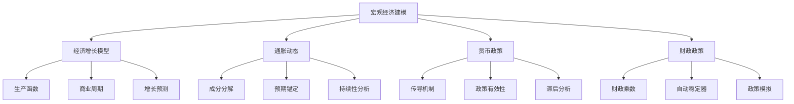

# 第15章：宏观经济建模与政策分析

::: tip 学习目标
- 掌握宏观经济变量的状态空间建模
- 学习货币政策传导机制的卡尔曼滤波分析
- 理解经济周期的动态估计方法
- 掌握财政政策效果的实时评估
- 实现宏观经济预测的完整框架
:::

## 1. 宏观经济状态空间模型

### 1.1 经济增长的动态建模

经济增长涉及多个相互影响的因素，我们使用卡尔曼滤波来建模这些动态关系：

```python
import numpy as np
import pandas as pd
import matplotlib.pyplot as plt
from filterpy.kalman import KalmanFilter
from scipy import linalg
import warnings
warnings.filterwarnings('ignore')

class MacroeconomicGrowthModel:
    """宏观经济增长的状态空间模型"""

    def __init__(self):
        # 状态向量: [GDP_growth, productivity, capital, labor, TFP]
        self.n_states = 5
        self.n_obs = 2  # 观测GDP增长率和失业率

        self.kf = KalmanFilter(dim_x=self.n_states, dim_z=self.n_obs)

        # 时间步长（季度数据）
        dt = 0.25

        # 状态转移矩阵（简化的经济增长模型）
        self.kf.F = np.array([
            [0.8, 0.3, 0.2, 0.1, 0.4],    # GDP增长
            [0.0, 0.95, 0.05, 0.0, 0.1],  # 生产率
            [0.05, 0.0, 0.98, 0.0, 0.0],  # 资本
            [0.0, 0.0, 0.0, 0.9, 0.0],    # 劳动力
            [0.0, 0.1, 0.0, 0.0, 0.99]    # 全要素生产率
        ])

        # 观测矩阵
        self.kf.H = np.array([
            [1.0, 0.0, 0.0, 0.0, 0.0],     # 直接观测GDP增长
            [0.0, 0.0, 0.0, -2.0, 0.0]     # 失业率与劳动力负相关
        ])

        # 过程噪声协方差
        q_gdp = 0.01        # GDP增长噪声
        q_prod = 0.005      # 生产率噪声
        q_capital = 0.001   # 资本噪声
        q_labor = 0.002     # 劳动力噪声
        q_tfp = 0.001       # TFP噪声

        self.kf.Q = np.diag([q_gdp, q_prod, q_capital, q_labor, q_tfp])

        # 观测噪声协方差
        self.kf.R = np.diag([0.005, 0.01])  # GDP和失业率观测噪声

        # 初始状态
        self.kf.x = np.array([[0.02], [1.0], [1.0], [0.95], [1.0]])  # 初始值
        self.kf.P = np.eye(self.n_states) * 0.01

        # 数据存储
        self.history = {
            'gdp_growth': [],
            'productivity': [],
            'capital': [],
            'labor': [],
            'tfp': [],
            'unemployment': []
        }

    def update_economy(self, gdp_growth_obs, unemployment_obs):
        """更新经济状态"""
        # 预测步骤
        self.kf.predict()

        # 更新步骤
        observations = np.array([gdp_growth_obs, unemployment_obs])
        self.kf.update(observations)

        # 存储历史数据
        self.history['gdp_growth'].append(self.kf.x[0, 0])
        self.history['productivity'].append(self.kf.x[1, 0])
        self.history['capital'].append(self.kf.x[2, 0])
        self.history['labor'].append(self.kf.x[3, 0])
        self.history['tfp'].append(self.kf.x[4, 0])
        self.history['unemployment'].append(unemployment_obs)

        return {
            'gdp_growth': self.kf.x[0, 0],
            'productivity': self.kf.x[1, 0],
            'capital': self.kf.x[2, 0],
            'labor': self.kf.x[3, 0],
            'tfp': self.kf.x[4, 0],
            'state_uncertainty': np.diagonal(self.kf.P)
        }

    def forecast_growth(self, horizons=8):
        """预测未来经济增长"""
        forecasts = []

        # 保存当前状态
        x_current = self.kf.x.copy()
        P_current = self.kf.P.copy()

        for h in range(1, horizons + 1):
            # 多步预测
            x_forecast = np.linalg.matrix_power(self.kf.F, h) @ x_current
            P_forecast = self.kf.P.copy()

            # 计算预测不确定性
            for i in range(h):
                P_forecast = self.kf.F @ P_forecast @ self.kf.F.T + self.kf.Q

            forecasts.append({
                'horizon': h,
                'gdp_growth_forecast': x_forecast[0, 0],
                'productivity_forecast': x_forecast[1, 0],
                'forecast_std': np.sqrt(P_forecast[0, 0])
            })

        return forecasts

    def get_business_cycle_component(self):
        """提取商业周期成分"""
        if len(self.history['gdp_growth']) < 8:
            return None

        # 使用Hodrick-Prescott滤波分离趋势和周期
        gdp_series = np.array(self.history['gdp_growth'])
        trend, cycle = self._hp_filter(gdp_series, lambda_param=1600)

        return {
            'trend': trend,
            'cycle': cycle,
            'cycle_amplitude': np.std(cycle),
            'current_cycle_position': cycle[-1] if len(cycle) > 0 else 0
        }

    @staticmethod
    def _hp_filter(y, lambda_param=1600):
        """Hodrick-Prescott滤波"""
        n = len(y)
        if n < 4:
            return y, np.zeros_like(y)

        # 构造二阶差分矩阵
        D = np.zeros((n-2, n))
        for i in range(n-2):
            D[i, i] = 1
            D[i, i+1] = -2
            D[i, i+2] = 1

        # 计算趋势
        I = np.eye(n)
        trend = np.linalg.solve(I + lambda_param * D.T @ D, y)
        cycle = y - trend

        return trend, cycle

# 示例：宏观经济增长建模
def demonstrate_macro_growth_modeling():
    print("开始宏观经济增长建模演示...")

    # 创建模型
    macro_model = MacroeconomicGrowthModel()

    # 模拟季度经济数据
    np.random.seed(42)
    n_quarters = 40  # 10年数据

    # 生成真实经济数据（简化模拟）
    true_growth_trend = 0.02  # 2%的基础增长率
    cycle_length = 16  # 4年周期
    cycle_amplitude = 0.01

    results = []

    for t in range(n_quarters):
        # 生成周期性GDP增长
        cycle_component = cycle_amplitude * np.sin(2 * np.pi * t / cycle_length)
        trend_component = true_growth_trend + 0.001 * np.random.normal()
        shock = 0.005 * np.random.normal()

        # 添加外部冲击
        if t == 20:  # 金融危机
            shock = -0.03
        elif t == 25:  # 刺激政策
            shock = 0.02

        gdp_growth = trend_component + cycle_component + shock

        # 失业率（简化关系）
        unemployment = 0.05 - 0.5 * gdp_growth + 0.01 * np.random.normal()
        unemployment = max(0.02, min(0.15, unemployment))  # 限制在合理范围

        # 更新模型
        result = macro_model.update_economy(gdp_growth, unemployment)
        result['quarter'] = t
        result['true_gdp_growth'] = gdp_growth
        result['unemployment_obs'] = unemployment
        results.append(result)

    # 转换为DataFrame
    df = pd.DataFrame(results)

    # 进行经济预测
    forecasts = macro_model.forecast_growth(horizons=8)
    forecast_df = pd.DataFrame(forecasts)

    # 商业周期分析
    cycle_analysis = macro_model.get_business_cycle_component()

    # 绘图分析
    fig, ((ax1, ax2), (ax3, ax4)) = plt.subplots(2, 2, figsize=(15, 12))

    # GDP增长率
    ax1.plot(df['quarter'], df['true_gdp_growth'], label='真实GDP增长', alpha=0.7)
    ax1.plot(df['quarter'], df['gdp_growth'], label='估计GDP增长', alpha=0.7)

    # 添加预测
    forecast_quarters = np.arange(len(df), len(df) + len(forecast_df))
    forecast_values = forecast_df['gdp_growth_forecast']
    forecast_std = forecast_df['forecast_std']

    ax1.plot(forecast_quarters, forecast_values, 'r--', label='预测', alpha=0.8)
    ax1.fill_between(forecast_quarters,
                     forecast_values - 1.96 * forecast_std,
                     forecast_values + 1.96 * forecast_std,
                     alpha=0.3, color='red', label='95%置信区间')

    ax1.set_title('GDP增长率跟踪与预测')
    ax1.set_ylabel('增长率')
    ax1.legend()
    ax1.grid(True, alpha=0.3)

    # 生产要素
    ax2.plot(df['quarter'], df['productivity'], label='生产率', alpha=0.7)
    ax2.plot(df['quarter'], df['capital'], label='资本', alpha=0.7)
    ax2.plot(df['quarter'], df['tfp'], label='全要素生产率', alpha=0.7)
    ax2.set_title('生产要素动态')
    ax2.set_ylabel('指数值')
    ax2.legend()
    ax2.grid(True, alpha=0.3)

    # 失业率
    ax3.plot(df['quarter'], df['unemployment_obs'], label='失业率', alpha=0.7)
    ax3.plot(df['quarter'], df['labor'], label='劳动力指数', alpha=0.7)
    ax3.set_title('劳动力市场')
    ax3.set_ylabel('比率/指数')
    ax3.legend()
    ax3.grid(True, alpha=0.3)

    # 商业周期
    if cycle_analysis:
        ax4.plot(df['quarter'], cycle_analysis['trend'], label='增长趋势', alpha=0.7)
        ax4.plot(df['quarter'], cycle_analysis['cycle'], label='周期成分', alpha=0.7)
        ax4.axhline(y=0, color='black', linestyle='--', alpha=0.5)
        ax4.set_title(f'商业周期分解 (周期振幅: {cycle_analysis["cycle_amplitude"]:.3f})')
        ax4.set_ylabel('增长率偏差')
        ax4.legend()
        ax4.grid(True, alpha=0.3)

    plt.tight_layout()
    plt.show()

    # 打印分析结果
    print(f"\n宏观经济建模结果:")
    print(f"当前GDP增长率: {df['gdp_growth'].iloc[-1]:.3f}")
    print(f"当前生产率: {df['productivity'].iloc[-1]:.3f}")
    print(f"当前TFP: {df['tfp'].iloc[-1]:.3f}")

    if cycle_analysis:
        print(f"当前周期位置: {cycle_analysis['current_cycle_position']:.3f}")
        print(f"周期振幅: {cycle_analysis['cycle_amplitude']:.3f}")

    print(f"\n未来两年增长预测:")
    for i in range(min(8, len(forecast_df))):
        forecast = forecast_df.iloc[i]
        print(f"第{i+1}季度: {forecast['gdp_growth_forecast']:.3f} ± {1.96*forecast['forecast_std']:.3f}")

    return df, forecast_df, cycle_analysis

macro_results, macro_forecasts, cycle_info = demonstrate_macro_growth_modeling()
```

### 1.2 通胀动态建模

```python
class InflationDynamicsModel:
    """通胀动态的状态空间模型"""

    def __init__(self):
        # 状态向量: [core_inflation, demand_shock, supply_shock, expectations]
        self.kf = KalmanFilter(dim_x=4, dim_z=2)

        # 状态转移矩阵（菲利普斯曲线扩展）
        self.kf.F = np.array([
            [0.7, 0.3, 0.2, 0.3],    # 核心通胀
            [0.0, 0.8, 0.0, 0.0],    # 需求冲击
            [0.0, 0.0, 0.6, 0.0],    # 供给冲击
            [0.1, 0.0, 0.0, 0.9]     # 通胀预期
        ])

        # 观测矩阵：观测总通胀和核心通胀
        self.kf.H = np.array([
            [1.0, 1.0, 1.0, 0.0],   # 总通胀 = 核心+需求+供给冲击
            [1.0, 0.0, 0.0, 0.0]    # 核心通胀直接观测
        ])

        # 过程噪声协方差
        self.kf.Q = np.diag([0.001, 0.005, 0.01, 0.001])

        # 观测噪声协方差
        self.kf.R = np.diag([0.002, 0.001])

        # 初始状态
        self.kf.x = np.array([[0.02], [0.0], [0.0], [0.02]])  # 2%通胀目标
        self.kf.P = np.eye(4) * 0.01

        # 历史数据
        self.inflation_history = []
        self.decomposition_history = []

    def update_inflation(self, headline_inflation, core_inflation, unemployment_gap=0):
        """更新通胀状态"""
        # 引入失业缺口对需求冲击的影响
        self.kf.F[1, 0] = -0.5 * unemployment_gap  # 奥肯定律

        # 预测和更新
        self.kf.predict()
        observations = np.array([headline_inflation, core_inflation])
        self.kf.update(observations)

        # 分解通胀成分
        decomposition = {
            'core_inflation': self.kf.x[0, 0],
            'demand_shock': self.kf.x[1, 0],
            'supply_shock': self.kf.x[2, 0],
            'expectations': self.kf.x[3, 0],
            'total_predicted': self.kf.x[0, 0] + self.kf.x[1, 0] + self.kf.x[2, 0]
        }

        self.inflation_history.append({
            'headline': headline_inflation,
            'core': core_inflation,
            'unemployment_gap': unemployment_gap
        })
        self.decomposition_history.append(decomposition)

        return decomposition

    def forecast_inflation(self, horizons=12, policy_shock=None):
        """预测通胀路径"""
        forecasts = []

        # 保存当前状态
        x_current = self.kf.x.copy()
        F_current = self.kf.F.copy()

        for h in range(1, horizons + 1):
            # 考虑政策冲击
            if policy_shock and h <= policy_shock.get('duration', 0):
                # 货币政策冲击影响需求
                if policy_shock['type'] == 'monetary_tightening':
                    x_current[1, 0] -= policy_shock['magnitude'] * 0.1
                elif policy_shock['type'] == 'monetary_easing':
                    x_current[1, 0] += policy_shock['magnitude'] * 0.1

            # 预测状态
            x_forecast = self.kf.F @ x_current
            x_current = x_forecast

            total_inflation = x_forecast[0, 0] + x_forecast[1, 0] + x_forecast[2, 0]

            forecasts.append({
                'horizon': h,
                'total_inflation': total_inflation,
                'core_inflation': x_forecast[0, 0],
                'demand_component': x_forecast[1, 0],
                'supply_component': x_forecast[2, 0],
                'expectations': x_forecast[3, 0]
            })

        return forecasts

    def calculate_inflation_persistence(self):
        """计算通胀持续性"""
        if len(self.inflation_history) < 12:
            return None

        # 计算核心通胀的自相关
        core_series = [d['core_inflation'] for d in self.decomposition_history]
        persistence = np.corrcoef(core_series[:-1], core_series[1:])[0, 1]

        return {
            'persistence': persistence,
            'half_life': -np.log(2) / np.log(abs(persistence)) if abs(persistence) > 0 else np.inf
        }

# 示例：通胀动态建模
def demonstrate_inflation_dynamics():
    print("开始通胀动态建模演示...")

    # 创建通胀模型
    inflation_model = InflationDynamicsModel()

    # 模拟通胀数据
    np.random.seed(42)
    n_months = 60  # 5年月度数据

    results = []

    # 基础通胀参数
    target_inflation = 0.02
    oil_shock_month = 24  # 石油冲击
    policy_response_month = 30  # 政策响应

    for t in range(n_months):
        # 生成基础通胀
        base_inflation = target_inflation + 0.003 * np.sin(2 * np.pi * t / 12)

        # 供给冲击（石油价格）
        if t >= oil_shock_month and t < oil_shock_month + 6:
            supply_shock = 0.02 * np.exp(-(t - oil_shock_month) * 0.3)
        else:
            supply_shock = 0.001 * np.random.normal()

        # 需求冲击
        demand_shock = 0.002 * np.random.normal()

        # 失业率缺口
        unemployment_gap = 0.5 * np.sin(2 * np.pi * t / 24) + 0.2 * np.random.normal()

        # 计算观测到的通胀
        headline_inflation = base_inflation + supply_shock + demand_shock
        core_inflation = base_inflation + 0.5 * demand_shock

        # 更新模型
        decomp = inflation_model.update_inflation(
            headline_inflation, core_inflation, unemployment_gap
        )

        result = {
            'month': t,
            'headline_inflation': headline_inflation,
            'core_inflation': core_inflation,
            'unemployment_gap': unemployment_gap,
            **decomp
        }
        results.append(result)

    # 转换为DataFrame
    df = pd.DataFrame(results)

    # 进行通胀预测（包含政策冲击）
    policy_shock = {
        'type': 'monetary_tightening',
        'magnitude': 0.5,  # 50个基点
        'duration': 6
    }

    forecasts = inflation_model.forecast_inflation(horizons=12, policy_shock=policy_shock)
    forecast_df = pd.DataFrame(forecasts)

    # 计算通胀持续性
    persistence_info = inflation_model.calculate_inflation_persistence()

    # 绘图
    fig, ((ax1, ax2), (ax3, ax4)) = plt.subplots(2, 2, figsize=(15, 12))

    # 通胀分解
    ax1.plot(df['month'], df['headline_inflation'], label='总通胀', alpha=0.8)
    ax1.plot(df['month'], df['core_inflation'], label='核心通胀', alpha=0.8)
    ax1.plot(df['month'], df['total_predicted'], label='模型预测', linestyle='--', alpha=0.8)

    # 添加预测
    forecast_months = np.arange(len(df), len(df) + len(forecast_df))
    ax1.plot(forecast_months, forecast_df['total_inflation'], 'r--',
             label='未来预测', alpha=0.8)

    ax1.axhline(y=target_inflation, color='black', linestyle=':', alpha=0.5, label='通胀目标')
    ax1.set_title('通胀动态跟踪与预测')
    ax1.set_ylabel('通胀率')
    ax1.legend()
    ax1.grid(True, alpha=0.3)

    # 通胀成分分解
    ax2.plot(df['month'], df['core_inflation'], label='核心成分', alpha=0.7)
    ax2.plot(df['month'], df['demand_shock'], label='需求冲击', alpha=0.7)
    ax2.plot(df['month'], df['supply_shock'], label='供给冲击', alpha=0.7)
    ax2.axhline(y=0, color='black', linestyle='--', alpha=0.5)
    ax2.set_title('通胀成分分解')
    ax2.set_ylabel('贡献度')
    ax2.legend()
    ax2.grid(True, alpha=0.3)

    # 通胀预期
    ax3.plot(df['month'], df['expectations'], label='通胀预期', alpha=0.7)
    ax3.plot(df['month'], df['core_inflation'], label='核心通胀', alpha=0.7)
    ax3.axhline(y=target_inflation, color='black', linestyle=':', alpha=0.5, label='目标')
    ax3.set_title('通胀预期锚定')
    ax3.set_ylabel('通胀率')
    ax3.legend()
    ax3.grid(True, alpha=0.3)

    # 预测分解
    ax4.plot(forecast_df['horizon'], forecast_df['total_inflation'], label='总预测', alpha=0.8)
    ax4.plot(forecast_df['horizon'], forecast_df['core_inflation'], label='核心预测', alpha=0.8)
    ax4.fill_between(forecast_df['horizon'],
                     forecast_df['total_inflation'] - 0.005,
                     forecast_df['total_inflation'] + 0.005,
                     alpha=0.3, label='不确定性区间')
    ax4.axhline(y=target_inflation, color='black', linestyle=':', alpha=0.5, label='目标')
    ax4.set_title('政策冲击下的通胀预测')
    ax4.set_ylabel('通胀率')
    ax4.set_xlabel('预测期（月）')
    ax4.legend()
    ax4.grid(True, alpha=0.3)

    plt.tight_layout()
    plt.show()

    # 分析结果
    print(f"\n通胀动态分析结果:")
    print(f"当前总通胀: {df['headline_inflation'].iloc[-1]:.3f}")
    print(f"当前核心通胀: {df['core_inflation'].iloc[-1]:.3f}")
    print(f"当前需求冲击: {df['demand_shock'].iloc[-1]:.3f}")
    print(f"当前供给冲击: {df['supply_shock'].iloc[-1]:.3f}")
    print(f"当前通胀预期: {df['expectations'].iloc[-1]:.3f}")

    if persistence_info:
        print(f"\n通胀持续性分析:")
        print(f"核心通胀自相关: {persistence_info['persistence']:.3f}")
        print(f"半衰期: {persistence_info['half_life']:.1f} 个月")

    print(f"\n未来12个月通胀预测（含政策冲击）:")
    for i in range(min(6, len(forecast_df))):
        forecast = forecast_df.iloc[i]
        print(f"第{i+1}月: 总通胀 {forecast['total_inflation']:.3f}, "
              f"核心通胀 {forecast['core_inflation']:.3f}")

    return df, forecast_df, persistence_info

inflation_results, inflation_forecasts, persistence_stats = demonstrate_inflation_dynamics()
```

## 2. 货币政策传导机制分析

### 2.1 利率传导渠道建模

```python
class MonetaryTransmissionModel:
    """货币政策传导机制模型"""

    def __init__(self):
        # 状态向量: [policy_rate, short_rate, long_rate, credit_spread, bank_lending]
        self.kf = KalmanFilter(dim_x=5, dim_z=3)

        # 状态转移矩阵（利率传导链）
        self.kf.F = np.array([
            [0.95, 0.0, 0.0, 0.0, 0.0],   # 政策利率
            [0.8, 0.9, 0.0, 0.0, 0.0],    # 短期利率
            [0.2, 0.7, 0.95, 0.0, 0.0],   # 长期利率
            [0.1, 0.1, 0.1, 0.85, 0.0],   # 信用利差
            [0.0, -0.3, -0.5, -0.4, 0.9]  # 银行放贷
        ])

        # 观测矩阵：观测短期利率、长期利率和信用利差
        self.kf.H = np.array([
            [0.0, 1.0, 0.0, 0.0, 0.0],   # 短期利率
            [0.0, 0.0, 1.0, 0.0, 0.0],   # 长期利率
            [0.0, 0.0, 0.0, 1.0, 0.0]    # 信用利差
        ])

        # 过程噪声协方差
        self.kf.Q = np.diag([0.0001, 0.001, 0.002, 0.005, 0.01])

        # 观测噪声协方差
        self.kf.R = np.diag([0.0005, 0.001, 0.002])

        # 初始状态
        self.kf.x = np.array([[0.025], [0.025], [0.035], [0.01], [1.0]])
        self.kf.P = np.eye(5) * 0.001

        # 政策历史
        self.policy_history = []
        self.transmission_history = []

    def implement_policy_change(self, policy_rate_change, announcement_effect=0):
        """实施货币政策变化"""
        # 更新政策利率
        self.kf.x[0, 0] += policy_rate_change

        # 前瞻性指引效应（影响长期利率）
        if announcement_effect != 0:
            self.kf.x[2, 0] += announcement_effect * 0.5

        # 记录政策变化
        self.policy_history.append({
            'policy_change': policy_rate_change,
            'announcement_effect': announcement_effect,
            'new_policy_rate': self.kf.x[0, 0]
        })

    def update_transmission(self, short_rate_obs, long_rate_obs, credit_spread_obs):
        """更新传导机制状态"""
        # 预测和更新
        self.kf.predict()
        observations = np.array([short_rate_obs, long_rate_obs, credit_spread_obs])
        self.kf.update(observations)

        # 计算传导效率
        transmission_state = {
            'policy_rate': self.kf.x[0, 0],
            'short_rate': self.kf.x[1, 0],
            'long_rate': self.kf.x[2, 0],
            'credit_spread': self.kf.x[3, 0],
            'bank_lending': self.kf.x[4, 0],
            'short_transmission': (self.kf.x[1, 0] - self.kf.x[0, 0]) / 0.01 if abs(self.kf.x[0, 0]) > 1e-6 else 0,
            'long_transmission': (self.kf.x[2, 0] - self.kf.x[0, 0]) / 0.01 if abs(self.kf.x[0, 0]) > 1e-6 else 0
        }

        self.transmission_history.append(transmission_state)
        return transmission_state

    def calculate_policy_effectiveness(self, target_variable='bank_lending'):
        """计算政策有效性"""
        if len(self.transmission_history) < 12:
            return None

        # 分析目标变量对政策利率的响应
        policy_rates = [t['policy_rate'] for t in self.transmission_history]
        target_values = [t[target_variable] for t in self.transmission_history]

        # 计算弹性
        policy_changes = np.diff(policy_rates)
        target_changes = np.diff(target_values)

        if len(policy_changes) > 0 and np.std(policy_changes) > 1e-6:
            elasticity = np.mean(target_changes) / np.mean(policy_changes)
        else:
            elasticity = 0

        return {
            'elasticity': elasticity,
            'transmission_lag': self._estimate_transmission_lag(policy_rates, target_values),
            'effectiveness_score': abs(elasticity) * np.exp(-0.1 * abs(self._estimate_transmission_lag(policy_rates, target_values)))
        }

    def _estimate_transmission_lag(self, policy_series, target_series, max_lag=6):
        """估计传导滞后"""
        if len(policy_series) < max_lag + 2:
            return 0

        best_corr = 0
        best_lag = 0

        for lag in range(max_lag + 1):
            if len(policy_series) > lag:
                corr = np.corrcoef(policy_series[:-lag-1] if lag > 0 else policy_series[:-1],
                                 target_series[lag+1:])[0, 1]
                if abs(corr) > abs(best_corr):
                    best_corr = corr
                    best_lag = lag

        return best_lag

# 示例：货币政策传导分析
def demonstrate_monetary_transmission():
    print("开始货币政策传导机制分析...")

    # 创建传导模型
    transmission_model = MonetaryTransmissionModel()

    # 模拟政策周期
    np.random.seed(42)
    n_periods = 48  # 4年月度数据

    results = []

    # 政策场景
    policy_events = [
        {'period': 12, 'change': 0.0025, 'announcement': 0.001},  # 加息25bp
        {'period': 15, 'change': 0.0025, 'announcement': 0.0005}, # 再加息25bp
        {'period': 30, 'change': -0.005, 'announcement': -0.002}, # 降息50bp（危机）
        {'period': 33, 'change': -0.0025, 'announcement': -0.001}, # 再降息25bp
    ]

    for t in range(n_periods):
        # 检查是否有政策事件
        for event in policy_events:
            if t == event['period']:
                transmission_model.implement_policy_change(
                    event['change'], event['announcement']
                )

        # 生成市场观测数据
        base_short = transmission_model.kf.x[1, 0]
        base_long = transmission_model.kf.x[2, 0]
        base_spread = transmission_model.kf.x[3, 0]

        # 添加市场噪声
        short_rate_obs = base_short + 0.001 * np.random.normal()
        long_rate_obs = base_long + 0.002 * np.random.normal()
        credit_spread_obs = base_spread + 0.001 * np.random.normal()

        # 金融危机期间的特殊效应
        if 28 <= t <= 35:
            credit_spread_obs += 0.01 * np.exp(-(t-30)**2/8)  # 信用紧缩
            long_rate_obs -= 0.005 * (35-t)/7  # 避险需求

        # 更新传导状态
        transmission_state = transmission_model.update_transmission(
            short_rate_obs, long_rate_obs, credit_spread_obs
        )

        result = {
            'period': t,
            'policy_implemented': any(t == event['period'] for event in policy_events),
            **transmission_state
        }
        results.append(result)

    # 转换为DataFrame
    df = pd.DataFrame(results)

    # 计算政策有效性
    effectiveness = transmission_model.calculate_policy_effectiveness('bank_lending')

    # 绘图分析
    fig, ((ax1, ax2), (ax3, ax4)) = plt.subplots(2, 2, figsize=(15, 12))

    # 利率传导链
    ax1.plot(df['period'], df['policy_rate'], label='政策利率', linewidth=2)
    ax1.plot(df['period'], df['short_rate'], label='短期利率', alpha=0.8)
    ax1.plot(df['period'], df['long_rate'], label='长期利率', alpha=0.8)

    # 标记政策变化点
    policy_periods = [event['period'] for event in policy_events]
    for period in policy_periods:
        ax1.axvline(x=period, color='red', linestyle='--', alpha=0.5)

    ax1.set_title('货币政策传导：利率链条')
    ax1.set_ylabel('利率')
    ax1.legend()
    ax1.grid(True, alpha=0.3)

    # 信用传导
    ax2.plot(df['period'], df['credit_spread'], label='信用利差', alpha=0.8)
    ax2.plot(df['period'], df['bank_lending'], label='银行放贷指数', alpha=0.8)
    ax2.set_title('货币政策传导：信用渠道')
    ax2.set_ylabel('利差/指数')
    ax2.legend()
    ax2.grid(True, alpha=0.3)

    # 传导效率
    ax3.plot(df['period'], df['short_transmission'], label='短期传导效率', alpha=0.8)
    ax3.plot(df['period'], df['long_transmission'], label='长期传导效率', alpha=0.8)
    ax3.axhline(y=1.0, color='black', linestyle=':', alpha=0.5, label='完全传导')
    ax3.set_title('传导效率分析')
    ax3.set_ylabel('传导比率')
    ax3.legend()
    ax3.grid(True, alpha=0.3)

    # 政策有效性时间演化
    if len(df) >= 12:
        rolling_effectiveness = []
        for i in range(12, len(df)):
            # 计算滚动窗口内的政策有效性
            window_data = df.iloc[i-12:i]
            policy_var = np.var(window_data['policy_rate'])
            lending_var = np.var(window_data['bank_lending'])
            effectiveness_score = lending_var / (policy_var + 1e-6)
            rolling_effectiveness.append(effectiveness_score)

        ax4.plot(df['period'].iloc[12:], rolling_effectiveness, alpha=0.8)
        ax4.set_title('滚动政策有效性')
        ax4.set_ylabel('有效性得分')
        ax4.grid(True, alpha=0.3)

    plt.tight_layout()
    plt.show()

    # 分析结果
    print(f"\n货币政策传导分析结果:")
    print(f"当前政策利率: {df['policy_rate'].iloc[-1]:.3f}")
    print(f"当前短期利率: {df['short_rate'].iloc[-1]:.3f}")
    print(f"当前长期利率: {df['long_rate'].iloc[-1]:.3f}")
    print(f"当前信用利差: {df['credit_spread'].iloc[-1]:.3f}")
    print(f"当前银行放贷指数: {df['bank_lending'].iloc[-1]:.3f}")

    if effectiveness:
        print(f"\n政策有效性分析:")
        print(f"银行放贷弹性: {effectiveness['elasticity']:.3f}")
        print(f"传导滞后: {effectiveness['transmission_lag']} 期")
        print(f"总体有效性得分: {effectiveness['effectiveness_score']:.3f}")

    # 计算平均传导时间
    avg_short_transmission = np.mean(df['short_transmission'])
    avg_long_transmission = np.mean(df['long_transmission'])

    print(f"\n平均传导效率:")
    print(f"短期利率传导: {avg_short_transmission:.3f}")
    print(f"长期利率传导: {avg_long_transmission:.3f}")

    return df, effectiveness

transmission_results, transmission_effectiveness = demonstrate_monetary_transmission()
```

## 3. 财政政策效果评估

### 3.1 财政乘数的动态估计

```python
class FiscalMultiplierModel:
    """财政乘数动态估计模型"""

    def __init__(self):
        # 状态向量: [output_gap, fiscal_impulse, automatic_stabilizer, multiplier]
        self.kf = KalmanFilter(dim_x=4, dim_z=2)

        # 状态转移矩阵
        self.kf.F = np.array([
            [0.8, 1.0, 0.5, 0.0],    # 产出缺口
            [0.0, 0.7, 0.0, 0.0],    # 财政脉冲
            [-0.3, 0.0, 0.9, 0.0],   # 自动稳定器
            [0.0, 0.0, 0.0, 0.95]    # 财政乘数
        ])

        # 观测矩阵：观测产出缺口和财政余额
        self.kf.H = np.array([
            [1.0, 0.0, 0.0, 0.0],    # 产出缺口
            [0.0, 1.0, 1.0, 0.0]     # 财政余额 = 脉冲 + 自动稳定器
        ])

        # 过程噪声协方差
        self.kf.Q = np.diag([0.01, 0.005, 0.002, 0.001])

        # 观测噪声协方差
        self.kf.R = np.diag([0.005, 0.003])

        # 初始状态
        self.kf.x = np.array([[0.0], [0.0], [0.0], [1.2]])  # 初始乘数1.2
        self.kf.P = np.eye(4) * 0.01

        # 历史数据
        self.fiscal_history = []

    def implement_fiscal_policy(self, fiscal_stimulus, policy_type='spending'):
        """实施财政政策"""
        # 根据政策类型调整传导机制
        if policy_type == 'spending':
            # 政府支出直接影响产出
            self.kf.F[0, 1] = 1.0
        elif policy_type == 'tax_cut':
            # 减税通过消费影响产出，效果较温和
            self.kf.F[0, 1] = 0.7
        elif policy_type == 'investment':
            # 基础设施投资，长期乘数更高
            self.kf.F[0, 1] = 1.3

        # 更新财政脉冲
        self.kf.x[1, 0] = fiscal_stimulus

        return {
            'fiscal_impulse': fiscal_stimulus,
            'policy_type': policy_type,
            'expected_multiplier': self.kf.x[3, 0]
        }

    def update_fiscal_effects(self, output_gap_obs, fiscal_balance_obs,
                            economic_cycle='normal'):
        """更新财政政策效果"""
        # 根据经济周期调整乘数
        if economic_cycle == 'recession':
            # 衰退期乘数更高
            self.kf.Q[3, 3] *= 1.5
        elif economic_cycle == 'expansion':
            # 扩张期乘数较低
            self.kf.Q[3, 3] *= 0.7

        # 预测和更新
        self.kf.predict()
        observations = np.array([output_gap_obs, fiscal_balance_obs])
        self.kf.update(observations)

        # 计算即时乘数
        current_multiplier = self.kf.x[3, 0]
        fiscal_impulse = self.kf.x[1, 0]

        fiscal_state = {
            'output_gap': self.kf.x[0, 0],
            'fiscal_impulse': fiscal_impulse,
            'automatic_stabilizer': self.kf.x[2, 0],
            'fiscal_multiplier': current_multiplier,
            'fiscal_contribution': fiscal_impulse * current_multiplier,
            'economic_cycle': economic_cycle
        }

        self.fiscal_history.append(fiscal_state)
        return fiscal_state

    def estimate_multiplier_by_state(self):
        """按经济状态估计乘数"""
        if len(self.fiscal_history) < 12:
            return None

        # 分析不同经济状态下的乘数
        recession_periods = [h for h in self.fiscal_history if h['economic_cycle'] == 'recession']
        normal_periods = [h for h in self.fiscal_history if h['economic_cycle'] == 'normal']
        expansion_periods = [h for h in self.fiscal_history if h['economic_cycle'] == 'expansion']

        results = {}

        for state, periods in [('recession', recession_periods),
                              ('normal', normal_periods),
                              ('expansion', expansion_periods)]:
            if len(periods) > 0:
                multipliers = [p['fiscal_multiplier'] for p in periods]
                results[state] = {
                    'avg_multiplier': np.mean(multipliers),
                    'std_multiplier': np.std(multipliers),
                    'observations': len(periods)
                }

        return results

    def forecast_fiscal_impact(self, planned_policies, horizons=8):
        """预测财政政策影响"""
        forecasts = []

        # 保存当前状态
        x_current = self.kf.x.copy()

        for h in range(1, horizons + 1):
            # 应用计划中的政策
            if h <= len(planned_policies):
                policy = planned_policies[h-1]
                x_current[1, 0] = policy.get('fiscal_impulse', 0)

                # 根据政策类型调整
                if policy.get('type') == 'investment':
                    x_current[3, 0] *= 1.1  # 投资乘数更高

            # 预测状态
            x_forecast = self.kf.F @ x_current
            x_current = x_forecast

            forecasts.append({
                'horizon': h,
                'output_gap_forecast': x_forecast[0, 0],
                'fiscal_multiplier_forecast': x_forecast[3, 0],
                'cumulative_impact': np.sum([x_forecast[1, 0] * x_forecast[3, 0]
                                           for _ in range(h)])
            })

        return forecasts

# 示例：财政政策效果评估
def demonstrate_fiscal_policy_analysis():
    print("开始财政政策效果评估...")

    # 创建财政模型
    fiscal_model = FiscalMultiplierModel()

    # 模拟经济周期和财政政策
    np.random.seed(42)
    n_quarters = 32  # 8年季度数据

    results = []

    # 定义经济周期
    cycle_phases = ['expansion'] * 12 + ['recession'] * 6 + ['normal'] * 8 + ['expansion'] * 6

    # 财政政策事件
    fiscal_events = [
        {'quarter': 8, 'stimulus': 0.02, 'type': 'tax_cut'},      # 减税
        {'quarter': 12, 'stimulus': 0.05, 'type': 'spending'},    # 危机支出
        {'quarter': 14, 'stimulus': 0.03, 'type': 'investment'},  # 基建投资
        {'quarter': 24, 'stimulus': -0.02, 'type': 'consolidation'} # 财政紧缩
    ]

    for t in range(n_quarters):
        # 经济周期
        cycle_phase = cycle_phases[t] if t < len(cycle_phases) else 'normal'

        # 检查财政政策事件
        fiscal_stimulus = 0
        policy_type = 'none'

        for event in fiscal_events:
            if t == event['quarter']:
                fiscal_stimulus = event['stimulus']
                policy_type = event['type']
                fiscal_model.implement_fiscal_policy(fiscal_stimulus, policy_type)

        # 生成观测数据
        # 基础产出缺口
        if cycle_phase == 'recession':
            base_output_gap = -0.03 + 0.01 * np.random.normal()
        elif cycle_phase == 'expansion':
            base_output_gap = 0.02 + 0.005 * np.random.normal()
        else:
            base_output_gap = 0.005 * np.random.normal()

        # 财政余额（包含周期性因素）
        cyclical_balance = -0.3 * base_output_gap  # 自动稳定器
        fiscal_balance = fiscal_stimulus + cyclical_balance + 0.005 * np.random.normal()

        # 更新模型
        fiscal_state = fiscal_model.update_fiscal_effects(
            base_output_gap, fiscal_balance, cycle_phase
        )

        result = {
            'quarter': t,
            'cycle_phase': cycle_phase,
            'policy_implemented': policy_type != 'none',
            'policy_type': policy_type,
            **fiscal_state
        }
        results.append(result)

    # 转换为DataFrame
    df = pd.DataFrame(results)

    # 按状态估计乘数
    multiplier_by_state = fiscal_model.estimate_multiplier_by_state()

    # 未来政策规划
    planned_policies = [
        {'fiscal_impulse': 0.01, 'type': 'investment'},
        {'fiscal_impulse': 0.015, 'type': 'investment'},
        {'fiscal_impulse': 0.01, 'type': 'spending'},
        {'fiscal_impulse': 0.005, 'type': 'spending'}
    ]

    forecasts = fiscal_model.forecast_fiscal_impact(planned_policies)
    forecast_df = pd.DataFrame(forecasts)

    # 绘图分析
    fig, ((ax1, ax2), (ax3, ax4)) = plt.subplots(2, 2, figsize=(15, 12))

    # 产出缺口和财政脉冲
    ax1.plot(df['quarter'], df['output_gap'], label='产出缺口', alpha=0.8)
    ax1.plot(df['quarter'], df['fiscal_impulse'], label='财政脉冲', alpha=0.8)

    # 标记不同经济周期
    for i, phase in enumerate(df['cycle_phase']):
        color = {'recession': 'red', 'expansion': 'green', 'normal': 'blue'}[phase]
        ax1.axvspan(i-0.4, i+0.4, alpha=0.1, color=color)

    ax1.set_title('产出缺口与财政政策')
    ax1.set_ylabel('比率')
    ax1.legend()
    ax1.grid(True, alpha=0.3)

    # 财政乘数变化
    ax2.plot(df['quarter'], df['fiscal_multiplier'], label='财政乘数', alpha=0.8)

    # 添加平均乘数线
    if multiplier_by_state:
        for state, info in multiplier_by_state.items():
            ax2.axhline(y=info['avg_multiplier'],
                       linestyle='--', alpha=0.6,
                       label=f'{state}平均: {info["avg_multiplier"]:.2f}')

    ax2.set_title('动态财政乘数')
    ax2.set_ylabel('乘数')
    ax2.legend()
    ax2.grid(True, alpha=0.3)

    # 财政贡献分解
    ax3.plot(df['quarter'], df['fiscal_contribution'], label='财政贡献', alpha=0.8)
    ax3.plot(df['quarter'], df['automatic_stabilizer'], label='自动稳定器', alpha=0.8)
    ax3.axhline(y=0, color='black', linestyle='--', alpha=0.5)
    ax3.set_title('财政政策对增长的贡献')
    ax3.set_ylabel('贡献度')
    ax3.legend()
    ax3.grid(True, alpha=0.3)

    # 政策效果预测
    forecast_quarters = np.arange(len(df), len(df) + len(forecast_df))
    ax4.plot(forecast_quarters, forecast_df['output_gap_forecast'],
             label='产出缺口预测', alpha=0.8)
    ax4.plot(forecast_quarters, forecast_df['cumulative_impact'],
             label='累计财政影响', alpha=0.8)
    ax4.set_title('财政政策效果预测')
    ax4.set_ylabel('影响度')
    ax4.set_xlabel('季度')
    ax4.legend()
    ax4.grid(True, alpha=0.3)

    plt.tight_layout()
    plt.show()

    # 分析结果
    print(f"\n财政政策效果分析:")
    print(f"当前产出缺口: {df['output_gap'].iloc[-1]:.3f}")
    print(f"当前财政乘数: {df['fiscal_multiplier'].iloc[-1]:.2f}")
    print(f"当前财政贡献: {df['fiscal_contribution'].iloc[-1]:.3f}")

    if multiplier_by_state:
        print(f"\n不同经济状态下的财政乘数:")
        for state, info in multiplier_by_state.items():
            print(f"{state}: {info['avg_multiplier']:.2f} ± {info['std_multiplier']:.2f} "
                  f"(观测数: {info['observations']})")

    print(f"\n计划政策的预期效果:")
    total_impact = forecast_df['cumulative_impact'].iloc[-1]
    avg_multiplier = forecast_df['fiscal_multiplier_forecast'].mean()
    print(f"累计影响: {total_impact:.3f}")
    print(f"平均预期乘数: {avg_multiplier:.2f}")

    return df, forecast_df, multiplier_by_state

fiscal_results, fiscal_forecasts, multiplier_analysis = demonstrate_fiscal_policy_analysis()
```

## 本章小结

本章深入探讨了卡尔曼滤波在宏观经济建模与政策分析中的应用：

1. **宏观经济建模**：
   - 经济增长的动态状态空间模型
   - 通胀动态与成分分解
   - 商业周期的实时识别

2. **货币政策分析**：
   - 利率传导机制建模
   - 政策有效性评估
   - 传导滞后分析

3. **财政政策评估**：
   - 动态财政乘数估计
   - 政策类型差异分析
   - 经济周期依赖性

4. **政策工具应用**：
   - 实时政策效果监测
   - 政策冲击识别
   - 前瞻性政策模拟

这些应用展示了卡尔曼滤波在宏观经济分析中的强大功能，特别是在处理多变量动态系统、政策效果量化和经济预测方面的优势。

---

**下一章预告**：第16章将学习"金融计量中的现代发展与实战"，这是课程的最后一章，将综合运用前面学到的所有技术，探讨卡尔曼滤波的最新发展和实际应用案例。

