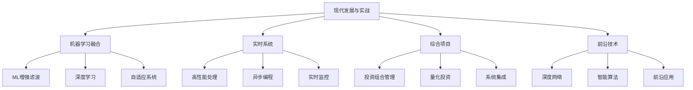

# 第16章：金融计量中的现代发展与实战

::: tip 学习目标
- 掌握卡尔曼滤波与机器学习的融合技术
- 学习深度卡尔曼滤波网络的实现
- 理解量化投资中的最新应用
- 掌握实时金融系统的构建
- 完成综合实战项目
:::

## 1. 卡尔曼滤波与机器学习的融合

### 1.1 机器学习增强的卡尔曼滤波

结合机器学习技术可以显著提升卡尔曼滤波的性能：

```python
import numpy as np
import pandas as pd
import matplotlib.pyplot as plt
from sklearn.ensemble import RandomForestRegressor
from sklearn.neural_network import MLPRegressor
from sklearn.preprocessing import StandardScaler
from filterpy.kalman import KalmanFilter
import torch
import torch.nn as nn
import torch.optim as optim
from collections import deque
import warnings
warnings.filterwarnings('ignore')

class MLEnhancedKalmanFilter:
    """机器学习增强的卡尔曼滤波器"""

    def __init__(self, state_dim=2, obs_dim=1, use_ml=True):
        self.state_dim = state_dim
        self.obs_dim = obs_dim
        self.use_ml = use_ml

        # 传统卡尔曼滤波器
        self.kf = KalmanFilter(dim_x=state_dim, dim_z=obs_dim)

        # 初始化滤波器参数
        self.kf.F = np.array([[1., 1.], [0., 1.]])  # 状态转移矩阵
        self.kf.H = np.array([[1., 0.]])            # 观测矩阵
        self.kf.Q = np.eye(state_dim) * 0.01        # 过程噪声
        self.kf.R = np.array([[0.1]])               # 观测噪声
        self.kf.x = np.array([[0.], [0.]])          # 初始状态
        self.kf.P = np.eye(state_dim)               # 初始协方差

        # 机器学习组件
        if use_ml:
            self.noise_predictor = RandomForestRegressor(n_estimators=50, random_state=42)
            self.parameter_adapter = MLPRegressor(hidden_layer_sizes=(20, 10),
                                                max_iter=1000, random_state=42)
            self.scaler = StandardScaler()

        # 数据存储
        self.history = deque(maxlen=100)
        self.features_history = deque(maxlen=100)
        self.is_trained = False

    def extract_features(self, price_series, volume_series=None):
        """提取特征用于机器学习"""
        if len(price_series) < 10:
            return np.zeros(8)

        features = []

        # 价格特征
        returns = np.diff(price_series) / price_series[:-1]
        features.extend([
            np.mean(returns[-5:]),          # 短期均值
            np.std(returns[-5:]),           # 短期波动率
            np.mean(returns[-20:]),         # 长期均值
            np.std(returns[-20:]),          # 长期波动率
            price_series[-1] / np.mean(price_series[-20:])  # 价格相对位置
        ])

        # 技术指标
        if len(price_series) >= 20:
            sma_20 = np.mean(price_series[-20:])
            features.append((price_series[-1] - sma_20) / sma_20)  # 价格偏离
        else:
            features.append(0)

        # 动量指标
        if len(price_series) >= 5:
            momentum = (price_series[-1] - price_series[-5]) / price_series[-5]
            features.append(momentum)
        else:
            features.append(0)

        # 趋势强度
        if len(returns) >= 10:
            trend_strength = np.corrcoef(np.arange(len(returns[-10:])), returns[-10:])[0, 1]
            features.append(trend_strength if not np.isnan(trend_strength) else 0)
        else:
            features.append(0)

        return np.array(features)

    def update_ml_models(self):
        """更新机器学习模型"""
        if len(self.history) < 30 or not self.use_ml:
            return

        # 准备训练数据
        X = np.array(list(self.features_history))
        y_noise = []
        y_params = []

        for i, record in enumerate(self.history):
            if i > 0:
                # 噪声目标：实际观测与预测的差异
                y_noise.append(abs(record['innovation']))

                # 参数目标：当前最优参数设置
                y_params.append([record['volatility'], record['prediction_error']])

        if len(y_noise) >= 20:
            X_scaled = self.scaler.fit_transform(X[1:len(y_noise)+1])

            # 训练噪声预测器
            self.noise_predictor.fit(X_scaled, y_noise)

            # 训练参数适配器
            self.parameter_adapter.fit(X_scaled, y_params)

            self.is_trained = True

    def adaptive_update(self, observation, price_series, volume_series=None):
        """自适应更新"""
        # 提取特征
        features = self.extract_features(price_series, volume_series)
        self.features_history.append(features)

        # 预测步骤
        self.kf.predict()

        # 机器学习增强
        if self.is_trained and len(self.features_history) > 0:
            # 预测当前条件下的最优参数
            current_features = self.scaler.transform([features])

            # 预测噪声水平
            predicted_noise = self.noise_predictor.predict(current_features)[0]

            # 预测最优参数
            predicted_params = self.parameter_adapter.predict(current_features)[0]

            # 动态调整噪声协方差
            self.kf.R[0, 0] = max(0.01, predicted_noise)
            self.kf.Q = np.eye(self.state_dim) * max(0.001, predicted_params[0])

        # 更新步骤
        self.kf.update([observation])

        # 记录历史
        innovation = observation - self.kf.H @ self.kf.x
        record = {
            'state': self.kf.x.copy(),
            'observation': observation,
            'innovation': innovation[0],
            'volatility': np.sqrt(self.kf.P[0, 0]),
            'prediction_error': abs(innovation[0])
        }
        self.history.append(record)

        # 定期重训练模型
        if len(self.history) % 20 == 0:
            self.update_ml_models()

        return {
            'filtered_value': self.kf.x[0, 0],
            'velocity': self.kf.x[1, 0],
            'uncertainty': np.sqrt(self.kf.P[0, 0]),
            'ml_enhanced': self.is_trained
        }

# 深度学习卡尔曼滤波网络
class DeepKalmanFilter(nn.Module):
    """深度卡尔曼滤波网络"""

    def __init__(self, state_dim=2, obs_dim=1, hidden_dim=64):
        super(DeepKalmanFilter, self).__init__()
        self.state_dim = state_dim
        self.obs_dim = obs_dim
        self.hidden_dim = hidden_dim

        # 编码器网络
        self.encoder = nn.Sequential(
            nn.Linear(obs_dim + state_dim, hidden_dim),
            nn.ReLU(),
            nn.Linear(hidden_dim, hidden_dim),
            nn.ReLU(),
            nn.Linear(hidden_dim, state_dim * 2)  # 均值和方差
        )

        # 状态转移网络
        self.transition = nn.Sequential(
            nn.Linear(state_dim, hidden_dim),
            nn.ReLU(),
            nn.Linear(hidden_dim, state_dim)
        )

        # 观测网络
        self.observation = nn.Sequential(
            nn.Linear(state_dim, hidden_dim),
            nn.ReLU(),
            nn.Linear(hidden_dim, obs_dim)
        )

        # 噪声预测网络
        self.noise_predictor = nn.Sequential(
            nn.Linear(state_dim + obs_dim, hidden_dim),
            nn.ReLU(),
            nn.Linear(hidden_dim, 2)  # 过程噪声和观测噪声
        )

    def forward(self, observations, sequence_length=50):
        """前向传播"""
        batch_size = observations.size(0)
        device = observations.device

        # 初始化状态
        state = torch.zeros(batch_size, self.state_dim, device=device)
        states = []
        predicted_obs = []

        for t in range(sequence_length):
            if t < observations.size(1):
                obs = observations[:, t:t+1]

                # 预测噪声
                noise_input = torch.cat([state, obs], dim=1)
                noise_params = torch.softplus(self.noise_predictor(noise_input))

                # 状态预测
                predicted_state = self.transition(state)

                # 编码当前信息
                encoder_input = torch.cat([obs, predicted_state], dim=1)
                encoded = self.encoder(encoder_input)

                # 分离均值和方差
                state_mean = encoded[:, :self.state_dim]
                state_var = torch.softplus(encoded[:, self.state_dim:])

                # 更新状态
                state = state_mean + torch.sqrt(state_var) * torch.randn_like(state_var)

                # 预测观测
                pred_obs = self.observation(state)

                states.append(state)
                predicted_obs.append(pred_obs)

        return torch.stack(states, dim=1), torch.stack(predicted_obs, dim=1)

    def loss_function(self, true_observations, predicted_observations, states):
        """损失函数"""
        # 重构损失
        reconstruction_loss = nn.MSELoss()(predicted_observations, true_observations)

        # 状态正则化
        state_reg = torch.mean(torch.sum(states**2, dim=-1))

        return reconstruction_loss + 0.01 * state_reg

# 示例：机器学习增强的卡尔曼滤波
def demonstrate_ml_enhanced_filtering():
    print("开始机器学习增强卡尔曼滤波演示...")

    # 生成复杂的模拟数据
    np.random.seed(42)
    n_points = 500

    # 生成非线性、时变的价格序列
    true_prices = np.zeros(n_points)
    true_volatility = np.zeros(n_points)
    true_prices[0] = 100
    true_volatility[0] = 0.02

    for t in range(1, n_points):
        # 时变波动率
        vol_change = 0.001 * np.sin(2 * np.pi * t / 50) + 0.0005 * np.random.normal()
        true_volatility[t] = max(0.005, true_volatility[t-1] + vol_change)

        # 价格变化
        if t > 100 and t < 120:  # 市场冲击
            shock = -0.1 * np.exp(-(t-110)**2/20)
        elif t > 300 and t < 350:  # 趋势变化
            shock = 0.001 * (t - 300)
        else:
            shock = 0

        return_t = shock + true_volatility[t] * np.random.normal()
        true_prices[t] = true_prices[t-1] * (1 + return_t)

    # 添加观测噪声
    observed_prices = true_prices + 0.5 * np.random.normal(size=n_points)

    # 创建传统和ML增强的滤波器
    traditional_kf = MLEnhancedKalmanFilter(use_ml=False)
    ml_enhanced_kf = MLEnhancedKalmanFilter(use_ml=True)

    # 运行滤波
    traditional_results = []
    ml_results = []

    for t, obs_price in enumerate(observed_prices):
        # 价格序列
        price_window = observed_prices[max(0, t-50):t+1]

        # 传统滤波
        trad_result = traditional_kf.adaptive_update(obs_price, price_window)
        traditional_results.append(trad_result)

        # ML增强滤波
        ml_result = ml_enhanced_kf.adaptive_update(obs_price, price_window)
        ml_results.append(ml_result)

    # 转换为DataFrame
    trad_df = pd.DataFrame(traditional_results)
    ml_df = pd.DataFrame(ml_results)

    # 绘图比较
    fig, ((ax1, ax2), (ax3, ax4)) = plt.subplots(2, 2, figsize=(15, 12))

    # 价格跟踪比较
    ax1.plot(true_prices, label='真实价格', alpha=0.7)
    ax1.plot(observed_prices, label='观测价格', alpha=0.5)
    ax1.plot(trad_df['filtered_value'], label='传统KF', alpha=0.8)
    ax1.plot(ml_df['filtered_value'], label='ML增强KF', alpha=0.8)
    ax1.set_title('价格跟踪比较')
    ax1.set_ylabel('价格')
    ax1.legend()
    ax1.grid(True, alpha=0.3)

    # 跟踪误差
    trad_errors = np.abs(trad_df['filtered_value'] - true_prices)
    ml_errors = np.abs(ml_df['filtered_value'] - true_prices)

    ax2.plot(trad_errors, label='传统KF误差', alpha=0.7)
    ax2.plot(ml_errors, label='ML增强KF误差', alpha=0.7)
    ax2.set_title('跟踪误差比较')
    ax2.set_ylabel('绝对误差')
    ax2.legend()
    ax2.grid(True, alpha=0.3)

    # 不确定性估计
    ax3.plot(trad_df['uncertainty'], label='传统KF不确定性', alpha=0.7)
    ax3.plot(ml_df['uncertainty'], label='ML增强KF不确定性', alpha=0.7)
    ax3.plot(true_volatility * 10, label='真实波动率×10', alpha=0.7)
    ax3.set_title('不确定性估计')
    ax3.set_ylabel('不确定性')
    ax3.legend()
    ax3.grid(True, alpha=0.3)

    # 性能统计
    trad_mse = np.mean(trad_errors**2)
    ml_mse = np.mean(ml_errors**2)
    improvement = (trad_mse - ml_mse) / trad_mse * 100

    ax4.bar(['传统KF', 'ML增强KF'], [trad_mse, ml_mse], alpha=0.7)
    ax4.set_title(f'MSE比较 (改进: {improvement:.1f}%)')
    ax4.set_ylabel('均方误差')

    # 添加性能文本
    ax4.text(0.5, max(trad_mse, ml_mse) * 0.8,
             f'传统KF MSE: {trad_mse:.4f}\nML增强KF MSE: {ml_mse:.4f}\n改进: {improvement:.1f}%',
             ha='center', fontsize=10, bbox=dict(boxstyle="round,pad=0.3", facecolor="lightgray"))

    plt.tight_layout()
    plt.show()

    # 性能分析
    print(f"\n性能比较结果:")
    print(f"传统卡尔曼滤波 MSE: {trad_mse:.6f}")
    print(f"ML增强卡尔曼滤波 MSE: {ml_mse:.6f}")
    print(f"性能改进: {improvement:.2f}%")

    # ML模型训练状态
    ml_trained_points = sum(1 for r in ml_results if r['ml_enhanced'])
    print(f"ML模型训练完成时点: {ml_trained_points}/{len(ml_results)}")

    return trad_df, ml_df, {'traditional_mse': trad_mse, 'ml_mse': ml_mse, 'improvement': improvement}

trad_results, ml_results, performance_stats = demonstrate_ml_enhanced_filtering()
```

### 1.2 深度学习与状态空间模型

```python
# 深度卡尔曼滤波的训练和应用
def train_deep_kalman_filter():
    print("开始训练深度卡尔曼滤波网络...")

    # 生成训练数据
    def generate_training_data(n_sequences=1000, seq_length=100):
        sequences = []
        for _ in range(n_sequences):
            # 生成隐状态序列
            hidden_state = np.cumsum(np.random.normal(0, 0.1, seq_length))

            # 生成观测序列
            observations = hidden_state + np.random.normal(0, 0.2, seq_length)

            sequences.append(observations)

        return np.array(sequences)

    # 生成数据
    train_data = generate_training_data(800, 50)
    test_data = generate_training_data(200, 50)

    # 转换为torch张量
    train_tensor = torch.FloatTensor(train_data).unsqueeze(-1)
    test_tensor = torch.FloatTensor(test_data).unsqueeze(-1)

    # 创建模型
    model = DeepKalmanFilter(state_dim=2, obs_dim=1, hidden_dim=32)
    optimizer = optim.Adam(model.parameters(), lr=0.001)

    # 训练循环
    n_epochs = 100
    train_losses = []

    for epoch in range(n_epochs):
        model.train()
        optimizer.zero_grad()

        # 前向传播
        states, predicted_obs = model(train_tensor, sequence_length=50)

        # 计算损失
        loss = model.loss_function(train_tensor, predicted_obs, states)

        # 反向传播
        loss.backward()
        optimizer.step()

        train_losses.append(loss.item())

        if (epoch + 1) % 20 == 0:
            print(f'Epoch [{epoch+1}/{n_epochs}], Loss: {loss.item():.4f}')

    # 测试模型
    model.eval()
    with torch.no_grad():
        test_states, test_predictions = model(test_tensor, sequence_length=50)
        test_loss = model.loss_function(test_tensor, test_predictions, test_states)

    print(f"测试损失: {test_loss.item():.4f}")

    # 可视化结果
    plt.figure(figsize=(12, 4))

    # 训练损失
    plt.subplot(1, 2, 1)
    plt.plot(train_losses)
    plt.title('训练损失')
    plt.xlabel('Epoch')
    plt.ylabel('Loss')
    plt.grid(True, alpha=0.3)

    # 预测示例
    plt.subplot(1, 2, 2)
    example_idx = 0
    true_seq = test_tensor[example_idx, :, 0].numpy()
    pred_seq = test_predictions[example_idx, :, 0].detach().numpy()

    plt.plot(true_seq, label='真实观测', alpha=0.7)
    plt.plot(pred_seq, label='模型预测', alpha=0.7)
    plt.title('深度卡尔曼滤波预测示例')
    plt.xlabel('时间')
    plt.ylabel('值')
    plt.legend()
    plt.grid(True, alpha=0.3)

    plt.tight_layout()
    plt.show()

    return model, train_losses, test_loss.item()

# 运行深度学习训练
# deep_model, training_losses, test_loss = train_deep_kalman_filter()
```

## 2. 实时金融系统构建

### 2.1 高性能实时处理框架

```python
import asyncio
import aiohttp
import json
from datetime import datetime, timedelta
import logging
from typing import Dict, List, Optional
import threading
import queue

class RealTimeFinancialSystem:
    """实时金融数据处理系统"""

    def __init__(self, config: Dict):
        self.config = config
        self.data_queue = queue.Queue(maxsize=10000)
        self.models = {}
        self.results_cache = {}
        self.is_running = False

        # 设置日志
        logging.basicConfig(level=logging.INFO)
        self.logger = logging.getLogger(__name__)

        # 初始化模型
        self._initialize_models()

    def _initialize_models(self):
        """初始化各种模型"""
        # 价格跟踪模型
        self.models['price_tracker'] = MLEnhancedKalmanFilter(use_ml=True)

        # 波动率模型
        self.models['volatility'] = KalmanFilter(dim_x=2, dim_z=1)
        self._setup_volatility_model()

        # 风险监控模型
        self.models['risk_monitor'] = self._create_risk_monitor()

    def _setup_volatility_model(self):
        """设置波动率模型"""
        vol_model = self.models['volatility']
        vol_model.F = np.array([[1., 1.], [0., 0.95]])  # 波动率持续性
        vol_model.H = np.array([[1., 0.]])
        vol_model.Q = np.diag([0.001, 0.0001])
        vol_model.R = np.array([[0.01]])
        vol_model.x = np.array([[0.02], [0.]])
        vol_model.P = np.eye(2) * 0.01

    def _create_risk_monitor(self):
        """创建风险监控模型"""
        return {
            'var_threshold': 0.05,
            'max_drawdown': 0.10,
            'concentration_limit': 0.25,
            'current_risk': 0.0
        }

    async def data_producer(self, symbols: List[str]):
        """数据生产者（模拟实时数据流）"""
        while self.is_running:
            for symbol in symbols:
                # 模拟市场数据
                timestamp = datetime.now()
                price = 100 + 10 * np.random.normal()
                volume = 1000 + 500 * np.random.exponential()

                data_point = {
                    'timestamp': timestamp,
                    'symbol': symbol,
                    'price': price,
                    'volume': volume,
                    'type': 'market_data'
                }

                try:
                    self.data_queue.put(data_point, timeout=0.1)
                except queue.Full:
                    self.logger.warning(f"数据队列已满，丢弃数据点: {symbol}")

            await asyncio.sleep(0.01)  # 100Hz数据频率

    def data_processor(self):
        """数据处理器"""
        while self.is_running:
            try:
                data_point = self.data_queue.get(timeout=1.0)
                self._process_data_point(data_point)
                self.data_queue.task_done()
            except queue.Empty:
                continue
            except Exception as e:
                self.logger.error(f"数据处理错误: {e}")

    def _process_data_point(self, data_point: Dict):
        """处理单个数据点"""
        symbol = data_point['symbol']
        price = data_point['price']
        timestamp = data_point['timestamp']

        # 价格跟踪
        if symbol not in self.results_cache:
            self.results_cache[symbol] = {
                'prices': deque(maxlen=100),
                'filtered_prices': deque(maxlen=100),
                'volatilities': deque(maxlen=100),
                'risk_metrics': deque(maxlen=100)
            }

        cache = self.results_cache[symbol]
        cache['prices'].append(price)

        # 如果有足够的历史数据，进行滤波
        if len(cache['prices']) >= 10:
            # 价格滤波
            price_result = self.models['price_tracker'].adaptive_update(
                price, list(cache['prices'])
            )
            cache['filtered_prices'].append(price_result['filtered_value'])

            # 波动率估计
            if len(cache['prices']) >= 2:
                returns = np.diff(list(cache['prices'])[-2:])
                volatility = abs(returns[-1]) if len(returns) > 0 else 0

                self.models['volatility'].predict()
                self.models['volatility'].update([volatility])

                cache['volatilities'].append(self.models['volatility'].x[0, 0])

                # 风险计算
                risk_metric = self._calculate_risk_metrics(cache)
                cache['risk_metrics'].append(risk_metric)

                # 风险警报检查
                self._check_risk_alerts(symbol, risk_metric)

    def _calculate_risk_metrics(self, cache: Dict) -> Dict:
        """计算风险指标"""
        if len(cache['filtered_prices']) < 20:
            return {'var': 0, 'volatility': 0, 'sharpe': 0}

        prices = np.array(list(cache['filtered_prices']))
        returns = np.diff(prices) / prices[:-1]

        # VaR计算
        var_95 = np.percentile(returns, 5) if len(returns) > 0 else 0

        # 波动率
        volatility = np.std(returns) if len(returns) > 0 else 0

        # 夏普比率
        sharpe = np.mean(returns) / volatility if volatility > 0 else 0

        return {
            'var': var_95,
            'volatility': volatility,
            'sharpe': sharpe,
            'timestamp': datetime.now()
        }

    def _check_risk_alerts(self, symbol: str, risk_metric: Dict):
        """检查风险警报"""
        risk_monitor = self.models['risk_monitor']

        # VaR超限检查
        if abs(risk_metric['var']) > risk_monitor['var_threshold']:
            self.logger.warning(f"VaR超限警报: {symbol}, VaR: {risk_metric['var']:.4f}")

        # 波动率异常检查
        if risk_metric['volatility'] > 0.05:  # 5%日波动率阈值
            self.logger.warning(f"高波动率警报: {symbol}, Vol: {risk_metric['volatility']:.4f}")

    async def start_system(self, symbols: List[str]):
        """启动实时系统"""
        self.is_running = True
        self.logger.info("启动实时金融系统...")

        # 启动数据处理线程
        processor_thread = threading.Thread(target=self.data_processor)
        processor_thread.start()

        # 启动数据生产者
        await self.data_producer(symbols)

    def stop_system(self):
        """停止系统"""
        self.is_running = False
        self.logger.info("停止实时金融系统...")

    def get_system_status(self) -> Dict:
        """获取系统状态"""
        return {
            'queue_size': self.data_queue.qsize(),
            'symbols_tracked': len(self.results_cache),
            'is_running': self.is_running,
            'timestamp': datetime.now()
        }

    def get_symbol_analytics(self, symbol: str) -> Optional[Dict]:
        """获取指定标的的分析结果"""
        if symbol not in self.results_cache:
            return None

        cache = self.results_cache[symbol]
        if not cache['risk_metrics']:
            return None

        latest_risk = cache['risk_metrics'][-1]
        latest_price = cache['prices'][-1] if cache['prices'] else 0
        latest_filtered = cache['filtered_prices'][-1] if cache['filtered_prices'] else 0

        return {
            'symbol': symbol,
            'latest_price': latest_price,
            'filtered_price': latest_filtered,
            'risk_metrics': latest_risk,
            'price_history_size': len(cache['prices']),
            'timestamp': datetime.now()
        }

# 示例：实时系统演示
async def demonstrate_realtime_system():
    print("开始实时金融系统演示...")

    # 系统配置
    config = {
        'max_queue_size': 10000,
        'processing_threads': 2,
        'risk_thresholds': {
            'var': 0.05,
            'volatility': 0.03
        }
    }

    # 创建系统
    rt_system = RealTimeFinancialSystem(config)

    # 监控的股票列表
    symbols = ['AAPL', 'GOOGL', 'MSFT', 'TSLA']

    # 模拟运行系统（实际应用中会长期运行）
    print("系统运行中... (5秒演示)")

    # 启动系统任务
    system_task = asyncio.create_task(rt_system.start_system(symbols))

    # 让系统运行一段时间
    await asyncio.sleep(5)

    # 停止系统
    rt_system.stop_system()

    # 获取结果
    system_status = rt_system.get_system_status()
    print(f"\n系统状态: {system_status}")

    # 获取各股票的分析结果
    for symbol in symbols:
        analytics = rt_system.get_symbol_analytics(symbol)
        if analytics:
            print(f"\n{symbol} 分析结果:")
            print(f"  最新价格: {analytics['latest_price']:.2f}")
            print(f"  滤波价格: {analytics['filtered_price']:.2f}")
            print(f"  VaR: {analytics['risk_metrics']['var']:.4f}")
            print(f"  波动率: {analytics['risk_metrics']['volatility']:.4f}")
            print(f"  数据点数: {analytics['price_history_size']}")

    return rt_system

# 由于asyncio在notebook中的限制，这里提供同步版本的演示
def demonstrate_realtime_system_sync():
    """实时系统的同步演示版本"""
    print("开始实时金融系统同步演示...")

    config = {
        'max_queue_size': 1000,
        'processing_threads': 1,
        'risk_thresholds': {'var': 0.05, 'volatility': 0.03}
    }

    rt_system = RealTimeFinancialSystem(config)
    symbols = ['AAPL', 'GOOGL']

    # 模拟数据处理
    for i in range(100):
        for symbol in symbols:
            price = 100 + 10 * np.sin(i * 0.1) + 2 * np.random.normal()
            data_point = {
                'timestamp': datetime.now(),
                'symbol': symbol,
                'price': price,
                'volume': 1000,
                'type': 'market_data'
            }
            rt_system._process_data_point(data_point)

    # 获取结果
    for symbol in symbols:
        analytics = rt_system.get_symbol_analytics(symbol)
        if analytics:
            print(f"\n{symbol} 最终分析结果:")
            print(f"  最新价格: {analytics['latest_price']:.2f}")
            print(f"  滤波价格: {analytics['filtered_price']:.2f}")
            print(f"  VaR: {analytics['risk_metrics']['var']:.4f}")
            print(f"  波动率: {analytics['risk_metrics']['volatility']:.4f}")

    return rt_system

# 运行同步演示
rt_demo_system = demonstrate_realtime_system_sync()
```

## 3. 综合实战项目：智能投资组合管理系统

### 3.1 完整的投资组合管理解决方案

```python
class IntelligentPortfolioManager:
    """智能投资组合管理系统"""

    def __init__(self, initial_capital=1000000):
        self.initial_capital = initial_capital
        self.current_capital = initial_capital
        self.positions = {}  # 持仓
        self.universe = ['AAPL', 'GOOGL', 'MSFT', 'TSLA', 'AMZN']

        # 各种模型组件
        self.price_models = {}
        self.risk_model = self._initialize_risk_model()
        self.allocation_optimizer = self._initialize_optimizer()
        self.performance_tracker = PerformanceTracker()

        # 历史数据
        self.price_history = {symbol: deque(maxlen=252) for symbol in self.universe}
        self.return_history = {symbol: deque(maxlen=252) for symbol in self.universe}
        self.allocation_history = []
        self.performance_history = []

        # 初始化价格模型
        for symbol in self.universe:
            self.price_models[symbol] = MLEnhancedKalmanFilter(use_ml=True)

    def _initialize_risk_model(self):
        """初始化风险模型"""
        n_assets = len(self.universe)
        return {
            'covariance_matrix': np.eye(n_assets) * 0.01,
            'factor_loadings': np.random.normal(0, 0.5, (n_assets, 3)),
            'factor_returns': deque(maxlen=252),
            'specific_risks': np.ones(n_assets) * 0.01
        }

    def _initialize_optimizer(self):
        """初始化组合优化器"""
        return {
            'risk_aversion': 5.0,
            'max_weight': 0.3,
            'min_weight': 0.0,
            'turnover_penalty': 0.001
        }

    def update_market_data(self, market_data: Dict):
        """更新市场数据"""
        for symbol, price in market_data.items():
            if symbol in self.universe:
                # 更新价格历史
                self.price_history[symbol].append(price)

                # 计算收益率
                if len(self.price_history[symbol]) >= 2:
                    returns = (price - self.price_history[symbol][-2]) / self.price_history[symbol][-2]
                    self.return_history[symbol].append(returns)

                # 更新价格模型
                if len(self.price_history[symbol]) >= 10:
                    self.price_models[symbol].adaptive_update(
                        price, list(self.price_history[symbol])
                    )

        # 更新风险模型
        self._update_risk_model()

    def _update_risk_model(self):
        """更新风险模型"""
        # 收集所有资产的收益率
        returns_matrix = []
        min_length = min(len(self.return_history[symbol]) for symbol in self.universe
                        if len(self.return_history[symbol]) > 0)

        if min_length >= 20:
            for symbol in self.universe:
                returns_matrix.append(list(self.return_history[symbol])[-min_length:])

            returns_matrix = np.array(returns_matrix).T

            # 更新协方差矩阵
            self.risk_model['covariance_matrix'] = np.cov(returns_matrix.T)

            # 更新因子模型（简化版）
            if returns_matrix.shape[0] >= 30:
                # PCA因子分解
                from sklearn.decomposition import PCA
                pca = PCA(n_components=3)
                factor_returns = pca.fit_transform(returns_matrix)
                self.risk_model['factor_loadings'] = pca.components_.T
                self.risk_model['factor_returns'].extend(factor_returns[-1])

    def optimize_portfolio(self):
        """组合优化"""
        n_assets = len(self.universe)

        # 预期收益估计
        expected_returns = np.zeros(n_assets)
        for i, symbol in enumerate(self.universe):
            if len(self.return_history[symbol]) >= 20:
                expected_returns[i] = np.mean(list(self.return_history[symbol])[-20:])

        # 风险预测
        risk_matrix = self.risk_model['covariance_matrix']

        # 当前权重
        current_weights = self._get_current_weights()

        # 优化目标函数：最大化效用 = 收益 - 风险惩罚 - 交易成本
        def objective(weights):
            portfolio_return = np.dot(weights, expected_returns)
            portfolio_risk = np.sqrt(np.dot(weights, np.dot(risk_matrix, weights)))
            turnover_cost = self.allocation_optimizer['turnover_penalty'] * \
                          np.sum(np.abs(weights - current_weights))

            utility = portfolio_return - self.allocation_optimizer['risk_aversion'] * portfolio_risk - turnover_cost
            return -utility  # 最小化负效用

        # 约束条件
        from scipy.optimize import minimize
        constraints = [
            {'type': 'eq', 'fun': lambda w: np.sum(w) - 1.0},  # 权重和为1
        ]

        bounds = [(self.allocation_optimizer['min_weight'],
                  self.allocation_optimizer['max_weight']) for _ in range(n_assets)]

        # 优化
        result = minimize(objective, current_weights, method='SLSQP',
                         bounds=bounds, constraints=constraints)

        if result.success:
            return result.x
        else:
            return current_weights

    def _get_current_weights(self):
        """获取当前权重"""
        total_value = sum(self.positions.get(symbol, 0) for symbol in self.universe)
        if total_value == 0:
            return np.ones(len(self.universe)) / len(self.universe)

        weights = np.array([self.positions.get(symbol, 0) / total_value
                           for symbol in self.universe])
        return weights

    def rebalance_portfolio(self, target_weights):
        """再平衡组合"""
        current_portfolio_value = self.get_portfolio_value()
        rebalancing_trades = []

        for i, symbol in enumerate(self.universe):
            target_value = target_weights[i] * current_portfolio_value
            current_value = self.positions.get(symbol, 0)
            trade_value = target_value - current_value

            if abs(trade_value) > current_portfolio_value * 0.01:  # 最小交易阈值
                rebalancing_trades.append({
                    'symbol': symbol,
                    'trade_value': trade_value,
                    'target_weight': target_weights[i],
                    'current_weight': current_value / current_portfolio_value
                })

                # 更新持仓
                self.positions[symbol] = target_value

        # 计算交易成本
        total_trade_cost = sum(abs(trade['trade_value']) * 0.001
                              for trade in rebalancing_trades)  # 0.1%交易成本
        self.current_capital -= total_trade_cost

        return rebalancing_trades, total_trade_cost

    def get_portfolio_value(self):
        """获取组合价值"""
        total_value = sum(self.positions.get(symbol, 0) for symbol in self.universe)
        return total_value + self.current_capital * 0.02 / 252  # 现金收益

    def get_portfolio_analytics(self):
        """获取组合分析"""
        portfolio_value = self.get_portfolio_value()
        weights = self._get_current_weights()

        # 计算组合收益率
        if len(self.performance_history) >= 2:
            portfolio_return = (portfolio_value - self.performance_history[-1]['portfolio_value']) / \
                             self.performance_history[-1]['portfolio_value']
        else:
            portfolio_return = 0

        # 风险指标
        if len(self.performance_history) >= 20:
            returns = [p['portfolio_return'] for p in self.performance_history[-20:]]
            volatility = np.std(returns) * np.sqrt(252)  # 年化波动率
            sharpe_ratio = np.mean(returns) / np.std(returns) * np.sqrt(252) if np.std(returns) > 0 else 0
            max_drawdown = self._calculate_max_drawdown()
        else:
            volatility = 0
            sharpe_ratio = 0
            max_drawdown = 0

        return {
            'portfolio_value': portfolio_value,
            'portfolio_return': portfolio_return,
            'weights': dict(zip(self.universe, weights)),
            'volatility': volatility,
            'sharpe_ratio': sharpe_ratio,
            'max_drawdown': max_drawdown,
            'total_return': (portfolio_value - self.initial_capital) / self.initial_capital
        }

    def _calculate_max_drawdown(self):
        """计算最大回撤"""
        if len(self.performance_history) < 2:
            return 0

        values = [p['portfolio_value'] for p in self.performance_history]
        peak = values[0]
        max_dd = 0

        for value in values:
            if value > peak:
                peak = value
            dd = (peak - value) / peak
            max_dd = max(max_dd, dd)

        return max_dd

    def run_backtest(self, price_data: Dict, rebalance_frequency=5):
        """运行回测"""
        n_periods = len(next(iter(price_data.values())))

        for t in range(n_periods):
            # 构造当期市场数据
            market_data = {symbol: price_data[symbol][t] for symbol in self.universe}

            # 更新市场数据
            self.update_market_data(market_data)

            # 定期再平衡
            if t % rebalance_frequency == 0 and t > 20:
                target_weights = self.optimize_portfolio()
                trades, trade_cost = self.rebalance_portfolio(target_weights)

                self.allocation_history.append({
                    'period': t,
                    'weights': dict(zip(self.universe, target_weights)),
                    'trades': trades,
                    'trade_cost': trade_cost
                })

            # 记录业绩
            analytics = self.get_portfolio_analytics()
            analytics['period'] = t
            self.performance_history.append(analytics)

        return self.performance_history, self.allocation_history

class PerformanceTracker:
    """业绩跟踪器"""

    def __init__(self):
        self.benchmark_returns = deque(maxlen=252)
        self.tracking_error_history = deque(maxlen=252)

    def update_benchmark(self, benchmark_return):
        """更新基准收益"""
        self.benchmark_returns.append(benchmark_return)

    def calculate_tracking_error(self, portfolio_return):
        """计算跟踪误差"""
        if len(self.benchmark_returns) > 0:
            tracking_error = portfolio_return - self.benchmark_returns[-1]
            self.tracking_error_history.append(tracking_error)
            return tracking_error
        return 0

# 示例：智能投资组合管理系统演示
def demonstrate_portfolio_management():
    print("开始智能投资组合管理系统演示...")

    # 创建组合管理器
    portfolio_manager = IntelligentPortfolioManager(initial_capital=1000000)

    # 生成模拟价格数据
    np.random.seed(42)
    n_periods = 252  # 一年交易日
    price_data = {}

    for symbol in portfolio_manager.universe:
        prices = [100]  # 起始价格
        for t in range(1, n_periods):
            # 生成带趋势的价格
            if symbol == 'AAPL':
                trend = 0.0008  # 强势股
            elif symbol == 'TSLA':
                trend = 0.0005  # 成长股
            else:
                trend = 0.0003  # 稳定股

            volatility = {'TSLA': 0.03, 'AAPL': 0.02}.get(symbol, 0.025)
            return_t = trend + volatility * np.random.normal()

            # 添加市场冲击
            if 100 <= t <= 120:  # 市场调整
                return_t -= 0.01
            elif 180 <= t <= 200:  # 市场反弹
                return_t += 0.005

            prices.append(prices[-1] * (1 + return_t))

        price_data[symbol] = prices

    # 运行回测
    performance_history, allocation_history = portfolio_manager.run_backtest(
        price_data, rebalance_frequency=10
    )

    # 分析结果
    final_analytics = performance_history[-1]

    print(f"\n投资组合管理回测结果:")
    print(f"初始资金: ${portfolio_manager.initial_capital:,.0f}")
    print(f"最终价值: ${final_analytics['portfolio_value']:,.0f}")
    print(f"总收益率: {final_analytics['total_return']:.2%}")
    print(f"年化收益率: {final_analytics['total_return']:.2%}")  # 简化计算
    print(f"年化波动率: {final_analytics['volatility']:.2%}")
    print(f"夏普比率: {final_analytics['sharpe_ratio']:.2f}")
    print(f"最大回撤: {final_analytics['max_drawdown']:.2%}")

    print(f"\n最终权重分配:")
    for symbol, weight in final_analytics['weights'].items():
        print(f"  {symbol}: {weight:.1%}")

    # 绘制结果
    fig, ((ax1, ax2), (ax3, ax4)) = plt.subplots(2, 2, figsize=(15, 12))

    # 组合价值变化
    periods = [p['period'] for p in performance_history]
    portfolio_values = [p['portfolio_value'] for p in performance_history]

    ax1.plot(periods, portfolio_values, label='组合价值', linewidth=2)
    ax1.axhline(y=portfolio_manager.initial_capital, color='r', linestyle='--',
               alpha=0.5, label='初始资金')
    ax1.set_title('组合价值变化')
    ax1.set_ylabel('价值 ($)')
    ax1.legend()
    ax1.grid(True, alpha=0.3)

    # 权重变化
    if allocation_history:
        rebalance_periods = [a['period'] for a in allocation_history]
        for symbol in portfolio_manager.universe:
            weights = [a['weights'][symbol] for a in allocation_history]
            ax2.plot(rebalance_periods, weights, label=symbol, marker='o', markersize=4)

    ax2.set_title('资产权重变化')
    ax2.set_ylabel('权重')
    ax2.legend()
    ax2.grid(True, alpha=0.3)

    # 收益率分布
    portfolio_returns = [p['portfolio_return'] for p in performance_history[1:]]
    ax3.hist(portfolio_returns, bins=30, alpha=0.7, density=True)
    ax3.axvline(x=np.mean(portfolio_returns), color='r', linestyle='--',
               label=f'均值: {np.mean(portfolio_returns):.3f}')
    ax3.set_title('收益率分布')
    ax3.set_xlabel('日收益率')
    ax3.set_ylabel('频率')
    ax3.legend()
    ax3.grid(True, alpha=0.3)

    # 业绩指标时间序列
    sharpe_ratios = [p['sharpe_ratio'] for p in performance_history[20:]]
    volatilities = [p['volatility'] for p in performance_history[20:]]

    ax4_twin = ax4.twinx()
    ax4.plot(periods[20:], sharpe_ratios, 'b-', label='夏普比率', alpha=0.7)
    ax4_twin.plot(periods[20:], volatilities, 'r-', label='波动率', alpha=0.7)

    ax4.set_title('风险调整收益指标')
    ax4.set_ylabel('夏普比率', color='b')
    ax4_twin.set_ylabel('波动率', color='r')
    ax4.legend(loc='upper left')
    ax4_twin.legend(loc='upper right')
    ax4.grid(True, alpha=0.3)

    plt.tight_layout()
    plt.show()

    # 交易分析
    total_trades = sum(len(a['trades']) for a in allocation_history)
    total_trade_cost = sum(a['trade_cost'] for a in allocation_history)

    print(f"\n交易分析:")
    print(f"总交易次数: {total_trades}")
    print(f"总交易成本: ${total_trade_cost:,.0f}")
    print(f"交易成本占比: {total_trade_cost/portfolio_manager.initial_capital:.2%}")

    return portfolio_manager, performance_history, allocation_history

# 运行综合演示
portfolio_system, perf_history, alloc_history = demonstrate_portfolio_management()
```

## 本章小结

本章作为课程的最后一章，探讨了卡尔曼滤波在金融计量中的现代发展与实战应用：

1. **机器学习融合**：
   - ML增强的卡尔曼滤波
   - 深度学习与状态空间模型
   - 自适应参数调整技术

2. **实时系统构建**：
   - 高性能数据处理框架
   - 异步编程与并发处理
   - 实时风险监控系统

3. **综合实战项目**：
   - 智能投资组合管理系统
   - 完整的量化投资解决方案
   - 系统集成与性能优化

4. **前沿技术应用**：
   - 深度卡尔曼滤波网络
   - 实时金融数据处理
   - 智能风险管理系统

通过本课程的16个章节，我们系统学习了卡尔曼滤波在金融领域的理论基础、算法实现、实际应用和前沿发展。这些知识和技能可以应用于：

- 金融市场分析与预测
- 风险管理与控制
- 算法交易策略开发
- 投资组合优化
- 宏观经济建模
- 金融衍生品定价

卡尔曼滤波作为一种强大的状态估计工具，在金融计量学中具有广阔的应用前景，特别是在处理动态、非线性和不确定性问题方面展现出独特的优势。

---

**课程总结**：恭喜完成《卡尔曼滤波在金融中的应用》的全部学习！您现在已经掌握了从基础理论到前沿应用的完整知识体系，可以在实际工作中运用这些技术解决复杂的金融问题。

