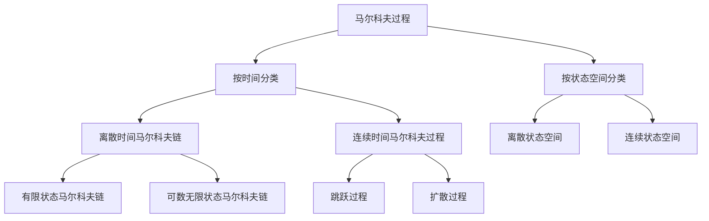

# 第1章：马尔科夫过程基础理论

## 1.1 马尔科夫过程的基本概念

### 1.1.1 定义
马尔科夫过程是一类特殊的随机过程，其核心特征是**无记忆性**（Markov property）。

**数学定义**：设 $\{X_t, t \geq 0\}$ 是定义在概率空间 $(\Omega, \mathcal{F}, P)$ 上的随机过程，状态空间为 $S$。如果对于任意的 $0 \leq t_0 < t_1 < \cdots < t_n < t$，有：

$$P(X_t \in A | X_{t_0}, X_{t_1}, \ldots, X_{t_n}) = P(X_t \in A | X_{t_n})$$

其中 $A \subseteq S$，则称 $\{X_t\}$ 为马尔科夫过程。

### 1.1.2 马尔科夫性质的含义
- **无记忆性**：未来的状态只依赖于当前状态，与过去的历史无关
- **条件独立性**：给定现在，未来与过去条件独立
- **一阶依赖性**：下一时刻的状态只依赖于当前时刻的状态

### 1.1.3 马尔科夫过程的分类



## 1.2 状态空间和转移概率

### 1.2.1 状态空间
**定义**：马尔科夫过程所有可能取值的集合称为状态空间，记作 $S$。

**分类**：
- **有限状态空间**：$S = \{1, 2, \ldots, N\}$
- **可数无限状态空间**：$S = \{0, 1, 2, \ldots\}$ 或 $S = \mathbb{Z}$
- **连续状态空间**：$S = \mathbb{R}$ 或 $S = \mathbb{R}^d$

### 1.2.2 转移概率
对于离散时间马尔科夫链，转移概率定义为：

$$p_{ij}(m,n) = P(X_n = j | X_m = i), \quad m < n$$

**齐次马尔科夫链**：如果转移概率与时间起点无关，即：
$$p_{ij}(m,n) = p_{ij}(0, n-m)$$

通常记作：
$$p_{ij}^{(n)} = P(X_{m+n} = j | X_m = i)$$

特别地，一步转移概率：
$$p_{ij} = p_{ij}^{(1)} = P(X_{n+1} = j | X_n = i)$$

### 1.2.3 转移概率的性质
1. **非负性**：$p_{ij} \geq 0$ 对所有 $i, j \in S$
2. **归一性**：$\sum_{j \in S} p_{ij} = 1$ 对所有 $i \in S$

## 1.3 转移矩阵

### 1.3.1 定义
对于有限状态空间 $S = \{1, 2, \ldots, N\}$，转移矩阵 $P$ 定义为：

$$P = \begin{pmatrix}
p_{11} & p_{12} & \cdots & p_{1N} \\
p_{21} & p_{22} & \cdots & p_{2N} \\
\vdots & \vdots & \ddots & \vdots \\
p_{N1} & p_{N2} & \cdots & p_{NN}
\end{pmatrix}$$

### 1.3.2 转移矩阵的性质
1. **随机矩阵**：每行元素非负且和为1
2. **$n$步转移矩阵**：$P^{(n)} = P^n$
3. **Chapman-Kolmogorov方程**：
   $$p_{ij}^{(m+n)} = \sum_{k \in S} p_{ik}^{(m)} p_{kj}^{(n)}$$

## 1.4 初始分布和有限维分布

### 1.4.1 初始分布
马尔科夫链的初始分布 $\mu$ 定义为：
$$\mu_i = P(X_0 = i), \quad i \in S$$

满足：$\mu_i \geq 0$ 且 $\sum_{i \in S} \mu_i = 1$

### 1.4.2 有限维分布
马尔科夫链在时刻 $0, 1, \ldots, n$ 的联合分布为：

$$P(X_0 = i_0, X_1 = i_1, \ldots, X_n = i_n) = \mu_{i_0} \prod_{k=0}^{n-1} p_{i_k i_{k+1}}$$

## 1.5 Python实现基础示例

```python
import numpy as np
import matplotlib.pyplot as plt
from scipy.linalg import matrix_power

class MarkovChain:
    """基础马尔科夫链类"""

    def __init__(self, transition_matrix, initial_distribution=None):
        """
        初始化马尔科夫链

        Parameters:
        -----------
        transition_matrix : array-like
            转移矩阵
        initial_distribution : array-like, optional
            初始分布，默认为均匀分布
        """
        self.P = np.array(transition_matrix)
        self.n_states = self.P.shape[0]

        # 验证转移矩阵的有效性
        self._validate_transition_matrix()

        # 设置初始分布
        if initial_distribution is None:
            self.pi0 = np.ones(self.n_states) / self.n_states
        else:
            self.pi0 = np.array(initial_distribution)

    def _validate_transition_matrix(self):
        """验证转移矩阵的有效性"""
        # 检查矩阵是否为方阵
        if self.P.shape[0] != self.P.shape[1]:
            raise ValueError("转移矩阵必须是方阵")

        # 检查所有元素是否非负
        if np.any(self.P < 0):
            raise ValueError("转移矩阵所有元素必须非负")

        # 检查每行和是否为1
        row_sums = np.sum(self.P, axis=1)
        if not np.allclose(row_sums, 1.0):
            raise ValueError("转移矩阵每行和必须为1")

    def simulate(self, n_steps, initial_state=None):
        """
        模拟马尔科夫链路径

        Parameters:
        -----------
        n_steps : int
            模拟步数
        initial_state : int, optional
            初始状态，默认根据初始分布随机选择

        Returns:
        --------
        path : list
            状态路径
        """
        if initial_state is None:
            current_state = np.random.choice(self.n_states, p=self.pi0)
        else:
            current_state = initial_state

        path = [current_state]

        for _ in range(n_steps):
            # 根据当前状态的转移概率选择下一状态
            next_state = np.random.choice(self.n_states, p=self.P[current_state])
            path.append(next_state)
            current_state = next_state

        return path

    def n_step_transition_matrix(self, n):
        """计算n步转移矩阵"""
        return matrix_power(self.P, n)

    def state_distribution(self, n):
        """计算n步后的状态分布"""
        return self.pi0 @ self.n_step_transition_matrix(n)

# 示例：天气模型
def weather_example():
    """天气马尔科夫链示例"""
    # 状态：0-晴天，1-雨天
    # 转移矩阵：今天晴天明天80%晴天20%雨天，今天雨天明天60%晴天40%雨天
    P = np.array([
        [0.8, 0.2],  # 晴天 -> [晴天, 雨天]
        [0.6, 0.4]   # 雨天 -> [晴天, 雨天]
    ])

    # 初始分布：今天晴天
    pi0 = np.array([1.0, 0.0])

    # 创建马尔科夫链
    weather_chain = MarkovChain(P, pi0)

    # 模拟30天天气
    weather_path = weather_chain.simulate(30, initial_state=0)

    # 打印结果
    weather_names = ['晴天', '雨天']
    print("30天天气模拟：")
    for i, state in enumerate(weather_path):
        print(f"第{i}天: {weather_names[state]}")

    # 计算长期分布
    print("\n长期天气分布：")
    for n in [1, 5, 10, 50]:
        dist = weather_chain.state_distribution(n)
        print(f"{n}天后: 晴天概率={dist[0]:.3f}, 雨天概率={dist[1]:.3f}")

    return weather_chain, weather_path

# 运行示例
if __name__ == "__main__":
    weather_chain, path = weather_example()
```

## 1.6 章节小结

本章学习了马尔科夫过程的基础理论，包括：

1. **核心概念**：马尔科夫性质（无记忆性）是马尔科夫过程的根本特征
2. **数学定义**：通过条件概率精确定义了马尔科夫过程
3. **分类体系**：按时间和状态空间对马尔科夫过程进行分类
4. **转移概率**：描述状态间转换的概率机制
5. **转移矩阵**：有限状态马尔科夫链的矩阵表示
6. **Python实现**：通过编程实现基础的马尔科夫链模拟

**关键公式**：
- 马尔科夫性质：$P(X_t \in A | X_{t_0}, \ldots, X_{t_n}) = P(X_t \in A | X_{t_n})$
- Chapman-Kolmogorov方程：$p_{ij}^{(m+n)} = \sum_k p_{ik}^{(m)} p_{kj}^{(n)}$
- 有限维分布：$P(X_0 = i_0, \ldots, X_n = i_n) = \mu_{i_0} \prod_{k=0}^{n-1} p_{i_k i_{k+1}}$

这些基础理论为后续学习更复杂的马尔科夫模型和金融应用奠定了坚实基础。