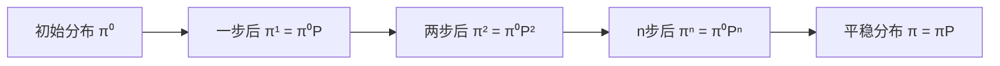

# 第2章：离散时间马尔科夫链

## 2.1 离散时间马尔科夫链的数学模型

### 2.1.1 严格定义
设 $\{X_n, n = 0, 1, 2, \ldots\}$ 是定义在离散时间集合上的随机过程，状态空间为 $S$。如果对于任意的 $n \geq 0$ 和任意状态序列 $i_0, i_1, \ldots, i_n, j \in S$，有：

$$P(X_{n+1} = j | X_0 = i_0, X_1 = i_1, \ldots, X_n = i_n) = P(X_{n+1} = j | X_n = i_n)$$

则称 $\{X_n\}$ 为离散时间马尔科夫链。

### 2.1.2 齐次性假设
如果转移概率与时间无关，即：
$$P(X_{n+1} = j | X_n = i) = P(X_1 = j | X_0 = i) = p_{ij}$$

则称为**时间齐次马尔科夫链**，转移概率 $p_{ij}$ 称为**一步转移概率**。

### 2.1.3 马尔科夫链的完全刻画
一个齐次马尔科夫链完全由以下两个要素确定：
1. **初始分布**：$\pi^{(0)} = (\pi_1^{(0)}, \pi_2^{(0)}, \ldots)$，其中 $\pi_i^{(0)} = P(X_0 = i)$
2. **转移矩阵**：$P = (p_{ij})_{i,j \in S}$

## 2.2 转移矩阵的性质与计算

### 2.2.1 转移矩阵的基本性质

对于有限状态空间 $S = \{1, 2, \ldots, N\}$，转移矩阵 $P$ 是一个 $N \times N$ 的矩阵：

$$P = \begin{pmatrix}
p_{11} & p_{12} & \cdots & p_{1N} \\
p_{21} & p_{22} & \cdots & p_{2N} \\
\vdots & \vdots & \ddots & \vdots \\
p_{N1} & p_{N2} & \cdots & p_{NN}
\end{pmatrix}$$

**性质**：
1. **非负性**：$p_{ij} \geq 0$，$\forall i, j \in S$
2. **行随机性**：$\sum_{j=1}^N p_{ij} = 1$，$\forall i \in S$

### 2.2.2 n步转移概率

**定义**：从状态 $i$ 出发，经过 $n$ 步到达状态 $j$ 的概率：
$$p_{ij}^{(n)} = P(X_{m+n} = j | X_m = i)$$

**Chapman-Kolmogorov方程**：
$$p_{ij}^{(m+n)} = \sum_{k \in S} p_{ik}^{(m)} p_{kj}^{(n)}$$

**矩阵形式**：
$$P^{(n)} = P^n$$

即 $n$ 步转移矩阵等于一步转移矩阵的 $n$ 次幂。

### 2.2.3 状态分布的演化

设第 $n$ 步的状态分布为 $\pi^{(n)} = (\pi_1^{(n)}, \pi_2^{(n)}, \ldots)$，其中：
$$\pi_j^{(n)} = P(X_n = j)$$

则状态分布的演化遵循：
$$\pi^{(n+1)} = \pi^{(n)} P$$

或者：
$$\pi^{(n)} = \pi^{(0)} P^n$$

## 2.3 初始分布和平稳分布

### 2.3.1 初始分布的影响



### 2.3.2 平稳分布

**定义**：如果存在概率分布 $\pi = (\pi_1, \pi_2, \ldots)$ 满足：
$$\pi = \pi P$$

即：
$$\pi_j = \sum_{i \in S} \pi_i p_{ij}, \quad \forall j \in S$$

则称 $\pi$ 为马尔科夫链的**平稳分布**。

**物理意义**：如果马尔科夫链从平稳分布开始，那么它在任何时刻的分布都保持不变。

### 2.3.3 平稳分布的计算

平稳分布 $\pi$ 是线性方程组的解：
$$\begin{cases}
\pi = \pi P \\
\sum_{i=1}^N \pi_i = 1 \\
\pi_i \geq 0, \quad i = 1, 2, \ldots, N
\end{cases}$$

等价于求解：
$$\begin{cases}
\pi (P - I) = 0 \\
\sum_{i=1}^N \pi_i = 1
\end{cases}$$

## 2.4 首达时间和首达概率

### 2.4.1 首达时间
**定义**：从状态 $i$ 首次到达状态 $j$ 的时间：
$$T_{ij} = \inf\{n \geq 1 : X_n = j | X_0 = i\}$$

### 2.4.2 首达概率
**定义**：从状态 $i$ 最终到达状态 $j$ 的概率：
$$f_{ij} = P(T_{ij} < \infty | X_0 = i)$$

**计算公式**：
$$f_{ij} = \sum_{n=1}^{\infty} f_{ij}^{(n)}$$

其中 $f_{ij}^{(n)}$ 是从状态 $i$ 恰好在第 $n$ 步首次到达状态 $j$ 的概率。

### 2.4.3 返回概率和周期
- **返回概率**：$f_{ii}$ 表示从状态 $i$ 最终返回状态 $i$ 的概率
- **常返状态**：如果 $f_{ii} = 1$，则状态 $i$ 是常返的
- **暂态**：如果 $f_{ii} < 1$，则状态 $i$ 是暂态的

## 2.5 Python实现与应用

```python
import numpy as np
import matplotlib.pyplot as plt
from scipy.linalg import eig
import pandas as pd

class DiscreteMarkovChain:
    """离散时间马尔科夫链类"""

    def __init__(self, transition_matrix, state_names=None):
        """
        初始化离散时间马尔科夫链

        Parameters:
        -----------
        transition_matrix : array-like
            转移矩阵
        state_names : list, optional
            状态名称列表
        """
        self.P = np.array(transition_matrix, dtype=float)
        self.n_states = self.P.shape[0]

        if state_names is None:
            self.state_names = [f"State_{i}" for i in range(self.n_states)]
        else:
            self.state_names = state_names

        self._validate_transition_matrix()

    def _validate_transition_matrix(self):
        """验证转移矩阵"""
        if self.P.shape[0] != self.P.shape[1]:
            raise ValueError("转移矩阵必须是方阵")

        if np.any(self.P < 0):
            raise ValueError("转移矩阵元素必须非负")

        row_sums = np.sum(self.P, axis=1)
        if not np.allclose(row_sums, 1.0, rtol=1e-10):
            raise ValueError("转移矩阵每行和必须为1")

    def n_step_transition_matrix(self, n):
        """计算n步转移矩阵"""
        if n == 0:
            return np.eye(self.n_states)
        elif n == 1:
            return self.P.copy()
        else:
            return np.linalg.matrix_power(self.P, n)

    def stationary_distribution(self):
        """计算平稳分布"""
        # 求解特征值为1的左特征向量
        eigenvalues, left_eigenvectors = eig(self.P.T)

        # 找到特征值最接近1的特征向量
        stationary_idx = np.argmin(np.abs(eigenvalues - 1))
        stationary = np.real(left_eigenvectors[:, stationary_idx])

        # 归一化使其成为概率分布
        stationary = stationary / np.sum(stationary)

        # 确保所有元素非负
        if np.any(stationary < 0):
            stationary = np.abs(stationary)
            stationary = stationary / np.sum(stationary)

        return stationary

    def fundamental_matrix(self):
        """计算基本矩阵 (I - Q)^(-1)，其中Q是暂态部分"""
        # 这里假设所有状态都是暂态，实际应用中需要先识别状态类型
        I = np.eye(self.n_states)
        try:
            N = np.linalg.inv(I - self.P)
            return N
        except np.linalg.LinAlgError:
            print("矩阵不可逆，可能存在常返状态")
            return None

    def absorption_probabilities(self, transient_states, absorbing_states):
        """计算吸收概率"""
        # 提取Q矩阵（暂态到暂态）和R矩阵（暂态到吸收）
        Q = self.P[np.ix_(transient_states, transient_states)]
        R = self.P[np.ix_(transient_states, absorbing_states)]

        # 计算基本矩阵
        I = np.eye(len(transient_states))
        N = np.linalg.inv(I - Q)

        # 计算吸收概率矩阵
        B = N @ R

        return B, N

    def simulate_path(self, initial_state, n_steps, seed=None):
        """模拟马尔科夫链路径"""
        if seed is not None:
            np.random.seed(seed)

        if isinstance(initial_state, str):
            current_state = self.state_names.index(initial_state)
        else:
            current_state = initial_state

        path = [current_state]
        state_names_path = [self.state_names[current_state]]

        for _ in range(n_steps):
            # 根据当前状态的转移概率选择下一状态
            next_state = np.random.choice(
                self.n_states,
                p=self.P[current_state]
            )
            path.append(next_state)
            state_names_path.append(self.state_names[next_state])
            current_state = next_state

        return path, state_names_path

    def expected_return_time(self, state):
        """计算状态的期望返回时间"""
        stationary = self.stationary_distribution()
        if stationary[state] > 0:
            return 1.0 / stationary[state]
        else:
            return np.inf

    def classify_states(self):
        """状态分类（简化版本）"""
        # 计算可达性矩阵
        reachability = np.eye(self.n_states)
        for i in range(self.n_states):
            power = np.eye(self.n_states)
            for _ in range(self.n_states):
                power = power @ self.P
                reachability = reachability + power

        reachability = (reachability > 0).astype(int)

        # 找到强连通分量（简化）
        strongly_connected = []
        for i in range(self.n_states):
            for j in range(self.n_states):
                if reachability[i, j] and reachability[j, i]:
                    strongly_connected.append((i, j))

        return reachability, strongly_connected

    def plot_transition_graph(self):
        """绘制状态转移图"""
        try:
            import networkx as nx
            import matplotlib.pyplot as plt

            G = nx.DiGraph()

            # 添加节点
            for i, name in enumerate(self.state_names):
                G.add_node(i, label=name)

            # 添加边（只显示概率大于阈值的转移）
            threshold = 0.01
            for i in range(self.n_states):
                for j in range(self.n_states):
                    if self.P[i, j] > threshold:
                        G.add_edge(i, j, weight=self.P[i, j])

            # 绘图
            pos = nx.spring_layout(G)
            plt.figure(figsize=(10, 8))

            # 绘制节点
            nx.draw_networkx_nodes(G, pos, node_color='lightblue',
                                 node_size=1000)

            # 绘制边
            nx.draw_networkx_edges(G, pos, edge_color='gray',
                                 arrows=True, arrowsize=20)

            # 添加标签
            labels = {i: name for i, name in enumerate(self.state_names)}
            nx.draw_networkx_labels(G, pos, labels)

            # 添加边权重标签
            edge_labels = {(i, j): f"{self.P[i, j]:.2f}"
                          for i in range(self.n_states)
                          for j in range(self.n_states)
                          if self.P[i, j] > threshold}
            nx.draw_networkx_edge_labels(G, pos, edge_labels)

            plt.title("马尔科夫链状态转移图")
            plt.axis('off')
            plt.tight_layout()
            plt.show()

        except ImportError:
            print("需要安装networkx库来绘制转移图")

# 应用示例1：随机游走模型
def random_walk_example():
    """一维随机游走示例"""
    # 状态空间：-2, -1, 0, 1, 2
    # 在边界状态时有反射
    n_states = 5
    states = list(range(-2, 3))  # [-2, -1, 0, 1, 2]
    state_names = [f"Position_{i}" for i in states]

    # 构造转移矩阵
    P = np.zeros((n_states, n_states))

    for i in range(n_states):
        current_pos = states[i]

        if current_pos == -2:  # 左边界
            P[i, i] = 0.5      # 停留
            P[i, i + 1] = 0.5  # 右移
        elif current_pos == 2:  # 右边界
            P[i, i - 1] = 0.5  # 左移
            P[i, i] = 0.5      # 停留
        else:  # 内部状态
            P[i, i - 1] = 0.3  # 左移
            P[i, i] = 0.4      # 停留
            P[i, i + 1] = 0.3  # 右移

    # 创建马尔科夫链
    rw_chain = DiscreteMarkovChain(P, state_names)

    # 分析性质
    print("随机游走马尔科夫链分析")
    print("=" * 40)

    # 平稳分布
    stationary = rw_chain.stationary_distribution()
    print("\\n平稳分布：")
    for i, (name, prob) in enumerate(zip(state_names, stationary)):
        print(f"{name}: {prob:.4f}")

    # 期望返回时间
    print("\\n期望返回时间：")
    for i, name in enumerate(state_names):
        return_time = rw_chain.expected_return_time(i)
        print(f"{name}: {return_time:.2f}")

    # 模拟路径
    path, path_names = rw_chain.simulate_path(2, 20, seed=42)  # 从位置0开始
    print(f"\\n模拟路径（20步）：")
    print(" -> ".join(path_names[:10]) + " -> ...")

    return rw_chain

# 应用示例2：品牌忠诚度模型
def brand_loyalty_example():
    """品牌忠诚度马尔科夫链模型"""
    # 状态：品牌A、品牌B、品牌C
    state_names = ["Brand_A", "Brand_B", "Brand_C"]

    # 转移矩阵：行表示当前品牌，列表示下次购买的品牌
    P = np.array([
        [0.7, 0.2, 0.1],  # 品牌A的顾客
        [0.1, 0.8, 0.1],  # 品牌B的顾客
        [0.2, 0.3, 0.5]   # 品牌C的顾客
    ])

    brand_chain = DiscreteMarkovChain(P, state_names)

    print("品牌忠诚度分析")
    print("=" * 30)

    # 平稳分布（长期市场份额）
    stationary = brand_chain.stationary_distribution()
    print("\\n长期市场份额：")
    for name, share in zip(state_names, stationary):
        print(f"{name}: {share:.1%}")

    # n步转移概率
    print("\\n5步后转移概率矩阵：")
    P5 = brand_chain.n_step_transition_matrix(5)
    df = pd.DataFrame(P5, index=state_names, columns=state_names)
    print(df.round(4))

    # 顾客生命周期分析
    print("\\n期望返回时间（顾客忠诚度指标）：")
    for i, name in enumerate(state_names):
        return_time = brand_chain.expected_return_time(i)
        print(f"{name}顾客平均 {return_time:.1f} 次购买后重新选择该品牌")

    return brand_chain

# 应用示例3：收入状态转移模型
def income_mobility_example():
    """收入流动性模型"""
    state_names = ["Low Income", "Middle Income", "High Income"]

    # 基于经验数据的转移矩阵
    P = np.array([
        [0.6, 0.3, 0.1],   # 低收入
        [0.2, 0.6, 0.2],   # 中等收入
        [0.1, 0.4, 0.5]    # 高收入
    ])

    income_chain = DiscreteMarkovChain(P, state_names)

    print("收入流动性分析")
    print("=" * 25)

    # 长期收入分布
    stationary = income_chain.stationary_distribution()
    print("\\n长期收入分布：")
    for name, prob in zip(state_names, stationary):
        print(f"{name}: {prob:.1%}")

    # 代际流动性分析
    print("\\n代际流动性（10年后）：")
    P10 = income_chain.n_step_transition_matrix(10)

    print("起始状态 -> 10年后状态分布")
    for i, start_state in enumerate(state_names):
        print(f"{start_state}:")
        for j, end_state in enumerate(state_names):
            print(f"  -> {end_state}: {P10[i, j]:.1%}")

    return income_chain

# 运行所有示例
if __name__ == "__main__":
    print("第2章：离散时间马尔科夫链应用示例\\n")

    # 示例1：随机游走
    rw_chain = random_walk_example()
    print("\\n" + "="*60 + "\\n")

    # 示例2：品牌忠诚度
    brand_chain = brand_loyalty_example()
    print("\\n" + "="*60 + "\\n")

    # 示例3：收入流动性
    income_chain = income_mobility_example()

    # 可视化示例（需要matplotlib）
    try:
        import matplotlib.pyplot as plt

        # 绘制转移概率随时间的变化
        fig, axes = plt.subplots(1, 3, figsize=(15, 4))

        for idx, (chain, title) in enumerate([
            (rw_chain, "Random Walk"),
            (brand_chain, "Brand Loyalty"),
            (income_chain, "Income Mobility")
        ]):
            steps = range(1, 21)
            probs = []

            for n in steps:
                Pn = chain.n_step_transition_matrix(n)
                # 计算从第一个状态出发的分布
                prob_dist = Pn[0, :]
                probs.append(prob_dist)

            probs = np.array(probs)

            for i in range(chain.n_states):
                axes[idx].plot(steps, probs[:, i],
                             label=chain.state_names[i], marker='o')

            axes[idx].set_title(f"{title}\\n状态概率演化")
            axes[idx].set_xlabel("时间步")
            axes[idx].set_ylabel("概率")
            axes[idx].legend()
            axes[idx].grid(True, alpha=0.3)

        plt.tight_layout()
        plt.show()

    except ImportError:
        print("\\n需要安装matplotlib来显示图形")
```

## 2.6 收敛性分析

### 2.6.1 周期性
**定义**：状态 $i$ 的周期为：
$$d(i) = \gcd\{n \geq 1 : p_{ii}^{(n)} > 0\}$$

- 如果 $d(i) = 1$，称状态 $i$ 为**非周期的**
- 如果 $d(i) > 1$，称状态 $i$ 为**周期的**

### 2.6.2 极限定理
对于有限、不可约、非周期的马尔科夫链：
$$\lim_{n \to \infty} p_{ij}^{(n)} = \pi_j$$

其中 $\pi_j$ 是唯一的平稳分布。

### 2.6.3 收敛速度
收敛速度由转移矩阵的第二大特征值（按模）决定。设特征值按模排序为：
$$1 = |\lambda_1| > |\lambda_2| \geq |\lambda_3| \geq \cdots$$

则收敛速度大约为 $|\lambda_2|^n$。

## 2.7 章节小结

本章深入学习了离散时间马尔科夫链的理论和应用：

**核心理论**：
1. **数学模型**：通过转移矩阵完全刻画马尔科夫链
2. **Chapman-Kolmogorov方程**：连接不同时间步的转移概率
3. **平稳分布**：长期稳态下的概率分布
4. **状态分类**：常返性、周期性等概念

**关键公式**：
- n步转移概率：$P^{(n)} = P^n$
- 状态分布演化：$\pi^{(n)} = \pi^{(0)} P^n$
- 平稳分布：$\pi = \pi P$
- 收敛定理：$\lim_{n \to \infty} p_{ij}^{(n)} = \pi_j$

**实际应用**：
1. **随机游走**：空间扩散和位置模型
2. **品牌忠诚度**：市场份额预测
3. **收入流动性**：社会经济分析

这些理论和方法为金融建模提供了重要基础，特别是在建模资产价格运动、信用状态转换等方面具有广泛应用。