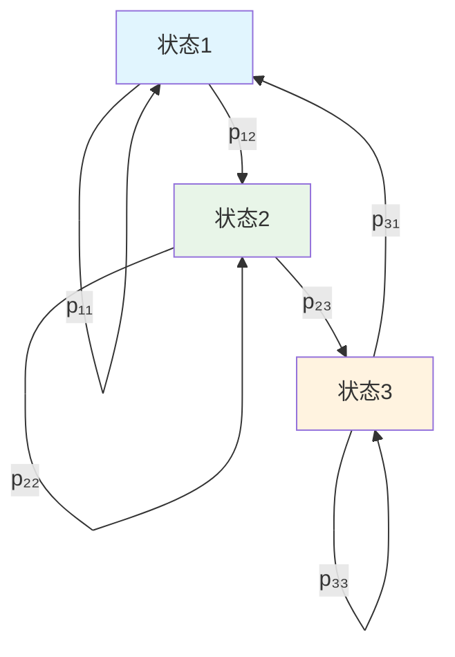

# 第4章：马尔科夫链的渐近行为

::: tip 学习目标
- 理解马尔科夫链的周期性和非周期性
- 掌握不可约性和常返性概念
- 学习平稳分布的存在性和唯一性
- 理解遍历定理和收敛性质
:::

## 知识点总结

### 1. 马尔科夫链的周期性

**定义**：状态 $i$ 的周期定义为：
$$d(i) = \gcd\{n \geq 1 : P_{ii}^{(n)} > 0\}$$

::: note 周期性分类
- **非周期状态**：$d(i) = 1$
- **周期状态**：$d(i) > 1$
- 如果马尔科夫链不可约，则所有状态具有相同的周期
:::

### 2. 不可约性

**定义**：如果对于任意两个状态 $i, j$，存在某个时刻 $n$ 使得 $P_{ij}^{(n)} > 0$，则称马尔科夫链是不可约的。



### 3. 常返性与瞬时性

**常返状态**：如果从状态 $i$ 出发，最终返回状态 $i$ 的概率为1：
$$f_{ii} = \sum_{n=1}^{\infty} f_{ii}^{(n)} = 1$$

**瞬时状态**：如果 $f_{ii} < 1$

::: warning 重要定理
对于有限状态空间的不可约马尔科夫链，所有状态都是常返的。
:::

### 4. 平稳分布

**定义**：概率分布 $\pi = (\pi_1, \pi_2, \ldots)$ 称为平稳分布，如果：
$$\pi_j = \sum_{i} \pi_i P_{ij}, \quad \forall j$$

即：$\pi = \pi P$

**存在性定理**：
- 对于有限、不可约、非周期的马尔科夫链，存在唯一的平稳分布
- 平稳分布满足：$\pi_j = \frac{1}{\mu_j}$，其中 $\mu_j$ 是返回状态 $j$ 的平均时间

## 示例代码

### 示例1：检验马尔科夫链的不可约性

```python
import numpy as np
import matplotlib.pyplot as plt
from scipy.linalg import matrix_power

def is_irreducible(P, max_steps=100):
    """
    检验转移矩阵P对应的马尔科夫链是否不可约

    Parameters:
    P: 转移矩阵
    max_steps: 最大步数

    Returns:
    bool: 是否不可约
    """
    n = P.shape[0]

    # 计算可达性矩阵
    reachable = np.zeros((n, n), dtype=bool)
    current_power = np.eye(n)

    for step in range(1, max_steps + 1):
        current_power = current_power @ P
        reachable |= (current_power > 0)

    # 检查是否所有状态对都可达
    return np.all(reachable)

def find_period(P, state_idx, max_steps=100):
    """
    计算指定状态的周期

    Parameters:
    P: 转移矩阵
    state_idx: 状态索引
    max_steps: 最大步数

    Returns:
    int: 状态的周期
    """
    # 找出所有能返回到该状态的步数
    return_steps = []
    current_power = P.copy()

    for n in range(1, max_steps + 1):
        if current_power[state_idx, state_idx] > 0:
            return_steps.append(n)
        current_power = current_power @ P

    if not return_steps:
        return 0  # 瞬时状态

    # 计算最大公约数
    from math import gcd
    from functools import reduce
    return reduce(gcd, return_steps)

# 示例：3状态马尔科夫链
P1 = np.array([
    [0.2, 0.5, 0.3],
    [0.4, 0.3, 0.3],
    [0.6, 0.2, 0.2]
])

print("转移矩阵P1:")
print(P1)
print(f"是否不可约: {is_irreducible(P1)}")
print(f"状态0的周期: {find_period(P1, 0)}")
```

### 示例2：计算平稳分布

```python
def find_stationary_distribution(P, method='eigenvalue'):
    """
    计算马尔科夫链的平稳分布

    Parameters:
    P: 转移矩阵
    method: 计算方法 ('eigenvalue' 或 'iterative')

    Returns:
    numpy.array: 平稳分布
    """
    n = P.shape[0]

    if method == 'eigenvalue':
        # 方法1：求解特征值问题 π = πP
        # 等价于求解 (P^T - I)π = 0
        eigenvals, eigenvecs = np.linalg.eig(P.T)

        # 找到特征值为1的特征向量
        stationary_idx = np.argmin(np.abs(eigenvals - 1))
        stationary = np.real(eigenvecs[:, stationary_idx])

        # 归一化使其成为概率分布
        stationary = stationary / np.sum(stationary)

    elif method == 'iterative':
        # 方法2：迭代法
        pi = np.ones(n) / n  # 初始均匀分布

        for _ in range(1000):
            pi_new = pi @ P
            if np.allclose(pi, pi_new, atol=1e-8):
                break
            pi = pi_new

        stationary = pi

    return np.abs(stationary)  # 确保非负

def calculate_mean_return_time(pi):
    """
    计算平均返回时间

    Parameters:
    pi: 平稳分布

    Returns:
    numpy.array: 各状态的平均返回时间
    """
    return 1 / pi

# 计算平稳分布
pi_eigenvalue = find_stationary_distribution(P1, 'eigenvalue')
pi_iterative = find_stationary_distribution(P1, 'iterative')

print(f"\n特征值法计算的平稳分布: {pi_eigenvalue}")
print(f"迭代法计算的平稳分布: {pi_iterative}")
print(f"验证平稳性: π = πP")
print(f"πP = {pi_eigenvalue @ P1}")

# 计算平均返回时间
mean_return_times = calculate_mean_return_time(pi_eigenvalue)
print(f"\n各状态的平均返回时间: {mean_return_times}")
```

### 示例3：遍历定理验证

```python
def simulate_markov_chain(P, initial_state, n_steps):
    """
    模拟马尔科夫链

    Parameters:
    P: 转移矩阵
    initial_state: 初始状态
    n_steps: 模拟步数

    Returns:
    list: 状态序列
    """
    states = [initial_state]
    current_state = initial_state

    for _ in range(n_steps):
        # 根据转移概率选择下一状态
        next_state = np.random.choice(len(P), p=P[current_state])
        states.append(next_state)
        current_state = next_state

    return states

def calculate_empirical_distribution(states, n_states):
    """
    计算经验分布

    Parameters:
    states: 状态序列
    n_states: 状态总数

    Returns:
    numpy.array: 经验分布
    """
    counts = np.bincount(states, minlength=n_states)
    return counts / len(states)

# 遍历定理验证
np.random.seed(42)
n_steps = 10000
n_states = len(P1)

# 从不同初始状态开始模拟
initial_states = [0, 1, 2]
empirical_distributions = []

plt.figure(figsize=(12, 8))

for i, initial_state in enumerate(initial_states):
    # 模拟马尔科夫链
    states = simulate_markov_chain(P1, initial_state, n_steps)

    # 计算累积经验分布
    cumulative_empirical = []
    for t in range(100, n_steps + 1, 100):
        emp_dist = calculate_empirical_distribution(states[:t], n_states)
        cumulative_empirical.append(emp_dist)

    # 绘制收敛过程
    cumulative_empirical = np.array(cumulative_empirical)
    time_points = range(100, n_steps + 1, 100)

    for state in range(n_states):
        plt.subplot(2, 2, i + 1)
        plt.plot(time_points, cumulative_empirical[:, state],
                label=f'状态{state}', linewidth=2)
        plt.axhline(y=pi_eigenvalue[state], color=f'C{state}',
                   linestyle='--', alpha=0.7, label=f'理论值{state}')

    plt.title(f'从状态{initial_state}开始的收敛过程')
    plt.xlabel('时间步')
    plt.ylabel('状态概率')
    plt.legend()
    plt.grid(True, alpha=0.3)

# 最终经验分布比较
plt.subplot(2, 2, 4)
final_empirical = calculate_empirical_distribution(states, n_states)
x = np.arange(n_states)
width = 0.35

plt.bar(x - width/2, pi_eigenvalue, width, label='理论平稳分布', alpha=0.7)
plt.bar(x + width/2, final_empirical, width, label='经验分布', alpha=0.7)
plt.xlabel('状态')
plt.ylabel('概率')
plt.title('平稳分布与经验分布对比')
plt.legend()
plt.xticks(x)

plt.tight_layout()
plt.show()

print(f"\n理论平稳分布: {pi_eigenvalue}")
print(f"经验分布: {final_empirical}")
print(f"差异: {np.abs(pi_eigenvalue - final_empirical)}")
```

### 示例4：混合时间分析

```python
def total_variation_distance(p, q):
    """
    计算两个概率分布的全变差距离

    Parameters:
    p, q: 概率分布

    Returns:
    float: 全变差距离
    """
    return 0.5 * np.sum(np.abs(p - q))

def mixing_time_analysis(P, epsilon=0.01):
    """
    分析马尔科夫链的混合时间

    Parameters:
    P: 转移矩阵
    epsilon: 收敛容差

    Returns:
    dict: 混合时间分析结果
    """
    n_states = P.shape[0]
    pi_stationary = find_stationary_distribution(P)

    results = {}

    # 对每个初始分布计算混合时间
    for initial_state in range(n_states):
        # 初始分布（delta函数）
        current_dist = np.zeros(n_states)
        current_dist[initial_state] = 1.0

        mixing_time = 0
        distances = []

        for t in range(500):  # 最大迭代次数
            # 计算t步后的分布
            current_dist = current_dist @ matrix_power(P, 1)

            # 计算与平稳分布的距离
            tv_distance = total_variation_distance(current_dist, pi_stationary)
            distances.append(tv_distance)

            # 检查是否达到混合时间
            if tv_distance <= epsilon:
                mixing_time = t + 1
                break

        results[f'state_{initial_state}'] = {
            'mixing_time': mixing_time,
            'distances': distances
        }

    return results, pi_stationary

# 混合时间分析
mixing_results, pi_stat = mixing_time_analysis(P1)

plt.figure(figsize=(12, 6))

# 绘制收敛曲线
plt.subplot(1, 2, 1)
for state in range(len(P1)):
    distances = mixing_results[f'state_{state}']['distances']
    plt.semilogy(distances, label=f'从状态{state}开始', linewidth=2)
    mixing_time = mixing_results[f'state_{state}']['mixing_time']
    if mixing_time > 0:
        plt.axvline(x=mixing_time-1, color=f'C{state}',
                   linestyle='--', alpha=0.7)

plt.axhline(y=0.01, color='red', linestyle='-', alpha=0.5,
           label='ε = 0.01')
plt.xlabel('时间步')
plt.ylabel('全变差距离（对数尺度）')
plt.title('马尔科夫链的混合时间')
plt.legend()
plt.grid(True, alpha=0.3)

# 混合时间条形图
plt.subplot(1, 2, 2)
states = [f'状态{i}' for i in range(len(P1))]
mixing_times = [mixing_results[f'state_{i}']['mixing_time']
                for i in range(len(P1))]

plt.bar(states, mixing_times, alpha=0.7, color=['C0', 'C1', 'C2'])
plt.ylabel('混合时间')
plt.title('各初始状态的混合时间')
plt.grid(True, alpha=0.3, axis='y')

for i, time in enumerate(mixing_times):
    plt.text(i, time + 0.5, str(time), ha='center', va='bottom')

plt.tight_layout()
plt.show()

print("\n混合时间分析结果:")
for state in range(len(P1)):
    mixing_time = mixing_results[f'state_{state}']['mixing_time']
    print(f"从状态{state}开始的混合时间: {mixing_time}步")
```

## 理论分析

### 遍历定理

::: tip 强大数定律（遍历定理）
对于不可约、有限状态的马尔科夫链，有：

$$\lim_{n \to \infty} \frac{1}{n} \sum_{k=1}^{n} \mathbf{1}_{\{X_k = j\}} = \pi_j \quad \text{a.s.}$$

其中 $\pi_j$ 是状态 $j$ 的平稳概率。
:::

### 收敛速度

马尔科夫链向平稳分布的收敛速度由转移矩阵的第二大特征值决定：

$$\|P^n(i,\cdot) - \pi\|_{TV} \leq C \cdot |\lambda_2|^n$$

其中：
- $\lambda_2$ 是第二大特征值
- $C$ 是常数
- $\|\cdot\|_{TV}$ 是全变差范数

### 可逆性

::: note 详细平衡条件
如果存在概率分布 $\pi$ 使得：
$$\pi_i P_{ij} = \pi_j P_{ji}, \quad \forall i,j$$

则称马尔科夫链满足详细平衡条件，且 $\pi$ 是可逆的平稳分布。
:::

## 数学公式总结

1. **周期性**：$d(i) = \gcd\{n \geq 1 : P_{ii}^{(n)} > 0\}$

2. **常返概率**：$f_{ii} = \sum_{n=1}^{\infty} f_{ii}^{(n)}$

3. **平稳分布**：$\pi = \pi P$，且 $\sum_j \pi_j = 1$

4. **平均返回时间**：$\mu_j = \frac{1}{\pi_j}$

5. **全变差距离**：$\|p - q\|_{TV} = \frac{1}{2}\sum_i |p_i - q_i|$

6. **混合时间**：$t_{mix}(\epsilon) = \min\{t : \max_i \|P^t(i,\cdot) - \pi\|_{TV} \leq \epsilon\}$

::: warning 注意事项
- 周期性会影响收敛性质，但不影响平稳分布的存在性
- 有限状态空间的不可约链必然存在唯一平稳分布
- 可逆链具有良好的数值性质，常用于MCMC算法
:::