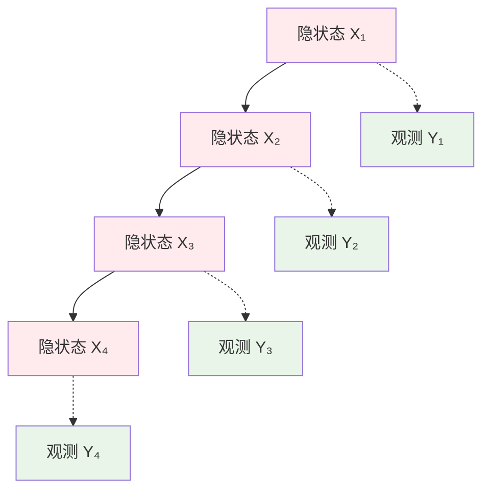

# 第5章：隐马尔科夫模型(HMM)基础

::: tip 学习目标
- 理解隐马尔科夫模型的结构
- 掌握观测过程和隐状态过程的关系
- 学习前向-后向算法
- 理解Viterbi算法和Baum-Welch算法
:::

## 知识点总结

### 1. 隐马尔科夫模型基本结构

隐马尔科夫模型（HMM）是一个双重随机过程：
- **隐状态序列** $\{X_t\}$：不可直接观测的马尔科夫链
- **观测序列** $\{Y_t\}$：可观测的随机过程



### 2. HMM的三个基本要素

**转移概率矩阵** $A$：
$$A = \{a_{ij}\}, \quad a_{ij} = P(X_{t+1} = j | X_t = i)$$

**发射概率矩阵** $B$：
$$B = \{b_j(k)\}, \quad b_j(k) = P(Y_t = v_k | X_t = j)$$

**初始状态概率** $\pi$：
$$\pi = \{\pi_i\}, \quad \pi_i = P(X_1 = i)$$

::: note HMM的三个基本假设
1. **马尔科夫假设**：$P(X_t|X_{t-1}, X_{t-2}, \ldots, X_1) = P(X_t|X_{t-1})$
2. **观测独立假设**：$P(Y_t|X_t, X_{t-1}, \ldots, Y_{t-1}, \ldots) = P(Y_t|X_t)$
3. **齐次性假设**：转移概率和发射概率不随时间变化
:::

### 3. HMM的三个基本问题

1. **评估问题**：给定模型参数，计算观测序列的概率
2. **解码问题**：给定观测序列，找出最可能的隐状态序列
3. **学习问题**：给定观测序列，估计模型参数

## 示例代码

### 示例1：HMM模型类实现

```python
import numpy as np
import matplotlib.pyplot as plt
from scipy.special import logsumexp

class HiddenMarkovModel:
    """
    隐马尔科夫模型实现
    """

    def __init__(self, n_states, n_observations):
        """
        初始化HMM模型

        Parameters:
        n_states: 隐状态数量
        n_observations: 观测值数量
        """
        self.n_states = n_states
        self.n_observations = n_observations

        # 初始化参数
        self.transition_matrix = None  # 转移概率矩阵 A
        self.emission_matrix = None    # 发射概率矩阵 B
        self.initial_probs = None      # 初始概率分布 π

    def initialize_parameters(self, random_state=42):
        """
        随机初始化模型参数
        """
        np.random.seed(random_state)

        # 转移概率矩阵（行和为1）
        self.transition_matrix = np.random.dirichlet(
            np.ones(self.n_states), size=self.n_states
        )

        # 发射概率矩阵（行和为1）
        self.emission_matrix = np.random.dirichlet(
            np.ones(self.n_observations), size=self.n_states
        )

        # 初始状态概率
        self.initial_probs = np.random.dirichlet(np.ones(self.n_states))

    def set_parameters(self, A, B, pi):
        """
        设置模型参数

        Parameters:
        A: 转移概率矩阵
        B: 发射概率矩阵
        pi: 初始状态概率
        """
        self.transition_matrix = A
        self.emission_matrix = B
        self.initial_probs = pi

    def generate_sequence(self, length):
        """
        生成观测序列和对应的隐状态序列

        Parameters:
        length: 序列长度

        Returns:
        observations: 观测序列
        states: 隐状态序列
        """
        states = np.zeros(length, dtype=int)
        observations = np.zeros(length, dtype=int)

        # 初始状态
        states[0] = np.random.choice(self.n_states, p=self.initial_probs)
        observations[0] = np.random.choice(
            self.n_observations,
            p=self.emission_matrix[states[0]]
        )

        # 后续状态
        for t in range(1, length):
            states[t] = np.random.choice(
                self.n_states,
                p=self.transition_matrix[states[t-1]]
            )
            observations[t] = np.random.choice(
                self.n_observations,
                p=self.emission_matrix[states[t]]
            )

        return observations, states

# 创建示例HMM模型
np.random.seed(42)

# 定义模型参数（天气预测示例）
# 状态：0=晴天, 1=雨天
# 观测：0=干燥, 1=潮湿, 2=湿润

A = np.array([
    [0.7, 0.3],  # 晴天->晴天0.7, 晴天->雨天0.3
    [0.4, 0.6]   # 雨天->晴天0.4, 雨天->雨天0.6
])

B = np.array([
    [0.6, 0.3, 0.1],  # 晴天：干燥0.6, 潮湿0.3, 湿润0.1
    [0.1, 0.4, 0.5]   # 雨天：干燥0.1, 潮湿0.4, 湿润0.5
])

pi = np.array([0.6, 0.4])  # 初始概率：晴天0.6, 雨天0.4

# 创建HMM实例
hmm = HiddenMarkovModel(n_states=2, n_observations=3)
hmm.set_parameters(A, B, pi)

# 生成示例序列
observations, true_states = hmm.generate_sequence(20)

print("HMM模型参数:")
print(f"转移矩阵 A:\n{A}")
print(f"发射矩阵 B:\n{B}")
print(f"初始概率 π: {pi}")
print(f"\n观测序列: {observations}")
print(f"真实状态: {true_states}")
```

### 示例2：前向算法实现

```python
def forward_algorithm(hmm, observations):
    """
    前向算法：计算观测序列的概率

    Parameters:
    hmm: HMM模型
    observations: 观测序列

    Returns:
    alpha: 前向概率矩阵
    log_probability: 观测序列的对数概率
    """
    T = len(observations)
    N = hmm.n_states

    # 初始化前向概率矩阵（使用对数概率避免下溢）
    log_alpha = np.zeros((T, N))

    # 初始化：t=0
    log_alpha[0] = (np.log(hmm.initial_probs) +
                   np.log(hmm.emission_matrix[:, observations[0]]))

    # 递推：t=1,2,...,T-1
    for t in range(1, T):
        for j in range(N):
            # log(sum(exp(log_values))) = logsumexp(log_values)
            log_alpha[t, j] = logsumexp(
                log_alpha[t-1] + np.log(hmm.transition_matrix[:, j])
            ) + np.log(hmm.emission_matrix[j, observations[t]])

    # 计算观测序列的总概率
    log_probability = logsumexp(log_alpha[T-1])

    return np.exp(log_alpha), log_probability

def backward_algorithm(hmm, observations):
    """
    后向算法

    Parameters:
    hmm: HMM模型
    observations: 观测序列

    Returns:
    beta: 后向概率矩阵
    """
    T = len(observations)
    N = hmm.n_states

    # 初始化后向概率矩阵
    log_beta = np.zeros((T, N))

    # 初始化：t=T-1
    log_beta[T-1] = 0  # log(1) = 0

    # 递推：t=T-2,T-3,...,0
    for t in range(T-2, -1, -1):
        for i in range(N):
            log_beta[t, i] = logsumexp(
                np.log(hmm.transition_matrix[i]) +
                np.log(hmm.emission_matrix[:, observations[t+1]]) +
                log_beta[t+1]
            )

    return np.exp(log_beta)

# 计算前向和后向概率
alpha, log_prob = forward_algorithm(hmm, observations)
beta = backward_algorithm(hmm, observations)

print(f"\n观测序列的对数概率: {log_prob:.4f}")
print(f"观测序列的概率: {np.exp(log_prob):.2e}")

# 验证前向-后向算法的一致性
consistency_check = np.allclose(
    alpha[0] * beta[0],
    alpha[-1].sum()
)
print(f"前向-后向算法一致性检验: {consistency_check}")
```

### 示例3：Viterbi算法实现

```python
def viterbi_algorithm(hmm, observations):
    """
    Viterbi算法：找出最可能的隐状态序列

    Parameters:
    hmm: HMM模型
    observations: 观测序列

    Returns:
    best_path: 最可能的状态序列
    best_prob: 最大概率
    """
    T = len(observations)
    N = hmm.n_states

    # 初始化
    log_delta = np.zeros((T, N))  # Viterbi概率
    psi = np.zeros((T, N), dtype=int)  # 回溯路径

    # 初始化：t=0
    log_delta[0] = (np.log(hmm.initial_probs) +
                   np.log(hmm.emission_matrix[:, observations[0]]))

    # 递推：t=1,2,...,T-1
    for t in range(1, T):
        for j in range(N):
            # 找到到达状态j的最大概率路径
            transition_scores = (log_delta[t-1] +
                               np.log(hmm.transition_matrix[:, j]))

            # 记录最大概率和对应的前一状态
            psi[t, j] = np.argmax(transition_scores)
            log_delta[t, j] = (np.max(transition_scores) +
                              np.log(hmm.emission_matrix[j, observations[t]]))

    # 终止：找到最后时刻的最优状态
    best_final_state = np.argmax(log_delta[T-1])
    best_prob = np.max(log_delta[T-1])

    # 回溯：重构最优路径
    best_path = np.zeros(T, dtype=int)
    best_path[T-1] = best_final_state

    for t in range(T-2, -1, -1):
        best_path[t] = psi[t+1, best_path[t+1]]

    return best_path, best_prob

# 使用Viterbi算法解码
predicted_states, max_log_prob = viterbi_algorithm(hmm, observations)

print(f"\nViterbi解码结果:")
print(f"预测状态序列: {predicted_states}")
print(f"真实状态序列: {true_states}")
print(f"最大路径概率: {np.exp(max_log_prob):.2e}")

# 计算解码准确率
accuracy = np.mean(predicted_states == true_states)
print(f"解码准确率: {accuracy:.2%}")

# 可视化结果
plt.figure(figsize=(12, 8))

# 子图1：观测序列
plt.subplot(3, 1, 1)
plt.plot(observations, 'bo-', linewidth=2, markersize=8)
plt.ylabel('观测值')
plt.title('观测序列')
plt.grid(True, alpha=0.3)
plt.ylim(-0.5, 2.5)
plt.yticks([0, 1, 2], ['干燥', '潮湿', '湿润'])

# 子图2：真实状态
plt.subplot(3, 1, 2)
plt.plot(true_states, 'ro-', linewidth=2, markersize=8, label='真实状态')
plt.ylabel('状态')
plt.title('真实隐状态序列')
plt.grid(True, alpha=0.3)
plt.ylim(-0.5, 1.5)
plt.yticks([0, 1], ['晴天', '雨天'])

# 子图3：预测状态
plt.subplot(3, 1, 3)
plt.plot(predicted_states, 'go-', linewidth=2, markersize=8, label='预测状态')
plt.xlabel('时间')
plt.ylabel('状态')
plt.title('Viterbi预测状态序列')
plt.grid(True, alpha=0.3)
plt.ylim(-0.5, 1.5)
plt.yticks([0, 1], ['晴天', '雨天'])

plt.tight_layout()
plt.show()
```

### 示例4：Baum-Welch算法实现

```python
def baum_welch_algorithm(hmm, observations, max_iterations=100, tolerance=1e-6):
    """
    Baum-Welch算法：EM算法学习HMM参数

    Parameters:
    hmm: HMM模型
    observations: 观测序列
    max_iterations: 最大迭代次数
    tolerance: 收敛容差

    Returns:
    trained_hmm: 训练后的HMM模型
    log_likelihoods: 每次迭代的对数似然
    """
    T = len(observations)
    N = hmm.n_states
    M = hmm.n_observations

    # 保存对数似然变化
    log_likelihoods = []

    for iteration in range(max_iterations):
        # E步：计算前向和后向概率
        alpha, log_prob = forward_algorithm(hmm, observations)
        beta = backward_algorithm(hmm, observations)

        log_likelihoods.append(log_prob)

        # 计算gamma（状态后验概率）
        gamma = alpha * beta
        gamma = gamma / gamma.sum(axis=1, keepdims=True)

        # 计算xi（状态转移后验概率）
        xi = np.zeros((T-1, N, N))
        for t in range(T-1):
            for i in range(N):
                for j in range(N):
                    xi[t, i, j] = (alpha[t, i] *
                                  hmm.transition_matrix[i, j] *
                                  hmm.emission_matrix[j, observations[t+1]] *
                                  beta[t+1, j])

        # 归一化xi
        xi_sum = xi.sum(axis=(1, 2), keepdims=True)
        xi = xi / xi_sum

        # M步：更新参数
        # 更新初始概率
        new_pi = gamma[0]

        # 更新转移概率
        new_A = xi.sum(axis=0) / gamma[:-1].sum(axis=0)[:, np.newaxis]

        # 更新发射概率
        new_B = np.zeros((N, M))
        for j in range(N):
            for k in range(M):
                mask = (observations == k)
                new_B[j, k] = gamma[mask, j].sum() / gamma[:, j].sum()

        # 检查收敛性
        if iteration > 0:
            if abs(log_likelihoods[-1] - log_likelihoods[-2]) < tolerance:
                print(f"收敛于第 {iteration + 1} 次迭代")
                break

        # 更新模型参数
        hmm.initial_probs = new_pi
        hmm.transition_matrix = new_A
        hmm.emission_matrix = new_B

    return hmm, log_likelihoods

def compute_state_probabilities(hmm, observations):
    """
    计算每个时刻的状态概率分布
    """
    alpha, _ = forward_algorithm(hmm, observations)
    beta = backward_algorithm(hmm, observations)

    # 状态后验概率
    gamma = alpha * beta
    gamma = gamma / gamma.sum(axis=1, keepdims=True)

    return gamma

# 创建一个新的HMM用于训练
hmm_untrained = HiddenMarkovModel(n_states=2, n_observations=3)
hmm_untrained.initialize_parameters(random_state=123)

print("训练前的参数:")
print(f"转移矩阵:\n{hmm_untrained.transition_matrix}")
print(f"发射矩阵:\n{hmm_untrained.emission_matrix}")
print(f"初始概率: {hmm_untrained.initial_probs}")

# 使用Baum-Welch算法训练
trained_hmm, log_likelihoods = baum_welch_algorithm(
    hmm_untrained, observations, max_iterations=50
)

print(f"\n训练后的参数:")
print(f"转移矩阵:\n{trained_hmm.transition_matrix}")
print(f"发射矩阵:\n{trained_hmm.emission_matrix}")
print(f"初始概率: {trained_hmm.initial_probs}")

print(f"\n真实参数:")
print(f"转移矩阵:\n{A}")
print(f"发射矩阵:\n{B}")
print(f"初始概率: {pi}")

# 可视化训练过程
plt.figure(figsize=(12, 10))

# 子图1：对数似然变化
plt.subplot(2, 2, 1)
plt.plot(log_likelihoods, 'b-', linewidth=2)
plt.xlabel('迭代次数')
plt.ylabel('对数似然')
plt.title('Baum-Welch算法收敛过程')
plt.grid(True, alpha=0.3)

# 子图2：状态概率分布
gamma = compute_state_probabilities(trained_hmm, observations)
plt.subplot(2, 2, 2)
plt.imshow(gamma.T, cmap='Blues', aspect='auto')
plt.colorbar(label='概率')
plt.xlabel('时间')
plt.ylabel('状态')
plt.title('状态后验概率分布')
plt.yticks([0, 1], ['晴天', '雨天'])

# 子图3：参数比较 - 转移矩阵
plt.subplot(2, 2, 3)
x = np.arange(4)
width = 0.35
true_trans = A.flatten()
learned_trans = trained_hmm.transition_matrix.flatten()

plt.bar(x - width/2, true_trans, width, label='真实参数', alpha=0.7)
plt.bar(x + width/2, learned_trans, width, label='学习参数', alpha=0.7)
plt.xlabel('转移')
plt.ylabel('概率')
plt.title('转移概率比较')
plt.legend()
plt.xticks(x, ['S→S', 'S→R', 'R→S', 'R→R'])

# 子图4：参数比较 - 发射矩阵
plt.subplot(2, 2, 4)
x = np.arange(6)
true_emis = B.flatten()
learned_emis = trained_hmm.emission_matrix.flatten()

plt.bar(x - width/2, true_emis, width, label='真实参数', alpha=0.7)
plt.bar(x + width/2, learned_emis, width, label='学习参数', alpha=0.7)
plt.xlabel('发射')
plt.ylabel('概率')
plt.title('发射概率比较')
plt.legend()
plt.xticks(x, ['S→干', 'S→潮', 'S→湿', 'R→干', 'R→潮', 'R→湿'])

plt.tight_layout()
plt.show()

# 计算参数估计误差
trans_error = np.mean(np.abs(A - trained_hmm.transition_matrix))
emis_error = np.mean(np.abs(B - trained_hmm.emission_matrix))
init_error = np.mean(np.abs(pi - trained_hmm.initial_probs))

print(f"\n参数估计误差:")
print(f"转移矩阵平均绝对误差: {trans_error:.4f}")
print(f"发射矩阵平均绝对误差: {emis_error:.4f}")
print(f"初始概率平均绝对误差: {init_error:.4f}")
```

## 理论分析

### HMM的数学表示

设HMM模型为 $\lambda = (A, B, \pi)$，观测序列为 $O = \{o_1, o_2, \ldots, o_T\}$，隐状态序列为 $Q = \{q_1, q_2, \ldots, q_T\}$。

**联合概率**：
$$P(O, Q|\lambda) = \pi_{q_1} \prod_{t=2}^T a_{q_{t-1}q_t} \prod_{t=1}^T b_{q_t}(o_t)$$

### 前向-后向算法的数学原理

**前向概率** $\alpha_t(i)$：
$$\alpha_t(i) = P(o_1, o_2, \ldots, o_t, q_t = i | \lambda)$$

**递推关系**：
$$\alpha_{t+1}(j) = \left[\sum_{i=1}^N \alpha_t(i) a_{ij}\right] b_j(o_{t+1})$$

**后向概率** $\beta_t(i)$：
$$\beta_t(i) = P(o_{t+1}, o_{t+2}, \ldots, o_T | q_t = i, \lambda)$$

### Viterbi算法的动态规划

**最优路径概率** $\delta_t(i)$：
$$\delta_t(i) = \max_{q_1,\ldots,q_{t-1}} P(q_1, \ldots, q_{t-1}, q_t = i, o_1, \ldots, o_t | \lambda)$$

**递推关系**：
$$\delta_{t+1}(j) = \max_i [\delta_t(i) a_{ij}] b_j(o_{t+1})$$

### Baum-Welch算法的EM框架

**E步**：计算期望充分统计量
- $\gamma_t(i) = P(q_t = i | O, \lambda)$
- $\xi_t(i,j) = P(q_t = i, q_{t+1} = j | O, \lambda)$

**M步**：更新参数
$$\hat{\pi}_i = \gamma_1(i)$$
$$\hat{a}_{ij} = \frac{\sum_{t=1}^{T-1} \xi_t(i,j)}{\sum_{t=1}^{T-1} \gamma_t(i)}$$
$$\hat{b}_j(k) = \frac{\sum_{t=1, o_t=v_k}^T \gamma_t(j)}{\sum_{t=1}^T \gamma_t(j)}$$

## 数学公式总结

1. **前向概率递推**：$\alpha_{t+1}(j) = \left[\sum_{i=1}^N \alpha_t(i) a_{ij}\right] b_j(o_{t+1})$

2. **后向概率递推**：$\beta_t(i) = \sum_{j=1}^N a_{ij} b_j(o_{t+1}) \beta_{t+1}(j)$

3. **Viterbi递推**：$\delta_{t+1}(j) = \max_i [\delta_t(i) a_{ij}] b_j(o_{t+1})$

4. **状态后验概率**：$\gamma_t(i) = \frac{\alpha_t(i)\beta_t(i)}{\sum_{j=1}^N \alpha_t(j)\beta_t(j)}$

5. **转移后验概率**：$\xi_t(i,j) = \frac{\alpha_t(i) a_{ij} b_j(o_{t+1}) \beta_{t+1}(j)}{P(O|\lambda)}$

::: warning 实现注意事项
- 使用对数概率避免数值下溢
- Baum-Welch算法可能收敛到局部最优
- 模型选择（状态数量）对性能影响显著
- 初始参数的选择会影响收敛速度和结果
:::