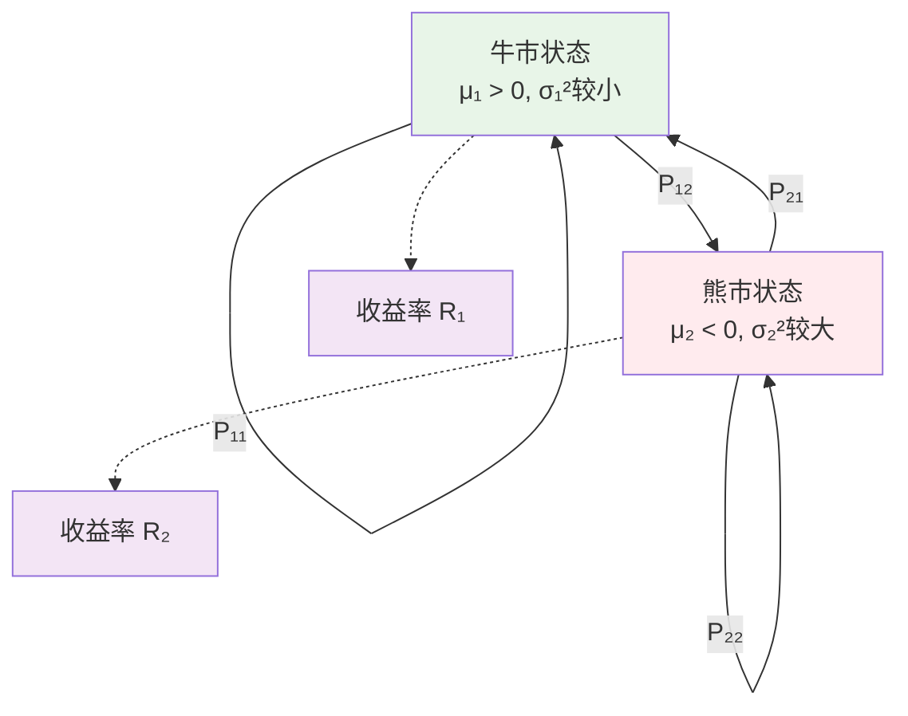

# 第6章：金融市场中的马尔科夫模型基础

::: tip 学习目标
- 理解金融时间序列的马尔科夫性质
- 掌握状态制模型在金融中的应用
- 学习马尔科夫制转换模型
- 理解金融风险的状态依赖性
:::

## 知识点总结

### 1. 金融时间序列的马尔科夫性质

金融市场具有以下特征，使得马尔科夫模型成为合适的建模工具：

- **有限记忆性**：市场效率假说暗示价格变化主要依赖于当前信息
- **状态依赖性**：市场波动、流动性等在不同市场状态下表现不同
- **制度转换**：市场在牛市、熊市等不同制度间转换

::: note 弱有效市场假说与马尔科夫性
在弱有效市场中，价格充分反映历史信息，使得：
$$P(R_{t+1} | R_t, R_{t-1}, \ldots) = P(R_{t+1} | R_t)$$
其中 $R_t$ 是时刻 $t$ 的收益率。
:::

### 2. 马尔科夫制转换模型（MS模型）

**基本形式**：
$$y_t = \mu_{s_t} + \epsilon_t, \quad \epsilon_t \sim N(0, \sigma_{s_t}^2)$$

其中：
- $s_t \in \{1, 2, \ldots, k\}$ 是不可观测的状态变量
- $\{s_t\}$ 遵循马尔科夫链，转移概率为 $P_{ij} = P(s_{t+1} = j | s_t = i)$



### 3. 金融风险的状态依赖性

不同市场状态下的风险特征：

| 市场状态 | 平均收益 | 波动率 | 尾部风险 | 流动性 |
|----------|----------|--------|----------|--------|
| 牛市     | 高       | 低     | 低       | 充足   |
| 熊市     | 负       | 高     | 高       | 紧张   |
| 震荡市   | 接近零   | 中等   | 中等     | 一般   |

### 4. 状态识别与分类

常用的状态定义方法：
- **收益率水平**：基于平均收益率划分状态
- **波动率聚类**：根据波动率高低分类
- **宏观经济指标**：结合经济周期指标
- **技术指标**：使用移动平均线等技术分析工具

## 示例代码

### 示例1：简单的双状态市场模型

```python
import numpy as np
import pandas as pd
import matplotlib.pyplot as plt
from scipy import stats
from scipy.optimize import minimize
import seaborn as sns

class MarkovSwitchingModel:
    """
    马尔科夫制转换模型
    """

    def __init__(self, n_states=2):
        self.n_states = n_states
        self.transition_matrix = None
        self.mu = None  # 各状态的均值
        self.sigma = None  # 各状态的标准差
        self.initial_probs = None

    def simulate_data(self, n_periods=1000, seed=42):
        """
        模拟马尔科夫制转换模型数据

        Parameters:
        n_periods: 模拟期数
        seed: 随机种子

        Returns:
        returns: 收益率序列
        states: 状态序列
        """
        np.random.seed(seed)

        # 设置模型参数（双状态示例）
        self.transition_matrix = np.array([
            [0.85, 0.15],  # 牛市持续概率0.85
            [0.20, 0.80]   # 熊市持续概率0.80
        ])

        self.mu = np.array([0.05, -0.03])      # 牛市5%, 熊市-3%
        self.sigma = np.array([0.15, 0.25])   # 牛市15%, 熊市25%
        self.initial_probs = np.array([0.6, 0.4])

        # 模拟状态序列
        states = np.zeros(n_periods, dtype=int)
        returns = np.zeros(n_periods)

        # 初始状态
        states[0] = np.random.choice(self.n_states, p=self.initial_probs)

        # 生成状态和收益率序列
        for t in range(n_periods):
            if t > 0:
                # 根据转移概率确定下一状态
                states[t] = np.random.choice(
                    self.n_states,
                    p=self.transition_matrix[states[t-1]]
                )

            # 根据当前状态生成收益率
            current_state = states[t]
            returns[t] = np.random.normal(
                self.mu[current_state],
                self.sigma[current_state]
            )

        return returns, states

    def calculate_state_statistics(self, returns, states):
        """
        计算各状态下的统计特征
        """
        stats_dict = {}

        for state in range(self.n_states):
            state_returns = returns[states == state]

            if len(state_returns) > 0:
                stats_dict[f'State_{state}'] = {
                    'count': len(state_returns),
                    'mean': np.mean(state_returns),
                    'std': np.std(state_returns),
                    'skewness': stats.skew(state_returns),
                    'kurtosis': stats.kurtosis(state_returns),
                    'min': np.min(state_returns),
                    'max': np.max(state_returns)
                }

        return stats_dict

# 创建模型并模拟数据
ms_model = MarkovSwitchingModel(n_states=2)
returns, true_states = ms_model.simulate_data(n_periods=500)

# 计算统计特征
state_stats = ms_model.calculate_state_statistics(returns, true_states)

print("马尔科夫制转换模型参数:")
print(f"转移矩阵:\n{ms_model.transition_matrix}")
print(f"状态均值: {ms_model.mu}")
print(f"状态标准差: {ms_model.sigma}")

print(f"\n各状态统计特征:")
for state, stats_data in state_stats.items():
    print(f"\n{state}:")
    for key, value in stats_data.items():
        print(f"  {key}: {value:.4f}")

# 可视化模拟数据
fig, axes = plt.subplots(3, 2, figsize=(15, 12))

# 子图1：收益率时序图
axes[0, 0].plot(returns, linewidth=1, alpha=0.8)
axes[0, 0].set_title('模拟收益率序列')
axes[0, 0].set_ylabel('收益率')
axes[0, 0].grid(True, alpha=0.3)

# 子图2：状态时序图
state_colors = ['green', 'red']
for state in range(2):
    mask = (true_states == state)
    axes[0, 1].scatter(np.where(mask)[0], returns[mask],
                      c=state_colors[state], s=10, alpha=0.6,
                      label=f'状态{state}')
axes[0, 1].set_title('状态依赖的收益率')
axes[0, 1].set_ylabel('收益率')
axes[0, 1].legend()
axes[0, 1].grid(True, alpha=0.3)

# 子图3：状态序列
axes[1, 0].plot(true_states, linewidth=2)
axes[1, 0].set_title('真实状态序列')
axes[1, 0].set_ylabel('状态')
axes[1, 0].set_ylim(-0.5, 1.5)
axes[1, 0].grid(True, alpha=0.3)

# 子图4：收益率分布（按状态分组）
for state in range(2):
    state_returns = returns[true_states == state]
    axes[1, 1].hist(state_returns, bins=30, alpha=0.6,
                   label=f'状态{state}', density=True,
                   color=state_colors[state])
axes[1, 1].set_title('各状态收益率分布')
axes[1, 1].set_xlabel('收益率')
axes[1, 1].set_ylabel('密度')
axes[1, 1].legend()
axes[1, 1].grid(True, alpha=0.3)

# 子图5：累积收益
cumulative_returns = np.cumprod(1 + returns) - 1
axes[2, 0].plot(cumulative_returns, linewidth=2)
axes[2, 0].set_title('累积收益率')
axes[2, 0].set_xlabel('时间')
axes[2, 0].set_ylabel('累积收益率')
axes[2, 0].grid(True, alpha=0.3)

# 子图6：状态持续时间分析
def analyze_regime_duration(states):
    """分析制度持续时间"""
    durations = {0: [], 1: []}
    current_state = states[0]
    current_duration = 1

    for t in range(1, len(states)):
        if states[t] == current_state:
            current_duration += 1
        else:
            durations[current_state].append(current_duration)
            current_state = states[t]
            current_duration = 1

    # 添加最后一个制度的持续时间
    durations[current_state].append(current_duration)
    return durations

durations = analyze_regime_duration(true_states)
for state in range(2):
    if durations[state]:
        axes[2, 1].hist(durations[state], bins=20, alpha=0.6,
                       label=f'状态{state}持续时间', color=state_colors[state])

axes[2, 1].set_title('制度持续时间分布')
axes[2, 1].set_xlabel('持续期数')
axes[2, 1].set_ylabel('频次')
axes[2, 1].legend()
axes[2, 1].grid(True, alpha=0.3)

plt.tight_layout()
plt.show()

print(f"\n平均制度持续时间:")
for state in range(2):
    if durations[state]:
        avg_duration = np.mean(durations[state])
        print(f"状态{state}: {avg_duration:.2f}期")
```

### 示例2：参数估计与滤波

```python
def log_likelihood_ms(params, returns):
    """
    马尔科夫制转换模型的对数似然函数

    Parameters:
    params: 参数向量 [μ₀, μ₁, σ₀, σ₁, p₀₀, p₁₁]
    returns: 收益率序列

    Returns:
    negative log-likelihood
    """
    mu0, mu1, sigma0, sigma1, p00, p11 = params

    # 确保参数有效性
    if sigma0 <= 0 or sigma1 <= 0 or p00 <= 0 or p00 >= 1 or p11 <= 0 or p11 >= 1:
        return 1e10

    n_obs = len(returns)
    n_states = 2

    # 转移概率矩阵
    P = np.array([[p00, 1-p00], [1-p11, p11]])

    # 发射概率（正态分布密度）
    def emission_prob(obs, state):
        if state == 0:
            return stats.norm.pdf(obs, mu0, sigma0)
        else:
            return stats.norm.pdf(obs, mu1, sigma1)

    # 初始概率（平稳分布）
    eigenvals, eigenvecs = np.linalg.eig(P.T)
    stationary_idx = np.argmin(np.abs(eigenvals - 1))
    pi = np.real(eigenvecs[:, stationary_idx])
    pi = pi / np.sum(pi)

    # 前向算法计算似然
    alpha = np.zeros((n_obs, n_states))

    # 初始化
    for state in range(n_states):
        alpha[0, state] = pi[state] * emission_prob(returns[0], state)

    # 递推
    for t in range(1, n_obs):
        for j in range(n_states):
            alpha[t, j] = emission_prob(returns[t], j) * \
                         np.sum(alpha[t-1] * P[:, j])

    # 对数似然
    log_likelihood = np.sum(np.log(np.sum(alpha, axis=1)))

    return -log_likelihood  # 返回负对数似然用于最小化

def estimate_ms_model(returns, initial_guess=None):
    """
    估计马尔科夫制转换模型参数

    Parameters:
    returns: 收益率序列
    initial_guess: 初始参数猜测

    Returns:
    估计结果
    """
    if initial_guess is None:
        # 设置初始参数猜测
        mu_guess = [np.mean(returns[returns > 0]),
                   np.mean(returns[returns < 0])]
        sigma_guess = [np.std(returns[returns > 0]),
                      np.std(returns[returns < 0])]
        initial_guess = [mu_guess[0], mu_guess[1],
                        sigma_guess[0], sigma_guess[1],
                        0.8, 0.8]

    # 参数边界
    bounds = [
        (-1, 1),    # μ₀
        (-1, 1),    # μ₁
        (0.01, 2),  # σ₀
        (0.01, 2),  # σ₁
        (0.01, 0.99),  # p₀₀
        (0.01, 0.99)   # p₁₁
    ]

    # 优化
    result = minimize(
        log_likelihood_ms,
        initial_guess,
        args=(returns,),
        bounds=bounds,
        method='L-BFGS-B'
    )

    return result

def viterbi_decode_ms(params, returns):
    """
    使用Viterbi算法解码最可能的状态序列

    Parameters:
    params: 模型参数
    returns: 收益率序列

    Returns:
    decoded_states: 解码的状态序列
    """
    mu0, mu1, sigma0, sigma1, p00, p11 = params
    n_obs = len(returns)
    n_states = 2

    # 转移概率矩阵
    P = np.array([[p00, 1-p00], [1-p11, p11]])

    # 发射概率
    def log_emission_prob(obs, state):
        if state == 0:
            return stats.norm.logpdf(obs, mu0, sigma0)
        else:
            return stats.norm.logpdf(obs, mu1, sigma1)

    # 初始概率
    eigenvals, eigenvecs = np.linalg.eig(P.T)
    stationary_idx = np.argmin(np.abs(eigenvals - 1))
    pi = np.real(eigenvecs[:, stationary_idx])
    pi = pi / np.sum(pi)

    # Viterbi算法
    delta = np.zeros((n_obs, n_states))
    psi = np.zeros((n_obs, n_states), dtype=int)

    # 初始化
    for state in range(n_states):
        delta[0, state] = np.log(pi[state]) + log_emission_prob(returns[0], state)

    # 递推
    for t in range(1, n_obs):
        for j in range(n_states):
            transition_scores = delta[t-1] + np.log(P[:, j])
            psi[t, j] = np.argmax(transition_scores)
            delta[t, j] = np.max(transition_scores) + log_emission_prob(returns[t], j)

    # 回溯
    states = np.zeros(n_obs, dtype=int)
    states[n_obs-1] = np.argmax(delta[n_obs-1])

    for t in range(n_obs-2, -1, -1):
        states[t] = psi[t+1, states[t+1]]

    return states

# 估计模型参数
print("正在估计模型参数...")
estimation_result = estimate_ms_model(returns)

if estimation_result.success:
    estimated_params = estimation_result.x
    mu0_est, mu1_est, sigma0_est, sigma1_est, p00_est, p11_est = estimated_params

    print(f"\n参数估计结果:")
    print(f"状态0均值: {mu0_est:.4f} (真实值: {ms_model.mu[0]:.4f})")
    print(f"状态1均值: {mu1_est:.4f} (真实值: {ms_model.mu[1]:.4f})")
    print(f"状态0标准差: {sigma0_est:.4f} (真实值: {ms_model.sigma[0]:.4f})")
    print(f"状态1标准差: {sigma1_est:.4f} (真实值: {ms_model.sigma[1]:.4f})")
    print(f"转移概率p₀₀: {p00_est:.4f} (真实值: {ms_model.transition_matrix[0,0]:.4f})")
    print(f"转移概率p₁₁: {p11_est:.4f} (真实值: {ms_model.transition_matrix[1,1]:.4f})")

    # 状态解码
    decoded_states = viterbi_decode_ms(estimated_params, returns)

    # 计算解码准确率
    accuracy = np.mean(decoded_states == true_states)
    print(f"\n状态解码准确率: {accuracy:.2%}")

    # 可视化估计结果
    plt.figure(figsize=(15, 10))

    # 子图1：收益率与状态
    plt.subplot(3, 2, 1)
    colors = ['green' if s == 0 else 'red' for s in decoded_states]
    plt.scatter(range(len(returns)), returns, c=colors, s=10, alpha=0.6)
    plt.title('估计状态与收益率')
    plt.ylabel('收益率')
    plt.grid(True, alpha=0.3)

    # 子图2：状态比较
    plt.subplot(3, 2, 2)
    plt.plot(true_states, 'b-', linewidth=2, alpha=0.7, label='真实状态')
    plt.plot(decoded_states, 'r--', linewidth=2, alpha=0.7, label='估计状态')
    plt.title('状态序列比较')
    plt.ylabel('状态')
    plt.legend()
    plt.grid(True, alpha=0.3)

    # 子图3：参数比较条形图
    plt.subplot(3, 2, 3)
    params_true = [ms_model.mu[0], ms_model.mu[1],
                   ms_model.sigma[0], ms_model.sigma[1]]
    params_est = [mu0_est, mu1_est, sigma0_est, sigma1_est]
    param_names = ['μ₀', 'μ₁', 'σ₀', 'σ₁']

    x = np.arange(len(param_names))
    width = 0.35

    plt.bar(x - width/2, params_true, width, label='真实值', alpha=0.7)
    plt.bar(x + width/2, params_est, width, label='估计值', alpha=0.7)
    plt.xlabel('参数')
    plt.ylabel('值')
    plt.title('参数估计比较')
    plt.xticks(x, param_names)
    plt.legend()
    plt.grid(True, alpha=0.3, axis='y')

    # 子图4：转移概率比较
    plt.subplot(3, 2, 4)
    trans_true = [ms_model.transition_matrix[0,0], ms_model.transition_matrix[1,1]]
    trans_est = [p00_est, p11_est]
    trans_names = ['p₀₀', 'p₁₁']

    x = np.arange(len(trans_names))
    plt.bar(x - width/2, trans_true, width, label='真实值', alpha=0.7)
    plt.bar(x + width/2, trans_est, width, label='估计值', alpha=0.7)
    plt.xlabel('转移概率')
    plt.ylabel('概率')
    plt.title('转移概率估计比较')
    plt.xticks(x, trans_names)
    plt.legend()
    plt.grid(True, alpha=0.3, axis='y')

    # 子图5：混淆矩阵
    from sklearn.metrics import confusion_matrix
    cm = confusion_matrix(true_states, decoded_states)
    plt.subplot(3, 2, 5)
    sns.heatmap(cm, annot=True, fmt='d', cmap='Blues',
                xticklabels=['状态0', '状态1'],
                yticklabels=['状态0', '状态1'])
    plt.title('状态分类混淆矩阵')
    plt.ylabel('真实状态')
    plt.xlabel('预测状态')

    # 子图6：模型拟合度
    plt.subplot(3, 2, 6)
    fitted_returns_0 = np.random.normal(mu0_est, sigma0_est, np.sum(decoded_states == 0))
    fitted_returns_1 = np.random.normal(mu1_est, sigma1_est, np.sum(decoded_states == 1))

    plt.hist(returns[true_states == 0], bins=30, alpha=0.5, label='真实状态0', density=True)
    plt.hist(returns[true_states == 1], bins=30, alpha=0.5, label='真实状态1', density=True)
    plt.hist(fitted_returns_0, bins=30, alpha=0.5, label='拟合状态0', density=True)
    plt.hist(fitted_returns_1, bins=30, alpha=0.5, label='拟合状态1', density=True)
    plt.xlabel('收益率')
    plt.ylabel('密度')
    plt.title('模型拟合效果')
    plt.legend()
    plt.grid(True, alpha=0.3)

    plt.tight_layout()
    plt.show()

else:
    print("参数估计失败!")
```

### 示例3：实际数据应用示例

```python
def generate_stock_like_data(n_periods=1000):
    """
    生成类似股票数据的时间序列
    """
    np.random.seed(42)

    # 三状态模型：牛市、熊市、震荡市
    transition_matrix = np.array([
        [0.8, 0.15, 0.05],  # 牛市
        [0.1, 0.75, 0.15],  # 熊市
        [0.3, 0.2, 0.5]     # 震荡市
    ])

    mu = np.array([0.08, -0.05, 0.01])        # 年化收益率
    sigma = np.array([0.20, 0.35, 0.15])     # 年化波动率
    initial_probs = np.array([0.4, 0.3, 0.3])

    # 转换为日频参数（假设252个交易日）
    mu_daily = mu / 252
    sigma_daily = sigma / np.sqrt(252)

    # 模拟数据
    states = np.zeros(n_periods, dtype=int)
    returns = np.zeros(n_periods)

    states[0] = np.random.choice(3, p=initial_probs)

    for t in range(n_periods):
        if t > 0:
            states[t] = np.random.choice(3, p=transition_matrix[states[t-1]])

        returns[t] = np.random.normal(mu_daily[states[t]], sigma_daily[states[t]])

    # 计算价格序列
    prices = 100 * np.cumprod(1 + returns)

    return returns, prices, states, {
        'transition_matrix': transition_matrix,
        'mu': mu,
        'sigma': sigma,
        'state_names': ['牛市', '熊市', '震荡市']
    }

# 生成股票样本数据
returns_stock, prices_stock, states_stock, model_info = generate_stock_like_data(1000)

# 分析市场制度特征
def analyze_market_regimes(returns, states, model_info):
    """
    分析市场制度特征
    """
    results = {}

    for state in range(3):
        state_mask = (states == state)
        state_returns = returns[state_mask]

        if len(state_returns) > 0:
            # 基础统计
            annual_return = np.mean(state_returns) * 252
            annual_vol = np.std(state_returns) * np.sqrt(252)
            sharpe_ratio = annual_return / annual_vol if annual_vol > 0 else 0

            # 风险指标
            var_95 = np.percentile(state_returns, 5)  # 5% VaR
            max_drawdown = np.min(np.cumsum(state_returns - np.mean(state_returns)))

            # 持续时间
            duration_list = []
            current_duration = 0
            for s in states:
                if s == state:
                    current_duration += 1
                else:
                    if current_duration > 0:
                        duration_list.append(current_duration)
                    current_duration = 0

            avg_duration = np.mean(duration_list) if duration_list else 0

            results[state] = {
                'name': model_info['state_names'][state],
                'frequency': np.mean(state_mask),
                'annual_return': annual_return,
                'annual_volatility': annual_vol,
                'sharpe_ratio': sharpe_ratio,
                'var_95': var_95,
                'max_drawdown': max_drawdown,
                'avg_duration': avg_duration,
                'skewness': stats.skew(state_returns),
                'kurtosis': stats.kurtosis(state_returns)
            }

    return results

# 分析结果
regime_analysis = analyze_market_regimes(returns_stock, states_stock, model_info)

print("市场制度分析结果:")
print("=" * 60)
for state, analysis in regime_analysis.items():
    print(f"\n{analysis['name']} (状态 {state}):")
    print(f"  出现频率: {analysis['frequency']:.1%}")
    print(f"  年化收益率: {analysis['annual_return']:.1%}")
    print(f"  年化波动率: {analysis['annual_volatility']:.1%}")
    print(f"  夏普比率: {analysis['sharpe_ratio']:.2f}")
    print(f"  95% VaR: {analysis['var_95']:.2%}")
    print(f"  最大回撤: {analysis['max_drawdown']:.2%}")
    print(f"  平均持续期: {analysis['avg_duration']:.1f}天")
    print(f"  偏度: {analysis['skewness']:.2f}")
    print(f"  峰度: {analysis['kurtosis']:.2f}")

# 可视化股票数据分析
plt.figure(figsize=(16, 12))

# 子图1：价格走势图
plt.subplot(3, 3, 1)
plt.plot(prices_stock, linewidth=1.5)
plt.title('股票价格走势')
plt.ylabel('价格')
plt.grid(True, alpha=0.3)

# 子图2：收益率时序图
plt.subplot(3, 3, 2)
colors = ['green', 'red', 'blue']
state_names = ['牛市', '熊市', '震荡市']
for state in range(3):
    mask = (states_stock == state)
    plt.scatter(np.where(mask)[0], returns_stock[mask],
               c=colors[state], s=1, alpha=0.6, label=state_names[state])
plt.title('制度依赖的收益率')
plt.ylabel('日收益率')
plt.legend()
plt.grid(True, alpha=0.3)

# 子图3：制度序列
plt.subplot(3, 3, 3)
plt.plot(states_stock, linewidth=1)
plt.title('市场制度序列')
plt.ylabel('制度')
plt.yticks([0, 1, 2], state_names)
plt.grid(True, alpha=0.3)

# 子图4-6：各制度收益率分布
for i, state in enumerate(range(3)):
    plt.subplot(3, 3, 4 + i)
    state_returns = returns_stock[states_stock == state]
    plt.hist(state_returns, bins=50, alpha=0.7, density=True,
             color=colors[state])
    plt.title(f'{state_names[state]}收益率分布')
    plt.xlabel('收益率')
    plt.ylabel('密度')
    plt.grid(True, alpha=0.3)

# 子图7：累积收益率（按制度着色）
plt.subplot(3, 3, 7)
cumulative_returns = np.cumprod(1 + returns_stock) - 1
for state in range(3):
    mask = (states_stock == state)
    plt.scatter(np.where(mask)[0], cumulative_returns[mask],
               c=colors[state], s=1, alpha=0.6, label=state_names[state])
plt.title('累积收益率（按制度着色）')
plt.xlabel('时间')
plt.ylabel('累积收益率')
plt.legend()
plt.grid(True, alpha=0.3)

# 子图8：制度转移频率
plt.subplot(3, 3, 8)
transition_counts = np.zeros((3, 3))
for t in range(1, len(states_stock)):
    transition_counts[states_stock[t-1], states_stock[t]] += 1

# 转移概率矩阵
transition_probs = transition_counts / transition_counts.sum(axis=1, keepdims=True)
sns.heatmap(transition_probs, annot=True, fmt='.2f', cmap='Blues',
            xticklabels=state_names, yticklabels=state_names)
plt.title('经验转移概率矩阵')

# 子图9：风险-收益散点图
plt.subplot(3, 3, 9)
for state in range(3):
    analysis = regime_analysis[state]
    plt.scatter(analysis['annual_volatility'], analysis['annual_return'],
               s=analysis['frequency']*1000, alpha=0.7,
               color=colors[state], label=state_names[state])

plt.xlabel('年化波动率')
plt.ylabel('年化收益率')
plt.title('风险-收益特征（气泡大小=频率）')
plt.legend()
plt.grid(True, alpha=0.3)

plt.tight_layout()
plt.show()
```

## 理论分析

### 金融马尔科夫模型的理论基础

**有效市场假说与马尔科夫性**：
在半强有效市场中，价格变化服从：
$$P(R_{t+1} | \mathcal{F}_t) = P(R_{t+1} | R_t, S_t)$$

其中 $\mathcal{F}_t$ 是时刻 $t$ 的信息集，$S_t$ 是市场状态。

**制度转换模型的似然函数**：
$$L(\theta) = \prod_{t=1}^T \sum_{s_t=1}^k f(r_t | s_t, \theta) P(s_t | s_{t-1}, \theta)$$

### 状态识别的统计推断

**滤波概率**：
$$P(S_t = j | r_1, \ldots, r_t) = \frac{\alpha_t(j)}{\sum_{i=1}^k \alpha_t(i)}$$

**平滑概率**：
$$P(S_t = j | r_1, \ldots, r_T) = \frac{\alpha_t(j) \beta_t(j)}{\sum_{i=1}^k \alpha_t(i) \beta_t(i)}$$

### 金融风险度量

**状态依赖的VaR**：
$$\text{VaR}_\alpha^{(j)} = \mu_j + \sigma_j \Phi^{-1}(\alpha)$$

**期望损失**：
$$\text{ES}_\alpha^{(j)} = \mu_j + \sigma_j \frac{\phi(\Phi^{-1}(\alpha))}{\alpha}$$

## 数学公式总结

1. **制度转换模型**：$y_t = \mu_{s_t} + \sigma_{s_t} \epsilon_t$

2. **转移概率**：$P_{ij} = P(S_{t+1} = j | S_t = i)$

3. **对数似然函数**：$\ell(\theta) = \sum_{t=1}^T \log \sum_{j=1}^k P(S_t = j | r_{1:t}) f(r_t | S_t = j)$

4. **期望持续时间**：$E[D_i] = \frac{1}{1 - P_{ii}}$

5. **平稳概率**：$\pi_j = \frac{1}{\sum_{i=1}^k \mu_{ji}}$，其中 $\mu_{ji}$ 是从状态 $j$ 到状态 $i$ 的平均首达时间

::: warning 模型应用注意事项
- 状态数量的选择需要平衡模型复杂度和拟合效果
- 参数估计可能存在多个局部最优解
- 样本外预测能力需要谨慎评估
- 制度识别具有一定的滞后性
:::