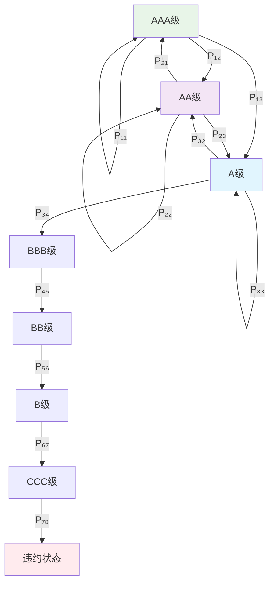

# 第9章：信用风险建模实践

::: tip 学习目标
- 建立信用评级迁移矩阵
- 实现违约概率的马尔科夫模型
- 计算信用风险VaR
- 进行信用组合风险分析
:::

## 知识点总结

### 1. 信用风险基础概念

信用风险是指借款人或交易对手未能履行合约义务而造成损失的风险。在马尔科夫框架下，我们可以将信用评级视为状态，分析其转移规律。

**信用评级状态空间**：
$$S = \{\text{AAA}, \text{AA}, \text{A}, \text{BBB}, \text{BB}, \text{B}, \text{CCC}, \text{D}\}$$

其中D表示违约状态（吸收状态）。

### 2. 信用评级迁移矩阵

**定义**：迁移矩阵 $P$ 描述了从当前评级到下一期评级的转移概率：
$$P_{ij} = P(\text{Rating}_{t+1} = j | \text{Rating}_t = i)$$

**性质**：
- 行和为1：$\sum_{j=1}^{n} P_{ij} = 1$
- 违约状态为吸收状态：$P_{DD} = 1$，$P_{Dj} = 0$ (j ≠ D)



### 3. 累积违约概率

**t期累积违约概率**：
$$PD(t) = P(\text{首次违约时间} \leq t | \text{Rating}_0 = i)$$

通过矩阵幂次计算：
$$PD_i(t) = (P^t)_{i,D}$$

其中 $P^t$ 是迁移矩阵的t次幂。

### 4. 信用组合风险模型

**Vasicek单因子模型**：
资产价值模型为：
$$V_i = \sqrt{\rho} X + \sqrt{1-\rho} \epsilon_i$$

其中：
- $X$ ~ $N(0,1)$ 是系统性风险因子
- $\epsilon_i$ ~ $N(0,1)$ 是特殊风险因子
- $\rho$ 是资产相关系数

**条件违约概率**：
$$P(V_i < c_i | X) = \Phi\left(\frac{\Phi^{-1}(PD_i) - \sqrt{\rho} X}{\sqrt{1-\rho}}\right)$$

## 示例代码

### 示例1：构建信用评级迁移矩阵

```python
import numpy as np
import pandas as pd
import matplotlib.pyplot as plt
from scipy import stats
from scipy.linalg import matrix_power
import seaborn as sns

class CreditTransitionMatrix:
    """
    信用评级迁移矩阵模型
    """

    def __init__(self):
        # 标准普尔评级体系
        self.rating_labels = ['AAA', 'AA', 'A', 'BBB', 'BB', 'B', 'CCC', 'D']
        self.n_ratings = len(self.rating_labels)
        self.transition_matrix = None
        self.rating_to_index = {rating: i for i, rating in enumerate(self.rating_labels)}

    def estimate_transition_matrix(self, rating_data):
        """
        从历史数据估计迁移矩阵

        Parameters:
        rating_data: DataFrame with columns ['entity_id', 'date', 'rating']

        Returns:
        transition_matrix: 迁移概率矩阵
        """
        # 初始化计数矩阵
        transition_counts = np.zeros((self.n_ratings, self.n_ratings))

        # 按实体分组计算迁移
        for entity_id in rating_data['entity_id'].unique():
            entity_data = rating_data[rating_data['entity_id'] == entity_id].sort_values('date')

            if len(entity_data) < 2:
                continue

            ratings = entity_data['rating'].values

            # 统计评级转移
            for t in range(len(ratings) - 1):
                from_rating = ratings[t]
                to_rating = ratings[t + 1]

                # 转换为索引
                from_idx = self.rating_to_index[from_rating]
                to_idx = self.rating_to_index[to_rating]

                transition_counts[from_idx, to_idx] += 1

        # 转换为概率矩阵（行归一化）
        row_sums = transition_counts.sum(axis=1, keepdims=True)
        self.transition_matrix = np.divide(
            transition_counts,
            row_sums,
            out=np.zeros_like(transition_counts),
            where=row_sums != 0
        )

        return self.transition_matrix

    def calculate_cumulative_default_probabilities(self, horizon=10):
        """
        计算累积违约概率

        Parameters:
        horizon: 预测期限

        Returns:
        cumulative_pds: 各期限累积违约概率
        """
        if self.transition_matrix is None:
            raise ValueError("需要先估计迁移矩阵")

        cumulative_pds = {}
        default_state_idx = self.n_ratings - 1  # 违约状态是最后一个

        for t in range(1, horizon + 1):
            # 计算t期迁移矩阵
            transition_t = matrix_power(self.transition_matrix, t)

            # 提取到违约状态的概率
            pd_t = transition_t[:, default_state_idx]

            # 存储结果（排除违约状态本身）
            cumulative_pds[t] = dict(zip(self.rating_labels[:-1], pd_t[:-1]))

        return cumulative_pds

    def calculate_marginal_default_probabilities(self, horizon=10):
        """
        计算边际违约概率
        """
        cumulative_pds = self.calculate_cumulative_default_probabilities(horizon)
        marginal_pds = {}

        for rating in self.rating_labels[:-1]:  # 排除违约状态
            marginal_pds[rating] = {}

            # 第一期边际违约概率等于累积违约概率
            marginal_pds[rating][1] = cumulative_pds[1][rating]

            # 后续期间的边际违约概率
            for t in range(2, horizon + 1):
                marginal_pds[rating][t] = (
                    cumulative_pds[t][rating] - cumulative_pds[t-1][rating]
                )

        return marginal_pds

def generate_synthetic_rating_data(n_entities=1000, n_periods=10, seed=42):
    """
    生成合成信用评级数据

    Parameters:
    n_entities: 实体数量
    n_periods: 时间期数
    seed: 随机种子

    Returns:
    DataFrame: 包含实体ID、日期和评级的数据
    """
    np.random.seed(seed)

    # 真实迁移矩阵（基于历史数据的近似值）
    true_transition_matrix = np.array([
        [0.9207, 0.0707, 0.0068, 0.0017, 0.0001, 0.0000, 0.0000, 0.0000],  # AAA
        [0.0264, 0.9056, 0.0597, 0.0074, 0.0006, 0.0001, 0.0001, 0.0001],  # AA
        [0.0027, 0.0274, 0.9105, 0.0552, 0.0031, 0.0009, 0.0001, 0.0001],  # A
        [0.0003, 0.0043, 0.0595, 0.8693, 0.0618, 0.0044, 0.0002, 0.0002],  # BBB
        [0.0001, 0.0016, 0.0061, 0.0773, 0.8053, 0.1067, 0.0022, 0.0007],  # BB
        [0.0000, 0.0010, 0.0023, 0.0043, 0.0648, 0.8346, 0.0884, 0.0046],  # B
        [0.0000, 0.0000, 0.0011, 0.0024, 0.0043, 0.1722, 0.6486, 0.1714],  # CCC
        [0.0000, 0.0000, 0.0000, 0.0000, 0.0000, 0.0000, 0.0000, 1.0000]   # D
    ])

    rating_labels = ['AAA', 'AA', 'A', 'BBB', 'BB', 'B', 'CCC', 'D']

    data = []

    for entity_id in range(n_entities):
        # 随机选择初始评级（偏向较高评级）
        initial_rating_probs = [0.05, 0.15, 0.25, 0.30, 0.15, 0.08, 0.02, 0.00]
        current_rating_idx = np.random.choice(len(rating_labels), p=initial_rating_probs)

        for period in range(n_periods):
            # 记录当前评级
            data.append({
                'entity_id': entity_id,
                'date': period,
                'rating': rating_labels[current_rating_idx]
            })

            # 如果已经违约，保持违约状态
            if current_rating_idx == len(rating_labels) - 1:  # 违约状态
                continue

            # 根据迁移概率确定下一期评级
            transition_probs = true_transition_matrix[current_rating_idx]
            current_rating_idx = np.random.choice(len(rating_labels), p=transition_probs)

    return pd.DataFrame(data)

# 生成合成数据
print("生成合成信用评级数据...")
rating_data = generate_synthetic_rating_data(n_entities=2000, n_periods=8)

print(f"数据概况:")
print(f"实体数量: {rating_data['entity_id'].nunique()}")
print(f"时间期数: {rating_data['date'].nunique()}")
print(f"评级分布:")
print(rating_data['rating'].value_counts().sort_index())

# 创建迁移矩阵模型
credit_model = CreditTransitionMatrix()

# 估计迁移矩阵
transition_matrix = credit_model.estimate_transition_matrix(rating_data)

print(f"\n估计的信用评级迁移矩阵:")
transition_df = pd.DataFrame(
    transition_matrix,
    index=credit_model.rating_labels,
    columns=credit_model.rating_labels
)
print(transition_df.round(4))

# 计算累积违约概率
cumulative_pds = credit_model.calculate_cumulative_default_probabilities(horizon=5)

print(f"\n累积违约概率 (%):")
pd_df = pd.DataFrame(cumulative_pds).T * 100
print(pd_df.round(3))
```

### 示例2：可视化分析

```python
# 可视化迁移矩阵和违约概率
fig, axes = plt.subplots(2, 2, figsize=(16, 12))

# 子图1：迁移矩阵热图
sns.heatmap(transition_matrix,
           annot=True,
           fmt='.3f',
           xticklabels=credit_model.rating_labels,
           yticklabels=credit_model.rating_labels,
           cmap='Blues',
           ax=axes[0, 0])
axes[0, 0].set_title('信用评级迁移矩阵')
axes[0, 0].set_xlabel('目标评级')
axes[0, 0].set_ylabel('初始评级')

# 子图2：累积违约概率曲线
for rating in ['AAA', 'A', 'BBB', 'BB', 'B']:
    periods = list(range(1, 6))
    pds = [cumulative_pds[t][rating] * 100 for t in periods]
    axes[0, 1].plot(periods, pds, marker='o', label=rating, linewidth=2)

axes[0, 1].set_title('累积违约概率曲线')
axes[0, 1].set_xlabel('期间')
axes[0, 1].set_ylabel('累积违约概率 (%)')
axes[0, 1].legend()
axes[0, 1].grid(True, alpha=0.3)

# 子图3：评级分布
rating_counts = rating_data['rating'].value_counts().reindex(credit_model.rating_labels[:-1])
axes[1, 0].bar(range(len(rating_counts)), rating_counts.values,
               color='skyblue', alpha=0.7)
axes[1, 0].set_title('数据中评级分布')
axes[1, 0].set_xlabel('评级')
axes[1, 0].set_ylabel('数量')
axes[1, 0].set_xticks(range(len(rating_counts)))
axes[1, 0].set_xticklabels(rating_counts.index, rotation=45)

# 子图4：期限结构对比
ratings_to_plot = ['A', 'BBB', 'BB']
periods = list(range(1, 6))

for rating in ratings_to_plot:
    pds = [cumulative_pds[t][rating] * 100 for t in periods]
    axes[1, 1].semilogy(periods, pds, marker='s', label=rating, linewidth=2)

axes[1, 1].set_title('违约概率期限结构（对数尺度）')
axes[1, 1].set_xlabel('期间')
axes[1, 1].set_ylabel('累积违约概率 (%, 对数尺度)')
axes[1, 1].legend()
axes[1, 1].grid(True, alpha=0.3)

plt.tight_layout()
plt.show()

# 计算评级稳定性指标
def calculate_rating_stability(transition_matrix, rating_labels):
    """计算评级稳定性指标"""
    stability_metrics = {}

    for i, rating in enumerate(rating_labels[:-1]):  # 排除违约状态
        # 评级保持概率
        stability_metrics[rating] = {
            'persistence': transition_matrix[i, i],
            'upgrade_prob': np.sum(transition_matrix[i, :i]),
            'downgrade_prob': np.sum(transition_matrix[i, i+1:]),
            'default_prob': transition_matrix[i, -1]
        }

    return stability_metrics

stability_metrics = calculate_rating_stability(transition_matrix, credit_model.rating_labels)

print(f"\n评级稳定性分析:")
stability_df = pd.DataFrame(stability_metrics).T
print(stability_df.round(4))
```

### 示例3：信用组合风险建模

```python
class CreditPortfolioModel:
    """
    信用组合风险模型（基于Vasicek模型）
    """

    def __init__(self, correlation_matrix=None):
        self.correlation_matrix = correlation_matrix

    def calculate_portfolio_var(self, exposures, default_probs, lgds,
                              correlation=0.2, confidence=0.99, n_simulations=100000):
        """
        计算组合信用风险VaR

        Parameters:
        exposures: 敞口数组
        default_probs: 违约概率数组
        lgds: 违约损失率数组
        correlation: 资产相关系数
        confidence: 置信水平
        n_simulations: 蒙特卡洛模拟次数

        Returns:
        var: 风险价值
        es: 期望损失
        loss_distribution: 损失分布
        """
        n_assets = len(exposures)
        exposures = np.array(exposures)
        default_probs = np.array(default_probs)
        lgds = np.array(lgds)

        # 计算违约阈值
        default_thresholds = stats.norm.ppf(default_probs)

        # 蒙特卡洛模拟
        portfolio_losses = []

        for _ in range(n_simulations):
            # 生成系统性风险因子
            systematic_factor = np.random.normal(0, 1)

            # 生成特殊风险因子
            idiosyncratic_factors = np.random.normal(0, 1, n_assets)

            # 计算资产价值
            asset_values = (np.sqrt(correlation) * systematic_factor +
                          np.sqrt(1 - correlation) * idiosyncratic_factors)

            # 判断违约
            defaults = asset_values < default_thresholds

            # 计算组合损失
            portfolio_loss = np.sum(exposures * defaults * lgds)
            portfolio_losses.append(portfolio_loss)

        portfolio_losses = np.array(portfolio_losses)

        # 计算风险指标
        var = np.percentile(portfolio_losses, confidence * 100)
        tail_losses = portfolio_losses[portfolio_losses >= var]
        es = np.mean(tail_losses) if len(tail_losses) > 0 else var
        expected_loss = np.mean(portfolio_losses)

        return {
            'var': var,
            'expected_shortfall': es,
            'expected_loss': expected_loss,
            'loss_distribution': portfolio_losses,
            'max_loss': np.max(portfolio_losses)
        }

    def calculate_economic_capital(self, var, expected_loss):
        """计算经济资本"""
        return var - expected_loss

    def perform_stress_testing(self, base_scenario, stress_scenarios):
        """压力测试"""
        results = {}

        # 基准情景
        results['base'] = self.calculate_portfolio_var(**base_scenario)

        # 压力情景
        for scenario_name, scenario_params in stress_scenarios.items():
            results[scenario_name] = self.calculate_portfolio_var(**scenario_params)

        return results

# 构建信用组合示例
np.random.seed(42)

# 组合参数
n_assets = 100
exposures = np.random.lognormal(mean=15, sigma=1, size=n_assets)  # 敞口
default_probs = np.random.beta(0.5, 20, size=n_assets)  # 违约概率
lgds = np.random.beta(2, 2, size=n_assets) * 0.6 + 0.2  # 违约损失率 (20%-80%)

print(f"信用组合基本信息:")
print(f"资产数量: {n_assets}")
print(f"总敞口: {np.sum(exposures):,.0f}")
print(f"平均违约概率: {np.mean(default_probs):.2%}")
print(f"平均违约损失率: {np.mean(lgds):.2%}")

# 创建组合风险模型
portfolio_model = CreditPortfolioModel()

# 基准情景
base_scenario = {
    'exposures': exposures,
    'default_probs': default_probs,
    'lgds': lgds,
    'correlation': 0.2,
    'confidence': 0.99,
    'n_simulations': 50000
}

# 压力情景
stress_scenarios = {
    'high_correlation': {
        **base_scenario,
        'correlation': 0.5  # 高相关性
    },
    'recession': {
        **base_scenario,
        'default_probs': default_probs * 2.5,  # 违约概率增加150%
        'correlation': 0.3
    },
    'severe_recession': {
        **base_scenario,
        'default_probs': default_probs * 4,  # 违约概率增加300%
        'lgds': np.minimum(lgds * 1.3, 0.9),  # 违约损失率增加30%
        'correlation': 0.4
    }
}

# 执行风险计算
print(f"\n正在进行信用组合风险分析...")
risk_results = portfolio_model.perform_stress_testing(base_scenario, stress_scenarios)

# 显示结果
print(f"\n信用组合风险分析结果:")
print("=" * 60)

for scenario_name, result in risk_results.items():
    var = result['var']
    es = result['expected_shortfall']
    el = result['expected_loss']
    ec = portfolio_model.calculate_economic_capital(var, el)

    print(f"\n{scenario_name.upper()}情景:")
    print(f"  99% VaR: {var:,.0f}")
    print(f"  期望损失: {el:,.0f}")
    print(f"  期望损失缺口: {es:,.0f}")
    print(f"  经济资本: {ec:,.0f}")
    print(f"  最大损失: {result['max_loss']:,.0f}")
    print(f"  VaR/总敞口: {var/np.sum(exposures):.2%}")
```

### 示例4：损失分布可视化和分析

```python
# 可视化损失分布
fig, axes = plt.subplots(2, 2, figsize=(16, 12))

# 子图1：基准情景损失分布
base_losses = risk_results['base']['loss_distribution']
axes[0, 0].hist(base_losses, bins=100, density=True, alpha=0.7, color='blue')
axes[0, 0].axvline(risk_results['base']['var'], color='red', linestyle='--',
                   label=f"99% VaR: {risk_results['base']['var']:,.0f}")
axes[0, 0].axvline(risk_results['base']['expected_loss'], color='green', linestyle='-',
                   label=f"期望损失: {risk_results['base']['expected_loss']:,.0f}")
axes[0, 0].set_title('基准情景损失分布')
axes[0, 0].set_xlabel('损失')
axes[0, 0].set_ylabel('密度')
axes[0, 0].legend()
axes[0, 0].grid(True, alpha=0.3)

# 子图2：不同情景VaR对比
scenarios = list(risk_results.keys())
vars = [risk_results[s]['var'] for s in scenarios]
colors = ['blue', 'orange', 'red', 'darkred']

bars = axes[0, 1].bar(scenarios, vars, color=colors, alpha=0.7)
axes[0, 1].set_title('不同情景下的99% VaR')
axes[0, 1].set_ylabel('VaR')
axes[0, 1].tick_params(axis='x', rotation=45)

# 在柱状图上添加数值标签
for bar, var in zip(bars, vars):
    height = bar.get_height()
    axes[0, 1].text(bar.get_x() + bar.get_width()/2., height,
                    f'{var:,.0f}', ha='center', va='bottom')

axes[0, 1].grid(True, alpha=0.3, axis='y')

# 子图3：损失分布比较（对数尺度）
scenarios_to_plot = ['base', 'recession']
for scenario in scenarios_to_plot:
    losses = risk_results[scenario]['loss_distribution']
    axes[1, 0].hist(losses, bins=100, density=True, alpha=0.6,
                   label=f'{scenario}情景')

axes[1, 0].set_yscale('log')
axes[1, 0].set_title('损失分布对比（对数尺度）')
axes[1, 0].set_xlabel('损失')
axes[1, 0].set_ylabel('密度（对数尺度）')
axes[1, 0].legend()
axes[1, 0].grid(True, alpha=0.3)

# 子图4：风险分解
scenarios = list(risk_results.keys())
el_values = [risk_results[s]['expected_loss'] for s in scenarios]
ul_values = [risk_results[s]['var'] - risk_results[s]['expected_loss'] for s in scenarios]

width = 0.35
x = np.arange(len(scenarios))

axes[1, 1].bar(x, el_values, width, label='期望损失', color='lightblue', alpha=0.8)
axes[1, 1].bar(x, ul_values, width, bottom=el_values, label='意外损失',
               color='lightcoral', alpha=0.8)

axes[1, 1].set_title('风险分解：期望损失 vs 意外损失')
axes[1, 1].set_ylabel('损失')
axes[1, 1].set_xticks(x)
axes[1, 1].set_xticklabels(scenarios, rotation=45)
axes[1, 1].legend()
axes[1, 1].grid(True, alpha=0.3, axis='y')

plt.tight_layout()
plt.show()

# 计算组合分散化效益
def calculate_diversification_benefit(exposures, default_probs, lgds):
    """计算组合分散化效益"""
    # 单个资产的独立损失
    individual_vars = []

    for i in range(len(exposures)):
        individual_result = portfolio_model.calculate_portfolio_var(
            exposures=[exposures[i]],
            default_probs=[default_probs[i]],
            lgds=[lgds[i]],
            correlation=0,  # 单个资产无相关性
            confidence=0.99,
            n_simulations=10000
        )
        individual_vars.append(individual_result['var'])

    # 计算分散化效益
    sum_individual_vars = np.sum(individual_vars)
    portfolio_var = risk_results['base']['var']
    diversification_benefit = sum_individual_vars - portfolio_var
    diversification_ratio = diversification_benefit / sum_individual_vars

    return {
        'sum_individual_vars': sum_individual_vars,
        'portfolio_var': portfolio_var,
        'diversification_benefit': diversification_benefit,
        'diversification_ratio': diversification_ratio
    }

print(f"\n计算分散化效益...")
div_benefit = calculate_diversification_benefit(exposures[:10], default_probs[:10], lgds[:10])

print(f"\n分散化效益分析（样本前10个资产）:")
print(f"各资产独立VaR之和: {div_benefit['sum_individual_vars']:,.0f}")
print(f"组合VaR: {div_benefit['portfolio_var']:,.0f}")
print(f"分散化效益: {div_benefit['diversification_benefit']:,.0f}")
print(f"分散化比率: {div_benefit['diversification_ratio']:.2%}")

# 相关性敏感性分析
correlations = [0.1, 0.2, 0.3, 0.4, 0.5, 0.6]
correlation_vars = []

print(f"\n进行相关性敏感性分析...")
for corr in correlations:
    scenario = {**base_scenario, 'correlation': corr, 'n_simulations': 20000}
    result = portfolio_model.calculate_portfolio_var(**scenario)
    correlation_vars.append(result['var'])

# 可视化相关性敏感性
plt.figure(figsize=(10, 6))
plt.plot(correlations, correlation_vars, 'bo-', linewidth=2, markersize=8)
plt.title('信用组合VaR的相关性敏感性')
plt.xlabel('资产相关系数')
plt.ylabel('99% VaR')
plt.grid(True, alpha=0.3)

# 添加数值标签
for i, (corr, var) in enumerate(zip(correlations, correlation_vars)):
    plt.annotate(f'{var:,.0f}', (corr, var), textcoords="offset points",
                xytext=(0,10), ha='center')

plt.tight_layout()
plt.show()

print(f"\n相关性敏感性分析结果:")
for corr, var in zip(correlations, correlation_vars):
    print(f"相关系数 {corr:.1f}: VaR = {var:,.0f}")
```

## 理论分析

### 马尔科夫链在信用风险中的应用优势

1. **自然的状态表示**：信用评级天然形成离散状态空间
2. **转移概率的稳定性**：评级机构的评级方法相对稳定
3. **历史数据的充分性**：有较长时间序列的评级历史数据
4. **监管认可度高**：巴塞尔协议认可基于评级的方法

### Vasicek模型的数学基础

**潜在变量模型**：
$$A_i = \sqrt{\rho} Z + \sqrt{1-\rho} \epsilon_i$$

其中 $A_i$ 是第i个借款人的标准化资产价值。

**违约阈值**：
$$c_i = \Phi^{-1}(PD_i)$$

**条件违约概率公式推导**：
$$P(A_i < c_i | Z) = P(\sqrt{\rho} Z + \sqrt{1-\rho} \epsilon_i < c_i | Z)$$
$$= P(\epsilon_i < \frac{c_i - \sqrt{\rho} Z}{\sqrt{1-\rho}} | Z)$$
$$= \Phi\left(\frac{c_i - \sqrt{\rho} Z}{\sqrt{1-\rho}}\right)$$

### 经济资本的计算

**经济资本定义**：
$$EC = VaR_\alpha - EL$$

其中：
- $VaR_\alpha$ 是置信水平α下的风险价值
- $EL$ 是期望损失

**RAROC (风险调整资本回报率)**：
$$RAROC = \frac{\text{风险调整后收益}}{EC}$$

## 数学公式总结

1. **迁移概率估计**：$\hat{P}_{ij} = \frac{N_{ij}}{\sum_k N_{ik}}$

2. **累积违约概率**：$PD_i(t) = (P^t)_{i,D}$

3. **边际违约概率**：$MPD_i(t) = PD_i(t) - PD_i(t-1)$

4. **Vasicek条件违约概率**：$P(D_i|Z) = \Phi\left(\frac{\Phi^{-1}(PD_i) - \sqrt{\rho} Z}{\sqrt{1-\rho}}\right)$

5. **组合损失**：$L = \sum_{i=1}^n EAD_i \times LGD_i \times \mathbf{1}_{D_i}$

6. **经济资本**：$EC = VaR_{99.9\%} - E[L]$

::: warning 实务注意事项
- 迁移矩阵需要定期更新以反映当前市场条件
- 相关性参数对组合风险有重大影响，需要谨慎校准
- 应考虑评级的前瞻性调整，特别是在经济周期转换期
- 模型验证应包括回测和压力测试
- 需要考虑模型风险和数据质量风险
:::