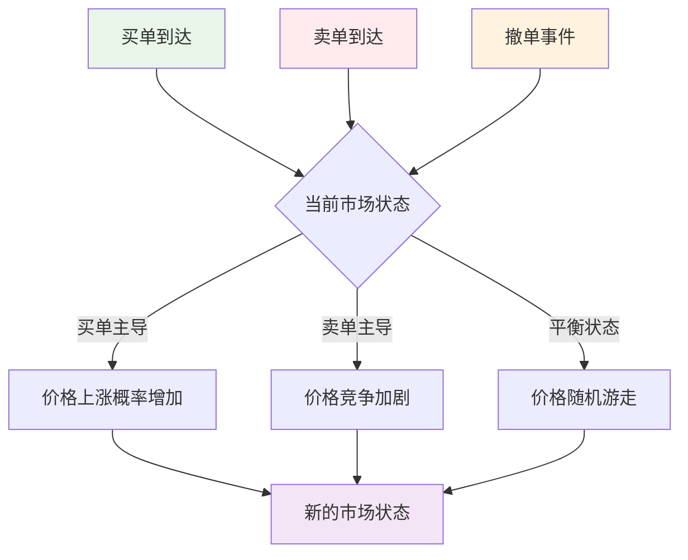

# 第11章：高频交易中的马尔科夫模型实践

::: tip 学习目标
- 建模订单流的马尔科夫性质
- 实现市场微观结构模型
- 预测短期价格波动
- 构建高频交易策略
:::

## 知识点总结

### 1. 高频交易中的马尔科夫性质

在高频交易环境中，市场微观结构呈现出明显的马尔科夫特征：

**价格跳跃模型**：
价格变化可以建模为离散状态的马尔科夫链：
$$P_{t+1} = P_t + \delta \cdot \text{tick\_size}$$

其中 $\delta \in \{-n, -(n-1), \ldots, -1, 0, 1, \ldots, (n-1), n\}$

**订单流状态**：
$$S_t \in \{\text{买单主导}, \text{卖单主导}, \text{平衡}\}$$

**市场深度状态**：
$$D_t \in \{\text{厚度高}, \text{厚度中}, \text{厚度低}\}$$



### 2. 订单簿动态建模

**状态空间定义**：
考虑买卖价差和订单深度的联合状态：
$$S_t = (\text{Spread}_t, \text{Depth}_{bid,t}, \text{Depth}_{ask,t})$$

**转移概率**：
$$P(S_{t+1} | S_t, \text{Order}_t)$$

其中 $\text{Order}_t$ 表示时刻 $t$ 的订单类型。

### 3. 高频价格预测模型

**多状态价格模型**：
$$\Delta P_{t+1} = \sum_{i=1}^{k} \mu_i \mathbf{1}_{\{S_t = i\}} + \sigma_{S_t} \epsilon_{t+1}$$

**条件波动率**：
$$\sigma_{t+1}^2 = \alpha_0 + \alpha_1 \epsilon_t^2 + \beta_1 \sigma_t^2 + \gamma \mathbf{1}_{\{S_t = \text{高波动状态}\}}$$

### 4. 市场冲击模型

**临时冲击**：
描述大额订单对价格的即时影响
$$\Delta P_{temp} = \lambda \cdot \text{sign}(Q) \cdot |Q|^{\alpha}$$

**永久冲击**：
描述订单的持久性价格影响
$$\Delta P_{perm} = \eta \cdot \text{sign}(Q) \cdot |Q|^{\beta}$$

## 示例代码

### 示例1：订单簿状态建模

```python
import numpy as np
import pandas as pd
import matplotlib.pyplot as plt
from collections import defaultdict
import seaborn as sns
from datetime import datetime, timedelta

class OrderBookState:
    """
    订单簿状态建模
    """

    def __init__(self, spread_levels=5, depth_levels=3):
        """
        初始化订单簿状态模型

        Parameters:
        spread_levels: 价差等级数
        depth_levels: 深度等级数
        """
        self.spread_levels = spread_levels
        self.depth_levels = depth_levels
        self.states = self._generate_states()
        self.n_states = len(self.states)
        self.state_to_index = {state: i for i, state in enumerate(self.states)}
        self.transition_matrix = None

    def _generate_states(self):
        """生成所有可能的状态"""
        states = []
        for spread in range(self.spread_levels):
            for bid_depth in range(self.depth_levels):
                for ask_depth in range(self.depth_levels):
                    states.append((spread, bid_depth, ask_depth))
        return states

    def discretize_market_data(self, spreads, bid_depths, ask_depths):
        """
        将连续的市场数据离散化为状态

        Parameters:
        spreads: 价差序列
        bid_depths: 买方深度序列
        ask_depths: 卖方深度序列

        Returns:
        states: 离散化的状态序列
        """
        # 将数据分为等级
        spread_bins = np.linspace(np.min(spreads), np.max(spreads), self.spread_levels + 1)
        bid_depth_bins = np.linspace(np.min(bid_depths), np.max(bid_depths), self.depth_levels + 1)
        ask_depth_bins = np.linspace(np.min(ask_depths), np.max(ask_depths), self.depth_levels + 1)

        # 离散化
        spread_states = np.digitize(spreads, spread_bins) - 1
        bid_depth_states = np.digitize(bid_depths, bid_depth_bins) - 1
        ask_depth_states = np.digitize(ask_depths, ask_depth_bins) - 1

        # 确保状态在有效范围内
        spread_states = np.clip(spread_states, 0, self.spread_levels - 1)
        bid_depth_states = np.clip(bid_depth_states, 0, self.depth_levels - 1)
        ask_depth_states = np.clip(ask_depth_states, 0, self.depth_levels - 1)

        # 组合成状态
        states = [(s, b, a) for s, b, a in zip(spread_states, bid_depth_states, ask_depth_states)]
        return states

    def estimate_transition_matrix(self, states):
        """
        估计状态转移矩阵

        Parameters:
        states: 状态序列

        Returns:
        transition_matrix: 转移概率矩阵
        """
        # 初始化计数矩阵
        transition_counts = np.zeros((self.n_states, self.n_states))

        # 统计状态转移
        for t in range(len(states) - 1):
            from_state = states[t]
            to_state = states[t + 1]

            from_idx = self.state_to_index[from_state]
            to_idx = self.state_to_index[to_state]

            transition_counts[from_idx, to_idx] += 1

        # 转换为概率矩阵
        row_sums = transition_counts.sum(axis=1, keepdims=True)
        self.transition_matrix = np.divide(
            transition_counts,
            row_sums,
            out=np.zeros_like(transition_counts),
            where=row_sums != 0
        )

        return self.transition_matrix

    def predict_next_state_probabilities(self, current_state):
        """预测下一状态的概率分布"""
        if self.transition_matrix is None:
            raise ValueError("需要先估计转移矩阵")

        current_idx = self.state_to_index[current_state]
        return self.transition_matrix[current_idx]

    def simulate_state_path(self, initial_state, n_steps):
        """模拟状态路径"""
        if self.transition_matrix is None:
            raise ValueError("需要先估计转移矩阵")

        path = [initial_state]
        current_state = initial_state

        for _ in range(n_steps):
            current_idx = self.state_to_index[current_state]
            probs = self.transition_matrix[current_idx]

            # 选择下一状态
            next_idx = np.random.choice(self.n_states, p=probs)
            next_state = self.states[next_idx]

            path.append(next_state)
            current_state = next_state

        return path

def generate_synthetic_orderbook_data(n_samples=10000, seed=42):
    """
    生成合成订单簿数据

    Parameters:
    n_samples: 样本数量
    seed: 随机种子

    Returns:
    订单簿数据
    """
    np.random.seed(seed)

    # 基础参数
    base_spread = 0.01
    base_depth = 1000

    # 生成时间序列
    timestamps = [datetime.now() + timedelta(milliseconds=i*100) for i in range(n_samples)]

    # 生成相关的价差和深度数据
    spreads = []
    bid_depths = []
    ask_depths = []

    # 初始值
    current_spread = base_spread
    current_bid_depth = base_depth
    current_ask_depth = base_depth

    for i in range(n_samples):
        # 添加一些自相关性和随机冲击
        spread_shock = np.random.normal(0, 0.001)
        depth_shock = np.random.normal(0, 50)

        # 价差的均值回复
        current_spread = 0.9 * current_spread + 0.1 * base_spread + spread_shock
        current_spread = max(0.005, current_spread)  # 最小价差

        # 深度的随机游走
        current_bid_depth = max(100, current_bid_depth + depth_shock)
        current_ask_depth = max(100, current_ask_depth + depth_shock)

        spreads.append(current_spread)
        bid_depths.append(current_bid_depth)
        ask_depths.append(current_ask_depth)

    return pd.DataFrame({
        'timestamp': timestamps,
        'spread': spreads,
        'bid_depth': bid_depths,
        'ask_depth': ask_depths
    })

# 生成合成数据
print("生成合成订单簿数据...")
orderbook_data = generate_synthetic_orderbook_data(n_samples=5000)

print(f"数据概况:")
print(f"样本数量: {len(orderbook_data)}")
print(f"价差范围: [{orderbook_data['spread'].min():.4f}, {orderbook_data['spread'].max():.4f}]")
print(f"买方深度范围: [{orderbook_data['bid_depth'].min():.0f}, {orderbook_data['bid_depth'].max():.0f}]")
print(f"卖方深度范围: [{orderbook_data['ask_depth'].min():.0f}, {orderbook_data['ask_depth'].max():.0f}]")

# 创建订单簿状态模型
ob_model = OrderBookState(spread_levels=3, depth_levels=3)

# 离散化数据
states = ob_model.discretize_market_data(
    orderbook_data['spread'].values,
    orderbook_data['bid_depth'].values,
    orderbook_data['ask_depth'].values
)

print(f"\n状态空间大小: {ob_model.n_states}")
print(f"状态示例: {ob_model.states[:5]}")

# 估计转移矩阵
transition_matrix = ob_model.estimate_transition_matrix(states)

print(f"\n状态转移矩阵 (部分):")
print(transition_matrix[:5, :5])

# 分析状态分布
state_counts = defaultdict(int)
for state in states:
    state_counts[state] += 1

print(f"\n最常见的状态:")
sorted_states = sorted(state_counts.items(), key=lambda x: x[1], reverse=True)
for state, count in sorted_states[:5]:
    print(f"状态 {state}: {count} 次 ({count/len(states):.2%})")
```

### 示例2：价格跳跃建模

```python
class PriceJumpModel:
    """
    高频价格跳跃马尔科夫模型
    """

    def __init__(self, max_jump_size=5):
        """
        初始化价格跳跃模型

        Parameters:
        max_jump_size: 最大跳跃大小（以tick为单位）
        """
        self.max_jump_size = max_jump_size
        self.jump_states = list(range(-max_jump_size, max_jump_size + 1))
        self.n_states = len(self.jump_states)
        self.state_to_index = {state: i for i, state in enumerate(self.jump_states)}
        self.transition_matrix = None

    def fit(self, price_changes):
        """
        拟合价格跳跃模型

        Parameters:
        price_changes: 价格变化序列（以tick为单位）
        """
        # 限制跳跃大小
        clipped_changes = np.clip(price_changes, -self.max_jump_size, self.max_jump_size)

        # 计算转移矩阵
        transition_counts = np.zeros((self.n_states, self.n_states))

        for t in range(len(clipped_changes) - 1):
            from_jump = int(clipped_changes[t])
            to_jump = int(clipped_changes[t + 1])

            from_idx = self.state_to_index[from_jump]
            to_idx = self.state_to_index[to_jump]

            transition_counts[from_idx, to_idx] += 1

        # 转换为概率矩阵
        row_sums = transition_counts.sum(axis=1, keepdims=True)
        self.transition_matrix = np.divide(
            transition_counts,
            row_sums,
            out=np.zeros_like(transition_counts),
            where=row_sums != 0
        )

        return self

    def predict_next_jump_probs(self, current_jump):
        """预测下一跳跃的概率分布"""
        if self.transition_matrix is None:
            raise ValueError("模型尚未拟合")

        current_idx = self.state_to_index[current_jump]
        return self.transition_matrix[current_idx]

    def simulate_price_path(self, initial_price, initial_jump, n_steps, tick_size=0.01):
        """
        模拟价格路径

        Parameters:
        initial_price: 初始价格
        initial_jump: 初始跳跃
        n_steps: 模拟步数
        tick_size: 最小价格单位

        Returns:
        价格路径和跳跃路径
        """
        prices = [initial_price]
        jumps = [initial_jump]

        current_price = initial_price
        current_jump = initial_jump

        for _ in range(n_steps):
            # 预测下一跳跃
            probs = self.predict_next_jump_probs(current_jump)
            next_jump = np.random.choice(self.jump_states, p=probs)

            # 更新价格
            current_price += next_jump * tick_size
            current_jump = next_jump

            prices.append(current_price)
            jumps.append(next_jump)

        return np.array(prices), np.array(jumps)

    def calculate_jump_persistence(self):
        """计算跳跃持续性"""
        if self.transition_matrix is None:
            raise ValueError("模型尚未拟合")

        persistence = {}
        for i, jump in enumerate(self.jump_states):
            # 计算保持相同方向跳跃的概率
            if jump > 0:  # 正跳跃
                same_direction_prob = np.sum(self.transition_matrix[i, len(self.jump_states)//2 + 1:])
            elif jump < 0:  # 负跳跃
                same_direction_prob = np.sum(self.transition_matrix[i, :len(self.jump_states)//2])
            else:  # 零跳跃
                same_direction_prob = self.transition_matrix[i, len(self.jump_states)//2]

            persistence[jump] = same_direction_prob

        return persistence

def generate_synthetic_price_data(n_samples=5000, initial_price=100, tick_size=0.01, seed=42):
    """
    生成合成高频价格数据

    Parameters:
    n_samples: 样本数量
    initial_price: 初始价格
    tick_size: 最小价格单位
    seed: 随机种子

    Returns:
    价格数据
    """
    np.random.seed(seed)

    prices = [initial_price]
    timestamps = [datetime.now() + timedelta(milliseconds=i*100) for i in range(n_samples)]

    # 模拟价格跳跃过程
    for i in range(1, n_samples):
        # 跳跃概率依赖于前一次跳跃
        if i == 1:
            jump_prob = [0.05, 0.15, 0.6, 0.15, 0.05]  # [-2, -1, 0, 1, 2] ticks
        else:
            # 添加一些持续性
            last_change = (prices[-1] - prices[-2]) / tick_size
            if last_change > 0:
                jump_prob = [0.02, 0.08, 0.4, 0.3, 0.2]  # 上涨后更可能继续上涨
            elif last_change < 0:
                jump_prob = [0.2, 0.3, 0.4, 0.08, 0.02]  # 下跌后更可能继续下跌
            else:
                jump_prob = [0.05, 0.15, 0.6, 0.15, 0.05]  # 无变化时随机

        # 生成跳跃
        jump = np.random.choice([-2, -1, 0, 1, 2], p=jump_prob)
        new_price = prices[-1] + jump * tick_size
        prices.append(max(0.01, new_price))  # 确保价格为正

    return pd.DataFrame({
        'timestamp': timestamps,
        'price': prices
    })

# 生成合成价格数据
print(f"\n生成合成高频价格数据...")
price_data = generate_synthetic_price_data(n_samples=3000)

# 计算价格变化
price_data['price_change'] = price_data['price'].diff()
price_data['tick_change'] = (price_data['price_change'] / 0.01).round().astype(int)

print(f"价格数据概况:")
print(f"样本数量: {len(price_data)}")
print(f"价格范围: [{price_data['price'].min():.2f}, {price_data['price'].max():.2f}]")
print(f"平均tick变化: {price_data['tick_change'].mean():.3f}")
print(f"tick变化标准差: {price_data['tick_change'].std():.3f}")

# 创建并拟合价格跳跃模型
jump_model = PriceJumpModel(max_jump_size=3)
jump_model.fit(price_data['tick_change'].dropna().values)

print(f"\n价格跳跃模型:")
print(f"跳跃状态: {jump_model.jump_states}")

# 分析跳跃持续性
persistence = jump_model.calculate_jump_persistence()
print(f"\n跳跃持续性分析:")
for jump, prob in persistence.items():
    print(f"跳跃 {jump:2d}: 持续概率 {prob:.3f}")

# 可视化分析
fig, axes = plt.subplots(2, 3, figsize=(18, 12))

# 子图1：价格时序图
axes[0, 0].plot(price_data.index[:500], price_data['price'].iloc[:500], linewidth=1)
axes[0, 0].set_title('高频价格序列（前500个观测）')
axes[0, 0].set_xlabel('时间')
axes[0, 0].set_ylabel('价格')
axes[0, 0].grid(True, alpha=0.3)

# 子图2：价格变化分布
axes[0, 1].hist(price_data['tick_change'].dropna(), bins=range(-5, 6),
               density=True, alpha=0.7, edgecolor='black')
axes[0, 1].set_title('Tick变化分布')
axes[0, 1].set_xlabel('Tick变化')
axes[0, 1].set_ylabel('密度')
axes[0, 1].grid(True, alpha=0.3)

# 子图3：跳跃转移矩阵热图
sns.heatmap(jump_model.transition_matrix,
           xticklabels=jump_model.jump_states,
           yticklabels=jump_model.jump_states,
           annot=True, fmt='.2f', cmap='Blues',
           ax=axes[0, 2])
axes[0, 2].set_title('跳跃转移概率矩阵')
axes[0, 2].set_xlabel('下一跳跃')
axes[0, 2].set_ylabel('当前跳跃')

# 子图4：模拟价格路径
sim_prices, sim_jumps = jump_model.simulate_price_path(
    initial_price=100, initial_jump=0, n_steps=500, tick_size=0.01
)
axes[1, 0].plot(sim_prices, linewidth=1, color='red', alpha=0.8)
axes[1, 0].set_title('模拟价格路径')
axes[1, 0].set_xlabel('时间')
axes[1, 0].set_ylabel('价格')
axes[1, 0].grid(True, alpha=0.3)

# 子图5：跳跃自相关分析
from statsmodels.tsa.stattools import acf

lags = 20
tick_changes = price_data['tick_change'].dropna().values
autocorr = acf(tick_changes, nlags=lags, fft=True)

axes[1, 1].bar(range(lags + 1), autocorr, alpha=0.7)
axes[1, 1].axhline(y=0, color='black', linestyle='-', alpha=0.5)
axes[1, 1].axhline(y=1.96/np.sqrt(len(tick_changes)), color='red', linestyle='--', alpha=0.7)
axes[1, 1].axhline(y=-1.96/np.sqrt(len(tick_changes)), color='red', linestyle='--', alpha=0.7)
axes[1, 1].set_title('价格跳跃自相关函数')
axes[1, 1].set_xlabel('滞后期')
axes[1, 1].set_ylabel('自相关系数')
axes[1, 1].grid(True, alpha=0.3)

# 子图6：跳跃大小概率分布
jump_probs = np.mean(jump_model.transition_matrix, axis=0)
axes[1, 2].bar(jump_model.jump_states, jump_probs, alpha=0.7, color='green')
axes[1, 2].set_title('平均跳跃概率分布')
axes[1, 2].set_xlabel('跳跃大小 (ticks)')
axes[1, 2].set_ylabel('概率')
axes[1, 2].grid(True, alpha=0.3, axis='y')

plt.tight_layout()
plt.show()
```

### 示例3：高频交易策略

```python
class HighFrequencyTradingStrategy:
    """
    基于马尔科夫模型的高频交易策略
    """

    def __init__(self, jump_model, orderbook_model, transaction_cost=0.0001):
        """
        初始化高频交易策略

        Parameters:
        jump_model: 价格跳跃模型
        orderbook_model: 订单簿模型
        transaction_cost: 交易成本
        """
        self.jump_model = jump_model
        self.orderbook_model = orderbook_model
        self.transaction_cost = transaction_cost
        self.position = 0
        self.cash = 100000  # 初始现金
        self.trade_history = []

    def generate_signal(self, current_jump, current_ob_state, price):
        """
        生成交易信号

        Parameters:
        current_jump: 当前价格跳跃
        current_ob_state: 当前订单簿状态
        price: 当前价格

        Returns:
        signal: 交易信号 (-1, 0, 1)
        confidence: 信号置信度
        """
        # 基于价格跳跃模型的预测
        jump_probs = self.jump_model.predict_next_jump_probs(current_jump)

        # 计算期望价格变化
        expected_jump = np.sum(np.array(self.jump_model.jump_states) * jump_probs)

        # 基于订单簿状态的调整
        ob_probs = self.orderbook_model.predict_next_state_probabilities(current_ob_state)

        # 简化的状态评分：低价差高深度 = 有利
        ob_score = 0
        for i, prob in enumerate(ob_probs):
            state = self.orderbook_model.states[i]
            spread_level, bid_depth, ask_depth = state
            # 低价差和高深度得高分
            state_score = (self.orderbook_model.spread_levels - spread_level) + bid_depth + ask_depth
            ob_score += prob * state_score

        # 结合信号
        combined_signal = expected_jump + 0.1 * (ob_score - 5)  # 调整权重

        # 生成交易信号
        threshold = 0.3
        if combined_signal > threshold:
            signal = 1  # 买入
            confidence = min(1.0, combined_signal / threshold)
        elif combined_signal < -threshold:
            signal = -1  # 卖出
            confidence = min(1.0, abs(combined_signal) / threshold)
        else:
            signal = 0  # 持有
            confidence = 0

        return signal, confidence

    def execute_trade(self, signal, confidence, price, timestamp):
        """
        执行交易

        Parameters:
        signal: 交易信号
        confidence: 信号置信度
        price: 当前价格
        timestamp: 时间戳
        """
        # 计算目标仓位
        max_position = 1000  # 最大仓位
        target_position = signal * confidence * max_position

        # 计算需要交易的数量
        trade_quantity = target_position - self.position

        # 设置最小交易单位
        min_trade_size = 100
        if abs(trade_quantity) < min_trade_size:
            return

        # 考虑交易成本
        trade_cost = abs(trade_quantity) * price * self.transaction_cost

        # 执行交易
        if trade_quantity != 0:
            self.position += trade_quantity
            self.cash -= trade_quantity * price + trade_cost

            self.trade_history.append({
                'timestamp': timestamp,
                'price': price,
                'quantity': trade_quantity,
                'position': self.position,
                'cash': self.cash,
                'signal': signal,
                'confidence': confidence,
                'cost': trade_cost
            })

    def calculate_pnl(self, current_price):
        """计算当前损益"""
        portfolio_value = self.cash + self.position * current_price
        return portfolio_value - 100000  # 减去初始资本

    def backtest(self, price_data, jump_data, ob_states):
        """
        回测策略

        Parameters:
        price_data: 价格数据
        jump_data: 跳跃数据
        ob_states: 订单簿状态数据

        Returns:
        回测结果
        """
        portfolio_values = []
        signals = []

        for i in range(1, len(price_data)):
            timestamp = price_data.index[i]
            price = price_data.iloc[i]
            current_jump = jump_data[i-1] if i-1 < len(jump_data) else 0
            current_ob_state = ob_states[i-1] if i-1 < len(ob_states) else ob_states[0]

            # 生成交易信号
            signal, confidence = self.generate_signal(current_jump, current_ob_state, price)
            signals.append(signal)

            # 执行交易
            self.execute_trade(signal, confidence, price, timestamp)

            # 记录投资组合价值
            pnl = self.calculate_pnl(price)
            portfolio_values.append(pnl)

        return {
            'portfolio_values': portfolio_values,
            'signals': signals,
            'trades': self.trade_history,
            'final_pnl': portfolio_values[-1] if portfolio_values else 0
        }

# 创建高频交易策略
hft_strategy = HighFrequencyTradingStrategy(
    jump_model=jump_model,
    orderbook_model=ob_model,
    transaction_cost=0.0001
)

# 准备回测数据
test_start = 1000
test_end = 2500
test_prices = price_data['price'].iloc[test_start:test_end]
test_jumps = price_data['tick_change'].iloc[test_start:test_end-1].values
test_ob_states = states[test_start:test_end-1]

print(f"\n开始策略回测...")
print(f"回测期间: {test_end - test_start} 个时间点")
print(f"初始资金: {hft_strategy.cash:,.0f}")

# 执行回测
backtest_results = hft_strategy.backtest(test_prices, test_jumps, test_ob_states)

print(f"\n回测结果:")
print(f"最终损益: {backtest_results['final_pnl']:,.2f}")
print(f"交易次数: {len(backtest_results['trades'])}")
print(f"胜率: {np.mean([t['quantity'] * (test_prices.iloc[-1] - t['price']) > 0 for t in backtest_results['trades']]):.2%}")

# 计算关键指标
if backtest_results['portfolio_values']:
    returns = np.diff(backtest_results['portfolio_values'])
    sharpe_ratio = np.mean(returns) / np.std(returns) * np.sqrt(252 * 24 * 60 * 6) if np.std(returns) > 0 else 0  # 假设每分钟10个交易
    max_drawdown = np.max(np.maximum.accumulate(backtest_results['portfolio_values']) - backtest_results['portfolio_values'])

    print(f"夏普比率: {sharpe_ratio:.2f}")
    print(f"最大回撤: {max_drawdown:,.2f}")

# 可视化回测结果
fig, axes = plt.subplots(2, 3, figsize=(18, 12))

# 子图1：价格与交易信号
axes[0, 0].plot(test_prices.index, test_prices.values, linewidth=1, label='价格')

# 标记交易点
for trade in backtest_results['trades']:
    color = 'green' if trade['quantity'] > 0 else 'red'
    marker = '^' if trade['quantity'] > 0 else 'v'
    axes[0, 0].scatter(trade['timestamp'], trade['price'],
                      color=color, marker=marker, s=50, alpha=0.7)

axes[0, 0].set_title('价格与交易信号')
axes[0, 0].set_xlabel('时间')
axes[0, 0].set_ylabel('价格')
axes[0, 0].legend()
axes[0, 0].grid(True, alpha=0.3)

# 子图2：投资组合价值
axes[0, 1].plot(backtest_results['portfolio_values'], linewidth=2, color='blue')
axes[0, 1].set_title('投资组合损益')
axes[0, 1].set_xlabel('时间')
axes[0, 1].set_ylabel('损益')
axes[0, 1].grid(True, alpha=0.3)

# 子图3：信号分布
signal_counts = pd.Series(backtest_results['signals']).value_counts().sort_index()
axes[0, 2].bar(signal_counts.index, signal_counts.values,
               color=['red', 'gray', 'green'], alpha=0.7)
axes[0, 2].set_title('交易信号分布')
axes[0, 2].set_xlabel('信号')
axes[0, 2].set_ylabel('频次')
axes[0, 2].set_xticks([-1, 0, 1])
axes[0, 2].set_xticklabels(['卖出', '持有', '买入'])
axes[0, 2].grid(True, alpha=0.3, axis='y')

# 子图4：仓位变化
positions = [0] + [trade['position'] for trade in backtest_results['trades']]
trade_times = [test_prices.index[0]] + [trade['timestamp'] for trade in backtest_results['trades']]
axes[1, 0].step(trade_times, positions, where='post', linewidth=2)
axes[1, 0].set_title('仓位变化')
axes[1, 0].set_xlabel('时间')
axes[1, 0].set_ylabel('仓位')
axes[1, 0].grid(True, alpha=0.3)

# 子图5：交易成本分析
if backtest_results['trades']:
    trade_costs = [trade['cost'] for trade in backtest_results['trades']]
    cumulative_costs = np.cumsum(trade_costs)
    axes[1, 1].plot(cumulative_costs, linewidth=2, color='red')
    axes[1, 1].set_title('累积交易成本')
    axes[1, 1].set_xlabel('交易序号')
    axes[1, 1].set_ylabel('累积成本')
    axes[1, 1].grid(True, alpha=0.3)

# 子图6：收益分布
if len(backtest_results['portfolio_values']) > 1:
    returns = np.diff(backtest_results['portfolio_values'])
    axes[1, 2].hist(returns, bins=30, density=True, alpha=0.7, color='blue')
    axes[1, 2].axvline(np.mean(returns), color='red', linestyle='--',
                      label=f'均值: {np.mean(returns):.2f}')
    axes[1, 2].set_title('收益分布')
    axes[1, 2].set_xlabel('收益')
    axes[1, 2].set_ylabel('密度')
    axes[1, 2].legend()
    axes[1, 2].grid(True, alpha=0.3)

plt.tight_layout()
plt.show()

# 交易统计分析
if backtest_results['trades']:
    trade_df = pd.DataFrame(backtest_results['trades'])

    print(f"\n交易统计分析:")
    print(f"买入交易: {sum(trade_df['quantity'] > 0)} 次")
    print(f"卖出交易: {sum(trade_df['quantity'] < 0)} 次")
    print(f"平均交易规模: {abs(trade_df['quantity']).mean():.0f}")
    print(f"总交易成本: {trade_df['cost'].sum():.2f}")

    # 持仓时间分析
    holding_periods = []
    for i in range(1, len(trade_df)):
        if trade_df.iloc[i]['position'] != trade_df.iloc[i-1]['position']:
            holding_periods.append(i - max(0, i-10))  # 简化计算

    if holding_periods:
        print(f"平均持仓时间: {np.mean(holding_periods):.1f} 个时间点")
```

### 示例4：市场微观结构分析

```python
class MarketMicrostructureAnalyzer:
    """
    市场微观结构分析器
    """

    def __init__(self):
        self.data = None

    def analyze_bid_ask_dynamics(self, orderbook_data):
        """
        分析买卖价差动态

        Parameters:
        orderbook_data: 订单簿数据

        Returns:
        分析结果
        """
        results = {}

        # 价差统计
        spreads = orderbook_data['spread']
        results['spread_stats'] = {
            'mean': spreads.mean(),
            'std': spreads.std(),
            'min': spreads.min(),
            'max': spreads.max(),
            'median': spreads.median()
        }

        # 价差持续性分析
        spread_changes = spreads.diff().dropna()
        spread_autocorr = [spread_changes.autocorr(lag=i) for i in range(1, 11)]
        results['spread_autocorr'] = spread_autocorr

        # 深度分析
        bid_depths = orderbook_data['bid_depth']
        ask_depths = orderbook_data['ask_depth']

        results['depth_correlation'] = bid_depths.corr(ask_depths)
        results['depth_imbalance'] = (bid_depths - ask_depths) / (bid_depths + ask_depths)

        return results

    def calculate_market_impact(self, trades, prices):
        """
        计算市场冲击

        Parameters:
        trades: 交易数据
        prices: 价格数据

        Returns:
        市场冲击分析
        """
        impacts = []

        for i, trade in enumerate(trades):
            if i < len(prices) - 5:  # 确保有足够的后续价格
                trade_price = trade['price']
                trade_size = abs(trade['quantity'])
                trade_sign = np.sign(trade['quantity'])

                # 计算价格冲击（5期后的价格变化）
                future_price = prices.iloc[i + 5] if i + 5 < len(prices) else prices.iloc[-1]
                price_impact = (future_price - trade_price) * trade_sign

                impacts.append({
                    'trade_size': trade_size,
                    'price_impact': price_impact,
                    'trade_sign': trade_sign
                })

        if impacts:
            impact_df = pd.DataFrame(impacts)

            # 按交易规模分组分析
            size_bins = pd.qcut(impact_df['trade_size'], q=3, labels=['小', '中', '大'])
            impact_by_size = impact_df.groupby(size_bins)['price_impact'].mean()

            return {
                'average_impact': impact_df['price_impact'].mean(),
                'impact_by_size': impact_by_size,
                'impact_correlation': impact_df['trade_size'].corr(impact_df['price_impact'])
            }

        return {}

    def volatility_clustering_analysis(self, returns):
        """
        波动率聚类分析

        Parameters:
        returns: 收益率序列

        Returns:
        波动率聚类分析结果
        """
        # 计算绝对收益率
        abs_returns = np.abs(returns)

        # 自相关分析
        autocorrs = [abs_returns.autocorr(lag=i) for i in range(1, 21)]

        # ARCH效应检验（简化版）
        squared_returns = returns ** 2
        arch_autocorrs = [squared_returns.autocorr(lag=i) for i in range(1, 11)]

        return {
            'volatility_autocorr': autocorrs,
            'arch_effects': arch_autocorrs,
            'volatility_persistence': np.mean(autocorrs[:5])
        }

# 市场微观结构分析
analyzer = MarketMicrostructureAnalyzer()

# 分析买卖价差动态
spread_analysis = analyzer.analyze_bid_ask_dynamics(orderbook_data)

print(f"\n市场微观结构分析:")
print("=" * 50)
print(f"价差统计:")
for key, value in spread_analysis['spread_stats'].items():
    print(f"  {key}: {value:.6f}")

print(f"\n深度相关性: {spread_analysis['depth_correlation']:.3f}")
print(f"平均深度不平衡: {spread_analysis['depth_imbalance'].mean():.3f}")

# 计算市场冲击
if backtest_results['trades']:
    impact_analysis = analyzer.calculate_market_impact(
        backtest_results['trades'],
        test_prices
    )

    if impact_analysis:
        print(f"\n市场冲击分析:")
        print(f"平均价格冲击: {impact_analysis['average_impact']:.6f}")
        print(f"冲击与交易规模相关性: {impact_analysis['impact_correlation']:.3f}")

        print(f"\n不同规模交易的平均冲击:")
        for size, impact in impact_analysis['impact_by_size'].items():
            print(f"  {size}规模交易: {impact:.6f}")

# 波动率聚类分析
price_returns = price_data['price'].pct_change().dropna()
volatility_analysis = analyzer.volatility_clustering_analysis(price_returns)

print(f"\n波动率聚类分析:")
print(f"波动率持续性: {volatility_analysis['volatility_persistence']:.3f}")

# 可视化微观结构特征
fig, axes = plt.subplots(2, 2, figsize=(15, 10))

# 子图1：价差自相关
lags = range(1, len(spread_analysis['spread_autocorr']) + 1)
axes[0, 0].bar(lags, spread_analysis['spread_autocorr'], alpha=0.7)
axes[0, 0].axhline(y=0, color='black', linestyle='-', alpha=0.5)
axes[0, 0].set_title('价差自相关函数')
axes[0, 0].set_xlabel('滞后期')
axes[0, 0].set_ylabel('自相关系数')
axes[0, 0].grid(True, alpha=0.3)

# 子图2：深度不平衡分布
axes[0, 1].hist(spread_analysis['depth_imbalance'], bins=30,
               density=True, alpha=0.7, color='green')
axes[0, 1].axvline(0, color='red', linestyle='--', label='平衡点')
axes[0, 1].set_title('订单簿深度不平衡分布')
axes[0, 1].set_xlabel('深度不平衡')
axes[0, 1].set_ylabel('密度')
axes[0, 1].legend()
axes[0, 1].grid(True, alpha=0.3)

# 子图3：波动率自相关
vol_lags = range(1, len(volatility_analysis['volatility_autocorr']) + 1)
axes[1, 0].plot(vol_lags, volatility_analysis['volatility_autocorr'],
               'bo-', linewidth=2, markersize=4)
axes[1, 0].axhline(y=0, color='black', linestyle='-', alpha=0.5)
axes[1, 0].set_title('波动率自相关函数')
axes[1, 0].set_xlabel('滞后期')
axes[1, 0].set_ylabel('自相关系数')
axes[1, 0].grid(True, alpha=0.3)

# 子图4：ARCH效应
arch_lags = range(1, len(volatility_analysis['arch_effects']) + 1)
axes[1, 1].bar(arch_lags, volatility_analysis['arch_effects'],
              alpha=0.7, color='orange')
axes[1, 1].axhline(y=0, color='black', linestyle='-', alpha=0.5)
axes[1, 1].set_title('ARCH效应检验')
axes[1, 1].set_xlabel('滞后期')
axes[1, 1].set_ylabel('平方收益自相关')
axes[1, 1].grid(True, alpha=0.3)

plt.tight_layout()
plt.show()

print(f"\n高频交易策略总结:")
print(f"1. 利用马尔科夫模型捕捉价格跳跃的短期预测性")
print(f"2. 结合订单簿状态信息提高信号质量")
print(f"3. 考虑交易成本对策略收益的影响")
print(f"4. 市场微观结构分析有助于理解价格形成机制")
print(f"5. 波动率聚类现象在高频数据中尤为明显")
```

## 理论分析

### 高频数据的马尔科夫性质

在毫秒级别的高频数据中，马尔科夫性质更加明显：

**信息到达模型**：
$$\lambda_t = \lambda_0 + \alpha I_{t-1} + \beta \lambda_{t-1}$$

其中 $\lambda_t$ 是信息到达强度，$I_{t-1}$ 是前期信息指标。

**价格发现过程**：
$$\Delta p_t = \gamma \sum_{j} q_j \epsilon_{j,t} + \eta_t$$

其中 $q_j$ 是交易规模，$\epsilon_{j,t}$ 是信息内容。

### 订单流毒性模型

**VPIN指标**：
$$VPIN_t = \frac{|V_t^{buy} - V_t^{sell}|}{V_t^{buy} + V_t^{sell}}$$

描述订单流的信息不对称程度。

### 高频交易的市场冲击

**线性冲击模型**：
$$\Delta p = \lambda \sigma \sqrt{\frac{Q}{V}}$$

其中：
- $\lambda$ 是冲击系数
- $\sigma$ 是波动率
- $Q$ 是交易规模
- $V$ 是成交量

## 数学公式总结

1. **价格跳跃转移概率**：$P(\Delta p_{t+1} = j | \Delta p_t = i)$

2. **订单簿状态转移**：$P(S_{t+1} | S_t, O_t)$

3. **市场冲击函数**：$f(Q) = \lambda |Q|^{\alpha}$

4. **VPIN毒性指标**：$VPIN = \frac{|OIB|}{Volume}$

5. **实现波动率**：$RV_t = \sum_{i=1}^{n} r_{t,i}^2$

6. **微观价格效率**：$VR = \frac{Var(\Delta p_t)}{2 Var(\Delta p_{t/2})}$

::: warning 高频交易注意事项
- 数据质量对模型性能影响巨大
- 交易成本在高频环境下非常重要
- 需要考虑市场微观结构的制度性因素
- 模型需要快速更新以适应市场变化
- 监管风险和系统性风险需要重点关注
:::