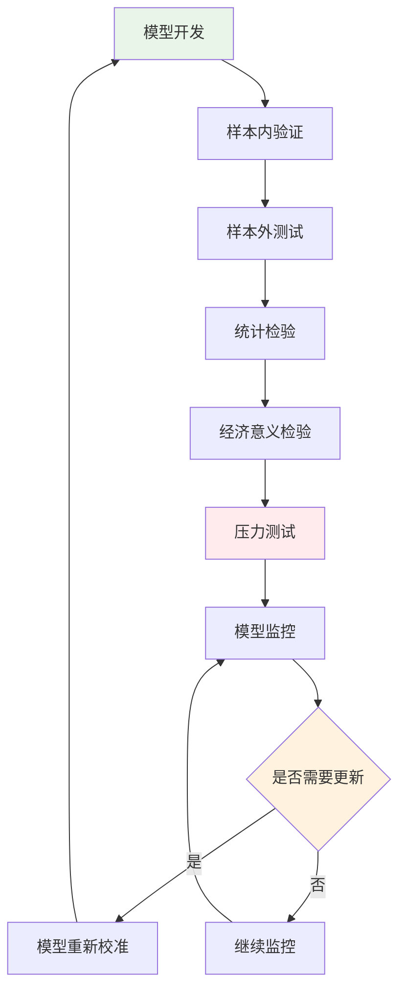

# 第12章：模型评估与风险管理

::: tip 学习目标
- 掌握马尔科夫模型的诊断方法
- 进行模型稳健性检验
- 实现动态风险度量
- 构建模型风险管理框架
:::

## 知识点总结

### 1. 模型验证框架



### 2. 关键评估指标

**统计指标**：
- 对数似然：$\ell = \sum_{t=1}^T \log P(y_t | y_{t-1}, \theta)$
- AIC：$AIC = -2\ell + 2k$
- BIC：$BIC = -2\ell + k\log T$

**预测精度**：
- RMSE：$\sqrt{\frac{1}{T}\sum_{t=1}^T (y_t - \hat{y}_t)^2}$
- MAE：$\frac{1}{T}\sum_{t=1}^T |y_t - \hat{y}_t|$

**风险指标**：
- VaR：$P(L > VaR_\alpha) = \alpha$
- ES：$ES_\alpha = E[L | L > VaR_\alpha]$

## 示例代码

### 示例1：模型诊断与验证

```python
import numpy as np
import matplotlib.pyplot as plt
from scipy import stats
from sklearn.metrics import mean_squared_error, mean_absolute_error
import pandas as pd

class ModelValidator:
    """马尔科夫模型验证器"""

    def __init__(self, model):
        self.model = model
        self.validation_results = {}

    def goodness_of_fit_test(self, observed_transitions, expected_transitions):
        """拟合优度检验"""
        # 卡方检验
        chi2_stat = np.sum((observed_transitions - expected_transitions)**2 / expected_transitions)
        dof = len(observed_transitions.flatten()) - 1
        p_value = 1 - stats.chi2.cdf(chi2_stat, dof)

        return {
            'chi2_statistic': chi2_stat,
            'p_value': p_value,
            'degrees_of_freedom': dof
        }

    def ljung_box_test(self, residuals, lags=10):
        """Ljung-Box自相关检验"""
        from statsmodels.stats.diagnostic import acorr_ljungbox
        result = acorr_ljungbox(residuals, lags=lags, return_df=True)
        return result

    def arch_test(self, residuals, lags=5):
        """ARCH效应检验"""
        squared_residuals = residuals**2
        from statsmodels.tsa.stattools import acf
        autocorrs = acf(squared_residuals, nlags=lags, fft=True)[1:]

        # 简化的ARCH测试统计量
        n = len(residuals)
        lm_stat = n * np.sum(autocorrs**2)
        p_value = 1 - stats.chi2.cdf(lm_stat, lags)

        return {
            'lm_statistic': lm_stat,
            'p_value': p_value,
            'autocorrelations': autocorrs
        }

# 示例：模型验证
np.random.seed(42)

# 生成测试数据
def generate_test_data(n_samples=1000):
    # 真实的2状态马尔科夫链
    true_P = np.array([[0.8, 0.2], [0.3, 0.7]])
    states = [0]

    for _ in range(n_samples-1):
        current_state = states[-1]
        next_state = np.random.choice([0, 1], p=true_P[current_state])
        states.append(next_state)

    return np.array(states), true_P

states, true_P = generate_test_data(2000)

# 估计转移矩阵
def estimate_transition_matrix(states):
    n_states = len(np.unique(states))
    transition_counts = np.zeros((n_states, n_states))

    for t in range(len(states)-1):
        transition_counts[states[t], states[t+1]] += 1

    row_sums = transition_counts.sum(axis=1, keepdims=True)
    estimated_P = transition_counts / row_sums

    return estimated_P, transition_counts

estimated_P, transition_counts = estimate_transition_matrix(states[:-500])
test_states = states[-500:]

print("模型验证分析:")
print(f"真实转移矩阵:\n{true_P}")
print(f"估计转移矩阵:\n{estimated_P}")
print(f"估计误差:\n{np.abs(true_P - estimated_P)}")

# 创建验证器
validator = ModelValidator(None)

# 拟合优度检验
expected_counts = np.zeros_like(transition_counts)
for t in range(len(states[:-500])-1):
    for i in range(2):
        for j in range(2):
            expected_counts[i,j] += (states[t] == i) * estimated_P[i,j]

gof_result = validator.goodness_of_fit_test(
    transition_counts.flatten(),
    expected_counts.flatten()
)

print(f"\n拟合优度检验:")
print(f"卡方统计量: {gof_result['chi2_statistic']:.4f}")
print(f"p值: {gof_result['p_value']:.4f}")
```

### 示例2：样本外性能评估

```python
class OutOfSampleTester:
    """样本外测试"""

    def rolling_window_validation(self, data, model_func, window_size=500, step_size=50):
        """滚动窗口验证"""
        results = []

        for start in range(0, len(data) - window_size - step_size, step_size):
            # 训练窗口
            train_data = data[start:start + window_size]
            # 测试窗口
            test_data = data[start + window_size:start + window_size + step_size]

            # 训练模型
            model = model_func(train_data)

            # 预测
            predictions = self.predict_sequence(model, test_data)

            # 评估
            accuracy = np.mean(predictions == test_data[1:])
            log_likelihood = self.calculate_log_likelihood(model, test_data)

            results.append({
                'start_idx': start,
                'accuracy': accuracy,
                'log_likelihood': log_likelihood,
                'n_test': len(test_data) - 1
            })

        return pd.DataFrame(results)

    def predict_sequence(self, transition_matrix, test_sequence):
        """预测状态序列"""
        predictions = []

        for t in range(len(test_sequence) - 1):
            current_state = test_sequence[t]
            # 预测下一状态（选择最可能的状态）
            next_state_probs = transition_matrix[current_state]
            predicted_state = np.argmax(next_state_probs)
            predictions.append(predicted_state)

        return np.array(predictions)

    def calculate_log_likelihood(self, transition_matrix, sequence):
        """计算对数似然"""
        log_likelihood = 0

        for t in range(len(sequence) - 1):
            current_state = sequence[t]
            next_state = sequence[t + 1]
            prob = transition_matrix[current_state, next_state]
            if prob > 0:
                log_likelihood += np.log(prob)
            else:
                log_likelihood += -np.inf

        return log_likelihood

# 样本外测试
def simple_model_func(data):
    estimated_P, _ = estimate_transition_matrix(data)
    return estimated_P

tester = OutOfSampleTester()
oos_results = tester.rolling_window_validation(
    states, simple_model_func, window_size=300, step_size=50
)

print(f"\n样本外测试结果:")
print(f"平均准确率: {oos_results['accuracy'].mean():.3f}")
print(f"准确率标准差: {oos_results['accuracy'].std():.3f}")
print(f"平均对数似然: {oos_results['log_likelihood'].mean():.2f}")

# 可视化样本外性能
fig, axes = plt.subplots(2, 2, figsize=(15, 10))

# 准确率随时间变化
axes[0, 0].plot(oos_results['start_idx'], oos_results['accuracy'], 'b-o', markersize=4)
axes[0, 0].set_title('样本外预测准确率')
axes[0, 0].set_xlabel('起始位置')
axes[0, 0].set_ylabel('准确率')
axes[0, 0].grid(True, alpha=0.3)

# 对数似然随时间变化
axes[0, 1].plot(oos_results['start_idx'], oos_results['log_likelihood'], 'r-o', markersize=4)
axes[0, 1].set_title('样本外对数似然')
axes[0, 1].set_xlabel('起始位置')
axes[0, 1].set_ylabel('对数似然')
axes[0, 1].grid(True, alpha=0.3)

# 准确率分布
axes[1, 0].hist(oos_results['accuracy'], bins=15, alpha=0.7, edgecolor='black')
axes[1, 0].axvline(oos_results['accuracy'].mean(), color='red', linestyle='--',
                   label=f'均值: {oos_results["accuracy"].mean():.3f}')
axes[1, 0].set_title('准确率分布')
axes[1, 0].set_xlabel('准确率')
axes[1, 0].set_ylabel('频次')
axes[1, 0].legend()
axes[1, 0].grid(True, alpha=0.3)

# 性能稳定性
rolling_mean = oos_results['accuracy'].rolling(window=5, center=True).mean()
rolling_std = oos_results['accuracy'].rolling(window=5, center=True).std()

axes[1, 1].plot(oos_results['start_idx'], oos_results['accuracy'], 'b-', alpha=0.3, label='原始')
axes[1, 1].plot(oos_results['start_idx'], rolling_mean, 'r-', linewidth=2, label='5期移动平均')
axes[1, 1].fill_between(oos_results['start_idx'],
                        rolling_mean - rolling_std,
                        rolling_mean + rolling_std,
                        alpha=0.2, color='red', label='±1标准差')
axes[1, 1].set_title('预测性能稳定性')
axes[1, 1].set_xlabel('起始位置')
axes[1, 1].set_ylabel('准确率')
axes[1, 1].legend()
axes[1, 1].grid(True, alpha=0.3)

plt.tight_layout()
plt.show()
```

### 示例3：风险管理框架

```python
class RiskManager:
    """风险管理框架"""

    def __init__(self, confidence_level=0.95):
        self.confidence_level = confidence_level
        self.risk_metrics = {}

    def calculate_var(self, returns, method='historical'):
        """计算VaR"""
        if method == 'historical':
            var = np.percentile(returns, (1 - self.confidence_level) * 100)
        elif method == 'parametric':
            mean_return = np.mean(returns)
            std_return = np.std(returns)
            var = mean_return - stats.norm.ppf(self.confidence_level) * std_return
        else:
            raise ValueError("方法必须是 'historical' 或 'parametric'")

        return var

    def calculate_expected_shortfall(self, returns):
        """计算期望损失"""
        var = self.calculate_var(returns, method='historical')
        tail_losses = returns[returns <= var]
        if len(tail_losses) > 0:
            es = np.mean(tail_losses)
        else:
            es = var
        return es

    def stress_testing(self, model, base_scenario, stress_scenarios):
        """压力测试"""
        results = {}

        # 基准情景
        base_returns = self.simulate_returns(model, base_scenario)
        results['base'] = {
            'var': self.calculate_var(base_returns),
            'es': self.calculate_expected_shortfall(base_returns),
            'returns': base_returns
        }

        # 压力情景
        for scenario_name, scenario_params in stress_scenarios.items():
            stress_returns = self.simulate_returns(model, scenario_params)
            results[scenario_name] = {
                'var': self.calculate_var(stress_returns),
                'es': self.calculate_expected_shortfall(stress_returns),
                'returns': stress_returns
            }

        return results

    def simulate_returns(self, transition_matrix, scenario_params):
        """模拟收益率"""
        n_simulations = scenario_params.get('n_simulations', 1000)
        n_periods = scenario_params.get('n_periods', 252)
        state_returns = scenario_params.get('state_returns', [-0.02, 0.015])
        initial_state = scenario_params.get('initial_state', 0)

        all_returns = []

        for _ in range(n_simulations):
            returns = []
            current_state = initial_state

            for _ in range(n_periods):
                # 生成收益率
                state_return = state_returns[current_state]
                noise = np.random.normal(0, 0.01)  # 添加噪声
                period_return = state_return + noise
                returns.append(period_return)

                # 转移到下一状态
                next_state = np.random.choice(len(state_returns),
                                            p=transition_matrix[current_state])
                current_state = next_state

            all_returns.extend(returns)

        return np.array(all_returns)

    def model_risk_assessment(self, models, test_data):
        """模型风险评估"""
        model_results = {}

        for model_name, model in models.items():
            # 预测
            predictions = self.predict_with_model(model, test_data)

            # 计算准确率
            accuracy = np.mean(predictions == test_data[1:])

            # 计算对数似然
            log_likelihood = 0
            for t in range(len(test_data) - 1):
                current_state = test_data[t]
                next_state = test_data[t + 1]
                prob = model[current_state, next_state]
                if prob > 0:
                    log_likelihood += np.log(prob)

            model_results[model_name] = {
                'accuracy': accuracy,
                'log_likelihood': log_likelihood,
                'predictions': predictions
            }

        return model_results

    def predict_with_model(self, transition_matrix, sequence):
        """使用模型进行预测"""
        predictions = []

        for t in range(len(sequence) - 1):
            current_state = sequence[t]
            next_state_probs = transition_matrix[current_state]
            predicted_state = np.argmax(next_state_probs)
            predictions.append(predicted_state)

        return np.array(predictions)

# 风险管理分析
risk_manager = RiskManager(confidence_level=0.95)

# 定义情景
base_scenario = {
    'n_simulations': 1000,
    'n_periods': 252,
    'state_returns': [-0.01, 0.008],  # 正常市场
    'initial_state': 1
}

stress_scenarios = {
    'market_crash': {
        'n_simulations': 1000,
        'n_periods': 252,
        'state_returns': [-0.05, -0.02],  # 市场崩盘
        'initial_state': 0
    },
    'high_volatility': {
        'n_simulations': 1000,
        'n_periods': 252,
        'state_returns': [-0.03, 0.025],  # 高波动
        'initial_state': 0
    }
}

# 执行压力测试
stress_results = risk_manager.stress_testing(estimated_P, base_scenario, stress_scenarios)

print(f"\n风险管理分析:")
print("=" * 50)
for scenario, results in stress_results.items():
    print(f"\n{scenario.upper()}情景:")
    print(f"  95% VaR: {results['var']:.4f}")
    print(f"  期望损失: {results['es']:.4f}")
    print(f"  收益率均值: {np.mean(results['returns']):.4f}")
    print(f"  收益率标准差: {np.std(results['returns']):.4f}")

# 模型风险评估
models = {
    'estimated_model': estimated_P,
    'true_model': true_P,
    'naive_model': np.array([[0.5, 0.5], [0.5, 0.5]])  # 朴素模型
}

model_risk_results = risk_manager.model_risk_assessment(models, test_states)

print(f"\n模型风险评估:")
for model_name, results in model_risk_results.items():
    print(f"{model_name}:")
    print(f"  准确率: {results['accuracy']:.3f}")
    print(f"  对数似然: {results['log_likelihood']:.2f}")

# 可视化风险分析
fig, axes = plt.subplots(2, 2, figsize=(15, 10))

# VaR比较
scenarios = list(stress_results.keys())
vars = [stress_results[s]['var'] for s in scenarios]
colors = ['blue', 'red', 'orange']

axes[0, 0].bar(scenarios, vars, color=colors, alpha=0.7)
axes[0, 0].set_title('不同情景下的VaR')
axes[0, 0].set_ylabel('VaR')
axes[0, 0].tick_params(axis='x', rotation=45)
axes[0, 0].grid(True, alpha=0.3, axis='y')

# 收益率分布对比
for i, (scenario, color) in enumerate(zip(scenarios, colors)):
    returns = stress_results[scenario]['returns']
    axes[0, 1].hist(returns, bins=50, alpha=0.6, density=True,
                   color=color, label=scenario)

axes[0, 1].set_title('不同情景下的收益率分布')
axes[0, 1].set_xlabel('收益率')
axes[0, 1].set_ylabel('密度')
axes[0, 1].legend()
axes[0, 1].grid(True, alpha=0.3)

# 模型性能比较
model_names = list(model_risk_results.keys())
accuracies = [model_risk_results[m]['accuracy'] for m in model_names]

axes[1, 0].bar(model_names, accuracies, color='green', alpha=0.7)
axes[1, 0].set_title('模型预测准确率比较')
axes[1, 0].set_ylabel('准确率')
axes[1, 0].tick_params(axis='x', rotation=45)
axes[1, 0].grid(True, alpha=0.3, axis='y')

# 风险指标趋势
periods = range(1, 11)
base_returns = stress_results['base']['returns']
rolling_vars = []

for period in periods:
    period_returns = base_returns[:period*100]  # 取不同长度的数据
    var = risk_manager.calculate_var(period_returns)
    rolling_vars.append(var)

axes[1, 1].plot(periods, rolling_vars, 'b-o', linewidth=2, markersize=6)
axes[1, 1].set_title('VaR随样本大小变化')
axes[1, 1].set_xlabel('样本期数 (×100)')
axes[1, 1].set_ylabel('VaR')
axes[1, 1].grid(True, alpha=0.3)

plt.tight_layout()
plt.show()

print(f"\n风险管理建议:")
print(f"1. 建立多情景压力测试框架")
print(f"2. 定期评估模型预测准确性")
print(f"3. 监控模型风险的时变特征")
print(f"4. 建立模型失效的预警机制")
```

## 数学公式总结

1. **模型选择准则**：
   - $AIC = -2\ell + 2k$
   - $BIC = -2\ell + k\log T$
   - $HQ = -2\ell + 2k\log\log T$

2. **预测评价指标**：
   - $RMSE = \sqrt{\frac{1}{T}\sum_{t=1}^T (y_t - \hat{y}_t)^2}$
   - $MAE = \frac{1}{T}\sum_{t=1}^T |y_t - \hat{y}_t|$
   - $MAPE = \frac{1}{T}\sum_{t=1}^T \frac{|y_t - \hat{y}_t|}{|y_t|}$

3. **风险度量**：
   - $VaR_\alpha = \inf\{x : P(L \leq x) \geq \alpha\}$
   - $ES_\alpha = E[L | L > VaR_\alpha]$

4. **模型置信区间**：
   - $\hat{\theta} \pm z_{\alpha/2} \sqrt{\text{Var}(\hat{\theta})}$

::: warning 风险管理要点
- 模型验证是一个持续过程，需要定期更新
- 样本外测试比样本内拟合更重要
- 压力测试应包含极端但合理的情景
- 模型风险需要量化和管理
- 监管要求在不断演进，需要保持关注
:::