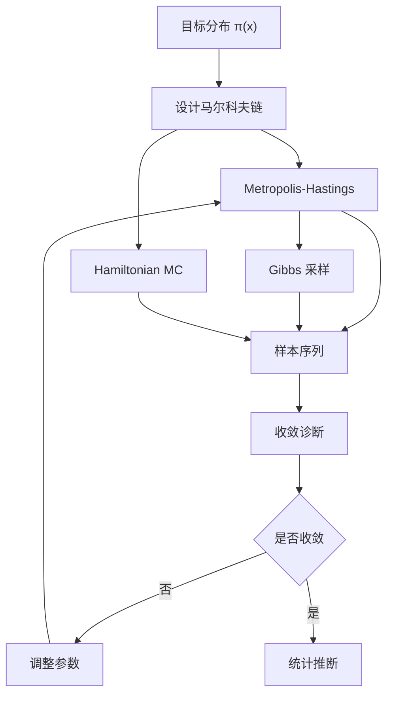

# 第13章：蒙特卡洛模拟与马尔科夫链

::: tip 学习目标
- 理解马尔科夫链蒙特卡洛(MCMC)方法
- 实现Metropolis-Hastings算法
- 进行金融模型的贝叶斯估计
- 应用MCMC进行风险分析
:::

## 知识点总结

### 1. MCMC基本原理

马尔科夫链蒙特卡洛(MCMC)是一类基于马尔科夫链的随机模拟方法，用于从复杂概率分布中采样。

**基本思想**：
构造一个马尔科夫链 $\{X_t\}$，使其平稳分布为目标分布 $\pi(x)$：
$$\lim_{t \to \infty} P(X_t \in A) = \int_A \pi(x)dx$$



### 2. Metropolis-Hastings算法

**算法步骤**：
1. 从提议分布 $q(x'|x)$ 产生候选值 $x'$
2. 计算接受概率：
   $$\alpha(x,x') = \min\left(1, \frac{\pi(x')q(x|x')}{\pi(x)q(x'|x)}\right)$$
3. 以概率 $\alpha$ 接受 $x'$，否则保持 $x$

### 3. 贝叶斯金融建模

**贝叶斯定理**：
$$p(\theta|y) = \frac{p(y|\theta)p(\theta)}{p(y)} \propto p(y|\theta)p(\theta)$$

**金融应用**：
- 参数不确定性量化
- 模型选择和平均
- 风险度量的置信区间

## 示例代码

### 示例1：Metropolis-Hastings算法

```python
import numpy as np
import matplotlib.pyplot as plt
from scipy import stats
import pandas as pd

class MetropolisHastings:
    """Metropolis-Hastings采样器"""

    def __init__(self, target_log_density, proposal_std=1.0):
        self.target_log_density = target_log_density
        self.proposal_std = proposal_std
        self.samples = []
        self.acceptance_rate = 0

    def sample(self, n_samples, initial_value=0.0):
        """执行MCMC采样"""
        current_x = initial_value
        current_log_density = self.target_log_density(current_x)

        accepted = 0
        samples = []

        for i in range(n_samples):
            # 提议新状态
            proposal_x = current_x + np.random.normal(0, self.proposal_std)
            proposal_log_density = self.target_log_density(proposal_x)

            # 计算接受概率（对数尺度）
            log_alpha = proposal_log_density - current_log_density
            alpha = min(1.0, np.exp(log_alpha))

            # 接受或拒绝
            if np.random.random() < alpha:
                current_x = proposal_x
                current_log_density = proposal_log_density
                accepted += 1

            samples.append(current_x)

        self.samples = np.array(samples)
        self.acceptance_rate = accepted / n_samples
        return self.samples

def normal_log_density(x, mu=0, sigma=1):
    """正态分布的对数密度"""
    return -0.5 * ((x - mu) / sigma)**2 - np.log(sigma * np.sqrt(2 * np.pi))

def mixture_log_density(x):
    """混合正态分布的对数密度"""
    # 两个正态分布的混合：0.3*N(-2,1) + 0.7*N(3,1.5)
    log_p1 = np.log(0.3) + normal_log_density(x, -2, 1)
    log_p2 = np.log(0.7) + normal_log_density(x, 3, 1.5)
    return np.logaddexp(log_p1, log_p2)

# 示例：采样混合正态分布
np.random.seed(42)
sampler = MetropolisHastings(mixture_log_density, proposal_std=2.0)
samples = sampler.sample(10000, initial_value=0.0)

print(f"MCMC采样结果:")
print(f"接受率: {sampler.acceptance_rate:.3f}")
print(f"样本均值: {np.mean(samples):.3f}")
print(f"样本标准差: {np.std(samples):.3f}")

# 理论值计算
theoretical_mean = 0.3 * (-2) + 0.7 * 3
theoretical_var = 0.3 * (1 + 4) + 0.7 * (1.5**2 + 9) - theoretical_mean**2
print(f"理论均值: {theoretical_mean:.3f}")
print(f"理论标准差: {np.sqrt(theoretical_var):.3f}")

# 可视化结果
fig, axes = plt.subplots(2, 2, figsize=(15, 10))

# 轨迹图
axes[0, 0].plot(samples[:1000])
axes[0, 0].set_title('MCMC轨迹（前1000个样本）')
axes[0, 0].set_xlabel('迭代次数')
axes[0, 0].set_ylabel('参数值')
axes[0, 0].grid(True, alpha=0.3)

# 样本分布与理论分布比较
x_range = np.linspace(-6, 8, 1000)
theoretical_density = np.exp([mixture_log_density(x) for x in x_range])

axes[0, 1].hist(samples[1000:], bins=50, density=True, alpha=0.7,
               color='skyblue', label='MCMC样本')
axes[0, 1].plot(x_range, theoretical_density, 'r-', linewidth=2,
               label='理论密度')
axes[0, 1].set_title('样本分布 vs 理论分布')
axes[0, 1].set_xlabel('x')
axes[0, 1].set_ylabel('密度')
axes[0, 1].legend()
axes[0, 1].grid(True, alpha=0.3)

# 自相关函数
def autocorrelation(x, max_lags=50):
    n = len(x)
    x = x - np.mean(x)
    autocorrs = np.correlate(x, x, mode='full')
    autocorrs = autocorrs[n-1:]
    autocorrs = autocorrs / autocorrs[0]
    return autocorrs[:max_lags+1]

autocorrs = autocorrelation(samples[1000:])
axes[1, 0].plot(autocorrs, 'b-o', markersize=3)
axes[1, 0].axhline(y=0, color='black', linestyle='-', alpha=0.5)
axes[1, 0].axhline(y=0.05, color='red', linestyle='--', alpha=0.7)
axes[1, 0].set_title('样本自相关函数')
axes[1, 0].set_xlabel('滞后期')
axes[1, 0].set_ylabel('自相关系数')
axes[1, 0].grid(True, alpha=0.3)

# 收敛诊断
def running_mean(x):
    return np.cumsum(x) / np.arange(1, len(x) + 1)

running_means = running_mean(samples[100:])
axes[1, 1].plot(running_means)
axes[1, 1].axhline(y=theoretical_mean, color='red', linestyle='--',
                  label=f'理论均值: {theoretical_mean:.3f}')
axes[1, 1].set_title('样本均值收敛性')
axes[1, 1].set_xlabel('样本数量')
axes[1, 1].set_ylabel('累积均值')
axes[1, 1].legend()
axes[1, 1].grid(True, alpha=0.3)

plt.tight_layout()
plt.show()
```

### 示例2：贝叶斯马尔科夫模型

```python
class BayesianMarkovModel:
    """贝叶斯马尔科夫模型"""

    def __init__(self, n_states):
        self.n_states = n_states
        self.posterior_samples = None

    def log_likelihood(self, transition_matrix, data):
        """计算对数似然"""
        log_lik = 0
        for t in range(len(data) - 1):
            current_state = data[t]
            next_state = data[t + 1]
            prob = transition_matrix[current_state, next_state]
            if prob > 0:
                log_lik += np.log(prob)
            else:
                return -np.inf
        return log_lik

    def log_prior(self, transition_matrix, alpha=1.0):
        """Dirichlet先验的对数密度"""
        log_prior = 0
        for i in range(self.n_states):
            for j in range(self.n_states):
                if transition_matrix[i, j] > 0:
                    log_prior += (alpha - 1) * np.log(transition_matrix[i, j])
                else:
                    return -np.inf
        return log_prior

    def log_posterior(self, transition_matrix, data, alpha=1.0):
        """对数后验密度"""
        log_lik = self.log_likelihood(transition_matrix, data)
        log_prior = self.log_prior(transition_matrix, alpha)
        return log_lik + log_prior

    def propose_transition_matrix(self, current_matrix, proposal_scale=0.1):
        """提议新的转移矩阵"""
        # 在对数空间中提议，然后归一化
        log_matrix = np.log(current_matrix + 1e-10)
        log_proposal = log_matrix + np.random.normal(0, proposal_scale,
                                                   (self.n_states, self.n_states))

        # 转换回概率空间并归一化
        proposal_matrix = np.exp(log_proposal)
        for i in range(self.n_states):
            proposal_matrix[i] = proposal_matrix[i] / np.sum(proposal_matrix[i])

        return proposal_matrix

    def mcmc_sample(self, data, n_samples=5000, burn_in=1000, alpha=1.0):
        """MCMC采样后验分布"""
        # 初始化
        current_matrix = np.random.dirichlet([alpha] * self.n_states, self.n_states)
        current_log_posterior = self.log_posterior(current_matrix, data, alpha)

        samples = []
        accepted = 0

        for i in range(n_samples + burn_in):
            # 提议新矩阵
            proposal_matrix = self.propose_transition_matrix(current_matrix)
            proposal_log_posterior = self.log_posterior(proposal_matrix, data, alpha)

            # Metropolis-Hastings步骤
            log_alpha = proposal_log_posterior - current_log_posterior
            if np.log(np.random.random()) < log_alpha:
                current_matrix = proposal_matrix
                current_log_posterior = proposal_log_posterior
                accepted += 1

            # 保存样本（burn-in后）
            if i >= burn_in:
                samples.append(current_matrix.copy())

        self.posterior_samples = np.array(samples)
        acceptance_rate = accepted / (n_samples + burn_in)

        return self.posterior_samples, acceptance_rate

    def posterior_summary(self):
        """后验分布总结统计"""
        if self.posterior_samples is None:
            raise ValueError("需要先运行MCMC采样")

        summary = {}
        for i in range(self.n_states):
            for j in range(self.n_states):
                param_name = f'P_{i}{j}'
                samples = self.posterior_samples[:, i, j]
                summary[param_name] = {
                    'mean': np.mean(samples),
                    'std': np.std(samples),
                    'q025': np.percentile(samples, 2.5),
                    'q975': np.percentile(samples, 97.5)
                }

        return summary

# 贝叶斯分析示例
# 生成测试数据
np.random.seed(42)
true_P = np.array([[0.7, 0.3], [0.4, 0.6]])
n_obs = 200

# 模拟马尔科夫链
data = [0]  # 初始状态
for _ in range(n_obs - 1):
    current_state = data[-1]
    next_state = np.random.choice(2, p=true_P[current_state])
    data.append(next_state)

data = np.array(data)

print(f"贝叶斯马尔科夫模型分析:")
print(f"真实转移矩阵:\n{true_P}")
print(f"数据长度: {len(data)}")

# 创建贝叶斯模型
bayes_model = BayesianMarkovModel(n_states=2)

# MCMC采样
posterior_samples, acceptance_rate = bayes_model.mcmc_sample(
    data, n_samples=3000, burn_in=1000, alpha=1.0
)

print(f"\nMCMC采样结果:")
print(f"接受率: {acceptance_rate:.3f}")

# 后验总结
posterior_summary = bayes_model.posterior_summary()
print(f"\n后验分布总结:")
for param, stats in posterior_summary.items():
    i, j = int(param[2]), int(param[3])
    true_value = true_P[i, j]
    print(f"{param}: 均值={stats['mean']:.3f}, "
          f"95%CI=[{stats['q025']:.3f}, {stats['q975']:.3f}], "
          f"真实值={true_value:.3f}")

# 可视化后验分布
fig, axes = plt.subplots(2, 2, figsize=(15, 10))

# 各参数的后验分布
for idx, (param, stats) in enumerate(posterior_summary.items()):
    i, j = int(param[2]), int(param[3])
    samples = posterior_samples[:, i, j]

    ax = axes[i, j]
    ax.hist(samples, bins=50, density=True, alpha=0.7, color='lightblue')
    ax.axvline(stats['mean'], color='red', linestyle='-',
              label=f'后验均值: {stats["mean"]:.3f}')
    ax.axvline(true_P[i, j], color='green', linestyle='--',
              label=f'真实值: {true_P[i, j]:.3f}')
    ax.set_title(f'{param}的后验分布')
    ax.set_xlabel('参数值')
    ax.set_ylabel('密度')
    ax.legend()
    ax.grid(True, alpha=0.3)

plt.tight_layout()
plt.show()

# 预测性检验
def posterior_predictive_check(posterior_samples, observed_data, n_replications=1000):
    """后验预测检验"""
    n_samples = len(posterior_samples)
    n_obs = len(observed_data)

    # 统计量：状态0的比例
    observed_stat = np.mean(observed_data == 0)

    replicated_stats = []

    for _ in range(n_replications):
        # 随机选择一个后验样本
        sample_idx = np.random.randint(n_samples)
        transition_matrix = posterior_samples[sample_idx]

        # 模拟数据
        sim_data = [0]  # 相同的初始状态
        for t in range(n_obs - 1):
            current_state = sim_data[-1]
            next_state = np.random.choice(2, p=transition_matrix[current_state])
            sim_data.append(next_state)

        # 计算统计量
        sim_stat = np.mean(np.array(sim_data) == 0)
        replicated_stats.append(sim_stat)

    return observed_stat, np.array(replicated_stats)

observed_stat, replicated_stats = posterior_predictive_check(
    posterior_samples, data, n_replications=1000
)

print(f"\n后验预测检验:")
print(f"观测统计量（状态0比例）: {observed_stat:.3f}")
print(f"复制统计量均值: {np.mean(replicated_stats):.3f}")
print(f"p值（双侧）: {2 * min(np.mean(replicated_stats >= observed_stat),
                       np.mean(replicated_stats <= observed_stat)):.3f}")

# 可视化后验预测检验
plt.figure(figsize=(10, 6))
plt.hist(replicated_stats, bins=50, density=True, alpha=0.7,
         color='lightcoral', label='后验预测分布')
plt.axvline(observed_stat, color='blue', linestyle='-', linewidth=2,
           label=f'观测值: {observed_stat:.3f}')
plt.axvline(np.mean(replicated_stats), color='red', linestyle='--',
           label=f'预测均值: {np.mean(replicated_stats):.3f}')
plt.title('后验预测检验：状态0的比例')
plt.xlabel('状态0比例')
plt.ylabel('密度')
plt.legend()
plt.grid(True, alpha=0.3)
plt.show()
```

### 示例3：金融风险的MCMC分析

```python
class BayesianRiskModel:
    """贝叶斯风险模型"""

    def __init__(self):
        self.samples = None

    def simulate_portfolio_returns(self, transition_matrix, state_params, n_periods=252):
        """模拟投资组合收益率"""
        returns = []
        current_state = 0  # 初始状态

        for _ in range(n_periods):
            # 当前状态的收益率参数
            mu, sigma = state_params[current_state]

            # 生成收益率
            period_return = np.random.normal(mu, sigma)
            returns.append(period_return)

            # 转移到下一状态
            next_state = np.random.choice(len(state_params),
                                        p=transition_matrix[current_state])
            current_state = next_state

        return np.array(returns)

    def bayesian_var_estimation(self, posterior_samples, state_params,
                               confidence_level=0.05, n_simulations=1000):
        """贝叶斯VaR估计"""
        var_samples = []

        for transition_matrix in posterior_samples:
            # 对每个后验样本进行多次模拟
            portfolio_returns = []
            for _ in range(n_simulations):
                returns = self.simulate_portfolio_returns(
                    transition_matrix, state_params, n_periods=252
                )
                portfolio_returns.extend(returns)

            # 计算VaR
            var = np.percentile(portfolio_returns, confidence_level * 100)
            var_samples.append(var)

        return np.array(var_samples)

# 金融风险的贝叶斯分析
risk_model = BayesianRiskModel()

# 定义状态参数（均值、标准差）
state_params = [
    (-0.01, 0.02),  # 状态0：熊市
    (0.005, 0.015)  # 状态1：牛市
]

print(f"\n贝叶斯风险分析:")
print(f"状态参数: {state_params}")

# 使用之前的后验样本进行VaR估计
var_samples = risk_model.bayesian_var_estimation(
    posterior_samples[:500],  # 使用子集以加快计算
    state_params,
    confidence_level=0.05,
    n_simulations=100
)

print(f"\nVaR分析结果:")
print(f"5% VaR均值: {np.mean(var_samples):.4f}")
print(f"5% VaR标准差: {np.std(var_samples):.4f}")
print(f"VaR 95%置信区间: [{np.percentile(var_samples, 2.5):.4f}, "
      f"{np.percentile(var_samples, 97.5):.4f}]")

# 可视化VaR不确定性
plt.figure(figsize=(12, 8))

plt.subplot(2, 2, 1)
plt.hist(var_samples, bins=30, density=True, alpha=0.7, color='lightgreen')
plt.axvline(np.mean(var_samples), color='red', linestyle='-',
           label=f'均值: {np.mean(var_samples):.4f}')
plt.title('5% VaR的后验分布')
plt.xlabel('VaR')
plt.ylabel('密度')
plt.legend()
plt.grid(True, alpha=0.3)

# VaR轨迹
plt.subplot(2, 2, 2)
plt.plot(var_samples[:100])
plt.title('VaR后验样本轨迹')
plt.xlabel('样本序号')
plt.ylabel('VaR')
plt.grid(True, alpha=0.3)

# 不同置信水平的VaR
confidence_levels = [0.01, 0.05, 0.1]
var_distributions = {}

for cl in confidence_levels:
    var_dist = risk_model.bayesian_var_estimation(
        posterior_samples[:100], state_params,
        confidence_level=cl, n_simulations=50
    )
    var_distributions[cl] = var_dist

plt.subplot(2, 2, 3)
for cl, var_dist in var_distributions.items():
    plt.hist(var_dist, bins=20, alpha=0.6, density=True,
             label=f'{cl*100}% VaR')

plt.title('不同置信水平的VaR分布')
plt.xlabel('VaR')
plt.ylabel('密度')
plt.legend()
plt.grid(True, alpha=0.3)

# VaR收敛性
plt.subplot(2, 2, 4)
cumulative_means = np.cumsum(var_samples) / np.arange(1, len(var_samples) + 1)
plt.plot(cumulative_means)
plt.axhline(y=np.mean(var_samples), color='red', linestyle='--',
           label=f'最终均值: {np.mean(var_samples):.4f}')
plt.title('VaR估计收敛性')
plt.xlabel('样本数量')
plt.ylabel('累积均值')
plt.legend()
plt.grid(True, alpha=0.3)

plt.tight_layout()
plt.show()

print(f"\nMCMC金融建模总结:")
print(f"1. 贝叶斯方法能够量化参数不确定性")
print(f"2. 后验分布提供了完整的推断信息")
print(f"3. 风险度量的置信区间更加可靠")
print(f"4. 模型选择可以通过贝叶斯因子进行")
```

## 理论分析

### MCMC收敛理论

**遍历性定理**：
如果马尔科夫链是非周期的、不可约的且平稳分布存在，则：
$$\lim_{t \to \infty} \|P^t(x, \cdot) - \pi(\cdot)\|_{TV} = 0$$

**中心极限定理**：
$$\sqrt{n}(\bar{f}_n - E_\pi[f]) \xrightarrow{d} N(0, \sigma_f^2)$$

### 贝叶斯计算

**边际似然**：
$$p(y) = \int p(y|\theta)p(\theta)d\theta$$

**后验预测分布**：
$$p(y^* | y) = \int p(y^* | \theta)p(\theta | y)d\theta$$

## 数学公式总结

1. **Metropolis-Hastings接受概率**：$\alpha = \min\left(1, \frac{\pi(x')q(x|x')}{\pi(x)q(x'|x)}\right)$

2. **Gibbs采样条件分布**：$p(x_i | x_{-i}) \propto p(x)$

3. **有效样本量**：$ESS = \frac{n}{1 + 2\sum_{k=1}^{\infty}\rho_k}$

4. **贝叶斯信息准则**：$BIC = -2\log p(y|\hat{\theta}) + k\log n$

::: warning MCMC应用注意事项
- 收敛诊断是MCMC的关键步骤
- 需要足够的burn-in期去除初值影响
- 自相关会降低有效样本量
- 多链运行有助于诊断收敛性
- 计算复杂度较高，需要权衡精度与效率
:::