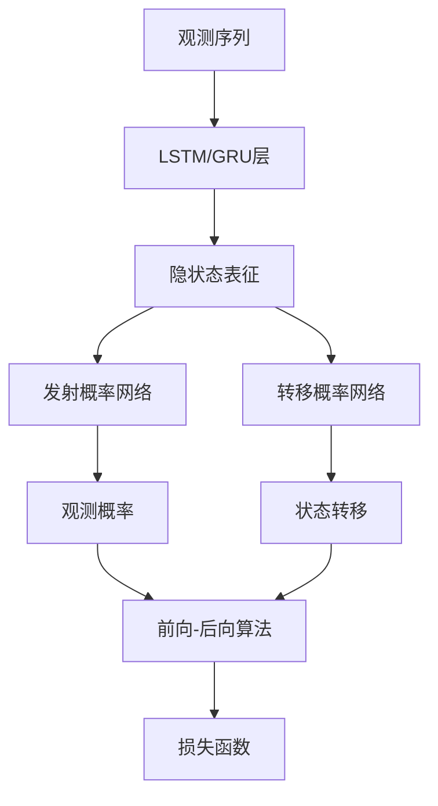

# 第14章：机器学习与马尔科夫模型融合

::: tip 学习目标
- 结合深度学习和马尔科夫模型
- 实现神经网络隐马尔科夫模型
- 应用强化学习中的马尔科夫决策过程
- 构建智能投资组合管理系统
:::

## 知识点总结

### 1. 神经网络马尔科夫模型

将神经网络与马尔科夫模型结合，利用深度学习的表征能力和马尔科夫模型的序列建模优势。

**神经HMM架构**：


### 2. 马尔科夫决策过程(MDP)

在强化学习中，MDP为智能体提供了决策框架：
- **状态空间** $S$：所有可能的市场状态
- **行动空间** $A$：所有可能的交易行为
- **转移概率** $P(s'|s,a)$：状态转移函数
- **奖励函数** $R(s,a)$：即时奖励

### 3. 深度Q网络(DQN)

**Bellman方程**：
$$Q(s,a) = R(s,a) + \gamma \max_{a'} Q(s',a')$$

**神经网络近似**：
$$Q(s,a;\theta) \approx Q^*(s,a)$$

## 示例代码

### 示例1：神经网络隐马尔科夫模型

```python
import torch
import torch.nn as nn
import torch.optim as optim
import numpy as np
import matplotlib.pyplot as plt

class NeuralHMM(nn.Module):
    """神经网络隐马尔科夫模型"""

    def __init__(self, input_dim, hidden_dim, n_states, sequence_length):
        super(NeuralHMM, self).__init__()
        self.input_dim = input_dim
        self.hidden_dim = hidden_dim
        self.n_states = n_states
        self.sequence_length = sequence_length

        # LSTM编码器
        self.lstm = nn.LSTM(input_dim, hidden_dim, batch_first=True)

        # 发射概率网络
        self.emission_net = nn.Sequential(
            nn.Linear(hidden_dim, hidden_dim),
            nn.ReLU(),
            nn.Linear(hidden_dim, input_dim),
            nn.Softmax(dim=-1)
        )

        # 转移概率网络
        self.transition_net = nn.Sequential(
            nn.Linear(hidden_dim, hidden_dim),
            nn.ReLU(),
            nn.Linear(hidden_dim, n_states * n_states),
            nn.Softmax(dim=-1)
        )

        # 初始状态分布
        self.initial_dist = nn.Parameter(torch.ones(n_states) / n_states)

    def forward(self, observations):
        """前向传播"""
        batch_size, seq_len, _ = observations.shape

        # LSTM编码
        lstm_out, _ = self.lstm(observations)

        # 计算发射概率
        emission_probs = self.emission_net(lstm_out)

        # 计算转移概率
        transition_logits = self.transition_net(lstm_out[:, :-1])
        transition_probs = transition_logits.view(
            batch_size, seq_len-1, self.n_states, self.n_states
        )

        return emission_probs, transition_probs

    def viterbi_decode(self, observations):
        """Viterbi解码最可能的状态序列"""
        with torch.no_grad():
            emission_probs, transition_probs = self.forward(observations)
            batch_size, seq_len, _ = observations.shape

            # Viterbi算法
            log_probs = torch.log(emission_probs + 1e-8)
            log_transitions = torch.log(transition_probs + 1e-8)

            # 初始化
            viterbi_scores = torch.log(self.initial_dist.unsqueeze(0)) + log_probs[:, 0]
            viterbi_path = []

            # 前向过程
            for t in range(1, seq_len):
                scores = viterbi_scores.unsqueeze(-1) + log_transitions[:, t-1]
                best_prev_states = torch.argmax(scores, dim=1)
                viterbi_scores = torch.gather(scores, 1, best_prev_states.unsqueeze(1)).squeeze(1) + log_probs[:, t]
                viterbi_path.append(best_prev_states)

            # 回溯
            best_last_states = torch.argmax(viterbi_scores, dim=1)
            states = [best_last_states]

            for t in range(len(viterbi_path) - 1, -1, -1):
                best_last_states = torch.gather(viterbi_path[t], 1, best_last_states.unsqueeze(1)).squeeze(1)
                states.append(best_last_states)

            return torch.stack(states[::-1], dim=1)

def create_synthetic_data(n_samples=1000, seq_length=50, n_features=3):
    """创建合成时间序列数据"""
    # 真实的HMM参数
    true_states = 3
    true_transitions = torch.tensor([
        [0.7, 0.2, 0.1],
        [0.3, 0.5, 0.2],
        [0.2, 0.3, 0.5]
    ])

    data = []
    state_sequences = []

    for _ in range(n_samples):
        # 模拟状态序列
        states = [0]  # 初始状态
        for t in range(seq_length - 1):
            current_state = states[-1]
            next_state = torch.multinomial(true_transitions[current_state], 1).item()
            states.append(next_state)

        states = torch.tensor(states)
        state_sequences.append(states)

        # 根据状态生成观测
        observations = torch.zeros(seq_length, n_features)
        for t in range(seq_length):
            if states[t] == 0:
                observations[t] = torch.normal(torch.tensor([0.0, 0.0, 0.0]), 0.5)
            elif states[t] == 1:
                observations[t] = torch.normal(torch.tensor([2.0, -1.0, 1.0]), 0.5)
            else:
                observations[t] = torch.normal(torch.tensor([-1.0, 2.0, -0.5]), 0.5)

        data.append(observations)

    return torch.stack(data), torch.stack(state_sequences)

# 生成训练数据
torch.manual_seed(42)
train_data, true_states = create_synthetic_data(n_samples=500, seq_length=30, n_features=3)

print(f"神经网络HMM训练:")
print(f"训练数据形状: {train_data.shape}")
print(f"真实状态形状: {true_states.shape}")

# 创建模型
model = NeuralHMM(input_dim=3, hidden_dim=32, n_states=3, sequence_length=30)
optimizer = optim.Adam(model.parameters(), lr=0.001)

# 训练循环
def train_neural_hmm(model, data, n_epochs=100):
    losses = []

    for epoch in range(n_epochs):
        optimizer.zero_grad()

        # 前向传播
        emission_probs, transition_probs = model(data)

        # 计算负对数似然损失（简化版）
        batch_size, seq_len, n_features = data.shape

        # 发射损失
        emission_loss = -torch.sum(torch.log(torch.sum(emission_probs * data.unsqueeze(-2), dim=-1) + 1e-8))

        # 转移损失（鼓励平滑的转移）
        transition_loss = -torch.sum(torch.log(torch.diagonal(transition_probs, dim1=-2, dim2=-1) + 1e-8))

        total_loss = emission_loss + 0.1 * transition_loss
        total_loss.backward()
        optimizer.step()

        losses.append(total_loss.item())

        if epoch % 20 == 0:
            print(f'Epoch {epoch}, Loss: {total_loss.item():.4f}')

    return losses

# 训练模型
losses = train_neural_hmm(model, train_data, n_epochs=100)

# 预测状态序列
model.eval()
with torch.no_grad():
    predicted_states = model.viterbi_decode(train_data[:10])

print(f"\n预测结果示例 (前5个序列的前10步):")
for i in range(5):
    print(f"序列 {i}:")
    print(f"  真实状态: {true_states[i, :10].tolist()}")
    print(f"  预测状态: {predicted_states[i, :10].tolist()}")
    accuracy = (true_states[i] == predicted_states[i]).float().mean()
    print(f"  准确率: {accuracy:.3f}")
```

### 示例2：马尔科夫决策过程与强化学习

```python
class MarkovDecisionProcess:
    """马尔科夫决策过程环境"""

    def __init__(self, n_states=10, n_actions=3):
        self.n_states = n_states
        self.n_actions = n_actions
        self.current_state = 0

        # 随机生成转移概率矩阵
        self.transition_probs = np.random.dirichlet(
            np.ones(n_states), size=(n_states, n_actions)
        )

        # 奖励函数
        self.rewards = np.random.normal(0, 1, (n_states, n_actions))

        # 目标状态（高奖励）
        self.terminal_states = [n_states - 1]
        self.rewards[self.terminal_states, :] = 10.0

    def reset(self):
        """重置环境"""
        self.current_state = np.random.randint(0, self.n_states // 2)
        return self.current_state

    def step(self, action):
        """执行动作"""
        # 获得奖励
        reward = self.rewards[self.current_state, action]

        # 状态转移
        next_state = np.random.choice(
            self.n_states,
            p=self.transition_probs[self.current_state, action]
        )

        # 检查是否终止
        done = next_state in self.terminal_states
        self.current_state = next_state

        return next_state, reward, done

class DQNAgent:
    """深度Q网络智能体"""

    def __init__(self, state_dim, action_dim, lr=0.001):
        self.state_dim = state_dim
        self.action_dim = action_dim
        self.epsilon = 1.0
        self.epsilon_decay = 0.995
        self.epsilon_min = 0.01
        self.gamma = 0.95

        # Q网络
        self.q_network = nn.Sequential(
            nn.Linear(state_dim, 64),
            nn.ReLU(),
            nn.Linear(64, 64),
            nn.ReLU(),
            nn.Linear(64, action_dim)
        )

        self.optimizer = optim.Adam(self.q_network.parameters(), lr=lr)
        self.memory = []
        self.memory_size = 10000

    def get_action(self, state):
        """选择动作（ε-贪婪策略）"""
        if np.random.random() < self.epsilon:
            return np.random.randint(self.action_dim)

        state_tensor = torch.FloatTensor(state).unsqueeze(0)
        q_values = self.q_network(state_tensor)
        return q_values.argmax().item()

    def remember(self, state, action, reward, next_state, done):
        """存储经验"""
        if len(self.memory) >= self.memory_size:
            self.memory.pop(0)
        self.memory.append((state, action, reward, next_state, done))

    def replay(self, batch_size=32):
        """经验回放训练"""
        if len(self.memory) < batch_size:
            return

        batch = np.random.choice(len(self.memory), batch_size, replace=False)
        states = torch.FloatTensor([self.memory[i][0] for i in batch])
        actions = torch.LongTensor([self.memory[i][1] for i in batch])
        rewards = torch.FloatTensor([self.memory[i][2] for i in batch])
        next_states = torch.FloatTensor([self.memory[i][3] for i in batch])
        dones = torch.BoolTensor([self.memory[i][4] for i in batch])

        current_q_values = self.q_network(states).gather(1, actions.unsqueeze(1))
        next_q_values = self.q_network(next_states).max(1)[0].detach()
        target_q_values = rewards + (self.gamma * next_q_values * ~dones)

        loss = nn.MSELoss()(current_q_values.squeeze(), target_q_values)

        self.optimizer.zero_grad()
        loss.backward()
        self.optimizer.step()

        if self.epsilon > self.epsilon_min:
            self.epsilon *= self.epsilon_decay

def state_to_vector(state, n_states):
    """将状态转换为one-hot向量"""
    vector = np.zeros(n_states)
    vector[state] = 1.0
    return vector

# 创建环境和智能体
env = MarkovDecisionProcess(n_states=10, n_actions=3)
agent = DQNAgent(state_dim=10, action_dim=3)

print(f"强化学习MDP训练:")
print(f"状态空间大小: {env.n_states}")
print(f"动作空间大小: {env.n_actions}")

# 训练智能体
episodes = 1000
scores = []

for episode in range(episodes):
    state = env.reset()
    state_vector = state_to_vector(state, env.n_states)
    total_reward = 0
    steps = 0
    max_steps = 100

    while steps < max_steps:
        action = agent.get_action(state_vector)
        next_state, reward, done = env.step(action)
        next_state_vector = state_to_vector(next_state, env.n_states)

        agent.remember(state_vector, action, reward, next_state_vector, done)
        agent.replay()

        state_vector = next_state_vector
        total_reward += reward
        steps += 1

        if done:
            break

    scores.append(total_reward)

    if episode % 100 == 0:
        avg_score = np.mean(scores[-100:])
        print(f'Episode {episode}, Average Score: {avg_score:.2f}, Epsilon: {agent.epsilon:.3f}')

# 可视化训练结果
plt.figure(figsize=(15, 10))

# 学习曲线
plt.subplot(2, 2, 1)
window = 50
moving_avg = [np.mean(scores[max(0, i-window):i+1]) for i in range(len(scores))]
plt.plot(scores, alpha=0.3, label='Episode Score')
plt.plot(moving_avg, label=f'Moving Average ({window})')
plt.title('强化学习训练曲线')
plt.xlabel('Episode')
plt.ylabel('Total Reward')
plt.legend()
plt.grid(True, alpha=0.3)

# Q值可视化
plt.subplot(2, 2, 2)
with torch.no_grad():
    q_values = []
    for state in range(env.n_states):
        state_vector = state_to_vector(state, env.n_states)
        q_vals = agent.q_network(torch.FloatTensor(state_vector)).numpy()
        q_values.append(q_vals)

q_values = np.array(q_values)
im = plt.imshow(q_values.T, cmap='viridis', aspect='auto')
plt.colorbar(im)
plt.title('学习到的Q值')
plt.xlabel('状态')
plt.ylabel('动作')

# 策略可视化
plt.subplot(2, 2, 3)
policy = np.argmax(q_values, axis=1)
plt.bar(range(env.n_states), policy, alpha=0.7)
plt.title('学习到的策略')
plt.xlabel('状态')
plt.ylabel('最优动作')
plt.grid(True, alpha=0.3, axis='y')

# Epsilon衰减
plt.subplot(2, 2, 4)
epsilons = [1.0 * (0.995 ** i) for i in range(episodes)]
plt.plot(epsilons)
plt.title('探索率(Epsilon)衰减')
plt.xlabel('Episode')
plt.ylabel('Epsilon')
plt.grid(True, alpha=0.3)

plt.tight_layout()
plt.show()

print(f"\n训练完成!")
print(f"最终平均奖励: {np.mean(scores[-100:]):.2f}")
print(f"学习到的策略: {policy}")
```

### 示例3：智能投资组合管理

```python
class PortfolioMDP:
    """投资组合管理MDP环境"""

    def __init__(self, n_assets=3, initial_capital=10000):
        self.n_assets = n_assets
        self.initial_capital = initial_capital
        self.current_capital = initial_capital
        self.current_weights = np.ones(n_assets) / n_assets
        self.price_history = []

        # 资产收益率的马尔科夫状态
        self.market_states = 3  # 牛市、震荡、熊市
        self.current_market_state = 1

        # 状态转移矩阵
        self.state_transitions = np.array([
            [0.6, 0.3, 0.1],  # 牛市
            [0.3, 0.4, 0.3],  # 震荡
            [0.1, 0.4, 0.5]   # 熊市
        ])

        # 各状态下的资产收益率参数
        self.asset_returns = {
            0: np.array([0.015, 0.012, 0.008]),  # 牛市收益率
            1: np.array([0.005, 0.003, 0.002]),  # 震荡市收益率
            2: np.array([-0.005, -0.002, 0.001])  # 熊市收益率
        }

        self.asset_volatilities = {
            0: np.array([0.15, 0.12, 0.08]),
            1: np.array([0.20, 0.15, 0.10]),
            2: np.array([0.25, 0.20, 0.12])
        }

    def reset(self):
        """重置环境"""
        self.current_capital = self.initial_capital
        self.current_weights = np.ones(self.n_assets) / self.n_assets
        self.current_market_state = 1
        self.price_history = []
        return self._get_state()

    def _get_state(self):
        """获取当前状态表示"""
        # 状态包括：当前权重、市场状态、历史收益率
        market_state_vector = np.zeros(self.market_states)
        market_state_vector[self.current_market_state] = 1.0

        if len(self.price_history) >= 5:
            recent_returns = np.array(self.price_history[-5:]).flatten()
        else:
            recent_returns = np.zeros(5 * self.n_assets)

        state = np.concatenate([
            self.current_weights,
            market_state_vector,
            recent_returns[:15]  # 限制状态维度
        ])

        return state

    def step(self, action):
        """执行投资组合调整动作"""
        # 动作解释：权重调整向量
        action = np.clip(action, -0.1, 0.1)  # 限制调整幅度
        new_weights = self.current_weights + action
        new_weights = np.clip(new_weights, 0.0, 1.0)
        new_weights = new_weights / np.sum(new_weights)  # 归一化

        # 计算交易成本
        transaction_cost = 0.001 * np.sum(np.abs(new_weights - self.current_weights))

        # 市场状态转移
        self.current_market_state = np.random.choice(
            self.market_states,
            p=self.state_transitions[self.current_market_state]
        )

        # 生成资产收益率
        mean_returns = self.asset_returns[self.current_market_state]
        volatilities = self.asset_volatilities[self.current_market_state]
        asset_returns = np.random.normal(mean_returns, volatilities)

        # 计算投资组合收益
        portfolio_return = np.sum(new_weights * asset_returns) - transaction_cost

        # 更新资本和权重
        self.current_capital *= (1 + portfolio_return)
        self.current_weights = new_weights
        self.price_history.append(asset_returns)

        # 计算奖励（基于夏普比率和绝对收益）
        if len(self.price_history) >= 20:
            recent_returns = [np.sum(self.current_weights * ret) for ret in self.price_history[-20:]]
            sharpe_ratio = np.mean(recent_returns) / (np.std(recent_returns) + 1e-6)
            reward = portfolio_return + 0.1 * sharpe_ratio
        else:
            reward = portfolio_return

        return self._get_state(), reward, False  # 不设置终止条件

class PortfolioAgent:
    """投资组合管理智能体"""

    def __init__(self, state_dim, action_dim):
        self.state_dim = state_dim
        self.action_dim = action_dim

        # Actor网络（策略网络）
        self.actor = nn.Sequential(
            nn.Linear(state_dim, 128),
            nn.ReLU(),
            nn.Linear(128, 64),
            nn.ReLU(),
            nn.Linear(64, action_dim),
            nn.Tanh()  # 输出范围[-1, 1]
        )

        # Critic网络（价值网络）
        self.critic = nn.Sequential(
            nn.Linear(state_dim + action_dim, 128),
            nn.ReLU(),
            nn.Linear(128, 64),
            nn.ReLU(),
            nn.Linear(64, 1)
        )

        self.actor_optimizer = optim.Adam(self.actor.parameters(), lr=0.001)
        self.critic_optimizer = optim.Adam(self.critic.parameters(), lr=0.002)

        self.noise_std = 0.1
        self.gamma = 0.99

    def get_action(self, state, add_noise=True):
        """获取动作"""
        with torch.no_grad():
            state_tensor = torch.FloatTensor(state).unsqueeze(0)
            action = self.actor(state_tensor).squeeze().numpy()

            if add_noise:
                noise = np.random.normal(0, self.noise_std, size=action.shape)
                action = action + noise

            return np.clip(action, -1, 1) * 0.1  # 缩放到[-0.1, 0.1]

    def train(self, experiences):
        """训练智能体"""
        states, actions, rewards, next_states = experiences

        states = torch.FloatTensor(states)
        actions = torch.FloatTensor(actions)
        rewards = torch.FloatTensor(rewards)
        next_states = torch.FloatTensor(next_states)

        # 训练Critic
        with torch.no_grad():
            next_actions = self.actor(next_states)
            target_q = rewards + self.gamma * self.critic(
                torch.cat([next_states, next_actions], dim=1)
            ).squeeze()

        current_q = self.critic(torch.cat([states, actions], dim=1)).squeeze()
        critic_loss = nn.MSELoss()(current_q, target_q)

        self.critic_optimizer.zero_grad()
        critic_loss.backward()
        self.critic_optimizer.step()

        # 训练Actor
        predicted_actions = self.actor(states)
        actor_loss = -self.critic(torch.cat([states, predicted_actions], dim=1)).mean()

        self.actor_optimizer.zero_grad()
        actor_loss.backward()
        self.actor_optimizer.step()

        return critic_loss.item(), actor_loss.item()

# 创建投资组合环境和智能体
env = PortfolioMDP(n_assets=3, initial_capital=10000)
state_dim = len(env._get_state())
agent = PortfolioAgent(state_dim=state_dim, action_dim=3)

print(f"智能投资组合管理:")
print(f"状态维度: {state_dim}")
print(f"动作维度: 3 (对应3个资产的权重调整)")

# 训练循环
episodes = 500
episode_rewards = []
portfolio_values = []
memory = []

for episode in range(episodes):
    state = env.reset()
    episode_reward = 0
    episode_portfolio_values = [env.current_capital]

    for step in range(100):  # 每个episode 100步
        action = agent.get_action(state)
        next_state, reward, done = env.step(action)

        memory.append((state, action, reward, next_state))
        if len(memory) > 10000:
            memory.pop(0)

        state = next_state
        episode_reward += reward
        episode_portfolio_values.append(env.current_capital)

        # 训练智能体
        if len(memory) >= 32:
            batch_indices = np.random.choice(len(memory), 32, replace=False)
            batch = [memory[i] for i in batch_indices]

            states = np.array([exp[0] for exp in batch])
            actions = np.array([exp[1] for exp in batch])
            rewards = np.array([exp[2] for exp in batch])
            next_states = np.array([exp[3] for exp in batch])

            agent.train((states, actions, rewards, next_states))

    episode_rewards.append(episode_reward)
    portfolio_values.append(episode_portfolio_values)

    if episode % 50 == 0:
        avg_reward = np.mean(episode_rewards[-50:])
        final_capital = env.current_capital
        print(f'Episode {episode}, Avg Reward: {avg_reward:.4f}, Final Capital: {final_capital:.2f}')

# 可视化结果
plt.figure(figsize=(15, 10))

# 训练奖励
plt.subplot(2, 2, 1)
window = 20
moving_avg_rewards = [np.mean(episode_rewards[max(0, i-window):i+1]) for i in range(len(episode_rewards))]
plt.plot(episode_rewards, alpha=0.3, label='Episode Reward')
plt.plot(moving_avg_rewards, label=f'Moving Average ({window})')
plt.title('训练奖励曲线')
plt.xlabel('Episode')
plt.ylabel('Episode Reward')
plt.legend()
plt.grid(True, alpha=0.3)

# 最后几个episode的投资组合价值
plt.subplot(2, 2, 2)
for i in range(-5, 0):
    plt.plot(portfolio_values[i], alpha=0.7, label=f'Episode {len(portfolio_values) + i}')
plt.title('最近5个Episode的投资组合价值')
plt.xlabel('Step')
plt.ylabel('Portfolio Value')
plt.legend()
plt.grid(True, alpha=0.3)

# 最终权重分布
plt.subplot(2, 2, 3)
final_weights = env.current_weights
plt.pie(final_weights, labels=[f'Asset {i+1}' for i in range(len(final_weights))],
        autopct='%1.1f%%', startangle=90)
plt.title('最终投资组合权重分布')

# 累积收益对比
plt.subplot(2, 2, 4)
# 等权重基准
equal_weight_returns = []
current_capital_eq = 10000

env_test = PortfolioMDP(n_assets=3, initial_capital=10000)
state = env_test.reset()

for _ in range(100):
    action = np.array([0.0, 0.0, 0.0])  # 无调整，保持等权重
    next_state, reward, done = env_test.step(action)
    equal_weight_returns.append(env_test.current_capital)
    state = next_state

# 智能体策略
agent_returns = portfolio_values[-1]

plt.plot(equal_weight_returns, label='等权重基准', linewidth=2)
plt.plot(agent_returns, label='智能体策略', linewidth=2)
plt.title('策略收益对比')
plt.xlabel('Step')
plt.ylabel('Portfolio Value')
plt.legend()
plt.grid(True, alpha=0.3)

plt.tight_layout()
plt.show()

print(f"\n投资组合管理结果:")
print(f"最终投资组合价值: {env.current_capital:.2f}")
print(f"总收益率: {(env.current_capital/env.initial_capital - 1)*100:.2f}%")
print(f"最终权重分配: {env.current_weights}")
```

## 数学公式总结

1. **神经网络HMM**：
   - 发射概率：$p(o_t|s_t) = \text{NN}_e(h_t)$
   - 转移概率：$p(s_{t+1}|s_t) = \text{NN}_t(h_t)$

2. **强化学习**：
   - Q函数：$Q(s,a) = \mathbb{E}[R_t + \gamma \max_{a'} Q(s',a') | s_t=s, a_t=a]$
   - 策略梯度：$\nabla_\theta J = \mathbb{E}[\nabla_\theta \log \pi_\theta(a|s) Q(s,a)]$

3. **Actor-Critic**：
   - Actor更新：$\theta \leftarrow \theta + \alpha \nabla_\theta \log \pi_\theta(a|s) A(s,a)$
   - Critic更新：$w \leftarrow w + \beta (r + \gamma V_w(s') - V_w(s)) \nabla_w V_w(s)$

::: warning 实践建议
- 神经网络需要足够的数据和适当的正则化
- 强化学习需要仔细设计奖励函数
- 超参数调优对性能影响很大
- 需要考虑模型的可解释性和稳定性
- 在金融应用中要特别注意风险控制
:::