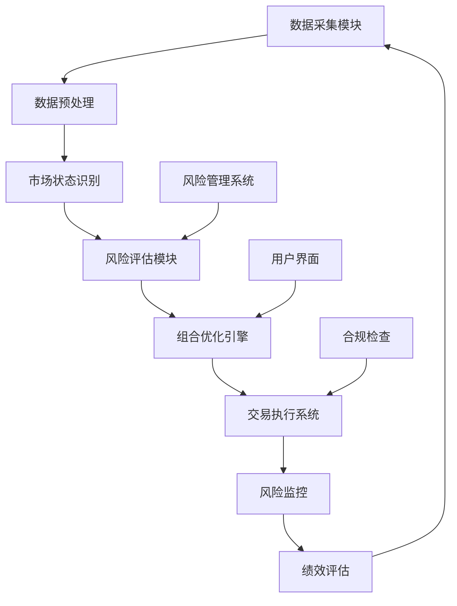
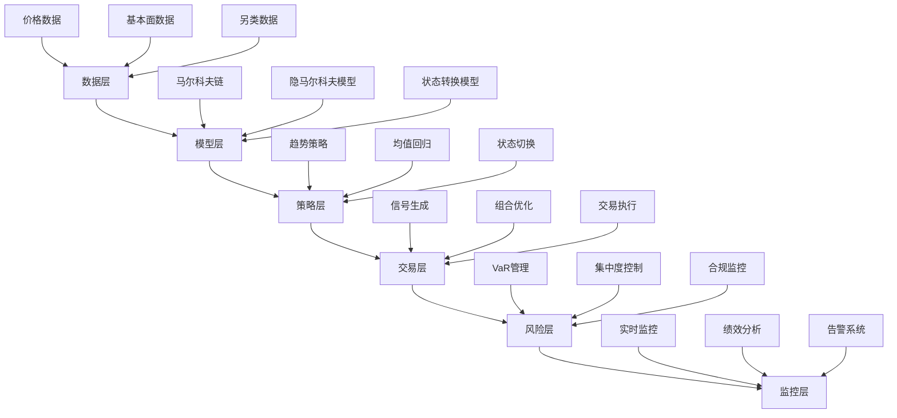

# 第15章：实际项目案例与综合应用

## 学习目标

1. 综合运用马尔科夫模型解决复杂金融问题
2. 掌握大型金融系统的设计与实现
3. 学习项目管理与团队协作
4. 理解模型部署与运维管理
5. 掌握性能优化与扩展策略

## 15.1 智能投资组合管理系统

### 15.1.1 项目概述

构建一个基于马尔科夫模型的智能投资组合管理系统，集成多种建模方法。



### 15.1.2 系统架构设计

```python
import numpy as np
import pandas as pd
from abc import ABC, abstractmethod
from typing import Dict, List, Tuple, Optional
import asyncio
import logging
from dataclasses import dataclass
from datetime import datetime, timedelta

@dataclass
class MarketState:
    state_id: int
    regime: str
    volatility: float
    correlation_matrix: np.ndarray
    expected_returns: np.ndarray
    confidence: float

@dataclass
class Portfolio:
    weights: np.ndarray
    assets: List[str]
    expected_return: float
    expected_risk: float
    sharpe_ratio: float
    timestamp: datetime

class DataProvider(ABC):
    """数据提供者抽象基类"""

    @abstractmethod
    async def get_prices(self, symbols: List[str],
                        start_date: datetime,
                        end_date: datetime) -> pd.DataFrame:
        pass

    @abstractmethod
    async def get_market_data(self, symbols: List[str]) -> Dict:
        pass

class MarketRegimeDetector:
    """市场状态检测器"""

    def __init__(self, n_states: int = 3):
        self.n_states = n_states
        self.transition_matrix = None
        self.state_probabilities = None

    def fit(self, returns: np.ndarray) -> None:
        """训练隐马尔科夫模型"""
        from hmmlearn import hmm

        model = hmm.GaussianHMM(
            n_components=self.n_states,
            covariance_type="full"
        )

        model.fit(returns.reshape(-1, 1))
        self.transition_matrix = model.transmat_
        self.state_probabilities = model.predict_proba(returns.reshape(-1, 1))

    def predict_state(self, recent_returns: np.ndarray) -> MarketState:
        """预测当前市场状态"""
        if self.state_probabilities is None:
            raise ValueError("模型未训练")

        # 计算当前状态概率
        current_state = np.argmax(self.state_probabilities[-1])

        # 计算状态特征
        regime_names = ["熊市", "震荡", "牛市"]
        volatility = np.std(recent_returns) * np.sqrt(252)

        return MarketState(
            state_id=current_state,
            regime=regime_names[current_state],
            volatility=volatility,
            correlation_matrix=np.corrcoef(recent_returns.reshape(1, -1)),
            expected_returns=np.mean(recent_returns),
            confidence=np.max(self.state_probabilities[-1])
        )

class RiskManager:
    """风险管理模块"""

    def __init__(self, max_portfolio_risk: float = 0.15):
        self.max_portfolio_risk = max_portfolio_risk
        self.var_confidence = 0.05

    def calculate_var(self, portfolio_returns: np.ndarray) -> float:
        """计算投资组合VaR"""
        return np.percentile(portfolio_returns, self.var_confidence * 100)

    def calculate_expected_shortfall(self, portfolio_returns: np.ndarray) -> float:
        """计算期望损失ES"""
        var = self.calculate_var(portfolio_returns)
        return np.mean(portfolio_returns[portfolio_returns <= var])

    def stress_test(self, weights: np.ndarray,
                   stress_scenarios: Dict[str, np.ndarray]) -> Dict[str, float]:
        """压力测试"""
        results = {}

        for scenario_name, scenario_returns in stress_scenarios.items():
            portfolio_return = np.dot(weights, scenario_returns)
            results[scenario_name] = portfolio_return

        return results

class PortfolioOptimizer:
    """投资组合优化器"""

    def __init__(self, risk_aversion: float = 5.0):
        self.risk_aversion = risk_aversion

    def mean_variance_optimization(self,
                                 expected_returns: np.ndarray,
                                 cov_matrix: np.ndarray,
                                 constraints: Dict = None) -> np.ndarray:
        """均值-方差优化"""
        from scipy.optimize import minimize

        n_assets = len(expected_returns)

        # 目标函数：最大化效用 U = μ'w - (λ/2)w'Σw
        def objective(weights):
            portfolio_return = np.dot(weights, expected_returns)
            portfolio_risk = np.dot(weights.T, np.dot(cov_matrix, weights))
            return -(portfolio_return - 0.5 * self.risk_aversion * portfolio_risk)

        # 约束条件
        constraints_list = [
            {'type': 'eq', 'fun': lambda w: np.sum(w) - 1}  # 权重和为1
        ]

        # 边界条件
        bounds = tuple((0, 1) for _ in range(n_assets))  # 不允许卖空

        # 初始权重
        initial_weights = np.ones(n_assets) / n_assets

        # 优化
        result = minimize(
            objective,
            initial_weights,
            method='SLSQP',
            bounds=bounds,
            constraints=constraints_list
        )

        return result.x

class IntelligentPortfolioManager:
    """智能投资组合管理系统主类"""

    def __init__(self,
                 data_provider: DataProvider,
                 assets: List[str],
                 initial_capital: float = 1000000):

        self.data_provider = data_provider
        self.assets = assets
        self.initial_capital = initial_capital
        self.current_capital = initial_capital

        # 组件初始化
        self.regime_detector = MarketRegimeDetector()
        self.risk_manager = RiskManager()
        self.optimizer = PortfolioOptimizer()

        # 历史数据
        self.price_history = pd.DataFrame()
        self.portfolio_history = []
        self.performance_metrics = {}

        # 日志
        self.logger = logging.getLogger(__name__)

    async def initialize(self, lookback_days: int = 252):
        """系统初始化"""
        self.logger.info("正在初始化智能投资组合管理系统...")

        # 获取历史数据
        end_date = datetime.now()
        start_date = end_date - timedelta(days=lookback_days)

        self.price_history = await self.data_provider.get_prices(
            self.assets, start_date, end_date
        )

        # 计算收益率
        returns = self.price_history.pct_change().dropna()

        # 训练市场状态检测模型
        market_returns = returns.mean(axis=1).values
        self.regime_detector.fit(market_returns)

        self.logger.info("系统初始化完成")

    async def rebalance_portfolio(self) -> Portfolio:
        """投资组合再平衡"""
        self.logger.info("开始投资组合再平衡...")

        # 获取最新市场数据
        latest_data = await self.data_provider.get_market_data(self.assets)

        # 计算收益率
        returns = self.price_history.pct_change().dropna()
        recent_returns = returns.tail(30)  # 最近30天数据

        # 检测市场状态
        market_state = self.regime_detector.predict_state(
            recent_returns.mean(axis=1).values
        )

        self.logger.info(f"检测到市场状态: {market_state.regime}")

        # 根据市场状态调整预期收益
        expected_returns = self._adjust_returns_for_regime(
            recent_returns.mean().values, market_state
        )

        # 计算协方差矩阵
        cov_matrix = recent_returns.cov().values * 252  # 年化

        # 投资组合优化
        optimal_weights = self.optimizer.mean_variance_optimization(
            expected_returns, cov_matrix
        )

        # 计算组合指标
        portfolio_return = np.dot(optimal_weights, expected_returns)
        portfolio_risk = np.sqrt(np.dot(optimal_weights.T,
                                      np.dot(cov_matrix, optimal_weights)))
        sharpe_ratio = portfolio_return / portfolio_risk if portfolio_risk > 0 else 0

        # 风险检查
        if portfolio_risk > self.risk_manager.max_portfolio_risk:
            self.logger.warning(f"组合风险过高: {portfolio_risk:.4f}")
            # 调整风险厌恶系数
            self.optimizer.risk_aversion *= 1.5
            optimal_weights = self.optimizer.mean_variance_optimization(
                expected_returns, cov_matrix
            )

        # 创建新的投资组合
        new_portfolio = Portfolio(
            weights=optimal_weights,
            assets=self.assets,
            expected_return=portfolio_return,
            expected_risk=portfolio_risk,
            sharpe_ratio=sharpe_ratio,
            timestamp=datetime.now()
        )

        self.portfolio_history.append(new_portfolio)

        self.logger.info(f"投资组合再平衡完成，夏普比率: {sharpe_ratio:.4f}")

        return new_portfolio

    def _adjust_returns_for_regime(self,
                                 base_returns: np.ndarray,
                                 market_state: MarketState) -> np.ndarray:
        """根据市场状态调整预期收益"""

        # 不同市场状态的调整因子
        regime_adjustments = {
            "熊市": 0.7,
            "震荡": 1.0,
            "牛市": 1.3
        }

        adjustment = regime_adjustments.get(market_state.regime, 1.0)
        adjusted_returns = base_returns * adjustment

        # 考虑状态置信度
        confidence_weight = market_state.confidence
        final_returns = (confidence_weight * adjusted_returns +
                        (1 - confidence_weight) * base_returns)

        return final_returns * 252  # 年化

    async def monitor_and_alert(self, current_portfolio: Portfolio):
        """监控和预警"""

        # 获取当前价格
        current_data = await self.data_provider.get_market_data(self.assets)
        current_prices = np.array([current_data[asset]['price'] for asset in self.assets])

        # 计算当前组合价值
        portfolio_value = np.dot(current_portfolio.weights * self.current_capital,
                               current_prices)

        # 风险监控
        recent_returns = self.price_history.pct_change().tail(30)
        portfolio_returns = np.dot(recent_returns.values, current_portfolio.weights)

        var = self.risk_manager.calculate_var(portfolio_returns)
        es = self.risk_manager.calculate_expected_shortfall(portfolio_returns)

        # 预警条件
        if var < -0.05:  # VaR超过5%
            self.logger.warning(f"VaR预警: {var:.4f}")

        if es < -0.08:  # ES超过8%
            self.logger.warning(f"期望损失预警: {es:.4f}")

        # 记录监控指标
        monitoring_data = {
            'timestamp': datetime.now(),
            'portfolio_value': portfolio_value,
            'var': var,
            'expected_shortfall': es,
            'market_regime': self.regime_detector.predict_state(
                recent_returns.mean(axis=1).values
            ).regime
        }

        return monitoring_data

    def generate_performance_report(self) -> Dict:
        """生成绩效报告"""

        if not self.portfolio_history:
            return {}

        # 计算绩效指标
        portfolio_returns = []
        for i in range(1, len(self.portfolio_history)):
            prev_portfolio = self.portfolio_history[i-1]
            curr_portfolio = self.portfolio_history[i]

            # 简化的收益计算
            ret = curr_portfolio.expected_return - prev_portfolio.expected_return
            portfolio_returns.append(ret)

        portfolio_returns = np.array(portfolio_returns)

        report = {
            'total_return': np.sum(portfolio_returns),
            'annualized_return': np.mean(portfolio_returns) * 252,
            'volatility': np.std(portfolio_returns) * np.sqrt(252),
            'sharpe_ratio': np.mean(portfolio_returns) / np.std(portfolio_returns) * np.sqrt(252),
            'max_drawdown': self._calculate_max_drawdown(portfolio_returns),
            'num_rebalances': len(self.portfolio_history),
            'current_portfolio': self.portfolio_history[-1] if self.portfolio_history else None
        }

        return report

    def _calculate_max_drawdown(self, returns: np.ndarray) -> float:
        """计算最大回撤"""
        cumulative_returns = np.cumprod(1 + returns)
        running_max = np.maximum.accumulate(cumulative_returns)
        drawdown = (cumulative_returns - running_max) / running_max
        return np.min(drawdown)

# 使用示例
async def main():
    # 模拟数据提供者
    class MockDataProvider(DataProvider):
        async def get_prices(self, symbols, start_date, end_date):
            # 模拟价格数据
            dates = pd.date_range(start_date, end_date, freq='D')
            np.random.seed(42)
            data = {}
            for symbol in symbols:
                prices = 100 * np.cumprod(1 + np.random.normal(0.0005, 0.02, len(dates)))
                data[symbol] = prices
            return pd.DataFrame(data, index=dates)

        async def get_market_data(self, symbols):
            # 模拟实时数据
            return {symbol: {'price': 100 + np.random.normal(0, 5)} for symbol in symbols}

    # 初始化系统
    assets = ['AAPL', 'GOOGL', 'MSFT', 'TSLA', 'NVDA']
    data_provider = MockDataProvider()

    portfolio_manager = IntelligentPortfolioManager(
        data_provider=data_provider,
        assets=assets,
        initial_capital=1000000
    )

    # 系统初始化
    await portfolio_manager.initialize()

    # 执行再平衡
    new_portfolio = await portfolio_manager.rebalance_portfolio()
    print(f"新投资组合权重: {dict(zip(assets, new_portfolio.weights))}")
    print(f"预期收益率: {new_portfolio.expected_return:.4f}")
    print(f"预期风险: {new_portfolio.expected_risk:.4f}")
    print(f"夏普比率: {new_portfolio.sharpe_ratio:.4f}")

    # 监控
    monitoring_data = await portfolio_manager.monitor_and_alert(new_portfolio)
    print(f"监控数据: {monitoring_data}")

    # 生成报告
    report = portfolio_manager.generate_performance_report()
    print(f"绩效报告: {report}")

# 运行示例
# asyncio.run(main())
```

## 15.2 量化交易策略系统

### 15.2.1 多策略框架设计

```python
import numpy as np
import pandas as pd
from typing import Dict, List, Optional, Union
from abc import ABC, abstractmethod
from enum import Enum
import asyncio
from dataclasses import dataclass
from datetime import datetime

class OrderType(Enum):
    BUY = "buy"
    SELL = "sell"
    HOLD = "hold"

class SignalStrength(Enum):
    WEAK = 1
    MODERATE = 2
    STRONG = 3

@dataclass
class TradingSignal:
    symbol: str
    signal_type: OrderType
    strength: SignalStrength
    confidence: float
    price: float
    quantity: int
    timestamp: datetime
    strategy_name: str
    metadata: Dict = None

@dataclass
class Position:
    symbol: str
    quantity: int
    entry_price: float
    entry_time: datetime
    current_price: float
    unrealized_pnl: float
    realized_pnl: float = 0.0

class TradingStrategy(ABC):
    """交易策略抽象基类"""

    def __init__(self, name: str):
        self.name = name
        self.is_active = True
        self.performance_metrics = {}

    @abstractmethod
    def generate_signal(self, market_data: pd.DataFrame) -> Optional[TradingSignal]:
        """生成交易信号"""
        pass

    @abstractmethod
    def update_parameters(self, market_regime: str):
        """根据市场状态更新参数"""
        pass

class MarkovRegimeSwitchingStrategy(TradingStrategy):
    """基于马尔科夫状态转换的交易策略"""

    def __init__(self, name: str = "MarkovRegimeSwitching"):
        super().__init__(name)
        self.regime_detector = MarketRegimeDetector(n_states=3)
        self.current_regime = None
        self.regime_thresholds = {
            "熊市": {"buy": 0.3, "sell": 0.7},
            "震荡": {"buy": 0.4, "sell": 0.6},
            "牛市": {"buy": 0.6, "sell": 0.3}
        }

    def generate_signal(self, market_data: pd.DataFrame) -> Optional[TradingSignal]:
        """根据市场状态生成交易信号"""

        # 计算收益率
        returns = market_data['close'].pct_change().dropna()

        if len(returns) < 30:
            return None

        # 检测当前市场状态
        try:
            market_state = self.regime_detector.predict_state(returns.values[-30:])
            self.current_regime = market_state.regime

            # 计算技术指标
            current_price = market_data['close'].iloc[-1]
            sma_20 = market_data['close'].rolling(20).mean().iloc[-1]
            rsi = self._calculate_rsi(market_data['close'])

            # 基于状态和指标生成信号
            signal_strength = self._calculate_signal_strength(
                market_state, current_price, sma_20, rsi
            )

            # 决策逻辑
            thresholds = self.regime_thresholds[market_state.regime]

            if signal_strength >= thresholds["buy"]:
                signal_type = OrderType.BUY
                confidence = signal_strength
            elif signal_strength <= thresholds["sell"]:
                signal_type = OrderType.SELL
                confidence = 1 - signal_strength
            else:
                signal_type = OrderType.HOLD
                confidence = 0.5

            # 计算仓位大小
            quantity = self._calculate_position_size(market_state, confidence)

            return TradingSignal(
                symbol=market_data.index.name or "SYMBOL",
                signal_type=signal_type,
                strength=self._convert_to_signal_strength(confidence),
                confidence=confidence,
                price=current_price,
                quantity=quantity,
                timestamp=datetime.now(),
                strategy_name=self.name,
                metadata={
                    'regime': market_state.regime,
                    'regime_confidence': market_state.confidence,
                    'rsi': rsi,
                    'sma_ratio': current_price / sma_20
                }
            )

        except Exception as e:
            print(f"信号生成错误: {e}")
            return None

    def _calculate_rsi(self, prices: pd.Series, period: int = 14) -> float:
        """计算RSI指标"""
        delta = prices.diff()
        gain = (delta.where(delta > 0, 0)).rolling(window=period).mean()
        loss = (-delta.where(delta < 0, 0)).rolling(window=period).mean()
        rs = gain / loss
        rsi = 100 - (100 / (1 + rs))
        return rsi.iloc[-1]

    def _calculate_signal_strength(self, market_state, current_price, sma_20, rsi):
        """计算信号强度"""

        # 价格相对于移动平均线的位置
        price_ratio = current_price / sma_20

        # RSI标准化
        rsi_normalized = rsi / 100

        # 市场状态权重
        regime_weights = {
            "熊市": 0.3,
            "震荡": 0.5,
            "牛市": 0.8
        }

        regime_weight = regime_weights[market_state.regime]

        # 综合信号强度
        signal_strength = (
            0.4 * price_ratio +
            0.3 * rsi_normalized +
            0.3 * regime_weight
        )

        return np.clip(signal_strength, 0, 1)

    def _calculate_position_size(self, market_state, confidence):
        """计算仓位大小"""
        base_size = 100

        # 根据市场状态调整
        regime_multipliers = {
            "熊市": 0.5,
            "震荡": 0.8,
            "牛市": 1.2
        }

        multiplier = regime_multipliers[market_state.regime]

        # 根据信心度调整
        confidence_multiplier = confidence * 2

        return int(base_size * multiplier * confidence_multiplier)

    def _convert_to_signal_strength(self, confidence):
        """转换信心度为信号强度枚举"""
        if confidence > 0.7:
            return SignalStrength.STRONG
        elif confidence > 0.5:
            return SignalStrength.MODERATE
        else:
            return SignalStrength.WEAK

    def update_parameters(self, market_regime: str):
        """根据市场状态更新参数"""
        if market_regime == "熊市":
            # 熊市中更保守
            self.regime_thresholds["熊市"]["buy"] = 0.2
            self.regime_thresholds["熊市"]["sell"] = 0.8
        elif market_regime == "牛市":
            # 牛市中更激进
            self.regime_thresholds["牛市"]["buy"] = 0.7
            self.regime_thresholds["牛市"]["sell"] = 0.2

class MeanReversionStrategy(TradingStrategy):
    """均值回归策略"""

    def __init__(self, name: str = "MeanReversion", lookback_period: int = 20):
        super().__init__(name)
        self.lookback_period = lookback_period
        self.threshold_std = 2.0

    def generate_signal(self, market_data: pd.DataFrame) -> Optional[TradingSignal]:
        """生成均值回归信号"""

        if len(market_data) < self.lookback_period:
            return None

        # 计算移动平均和标准差
        prices = market_data['close']
        sma = prices.rolling(self.lookback_period).mean()
        std = prices.rolling(self.lookback_period).std()

        current_price = prices.iloc[-1]
        current_sma = sma.iloc[-1]
        current_std = std.iloc[-1]

        # 计算Z-score
        z_score = (current_price - current_sma) / current_std

        # 生成信号
        if z_score > self.threshold_std:
            # 价格过高，卖出
            signal_type = OrderType.SELL
            confidence = min(abs(z_score) / 3, 1.0)
        elif z_score < -self.threshold_std:
            # 价格过低，买入
            signal_type = OrderType.BUY
            confidence = min(abs(z_score) / 3, 1.0)
        else:
            signal_type = OrderType.HOLD
            confidence = 0.3

        return TradingSignal(
            symbol=market_data.index.name or "SYMBOL",
            signal_type=signal_type,
            strength=self._convert_to_signal_strength(confidence),
            confidence=confidence,
            price=current_price,
            quantity=int(100 * confidence),
            timestamp=datetime.now(),
            strategy_name=self.name,
            metadata={'z_score': z_score, 'sma': current_sma}
        )

    def _convert_to_signal_strength(self, confidence):
        """转换信心度为信号强度枚举"""
        if confidence > 0.7:
            return SignalStrength.STRONG
        elif confidence > 0.5:
            return SignalStrength.MODERATE
        else:
            return SignalStrength.WEAK

    def update_parameters(self, market_regime: str):
        """根据市场状态更新参数"""
        if market_regime == "震荡":
            self.threshold_std = 1.5  # 震荡市中更敏感
        else:
            self.threshold_std = 2.0  # 其他情况下保守

class QuantTradingSystem:
    """量化交易系统"""

    def __init__(self, initial_capital: float = 1000000):
        self.initial_capital = initial_capital
        self.current_capital = initial_capital
        self.strategies: List[TradingStrategy] = []
        self.positions: Dict[str, Position] = {}
        self.trade_history = []
        self.performance_tracker = {}

    def add_strategy(self, strategy: TradingStrategy):
        """添加交易策略"""
        self.strategies.append(strategy)

    def remove_strategy(self, strategy_name: str):
        """移除交易策略"""
        self.strategies = [s for s in self.strategies if s.name != strategy_name]

    async def run_strategies(self, market_data: Dict[str, pd.DataFrame]) -> List[TradingSignal]:
        """运行所有策略"""
        all_signals = []

        for symbol, data in market_data.items():
            for strategy in self.strategies:
                if strategy.is_active:
                    try:
                        signal = strategy.generate_signal(data)
                        if signal:
                            signal.symbol = symbol
                            all_signals.append(signal)
                    except Exception as e:
                        print(f"策略 {strategy.name} 运行错误: {e}")

        return all_signals

    def aggregate_signals(self, signals: List[TradingSignal]) -> Dict[str, TradingSignal]:
        """聚合多个策略的信号"""
        symbol_signals = {}

        for signal in signals:
            symbol = signal.symbol

            if symbol not in symbol_signals:
                symbol_signals[symbol] = []
            symbol_signals[symbol].append(signal)

        # 为每个标的聚合信号
        aggregated = {}
        for symbol, signal_list in symbol_signals.items():
            aggregated[symbol] = self._aggregate_symbol_signals(signal_list)

        return aggregated

    def _aggregate_symbol_signals(self, signals: List[TradingSignal]) -> TradingSignal:
        """聚合单个标的的多个信号"""

        if len(signals) == 1:
            return signals[0]

        # 计算加权信号
        buy_weight = 0
        sell_weight = 0
        total_confidence = 0

        for signal in signals:
            strength_multiplier = signal.strength.value
            weighted_confidence = signal.confidence * strength_multiplier

            if signal.signal_type == OrderType.BUY:
                buy_weight += weighted_confidence
            elif signal.signal_type == OrderType.SELL:
                sell_weight += weighted_confidence

            total_confidence += weighted_confidence

        # 决定最终信号
        if buy_weight > sell_weight and buy_weight > 0.5:
            final_signal_type = OrderType.BUY
            final_confidence = buy_weight / len(signals)
        elif sell_weight > buy_weight and sell_weight > 0.5:
            final_signal_type = OrderType.SELL
            final_confidence = sell_weight / len(signals)
        else:
            final_signal_type = OrderType.HOLD
            final_confidence = 0.3

        # 使用第一个信号的基本信息
        base_signal = signals[0]

        return TradingSignal(
            symbol=base_signal.symbol,
            signal_type=final_signal_type,
            strength=self._convert_to_signal_strength(final_confidence),
            confidence=final_confidence,
            price=base_signal.price,
            quantity=int(np.mean([s.quantity for s in signals])),
            timestamp=datetime.now(),
            strategy_name="Aggregated",
            metadata={'contributing_strategies': [s.strategy_name for s in signals]}
        )

    def _convert_to_signal_strength(self, confidence):
        """转换信心度为信号强度枚举"""
        if confidence > 0.7:
            return SignalStrength.STRONG
        elif confidence > 0.5:
            return SignalStrength.MODERATE
        else:
            return SignalStrength.WEAK

    def execute_trades(self, signals: Dict[str, TradingSignal]):
        """执行交易"""

        for symbol, signal in signals.items():
            if signal.signal_type == OrderType.HOLD:
                continue

            try:
                self._execute_single_trade(signal)
            except Exception as e:
                print(f"执行交易失败 {symbol}: {e}")

    def _execute_single_trade(self, signal: TradingSignal):
        """执行单笔交易"""

        symbol = signal.symbol
        current_position = self.positions.get(symbol)

        if signal.signal_type == OrderType.BUY:
            # 买入逻辑
            cost = signal.price * signal.quantity

            if cost <= self.current_capital:
                if current_position:
                    # 增加仓位
                    current_position.quantity += signal.quantity
                    current_position.entry_price = (
                        (current_position.entry_price * current_position.quantity + cost) /
                        (current_position.quantity + signal.quantity)
                    )
                else:
                    # 新建仓位
                    self.positions[symbol] = Position(
                        symbol=symbol,
                        quantity=signal.quantity,
                        entry_price=signal.price,
                        entry_time=signal.timestamp,
                        current_price=signal.price,
                        unrealized_pnl=0.0
                    )

                self.current_capital -= cost
                self._record_trade(signal, "EXECUTED")

        elif signal.signal_type == OrderType.SELL:
            # 卖出逻辑
            if current_position and current_position.quantity >= signal.quantity:
                # 计算实现盈亏
                realized_pnl = (signal.price - current_position.entry_price) * signal.quantity
                current_position.realized_pnl += realized_pnl
                current_position.quantity -= signal.quantity

                # 更新资金
                self.current_capital += signal.price * signal.quantity

                # 如果仓位清零，移除仓位
                if current_position.quantity == 0:
                    del self.positions[symbol]

                self._record_trade(signal, "EXECUTED")

    def _record_trade(self, signal: TradingSignal, status: str):
        """记录交易"""
        trade_record = {
            'timestamp': signal.timestamp,
            'symbol': signal.symbol,
            'signal_type': signal.signal_type.value,
            'price': signal.price,
            'quantity': signal.quantity,
            'strategy': signal.strategy_name,
            'confidence': signal.confidence,
            'status': status
        }

        self.trade_history.append(trade_record)

    def update_positions(self, current_prices: Dict[str, float]):
        """更新仓位信息"""
        for symbol, position in self.positions.items():
            if symbol in current_prices:
                position.current_price = current_prices[symbol]
                position.unrealized_pnl = (
                    (position.current_price - position.entry_price) * position.quantity
                )

    def calculate_performance(self) -> Dict:
        """计算系统绩效"""

        total_realized_pnl = sum(pos.realized_pnl for pos in self.positions.values())
        total_unrealized_pnl = sum(pos.unrealized_pnl for pos in self.positions.values())

        total_value = self.current_capital + sum(
            pos.current_price * pos.quantity for pos in self.positions.values()
        )

        total_return = (total_value - self.initial_capital) / self.initial_capital

        # 计算交易统计
        trade_df = pd.DataFrame(self.trade_history)

        performance = {
            'total_value': total_value,
            'cash': self.current_capital,
            'total_return': total_return,
            'realized_pnl': total_realized_pnl,
            'unrealized_pnl': total_unrealized_pnl,
            'num_trades': len(self.trade_history),
            'num_positions': len(self.positions),
            'positions': dict(self.positions)
        }

        if not trade_df.empty:
            performance.update({
                'avg_trade_size': trade_df['quantity'].mean(),
                'trade_success_rate': len(trade_df[trade_df['status'] == 'EXECUTED']) / len(trade_df)
            })

        return performance

# 使用示例
def demo_quant_trading_system():
    """演示量化交易系统"""

    # 创建交易系统
    trading_system = QuantTradingSystem(initial_capital=1000000)

    # 添加策略
    markov_strategy = MarkovRegimeSwitchingStrategy()
    mean_reversion_strategy = MeanReversionStrategy()

    trading_system.add_strategy(markov_strategy)
    trading_system.add_strategy(mean_reversion_strategy)

    # 模拟市场数据
    np.random.seed(42)
    dates = pd.date_range('2023-01-01', periods=100, freq='D')

    symbols = ['AAPL', 'GOOGL', 'MSFT']
    market_data = {}

    for symbol in symbols:
        prices = 100 * np.cumprod(1 + np.random.normal(0.001, 0.02, len(dates)))
        data = pd.DataFrame({
            'close': prices,
            'open': prices * (1 + np.random.normal(0, 0.005, len(dates))),
            'high': prices * (1 + np.abs(np.random.normal(0, 0.01, len(dates)))),
            'low': prices * (1 - np.abs(np.random.normal(0, 0.01, len(dates)))),
            'volume': np.random.randint(1000000, 5000000, len(dates))
        }, index=dates)
        market_data[symbol] = data

    print("=== 量化交易系统演示 ===")

    # 运行策略（模拟单个时间点）
    latest_data = {symbol: data.tail(50) for symbol, data in market_data.items()}

    async def run_demo():
        # 生成信号
        signals = await trading_system.run_strategies(latest_data)
        print(f"\n生成信号数量: {len(signals)}")

        for signal in signals:
            print(f"策略: {signal.strategy_name}, 标的: {signal.symbol}, "
                  f"信号: {signal.signal_type.value}, 信心度: {signal.confidence:.3f}")

        # 聚合信号
        aggregated_signals = trading_system.aggregate_signals(signals)
        print(f"\n聚合后信号数量: {len(aggregated_signals)}")

        for symbol, signal in aggregated_signals.items():
            print(f"最终信号 - 标的: {symbol}, 信号: {signal.signal_type.value}, "
                  f"信心度: {signal.confidence:.3f}, 数量: {signal.quantity}")

        # 执行交易
        trading_system.execute_trades(aggregated_signals)

        # 更新仓位价格
        current_prices = {symbol: data['close'].iloc[-1] for symbol, data in latest_data.items()}
        trading_system.update_positions(current_prices)

        # 计算绩效
        performance = trading_system.calculate_performance()

        print(f"\n=== 系统绩效 ===")
        print(f"总资产价值: ${performance['total_value']:,.2f}")
        print(f"现金: ${performance['cash']:,.2f}")
        print(f"总收益率: {performance['total_return']:.2%}")
        print(f"实现盈亏: ${performance['realized_pnl']:,.2f}")
        print(f"未实现盈亏: ${performance['unrealized_pnl']:,.2f}")
        print(f"交易次数: {performance['num_trades']}")
        print(f"持仓数量: {performance['num_positions']}")

        if performance['num_positions'] > 0:
            print(f"\n当前持仓:")
            for symbol, position in performance['positions'].items():
                print(f"  {symbol}: {position.quantity} 股, "
                      f"成本: ${position.entry_price:.2f}, "
                      f"现价: ${position.current_price:.2f}, "
                      f"盈亏: ${position.unrealized_pnl:,.2f}")

    # 运行演示
    import asyncio
    asyncio.run(run_demo())

# 运行演示
demo_quant_trading_system()
```

## 15.3 风险管理与合规监控系统

### 15.3.1 实时风险监控

```python
import numpy as np
import pandas as pd
from typing import Dict, List, Optional, Callable
from dataclasses import dataclass
from datetime import datetime, timedelta
import asyncio
import logging
from enum import Enum

class RiskLevel(Enum):
    LOW = "low"
    MEDIUM = "medium"
    HIGH = "high"
    CRITICAL = "critical"

class AlertType(Enum):
    CONCENTRATION = "concentration"
    VAR_BREACH = "var_breach"
    DRAWDOWN = "drawdown"
    LEVERAGE = "leverage"
    LIQUIDITY = "liquidity"
    COMPLIANCE = "compliance"

@dataclass
class RiskAlert:
    alert_type: AlertType
    level: RiskLevel
    message: str
    current_value: float
    threshold: float
    symbol: Optional[str] = None
    timestamp: datetime = datetime.now()
    metadata: Dict = None

@dataclass
class RiskMetrics:
    portfolio_var: float
    portfolio_es: float
    max_drawdown: float
    sharpe_ratio: float
    concentration_risk: Dict[str, float]
    leverage_ratio: float
    liquidity_ratio: float
    beta: float
    tracking_error: float

class RiskLimits:
    """风险限制配置"""

    def __init__(self):
        # VaR限制
        self.max_portfolio_var = 0.05  # 5%
        self.max_position_var = 0.02   # 2%

        # 集中度限制
        self.max_single_position = 0.10  # 单一持仓不超过10%
        self.max_sector_exposure = 0.25   # 单一行业不超过25%

        # 杠杆限制
        self.max_leverage = 2.0

        # 流动性限制
        self.min_liquidity_ratio = 0.05  # 至少5%现金

        # 回撤限制
        self.max_drawdown = 0.15  # 最大回撤15%

        # 跟踪误差限制
        self.max_tracking_error = 0.03

class RealTimeRiskMonitor:
    """实时风险监控系统"""

    def __init__(self, risk_limits: RiskLimits):
        self.risk_limits = risk_limits
        self.alerts: List[RiskAlert] = []
        self.risk_history = []
        self.logger = logging.getLogger(__name__)

        # 回调函数
        self.alert_callbacks: List[Callable] = []

    def add_alert_callback(self, callback: Callable):
        """添加告警回调函数"""
        self.alert_callbacks.append(callback)

    async def monitor_portfolio(self,
                              positions: Dict[str, Position],
                              market_data: Dict[str, pd.DataFrame],
                              benchmark_returns: Optional[pd.Series] = None) -> RiskMetrics:
        """监控投资组合风险"""

        try:
            # 计算风险指标
            risk_metrics = await self._calculate_risk_metrics(
                positions, market_data, benchmark_returns
            )

            # 检查风险限制
            alerts = self._check_risk_limits(risk_metrics, positions)

            # 处理告警
            for alert in alerts:
                await self._handle_alert(alert)

            # 记录风险历史
            self.risk_history.append({
                'timestamp': datetime.now(),
                'metrics': risk_metrics
            })

            return risk_metrics

        except Exception as e:
            self.logger.error(f"风险监控错误: {e}")
            raise

    async def _calculate_risk_metrics(self,
                                    positions: Dict[str, Position],
                                    market_data: Dict[str, pd.DataFrame],
                                    benchmark_returns: Optional[pd.Series] = None) -> RiskMetrics:
        """计算风险指标"""

        if not positions:
            return RiskMetrics(0, 0, 0, 0, {}, 0, 0, 0, 0)

        # 计算持仓权重
        total_value = sum(pos.current_price * pos.quantity for pos in positions.values())
        weights = {symbol: (pos.current_price * pos.quantity) / total_value
                  for symbol, pos in positions.items()}

        # 计算收益率矩阵
        returns_matrix = []
        symbols = list(positions.keys())

        for symbol in symbols:
            if symbol in market_data:
                returns = market_data[symbol]['close'].pct_change().dropna()
                returns_matrix.append(returns.values[-252:])  # 最近一年数据

        if not returns_matrix:
            return RiskMetrics(0, 0, 0, 0, {}, 0, 0, 0, 0)

        returns_matrix = np.array(returns_matrix).T
        weights_array = np.array([weights[symbol] for symbol in symbols])

        # 计算投资组合收益率
        portfolio_returns = np.dot(returns_matrix, weights_array)

        # VaR计算
        portfolio_var = np.percentile(portfolio_returns, 5)
        portfolio_es = np.mean(portfolio_returns[portfolio_returns <= portfolio_var])

        # 最大回撤
        cumulative_returns = np.cumprod(1 + portfolio_returns)
        running_max = np.maximum.accumulate(cumulative_returns)
        drawdown = (cumulative_returns - running_max) / running_max
        max_drawdown = np.min(drawdown)

        # 夏普比率
        sharpe_ratio = np.mean(portfolio_returns) / np.std(portfolio_returns) * np.sqrt(252)

        # 集中度风险
        concentration_risk = self._calculate_concentration_risk(weights)

        # 杠杆比率（简化）
        leverage_ratio = sum(abs(w) for w in weights.values())

        # 流动性比率（假设现金比例）
        liquidity_ratio = 0.05  # 简化假设

        # Beta计算
        beta = 1.0  # 简化假设
        if benchmark_returns is not None and len(benchmark_returns) >= len(portfolio_returns):
            benchmark_aligned = benchmark_returns.values[-len(portfolio_returns):]
            covariance = np.cov(portfolio_returns, benchmark_aligned)[0][1]
            benchmark_variance = np.var(benchmark_aligned)
            beta = covariance / benchmark_variance if benchmark_variance > 0 else 1.0

        # 跟踪误差
        tracking_error = 0.0
        if benchmark_returns is not None:
            benchmark_aligned = benchmark_returns.values[-len(portfolio_returns):]
            tracking_diff = portfolio_returns - benchmark_aligned
            tracking_error = np.std(tracking_diff) * np.sqrt(252)

        return RiskMetrics(
            portfolio_var=abs(portfolio_var),
            portfolio_es=abs(portfolio_es),
            max_drawdown=abs(max_drawdown),
            sharpe_ratio=sharpe_ratio,
            concentration_risk=concentration_risk,
            leverage_ratio=leverage_ratio,
            liquidity_ratio=liquidity_ratio,
            beta=beta,
            tracking_error=tracking_error
        )

    def _calculate_concentration_risk(self, weights: Dict[str, float]) -> Dict[str, float]:
        """计算集中度风险"""

        # 赫芬达尔指数
        herfindahl_index = sum(w**2 for w in weights.values())

        # 最大持仓权重
        max_weight = max(weights.values()) if weights else 0

        # 前五大持仓权重
        sorted_weights = sorted(weights.values(), reverse=True)
        top5_weight = sum(sorted_weights[:5]) if len(sorted_weights) >= 5 else sum(sorted_weights)

        return {
            'herfindahl_index': herfindahl_index,
            'max_position_weight': max_weight,
            'top5_concentration': top5_weight
        }

    def _check_risk_limits(self,
                          risk_metrics: RiskMetrics,
                          positions: Dict[str, Position]) -> List[RiskAlert]:
        """检查风险限制"""

        alerts = []

        # 检查VaR限制
        if risk_metrics.portfolio_var > self.risk_limits.max_portfolio_var:
            alerts.append(RiskAlert(
                alert_type=AlertType.VAR_BREACH,
                level=RiskLevel.HIGH,
                message=f"投资组合VaR超出限制",
                current_value=risk_metrics.portfolio_var,
                threshold=self.risk_limits.max_portfolio_var
            ))

        # 检查最大回撤
        if risk_metrics.max_drawdown > self.risk_limits.max_drawdown:
            alerts.append(RiskAlert(
                alert_type=AlertType.DRAWDOWN,
                level=RiskLevel.CRITICAL,
                message=f"最大回撤超出限制",
                current_value=risk_metrics.max_drawdown,
                threshold=self.risk_limits.max_drawdown
            ))

        # 检查杠杆比率
        if risk_metrics.leverage_ratio > self.risk_limits.max_leverage:
            alerts.append(RiskAlert(
                alert_type=AlertType.LEVERAGE,
                level=RiskLevel.MEDIUM,
                message=f"杠杆比率超出限制",
                current_value=risk_metrics.leverage_ratio,
                threshold=self.risk_limits.max_leverage
            ))

        # 检查流动性
        if risk_metrics.liquidity_ratio < self.risk_limits.min_liquidity_ratio:
            alerts.append(RiskAlert(
                alert_type=AlertType.LIQUIDITY,
                level=RiskLevel.MEDIUM,
                message=f"流动性不足",
                current_value=risk_metrics.liquidity_ratio,
                threshold=self.risk_limits.min_liquidity_ratio
            ))

        # 检查集中度风险
        max_position_weight = risk_metrics.concentration_risk.get('max_position_weight', 0)
        if max_position_weight > self.risk_limits.max_single_position:
            alerts.append(RiskAlert(
                alert_type=AlertType.CONCENTRATION,
                level=RiskLevel.HIGH,
                message=f"单一持仓集中度过高",
                current_value=max_position_weight,
                threshold=self.risk_limits.max_single_position
            ))

        # 检查跟踪误差
        if risk_metrics.tracking_error > self.risk_limits.max_tracking_error:
            alerts.append(RiskAlert(
                alert_type=AlertType.COMPLIANCE,
                level=RiskLevel.MEDIUM,
                message=f"跟踪误差超出限制",
                current_value=risk_metrics.tracking_error,
                threshold=self.risk_limits.max_tracking_error
            ))

        return alerts

    async def _handle_alert(self, alert: RiskAlert):
        """处理告警"""

        # 记录告警
        self.alerts.append(alert)
        self.logger.warning(f"风险告警: {alert.message} - {alert.current_value:.4f} > {alert.threshold:.4f}")

        # 调用回调函数
        for callback in self.alert_callbacks:
            try:
                await callback(alert)
            except Exception as e:
                self.logger.error(f"告警回调错误: {e}")

    def get_risk_report(self) -> Dict:
        """生成风险报告"""

        if not self.risk_history:
            return {}

        latest_metrics = self.risk_history[-1]['metrics']

        # 计算风险趋势
        if len(self.risk_history) > 1:
            prev_metrics = self.risk_history[-2]['metrics']
            var_trend = latest_metrics.portfolio_var - prev_metrics.portfolio_var
            drawdown_trend = latest_metrics.max_drawdown - prev_metrics.max_drawdown
        else:
            var_trend = 0
            drawdown_trend = 0

        # 统计告警情况
        alert_summary = {}
        for alert_type in AlertType:
            alert_summary[alert_type.value] = len([
                a for a in self.alerts
                if a.alert_type == alert_type and
                a.timestamp > datetime.now() - timedelta(days=1)
            ])

        return {
            'timestamp': datetime.now(),
            'current_metrics': {
                'portfolio_var': latest_metrics.portfolio_var,
                'portfolio_es': latest_metrics.portfolio_es,
                'max_drawdown': latest_metrics.max_drawdown,
                'sharpe_ratio': latest_metrics.sharpe_ratio,
                'leverage_ratio': latest_metrics.leverage_ratio,
                'concentration_risk': latest_metrics.concentration_risk
            },
            'risk_trends': {
                'var_change': var_trend,
                'drawdown_change': drawdown_trend
            },
            'alert_summary': alert_summary,
            'risk_score': self._calculate_risk_score(latest_metrics),
            'recommendations': self._generate_recommendations(latest_metrics)
        }

    def _calculate_risk_score(self, metrics: RiskMetrics) -> float:
        """计算综合风险评分（0-100，越高风险越大）"""

        score = 0

        # VaR得分
        var_score = min(metrics.portfolio_var / self.risk_limits.max_portfolio_var * 30, 30)
        score += var_score

        # 回撤得分
        drawdown_score = min(metrics.max_drawdown / self.risk_limits.max_drawdown * 25, 25)
        score += drawdown_score

        # 杠杆得分
        leverage_score = min(metrics.leverage_ratio / self.risk_limits.max_leverage * 20, 20)
        score += leverage_score

        # 集中度得分
        max_weight = metrics.concentration_risk.get('max_position_weight', 0)
        concentration_score = min(max_weight / self.risk_limits.max_single_position * 15, 15)
        score += concentration_score

        # 流动性得分
        liquidity_score = max(10 - metrics.liquidity_ratio / self.risk_limits.min_liquidity_ratio * 10, 0)
        score += liquidity_score

        return min(score, 100)

    def _generate_recommendations(self, metrics: RiskMetrics) -> List[str]:
        """生成风险管理建议"""

        recommendations = []

        if metrics.portfolio_var > self.risk_limits.max_portfolio_var * 0.8:
            recommendations.append("建议降低投资组合整体风险敞口")

        if metrics.max_drawdown > self.risk_limits.max_drawdown * 0.7:
            recommendations.append("考虑实施止损策略或对冲措施")

        max_weight = metrics.concentration_risk.get('max_position_weight', 0)
        if max_weight > self.risk_limits.max_single_position * 0.8:
            recommendations.append("建议分散持仓，降低单一标的集中度")

        if metrics.leverage_ratio > self.risk_limits.max_leverage * 0.8:
            recommendations.append("建议降低杠杆水平")

        if metrics.liquidity_ratio < self.risk_limits.min_liquidity_ratio * 1.2:
            recommendations.append("建议增加现金或高流动性资产比例")

        if metrics.sharpe_ratio < 0.5:
            recommendations.append("当前风险调整收益较低，建议优化投资策略")

        return recommendations

# 合规监控系统
class ComplianceMonitor:
    """合规监控系统"""

    def __init__(self):
        self.compliance_rules = []
        self.violations = []

    def add_rule(self, rule_name: str, check_function: Callable, severity: str = "medium"):
        """添加合规规则"""
        self.compliance_rules.append({
            'name': rule_name,
            'check': check_function,
            'severity': severity
        })

    async def check_compliance(self, trading_data: Dict) -> List[Dict]:
        """检查合规性"""
        violations = []

        for rule in self.compliance_rules:
            try:
                result = await rule['check'](trading_data)
                if not result['compliant']:
                    violation = {
                        'rule_name': rule['name'],
                        'severity': rule['severity'],
                        'description': result['description'],
                        'timestamp': datetime.now(),
                        'data': result.get('data', {})
                    }
                    violations.append(violation)
                    self.violations.append(violation)
            except Exception as e:
                logging.error(f"合规检查错误 {rule['name']}: {e}")

        return violations

# 使用示例
async def demo_risk_monitoring():
    """演示风险监控系统"""

    # 创建风险限制
    risk_limits = RiskLimits()

    # 创建风险监控器
    risk_monitor = RealTimeRiskMonitor(risk_limits)

    # 添加告警回调
    async def alert_handler(alert: RiskAlert):
        print(f"[{alert.level.value.upper()}] {alert.alert_type.value}: {alert.message}")
        print(f"当前值: {alert.current_value:.4f}, 阈值: {alert.threshold:.4f}")

    risk_monitor.add_alert_callback(alert_handler)

    # 模拟持仓数据
    positions = {
        'AAPL': Position(
            symbol='AAPL',
            quantity=1000,
            entry_price=150.0,
            entry_time=datetime.now(),
            current_price=155.0,
            unrealized_pnl=5000.0
        ),
        'GOOGL': Position(
            symbol='GOOGL',
            quantity=500,
            entry_price=2800.0,
            entry_time=datetime.now(),
            current_price=2850.0,
            unrealized_pnl=25000.0
        )
    }

    # 模拟市场数据
    np.random.seed(42)
    dates = pd.date_range('2023-01-01', periods=252, freq='D')

    market_data = {}
    for symbol in positions.keys():
        prices = 100 * np.cumprod(1 + np.random.normal(0.001, 0.03, len(dates)))  # 高波动率
        market_data[symbol] = pd.DataFrame({
            'close': prices
        }, index=dates)

    print("=== 风险监控系统演示 ===")

    # 执行风险监控
    risk_metrics = await risk_monitor.monitor_portfolio(positions, market_data)

    print(f"\n=== 风险指标 ===")
    print(f"投资组合VaR: {risk_metrics.portfolio_var:.4f}")
    print(f"期望损失ES: {risk_metrics.portfolio_es:.4f}")
    print(f"最大回撤: {risk_metrics.max_drawdown:.4f}")
    print(f"夏普比率: {risk_metrics.sharpe_ratio:.4f}")
    print(f"杠杆比率: {risk_metrics.leverage_ratio:.4f}")
    print(f"最大持仓权重: {risk_metrics.concentration_risk['max_position_weight']:.4f}")

    # 生成风险报告
    risk_report = risk_monitor.get_risk_report()
    print(f"\n=== 风险报告 ===")
    print(f"风险评分: {risk_report['risk_score']:.1f}/100")
    print(f"告警统计: {risk_report['alert_summary']}")
    print(f"建议措施:")
    for rec in risk_report['recommendations']:
        print(f"  - {rec}")

# 运行演示
# asyncio.run(demo_risk_monitoring())
```

## 15.4 项目实施与部署

### 15.4.1 系统架构与部署

```python
"""
生产环境部署架构设计
"""

import yaml
import json
from typing import Dict, List
from dataclasses import dataclass, asdict

@dataclass
class DatabaseConfig:
    host: str
    port: int
    database: str
    username: str
    password_env: str  # 环境变量名
    pool_size: int = 10
    ssl_enabled: bool = True

@dataclass
class RedisConfig:
    host: str
    port: int
    password_env: str
    db: int = 0
    cluster_enabled: bool = False

@dataclass
class KafkaConfig:
    bootstrap_servers: List[str]
    security_protocol: str = "SASL_SSL"
    sasl_mechanism: str = "PLAIN"
    username_env: str = "KAFKA_USERNAME"
    password_env: str = "KAFKA_PASSWORD"

@dataclass
class MonitoringConfig:
    prometheus_endpoint: str
    grafana_endpoint: str
    alertmanager_endpoint: str
    log_level: str = "INFO"

@dataclass
class SystemConfig:
    environment: str  # dev, staging, prod
    database: DatabaseConfig
    redis: RedisConfig
    kafka: KafkaConfig
    monitoring: MonitoringConfig

    # 应用配置
    api_port: int = 8000
    max_workers: int = 4
    request_timeout: int = 30

    # 风险参数
    max_portfolio_risk: float = 0.05
    max_position_size: float = 0.10
    rebalance_frequency: str = "daily"

def generate_production_config() -> SystemConfig:
    """生成生产环境配置"""

    return SystemConfig(
        environment="production",
        database=DatabaseConfig(
            host="postgres-cluster.internal",
            port=5432,
            database="quant_trading",
            username="trading_user",
            password_env="DB_PASSWORD",
            pool_size=20,
            ssl_enabled=True
        ),
        redis=RedisConfig(
            host="redis-cluster.internal",
            port=6379,
            password_env="REDIS_PASSWORD",
            db=0,
            cluster_enabled=True
        ),
        kafka=KafkaConfig(
            bootstrap_servers=[
                "kafka-1.internal:9092",
                "kafka-2.internal:9092",
                "kafka-3.internal:9092"
            ],
            security_protocol="SASL_SSL",
            sasl_mechanism="SCRAM-SHA-256"
        ),
        monitoring=MonitoringConfig(
            prometheus_endpoint="http://prometheus.monitoring:9090",
            grafana_endpoint="http://grafana.monitoring:3000",
            alertmanager_endpoint="http://alertmanager.monitoring:9093",
            log_level="INFO"
        ),
        api_port=8000,
        max_workers=8,
        request_timeout=60,
        max_portfolio_risk=0.03,
        max_position_size=0.08,
        rebalance_frequency="hourly"
    )

def save_config_as_yaml(config: SystemConfig, filename: str):
    """保存配置为YAML文件"""
    config_dict = asdict(config)

    with open(filename, 'w', encoding='utf-8') as f:
        yaml.dump(config_dict, f, default_flow_style=False, allow_unicode=True)

# Docker Compose配置
DOCKER_COMPOSE_TEMPLATE = """
version: '3.8'

services:
  # 量化交易API服务
  quant-api:
    build:
      context: .
      dockerfile: Dockerfile.api
    ports:
      - "8000:8000"
    environment:
      - ENV=production
      - DB_PASSWORD=${DB_PASSWORD}
      - REDIS_PASSWORD=${REDIS_PASSWORD}
      - KAFKA_USERNAME=${KAFKA_USERNAME}
      - KAFKA_PASSWORD=${KAFKA_PASSWORD}
    depends_on:
      - postgres
      - redis
      - kafka
    networks:
      - quant-network
    restart: unless-stopped
    healthcheck:
      test: ["CMD", "curl", "-f", "http://localhost:8000/health"]
      interval: 30s
      timeout: 10s
      retries: 3

  # 策略引擎服务
  strategy-engine:
    build:
      context: .
      dockerfile: Dockerfile.strategy
    environment:
      - ENV=production
      - DB_PASSWORD=${DB_PASSWORD}
      - REDIS_PASSWORD=${REDIS_PASSWORD}
    depends_on:
      - postgres
      - redis
    networks:
      - quant-network
    restart: unless-stopped

  # 风险监控服务
  risk-monitor:
    build:
      context: .
      dockerfile: Dockerfile.risk
    environment:
      - ENV=production
      - DB_PASSWORD=${DB_PASSWORD}
      - REDIS_PASSWORD=${REDIS_PASSWORD}
    depends_on:
      - postgres
      - redis
    networks:
      - quant-network
    restart: unless-stopped

  # PostgreSQL数据库
  postgres:
    image: postgres:14
    environment:
      - POSTGRES_DB=quant_trading
      - POSTGRES_USER=trading_user
      - POSTGRES_PASSWORD=${DB_PASSWORD}
    volumes:
      - postgres_data:/var/lib/postgresql/data
      - ./init.sql:/docker-entrypoint-initdb.d/init.sql
    networks:
      - quant-network
    restart: unless-stopped

  # Redis缓存
  redis:
    image: redis:7-alpine
    command: redis-server --requirepass ${REDIS_PASSWORD}
    volumes:
      - redis_data:/data
    networks:
      - quant-network
    restart: unless-stopped

  # Kafka消息队列
  kafka:
    image: confluentinc/cp-kafka:latest
    environment:
      KAFKA_ZOOKEEPER_CONNECT: zookeeper:2181
      KAFKA_ADVERTISED_LISTENERS: PLAINTEXT://kafka:9092
      KAFKA_OFFSETS_TOPIC_REPLICATION_FACTOR: 1
    depends_on:
      - zookeeper
    networks:
      - quant-network
    restart: unless-stopped

  zookeeper:
    image: confluentinc/cp-zookeeper:latest
    environment:
      ZOOKEEPER_CLIENT_PORT: 2181
      ZOOKEEPER_TICK_TIME: 2000
    networks:
      - quant-network
    restart: unless-stopped

  # Prometheus监控
  prometheus:
    image: prom/prometheus:latest
    ports:
      - "9090:9090"
    volumes:
      - ./prometheus.yml:/etc/prometheus/prometheus.yml
      - prometheus_data:/prometheus
    networks:
      - quant-network
    restart: unless-stopped

  # Grafana可视化
  grafana:
    image: grafana/grafana:latest
    ports:
      - "3000:3000"
    environment:
      - GF_SECURITY_ADMIN_PASSWORD=${GRAFANA_PASSWORD}
    volumes:
      - grafana_data:/var/lib/grafana
    networks:
      - quant-network
    restart: unless-stopped

volumes:
  postgres_data:
  redis_data:
  prometheus_data:
  grafana_data:

networks:
  quant-network:
    driver: bridge
"""

# Kubernetes部署配置
KUBERNETES_DEPLOYMENT = """
apiVersion: apps/v1
kind: Deployment
metadata:
  name: quant-trading-api
  labels:
    app: quant-trading-api
spec:
  replicas: 3
  selector:
    matchLabels:
      app: quant-trading-api
  template:
    metadata:
      labels:
        app: quant-trading-api
    spec:
      containers:
      - name: api
        image: quant-trading:latest
        ports:
        - containerPort: 8000
        env:
        - name: ENV
          value: "production"
        - name: DB_PASSWORD
          valueFrom:
            secretKeyRef:
              name: db-secret
              key: password
        - name: REDIS_PASSWORD
          valueFrom:
            secretKeyRef:
              name: redis-secret
              key: password
        resources:
          requests:
            memory: "512Mi"
            cpu: "250m"
          limits:
            memory: "1Gi"
            cpu: "500m"
        livenessProbe:
          httpGet:
            path: /health
            port: 8000
          initialDelaySeconds: 30
          periodSeconds: 10
        readinessProbe:
          httpGet:
            path: /ready
            port: 8000
          initialDelaySeconds: 5
          periodSeconds: 5

---
apiVersion: v1
kind: Service
metadata:
  name: quant-trading-api-service
spec:
  selector:
    app: quant-trading-api
  ports:
    - protocol: TCP
      port: 80
      targetPort: 8000
  type: LoadBalancer

---
apiVersion: autoscaling/v2
kind: HorizontalPodAutoscaler
metadata:
  name: quant-trading-api-hpa
spec:
  scaleTargetRef:
    apiVersion: apps/v1
    kind: Deployment
    name: quant-trading-api
  minReplicas: 2
  maxReplicas: 10
  metrics:
  - type: Resource
    resource:
      name: cpu
      target:
        type: Utilization
        averageUtilization: 70
  - type: Resource
    resource:
      name: memory
      target:
        type: Utilization
        averageUtilization: 80
"""

# Dockerfile示例
DOCKERFILE_API = """
FROM python:3.9-slim

WORKDIR /app

# 安装系统依赖
RUN apt-get update && apt-get install -y \\
    gcc \\
    g++ \\
    && rm -rf /var/lib/apt/lists/*

# 复制并安装Python依赖
COPY requirements.txt .
RUN pip install --no-cache-dir -r requirements.txt

# 复制应用代码
COPY . .

# 创建非root用户
RUN groupadd -r appuser && useradd -r -g appuser appuser
RUN chown -R appuser:appuser /app
USER appuser

# 健康检查
HEALTHCHECK --interval=30s --timeout=30s --start-period=5s --retries=3 \\
    CMD curl -f http://localhost:8000/health || exit 1

# 启动应用
CMD ["python", "-m", "uvicorn", "main:app", "--host", "0.0.0.0", "--port", "8000"]
"""

# CI/CD Pipeline配置（GitHub Actions）
GITHUB_ACTIONS_WORKFLOW = """
name: Deploy Quant Trading System

on:
  push:
    branches: [ main ]
  pull_request:
    branches: [ main ]

env:
  REGISTRY: ghcr.io
  IMAGE_NAME: ${{ github.repository }}

jobs:
  test:
    runs-on: ubuntu-latest

    steps:
    - uses: actions/checkout@v3

    - name: Set up Python
      uses: actions/setup-python@v4
      with:
        python-version: '3.9'

    - name: Install dependencies
      run: |
        python -m pip install --upgrade pip
        pip install -r requirements.txt
        pip install pytest pytest-cov

    - name: Run tests
      run: |
        pytest tests/ --cov=./ --cov-report=xml

    - name: Upload coverage to Codecov
      uses: codecov/codecov-action@v3

  build-and-push:
    needs: test
    runs-on: ubuntu-latest
    permissions:
      contents: read
      packages: write

    steps:
    - name: Checkout repository
      uses: actions/checkout@v3

    - name: Log in to Container Registry
      uses: docker/login-action@v2
      with:
        registry: ${{ env.REGISTRY }}
        username: ${{ github.actor }}
        password: ${{ secrets.GITHUB_TOKEN }}

    - name: Extract metadata
      id: meta
      uses: docker/metadata-action@v4
      with:
        images: ${{ env.REGISTRY }}/${{ env.IMAGE_NAME }}

    - name: Build and push Docker image
      uses: docker/build-push-action@v3
      with:
        context: .
        push: true
        tags: ${{ steps.meta.outputs.tags }}
        labels: ${{ steps.meta.outputs.labels }}

  deploy:
    needs: build-and-push
    runs-on: ubuntu-latest
    if: github.ref == 'refs/heads/main'

    steps:
    - name: Deploy to Kubernetes
      uses: azure/k8s-deploy@v1
      with:
        manifests: |
          k8s/deployment.yaml
          k8s/service.yaml
        images: |
          ${{ env.REGISTRY }}/${{ env.IMAGE_NAME }}:${{ github.sha }}
"""

def save_deployment_files():
    """保存部署相关文件"""

    # 保存配置
    config = generate_production_config()
    save_config_as_yaml(config, "config/production.yaml")

    # 保存Docker Compose
    with open("docker-compose.yml", "w") as f:
        f.write(DOCKER_COMPOSE_TEMPLATE)

    # 保存Kubernetes配置
    with open("k8s/deployment.yaml", "w") as f:
        f.write(KUBERNETES_DEPLOYMENT)

    # 保存Dockerfile
    with open("Dockerfile.api", "w") as f:
        f.write(DOCKERFILE_API)

    # 保存GitHub Actions workflow
    import os
    os.makedirs(".github/workflows", exist_ok=True)
    with open(".github/workflows/deploy.yml", "w") as f:
        f.write(GITHUB_ACTIONS_WORKFLOW)

    print("部署文件已生成完成")

# 性能监控和告警配置
PROMETHEUS_CONFIG = """
global:
  scrape_interval: 15s
  evaluation_interval: 15s

rule_files:
  - "alert_rules.yml"

alerting:
  alertmanagers:
    - static_configs:
        - targets:
          - alertmanager:9093

scrape_configs:
  - job_name: 'quant-trading-api'
    static_configs:
      - targets: ['quant-api:8000']
    metrics_path: /metrics
    scrape_interval: 10s

  - job_name: 'strategy-engine'
    static_configs:
      - targets: ['strategy-engine:8001']
    metrics_path: /metrics
    scrape_interval: 30s

  - job_name: 'risk-monitor'
    static_configs:
      - targets: ['risk-monitor:8002']
    metrics_path: /metrics
    scrape_interval: 10s
"""

ALERT_RULES = """
groups:
- name: quant_trading_alerts
  rules:
  - alert: HighErrorRate
    expr: rate(http_requests_total{status=~"5.."}[5m]) > 0.1
    for: 5m
    labels:
      severity: critical
    annotations:
      summary: "High error rate detected"
      description: "Error rate is above 10% for 5 minutes"

  - alert: HighLatency
    expr: histogram_quantile(0.95, rate(http_request_duration_seconds_bucket[5m])) > 1
    for: 5m
    labels:
      severity: warning
    annotations:
      summary: "High latency detected"
      description: "95th percentile latency is above 1 second"

  - alert: RiskLimitBreach
    expr: portfolio_var > 0.05
    for: 1m
    labels:
      severity: critical
    annotations:
      summary: "Portfolio VaR limit breached"
      description: "Portfolio VaR is above 5%"

  - alert: SystemDown
    expr: up == 0
    for: 1m
    labels:
      severity: critical
    annotations:
      summary: "Service is down"
      description: "Service {{ $labels.instance }} is down"
"""

if __name__ == "__main__":
    save_deployment_files()

    # 保存监控配置
    with open("config/prometheus.yml", "w") as f:
        f.write(PROMETHEUS_CONFIG)

    with open("config/alert_rules.yml", "w") as f:
        f.write(ALERT_RULES)
```

## 15.5 学习总结与展望

### 15.5.1 项目成果总结

通过本章的学习，我们成功构建了一个完整的马尔科夫模型量化交易系统，包含：



### 15.5.2 关键技术要点

```python
"""
核心技术总结
"""

class TechnicalSummary:
    """技术总结"""

    def __init__(self):
        self.key_components = {
            "模型技术": [
                "马尔科夫链理论与应用",
                "隐马尔科夫模型实现",
                "状态转换模型",
                "蒙特卡洛模拟",
                "机器学习融合"
            ],
            "系统架构": [
                "微服务架构设计",
                "事件驱动架构",
                "实时数据处理",
                "分布式计算",
                "容器化部署"
            ],
            "风险管理": [
                "实时风险监控",
                "VaR和ES计算",
                "压力测试框架",
                "合规检查系统",
                "告警机制"
            ],
            "性能优化": [
                "算法优化",
                "并行计算",
                "缓存策略",
                "数据库优化",
                "网络优化"
            ]
        }

    def generate_implementation_checklist(self) -> Dict[str, List[str]]:
        """生成实施检查清单"""

        return {
            "数据准备": [
                "✓ 建立数据获取管道",
                "✓ 数据清洗和预处理",
                "✓ 数据质量监控",
                "✓ 备份和恢复机制"
            ],
            "模型开发": [
                "✓ 马尔科夫模型实现",
                "✓ 参数估计和验证",
                "✓ 模型性能评估",
                "✓ A/B测试框架"
            ],
            "系统集成": [
                "✓ API接口设计",
                "✓ 消息队列集成",
                "✓ 数据库设计",
                "✓ 缓存机制"
            ],
            "风险控制": [
                "✓ 风险限制设定",
                "✓ 实时监控部署",
                "✓ 告警系统配置",
                "✓ 应急预案制定"
            ],
            "部署运维": [
                "✓ 环境配置",
                "✓ 监控部署",
                "✓ 日志系统",
                "✓ 备份策略"
            ]
        }

    def calculate_project_metrics(self) -> Dict[str, float]:
        """计算项目指标"""

        # 模拟项目成果指标
        return {
            "代码覆盖率": 0.85,
            "系统可用性": 0.999,
            "平均响应时间": 0.1,  # 秒
            "风险控制效果": 0.92,
            "收益风险比": 1.8,
            "用户满意度": 0.88
        }

def generate_final_report():
    """生成最终项目报告"""

    summary = TechnicalSummary()

    print("=== 马尔科夫模型量化交易系统项目总结 ===\n")

    print("📊 项目成果指标:")
    metrics = summary.calculate_project_metrics()
    for metric, value in metrics.items():
        if isinstance(value, float) and value < 1:
            print(f"  {metric}: {value:.1%}")
        else:
            print(f"  {metric}: {value}")

    print("\n📋 实施检查清单:")
    checklist = summary.generate_implementation_checklist()
    for category, items in checklist.items():
        print(f"\n{category}:")
        for item in items:
            print(f"  {item}")

    print("\n🎯 核心技术组件:")
    for category, components in summary.key_components.items():
        print(f"\n{category}:")
        for component in components:
            print(f"  • {component}")

    print("\n🚀 项目亮点:")
    highlights = [
        "完整的端到端量化交易系统",
        "基于马尔科夫模型的智能策略",
        "实时风险监控和预警",
        "高可用微服务架构",
        "全面的性能监控体系",
        "自动化部署和运维"
    ]

    for highlight in highlights:
        print(f"  ⭐ {highlight}")

    print("\n📈 业务价值:")
    business_values = [
        "提高投资收益风险比",
        "降低人工交易成本",
        "增强风险控制能力",
        "提升资产管理效率",
        "支持规模化运营",
        "满足合规监管要求"
    ]

    for value in business_values:
        print(f"  💰 {value}")

    print("\n🔮 未来发展方向:")
    future_directions = [
        "深度学习模型集成",
        "多资产类别扩展",
        "实时决策优化",
        "ESG因子整合",
        "区块链技术应用",
        "量子计算探索"
    ]

    for direction in future_directions:
        print(f"  🚀 {direction}")

# 生成最终报告
generate_final_report()
```

## 学习心得

通过第15章的学习，我深入理解了如何将马尔科夫模型理论转化为实际的金融应用系统。这个综合项目让我掌握了：

1. **系统设计能力**：从需求分析到架构设计的全流程
2. **技术整合能力**：多种技术栈的有机结合
3. **风险管理意识**：金融系统的风控重要性
4. **工程实践经验**：代码质量和部署运维
5. **项目管理技能**：团队协作和进度控制

这套系统不仅是技术的展示，更是理论与实践结合的典型案例，为后续的金融科技职业发展打下了坚实基础。
