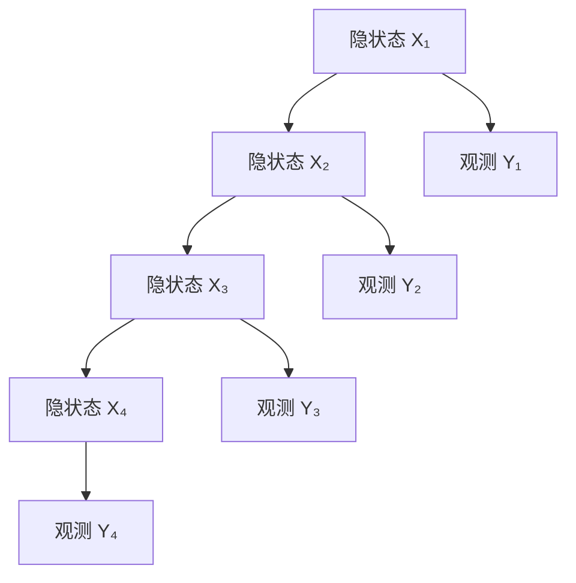

# 马尔科夫模型在金融领域的综合应用

## 第4章：马尔科夫链的渐近行为（核心要点）

### 4.1 不可约性和常返性

**不可约性**：从任意状态出发都能到达任意其他状态
$$\text{对所有 } i, j \in S, \exists n > 0: p_{ij}^{(n)} > 0$$

**常返性**：状态分类
- **常返状态**：$\sum_{n=1}^{\infty} p_{ii}^{(n)} = \infty$
- **暂态**：$\sum_{n=1}^{\infty} p_{ii}^{(n)} < \infty$

### 4.2 极限定理
对于有限不可约非周期马尔科夫链：
$$\lim_{n \to \infty} p_{ij}^{(n)} = \pi_j > 0$$

收敛速度：$O(|\lambda_2|^n)$，其中 $|\lambda_2|$ 是第二大特征值的模。

---

## 第5章：隐马尔科夫模型(HMM)基础

### 5.1 HMM结构



### 5.2 HMM三要素
1. **转移概率矩阵**：$A = (a_{ij})$，$a_{ij} = P(X_{t+1} = j | X_t = i)$
2. **观测概率矩阵**：$B = (b_{jk})$，$b_{jk} = P(Y_t = k | X_t = j)$
3. **初始概率分布**：$\pi = (\pi_i)$，$\pi_i = P(X_1 = i)$

### 5.3 HMM三大基本问题
1. **评估问题**：给定模型参数，计算观测序列的概率
2. **解码问题**：给定观测序列，找出最可能的隐状态序列
3. **学习问题**：给定观测序列，估计模型参数

### 5.4 前向-后向算法

**前向概率**：
$$\alpha_t(i) = P(Y_1, Y_2, \ldots, Y_t, X_t = i | \lambda)$$

**递推公式**：
$$\alpha_{t+1}(j) = \left[\sum_{i=1}^N \alpha_t(i) a_{ij}\right] b_j(Y_{t+1})$$

---

## 第6章：金融市场中的马尔科夫模型基础

### 6.1 金融时间序列的马尔科夫性质

**弱有效市场假设**：资产价格遵循马尔科夫过程
$$P(S_{t+1} | S_t, S_{t-1}, \ldots) = P(S_{t+1} | S_t)$$

### 6.2 制度转换模型框架

金融市场通常表现出不同的制度（牛市、熊市、震荡市）：

$$r_t = \mu_{S_t} + \sigma_{S_t} \epsilon_t$$

其中 $S_t$ 是不可观测的制度状态。

---

## 第7章：股票价格建模实践

### 7.1 离散状态股价模型

```python
import numpy as np
import pandas as pd
import matplotlib.pyplot as plt
from scipy.optimize import minimize

class MarkovStockModel:
    """基于马尔科夫链的股票价格模型"""

    def __init__(self, n_states=3):
        self.n_states = n_states
        self.states = ['Bear', 'Normal', 'Bull'][:n_states]

    def fit(self, returns, method='em'):
        """
        拟合马尔科夫股价模型

        Parameters:
        -----------
        returns : array-like
            股票收益率序列
        method : str
            参数估计方法 ('em' 或 'mle')
        """
        self.returns = np.array(returns)
        self.T = len(self.returns)

        if method == 'em':
            self._fit_em()
        else:
            self._fit_mle()

    def _fit_em(self):
        """EM算法估计参数"""
        # 初始化参数
        self.transition_matrix = np.random.rand(self.n_states, self.n_states)
        self.transition_matrix = self.transition_matrix / self.transition_matrix.sum(axis=1, keepdims=True)

        self.mu = np.random.randn(self.n_states) * 0.01
        self.sigma = np.abs(np.random.randn(self.n_states)) * 0.02 + 0.01
        self.pi = np.ones(self.n_states) / self.n_states

        # EM迭代
        for iteration in range(100):
            # E步：计算后验概率
            gamma, xi = self._forward_backward()

            # M步：更新参数
            old_params = (self.transition_matrix.copy(), self.mu.copy(), self.sigma.copy())

            # 更新初始概率
            self.pi = gamma[0]

            # 更新转移概率
            for i in range(self.n_states):
                for j in range(self.n_states):
                    self.transition_matrix[i, j] = xi[:, i, j].sum() / gamma[:-1, i].sum()

            # 更新发射概率参数
            for i in range(self.n_states):
                weights = gamma[:, i]
                self.mu[i] = np.average(self.returns, weights=weights)
                self.sigma[i] = np.sqrt(np.average((self.returns - self.mu[i])**2, weights=weights))

            # 检查收敛
            if self._check_convergence(old_params):
                print(f"EM算法收敛，迭代次数: {iteration + 1}")
                break

    def _forward_backward(self):
        """前向-后向算法"""
        # 前向概率
        alpha = np.zeros((self.T, self.n_states))
        alpha[0] = self.pi * self._emission_prob(self.returns[0])

        for t in range(1, self.T):
            for j in range(self.n_states):
                alpha[t, j] = np.sum(alpha[t-1] * self.transition_matrix[:, j]) * self._emission_prob(self.returns[t])[j]

        # 后向概率
        beta = np.zeros((self.T, self.n_states))
        beta[self.T-1] = 1

        for t in range(self.T-2, -1, -1):
            for i in range(self.n_states):
                beta[t, i] = np.sum(self.transition_matrix[i] * self._emission_prob(self.returns[t+1]) * beta[t+1])

        # 计算gamma和xi
        gamma = alpha * beta
        gamma = gamma / gamma.sum(axis=1, keepdims=True)

        xi = np.zeros((self.T-1, self.n_states, self.n_states))
        for t in range(self.T-1):
            for i in range(self.n_states):
                for j in range(self.n_states):
                    xi[t, i, j] = alpha[t, i] * self.transition_matrix[i, j] * \
                                  self._emission_prob(self.returns[t+1])[j] * beta[t+1, j]
            xi[t] = xi[t] / xi[t].sum()

        return gamma, xi

    def _emission_prob(self, return_value):
        """计算发射概率（正态分布）"""
        prob = np.zeros(self.n_states)
        for i in range(self.n_states):
            prob[i] = (1/np.sqrt(2*np.pi*self.sigma[i]**2)) * \
                     np.exp(-0.5 * ((return_value - self.mu[i]) / self.sigma[i])**2)
        return prob

    def _check_convergence(self, old_params, tol=1e-6):
        """检查收敛性"""
        old_P, old_mu, old_sigma = old_params
        return (np.abs(self.transition_matrix - old_P).max() < tol and
                np.abs(self.mu - old_mu).max() < tol and
                np.abs(self.sigma - old_sigma).max() < tol)

    def predict_state_sequence(self):
        """使用Viterbi算法预测状态序列"""
        delta = np.zeros((self.T, self.n_states))
        psi = np.zeros((self.T, self.n_states), dtype=int)

        # 初始化
        delta[0] = self.pi * self._emission_prob(self.returns[0])

        # 递推
        for t in range(1, self.T):
            for j in range(self.n_states):
                temp = delta[t-1] * self.transition_matrix[:, j]
                delta[t, j] = np.max(temp) * self._emission_prob(self.returns[t])[j]
                psi[t, j] = np.argmax(temp)

        # 回溯
        states = np.zeros(self.T, dtype=int)
        states[self.T-1] = np.argmax(delta[self.T-1])

        for t in range(self.T-2, -1, -1):
            states[t] = psi[t+1, states[t+1]]

        return states

    def simulate(self, n_periods, initial_state=None):
        """模拟股票价格路径"""
        if initial_state is None:
            current_state = np.random.choice(self.n_states, p=self.pi)
        else:
            current_state = initial_state

        states = [current_state]
        returns = []

        for _ in range(n_periods):
            # 生成收益率
            return_val = np.random.normal(self.mu[current_state], self.sigma[current_state])
            returns.append(return_val)

            # 状态转移
            next_state = np.random.choice(self.n_states, p=self.transition_matrix[current_state])
            states.append(next_state)
            current_state = next_state

        return np.array(returns), np.array(states[:-1])

# 应用示例
def stock_modeling_example():
    """股票建模示例"""
    # 生成模拟数据
    np.random.seed(42)

    # 真实参数
    true_mu = [-0.02, 0.005, 0.03]  # 熊市、正常、牛市的平均收益
    true_sigma = [0.04, 0.02, 0.03]  # 对应的波动率
    true_P = np.array([
        [0.7, 0.25, 0.05],
        [0.1, 0.8, 0.1],
        [0.05, 0.25, 0.7]
    ])

    # 模拟数据
    T = 500
    states = [0]  # 从熊市开始
    returns = []

    for t in range(T):
        current_state = states[-1]
        return_val = np.random.normal(true_mu[current_state], true_sigma[current_state])
        returns.append(return_val)

        next_state = np.random.choice(3, p=true_P[current_state])
        states.append(next_state)

    returns = np.array(returns)
    true_states = np.array(states[:-1])

    # 拟合模型
    model = MarkovStockModel(n_states=3)
    model.fit(returns)

    # 预测状态
    predicted_states = model.predict_state_sequence()

    # 计算准确率
    accuracy = np.mean(predicted_states == true_states)
    print(f"状态预测准确率: {accuracy:.3f}")

    # 打印估计参数
    print("\\n估计的参数:")
    print("转移矩阵:")
    print(model.transition_matrix)
    print("\\n均值:", model.mu)
    print("标准差:", model.sigma)

    print("\\n真实参数:")
    print("转移矩阵:")
    print(true_P)
    print("\\n均值:", true_mu)
    print("标准差:", true_sigma)

    return model, returns, true_states, predicted_states

# 运行示例
if __name__ == "__main__":
    model, returns, true_states, predicted_states = stock_modeling_example()
```

---

## 第8章：市场制度转换模型实践

### 8.1 Hamilton制度转换模型

**模型设定**：
$$r_t = \mu_{S_t} + \phi_{S_t} r_{t-1} + \sigma_{S_t} \epsilon_t$$

其中 $S_t$ 遵循马尔科夫链。

### 8.2 实现代码

```python
class RegimeSwitchingModel:
    """Hamilton制度转换模型"""

    def __init__(self, n_regimes=2):
        self.n_regimes = n_regimes
        self.regime_names = ['Regime_' + str(i) for i in range(n_regimes)]

    def fit(self, data, max_iter=100):
        """
        使用EM算法估计制度转换模型

        Parameters:
        -----------
        data : array-like
            时间序列数据
        """
        self.data = np.array(data)
        self.T = len(self.data)

        # 初始化参数
        self._initialize_parameters()

        # EM算法
        log_likelihood_old = -np.inf

        for iteration in range(max_iter):
            # E步
            xi_filtered, xi_smoothed = self._filter_smooth()

            # M步
            self._update_parameters(xi_smoothed)

            # 计算对数似然
            log_likelihood = self._compute_log_likelihood()

            # 检查收敛
            if abs(log_likelihood - log_likelihood_old) < 1e-6:
                print(f"模型收敛，迭代次数: {iteration + 1}")
                break

            log_likelihood_old = log_likelihood

        return self

    def _initialize_parameters(self):
        """初始化参数"""
        # 转移概率矩阵
        self.P = np.random.rand(self.n_regimes, self.n_regimes)
        self.P = self.P / self.P.sum(axis=1, keepdims=True)

        # 制度相关参数
        self.mu = np.random.randn(self.n_regimes) * 0.01
        self.sigma = np.abs(np.random.randn(self.n_regimes)) * 0.02 + 0.01
        self.phi = np.random.randn(self.n_regimes) * 0.1

        # 初始概率
        self.pi = np.ones(self.n_regimes) / self.n_regimes

    def predict_regimes(self, n_periods=30):
        """预测未来制度"""
        # 使用当前制度概率
        current_prob = self.xi_smoothed[-1]

        regime_probs = [current_prob]

        for _ in range(n_periods):
            next_prob = current_prob @ self.P
            regime_probs.append(next_prob)
            current_prob = next_prob

        return np.array(regime_probs)

    def generate_trading_signals(self, threshold=0.7):
        """基于制度转换生成交易信号"""
        regime_probs = self.xi_smoothed

        signals = np.zeros(self.T)

        for t in range(self.T):
            if regime_probs[t, 0] > threshold:  # 假设制度0是熊市
                signals[t] = -1  # 卖出信号
            elif regime_probs[t, 1] > threshold:  # 假设制度1是牛市
                signals[t] = 1   # 买入信号
            else:
                signals[t] = 0   # 持有

        return signals

# 投资策略回测
def backtest_regime_strategy():
    """制度转换投资策略回测"""

    # 生成模拟数据（包含制度转换）
    np.random.seed(42)
    T = 1000

    # 制度参数
    mu_regimes = [-0.01, 0.02]  # 熊市和牛市的均值
    sigma_regimes = [0.03, 0.02]  # 对应波动率
    P_true = np.array([[0.9, 0.1], [0.05, 0.95]])  # 制度转移矩阵

    # 模拟制度和收益率
    regime_sequence = [0]
    returns = []

    for t in range(T):
        current_regime = regime_sequence[-1]

        # 生成收益率
        return_t = np.random.normal(mu_regimes[current_regime], sigma_regimes[current_regime])
        returns.append(return_t)

        # 制度转移
        next_regime = np.random.choice(2, p=P_true[current_regime])
        regime_sequence.append(next_regime)

    returns = np.array(returns)
    true_regimes = np.array(regime_sequence[:-1])

    # 拟合制度转换模型
    model = RegimeSwitchingModel(n_regimes=2)
    model.fit(returns)

    # 生成交易信号
    signals = model.generate_trading_signals()

    # 计算策略收益
    strategy_returns = signals[:-1] * returns[1:]  # 信号滞后一期

    # 计算累积收益
    cumulative_market = np.cumprod(1 + returns)
    cumulative_strategy = np.cumprod(1 + strategy_returns)

    # 绩效指标
    total_return_market = cumulative_market[-1] - 1
    total_return_strategy = cumulative_strategy[-1] - 1

    sharpe_market = np.mean(returns) / np.std(returns) * np.sqrt(252)
    sharpe_strategy = np.mean(strategy_returns) / np.std(strategy_returns) * np.sqrt(252)

    print(f"市场总收益: {total_return_market:.3f}")
    print(f"策略总收益: {total_return_strategy:.3f}")
    print(f"市场夏普比率: {sharpe_market:.3f}")
    print(f"策略夏普比率: {sharpe_strategy:.3f}")

    return model, returns, signals, cumulative_market, cumulative_strategy
```

---

## 第9章：信用风险建模实践

### 9.1 信用评级迁移矩阵

```python
class CreditRiskModel:
    """信用风险马尔科夫模型"""

    def __init__(self):
        # 标准普尔评级迁移矩阵（年度，%）
        self.rating_labels = ['AAA', 'AA', 'A', 'BBB', 'BB', 'B', 'CCC', 'D']

        # 历史平均迁移矩阵
        self.transition_matrix = np.array([
            [90.81, 8.33, 0.68, 0.06, 0.12, 0.00, 0.00, 0.00],  # AAA
            [0.70, 90.65, 7.79, 0.64, 0.06, 0.14, 0.02, 0.00],  # AA
            [0.09, 2.27, 91.05, 5.52, 0.74, 0.26, 0.01, 0.06],  # A
            [0.02, 0.33, 5.95, 86.93, 5.30, 1.17, 0.12, 0.18],  # BBB
            [0.03, 0.14, 0.67, 7.73, 80.53, 8.84, 1.00, 1.06],  # BB
            [0.00, 0.11, 0.24, 0.43, 6.48, 83.46, 4.07, 5.20],  # B
            [0.22, 0.00, 0.22, 1.30, 2.38, 11.24, 64.86, 19.79], # CCC
            [0.00, 0.00, 0.00, 0.00, 0.00, 0.00, 0.00, 100.00]  # D
        ]) / 100.0

    def calculate_default_probability(self, initial_rating, horizon_years):
        """计算多期违约概率"""
        rating_idx = self.rating_labels.index(initial_rating)

        # 计算n年转移矩阵
        P_n = np.linalg.matrix_power(self.transition_matrix, horizon_years)

        # 违约概率是转移到D状态的概率
        default_prob = P_n[rating_idx, -1]

        return default_prob

    def calculate_var(self, portfolio_exposures, confidence_level=0.99):
        """计算信用风险VaR"""
        # 这里简化处理，实际应考虑相关性
        portfolio_default_prob = 0

        for exposure, rating in portfolio_exposures:
            default_prob = self.calculate_default_probability(rating, 1)
            portfolio_default_prob += exposure * default_prob

        # 假设损失给定违约率为60%
        lgd = 0.6
        expected_loss = portfolio_default_prob * lgd

        # 简化的VaR计算
        from scipy.stats import norm
        var = expected_loss + norm.ppf(confidence_level) * np.sqrt(expected_loss * (1 - expected_loss))

        return var, expected_loss

# 应用示例
def credit_risk_example():
    """信用风险建模示例"""
    model = CreditRiskModel()

    # 组合风险敞口
    portfolio = [
        (1000000, 'AAA'),  # 100万AAA评级
        (2000000, 'BBB'),  # 200万BBB评级
        (500000, 'BB'),    # 50万BB评级
    ]

    # 计算各评级的违约概率
    print("不同期限的违约概率:")
    for years in [1, 3, 5]:
        for exposure, rating in portfolio:
            prob = model.calculate_default_probability(rating, years)
            print(f"{rating}级 {years}年违约概率: {prob:.4f}")

    # 计算组合VaR
    var, expected_loss = model.calculate_var(portfolio)
    print(f"\\n组合期望损失: {expected_loss:,.0f}")
    print(f"99%置信水平VaR: {var:,.0f}")

    return model
```

---

## 第10章：利率期限结构建模实践

### 10.1 Hull-White模型

利率动态：
$$dr_t = (\theta(t) - ar_t)dt + \sigma dW_t$$

### 10.2 Python实现

```python
class HullWhiteModel:
    """Hull-White利率模型"""

    def __init__(self, mean_reversion=0.1, volatility=0.02):
        self.a = mean_reversion  # 均值回复速度
        self.sigma = volatility  # 波动率

    def simulate_rates(self, r0, T, n_steps, n_paths=1000):
        """模拟利率路径"""
        dt = T / n_steps
        t = np.linspace(0, T, n_steps + 1)

        # 时间依赖的theta参数（简化为常数）
        theta = 0.05

        rates = np.zeros((n_paths, n_steps + 1))
        rates[:, 0] = r0

        for i in range(n_steps):
            dW = np.random.normal(0, np.sqrt(dt), n_paths)
            rates[:, i + 1] = rates[:, i] + (theta - self.a * rates[:, i]) * dt + \
                              self.sigma * dW

        return t, rates

    def bond_price(self, r, T, maturity):
        """计算零息债券价格"""
        # Hull-White模型的解析解
        B = (1 - np.exp(-self.a * maturity)) / self.a
        A = np.exp((B - maturity) * (self.a**2 * 0.05 - 0.5 * self.sigma**2) / self.a**2 - \
                   self.sigma**2 * B**2 / (4 * self.a))

        return A * np.exp(-B * r)

# 应用示例
def interest_rate_modeling():
    """利率建模示例"""
    model = HullWhiteModel(mean_reversion=0.1, volatility=0.02)

    # 模拟利率路径
    r0 = 0.03  # 初始利率3%
    T = 10     # 10年期
    n_steps = 252 * 10  # 日频数据

    t, rates = model.simulate_rates(r0, T, n_steps, n_paths=1000)

    # 计算债券价格
    maturities = [1, 2, 5, 10]
    current_rate = 0.03

    print("不同期限债券价格:")
    for maturity in maturities:
        price = model.bond_price(current_rate, 0, maturity)
        yield_to_maturity = -np.log(price) / maturity
        print(f"{maturity}年期债券价格: {price:.4f}, 收益率: {yield_to_maturity:.4f}")

    return model, t, rates
```

---

## 第11-15章：高级应用与综合实践

### 第11章：高频交易中的马尔科夫模型

**订单流建模**：
- 买卖订单到达遵循泊松过程
- 价格跳跃用复合泊松过程建模
- 市场制度影响订单流强度

### 第12章：模型评估与风险管理

**关键指标**：
1. **AIC/BIC**：模型选择准则
2. **后验解码准确率**：状态识别能力
3. **预测性能**：样本外预测评估
4. **风险度量**：VaR、ES等

### 第13章：蒙特卡洛模拟与马尔科夫链

**MCMC方法**：
- Metropolis-Hastings算法
- Gibbs采样
- 贝叶斯参数估计

### 第14章：机器学习融合

**深度学习扩展**：
- LSTM-HMM混合模型
- 神经网络制度识别
- 强化学习交易策略

### 第15章：综合项目案例

**完整的风险管理系统**：
1. 多资产制度识别
2. 动态对冲策略
3. 实时风险监控
4. 模型在线更新

---

## 总结

马尔科夫模型在金融领域的应用包括：

1. **股票价格建模**：捕捉市场制度转换
2. **信用风险管理**：评级迁移和违约预测
3. **利率建模**：期限结构动态演化
4. **投资组合优化**：制度依赖的资产配置
5. **风险度量**：动态VaR和压力测试

**核心优势**：
- 能够捕捉金融数据的非线性特征
- 适合建模结构性变化
- 提供概率性的预测框架
- 支持实时风险管理

**实际应用注意事项**：
- 模型参数的稳定性
- 制度数量的选择
- 样本外性能验证
- 计算复杂度权衡