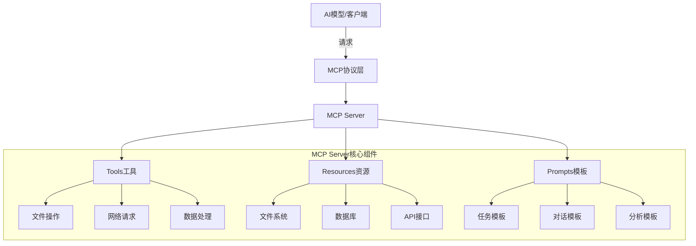
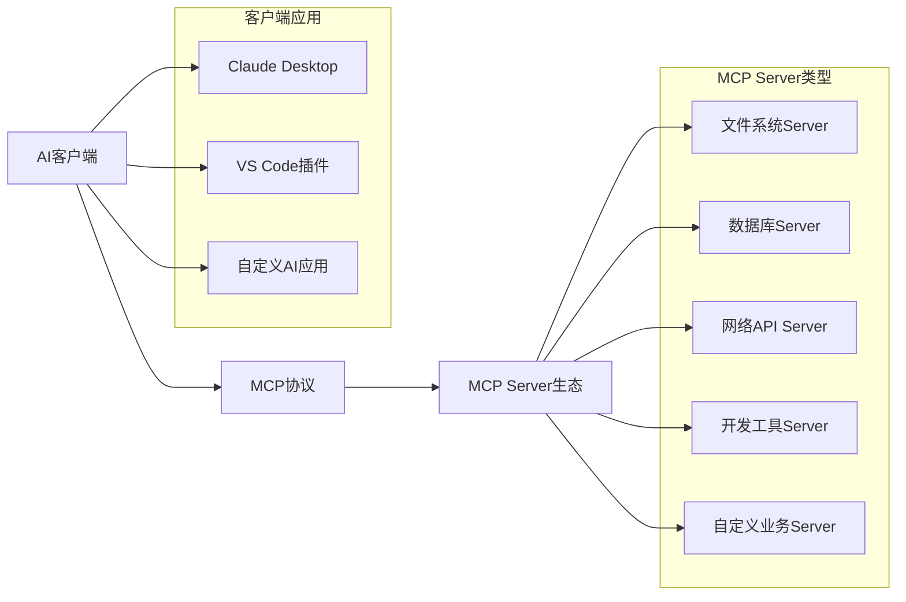

# 第 1 章：MCP协议基础入门

::: tip 学习目标
- 理解MCP协议的基本概念和设计理念
- 掌握MCP协议的架构和核心组件
- 了解MCP与传统API的区别和优势
- 熟悉MCP的应用场景和生态系统
:::

## 知识点总结

### MCP协议概述
- **MCP (Model Context Protocol)** 是一个开放的协议规范，用于在AI应用和外部数据源/工具之间建立标准化的通信接口
- 设计理念：提供统一的方式让AI模型访问各种外部资源和执行工具操作
- 核心目标：简化AI应用的集成复杂度，提高开发效率

### MCP架构组件



### 核心概念

| 概念 | 说明 | 作用 |
|------|------|------|
| **Tools** | AI可调用的功能工具 | 让AI执行具体操作（文件读写、计算等） |
| **Resources** | AI可访问的数据资源 | 为AI提供上下文信息和数据 |
| **Prompts** | 可复用的提示模板 | 标准化AI交互模式 |
| **Server** | MCP服务端实现 | 管理和提供上述三种功能 |

### MCP vs 传统API对比

::: note 主要区别
**传统REST API:**
- 单一请求-响应模式
- 需要手动处理认证、错误等
- 每个API都有不同的接口规范
- 集成复杂度高

**MCP协议:**
- 标准化的协议规范
- 统一的认证和错误处理机制
- 支持流式数据和实时通信
- 专为AI应用场景优化
:::

## 示例代码

### 基本MCP消息格式
```python
# MCP协议基本消息结构
import json

# 请求消息格式
mcp_request = {
    "jsonrpc": "2.0",
    "id": 1,
    "method": "tools/call",
    "params": {
        "name": "read_file",
        "arguments": {
            "path": "/path/to/file.txt"
        }
    }
}

# 响应消息格式
mcp_response = {
    "jsonrpc": "2.0",
    "id": 1,
    "result": {
        "content": [
            {
                "type": "text",
                "text": "文件内容..."
            }
        ]
    }
}

print("MCP请求:", json.dumps(mcp_request, indent=2, ensure_ascii=False))
print("MCP响应:", json.dumps(mcp_response, indent=2, ensure_ascii=False))
```

### MCP协议优势演示
```python
# 传统方式：需要处理多种不同的API
import requests
import sqlite3
import os

class TraditionalApproach:
    def __init__(self):
        self.api_keys = {}
        self.db_connections = {}
    
    def read_file(self, path):
        # 需要手动处理文件操作
        try:
            with open(path, 'r', encoding='utf-8') as f:
                return f.read()
        except Exception as e:
            return f"Error: {e}"
    
    def query_database(self, query):
        # 需要手动管理数据库连接
        try:
            conn = sqlite3.connect('example.db')
            cursor = conn.execute(query)
            return cursor.fetchall()
        except Exception as e:
            return f"Error: {e}"
        finally:
            conn.close()
    
    def call_api(self, url, headers):
        # 需要手动处理HTTP请求
        try:
            response = requests.get(url, headers=headers)
            return response.json()
        except Exception as e:
            return f"Error: {e}"

# MCP方式：统一的接口
class MCPApproach:
    def __init__(self, mcp_server):
        self.server = mcp_server
    
    def execute_tool(self, tool_name, params):
        """统一的工具调用接口"""
        request = {
            "jsonrpc": "2.0",
            "method": "tools/call",
            "params": {
                "name": tool_name,
                "arguments": params
            }
        }
        return self.server.handle_request(request)
    
    # 所有操作都通过统一接口
    def read_file(self, path):
        return self.execute_tool("read_file", {"path": path})
    
    def query_database(self, query):
        return self.execute_tool("db_query", {"query": query})
    
    def call_api(self, url):
        return self.execute_tool("http_get", {"url": url})

# 使用示例
traditional = TraditionalApproach()
print("传统方式需要学习多种不同的API和错误处理机制")

# MCP方式只需要学习一套协议
mcp = MCPApproach(None)  # 实际使用时传入真实的MCP服务器
print("MCP方式提供统一的调用接口")
```

## 应用场景

### 典型使用场景

::: warning 重要应用场景
1. **文档处理系统** - AI需要读取、分析、生成各种格式的文档
2. **数据分析平台** - AI需要访问数据库、执行查询、生成报告
3. **开发助手工具** - AI需要读写代码文件、执行构建命令、管理项目
4. **内容管理系统** - AI需要管理文件、处理媒体资源、发布内容
5. **业务流程自动化** - AI需要调用各种业务API、处理工作流
:::

### 生态系统组成



## 技术理解

::: note 设计原则
MCP协议的设计遵循以下核心原则：

1. **标准化** - 统一的消息格式和交互模式
2. **可扩展** - 支持自定义工具和资源类型
3. **安全性** - 内置权限控制和安全机制
4. **高效性** - 优化的数据传输和缓存机制
5. **简洁性** - 降低集成和使用复杂度
:::

### 协议优势总结

| 优势 | 说明 | 价值 |
|------|------|------|
| **开发效率** | 统一接口减少学习成本 | 加速AI应用开发 |
| **可维护性** | 标准化的错误处理和日志 | 降低运维成本 |
| **可扩展性** | 插件化架构支持自定义功能 | 适应不同业务需求 |
| **互操作性** | 不同AI模型可使用同一套工具 | 提高生态系统价值 |
| **安全性** | 内置权限控制和审计机制 | 保障企业级应用安全 |

通过本章学习，我们了解了MCP协议的基本概念、架构设计和核心优势，为后续深入学习MCP Server开发奠定了理论基础。