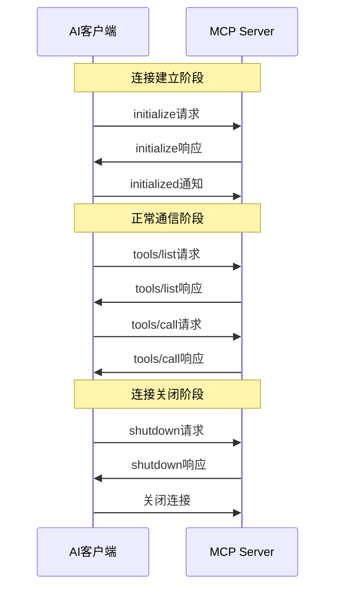

# 第 3 章：MCP协议规范详解

::: tip 学习目标
- 深入理解MCP协议的消息格式
- 掌握请求-响应模式和事件流
- 学习协议的版本控制和兼容性
- 理解错误处理和异常情况
- 掌握协议扩展机制
:::

## 知识点总结

### MCP协议基础架构

MCP (Model Context Protocol) 基于 **JSON-RPC 2.0** 协议构建，采用双向通信模式，支持请求-响应和通知两种消息类型。



### 消息格式规范

| 消息类型 | 格式要求 | 必需字段 | 可选字段 |
|----------|----------|----------|----------|
| **请求消息** | JSON-RPC 2.0 Request | `jsonrpc`, `method`, `id` | `params` |
| **响应消息** | JSON-RPC 2.0 Response | `jsonrpc`, `id` | `result` 或 `error` |
| **通知消息** | JSON-RPC 2.0 Notification | `jsonrpc`, `method` | `params` |
| **错误消息** | JSON-RPC 2.0 Error | `jsonrpc`, `id`, `error` | - |

## 协议消息详解

### 1. 基本消息结构

```python
# MCP协议消息结构示例
import json
from typing import Dict, Any, Optional, Union
from enum import Enum

class MCPMessageType(Enum):
    REQUEST = "request"
    RESPONSE = "response" 
    NOTIFICATION = "notification"
    ERROR = "error"

class MCPMessage:
    """MCP协议消息基类"""
    
    def __init__(self, jsonrpc: str = "2.0"):
        self.jsonrpc = jsonrpc
    
    def to_dict(self) -> Dict[str, Any]:
        return {"jsonrpc": self.jsonrpc}

class MCPRequest(MCPMessage):
    """MCP请求消息"""
    
    def __init__(self, method: str, id: Union[str, int], params: Optional[Dict] = None):
        super().__init__()
        self.method = method
        self.id = id
        self.params = params or {}
    
    def to_dict(self) -> Dict[str, Any]:
        result = super().to_dict()
        result.update({
            "method": self.method,
            "id": self.id,
            "params": self.params
        })
        return result

class MCPResponse(MCPMessage):
    """MCP响应消息"""
    
    def __init__(self, id: Union[str, int], result: Optional[Dict] = None, error: Optional[Dict] = None):
        super().__init__()
        self.id = id
        self.result = result
        self.error = error
    
    def to_dict(self) -> Dict[str, Any]:
        result = super().to_dict()
        result["id"] = self.id
        
        if self.error:
            result["error"] = self.error
        else:
            result["result"] = self.result or {}
        
        return result

class MCPNotification(MCPMessage):
    """MCP通知消息"""
    
    def __init__(self, method: str, params: Optional[Dict] = None):
        super().__init__()
        self.method = method
        self.params = params or {}
    
    def to_dict(self) -> Dict[str, Any]:
        result = super().to_dict()
        result.update({
            "method": self.method,
            "params": self.params
        })
        return result

# 示例使用
request = MCPRequest("tools/list", 1)
response = MCPResponse(1, {"tools": []})
notification = MCPNotification("initialized")

print("请求消息:", json.dumps(request.to_dict(), indent=2, ensure_ascii=False))
print("响应消息:", json.dumps(response.to_dict(), indent=2, ensure_ascii=False))
print("通知消息:", json.dumps(notification.to_dict(), indent=2, ensure_ascii=False))
```

### 2. 协议生命周期

```python
# MCP协议生命周期管理
from enum import Enum
from typing import List, Callable
import asyncio

class MCPConnectionState(Enum):
    DISCONNECTED = "disconnected"
    CONNECTING = "connecting"
    CONNECTED = "connected"
    INITIALIZING = "initializing"
    READY = "ready"
    SHUTTING_DOWN = "shutting_down"

class MCPLifecycleManager:
    """MCP协议生命周期管理器"""
    
    def __init__(self):
        self.state = MCPConnectionState.DISCONNECTED
        self.capabilities = {
            "tools": {},
            "resources": {},
            "prompts": {},
            "logging": {}
        }
        self.client_info = {}
        self.server_info = {}
    
    async def initialize(self, client_info: Dict[str, Any]):
        """初始化协议连接"""
        self.state = MCPConnectionState.INITIALIZING
        self.client_info = client_info
        
        # 模拟初始化过程
        print(f"🔄 初始化MCP连接...")
        print(f"客户端信息: {client_info}")
        
        # 设置服务器信息和能力
        self.server_info = {
            "name": "example-mcp-server",
            "version": "1.0.0",
            "description": "MCP协议示例服务器"
        }
        
        # 返回初始化响应
        init_response = {
            "protocolVersion": "2024-11-05",
            "capabilities": self.capabilities,
            "serverInfo": self.server_info
        }
        
        self.state = MCPConnectionState.READY
        print(f"✅ MCP连接初始化完成")
        return init_response
    
    def get_initialize_request(self, client_info: Dict[str, Any]) -> MCPRequest:
        """生成初始化请求"""
        return MCPRequest(
            method="initialize",
            id="init-1",
            params={
                "protocolVersion": "2024-11-05",
                "capabilities": {
                    "roots": {"listChanged": True},
                    "sampling": {}
                },
                "clientInfo": client_info
            }
        )
    
    def get_initialized_notification(self) -> MCPNotification:
        """生成初始化完成通知"""
        return MCPNotification("initialized")
    
    async def shutdown(self):
        """关闭协议连接"""
        self.state = MCPConnectionState.SHUTTING_DOWN
        print("🔄 正在关闭MCP连接...")
        
        # 清理资源
        self.capabilities.clear()
        self.client_info.clear()
        self.server_info.clear()
        
        self.state = MCPConnectionState.DISCONNECTED
        print("✅ MCP连接已关闭")

# 生命周期示例
async def lifecycle_example():
    manager = MCPLifecycleManager()
    
    # 1. 初始化
    client_info = {
        "name": "example-client",
        "version": "1.0.0"
    }
    
    init_request = manager.get_initialize_request(client_info)
    print("发送初始化请求:", json.dumps(init_request.to_dict(), indent=2, ensure_ascii=False))
    
    # 2. 处理初始化
    init_response = await manager.initialize(client_info)
    print("初始化响应:", json.dumps(init_response, indent=2, ensure_ascii=False))
    
    # 3. 发送初始化完成通知
    initialized_notif = manager.get_initialized_notification()
    print("发送初始化完成通知:", json.dumps(initialized_notif.to_dict(), indent=2, ensure_ascii=False))
    
    # 4. 关闭连接
    await manager.shutdown()

# 运行示例
# asyncio.run(lifecycle_example())
print("协议生命周期管理器已准备就绪")
```

### 3. 错误处理规范

```python
# MCP协议错误处理
from typing import Optional

class MCPErrorCode:
    """MCP标准错误码"""
    # JSON-RPC标准错误码
    PARSE_ERROR = -32700
    INVALID_REQUEST = -32600
    METHOD_NOT_FOUND = -32601
    INVALID_PARAMS = -32602
    INTERNAL_ERROR = -32603
    
    # MCP特定错误码
    INVALID_TOOL = -32000
    TOOL_EXECUTION_ERROR = -32001
    RESOURCE_NOT_FOUND = -32002
    RESOURCE_ACCESS_DENIED = -32003
    PROMPT_NOT_FOUND = -32004
    INVALID_PROMPT_ARGUMENTS = -32005

class MCPError(Exception):
    """MCP协议错误"""
    
    def __init__(self, code: int, message: str, data: Optional[Dict] = None):
        super().__init__(message)
        self.code = code
        self.message = message
        self.data = data or {}
    
    def to_dict(self) -> Dict[str, Any]:
        error = {
            "code": self.code,
            "message": self.message
        }
        if self.data:
            error["data"] = self.data
        return error

class MCPErrorHandler:
    """MCP错误处理器"""
    
    @staticmethod
    def create_error_response(request_id: Union[str, int], error: MCPError) -> MCPResponse:
        """创建错误响应"""
        return MCPResponse(id=request_id, error=error.to_dict())
    
    @staticmethod
    def handle_parse_error() -> MCPError:
        """处理解析错误"""
        return MCPError(
            MCPErrorCode.PARSE_ERROR,
            "Parse error",
            {"description": "JSON解析失败"}
        )
    
    @staticmethod
    def handle_invalid_request(details: str = "") -> MCPError:
        """处理无效请求"""
        return MCPError(
            MCPErrorCode.INVALID_REQUEST,
            "Invalid Request",
            {"description": f"请求格式无效: {details}"}
        )
    
    @staticmethod
    def handle_method_not_found(method: str) -> MCPError:
        """处理方法未找到"""
        return MCPError(
            MCPErrorCode.METHOD_NOT_FOUND,
            "Method not found",
            {"method": method, "description": f"方法 '{method}' 不存在"}
        )
    
    @staticmethod
    def handle_invalid_params(method: str, details: str = "") -> MCPError:
        """处理参数无效"""
        return MCPError(
            MCPErrorCode.INVALID_PARAMS,
            "Invalid params",
            {"method": method, "description": f"参数无效: {details}"}
        )
    
    @staticmethod
    def handle_tool_error(tool_name: str, error_msg: str) -> MCPError:
        """处理工具执行错误"""
        return MCPError(
            MCPErrorCode.TOOL_EXECUTION_ERROR,
            "Tool execution error",
            {
                "tool": tool_name,
                "error": error_msg,
                "description": f"工具 '{tool_name}' 执行失败: {error_msg}"
            }
        )

# 错误处理示例
def error_handling_examples():
    """错误处理示例"""
    handler = MCPErrorHandler()
    
    # 1. 方法未找到错误
    method_error = handler.handle_method_not_found("unknown/method")
    error_response = handler.create_error_response("req-1", method_error)
    print("方法未找到错误响应:")
    print(json.dumps(error_response.to_dict(), indent=2, ensure_ascii=False))
    
    # 2. 工具执行错误
    tool_error = handler.handle_tool_error("file_reader", "文件不存在")
    tool_error_response = handler.create_error_response("req-2", tool_error)
    print("\\n工具执行错误响应:")
    print(json.dumps(tool_error_response.to_dict(), indent=2, ensure_ascii=False))
    
    # 3. 参数无效错误
    param_error = handler.handle_invalid_params("tools/call", "缺少必需参数 'name'")
    param_error_response = handler.create_error_response("req-3", param_error)
    print("\\n参数无效错误响应:")
    print(json.dumps(param_error_response.to_dict(), indent=2, ensure_ascii=False))

error_handling_examples()
```

## 协议扩展机制

### 自定义能力扩展

::: note 扩展原则
MCP协议支持通过以下方式进行扩展：
1. **自定义方法** - 添加新的RPC方法
2. **能力声明** - 在capabilities中声明自定义能力
3. **参数扩展** - 扩展现有方法的参数
4. **元数据注解** - 添加额外的元数据信息
:::

```python
# 协议扩展示例
class MCPExtension:
    """MCP协议扩展"""
    
    def __init__(self, name: str, version: str):
        self.name = name
        self.version = version
        self.custom_capabilities = {}
        self.custom_methods = {}
    
    def register_capability(self, capability_name: str, capability_spec: Dict):
        """注册自定义能力"""
        self.custom_capabilities[capability_name] = capability_spec
        print(f"✅ 注册自定义能力: {capability_name}")
    
    def register_method(self, method_name: str, handler: Callable):
        """注册自定义方法"""
        self.custom_methods[method_name] = handler
        print(f"✅ 注册自定义方法: {method_name}")
    
    def get_extended_capabilities(self) -> Dict:
        """获取扩展后的能力声明"""
        base_capabilities = {
            "tools": {},
            "resources": {},
            "prompts": {}
        }
        
        # 添加扩展能力
        base_capabilities.update(self.custom_capabilities)
        
        # 添加扩展元数据
        base_capabilities["extensions"] = {
            self.name: {
                "version": self.version,
                "methods": list(self.custom_methods.keys()),
                "capabilities": list(self.custom_capabilities.keys())
            }
        }
        
        return base_capabilities

# 扩展示例：添加数据库查询能力
def create_database_extension():
    """创建数据库扩展"""
    ext = MCPExtension("database", "1.0.0")
    
    # 注册数据库查询能力
    ext.register_capability("database", {
        "query": True,
        "transaction": True,
        "schema_introspection": True
    })
    
    # 注册数据库相关方法
    def handle_db_query(params):
        return {
            "columns": ["id", "name", "email"],
            "rows": [
                [1, "Alice", "alice@example.com"],
                [2, "Bob", "bob@example.com"]
            ]
        }
    
    def handle_db_schema(params):
        return {
            "tables": ["users", "posts", "comments"],
            "views": ["user_posts"],
            "procedures": ["get_user_stats"]
        }
    
    ext.register_method("database/query", handle_db_query)
    ext.register_method("database/schema", handle_db_schema)
    
    return ext

# 使用扩展
db_ext = create_database_extension()
capabilities = db_ext.get_extended_capabilities()
print("扩展后的能力声明:")
print(json.dumps(capabilities, indent=2, ensure_ascii=False))
```

## 版本控制和兼容性

### 协议版本管理

```python
# 版本兼容性处理
from packaging import version
from typing import Set

class MCPVersionManager:
    """MCP版本管理器"""
    
    SUPPORTED_VERSIONS = ["2024-11-05", "2024-10-07", "2024-09-25"]
    CURRENT_VERSION = "2024-11-05"
    
    @classmethod
    def is_version_supported(cls, protocol_version: str) -> bool:
        """检查协议版本是否支持"""
        return protocol_version in cls.SUPPORTED_VERSIONS
    
    @classmethod
    def get_compatible_features(cls, protocol_version: str) -> Set[str]:
        """获取版本支持的特性"""
        features = set()
        
        # 基础特性 (所有版本)
        features.update(["tools", "resources", "prompts"])
        
        # 2024-10-07 新增特性
        if version.parse(protocol_version) >= version.parse("2024-10-07"):
            features.update(["logging", "progress"])
        
        # 2024-11-05 新增特性
        if version.parse(protocol_version) >= version.parse("2024-11-05"):
            features.update(["sampling", "roots"])
        
        return features
    
    @classmethod
    def negotiate_version(cls, client_version: str) -> str:
        """协商协议版本"""
        if cls.is_version_supported(client_version):
            return client_version
        
        # 选择最高的兼容版本
        compatible_versions = [v for v in cls.SUPPORTED_VERSIONS 
                             if version.parse(v) <= version.parse(client_version)]
        
        if compatible_versions:
            return max(compatible_versions, key=version.parse)
        
        # 使用最低支持版本
        return min(cls.SUPPORTED_VERSIONS, key=version.parse)

# 版本兼容性示例
def version_compatibility_example():
    """版本兼容性示例"""
    vm = MCPVersionManager()
    
    test_versions = ["2024-11-05", "2024-10-07", "2024-12-01", "2024-08-01"]
    
    for test_version in test_versions:
        print(f"\\n测试版本: {test_version}")
        
        if vm.is_version_supported(test_version):
            print(f"✅ 直接支持版本 {test_version}")
            negotiated = test_version
        else:
            negotiated = vm.negotiate_version(test_version)
            print(f"🔄 协商版本: {test_version} -> {negotiated}")
        
        features = vm.get_compatible_features(negotiated)
        print(f"📋 支持特性: {', '.join(sorted(features))}")

version_compatibility_example()
```

## 消息传输和序列化

### 传输层抽象

::: warning 传输要求
MCP协议支持多种传输方式：
1. **标准输入输出** - 最常用，适合本地工具集成
2. **HTTP** - 适合网络服务和REST API集成
3. **WebSocket** - 适合实时通信和浏览器集成
4. **TCP Socket** - 适合高性能场景
:::

```python
# 传输层抽象
from abc import ABC, abstractmethod
import json
import asyncio

class MCPTransport(ABC):
    """MCP传输层抽象基类"""
    
    @abstractmethod
    async def send(self, message: Dict[str, Any]) -> None:
        """发送消息"""
        pass
    
    @abstractmethod
    async def receive(self) -> Dict[str, Any]:
        """接收消息"""
        pass
    
    @abstractmethod
    async def close(self) -> None:
        """关闭连接"""
        pass

class StdioTransport(MCPTransport):
    """标准输入输出传输"""
    
    def __init__(self):
        self.reader = None
        self.writer = None
    
    async def initialize(self):
        """初始化stdio传输"""
        self.reader = asyncio.StreamReader()
        protocol = asyncio.StreamReaderProtocol(self.reader)
        await asyncio.get_event_loop().connect_read_pipe(lambda: protocol, sys.stdin)
        
        transport, protocol = await asyncio.get_event_loop().connect_write_pipe(
            lambda: asyncio.StreamReaderProtocol(asyncio.StreamReader()),
            sys.stdout
        )
        self.writer = asyncio.StreamWriter(transport, protocol, self.reader, asyncio.get_event_loop())
    
    async def send(self, message: Dict[str, Any]) -> None:
        """发送JSON消息到stdout"""
        json_str = json.dumps(message, ensure_ascii=False) + "\\n"
        self.writer.write(json_str.encode())
        await self.writer.drain()
    
    async def receive(self) -> Dict[str, Any]:
        """从stdin接收JSON消息"""
        line = await self.reader.readline()
        return json.loads(line.decode().strip())
    
    async def close(self) -> None:
        """关闭传输"""
        if self.writer:
            self.writer.close()
            await self.writer.wait_closed()

class HTTPTransport(MCPTransport):
    """HTTP传输"""
    
    def __init__(self, base_url: str):
        self.base_url = base_url.rstrip('/')
        self.session = None
    
    async def send(self, message: Dict[str, Any]) -> None:
        """发送HTTP POST请求"""
        import aiohttp
        if not self.session:
            self.session = aiohttp.ClientSession()
        
        async with self.session.post(
            f"{self.base_url}/mcp", 
            json=message,
            headers={"Content-Type": "application/json"}
        ) as response:
            if response.status != 200:
                raise MCPError(-32603, f"HTTP error: {response.status}")
    
    async def receive(self) -> Dict[str, Any]:
        """HTTP传输中接收通常通过回调处理"""
        # HTTP是请求-响应模式，通常不需要主动接收
        raise NotImplementedError("HTTP传输使用请求-响应模式")
    
    async def close(self) -> None:
        """关闭HTTP会话"""
        if self.session:
            await self.session.close()

# 传输层使用示例
async def transport_example():
    """传输层使用示例"""
    
    # 使用stdio传输
    stdio_transport = StdioTransport()
    # await stdio_transport.initialize()  # 实际使用时取消注释
    
    # 示例消息
    test_message = {
        "jsonrpc": "2.0",
        "method": "tools/list",
        "id": 1
    }
    
    print("传输层示例消息:")
    print(json.dumps(test_message, indent=2, ensure_ascii=False))
    
    # HTTP传输示例
    http_transport = HTTPTransport("http://localhost:3000")
    print("\\nHTTP传输已配置")

# 运行示例
# asyncio.run(transport_example())
print("传输层抽象已准备就绪")
```

通过本章学习，我们深入了解了MCP协议的技术规范，包括消息格式、生命周期管理、错误处理、扩展机制和版本兼容性。这些知识为后续实现具体的MCP Server功能提供了坚实的协议基础。