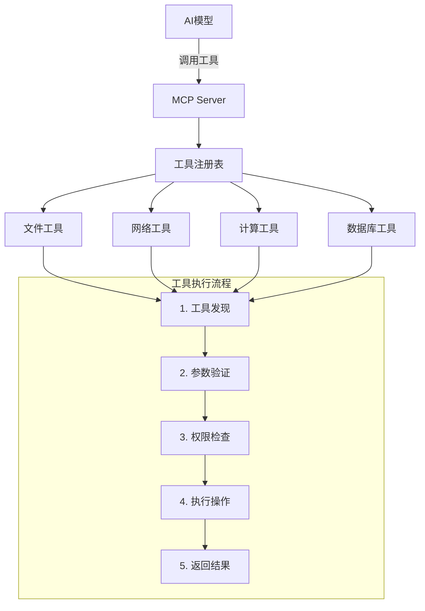

# 第 4 章：Tools工具开发

::: tip 学习目标
- 理解Tools的概念和作用机制
- 学会定义工具的schema和参数
- 掌握工具的执行和结果返回
- 实现常用的工具类型（文件操作、网络请求等）
- 学习工具的错误处理和验证
:::

## 知识点总结

### Tools概念解析

**Tools** 是MCP协议的核心功能之一，允许AI模型调用外部工具来执行具体操作。Tools提供了一种标准化的方式，让AI能够与外部系统交互。



### 工具类型分类

| 工具类型 | 主要功能 | 应用场景 | 安全级别 |
|----------|----------|----------|----------|
| **文件操作** | 读写、创建、删除文件 | 文档处理、配置管理 | 中等 |
| **网络请求** | HTTP/API调用 | 数据获取、服务集成 | 高 |
| **系统命令** | 执行系统命令 | 构建、部署、监控 | 极高 |
| **数据处理** | 计算、转换、分析 | 数据科学、报表生成 | 低 |
| **数据库操作** | 查询、更新数据库 | 数据管理、分析 | 高 |

### 工具Schema规范

::: note Schema要素
每个工具必须定义：
1. **name** - 工具的唯一标识符
2. **description** - 工具功能描述
3. **inputSchema** - 输入参数的JSON Schema
4. **metadata** - 可选的元数据信息
:::

## 工具开发实践

### 1. 基础工具框架

```python
# 基础工具开发框架
import json
import asyncio
from typing import Dict, Any, List, Optional, Callable
from abc import ABC, abstractmethod
import jsonschema
from jsonschema import validate, ValidationError

class ToolResult:
    """工具执行结果"""
    
    def __init__(self, content: List[Dict[str, Any]], is_error: bool = False):
        self.content = content
        self.is_error = is_error
    
    def to_dict(self) -> Dict[str, Any]:
        return {
            "content": self.content,
            "isError": self.is_error
        }

class MCPTool(ABC):
    """MCP工具基类"""
    
    def __init__(self, name: str, description: str, input_schema: Dict[str, Any]):
        self.name = name
        self.description = description
        self.input_schema = input_schema
        self.metadata = {}
    
    @abstractmethod
    async def execute(self, arguments: Dict[str, Any]) -> ToolResult:
        """执行工具逻辑"""
        pass
    
    def validate_arguments(self, arguments: Dict[str, Any]) -> bool:
        """验证参数是否符合schema"""
        try:
            validate(instance=arguments, schema=self.input_schema)
            return True
        except ValidationError as e:
            raise ValueError(f"参数验证失败: {e.message}")
    
    def get_definition(self) -> Dict[str, Any]:
        """获取工具定义"""
        definition = {
            "name": self.name,
            "description": self.description,
            "inputSchema": self.input_schema
        }
        if self.metadata:
            definition["metadata"] = self.metadata
        return definition

class ToolRegistry:
    """工具注册表"""
    
    def __init__(self):
        self.tools: Dict[str, MCPTool] = {}
    
    def register(self, tool: MCPTool) -> None:
        """注册工具"""
        self.tools[tool.name] = tool
        print(f"✅ 注册工具: {tool.name}")
    
    def get_tool(self, name: str) -> Optional[MCPTool]:
        """获取工具"""
        return self.tools.get(name)
    
    def list_tools(self) -> List[Dict[str, Any]]:
        """列出所有工具"""
        return [tool.get_definition() for tool in self.tools.values()]
    
    async def execute_tool(self, name: str, arguments: Dict[str, Any]) -> ToolResult:
        """执行工具"""
        tool = self.get_tool(name)
        if not tool:
            return ToolResult([{
                "type": "text",
                "text": f"工具 '{name}' 不存在"
            }], is_error=True)
        
        try:
            # 验证参数
            tool.validate_arguments(arguments)
            
            # 执行工具
            result = await tool.execute(arguments)
            return result
            
        except Exception as e:
            return ToolResult([{
                "type": "text", 
                "text": f"工具执行失败: {str(e)}"
            }], is_error=True)

# 创建全局工具注册表
tool_registry = ToolRegistry()
```

### 2. 文件操作工具

```python
# 文件操作工具实现
import os
import pathlib
from typing import Union

class FileReadTool(MCPTool):
    """文件读取工具"""
    
    def __init__(self):
        super().__init__(
            name="file_read",
            description="读取指定文件的内容",
            input_schema={
                "type": "object",
                "properties": {
                    "path": {
                        "type": "string",
                        "description": "要读取的文件路径"
                    },
                    "encoding": {
                        "type": "string", 
                        "description": "文件编码",
                        "default": "utf-8"
                    }
                },
                "required": ["path"]
            }
        )
        self.metadata = {
            "category": "file_operations",
            "risk_level": "medium"
        }
    
    async def execute(self, arguments: Dict[str, Any]) -> ToolResult:
        """执行文件读取"""
        path = arguments["path"]
        encoding = arguments.get("encoding", "utf-8")
        
        try:
            # 安全检查：防止路径遍历攻击
            normalized_path = os.path.normpath(path)
            if ".." in normalized_path:
                raise ValueError("不安全的文件路径")
            
            # 检查文件是否存在
            if not os.path.exists(normalized_path):
                raise FileNotFoundError(f"文件不存在: {normalized_path}")
            
            # 读取文件内容
            with open(normalized_path, 'r', encoding=encoding) as file:
                content = file.read()
            
            return ToolResult([{
                "type": "text",
                "text": content
            }])
            
        except Exception as e:
            return ToolResult([{
                "type": "text",
                "text": f"读取文件失败: {str(e)}"
            }], is_error=True)

class FileWriteTool(MCPTool):
    """文件写入工具"""
    
    def __init__(self):
        super().__init__(
            name="file_write",
            description="向指定文件写入内容",
            input_schema={
                "type": "object",
                "properties": {
                    "path": {
                        "type": "string",
                        "description": "要写入的文件路径"
                    },
                    "content": {
                        "type": "string",
                        "description": "要写入的内容"
                    },
                    "encoding": {
                        "type": "string",
                        "description": "文件编码",
                        "default": "utf-8"
                    },
                    "append": {
                        "type": "boolean",
                        "description": "是否追加模式",
                        "default": False
                    }
                },
                "required": ["path", "content"]
            }
        )
        self.metadata = {
            "category": "file_operations",
            "risk_level": "high"
        }
    
    async def execute(self, arguments: Dict[str, Any]) -> ToolResult:
        """执行文件写入"""
        path = arguments["path"]
        content = arguments["content"]
        encoding = arguments.get("encoding", "utf-8")
        append_mode = arguments.get("append", False)
        
        try:
            # 安全检查
            normalized_path = os.path.normpath(path)
            if ".." in normalized_path:
                raise ValueError("不安全的文件路径")
            
            # 确保目录存在
            directory = os.path.dirname(normalized_path)
            if directory and not os.path.exists(directory):
                os.makedirs(directory, exist_ok=True)
            
            # 写入文件
            mode = 'a' if append_mode else 'w'
            with open(normalized_path, mode, encoding=encoding) as file:
                file.write(content)
            
            operation = "追加到" if append_mode else "写入到"
            return ToolResult([{
                "type": "text",
                "text": f"成功{operation}文件: {normalized_path}"
            }])
            
        except Exception as e:
            return ToolResult([{
                "type": "text",
                "text": f"写入文件失败: {str(e)}"
            }], is_error=True)

class FileListTool(MCPTool):
    """文件列表工具"""
    
    def __init__(self):
        super().__init__(
            name="file_list",
            description="列出指定目录下的文件和文件夹",
            input_schema={
                "type": "object",
                "properties": {
                    "path": {
                        "type": "string",
                        "description": "要列出的目录路径",
                        "default": "."
                    },
                    "include_hidden": {
                        "type": "boolean",
                        "description": "是否包含隐藏文件",
                        "default": False
                    },
                    "recursive": {
                        "type": "boolean",
                        "description": "是否递归列出子目录",
                        "default": False
                    }
                }
            }
        )
        self.metadata = {
            "category": "file_operations",
            "risk_level": "low"
        }
    
    async def execute(self, arguments: Dict[str, Any]) -> ToolResult:
        """执行文件列表"""
        path = arguments.get("path", ".")
        include_hidden = arguments.get("include_hidden", False)
        recursive = arguments.get("recursive", False)
        
        try:
            normalized_path = os.path.normpath(path)
            if not os.path.exists(normalized_path):
                raise FileNotFoundError(f"目录不存在: {normalized_path}")
            
            if not os.path.isdir(normalized_path):
                raise ValueError(f"路径不是目录: {normalized_path}")
            
            files_info = []
            
            if recursive:
                for root, dirs, files in os.walk(normalized_path):
                    # 处理目录
                    for dir_name in dirs:
                        if include_hidden or not dir_name.startswith('.'):
                            full_path = os.path.join(root, dir_name)
                            rel_path = os.path.relpath(full_path, normalized_path)
                            files_info.append({
                                "name": rel_path,
                                "type": "directory",
                                "size": None
                            })
                    
                    # 处理文件
                    for file_name in files:
                        if include_hidden or not file_name.startswith('.'):
                            full_path = os.path.join(root, file_name)
                            rel_path = os.path.relpath(full_path, normalized_path)
                            stat_info = os.stat(full_path)
                            files_info.append({
                                "name": rel_path,
                                "type": "file",
                                "size": stat_info.st_size,
                                "modified": stat_info.st_mtime
                            })
            else:
                for item in os.listdir(normalized_path):
                    if include_hidden or not item.startswith('.'):
                        item_path = os.path.join(normalized_path, item)
                        stat_info = os.stat(item_path)
                        
                        files_info.append({
                            "name": item,
                            "type": "directory" if os.path.isdir(item_path) else "file",
                            "size": stat_info.st_size if os.path.isfile(item_path) else None,
                            "modified": stat_info.st_mtime
                        })
            
            # 按名称排序
            files_info.sort(key=lambda x: x["name"])
            
            # 格式化输出
            result_text = f"目录: {normalized_path}\\n"
            result_text += f"共找到 {len(files_info)} 个项目\\n\\n"
            
            for info in files_info:
                type_icon = "📁" if info["type"] == "directory" else "📄"
                size_info = f" ({info['size']} bytes)" if info["size"] is not None else ""
                result_text += f"{type_icon} {info['name']}{size_info}\\n"
            
            return ToolResult([{
                "type": "text",
                "text": result_text
            }])
            
        except Exception as e:
            return ToolResult([{
                "type": "text",
                "text": f"列出文件失败: {str(e)}"
            }], is_error=True)

# 注册文件操作工具
file_read_tool = FileReadTool()
file_write_tool = FileWriteTool()
file_list_tool = FileListTool()

tool_registry.register(file_read_tool)
tool_registry.register(file_write_tool)
tool_registry.register(file_list_tool)
```

### 3. 网络请求工具

```python
# 网络请求工具实现
import aiohttp
import json
from urllib.parse import urlparse

class HTTPRequestTool(MCPTool):
    """HTTP请求工具"""
    
    def __init__(self):
        super().__init__(
            name="http_request",
            description="发送HTTP请求并返回响应",
            input_schema={
                "type": "object",
                "properties": {
                    "url": {
                        "type": "string",
                        "description": "请求URL"
                    },
                    "method": {
                        "type": "string",
                        "description": "HTTP方法",
                        "enum": ["GET", "POST", "PUT", "DELETE", "PATCH"],
                        "default": "GET"
                    },
                    "headers": {
                        "type": "object",
                        "description": "请求头",
                        "default": {}
                    },
                    "data": {
                        "type": "object",
                        "description": "请求数据（JSON）"
                    },
                    "timeout": {
                        "type": "number",
                        "description": "超时时间（秒）",
                        "default": 30
                    }
                },
                "required": ["url"]
            }
        )
        self.metadata = {
            "category": "network",
            "risk_level": "high"
        }
    
    async def execute(self, arguments: Dict[str, Any]) -> ToolResult:
        """执行HTTP请求"""
        url = arguments["url"]
        method = arguments.get("method", "GET").upper()
        headers = arguments.get("headers", {})
        data = arguments.get("data")
        timeout = arguments.get("timeout", 30)
        
        try:
            # URL安全检查
            parsed_url = urlparse(url)
            if parsed_url.scheme not in ['http', 'https']:
                raise ValueError("只支持HTTP/HTTPS协议")
            
            # 设置默认User-Agent
            if 'User-Agent' not in headers:
                headers['User-Agent'] = 'MCP-Server/1.0'
            
            async with aiohttp.ClientSession(timeout=aiohttp.ClientTimeout(total=timeout)) as session:
                async with session.request(
                    method=method,
                    url=url,
                    headers=headers,
                    json=data if data else None
                ) as response:
                    
                    # 获取响应内容
                    content_type = response.headers.get('Content-Type', '')
                    
                    if 'application/json' in content_type:
                        response_data = await response.json()
                        response_text = json.dumps(response_data, indent=2, ensure_ascii=False)
                    else:
                        response_text = await response.text()
                    
                    # 构建结果
                    result_content = []
                    
                    # 状态信息
                    status_text = f"HTTP {response.status} {response.reason}\\n"
                    status_text += f"URL: {url}\\n"
                    status_text += f"方法: {method}\\n"
                    status_text += f"Content-Type: {content_type}\\n\\n"
                    
                    result_content.append({
                        "type": "text",
                        "text": status_text
                    })
                    
                    # 响应体
                    if response_text:
                        result_content.append({
                            "type": "text",
                            "text": f"响应内容:\\n{response_text}"
                        })
                    
                    return ToolResult(result_content)
        
        except Exception as e:
            return ToolResult([{
                "type": "text",
                "text": f"HTTP请求失败: {str(e)}"
            }], is_error=True)

class WebScrapeTool(MCPTool):
    """网页抓取工具"""
    
    def __init__(self):
        super().__init__(
            name="web_scrape",
            description="抓取网页内容并提取文本",
            input_schema={
                "type": "object",
                "properties": {
                    "url": {
                        "type": "string",
                        "description": "要抓取的网页URL"
                    },
                    "selector": {
                        "type": "string",
                        "description": "CSS选择器（可选）"
                    },
                    "extract_links": {
                        "type": "boolean",
                        "description": "是否提取链接",
                        "default": False
                    }
                },
                "required": ["url"]
            }
        )
        self.metadata = {
            "category": "network",
            "risk_level": "high"
        }
    
    async def execute(self, arguments: Dict[str, Any]) -> ToolResult:
        """执行网页抓取"""
        url = arguments["url"]
        selector = arguments.get("selector")
        extract_links = arguments.get("extract_links", False)
        
        try:
            from bs4 import BeautifulSoup
            
            # 发送HTTP请求
            async with aiohttp.ClientSession() as session:
                async with session.get(url) as response:
                    if response.status != 200:
                        raise Exception(f"HTTP {response.status}: {response.reason}")
                    
                    html_content = await response.text()
            
            # 解析HTML
            soup = BeautifulSoup(html_content, 'html.parser')
            
            result_content = []
            
            # 基本信息
            title = soup.find('title')
            if title:
                result_content.append({
                    "type": "text",
                    "text": f"页面标题: {title.get_text()}\\n"
                })
            
            # 根据选择器提取内容
            if selector:
                elements = soup.select(selector)
                if elements:
                    content_text = "\\n".join([elem.get_text().strip() for elem in elements])
                    result_content.append({
                        "type": "text",
                        "text": f"选择器 '{selector}' 匹配内容:\\n{content_text}"
                    })
                else:
                    result_content.append({
                        "type": "text",
                        "text": f"选择器 '{selector}' 未找到匹配内容"
                    })
            else:
                # 提取主要文本内容
                main_text = soup.get_text()
                # 清理多余空白
                cleaned_text = '\\n'.join(line.strip() for line in main_text.split('\\n') if line.strip())
                result_content.append({
                    "type": "text",
                    "text": f"页面文本内容:\\n{cleaned_text[:2000]}{'...' if len(cleaned_text) > 2000 else ''}"
                })
            
            # 提取链接
            if extract_links:
                links = soup.find_all('a', href=True)
                if links:
                    links_text = "\\n".join([f"- {link.get_text().strip()}: {link['href']}" for link in links[:20]])
                    result_content.append({
                        "type": "text",
                        "text": f"\\n页面链接:\\n{links_text}"
                    })
            
            return ToolResult(result_content)
            
        except ImportError:
            return ToolResult([{
                "type": "text",
                "text": "网页抓取需要安装 beautifulsoup4 库: pip install beautifulsoup4"
            }], is_error=True)
        except Exception as e:
            return ToolResult([{
                "type": "text",
                "text": f"网页抓取失败: {str(e)}"
            }], is_error=True)

# 注册网络工具
http_request_tool = HTTPRequestTool()
web_scrape_tool = WebScrapeTool()

tool_registry.register(http_request_tool)
tool_registry.register(web_scrape_tool)
```

### 4. 数据处理工具

```python
# 数据处理工具实现
import json
import csv
import io
from typing import Union

class JSONProcessTool(MCPTool):
    """JSON数据处理工具"""
    
    def __init__(self):
        super().__init__(
            name="json_process",
            description="处理JSON数据：解析、格式化、查询",
            input_schema={
                "type": "object",
                "properties": {
                    "data": {
                        "type": "string",
                        "description": "JSON字符串或数据"
                    },
                    "operation": {
                        "type": "string",
                        "description": "操作类型",
                        "enum": ["parse", "format", "minify", "query"],
                        "default": "format"
                    },
                    "query_path": {
                        "type": "string",
                        "description": "JSONPath查询路径（仅query操作）"
                    },
                    "indent": {
                        "type": "number",
                        "description": "格式化缩进空格数",
                        "default": 2
                    }
                },
                "required": ["data"]
            }
        )
        self.metadata = {
            "category": "data_processing",
            "risk_level": "low"
        }
    
    async def execute(self, arguments: Dict[str, Any]) -> ToolResult:
        """执行JSON处理"""
        data = arguments["data"]
        operation = arguments.get("operation", "format")
        query_path = arguments.get("query_path")
        indent = arguments.get("indent", 2)
        
        try:
            # 解析JSON数据
            if isinstance(data, str):
                json_data = json.loads(data)
            else:
                json_data = data
            
            result_text = ""
            
            if operation == "parse":
                result_text = f"JSON解析成功\\n数据类型: {type(json_data).__name__}\\n"
                if isinstance(json_data, dict):
                    result_text += f"键数量: {len(json_data)}\\n"
                    result_text += f"键列表: {list(json_data.keys())}"
                elif isinstance(json_data, list):
                    result_text += f"数组长度: {len(json_data)}"
            
            elif operation == "format":
                formatted_json = json.dumps(json_data, indent=indent, ensure_ascii=False)
                result_text = f"格式化JSON:\\n{formatted_json}"
            
            elif operation == "minify":
                minified_json = json.dumps(json_data, separators=(',', ':'), ensure_ascii=False)
                result_text = f"压缩JSON:\\n{minified_json}"
            
            elif operation == "query":
                if not query_path:
                    raise ValueError("query操作需要提供query_path参数")
                
                # 简单的JSONPath实现
                result = self._json_path_query(json_data, query_path)
                result_text = f"查询路径 '{query_path}' 结果:\\n{json.dumps(result, indent=2, ensure_ascii=False)}"
            
            return ToolResult([{
                "type": "text",
                "text": result_text
            }])
            
        except json.JSONDecodeError as e:
            return ToolResult([{
                "type": "text",
                "text": f"JSON解析错误: {str(e)}"
            }], is_error=True)
        except Exception as e:
            return ToolResult([{
                "type": "text",
                "text": f"JSON处理失败: {str(e)}"
            }], is_error=True)
    
    def _json_path_query(self, data: Any, path: str) -> Any:
        """简单的JSONPath查询实现"""
        parts = path.strip('$').split('.')
        current = data
        
        for part in parts:
            if part == '':
                continue
            
            if isinstance(current, dict):
                current = current.get(part)
            elif isinstance(current, list) and part.isdigit():
                index = int(part)
                current = current[index] if 0 <= index < len(current) else None
            else:
                return None
        
        return current

class CSVProcessTool(MCPTool):
    """CSV数据处理工具"""
    
    def __init__(self):
        super().__init__(
            name="csv_process",
            description="处理CSV数据：解析、转换、统计",
            input_schema={
                "type": "object",
                "properties": {
                    "data": {
                        "type": "string",
                        "description": "CSV字符串数据"
                    },
                    "operation": {
                        "type": "string",
                        "description": "操作类型",
                        "enum": ["parse", "to_json", "stats", "filter"],
                        "default": "parse"
                    },
                    "delimiter": {
                        "type": "string",
                        "description": "CSV分隔符",
                        "default": ","
                    },
                    "has_header": {
                        "type": "boolean",
                        "description": "是否包含表头",
                        "default": True
                    },
                    "filter_column": {
                        "type": "string",
                        "description": "过滤列名（仅filter操作）"
                    },
                    "filter_value": {
                        "type": "string",
                        "description": "过滤值（仅filter操作）"
                    }
                },
                "required": ["data"]
            }
        )
        self.metadata = {
            "category": "data_processing",
            "risk_level": "low"
        }
    
    async def execute(self, arguments: Dict[str, Any]) -> ToolResult:
        """执行CSV处理"""
        data = arguments["data"]
        operation = arguments.get("operation", "parse")
        delimiter = arguments.get("delimiter", ",")
        has_header = arguments.get("has_header", True)
        filter_column = arguments.get("filter_column")
        filter_value = arguments.get("filter_value")
        
        try:
            # 解析CSV数据
            csv_reader = csv.reader(io.StringIO(data), delimiter=delimiter)
            rows = list(csv_reader)
            
            if not rows:
                raise ValueError("CSV数据为空")
            
            headers = rows[0] if has_header else [f"Column{i+1}" for i in range(len(rows[0]))]
            data_rows = rows[1:] if has_header else rows
            
            result_text = ""
            
            if operation == "parse":
                result_text = f"CSV解析结果:\\n"
                result_text += f"列数: {len(headers)}\\n"
                result_text += f"数据行数: {len(data_rows)}\\n"
                result_text += f"列名: {', '.join(headers)}\\n\\n"
                
                # 显示前5行数据
                result_text += "前5行数据:\\n"
                for i, row in enumerate(data_rows[:5]):
                    result_text += f"行{i+1}: {dict(zip(headers, row))}\\n"
            
            elif operation == "to_json":
                json_data = []
                for row in data_rows:
                    json_data.append(dict(zip(headers, row)))
                
                result_text = f"CSV转JSON结果:\\n{json.dumps(json_data, indent=2, ensure_ascii=False)}"
            
            elif operation == "stats":
                result_text = f"CSV统计信息:\\n"
                result_text += f"总行数: {len(data_rows)}\\n"
                result_text += f"总列数: {len(headers)}\\n\\n"
                
                # 各列统计
                for i, header in enumerate(headers):
                    column_values = [row[i] for row in data_rows if i < len(row)]
                    non_empty = [v for v in column_values if v.strip()]
                    result_text += f"列 '{header}': {len(non_empty)}/{len(column_values)} 非空值\\n"
            
            elif operation == "filter":
                if not filter_column or filter_value is None:
                    raise ValueError("filter操作需要提供filter_column和filter_value参数")
                
                if filter_column not in headers:
                    raise ValueError(f"列 '{filter_column}' 不存在")
                
                column_index = headers.index(filter_column)
                filtered_rows = [row for row in data_rows 
                               if column_index < len(row) and filter_value in row[column_index]]
                
                result_text = f"过滤结果 (列'{filter_column}' 包含 '{filter_value}'):\\n"
                result_text += f"匹配行数: {len(filtered_rows)}\\n\\n"
                
                for i, row in enumerate(filtered_rows[:10]):  # 显示前10行
                    result_text += f"行{i+1}: {dict(zip(headers, row))}\\n"
            
            return ToolResult([{
                "type": "text",
                "text": result_text
            }])
            
        except Exception as e:
            return ToolResult([{
                "type": "text",
                "text": f"CSV处理失败: {str(e)}"
            }], is_error=True)

# 注册数据处理工具
json_process_tool = JSONProcessTool()
csv_process_tool = CSVProcessTool()

tool_registry.register(json_process_tool)
tool_registry.register(csv_process_tool)
```

### 5. 工具测试和验证

```python
# 工具测试框架
async def test_tools():
    """测试所有注册的工具"""
    print("🧪 开始工具测试\\n")
    
    # 1. 测试文件读取工具
    print("📄 测试文件读取工具:")
    result = await tool_registry.execute_tool("file_read", {
        "path": "/etc/hosts"  # 测试读取系统hosts文件
    })
    print(f"结果: {result.to_dict()}\\n")
    
    # 2. 测试HTTP请求工具
    print("🌐 测试HTTP请求工具:")
    result = await tool_registry.execute_tool("http_request", {
        "url": "https://httpbin.org/json",
        "method": "GET"
    })
    print(f"结果: {result.to_dict()}\\n")
    
    # 3. 测试JSON处理工具
    print("📊 测试JSON处理工具:")
    test_json = '{"name": "测试", "data": [1, 2, 3]}'
    result = await tool_registry.execute_tool("json_process", {
        "data": test_json,
        "operation": "format"
    })
    print(f"结果: {result.to_dict()}\\n")
    
    # 4. 测试工具列表
    print("📋 可用工具列表:")
    tools = tool_registry.list_tools()
    for tool in tools:
        print(f"- {tool['name']}: {tool['description']}")
    
    print("\\n✅ 工具测试完成")

# 运行测试（实际使用时取消注释）
# asyncio.run(test_tools())
```

## 工具安全和权限控制

### 安全最佳实践

::: warning 安全考虑
1. **输入验证** - 严格验证所有用户输入
2. **路径安全** - 防止目录遍历攻击
3. **权限控制** - 限制工具的操作范围
4. **资源限制** - 防止资源耗尽攻击
5. **错误处理** - 避免信息泄露
:::

```python
# 权限控制和安全机制
class SecurityPolicy:
    """安全策略"""
    
    def __init__(self):
        self.allowed_paths = ["/tmp", "/home/user"]
        self.blocked_domains = ["localhost", "127.0.0.1"]
        self.max_file_size = 10 * 1024 * 1024  # 10MB
        self.max_request_size = 1024 * 1024    # 1MB
    
    def validate_file_path(self, path: str) -> bool:
        """验证文件路径安全性"""
        normalized = os.path.normpath(path)
        
        # 检查路径遍历
        if ".." in normalized:
            return False
        
        # 检查允许的路径前缀
        return any(normalized.startswith(allowed) for allowed in self.allowed_paths)
    
    def validate_url(self, url: str) -> bool:
        """验证URL安全性"""
        parsed = urlparse(url)
        
        # 检查协议
        if parsed.scheme not in ['http', 'https']:
            return False
        
        # 检查被阻止的域名
        return parsed.hostname not in self.blocked_domains

# 应用安全策略到工具
security_policy = SecurityPolicy()

print("🔒 工具安全机制已配置")
```

通过本章学习，我们深入掌握了MCP Tools的开发方法，包括工具定义、参数验证、执行逻辑和安全控制。这些工具为AI模型提供了强大的外部操作能力，是MCP Server的核心功能组件。