# 第10章：模型评估与性能分析

## 学习目标
1. 掌握目标检测评价指标的计算方法
2. 学习模型性能分析和错误分析
3. 了解模型可视化和解释性方法
4. 熟悉A/B测试和模型对比技巧

## 10.1 目标检测评价指标

### 10.1.1 基础评价指标

#### IoU (Intersection over Union)
IoU是目标检测中最基础的评价指标，用于衡量预测框与真实框的重叠程度。

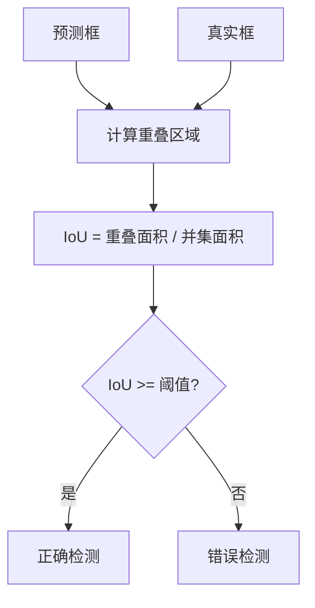

**IoU计算公式：**
```
IoU = Area(A ∩ B) / Area(A ∪ B)
```

**IoU阈值的影响：**
- IoU ≥ 0.5：通常认为是正确检测
- IoU ≥ 0.7：更严格的评价标准
- IoU ≥ 0.9：极高精度要求

#### 精确率 (Precision) 和召回率 (Recall)

**精确率：** 在所有预测为正类的样本中，真正为正类的比例
```
Precision = TP / (TP + FP)
```

**召回率：** 在所有真正为正类的样本中，被正确识别的比例
```
Recall = TP / (TP + FN)
```

**混淆矩阵：**
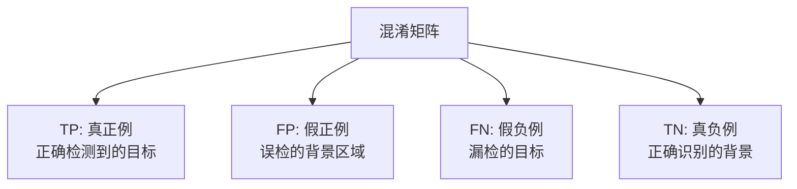

### 10.1.2 综合评价指标

#### AP (Average Precision)
AP是在不同召回率水平下精确率的平均值。

**计算步骤：**
1. 按置信度排序所有检测结果
2. 计算每个阈值下的精确率和召回率
3. 绘制P-R曲线
4. 计算曲线下面积


#### mAP (mean Average Precision)
mAP是所有类别AP的平均值，是目标检测最重要的评价指标。

**COCO数据集评价标准：**
- mAP@0.5：IoU阈值为0.5时的mAP
- mAP@0.75：IoU阈值为0.75时的mAP
- mAP@0.5:0.95：IoU从0.5到0.95，步长0.05的平均mAP

### 10.1.3 其他重要指标

#### FPS (Frames Per Second)
衡量模型推理速度的指标：
```
FPS = 1 / 单帧推理时间
```

#### 模型复杂度指标
- **参数量 (Parameters)：** 模型总参数数量
- **FLOPs：** 浮点运算次数
- **模型大小：** 存储空间占用

## 10.2 模型性能分析

### 10.2.1 详细性能分析

#### 按类别分析
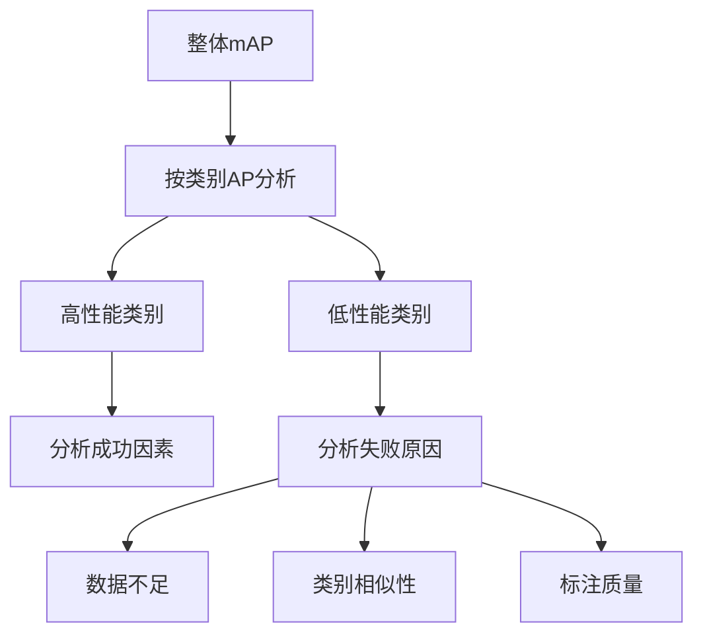

#### 按目标大小分析
- **小目标：** 像素面积 < 32²
- **中等目标：** 32² ≤ 像素面积 < 96²
- **大目标：** 像素面积 ≥ 96²

### 10.2.2 错误分析框架

#### 检测错误类型分类
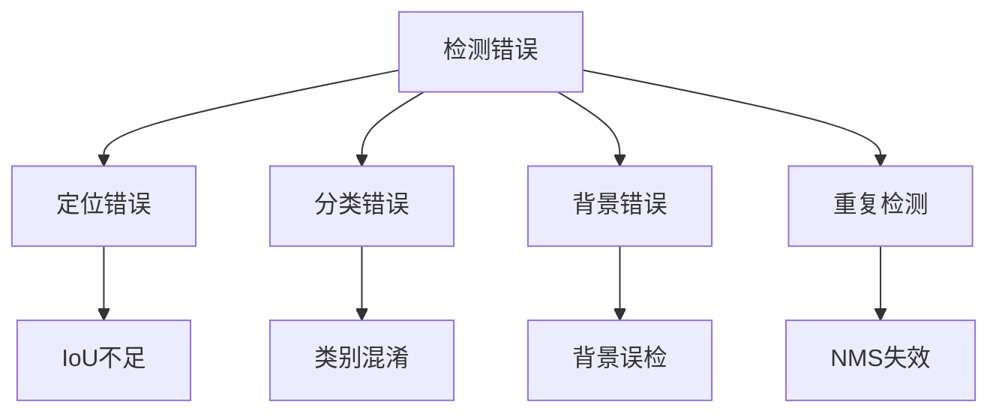

#### 误检分析
1. **背景误检：** 将背景区域误认为目标
2. **定位误差：** 正确识别目标但定位不准
3. **分类错误：** 定位正确但类别判断错误
4. **重复检测：** 同一目标产生多个检测框

### 10.2.3 性能瓶颈分析

#### 推理时间分解
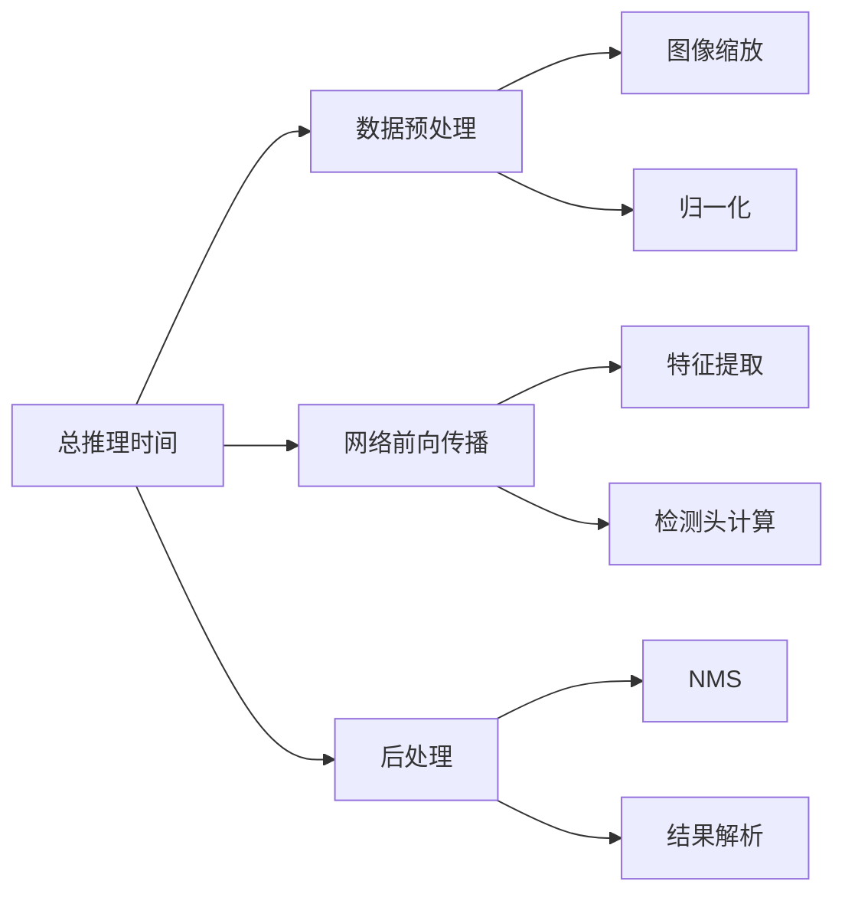

## 10.3 模型可视化与解释性

### 10.3.1 特征可视化

#### 激活热力图
使用Grad-CAM等技术可视化模型关注区域：

```python
# 伪代码：Grad-CAM可视化
def generate_gradcam(model, image, target_layer):
    # 前向传播
    outputs = model(image)

    # 反向传播获取梯度
    gradients = compute_gradients(outputs, target_layer)

    # 计算权重
    weights = global_average_pooling(gradients)

    # 生成热力图
    heatmap = weighted_combination(target_layer, weights)

    return heatmap
```

#### 特征图可视化
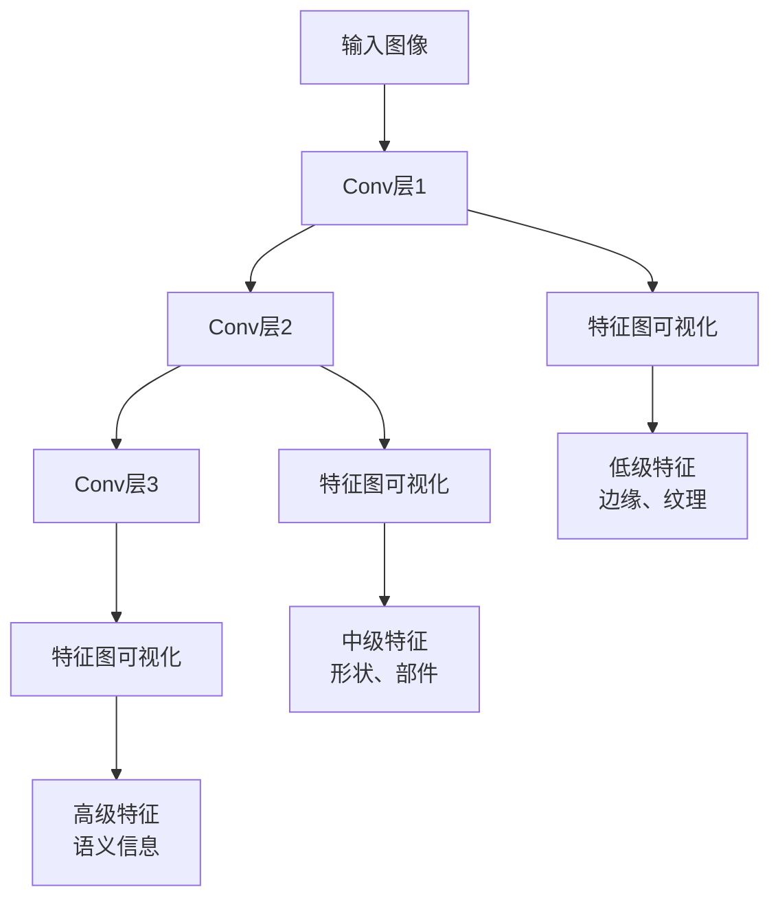

### 10.3.2 检测结果可视化

#### 置信度分布
```python
# 伪代码：置信度分析
def analyze_confidence_distribution(detections):
    confidences = [det.confidence for det in detections]

    # 绘制置信度分布直方图
    plt.hist(confidences, bins=50)
    plt.xlabel('Confidence Score')
    plt.ylabel('Count')
    plt.title('Confidence Distribution')

    # 分析不同置信度阈值的影响
    for threshold in [0.1, 0.3, 0.5, 0.7, 0.9]:
        filtered_dets = filter_by_confidence(detections, threshold)
        print(f"Threshold {threshold}: {len(filtered_dets)} detections")
```

#### PR曲线可视化
```python
# 伪代码：PR曲线绘制
def plot_pr_curve(precisions, recalls, ap_score):
    plt.figure(figsize=(8, 6))
    plt.plot(recalls, precisions, linewidth=2)
    plt.xlabel('Recall')
    plt.ylabel('Precision')
    plt.title(f'Precision-Recall Curve (AP = {ap_score:.3f})')
    plt.grid(True)
    plt.show()
```

### 10.3.3 错误样本分析

#### 失败案例可视化
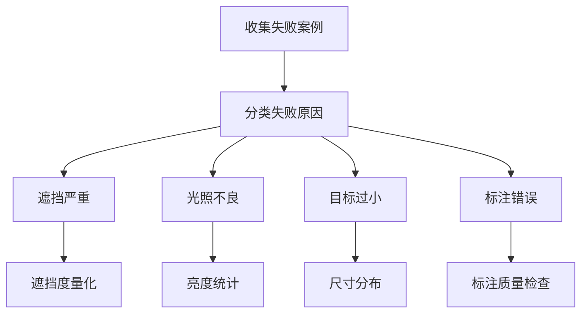

## 10.4 A/B测试与模型对比

### 10.4.1 实验设计原则

#### 对照实验设计
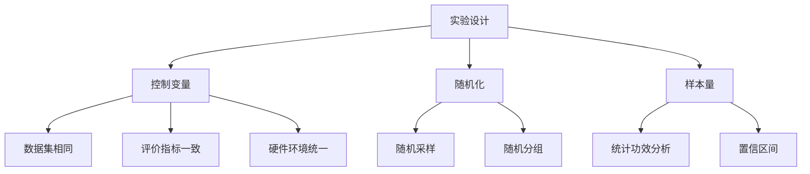

#### 评价维度
1. **精度维度：** mAP、AP@不同IoU阈值
2. **速度维度：** FPS、推理时间
3. **资源维度：** 内存占用、GPU利用率
4. **鲁棒性：** 不同场景下的性能表现

### 10.4.2 统计显著性测试

#### t-检验
```python
# 伪代码：性能差异显著性检验
from scipy import stats

def significance_test(model_a_scores, model_b_scores):
    # 进行配对t检验
    t_stat, p_value = stats.ttest_rel(model_a_scores, model_b_scores)

    alpha = 0.05
    if p_value < alpha:
        print("性能差异具有统计显著性")
    else:
        print("性能差异不具有统计显著性")

    return t_stat, p_value
```

#### 效应量计算
```python
# Cohen's d 效应量
def cohens_d(group1, group2):
    pooled_std = np.sqrt(((len(group1) - 1) * np.var(group1) +
                         (len(group2) - 1) * np.var(group2)) /
                        (len(group1) + len(group2) - 2))
    return (np.mean(group1) - np.mean(group2)) / pooled_std
```

### 10.4.3 模型对比报告

#### 综合性能对比表
| 模型 | mAP@0.5 | mAP@0.75 | FPS | 参数量(M) | 模型大小(MB) |
|------|---------|----------|-----|----------|-------------|
| YOLOv5s | 37.2 | 56.0 | 140 | 7.2 | 14.1 |
| YOLOv8s | 44.9 | 61.8 | 120 | 11.2 | 21.5 |
| YOLOv9s | 46.8 | 63.4 | 110 | 13.8 | 26.7 |

#### 性能-效率权衡图
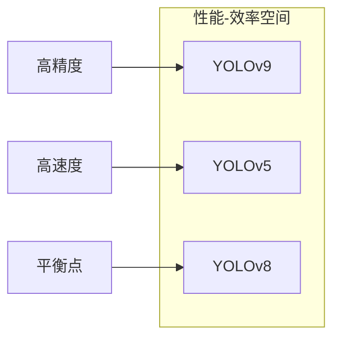

## 10.5 评估实践指南

### 10.5.1 评估数据集准备

#### 测试集要求
1. **代表性：** 反映真实应用场景
2. **多样性：** 覆盖各种条件和挑战
3. **标注质量：** 准确、一致的标注
4. **规模适当：** 足够的统计显著性

#### 数据集划分策略
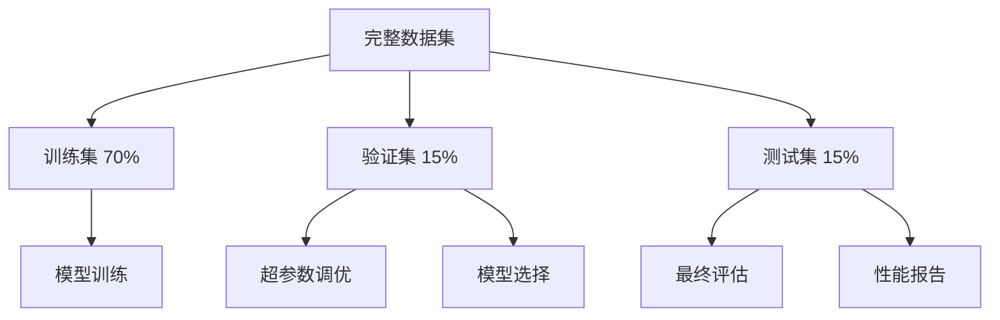

### 10.5.2 评估工具与框架

#### 常用评估工具
1. **COCO API：** 官方COCO评估工具
2. **mAP计算库：** 如mean-average-precision
3. **可视化工具：** TensorBoard, Weights & Biases
4. **统计分析：** Python scipy, R语言

#### 自动化评估流程
```python
# 伪代码：自动化评估流程
class ModelEvaluator:
    def __init__(self, model, test_dataset):
        self.model = model
        self.test_dataset = test_dataset

    def evaluate(self):
        predictions = []
        ground_truths = []

        for batch in self.test_dataset:
            pred = self.model.predict(batch.images)
            predictions.extend(pred)
            ground_truths.extend(batch.annotations)

        # 计算各种指标
        metrics = self.compute_metrics(predictions, ground_truths)

        # 生成报告
        self.generate_report(metrics)

        return metrics

    def compute_metrics(self, preds, gts):
        return {
            'mAP@0.5': compute_map(preds, gts, iou_thresh=0.5),
            'mAP@0.75': compute_map(preds, gts, iou_thresh=0.75),
            'FPS': measure_fps(self.model),
            'model_size': get_model_size(self.model)
        }
```

### 10.5.3 评估最佳实践

#### 评估原则
1. **多角度评估：** 精度、速度、资源消耗
2. **场景化测试：** 针对具体应用场景
3. **长期监控：** 持续跟踪模型性能
4. **可复现性：** 详细记录评估条件

#### 常见陷阱与避免方法
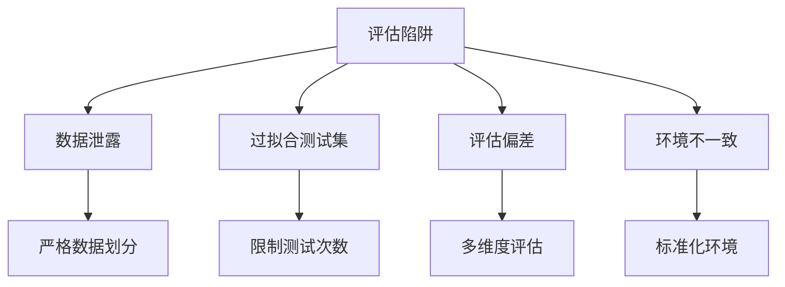

## 本章小结

模型评估与性能分析是YOLO目标检测项目中的关键环节，直接影响模型的实际应用效果。通过本章学习，我们掌握了：

1. **评价指标体系：** 从IoU、Precision/Recall到mAP的完整评价体系
2. **性能分析方法：** 包括错误分析、瓶颈识别和可视化技术
3. **模型对比技巧：** A/B测试设计和统计显著性检验
4. **实践指导：** 评估流程设计和最佳实践总结

掌握这些评估方法，能够帮助我们：
- 客观评价模型性能
- 发现模型问题和改进方向
- 指导模型优化和选择
- 确保模型的实际应用效果

在下一章中，我们将学习如何根据评估结果进行模型优化与加速，进一步提升YOLO模型的实用性。