# 第11章：模型优化与加速

## 学习目标
1. 掌握模型压缩技术（剪枝、量化、蒸馏）
2. 学习推理加速方法（TensorRT、ONNX等）
3. 了解移动端部署优化技巧
4. 熟悉硬件加速和并行计算

## 11.1 模型压缩技术概述

### 11.1.1 模型压缩的必要性

模型压缩技术的核心目标是在保持模型性能的前提下，减少模型的计算复杂度和存储需求。

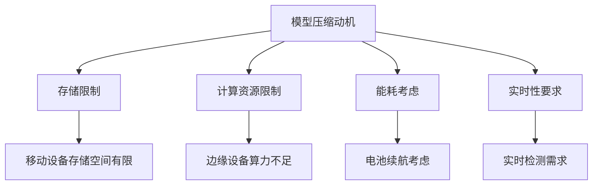

### 11.1.2 压缩技术分类

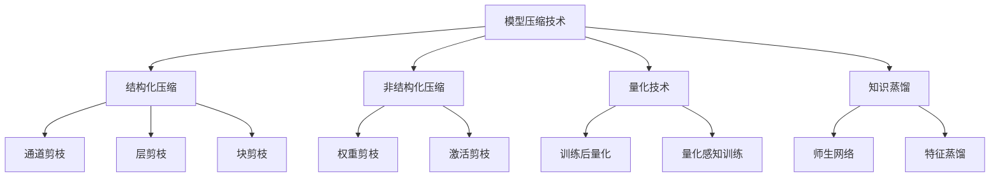

## 11.2 模型剪枝技术

### 11.2.1 权重剪枝

#### 基于重要性的剪枝
权重剪枝通过移除不重要的连接来减少模型参数。

```python
# 伪代码：基于L1范数的权重剪枝
import torch
import torch.nn as nn

def magnitude_pruning(model, pruning_ratio):
    """
    基于权重幅值的剪枝
    """
    # 收集所有权重
    weights = []
    for module in model.modules():
        if isinstance(module, nn.Conv2d) or isinstance(module, nn.Linear):
            weights.extend(module.weight.data.abs().flatten())

    # 计算阈值
    weights_tensor = torch.cat(weights)
    threshold = torch.quantile(weights_tensor, pruning_ratio)

    # 应用剪枝
    for module in model.modules():
        if isinstance(module, nn.Conv2d) or isinstance(module, nn.Linear):
            mask = module.weight.data.abs() > threshold
            module.weight.data *= mask.float()

    return model
```

#### 结构化剪枝
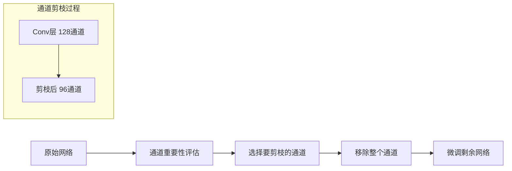

### 11.2.2 YOLO模型剪枝实践

#### YOLOv5剪枝示例
```python
# 伪代码：YOLOv5通道剪枝
class YOLOv5Pruner:
    def __init__(self, model, pruning_ratio=0.3):
        self.model = model
        self.pruning_ratio = pruning_ratio

    def channel_pruning(self):
        """
        对YOLOv5进行通道剪枝
        """
        # 计算每个卷积层的通道重要性
        channel_importance = self.compute_channel_importance()

        # 确定要剪枝的通道
        channels_to_prune = self.select_channels_to_prune(channel_importance)

        # 执行剪枝
        pruned_model = self.prune_channels(channels_to_prune)

        return pruned_model

    def compute_channel_importance(self):
        """
        计算通道重要性（基于BatchNorm的gamma参数）
        """
        importance_scores = {}
        for name, module in self.model.named_modules():
            if isinstance(module, nn.BatchNorm2d):
                # 使用BatchNorm的gamma参数作为重要性指标
                importance_scores[name] = module.weight.data.abs()
        return importance_scores
```

### 11.2.3 剪枝后的微调策略

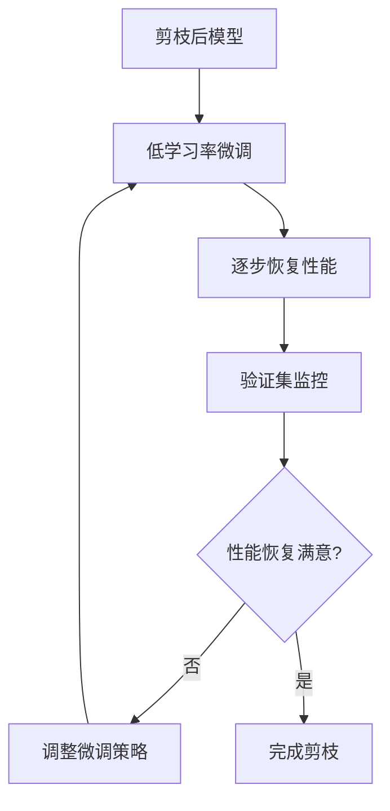

## 11.3 模型量化技术

### 11.3.1 量化基础理论

#### 数值精度对比
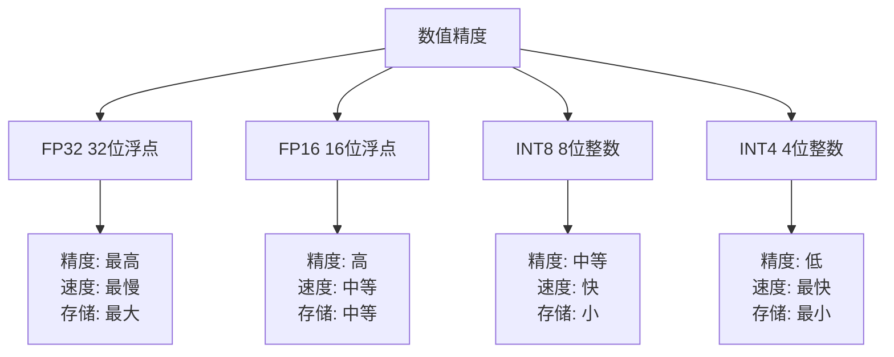

#### 量化映射公式
```
量化值 = round((浮点值 - zero_point) / scale)
反量化值 = 量化值 * scale + zero_point
```

### 11.3.2 训练后量化 (PTQ)

#### 静态量化
```python
# 伪代码：PyTorch静态量化
import torch.quantization as quantization

def static_quantize_model(model, calibration_loader):
    """
    对模型进行静态量化
    """
    # 设置量化配置
    model.qconfig = quantization.get_default_qconfig('fbgemm')

    # 准备量化
    quantization.prepare(model, inplace=True)

    # 校准过程
    model.eval()
    with torch.no_grad():
        for data, _ in calibration_loader:
            model(data)

    # 转换为量化模型
    quantized_model = quantization.convert(model)

    return quantized_model
```

#### 动态量化
```python
# 伪代码：动态量化
def dynamic_quantize_model(model):
    """
    对模型进行动态量化
    """
    quantized_model = torch.quantization.quantize_dynamic(
        model,
        {nn.Conv2d, nn.Linear},  # 要量化的层类型
        dtype=torch.qint8
    )
    return quantized_model
```

### 11.3.3 量化感知训练 (QAT)

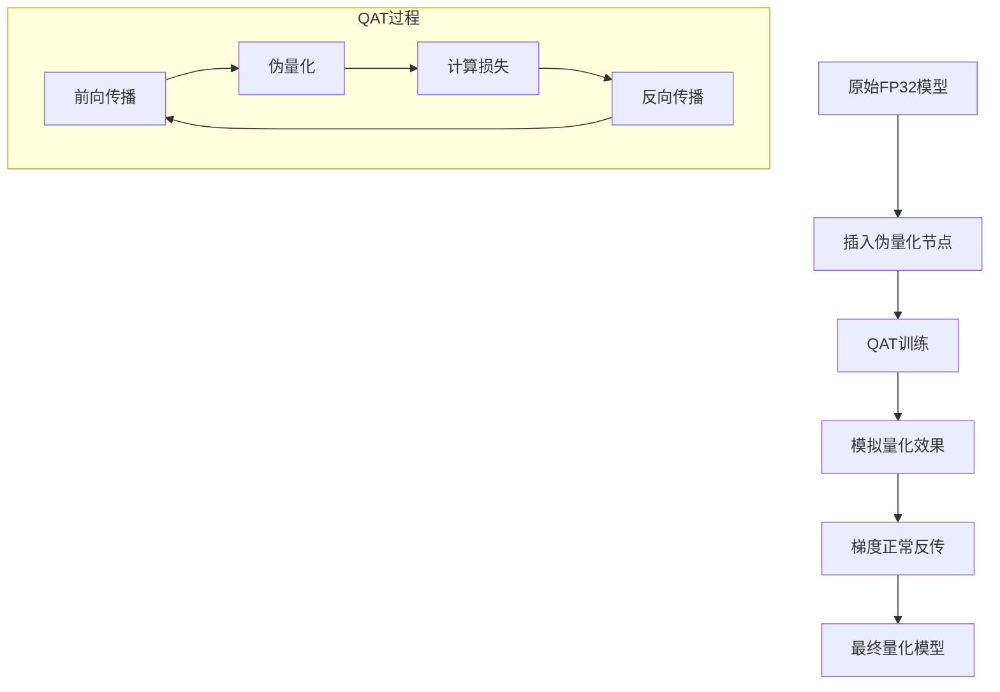

```python
# 伪代码：量化感知训练
def quantization_aware_training(model, train_loader, epochs=10):
    """
    量化感知训练
    """
    # 设置QAT配置
    model.qconfig = quantization.get_default_qat_qconfig('fbgemm')

    # 准备QAT
    quantization.prepare_qat(model, inplace=True)

    # 训练循环
    for epoch in range(epochs):
        model.train()
        for batch_idx, (data, target) in enumerate(train_loader):
            optimizer.zero_grad()
            output = model(data)
            loss = criterion(output, target)
            loss.backward()
            optimizer.step()

    # 转换为量化模型
    model.eval()
    quantized_model = quantization.convert(model)
    return quantized_model
```

## 11.4 知识蒸馏技术

### 11.4.1 基础知识蒸馏

#### 师生网络架构
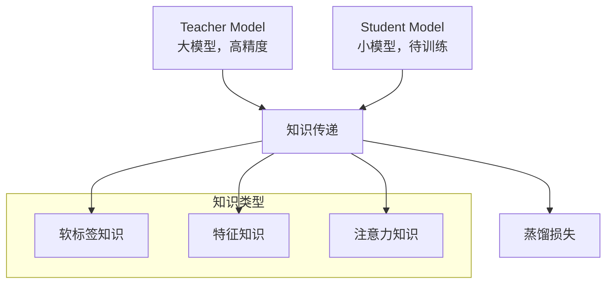

#### 蒸馏损失函数
```python
# 伪代码：知识蒸馏损失
import torch.nn.functional as F

def distillation_loss(student_logits, teacher_logits, target, temperature=4, alpha=0.7):
    """
    计算知识蒸馏损失
    """
    # 软标签损失（蒸馏损失）
    soft_loss = F.kl_div(
        F.log_softmax(student_logits / temperature, dim=1),
        F.softmax(teacher_logits / temperature, dim=1),
        reduction='batchmean'
    ) * (temperature ** 2)

    # 硬标签损失（分类损失）
    hard_loss = F.cross_entropy(student_logits, target)

    # 总损失
    total_loss = alpha * soft_loss + (1 - alpha) * hard_loss
    return total_loss
```

### 11.4.2 YOLO知识蒸馏

#### 特征级蒸馏
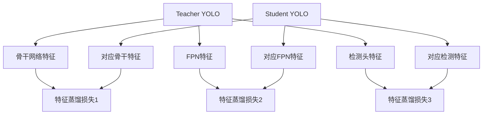

```python
# 伪代码：YOLO特征蒸馏
class YOLODistillation:
    def __init__(self, teacher_model, student_model):
        self.teacher = teacher_model
        self.student = student_model

    def feature_distillation_loss(self, teacher_features, student_features):
        """
        计算特征级蒸馏损失
        """
        total_loss = 0
        for t_feat, s_feat in zip(teacher_features, student_features):
            # 特征对齐（如果维度不同）
            if t_feat.shape != s_feat.shape:
                s_feat = self.align_features(s_feat, t_feat.shape)

            # 计算特征蒸馏损失
            loss = F.mse_loss(s_feat, t_feat.detach())
            total_loss += loss

        return total_loss

    def align_features(self, student_feat, target_shape):
        """
        特征维度对齐
        """
        # 使用1x1卷积调整通道数
        if student_feat.shape[1] != target_shape[1]:
            student_feat = self.channel_adapter(student_feat)

        # 空间维度对齐
        if student_feat.shape[2:] != target_shape[2:]:
            student_feat = F.interpolate(
                student_feat,
                size=target_shape[2:],
                mode='bilinear'
            )

        return student_feat
```

## 11.5 推理加速技术

### 11.5.1 TensorRT优化

#### TensorRT工作流程
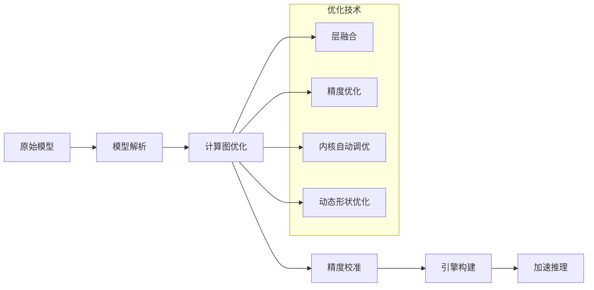

#### TensorRT模型转换
```python
# 伪代码：TensorRT模型转换
import tensorrt as trt

def convert_to_tensorrt(onnx_path, engine_path, precision='fp16'):
    """
    将ONNX模型转换为TensorRT引擎
    """
    # 创建构建器和网络
    builder = trt.Builder(trt.Logger(trt.Logger.WARNING))
    config = builder.create_builder_config()

    # 设置精度
    if precision == 'fp16':
        config.set_flag(trt.BuilderFlag.FP16)
    elif precision == 'int8':
        config.set_flag(trt.BuilderFlag.INT8)
        # 设置校准器
        config.int8_calibrator = create_calibrator()

    # 解析ONNX模型
    network = builder.create_network(
        1 << int(trt.NetworkDefinitionCreationFlag.EXPLICIT_BATCH)
    )
    parser = trt.OnnxParser(network, trt.Logger(trt.Logger.WARNING))
    parser.parse_from_file(onnx_path)

    # 构建引擎
    engine = builder.build_engine(network, config)

    # 保存引擎
    with open(engine_path, 'wb') as f:
        f.write(engine.serialize())

    return engine
```

### 11.5.2 ONNX优化

#### ONNX模型优化流程
```python
# 伪代码：ONNX模型优化
import onnx
from onnxoptimizer import optimize

def optimize_onnx_model(model_path, optimized_path):
    """
    优化ONNX模型
    """
    # 加载模型
    model = onnx.load(model_path)

    # 应用优化
    optimized_model = optimize(model, [
        'eliminate_deadend',
        'eliminate_identity',
        'eliminate_nop_dropout',
        'eliminate_nop_monotone_argmax',
        'eliminate_nop_pad',
        'extract_constant_to_initializer',
        'eliminate_unused_initializer',
        'eliminate_nop_transpose',
        'fuse_add_bias_into_conv',
        'fuse_bn_into_conv',
        'fuse_consecutive_concats',
        'fuse_consecutive_log_softmax',
        'fuse_consecutive_reduce_unsqueeze',
        'fuse_consecutive_squeezes',
        'fuse_consecutive_transposes',
        'fuse_matmul_add_bias_into_gemm',
        'fuse_pad_into_conv',
        'fuse_transpose_into_gemm'
    ])

    # 保存优化后的模型
    onnx.save(optimized_model, optimized_path)
    return optimized_model
```

### 11.5.3 OpenVINO优化

#### OpenVINO工作流程
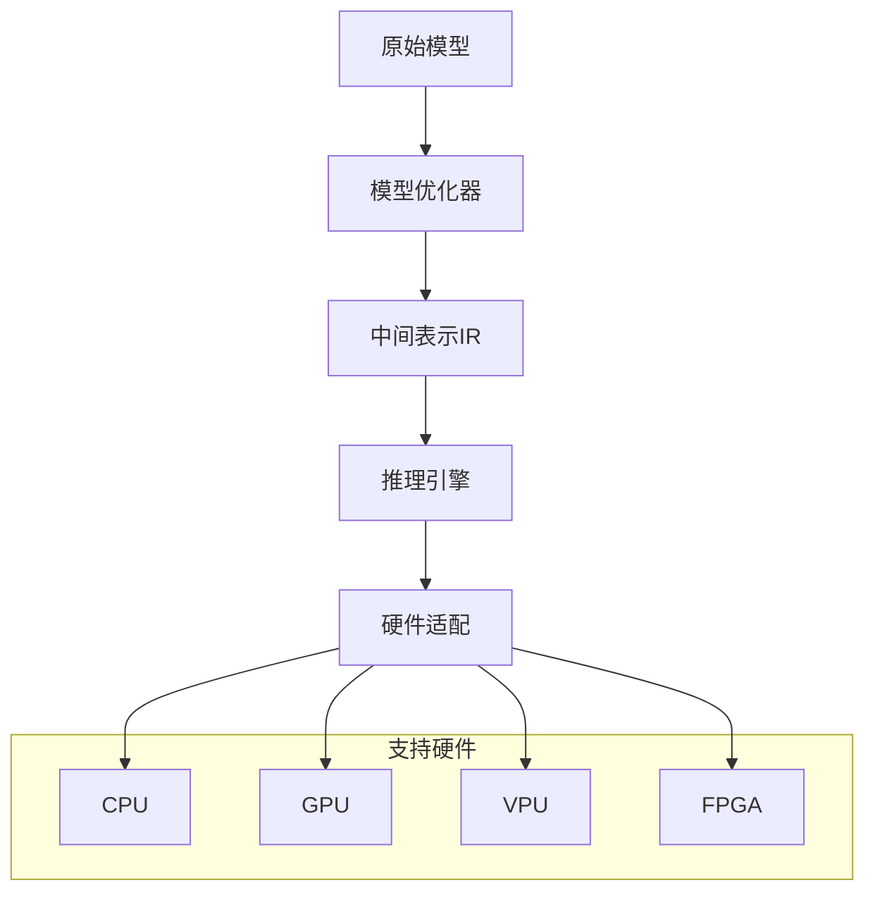

## 11.6 移动端优化技术

### 11.6.1 移动端部署挑战

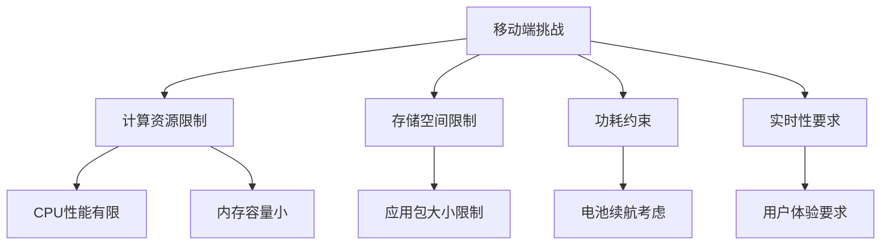

### 11.6.2 模型架构优化

#### 轻量级网络设计
```python
# 伪代码：MobileNet风格的轻量级YOLO
class MobileYOLOBlock(nn.Module):
    def __init__(self, in_channels, out_channels, stride=1):
        super().__init__()

        # 深度可分离卷积
        self.depthwise = nn.Conv2d(
            in_channels, in_channels,
            kernel_size=3, stride=stride,
            padding=1, groups=in_channels
        )
        self.pointwise = nn.Conv2d(
            in_channels, out_channels,
            kernel_size=1
        )
        self.bn1 = nn.BatchNorm2d(in_channels)
        self.bn2 = nn.BatchNorm2d(out_channels)
        self.relu = nn.ReLU6(inplace=True)

    def forward(self, x):
        x = self.relu(self.bn1(self.depthwise(x)))
        x = self.relu(self.bn2(self.pointwise(x)))
        return x
```

#### 通道注意力机制
```python
# 伪代码：轻量级注意力模块
class LightweightAttention(nn.Module):
    def __init__(self, channels, reduction=16):
        super().__init__()
        self.avg_pool = nn.AdaptiveAvgPool2d(1)
        self.fc = nn.Sequential(
            nn.Linear(channels, channels // reduction),
            nn.ReLU(inplace=True),
            nn.Linear(channels // reduction, channels),
            nn.Sigmoid()
        )

    def forward(self, x):
        b, c, _, _ = x.size()
        y = self.avg_pool(x).view(b, c)
        y = self.fc(y).view(b, c, 1, 1)
        return x * y.expand_as(x)
```

### 11.6.3 推理引擎优化

#### Core ML优化（iOS）
```python
# 伪代码：Core ML模型转换
import coremltools as ct

def convert_to_coreml(pytorch_model, example_input):
    """
    将PyTorch模型转换为Core ML
    """
    # 转换为Core ML
    traced_model = torch.jit.trace(pytorch_model, example_input)
    coreml_model = ct.convert(
        traced_model,
        inputs=[ct.TensorType(shape=example_input.shape)],
        compute_precision=ct.precision.FLOAT16  # 使用FP16精度
    )

    # 优化设置
    coreml_model = ct.models.neural_network.quantization_utils.quantize_weights(
        coreml_model, nbits=8
    )

    return coreml_model
```

#### TensorFlow Lite优化
```python
# 伪代码：TensorFlow Lite转换
import tensorflow as tf

def convert_to_tflite(saved_model_dir):
    """
    转换为TensorFlow Lite模型
    """
    converter = tf.lite.TFLiteConverter.from_saved_model(saved_model_dir)

    # 启用优化
    converter.optimizations = [tf.lite.Optimize.DEFAULT]

    # 量化设置
    converter.target_spec.supported_types = [tf.float16]

    # 转换
    tflite_model = converter.convert()

    return tflite_model
```

## 11.7 硬件加速技术

### 11.7.1 GPU加速优化

#### CUDA优化技巧
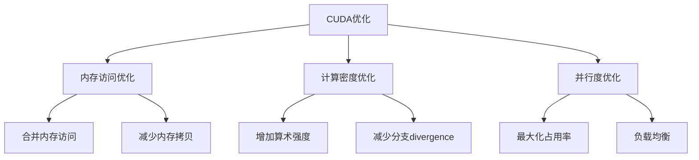

#### 混合精度训练
```python
# 伪代码：混合精度训练
from torch.cuda.amp import autocast, GradScaler

def mixed_precision_training():
    """
    混合精度训练示例
    """
    scaler = GradScaler()

    for batch in dataloader:
        optimizer.zero_grad()

        # 使用自动混合精度
        with autocast():
            outputs = model(batch.images)
            loss = criterion(outputs, batch.targets)

        # 缩放梯度
        scaler.scale(loss).backward()
        scaler.step(optimizer)
        scaler.update()
```

### 11.7.2 多核CPU优化

#### 并行推理策略
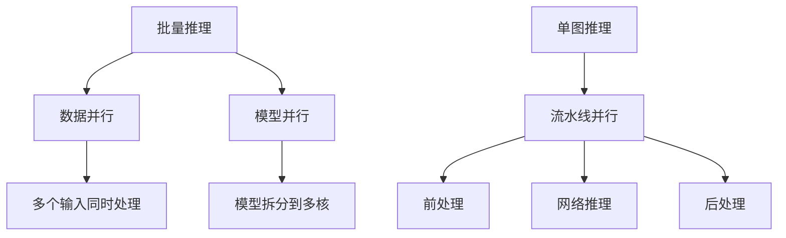

```python
# 伪代码：多线程推理
import threading
from concurrent.futures import ThreadPoolExecutor

class ParallelInference:
    def __init__(self, model, num_workers=4):
        self.model = model
        self.num_workers = num_workers

    def batch_inference(self, image_batch):
        """
        批量并行推理
        """
        with ThreadPoolExecutor(max_workers=self.num_workers) as executor:
            futures = []
            for image in image_batch:
                future = executor.submit(self.single_inference, image)
                futures.append(future)

            results = [future.result() for future in futures]
        return results

    def single_inference(self, image):
        """
        单图推理
        """
        with torch.no_grad():
            return self.model(image)
```

## 11.8 性能基准测试

### 11.8.1 基准测试框架

#### 性能评估维度
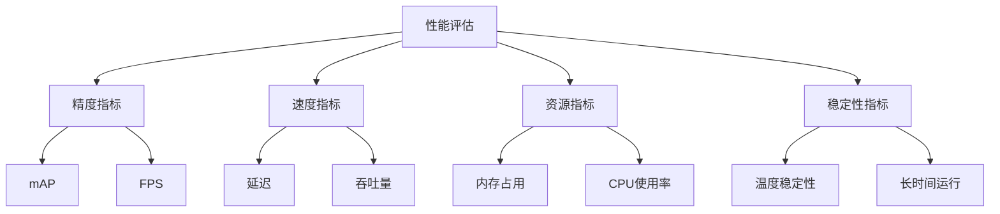

#### 自动化测试脚本
```python
# 伪代码：性能基准测试
class PerformanceBenchmark:
    def __init__(self, model, test_data):
        self.model = model
        self.test_data = test_data

    def run_benchmark(self):
        """
        运行完整的性能基准测试
        """
        results = {
            'accuracy': self.measure_accuracy(),
            'latency': self.measure_latency(),
            'throughput': self.measure_throughput(),
            'memory': self.measure_memory_usage(),
            'power': self.measure_power_consumption()
        }

        self.generate_report(results)
        return results

    def measure_latency(self):
        """
        测量推理延迟
        """
        latencies = []

        # 预热
        for _ in range(10):
            self.model(self.test_data[0])

        # 正式测量
        for data in self.test_data:
            start_time = time.time()
            with torch.no_grad():
                _ = self.model(data)
            end_time = time.time()
            latencies.append(end_time - start_time)

        return {
            'mean': np.mean(latencies),
            'std': np.std(latencies),
            'p50': np.percentile(latencies, 50),
            'p95': np.percentile(latencies, 95),
            'p99': np.percentile(latencies, 99)
        }
```

### 11.8.2 优化效果评估

#### 压缩比与精度权衡
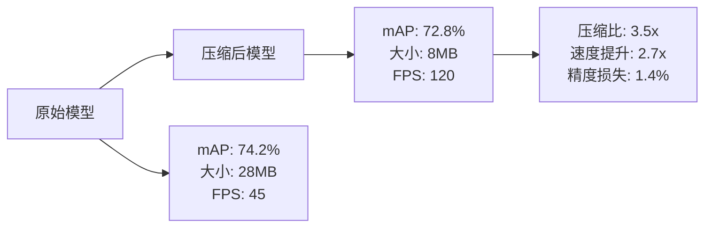

## 11.9 优化实践指南

### 11.9.1 优化流程设计

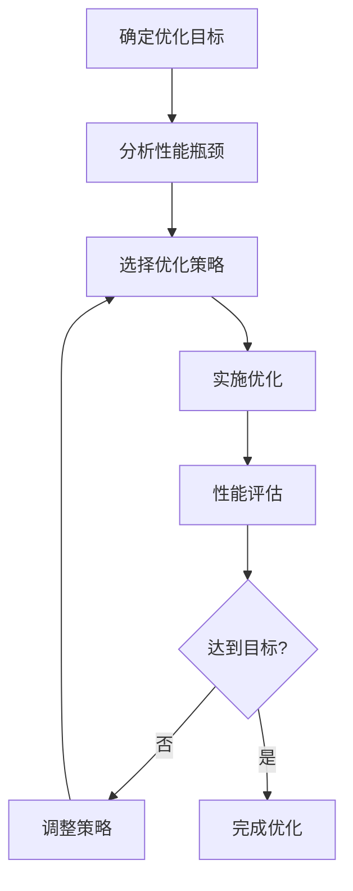

### 11.9.2 常见优化策略组合

#### 移动端优化组合
1. **模型架构优化** + **量化** + **剪枝**
2. **知识蒸馏** + **TensorFlow Lite**
3. **轻量级网络设计** + **硬件适配**

#### 服务器端优化组合
1. **TensorRT** + **混合精度** + **批处理**
2. **模型并行** + **流水线优化**
3. **动态Shape优化** + **内存池管理**

### 11.9.3 优化陷阱与解决方案

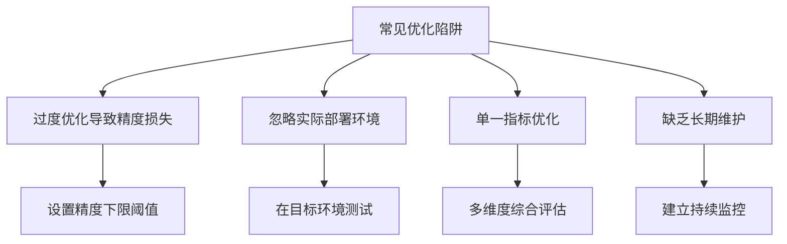

## 本章小结

模型优化与加速是将YOLO模型从实验室推向实际应用的关键技术。通过本章学习，我们掌握了：

1. **压缩技术体系：** 剪枝、量化、蒸馏三大核心技术
2. **推理加速方法：** TensorRT、ONNX、OpenVINO等加速框架
3. **移动端优化：** 轻量级架构设计和移动端适配技术
4. **硬件加速：** GPU、多核CPU的并行计算优化
5. **性能评估：** 综合性能基准测试和优化效果评估

这些优化技术的合理组合可以：
- 显著减少模型大小和计算需求
- 大幅提升推理速度
- 保持相对较高的检测精度
- 适应不同的部署环境和硬件平台

在下一章中，我们将学习如何将优化后的YOLO模型部署到实际的生产环境中，包括服务器、移动端和边缘设备的部署策略。