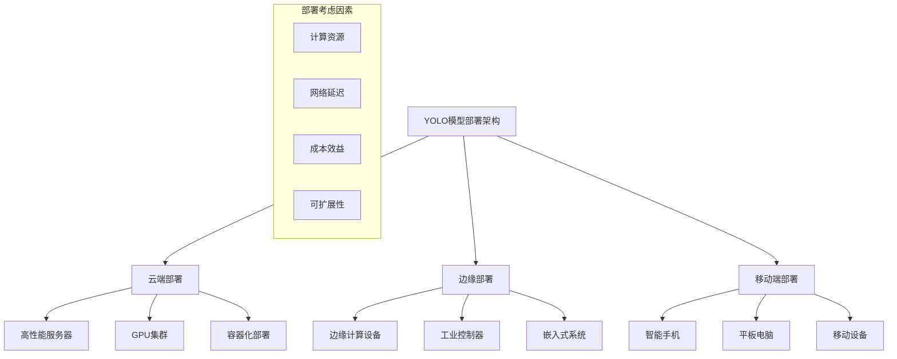
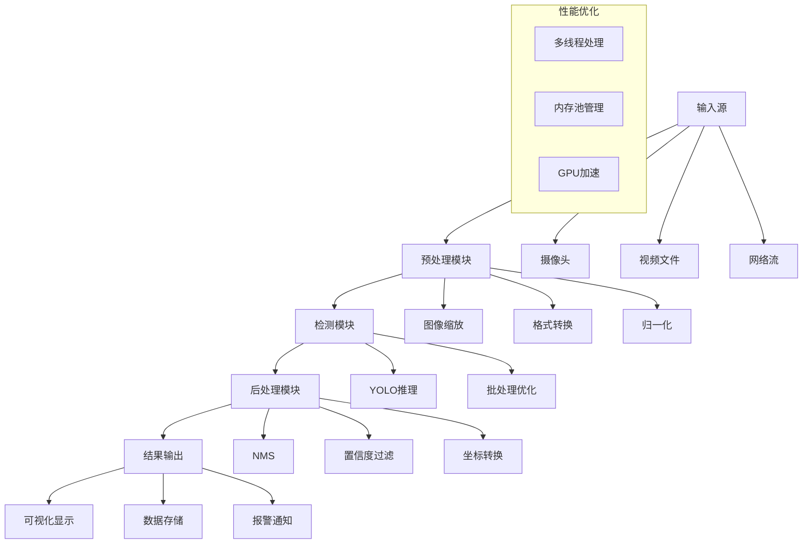
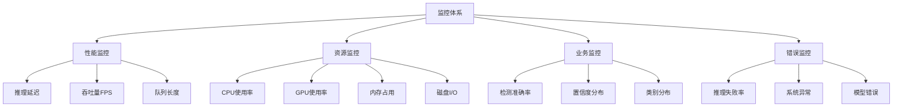

# 第12章：YOLO实际部署与应用

## 学习目标
1. 掌握不同平台的部署方案（服务器、移动端、边缘设备）
2. 学习实时检测系统的设计和实现
3. 了解生产环境的监控和维护
4. 熟悉API接口设计和服务化部署

## 12.1 部署架构设计

### 12.1.1 部署架构概览



### 12.1.2 部署策略选择

#### 部署方案对比
| 部署方式 | 优势 | 劣势 | 适用场景 |
|----------|------|------|----------|
| 云端部署 | 高性能、易维护、可扩展 | 网络依赖、延迟高 | 批量处理、非实时应用 |
| 边缘部署 | 低延迟、数据安全、离线可用 | 计算能力有限、维护困难 | 实时应用、隐私敏感 |
| 移动端部署 | 无网络依赖、响应快 | 资源极其有限 | 个人应用、离线场景 |

## 12.2 服务器端部署

### 12.2.1 Docker容器化部署

#### Dockerfile示例
```dockerfile
# YOLO模型容器化部署
FROM nvidia/cuda:11.8-runtime-ubuntu20.04

# 安装Python和依赖
RUN apt-get update && apt-get install -y \
    python3 \
    python3-pip \
    libglib2.0-0 \
    libsm6 \
    libxext6 \
    libxrender-dev \
    libgomp1 \
    && rm -rf /var/lib/apt/lists/*

# 设置工作目录
WORKDIR /app

# 复制依赖文件
COPY requirements.txt .
RUN pip3 install --no-cache-dir -r requirements.txt

# 复制应用代码
COPY . .

# 下载模型权重（如果需要）
RUN python3 download_weights.py

# 暴露端口
EXPOSE 8080

# 启动命令
CMD ["python3", "app.py", "--host", "0.0.0.0", "--port", "8080"]
```

#### Docker Compose配置
```yaml
# docker-compose.yml
version: '3.8'

services:
  yolo-api:
    build: .
    ports:
      - "8080:8080"
    volumes:
      - ./models:/app/models
      - ./logs:/app/logs
    environment:
      - CUDA_VISIBLE_DEVICES=0
      - MODEL_PATH=/app/models/yolov8n.pt
    deploy:
      resources:
        reservations:
          devices:
            - driver: nvidia
              count: 1
              capabilities: [gpu]

  redis:
    image: redis:alpine
    ports:
      - "6379:6379"

  nginx:
    image: nginx:alpine
    ports:
      - "80:80"
    volumes:
      - ./nginx.conf:/etc/nginx/nginx.conf
    depends_on:
      - yolo-api
```

### 12.2.2 FastAPI服务实现

#### 基础API服务
```python
# app.py - YOLO API服务
from fastapi import FastAPI, File, UploadFile, HTTPException
from fastapi.responses import JSONResponse
import cv2
import numpy as np
import torch
from ultralytics import YOLO
import io
from PIL import Image
import base64

app = FastAPI(title="YOLO Detection API", version="1.0.0")

# 全局模型实例
model = None

@app.on_event("startup")
async def load_model():
    """启动时加载模型"""
    global model
    try:
        model = YOLO("yolov8n.pt")
        print("模型加载成功")
    except Exception as e:
        print(f"模型加载失败: {e}")
        raise

@app.post("/detect")
async def detect_objects(file: UploadFile = File(...)):
    """
    目标检测API端点
    """
    try:
        # 读取上传的图像
        image_data = await file.read()
        image = Image.open(io.BytesIO(image_data))

        # 转换为OpenCV格式
        image_cv = cv2.cvtColor(np.array(image), cv2.COLOR_RGB2BGR)

        # 执行检测
        results = model(image_cv)

        # 解析结果
        detections = []
        for r in results:
            boxes = r.boxes
            if boxes is not None:
                for box in boxes:
                    x1, y1, x2, y2 = box.xyxy[0].tolist()
                    conf = box.conf[0].item()
                    cls = box.cls[0].item()
                    class_name = model.names[int(cls)]

                    detections.append({
                        "bbox": [x1, y1, x2, y2],
                        "confidence": conf,
                        "class": class_name,
                        "class_id": int(cls)
                    })

        return {
            "detections": detections,
            "count": len(detections)
        }

    except Exception as e:
        raise HTTPException(status_code=500, detail=str(e))

@app.post("/detect_batch")
async def detect_batch(files: list[UploadFile] = File(...)):
    """
    批量检测API端点
    """
    results = []
    for file in files:
        try:
            # 处理单个图像
            image_data = await file.read()
            image = Image.open(io.BytesIO(image_data))
            image_cv = cv2.cvtColor(np.array(image), cv2.COLOR_RGB2BGR)

            # 执行检测
            detection_results = model(image_cv)

            # 解析结果
            detections = []
            for r in detection_results:
                boxes = r.boxes
                if boxes is not None:
                    for box in boxes:
                        x1, y1, x2, y2 = box.xyxy[0].tolist()
                        conf = box.conf[0].item()
                        cls = box.cls[0].item()
                        class_name = model.names[int(cls)]

                        detections.append({
                            "bbox": [x1, y1, x2, y2],
                            "confidence": conf,
                            "class": class_name,
                            "class_id": int(cls)
                        })

            results.append({
                "filename": file.filename,
                "detections": detections,
                "count": len(detections)
            })

        except Exception as e:
            results.append({
                "filename": file.filename,
                "error": str(e)
            })

    return {"results": results}

@app.get("/health")
async def health_check():
    """健康检查端点"""
    return {"status": "healthy", "model_loaded": model is not None}

@app.get("/model_info")
async def model_info():
    """模型信息端点"""
    if model is None:
        raise HTTPException(status_code=503, detail="模型未加载")

    return {
        "model_type": "YOLOv8",
        "classes": list(model.names.values()),
        "input_size": [640, 640]
    }

if __name__ == "__main__":
    import uvicorn
    uvicorn.run(app, host="0.0.0.0", port=8080)
```

### 12.2.3 负载均衡与扩展

#### Kubernetes部署配置
```yaml
# k8s-deployment.yaml
apiVersion: apps/v1
kind: Deployment
metadata:
  name: yolo-detection
spec:
  replicas: 3
  selector:
    matchLabels:
      app: yolo-detection
  template:
    metadata:
      labels:
        app: yolo-detection
    spec:
      containers:
      - name: yolo-api
        image: yolo-detection:latest
        ports:
        - containerPort: 8080
        resources:
          requests:
            memory: "2Gi"
            nvidia.com/gpu: 1
          limits:
            memory: "4Gi"
            nvidia.com/gpu: 1
        env:
        - name: MODEL_PATH
          value: "/app/models/yolov8n.pt"

---
apiVersion: v1
kind: Service
metadata:
  name: yolo-service
spec:
  selector:
    app: yolo-detection
  ports:
  - port: 80
    targetPort: 8080
  type: LoadBalancer

---
apiVersion: autoscaling/v2
kind: HorizontalPodAutoscaler
metadata:
  name: yolo-hpa
spec:
  scaleTargetRef:
    apiVersion: apps/v1
    kind: Deployment
    name: yolo-detection
  minReplicas: 2
  maxReplicas: 10
  metrics:
  - type: Resource
    resource:
      name: cpu
      target:
        type: Utilization
        averageUtilization: 70
```

## 12.3 移动端部署

### 12.3.1 iOS部署（Core ML）

#### 模型转换与集成
```swift
// YOLODetector.swift - iOS YOLO检测器
import CoreML
import Vision
import UIKit

class YOLODetector {
    private var model: VNCoreMLModel?

    init() {
        loadModel()
    }

    private func loadModel() {
        guard let modelURL = Bundle.main.url(forResource: "YOLOv8", withExtension: "mlmodelc"),
              let coreMLModel = try? MLModel(contentsOf: modelURL),
              let visionModel = try? VNCoreMLModel(for: coreMLModel) else {
            print("Failed to load Core ML model")
            return
        }
        self.model = visionModel
    }

    func detectObjects(in image: UIImage, completion: @escaping ([Detection]) -> Void) {
        guard let model = self.model,
              let cgImage = image.cgImage else {
            completion([])
            return
        }

        let request = VNCoreMLRequest(model: model) { [weak self] request, error in
            if let error = error {
                print("Detection error: \\(error)")
                completion([])
                return
            }

            let detections = self?.processResults(request.results) ?? []
            DispatchQueue.main.async {
                completion(detections)
            }
        }

        request.imageCropAndScaleOption = .scaleFill

        let handler = VNImageRequestHandler(cgImage: cgImage, options: [:])
        DispatchQueue.global(qos: .userInitiated).async {
            try? handler.perform([request])
        }
    }

    private func processResults(_ results: [VNObservation]?) -> [Detection] {
        guard let results = results as? [VNRecognizedObjectObservation] else {
            return []
        }

        return results.compactMap { observation in
            guard let topLabel = observation.labels.first else { return nil }

            return Detection(
                boundingBox: observation.boundingBox,
                confidence: topLabel.confidence,
                className: topLabel.identifier
            )
        }
    }
}

struct Detection {
    let boundingBox: CGRect
    let confidence: Float
    let className: String
}
```

#### 实时摄像头检测
```swift
// CameraViewController.swift - 实时检测界面
import UIKit
import AVFoundation

class CameraViewController: UIViewController {
    private var captureSession: AVCaptureSession!
    private var previewLayer: AVCaptureVideoPreviewLayer!
    private let detector = YOLODetector()
    private var overlayView: DetectionOverlayView!

    override func viewDidLoad() {
        super.viewDidLoad()
        setupCamera()
        setupUI()
    }

    private func setupCamera() {
        captureSession = AVCaptureSession()
        captureSession.sessionPreset = .high

        guard let backCamera = AVCaptureDevice.default(for: .video),
              let input = try? AVCaptureDeviceInput(device: backCamera) else {
            return
        }

        captureSession.addInput(input)

        let videoOutput = AVCaptureVideoDataOutput()
        videoOutput.setSampleBufferDelegate(self, queue: DispatchQueue(label: "camera_queue"))
        captureSession.addOutput(videoOutput)

        previewLayer = AVCaptureVideoPreviewLayer(session: captureSession)
        previewLayer.frame = view.bounds
        previewLayer.videoGravity = .resizeAspectFill
        view.layer.addSublayer(previewLayer)

        captureSession.startRunning()
    }

    private func setupUI() {
        overlayView = DetectionOverlayView(frame: view.bounds)
        view.addSubview(overlayView)
    }
}

extension CameraViewController: AVCaptureVideoDataOutputSampleBufferDelegate {
    func captureOutput(_ output: AVCaptureOutput, didOutput sampleBuffer: CMSampleBuffer, from connection: AVCaptureConnection) {
        guard let imageBuffer = CMSampleBufferGetImageBuffer(sampleBuffer) else { return }

        let ciImage = CIImage(cvImageBuffer: imageBuffer)
        let context = CIContext()
        guard let cgImage = context.createCGImage(ciImage, from: ciImage.extent) else { return }

        let uiImage = UIImage(cgImage: cgImage)

        detector.detectObjects(in: uiImage) { [weak self] detections in
            self?.overlayView.updateDetections(detections)
        }
    }
}
```

### 12.3.2 Android部署（TensorFlow Lite）

#### 模型集成
```kotlin
// YOLODetector.kt - Android YOLO检测器
class YOLODetector(private val context: Context) {
    private var interpreter: Interpreter? = null
    private val inputSize = 640
    private val classNames = loadClassNames()

    init {
        loadModel()
    }

    private fun loadModel() {
        try {
            val modelBuffer = loadModelFile("yolo_model.tflite")
            val options = Interpreter.Options()
            options.setNumThreads(4)
            options.setUseNNAPI(true) // 使用NNAPI加速

            interpreter = Interpreter(modelBuffer, options)
        } catch (e: Exception) {
            Log.e("YOLODetector", "Error loading model", e)
        }
    }

    private fun loadModelFile(modelName: String): ByteBuffer {
        val assetFileDescriptor = context.assets.openFd(modelName)
        val inputStream = FileInputStream(assetFileDescriptor.fileDescriptor)
        val fileChannel = inputStream.channel
        val startOffset = assetFileDescriptor.startOffset
        val declaredLength = assetFileDescriptor.declaredLength
        return fileChannel.map(FileChannel.MapMode.READ_ONLY, startOffset, declaredLength)
    }

    fun detectObjects(bitmap: Bitmap): List<Detection> {
        val interpreter = this.interpreter ?: return emptyList()

        // 预处理图像
        val resizedBitmap = Bitmap.createScaledBitmap(bitmap, inputSize, inputSize, true)
        val inputBuffer = preprocessImage(resizedBitmap)

        // 准备输出缓冲区
        val outputShape = interpreter.getOutputTensor(0).shape()
        val outputBuffer = Array(1) { Array(outputShape[1]) { FloatArray(outputShape[2]) } }

        // 执行推理
        interpreter.run(inputBuffer, outputBuffer)

        // 后处理结果
        return postprocessResults(outputBuffer[0], bitmap.width, bitmap.height)
    }

    private fun preprocessImage(bitmap: Bitmap): ByteBuffer {
        val byteBuffer = ByteBuffer.allocateDirect(4 * inputSize * inputSize * 3)
        byteBuffer.order(ByteOrder.nativeOrder())

        val pixels = IntArray(inputSize * inputSize)
        bitmap.getPixels(pixels, 0, inputSize, 0, 0, inputSize, inputSize)

        for (pixel in pixels) {
            val r = (pixel shr 16 and 0xFF) / 255.0f
            val g = (pixel shr 8 and 0xFF) / 255.0f
            val b = (pixel and 0xFF) / 255.0f

            byteBuffer.putFloat(r)
            byteBuffer.putFloat(g)
            byteBuffer.putFloat(b)
        }

        return byteBuffer
    }

    private fun postprocessResults(outputs: Array<FloatArray>, imageWidth: Int, imageHeight: Int): List<Detection> {
        val detections = mutableListOf<Detection>()
        val confidenceThreshold = 0.5f

        for (output in outputs) {
            if (output.size >= 6) { // x, y, w, h, confidence, class_scores...
                val centerX = output[0]
                val centerY = output[1]
                val width = output[2]
                val height = output[3]
                val confidence = output[4]

                if (confidence > confidenceThreshold) {
                    // 找到最高分类分数
                    var maxClassScore = 0f
                    var classId = 0
                    for (i in 5 until output.size) {
                        if (output[i] > maxClassScore) {
                            maxClassScore = output[i]
                            classId = i - 5
                        }
                    }

                    if (maxClassScore * confidence > confidenceThreshold) {
                        val left = (centerX - width / 2) * imageWidth
                        val top = (centerY - height / 2) * imageHeight
                        val right = (centerX + width / 2) * imageWidth
                        val bottom = (centerY + height / 2) * imageHeight

                        detections.add(
                            Detection(
                                RectF(left, top, right, bottom),
                                maxClassScore * confidence,
                                classNames.getOrElse(classId) { "Unknown" }
                            )
                        )
                    }
                }
            }
        }

        return applyNMS(detections)
    }

    private fun applyNMS(detections: List<Detection>): List<Detection> {
        val sortedDetections = detections.sortedByDescending { it.confidence }
        val finalDetections = mutableListOf<Detection>()

        for (detection in sortedDetections) {
            var keep = true
            for (finalDetection in finalDetections) {
                if (calculateIoU(detection.boundingBox, finalDetection.boundingBox) > 0.5) {
                    keep = false
                    break
                }
            }
            if (keep) {
                finalDetections.add(detection)
            }
        }

        return finalDetections
    }

    private fun calculateIoU(box1: RectF, box2: RectF): Float {
        val intersectionArea = maxOf(0f, minOf(box1.right, box2.right) - maxOf(box1.left, box2.left)) *
                maxOf(0f, minOf(box1.bottom, box2.bottom) - maxOf(box1.top, box2.top))

        val box1Area = (box1.right - box1.left) * (box1.bottom - box1.top)
        val box2Area = (box2.right - box2.left) * (box2.bottom - box2.top)

        return intersectionArea / (box1Area + box2Area - intersectionArea)
    }

    private fun loadClassNames(): List<String> {
        return try {
            context.assets.open("class_names.txt").bufferedReader().readLines()
        } catch (e: Exception) {
            Log.e("YOLODetector", "Error loading class names", e)
            emptyList()
        }
    }
}

data class Detection(
    val boundingBox: RectF,
    val confidence: Float,
    val className: String
)
```

## 12.4 边缘设备部署

### 12.4.1 Jetson Nano部署

#### 环境配置脚本
```bash
#!/bin/bash
# jetson_setup.sh - Jetson Nano环境配置

# 更新系统
sudo apt update && sudo apt upgrade -y

# 安装Python依赖
sudo apt install -y python3-pip python3-dev

# 安装PyTorch for Jetson
wget https://nvidia.box.com/shared/static/p57jwntv436lfrd78inwl7iml6p13fzh.whl -O torch-1.8.0-cp36-cp36m-linux_aarch64.whl
pip3 install torch-1.8.0-cp36-cp36m-linux_aarch64.whl

# 安装torchvision
git clone --branch v0.9.0 https://github.com/pytorch/vision torchvision
cd torchvision
sudo python3 setup.py install

# 安装其他依赖
pip3 install ultralytics opencv-python numpy pillow

# 设置功耗模式（最大性能）
sudo nvpmodel -m 0
sudo jetson_clocks

echo "Jetson Nano环境配置完成"
```

#### 优化的检测脚本
```python
# jetson_detector.py - Jetson优化检测器
import torch
import cv2
import numpy as np
from ultralytics import YOLO
import time
import argparse

class JetsonYOLODetector:
    def __init__(self, model_path, device='cuda'):
        self.device = device
        self.model = YOLO(model_path)

        # 优化设置
        if torch.cuda.is_available():
            torch.backends.cudnn.benchmark = True
            self.model.to(device)

    def detect_video(self, source=0, save_path=None):
        """
        实时视频检测
        """
        cap = cv2.VideoCapture(source)

        # 设置摄像头参数
        cap.set(cv2.CAP_PROP_FRAME_WIDTH, 640)
        cap.set(cv2.CAP_PROP_FRAME_HEIGHT, 480)
        cap.set(cv2.CAP_PROP_FPS, 30)

        if save_path:
            fourcc = cv2.VideoWriter_fourcc(*'XVID')
            out = cv2.VideoWriter(save_path, fourcc, 20.0, (640, 480))

        fps_counter = 0
        start_time = time.time()

        while True:
            ret, frame = cap.read()
            if not ret:
                break

            # 执行检测
            results = self.model(frame, verbose=False)

            # 绘制结果
            annotated_frame = results[0].plot()

            # 计算FPS
            fps_counter += 1
            if fps_counter % 30 == 0:
                end_time = time.time()
                fps = 30 / (end_time - start_time)
                start_time = end_time
                print(f"FPS: {fps:.2f}")

            # 显示FPS
            cv2.putText(annotated_frame, f"FPS: {fps:.1f}",
                       (10, 30), cv2.FONT_HERSHEY_SIMPLEX, 1, (0, 255, 0), 2)

            if save_path:
                out.write(annotated_frame)

            cv2.imshow('YOLO Detection', annotated_frame)

            if cv2.waitKey(1) & 0xFF == ord('q'):
                break

        cap.release()
        if save_path:
            out.release()
        cv2.destroyAllWindows()

    def benchmark(self, test_images_path, num_runs=100):
        """
        性能基准测试
        """
        import glob

        image_paths = glob.glob(f"{test_images_path}/*.jpg")
        if not image_paths:
            print("No test images found")
            return

        total_time = 0
        for i in range(num_runs):
            image_path = image_paths[i % len(image_paths)]
            image = cv2.imread(image_path)

            start_time = time.time()
            results = self.model(image, verbose=False)
            end_time = time.time()

            total_time += (end_time - start_time)

            if i % 10 == 0:
                print(f"Processed {i}/{num_runs} images")

        avg_time = total_time / num_runs
        avg_fps = 1 / avg_time

        print(f"\\nBenchmark Results:")
        print(f"Average inference time: {avg_time:.4f} seconds")
        print(f"Average FPS: {avg_fps:.2f}")

if __name__ == "__main__":
    parser = argparse.ArgumentParser()
    parser.add_argument("--model", default="yolov8n.pt", help="Model path")
    parser.add_argument("--source", default=0, help="Video source")
    parser.add_argument("--save", help="Save video path")
    parser.add_argument("--benchmark", help="Benchmark images path")

    args = parser.parse_args()

    detector = JetsonYOLODetector(args.model)

    if args.benchmark:
        detector.benchmark(args.benchmark)
    else:
        detector.detect_video(args.source, args.save)
```

### 12.4.2 Raspberry Pi部署

#### 轻量级部署方案
```python
# rpi_detector.py - 树莓派优化检测器
import cv2
import numpy as np
import tflite_runtime.interpreter as tflite
import time
from threading import Thread
import queue

class RPiYOLODetector:
    def __init__(self, model_path, num_threads=4):
        # 加载TensorFlow Lite模型
        self.interpreter = tflite.Interpreter(
            model_path=model_path,
            num_threads=num_threads
        )
        self.interpreter.allocate_tensors()

        # 获取输入输出信息
        self.input_details = self.interpreter.get_input_details()
        self.output_details = self.interpreter.get_output_details()

        self.input_shape = self.input_details[0]['shape']
        self.input_height = self.input_shape[1]
        self.input_width = self.input_shape[2]

        # 类别名称
        self.class_names = self.load_class_names()

        # 帧队列
        self.frame_queue = queue.Queue(maxsize=2)
        self.result_queue = queue.Queue(maxsize=2)

    def load_class_names(self):
        """加载类别名称"""
        try:
            with open('class_names.txt', 'r') as f:
                return [line.strip() for line in f.readlines()]
        except:
            return [f"class_{i}" for i in range(80)]  # COCO默认80类

    def preprocess_image(self, image):
        """图像预处理"""
        # 调整尺寸
        resized = cv2.resize(image, (self.input_width, self.input_height))

        # 归一化
        input_data = np.expand_dims(resized, axis=0)
        input_data = (input_data / 255.0).astype(np.float32)

        return input_data

    def postprocess_results(self, outputs, image_shape, conf_threshold=0.5):
        """后处理检测结果"""
        detections = []

        # 解析输出（假设输出格式为 [batch, num_detections, 6]）
        # 6个值分别为: x_center, y_center, width, height, confidence, class_id

        height, width = image_shape[:2]

        for output in outputs[0]:  # 取第一个batch
            confidence = output[4]
            if confidence > conf_threshold:
                x_center, y_center, w, h = output[:4]
                class_id = int(output[5])

                # 转换为边界框坐标
                x1 = int((x_center - w/2) * width)
                y1 = int((y_center - h/2) * height)
                x2 = int((x_center + w/2) * width)
                y2 = int((y_center + h/2) * height)

                detections.append({
                    'bbox': [x1, y1, x2, y2],
                    'confidence': confidence,
                    'class_id': class_id,
                    'class_name': self.class_names[class_id] if class_id < len(self.class_names) else 'unknown'
                })

        return detections

    def detect_frame(self, frame):
        """单帧检测"""
        # 预处理
        input_data = self.preprocess_image(frame)

        # 推理
        self.interpreter.set_tensor(self.input_details[0]['index'], input_data)
        self.interpreter.invoke()

        # 获取输出
        outputs = [self.interpreter.get_tensor(detail['index'])
                  for detail in self.output_details]

        # 后处理
        detections = self.postprocess_results(outputs, frame.shape)

        return detections

    def draw_detections(self, frame, detections):
        """绘制检测结果"""
        for det in detections:
            x1, y1, x2, y2 = det['bbox']
            conf = det['confidence']
            class_name = det['class_name']

            # 绘制边界框
            cv2.rectangle(frame, (x1, y1), (x2, y2), (0, 255, 0), 2)

            # 绘制标签
            label = f"{class_name}: {conf:.2f}"
            cv2.putText(frame, label, (x1, y1-10),
                       cv2.FONT_HERSHEY_SIMPLEX, 0.5, (0, 255, 0), 2)

        return frame

    def detection_worker(self):
        """检测工作线程"""
        while True:
            try:
                frame = self.frame_queue.get(timeout=1)
                detections = self.detect_frame(frame)
                self.result_queue.put((frame, detections))
                self.frame_queue.task_done()
            except queue.Empty:
                continue
            except Exception as e:
                print(f"Detection error: {e}")

    def run_camera_detection(self, camera_id=0):
        """运行摄像头检测"""
        cap = cv2.VideoCapture(camera_id)
        cap.set(cv2.CAP_PROP_FRAME_WIDTH, 320)
        cap.set(cv2.CAP_PROP_FRAME_HEIGHT, 240)
        cap.set(cv2.CAP_PROP_FPS, 15)

        # 启动检测线程
        detection_thread = Thread(target=self.detection_worker, daemon=True)
        detection_thread.start()

        fps_counter = 0
        start_time = time.time()

        while True:
            ret, frame = cap.read()
            if not ret:
                break

            # 添加帧到队列
            if not self.frame_queue.full():
                self.frame_queue.put(frame.copy())

            # 获取检测结果
            try:
                result_frame, detections = self.result_queue.get_nowait()
                annotated_frame = self.draw_detections(result_frame, detections)

                # 计算并显示FPS
                fps_counter += 1
                if fps_counter % 30 == 0:
                    end_time = time.time()
                    fps = 30 / (end_time - start_time)
                    start_time = end_time
                    print(f"FPS: {fps:.2f}")

                cv2.putText(annotated_frame, f"FPS: {fps:.1f}",
                           (10, 20), cv2.FONT_HERSHEY_SIMPLEX, 0.6, (0, 255, 0), 2)

                cv2.imshow('RPi YOLO Detection', annotated_frame)

            except queue.Empty:
                cv2.imshow('RPi YOLO Detection', frame)

            if cv2.waitKey(1) & 0xFF == ord('q'):
                break

        cap.release()
        cv2.destroyAllWindows()

if __name__ == "__main__":
    detector = RPiYOLODetector("yolo_model.tflite")
    detector.run_camera_detection()
```

## 12.5 实时检测系统设计

### 12.5.1 系统架构设计



### 12.5.2 流水线处理系统

```python
# real_time_system.py - 实时检测系统
import cv2
import numpy as np
import torch
from ultralytics import YOLO
import threading
import queue
import time
from collections import deque
import json

class RealTimeDetectionSystem:
    def __init__(self, model_path, max_queue_size=10, num_workers=2):
        self.model = YOLO(model_path)
        self.device = 'cuda' if torch.cuda.is_available() else 'cpu'
        self.model.to(self.device)

        # 队列管理
        self.input_queue = queue.Queue(maxsize=max_queue_size)
        self.output_queue = queue.Queue(maxsize=max_queue_size)

        # 工作线程
        self.workers = []
        self.num_workers = num_workers
        self.running = False

        # 性能监控
        self.fps_tracker = deque(maxlen=30)
        self.processing_times = deque(maxlen=100)

        # 结果存储
        self.detection_history = deque(maxlen=1000)

    def worker_thread(self):
        """检测工作线程"""
        while self.running:
            try:
                # 获取输入数据
                frame_data = self.input_queue.get(timeout=1)
                if frame_data is None:  # 停止信号
                    break

                frame, timestamp, frame_id = frame_data

                # 执行检测
                start_time = time.time()
                results = self.model(frame, verbose=False)
                end_time = time.time()

                processing_time = end_time - start_time
                self.processing_times.append(processing_time)

                # 解析结果
                detections = []
                for r in results:
                    boxes = r.boxes
                    if boxes is not None:
                        for box in boxes:
                            x1, y1, x2, y2 = box.xyxy[0].tolist()
                            conf = box.conf[0].item()
                            cls = box.cls[0].item()
                            class_name = self.model.names[int(cls)]

                            detections.append({
                                'bbox': [x1, y1, x2, y2],
                                'confidence': conf,
                                'class': class_name,
                                'class_id': int(cls)
                            })

                # 输出结果
                result_data = {
                    'frame': frame,
                    'detections': detections,
                    'timestamp': timestamp,
                    'frame_id': frame_id,
                    'processing_time': processing_time
                }

                if not self.output_queue.full():
                    self.output_queue.put(result_data)

                # 存储历史记录
                self.detection_history.append({
                    'timestamp': timestamp,
                    'frame_id': frame_id,
                    'detection_count': len(detections),
                    'processing_time': processing_time
                })

                self.input_queue.task_done()

            except queue.Empty:
                continue
            except Exception as e:
                print(f"Worker thread error: {e}")

    def start(self):
        """启动系统"""
        self.running = True
        for i in range(self.num_workers):
            worker = threading.Thread(target=self.worker_thread, daemon=True)
            worker.start()
            self.workers.append(worker)

    def stop(self):
        """停止系统"""
        self.running = False

        # 发送停止信号
        for _ in range(self.num_workers):
            if not self.input_queue.full():
                self.input_queue.put(None)

        # 等待工作线程结束
        for worker in self.workers:
            worker.join(timeout=2)

    def add_frame(self, frame, timestamp=None, frame_id=None):
        """添加帧到处理队列"""
        if timestamp is None:
            timestamp = time.time()
        if frame_id is None:
            frame_id = int(timestamp * 1000)

        if not self.input_queue.full():
            self.input_queue.put((frame, timestamp, frame_id))
            return True
        return False

    def get_result(self, timeout=0.1):
        """获取检测结果"""
        try:
            return self.output_queue.get(timeout=timeout)
        except queue.Empty:
            return None

    def get_statistics(self):
        """获取系统统计信息"""
        if not self.processing_times:
            return {}

        return {
            'avg_processing_time': np.mean(self.processing_times),
            'max_processing_time': np.max(self.processing_times),
            'min_processing_time': np.min(self.processing_times),
            'current_fps': len(self.fps_tracker) / 30 if self.fps_tracker else 0,
            'input_queue_size': self.input_queue.qsize(),
            'output_queue_size': self.output_queue.qsize(),
            'total_detections': len(self.detection_history)
        }

    def run_camera_detection(self, camera_id=0, display=True):
        """运行摄像头检测"""
        cap = cv2.VideoCapture(camera_id)
        cap.set(cv2.CAP_PROP_FRAME_WIDTH, 640)
        cap.set(cv2.CAP_PROP_FRAME_HEIGHT, 480)

        self.start()

        frame_count = 0
        fps_start_time = time.time()

        try:
            while True:
                ret, frame = cap.read()
                if not ret:
                    break

                frame_count += 1

                # 添加帧到处理队列
                self.add_frame(frame)

                # 获取检测结果
                result = self.get_result()
                if result:
                    if display:
                        # 绘制检测结果
                        annotated_frame = self.draw_detections(
                            result['frame'],
                            result['detections']
                        )

                        # 显示统计信息
                        stats = self.get_statistics()
                        info_text = f"FPS: {stats.get('current_fps', 0):.1f} | " \
                                   f"Proc: {stats.get('avg_processing_time', 0):.3f}s"

                        cv2.putText(annotated_frame, info_text, (10, 30),
                                   cv2.FONT_HERSHEY_SIMPLEX, 0.7, (0, 255, 0), 2)

                        cv2.imshow('Real-time Detection', annotated_frame)

                # 计算FPS
                if frame_count % 30 == 0:
                    fps_end_time = time.time()
                    fps = 30 / (fps_end_time - fps_start_time)
                    self.fps_tracker.append(fps)
                    fps_start_time = fps_end_time

                if cv2.waitKey(1) & 0xFF == ord('q'):
                    break

        finally:
            self.stop()
            cap.release()
            cv2.destroyAllWindows()

    def draw_detections(self, frame, detections):
        """绘制检测结果"""
        for det in detections:
            x1, y1, x2, y2 = map(int, det['bbox'])
            conf = det['confidence']
            class_name = det['class']

            # 绘制边界框
            cv2.rectangle(frame, (x1, y1), (x2, y2), (0, 255, 0), 2)

            # 绘制标签
            label = f"{class_name}: {conf:.2f}"
            cv2.putText(frame, label, (x1, y1-10),
                       cv2.FONT_HERSHEY_SIMPLEX, 0.5, (0, 255, 0), 2)

        return frame

    def export_statistics(self, filename):
        """导出统计数据"""
        stats = {
            'system_stats': self.get_statistics(),
            'detection_history': list(self.detection_history),
            'performance_data': {
                'processing_times': list(self.processing_times),
                'fps_history': list(self.fps_tracker)
            }
        }

        with open(filename, 'w') as f:
            json.dump(stats, f, indent=2)

if __name__ == "__main__":
    system = RealTimeDetectionSystem("yolov8n.pt", num_workers=2)
    system.run_camera_detection(camera_id=0)
```

## 12.6 生产环境监控

### 12.6.1 监控指标设计



### 12.6.2 监控系统实现

```python
# monitoring.py - 生产环境监控系统
import time
import psutil
import GPUtil
import logging
import json
from dataclasses import dataclass
from typing import List, Dict, Any
from collections import defaultdict, deque
import threading
import sqlite3

@dataclass
class MetricRecord:
    timestamp: float
    metric_name: str
    value: float
    tags: Dict[str, str] = None

class PerformanceMonitor:
    def __init__(self, db_path="metrics.db"):
        self.db_path = db_path
        self.metrics_buffer = deque(maxlen=10000)
        self.running = False
        self.monitor_thread = None

        # 初始化数据库
        self.init_db()

        # 配置日志
        logging.basicConfig(
            level=logging.INFO,
            format='%(asctime)s - %(levelname)s - %(message)s',
            handlers=[
                logging.FileHandler('detection_system.log'),
                logging.StreamHandler()
            ]
        )
        self.logger = logging.getLogger(__name__)

    def init_db(self):
        """初始化监控数据库"""
        conn = sqlite3.connect(self.db_path)
        cursor = conn.cursor()

        cursor.execute('''
            CREATE TABLE IF NOT EXISTS metrics (
                id INTEGER PRIMARY KEY AUTOINCREMENT,
                timestamp REAL,
                metric_name TEXT,
                value REAL,
                tags TEXT
            )
        ''')

        cursor.execute('''
            CREATE TABLE IF NOT EXISTS alerts (
                id INTEGER PRIMARY KEY AUTOINCREMENT,
                timestamp REAL,
                alert_type TEXT,
                message TEXT,
                severity TEXT
            )
        ''')

        conn.commit()
        conn.close()

    def record_metric(self, name: str, value: float, tags: Dict[str, str] = None):
        """记录指标"""
        record = MetricRecord(
            timestamp=time.time(),
            metric_name=name,
            value=value,
            tags=tags or {}
        )
        self.metrics_buffer.append(record)

    def start_monitoring(self, interval=5):
        """启动监控"""
        self.running = True
        self.monitor_thread = threading.Thread(
            target=self._monitor_loop,
            args=(interval,),
            daemon=True
        )
        self.monitor_thread.start()

    def stop_monitoring(self):
        """停止监控"""
        self.running = False
        if self.monitor_thread:
            self.monitor_thread.join()

    def _monitor_loop(self, interval):
        """监控循环"""
        while self.running:
            try:
                # 收集系统指标
                self._collect_system_metrics()

                # 持久化指标
                self._persist_metrics()

                # 检查告警
                self._check_alerts()

                time.sleep(interval)

            except Exception as e:
                self.logger.error(f"Monitoring error: {e}")

    def _collect_system_metrics(self):
        """收集系统指标"""
        # CPU指标
        cpu_percent = psutil.cpu_percent(interval=1)
        self.record_metric("system.cpu.usage", cpu_percent, {"unit": "percent"})

        # 内存指标
        memory = psutil.virtual_memory()
        self.record_metric("system.memory.usage", memory.percent, {"unit": "percent"})
        self.record_metric("system.memory.available", memory.available, {"unit": "bytes"})

        # GPU指标
        try:
            gpus = GPUtil.getGPUs()
            for i, gpu in enumerate(gpus):
                self.record_metric("system.gpu.usage", gpu.load * 100,
                                 {"gpu_id": str(i), "unit": "percent"})
                self.record_metric("system.gpu.memory", gpu.memoryUtil * 100,
                                 {"gpu_id": str(i), "unit": "percent"})
                self.record_metric("system.gpu.temperature", gpu.temperature,
                                 {"gpu_id": str(i), "unit": "celsius"})
        except Exception as e:
            self.logger.warning(f"GPU monitoring failed: {e}")

        # 磁盘指标
        disk = psutil.disk_usage('/')
        self.record_metric("system.disk.usage", disk.percent, {"unit": "percent"})

    def _persist_metrics(self):
        """持久化指标到数据库"""
        if not self.metrics_buffer:
            return

        conn = sqlite3.connect(self.db_path)
        cursor = conn.cursor()

        # 批量插入指标
        metrics_to_insert = []
        while self.metrics_buffer:
            try:
                record = self.metrics_buffer.popleft()
                metrics_to_insert.append((
                    record.timestamp,
                    record.metric_name,
                    record.value,
                    json.dumps(record.tags)
                ))
            except IndexError:
                break

        if metrics_to_insert:
            cursor.executemany(
                'INSERT INTO metrics (timestamp, metric_name, value, tags) VALUES (?, ?, ?, ?)',
                metrics_to_insert
            )
            conn.commit()

        conn.close()

    def _check_alerts(self):
        """检查告警条件"""
        # 获取最近的指标
        recent_metrics = self.get_recent_metrics(minutes=5)

        # CPU使用率告警
        cpu_metrics = [m for m in recent_metrics if m['metric_name'] == 'system.cpu.usage']
        if cpu_metrics:
            avg_cpu = sum(m['value'] for m in cpu_metrics) / len(cpu_metrics)
            if avg_cpu > 80:
                self._send_alert("HIGH_CPU_USAGE", f"CPU usage: {avg_cpu:.1f}%", "warning")

        # GPU内存告警
        gpu_memory_metrics = [m for m in recent_metrics if m['metric_name'] == 'system.gpu.memory']
        if gpu_memory_metrics:
            max_gpu_memory = max(m['value'] for m in gpu_memory_metrics)
            if max_gpu_memory > 90:
                self._send_alert("HIGH_GPU_MEMORY", f"GPU memory: {max_gpu_memory:.1f}%", "warning")

    def _send_alert(self, alert_type: str, message: str, severity: str):
        """发送告警"""
        self.logger.warning(f"ALERT [{severity.upper()}] {alert_type}: {message}")

        # 存储告警到数据库
        conn = sqlite3.connect(self.db_path)
        cursor = conn.cursor()
        cursor.execute(
            'INSERT INTO alerts (timestamp, alert_type, message, severity) VALUES (?, ?, ?, ?)',
            (time.time(), alert_type, message, severity)
        )
        conn.commit()
        conn.close()

    def get_recent_metrics(self, minutes=10):
        """获取最近的指标"""
        since_timestamp = time.time() - (minutes * 60)

        conn = sqlite3.connect(self.db_path)
        cursor = conn.cursor()
        cursor.execute(
            'SELECT timestamp, metric_name, value, tags FROM metrics WHERE timestamp > ? ORDER BY timestamp DESC',
            (since_timestamp,)
        )

        metrics = []
        for row in cursor.fetchall():
            metrics.append({
                'timestamp': row[0],
                'metric_name': row[1],
                'value': row[2],
                'tags': json.loads(row[3])
            })

        conn.close()
        return metrics

    def get_performance_summary(self, hours=24):
        """获取性能摘要"""
        since_timestamp = time.time() - (hours * 3600)

        conn = sqlite3.connect(self.db_path)
        cursor = conn.cursor()

        # 获取各类指标的统计信息
        cursor.execute('''
            SELECT metric_name,
                   AVG(value) as avg_value,
                   MIN(value) as min_value,
                   MAX(value) as max_value,
                   COUNT(*) as count
            FROM metrics
            WHERE timestamp > ?
            GROUP BY metric_name
        ''', (since_timestamp,))

        summary = {}
        for row in cursor.fetchall():
            summary[row[0]] = {
                'avg': row[1],
                'min': row[2],
                'max': row[3],
                'count': row[4]
            }

        conn.close()
        return summary

class DetectionMonitor(PerformanceMonitor):
    """检测系统专用监控器"""

    def __init__(self, db_path="detection_metrics.db"):
        super().__init__(db_path)
        self.detection_stats = defaultdict(int)
        self.confidence_history = deque(maxlen=1000)

    def record_detection(self, detections: List[Dict], processing_time: float):
        """记录检测结果"""
        # 记录处理时间
        self.record_metric("detection.processing_time", processing_time, {"unit": "seconds"})

        # 记录检测数量
        detection_count = len(detections)
        self.record_metric("detection.count", detection_count, {"unit": "objects"})

        # 记录置信度统计
        if detections:
            confidences = [det['confidence'] for det in detections]
            avg_confidence = sum(confidences) / len(confidences)
            max_confidence = max(confidences)
            min_confidence = min(confidences)

            self.record_metric("detection.confidence.avg", avg_confidence)
            self.record_metric("detection.confidence.max", max_confidence)
            self.record_metric("detection.confidence.min", min_confidence)

            # 存储置信度历史
            self.confidence_history.extend(confidences)

        # 记录类别统计
        class_counts = defaultdict(int)
        for det in detections:
            class_name = det['class']
            class_counts[class_name] += 1
            self.detection_stats[class_name] += 1

        for class_name, count in class_counts.items():
            self.record_metric("detection.class_count", count, {"class": class_name})

    def get_detection_summary(self):
        """获取检测摘要"""
        summary = self.get_performance_summary()

        # 添加检测特定的统计
        summary['detection_stats'] = dict(self.detection_stats)

        if self.confidence_history:
            summary['confidence_distribution'] = {
                'mean': sum(self.confidence_history) / len(self.confidence_history),
                'std': np.std(list(self.confidence_history)),
                'min': min(self.confidence_history),
                'max': max(self.confidence_history)
            }

        return summary

# 使用示例
if __name__ == "__main__":
    monitor = DetectionMonitor()
    monitor.start_monitoring(interval=5)

    # 模拟检测结果
    import numpy as np

    for i in range(100):
        # 模拟检测结果
        num_detections = np.random.randint(0, 10)
        detections = []
        for j in range(num_detections):
            detections.append({
                'bbox': [100, 100, 200, 200],
                'confidence': np.random.uniform(0.5, 1.0),
                'class': np.random.choice(['person', 'car', 'bicycle'])
            })

        processing_time = np.random.uniform(0.01, 0.1)
        monitor.record_detection(detections, processing_time)

        time.sleep(0.1)

    # 获取摘要
    summary = monitor.get_detection_summary()
    print(json.dumps(summary, indent=2))

    monitor.stop_monitoring()
```

## 本章小结

YOLO实际部署与应用是将理论转化为实践的关键环节。通过本章学习，我们掌握了：

1. **部署架构设计：** 云端、边缘、移动端三种主要部署模式的选择和设计原则
2. **服务器端部署：** Docker容器化、FastAPI服务、Kubernetes集群等现代化部署方案
3. **移动端部署：** iOS Core ML和Android TensorFlow Lite的具体实现方法
4. **边缘设备部署：** Jetson Nano和Raspberry Pi等边缘计算设备的优化部署
5. **实时检测系统：** 高性能流水线处理和多线程优化技术
6. **生产环境监控：** 全面的性能监控、资源监控和业务监控体系

这些部署技术和监控方案可以帮助我们：
- 构建稳定可靠的生产级检测系统
- 满足不同场景的性能和资源要求
- 实现系统的可观测性和可维护性
- 确保长期稳定运行和持续优化

在下一章中，我们将通过具体的行业应用案例，深入了解YOLO在不同领域的实际应用模式和技术要点。