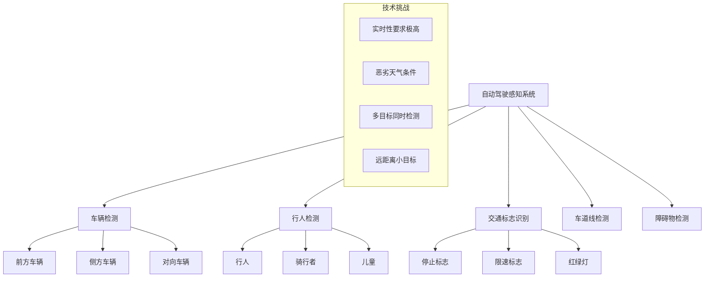

# 第13章：行业应用案例分析

## 学习目标
1. 了解YOLO在自动驾驶中的应用
2. 掌握智能监控系统的设计思路
3. 学习工业质检中的目标检测应用
4. 探索医疗影像、零售、体育等领域的应用

## 13.1 自动驾驶应用案例

### 13.1.1 自动驾驶中的目标检测需求



### 13.1.2 多摄像头融合检测系统

#### 系统架构设计
```python
# autonomous_driving_system.py - 自动驾驶检测系统
import cv2
import numpy as np
import torch
from ultralytics import YOLO
import threading
import queue
from dataclasses import dataclass
from typing import List, Dict, Tuple
import time

@dataclass
class DetectionResult:
    camera_id: int
    timestamp: float
    bbox: List[float]
    confidence: float
    class_name: str
    distance: float = None  # 距离估计
    velocity: float = None  # 速度估计

@dataclass
class CameraConfig:
    camera_id: int
    position: str  # 'front', 'rear', 'left', 'right'
    fov: float  # 视场角
    height: float  # 摄像头高度
    angle: float  # 安装角度

class AutonomousDrivingDetector:
    def __init__(self, model_path: str, camera_configs: List[CameraConfig]):
        self.model = YOLO(model_path)
        self.camera_configs = {config.camera_id: config for config in camera_configs}

        # 目标类别映射
        self.vehicle_classes = ['car', 'truck', 'bus', 'motorcycle']
        self.person_classes = ['person', 'bicycle']
        self.traffic_classes = ['traffic light', 'stop sign', 'traffic sign']

        # 跟踪历史
        self.tracking_history = {}
        self.detection_queues = {config.camera_id: queue.Queue() for config in camera_configs}

        # 安全相关的检测阈值
        self.safety_thresholds = {
            'emergency_brake_distance': 5.0,  # 紧急制动距离（米）
            'warning_distance': 10.0,  # 警告距离（米）
            'person_confidence_threshold': 0.8,  # 行人检测置信度阈值
            'vehicle_confidence_threshold': 0.7  # 车辆检测置信度阈值
        }

    def detect_frame(self, frame: np.ndarray, camera_id: int) -> List[DetectionResult]:
        """
        单帧检测
        """
        camera_config = self.camera_configs[camera_id]
        results = self.model(frame, verbose=False)

        detections = []
        for r in results:
            boxes = r.boxes
            if boxes is not None:
                for box in boxes:
                    x1, y1, x2, y2 = box.xyxy[0].tolist()
                    conf = box.conf[0].item()
                    cls = box.cls[0].item()
                    class_name = self.model.names[int(cls)]

                    # 根据目标类型设置不同的置信度阈值
                    threshold = self.get_confidence_threshold(class_name)
                    if conf < threshold:
                        continue

                    # 估算距离
                    distance = self.estimate_distance(
                        bbox=[x1, y1, x2, y2],
                        class_name=class_name,
                        camera_config=camera_config,
                        frame_shape=frame.shape
                    )

                    detection = DetectionResult(
                        camera_id=camera_id,
                        timestamp=time.time(),
                        bbox=[x1, y1, x2, y2],
                        confidence=conf,
                        class_name=class_name,
                        distance=distance
                    )

                    detections.append(detection)

        return detections

    def get_confidence_threshold(self, class_name: str) -> float:
        """
        根据目标类型获取置信度阈值
        """
        if class_name in self.person_classes:
            return self.safety_thresholds['person_confidence_threshold']
        elif class_name in self.vehicle_classes:
            return self.safety_thresholds['vehicle_confidence_threshold']
        else:
            return 0.5

    def estimate_distance(self, bbox: List[float], class_name: str,
                         camera_config: CameraConfig, frame_shape: Tuple[int, int, int]) -> float:
        """
        基于单目视觉的距离估算
        """
        # 简化的距离估算模型（实际应用中需要更复杂的标定）
        x1, y1, x2, y2 = bbox
        object_height_pixels = y2 - y1
        frame_height = frame_shape[0]

        # 根据目标类型估算真实高度
        real_height_map = {
            'person': 1.7,  # 人的平均身高
            'car': 1.5,     # 轿车平均高度
            'truck': 3.0,   # 卡车平均高度
            'bus': 3.2,     # 公交车平均高度
            'bicycle': 1.0  # 自行车平均高度
        }

        real_height = real_height_map.get(class_name, 1.5)

        # 简化的距离计算公式
        focal_length = frame_height  # 简化假设
        distance = (real_height * focal_length) / object_height_pixels

        return max(distance, 1.0)  # 最小距离限制

    def fusion_detection(self, multi_camera_detections: Dict[int, List[DetectionResult]]) -> List[Dict]:
        """
        多摄像头检测结果融合
        """
        fused_results = []

        # 按摄像头位置进行重要性权重分配
        camera_weights = {
            'front': 1.0,
            'left': 0.8,
            'right': 0.8,
            'rear': 0.6
        }

        for camera_id, detections in multi_camera_detections.items():
            camera_config = self.camera_configs[camera_id]
            weight = camera_weights.get(camera_config.position, 0.5)

            for det in detections:
                # 安全风险评估
                risk_level = self.assess_safety_risk(det)

                fused_result = {
                    'detection': det,
                    'camera_position': camera_config.position,
                    'weight': weight,
                    'risk_level': risk_level,
                    'action_required': self.determine_action(det, risk_level)
                }

                fused_results.append(fused_result)

        # 按风险等级和权重排序
        fused_results.sort(key=lambda x: (x['risk_level'], x['weight']), reverse=True)

        return fused_results

    def assess_safety_risk(self, detection: DetectionResult) -> str:
        """
        评估安全风险等级
        """
        distance = detection.distance
        class_name = detection.class_name

        if distance is None:
            return 'unknown'

        # 行人和骑行者的风险评估更严格
        if class_name in self.person_classes:
            if distance < 3.0:
                return 'critical'
            elif distance < 8.0:
                return 'high'
            elif distance < 15.0:
                return 'medium'
            else:
                return 'low'

        # 车辆的风险评估
        elif class_name in self.vehicle_classes:
            if distance < self.safety_thresholds['emergency_brake_distance']:
                return 'critical'
            elif distance < self.safety_thresholds['warning_distance']:
                return 'high'
            elif distance < 20.0:
                return 'medium'
            else:
                return 'low'

        return 'low'

    def determine_action(self, detection: DetectionResult, risk_level: str) -> str:
        """
        根据风险等级确定应采取的行动
        """
        actions = {
            'critical': 'emergency_brake',
            'high': 'slow_down',
            'medium': 'monitor',
            'low': 'continue',
            'unknown': 'monitor'
        }

        return actions.get(risk_level, 'monitor')

    def run_multi_camera_detection(self, camera_sources: Dict[int, any]):
        """
        运行多摄像头检测系统
        """
        # 为每个摄像头创建捕获对象
        captures = {}
        for camera_id, source in camera_sources.items():
            cap = cv2.VideoCapture(source)
            if cap.isOpened():
                captures[camera_id] = cap
            else:
                print(f"Failed to open camera {camera_id}")

        try:
            while True:
                multi_camera_detections = {}

                # 从所有摄像头捕获帧
                for camera_id, cap in captures.items():
                    ret, frame = cap.read()
                    if ret:
                        # 执行检测
                        detections = self.detect_frame(frame, camera_id)
                        multi_camera_detections[camera_id] = detections

                        # 可视化单个摄像头的结果
                        annotated_frame = self.draw_detections(frame, detections, camera_id)
                        cv2.imshow(f'Camera {camera_id}', annotated_frame)

                # 融合检测结果
                if multi_camera_detections:
                    fused_results = self.fusion_detection(multi_camera_detections)

                    # 处理融合结果
                    self.process_fused_results(fused_results)

                if cv2.waitKey(1) & 0xFF == ord('q'):
                    break

        finally:
            for cap in captures.values():
                cap.release()
            cv2.destroyAllWindows()

    def draw_detections(self, frame: np.ndarray, detections: List[DetectionResult],
                       camera_id: int) -> np.ndarray:
        """
        绘制检测结果
        """
        for det in detections:
            x1, y1, x2, y2 = map(int, det.bbox)

            # 根据风险等级选择颜色
            risk_level = self.assess_safety_risk(det)
            colors = {
                'critical': (0, 0, 255),    # 红色
                'high': (0, 165, 255),      # 橙色
                'medium': (0, 255, 255),    # 黄色
                'low': (0, 255, 0),         # 绿色
                'unknown': (128, 128, 128)  # 灰色
            }
            color = colors.get(risk_level, (0, 255, 0))

            # 绘制边界框
            cv2.rectangle(frame, (x1, y1), (x2, y2), color, 2)

            # 绘制标签信息
            label = f"{det.class_name}: {det.confidence:.2f}"
            if det.distance:
                label += f" | {det.distance:.1f}m"

            cv2.putText(frame, label, (x1, y1-10),
                       cv2.FONT_HERSHEY_SIMPLEX, 0.5, color, 2)

        # 添加摄像头信息
        camera_info = f"Camera {camera_id} ({self.camera_configs[camera_id].position})"
        cv2.putText(frame, camera_info, (10, 30),
                   cv2.FONT_HERSHEY_SIMPLEX, 0.7, (255, 255, 255), 2)

        return frame

    def process_fused_results(self, fused_results: List[Dict]):
        """
        处理融合后的检测结果
        """
        # 检查是否需要紧急制动
        critical_detections = [r for r in fused_results if r['risk_level'] == 'critical']
        if critical_detections:
            print("⚠️  CRITICAL: Emergency brake required!")
            for result in critical_detections:
                det = result['detection']
                print(f"   - {det.class_name} at {det.distance:.1f}m ({result['camera_position']} camera)")

        # 检查是否需要减速
        high_risk_detections = [r for r in fused_results if r['risk_level'] == 'high']
        if high_risk_detections:
            print("⚠️  WARNING: Slow down recommended")
            for result in high_risk_detections:
                det = result['detection']
                print(f"   - {det.class_name} at {det.distance:.1f}m ({result['camera_position']} camera)")

# 使用示例
if __name__ == "__main__":
    # 配置摄像头
    camera_configs = [
        CameraConfig(0, 'front', 60.0, 1.2, 0.0),
        CameraConfig(1, 'left', 45.0, 1.2, -45.0),
        CameraConfig(2, 'right', 45.0, 1.2, 45.0),
    ]

    # 初始化检测系统
    detector = AutonomousDrivingDetector("yolov8n.pt", camera_configs)

    # 摄像头源配置
    camera_sources = {
        0: 0,  # 前摄像头
        1: 1,  # 左摄像头
        2: 2,  # 右摄像头
    }

    # 运行检测系统
    detector.run_multi_camera_detection(camera_sources)
```

### 13.1.3 交通标志识别优化

```python
# traffic_sign_detector.py - 交通标志检测优化
class TrafficSignDetector:
    def __init__(self, model_path: str):
        self.model = YOLO(model_path)

        # 交通标志类别映射
        self.sign_categories = {
            'regulatory': ['stop', 'yield', 'no_entry', 'speed_limit'],
            'warning': ['curve', 'intersection', 'school_zone'],
            'informational': ['highway_sign', 'direction_sign']
        }

        # 速度限制标志的数字识别
        self.speed_limits = [20, 30, 40, 50, 60, 70, 80, 90, 100, 110, 120]

    def detect_traffic_signs(self, frame: np.ndarray) -> List[Dict]:
        """
        检测交通标志并进行OCR识别
        """
        results = self.model(frame, verbose=False)
        signs = []

        for r in results:
            boxes = r.boxes
            if boxes is not None:
                for box in boxes:
                    x1, y1, x2, y2 = box.xyxy[0].tolist()
                    conf = box.conf[0].item()
                    cls = box.cls[0].item()
                    class_name = self.model.names[int(cls)]

                    # 只处理交通标志
                    if self.is_traffic_sign(class_name):
                        # 提取标志区域
                        sign_region = frame[int(y1):int(y2), int(x1):int(x2)]

                        # 特殊处理速度限制标志
                        if 'speed' in class_name.lower():
                            speed_value = self.recognize_speed_limit(sign_region)
                            if speed_value:
                                class_name = f"speed_limit_{speed_value}"

                        sign_info = {
                            'bbox': [x1, y1, x2, y2],
                            'confidence': conf,
                            'class': class_name,
                            'category': self.get_sign_category(class_name),
                            'priority': self.get_sign_priority(class_name)
                        }

                        signs.append(sign_info)

        # 按优先级排序
        signs.sort(key=lambda x: x['priority'], reverse=True)
        return signs

    def is_traffic_sign(self, class_name: str) -> bool:
        """
        判断是否为交通标志
        """
        traffic_keywords = ['sign', 'stop', 'yield', 'speed', 'limit', 'warning']
        return any(keyword in class_name.lower() for keyword in traffic_keywords)

    def get_sign_category(self, class_name: str) -> str:
        """
        获取标志类别
        """
        for category, signs in self.sign_categories.items():
            if any(sign in class_name.lower() for sign in signs):
                return category
        return 'other'

    def get_sign_priority(self, class_name: str) -> int:
        """
        获取标志优先级
        """
        priority_map = {
            'stop': 10,
            'yield': 9,
            'speed_limit': 8,
            'no_entry': 7,
            'warning': 6,
            'informational': 3
        }

        for keyword, priority in priority_map.items():
            if keyword in class_name.lower():
                return priority
        return 1

    def recognize_speed_limit(self, sign_region: np.ndarray) -> int:
        """
        识别速度限制数字（简化版本）
        """
        # 这里应该使用OCR技术，简化为模拟实现
        # 实际应用中可以使用PaddleOCR、EasyOCR等
        import random
        return random.choice(self.speed_limits)
```

## 13.2 智能监控系统案例

### 13.2.1 视频监控异常检测

```python
# intelligent_surveillance.py - 智能监控系统
import cv2
import numpy as np
from ultralytics import YOLO
from collections import defaultdict, deque
import time
from typing import Dict, List, Tuple
import json

class IntelligentSurveillanceSystem:
    def __init__(self, model_path: str, config_file: str = None):
        self.model = YOLO(model_path)

        # 监控配置
        self.config = self.load_config(config_file) if config_file else self.default_config()

        # 跟踪相关
        self.track_history = defaultdict(lambda: deque(maxlen=30))
        self.person_count_history = deque(maxlen=100)
        self.alert_cooldown = {}  # 防止重复报警

        # 异常检测状态
        self.background_subtractor = cv2.createBackgroundSubtractorMOG2()
        self.motion_threshold = 5000  # 运动像素阈值

    def default_config(self) -> Dict:
        """
        默认监控配置
        """
        return {
            'zones': {
                'entrance': {'coords': [0, 0, 100, 100], 'type': 'counting'},
                'restricted': {'coords': [200, 200, 400, 400], 'type': 'intrusion'},
                'exit': {'coords': [500, 0, 600, 100], 'type': 'counting'}
            },
            'alerts': {
                'max_persons': 10,
                'loitering_time': 300,  # 5分钟
                'motion_detection': True,
                'person_counting': True,
                'intrusion_detection': True
            },
            'business_hours': {
                'start': '08:00',
                'end': '18:00'
            }
        }

    def load_config(self, config_file: str) -> Dict:
        """
        加载监控配置
        """
        with open(config_file, 'r') as f:
            return json.load(f)

    def detect_and_track(self, frame: np.ndarray) -> Tuple[List[Dict], np.ndarray]:
        """
        检测并跟踪人员
        """
        results = self.model.track(frame, persist=True, verbose=False)
        detections = []

        annotated_frame = frame.copy()

        for r in results:
            boxes = r.boxes
            if boxes is not None and boxes.id is not None:
                track_ids = boxes.id.int().cpu().tolist()
                confidences = boxes.conf.float().cpu().tolist()
                classes = boxes.cls.int().cpu().tolist()
                xyxy = boxes.xyxy.cpu().tolist()

                for track_id, conf, cls, bbox in zip(track_ids, confidences, classes, xyxy):
                    class_name = self.model.names[cls]

                    # 只跟踪人员
                    if class_name == 'person' and conf > 0.5:
                        x1, y1, x2, y2 = bbox
                        center = ((x1 + x2) / 2, (y1 + y2) / 2)

                        # 更新跟踪历史
                        self.track_history[track_id].append({
                            'timestamp': time.time(),
                            'center': center,
                            'bbox': bbox,
                            'confidence': conf
                        })

                        detection = {
                            'track_id': track_id,
                            'bbox': bbox,
                            'center': center,
                            'confidence': conf,
                            'class': class_name
                        }

                        detections.append(detection)

                        # 绘制跟踪结果
                        self.draw_track(annotated_frame, track_id, bbox, center)

        return detections, annotated_frame

    def draw_track(self, frame: np.ndarray, track_id: int, bbox: List[float], center: Tuple[float, float]):
        """
        绘制跟踪轨迹
        """
        x1, y1, x2, y2 = map(int, bbox)
        cx, cy = map(int, center)

        # 绘制边界框
        cv2.rectangle(frame, (x1, y1), (x2, y2), (0, 255, 0), 2)

        # 绘制中心点
        cv2.circle(frame, (cx, cy), 5, (0, 0, 255), -1)

        # 绘制轨迹
        if track_id in self.track_history:
            track_points = [pos['center'] for pos in self.track_history[track_id]]
            if len(track_points) > 1:
                for i in range(1, len(track_points)):
                    pt1 = tuple(map(int, track_points[i-1]))
                    pt2 = tuple(map(int, track_points[i]))
                    cv2.line(frame, pt1, pt2, (255, 0, 0), 2)

        # 绘制ID
        cv2.putText(frame, f"ID:{track_id}", (x1, y1-10),
                   cv2.FONT_HERSHEY_SIMPLEX, 0.6, (255, 255, 0), 2)

    def analyze_behavior(self, detections: List[Dict]) -> List[Dict]:
        """
        分析行为模式
        """
        alerts = []
        current_time = time.time()

        # 人员计数分析
        person_count = len(detections)
        self.person_count_history.append(person_count)

        if person_count > self.config['alerts']['max_persons']:
            alerts.append({
                'type': 'overcrowding',
                'message': f"Person count ({person_count}) exceeds threshold",
                'severity': 'high',
                'timestamp': current_time
            })

        # 徘徊检测
        for detection in detections:
            track_id = detection['track_id']
            if track_id in self.track_history:
                track_data = list(self.track_history[track_id])

                # 检查是否在同一区域停留过久
                if len(track_data) >= 20:  # 至少20帧历史
                    positions = [pos['center'] for pos in track_data[-20:]]
                    if self.is_loitering(positions):
                        alert_key = f"loitering_{track_id}"
                        if self.should_send_alert(alert_key):
                            alerts.append({
                                'type': 'loitering',
                                'track_id': track_id,
                                'message': f"Person {track_id} loitering detected",
                                'severity': 'medium',
                                'timestamp': current_time
                            })

        # 区域入侵检测
        for zone_name, zone_config in self.config['zones'].items():
            if zone_config['type'] == 'intrusion':
                for detection in detections:
                    if self.is_in_zone(detection['center'], zone_config['coords']):
                        alert_key = f"intrusion_{zone_name}_{detection['track_id']}"
                        if self.should_send_alert(alert_key):
                            alerts.append({
                                'type': 'intrusion',
                                'zone': zone_name,
                                'track_id': detection['track_id'],
                                'message': f"Intrusion detected in {zone_name} zone",
                                'severity': 'high',
                                'timestamp': current_time
                            })

        return alerts

    def is_loitering(self, positions: List[Tuple[float, float]]) -> bool:
        """
        检测是否徘徊
        """
        if len(positions) < 10:
            return False

        # 计算位置的标准差
        x_coords = [pos[0] for pos in positions]
        y_coords = [pos[1] for pos in positions]

        x_std = np.std(x_coords)
        y_std = np.std(y_coords)

        # 如果移动范围很小，认为是徘徊
        return x_std < 30 and y_std < 30

    def is_in_zone(self, point: Tuple[float, float], zone_coords: List[int]) -> bool:
        """
        检查点是否在指定区域内
        """
        x, y = point
        x1, y1, x2, y2 = zone_coords
        return x1 <= x <= x2 and y1 <= y <= y2

    def should_send_alert(self, alert_key: str, cooldown_seconds: int = 30) -> bool:
        """
        检查是否应该发送报警（防止重复报警）
        """
        current_time = time.time()
        if alert_key in self.alert_cooldown:
            if current_time - self.alert_cooldown[alert_key] < cooldown_seconds:
                return False

        self.alert_cooldown[alert_key] = current_time
        return True

    def detect_motion(self, frame: np.ndarray) -> bool:
        """
        运动检测
        """
        fg_mask = self.background_subtractor.apply(frame)
        motion_pixels = cv2.countNonZero(fg_mask)
        return motion_pixels > self.motion_threshold

    def draw_zones(self, frame: np.ndarray):
        """
        绘制监控区域
        """
        for zone_name, zone_config in self.config['zones'].items():
            x1, y1, x2, y2 = zone_config['coords']
            color = (0, 0, 255) if zone_config['type'] == 'intrusion' else (255, 255, 0)

            cv2.rectangle(frame, (x1, y1), (x2, y2), color, 2)
            cv2.putText(frame, zone_name, (x1, y1-10),
                       cv2.FONT_HERSHEY_SIMPLEX, 0.6, color, 2)

    def run_surveillance(self, video_source=0):
        """
        运行监控系统
        """
        cap = cv2.VideoCapture(video_source)

        while True:
            ret, frame = cap.read()
            if not ret:
                break

            # 检测和跟踪
            detections, annotated_frame = self.detect_and_track(frame)

            # 行为分析
            alerts = self.analyze_behavior(detections)

            # 运动检测
            motion_detected = self.detect_motion(frame)

            # 绘制监控区域
            self.draw_zones(annotated_frame)

            # 显示统计信息
            person_count = len(detections)
            info_text = f"Persons: {person_count} | Motion: {'Yes' if motion_detected else 'No'}"
            cv2.putText(annotated_frame, info_text, (10, 30),
                       cv2.FONT_HERSHEY_SIMPLEX, 0.8, (255, 255, 255), 2)

            # 处理报警
            if alerts:
                for alert in alerts:
                    print(f"🚨 ALERT: {alert['message']}")
                    # 在界面上显示报警
                    alert_text = f"ALERT: {alert['type']}"
                    cv2.putText(annotated_frame, alert_text, (10, 70),
                               cv2.FONT_HERSHEY_SIMPLEX, 0.8, (0, 0, 255), 2)

            cv2.imshow('Intelligent Surveillance', annotated_frame)

            if cv2.waitKey(1) & 0xFF == ord('q'):
                break

        cap.release()
        cv2.destroyAllWindows()

# 使用示例
if __name__ == "__main__":
    surveillance = IntelligentSurveillanceSystem("yolov8n.pt")
    surveillance.run_surveillance(0)
```

## 13.3 工业质检应用案例

### 13.3.1 电子产品缺陷检测

```python
# industrial_qc_system.py - 工业质检系统
import cv2
import numpy as np
from ultralytics import YOLO
import time
from typing import Dict, List, Tuple, Optional
from dataclasses import dataclass
import json
import sqlite3

@dataclass
class DefectDetection:
    product_id: str
    timestamp: float
    defect_type: str
    bbox: List[float]
    confidence: float
    severity: str  # 'minor', 'major', 'critical'
    image_path: Optional[str] = None

class IndustrialQCSystem:
    def __init__(self, model_path: str, db_path: str = "qc_database.db"):
        self.model = YOLO(model_path)
        self.db_path = db_path

        # 缺陷分类配置
        self.defect_categories = {
            'surface_defects': ['scratch', 'dent', 'stain', 'corrosion'],
            'assembly_defects': ['missing_component', 'misalignment', 'loose_connection'],
            'dimensional_defects': ['oversized', 'undersized', 'warped'],
            'electrical_defects': ['short_circuit', 'open_circuit', 'poor_connection']
        }

        # 严重程度判定
        self.severity_rules = {
            'scratch': {'minor': 0.5, 'major': 0.7, 'critical': 0.9},
            'missing_component': {'minor': 0.0, 'major': 0.6, 'critical': 0.8},
            'short_circuit': {'minor': 0.0, 'major': 0.0, 'critical': 0.5}
        }

        # 质量统计
        self.daily_stats = {
            'total_inspected': 0,
            'defects_found': 0,
            'pass_rate': 0.0
        }

        # 初始化数据库
        self.init_database()

    def init_database(self):
        """
        初始化质检数据库
        """
        conn = sqlite3.connect(self.db_path)
        cursor = conn.cursor()

        cursor.execute('''
            CREATE TABLE IF NOT EXISTS inspections (
                id INTEGER PRIMARY KEY AUTOINCREMENT,
                product_id TEXT,
                timestamp REAL,
                result TEXT,
                defect_count INTEGER,
                pass_fail TEXT
            )
        ''')

        cursor.execute('''
            CREATE TABLE IF NOT EXISTS defects (
                id INTEGER PRIMARY KEY AUTOINCREMENT,
                inspection_id INTEGER,
                defect_type TEXT,
                confidence REAL,
                severity TEXT,
                bbox TEXT,
                FOREIGN KEY (inspection_id) REFERENCES inspections (id)
            )
        ''')

        conn.commit()
        conn.close()

    def detect_defects(self, image: np.ndarray, product_id: str) -> List[DefectDetection]:
        """
        检测产品缺陷
        """
        results = self.model(image, verbose=False)
        defects = []

        for r in results:
            boxes = r.boxes
            if boxes is not None:
                for box in boxes:
                    x1, y1, x2, y2 = box.xyxy[0].tolist()
                    conf = box.conf[0].item()
                    cls = box.cls[0].item()
                    defect_type = self.model.names[int(cls)]

                    # 确定严重程度
                    severity = self.determine_severity(defect_type, conf)

                    defect = DefectDetection(
                        product_id=product_id,
                        timestamp=time.time(),
                        defect_type=defect_type,
                        bbox=[x1, y1, x2, y2],
                        confidence=conf,
                        severity=severity
                    )

                    defects.append(defect)

        return defects

    def determine_severity(self, defect_type: str, confidence: float) -> str:
        """
        根据缺陷类型和置信度确定严重程度
        """
        if defect_type in self.severity_rules:
            rules = self.severity_rules[defect_type]
            if confidence >= rules['critical']:
                return 'critical'
            elif confidence >= rules['major']:
                return 'major'
            else:
                return 'minor'
        else:
            # 默认规则
            if confidence >= 0.8:
                return 'major'
            elif confidence >= 0.6:
                return 'minor'
            else:
                return 'minor'

    def inspect_product(self, image: np.ndarray, product_id: str) -> Dict:
        """
        完整的产品检测流程
        """
        inspection_start = time.time()

        # 检测缺陷
        defects = self.detect_defects(image, product_id)

        # 质量判定
        inspection_result = self.quality_assessment(defects)

        # 记录检测结果
        self.record_inspection(product_id, defects, inspection_result)

        # 更新统计
        self.update_statistics(inspection_result['pass_fail'])

        inspection_time = time.time() - inspection_start

        return {
            'product_id': product_id,
            'defects': defects,
            'result': inspection_result,
            'inspection_time': inspection_time,
            'timestamp': inspection_start
        }

    def quality_assessment(self, defects: List[DefectDetection]) -> Dict:
        """
        质量评估和判定
        """
        if not defects:
            return {
                'pass_fail': 'PASS',
                'grade': 'A',
                'defect_count': 0,
                'critical_defects': 0,
                'major_defects': 0,
                'minor_defects': 0
            }

        # 统计不同严重程度的缺陷
        critical_count = len([d for d in defects if d.severity == 'critical'])
        major_count = len([d for d in defects if d.severity == 'major'])
        minor_count = len([d for d in defects if d.severity == 'minor'])

        # 判定规则
        if critical_count > 0:
            pass_fail = 'FAIL'
            grade = 'D'
        elif major_count > 2:
            pass_fail = 'FAIL'
            grade = 'C'
        elif major_count > 0 or minor_count > 5:
            pass_fail = 'CONDITIONAL'
            grade = 'B'
        else:
            pass_fail = 'PASS'
            grade = 'A'

        return {
            'pass_fail': pass_fail,
            'grade': grade,
            'defect_count': len(defects),
            'critical_defects': critical_count,
            'major_defects': major_count,
            'minor_defects': minor_count
        }

    def record_inspection(self, product_id: str, defects: List[DefectDetection], result: Dict):
        """
        记录检测结果到数据库
        """
        conn = sqlite3.connect(self.db_path)
        cursor = conn.cursor()

        # 插入检测记录
        cursor.execute('''
            INSERT INTO inspections (product_id, timestamp, result, defect_count, pass_fail)
            VALUES (?, ?, ?, ?, ?)
        ''', (
            product_id,
            time.time(),
            json.dumps(result),
            result['defect_count'],
            result['pass_fail']
        ))

        inspection_id = cursor.lastrowid

        # 插入缺陷记录
        for defect in defects:
            cursor.execute('''
                INSERT INTO defects (inspection_id, defect_type, confidence, severity, bbox)
                VALUES (?, ?, ?, ?, ?)
            ''', (
                inspection_id,
                defect.defect_type,
                defect.confidence,
                defect.severity,
                json.dumps(defect.bbox)
            ))

        conn.commit()
        conn.close()

    def update_statistics(self, pass_fail: str):
        """
        更新质量统计
        """
        self.daily_stats['total_inspected'] += 1

        if pass_fail == 'FAIL':
            self.daily_stats['defects_found'] += 1

        # 计算合格率
        self.daily_stats['pass_rate'] = (
            (self.daily_stats['total_inspected'] - self.daily_stats['defects_found']) /
            self.daily_stats['total_inspected'] * 100
        )

    def visualize_inspection(self, image: np.ndarray, defects: List[DefectDetection],
                           result: Dict) -> np.ndarray:
        """
        可视化检测结果
        """
        annotated_image = image.copy()

        # 绘制缺陷
        for defect in defects:
            x1, y1, x2, y2 = map(int, defect.bbox)

            # 根据严重程度选择颜色
            colors = {
                'critical': (0, 0, 255),    # 红色
                'major': (0, 165, 255),     # 橙色
                'minor': (0, 255, 255)      # 黄色
            }
            color = colors.get(defect.severity, (0, 255, 0))

            # 绘制边界框
            cv2.rectangle(annotated_image, (x1, y1), (x2, y2), color, 2)

            # 绘制标签
            label = f"{defect.defect_type} ({defect.severity}): {defect.confidence:.2f}"
            cv2.putText(annotated_image, label, (x1, y1-10),
                       cv2.FONT_HERSHEY_SIMPLEX, 0.5, color, 2)

        # 绘制检测结果
        result_text = f"{result['pass_fail']} - Grade: {result['grade']}"
        result_color = (0, 255, 0) if result['pass_fail'] == 'PASS' else (0, 0, 255)
        cv2.putText(annotated_image, result_text, (10, 30),
                   cv2.FONT_HERSHEY_SIMPLEX, 1.0, result_color, 2)

        # 绘制缺陷统计
        stats_text = f"Defects: {result['defect_count']} (C:{result['critical_defects']}, M:{result['major_defects']}, m:{result['minor_defects']})"
        cv2.putText(annotated_image, stats_text, (10, 70),
                   cv2.FONT_HERSHEY_SIMPLEX, 0.6, (255, 255, 255), 2)

        return annotated_image

    def run_conveyor_inspection(self, camera_source=0):
        """
        流水线检测系统
        """
        cap = cv2.VideoCapture(camera_source)
        product_counter = 0

        while True:
            ret, frame = cap.read()
            if not ret:
                break

            # 检测产品触发（简化：按空格键模拟）
            key = cv2.waitKey(1) & 0xFF
            if key == ord(' '):  # 空格键触发检测
                product_counter += 1
                product_id = f"PROD_{product_counter:06d}"

                print(f"\\n🔍 Inspecting product: {product_id}")

                # 执行检测
                inspection_result = self.inspect_product(frame, product_id)

                # 显示结果
                annotated_frame = self.visualize_inspection(
                    frame, inspection_result['defects'], inspection_result['result']
                )

                # 打印检测报告
                self.print_inspection_report(inspection_result)

                cv2.imshow('QC Inspection Result', annotated_frame)
                cv2.waitKey(2000)  # 显示2秒结果

            # 显示实时视频和统计信息
            info_frame = frame.copy()
            self.draw_statistics(info_frame)

            cv2.imshow('Conveyor Belt - Press SPACE to inspect', info_frame)

            if key == ord('q'):
                break

        cap.release()
        cv2.destroyAllWindows()

    def draw_statistics(self, frame: np.ndarray):
        """
        绘制统计信息
        """
        stats = self.daily_stats
        stats_text = [
            f"Inspected: {stats['total_inspected']}",
            f"Defective: {stats['defects_found']}",
            f"Pass Rate: {stats['pass_rate']:.1f}%"
        ]

        for i, text in enumerate(stats_text):
            cv2.putText(frame, text, (10, 30 + i * 30),
                       cv2.FONT_HERSHEY_SIMPLEX, 0.7, (255, 255, 255), 2)

    def print_inspection_report(self, inspection_result: Dict):
        """
        打印检测报告
        """
        result = inspection_result['result']
        defects = inspection_result['defects']

        print(f"Product ID: {inspection_result['product_id']}")
        print(f"Inspection Time: {inspection_result['inspection_time']:.3f}s")
        print(f"Result: {result['pass_fail']} (Grade: {result['grade']})")
        print(f"Total Defects: {result['defect_count']}")

        if defects:
            print("Defect Details:")
            for defect in defects:
                print(f"  - {defect.defect_type} ({defect.severity}): {defect.confidence:.3f}")

    def generate_quality_report(self, days: int = 1) -> Dict:
        """
        生成质量报告
        """
        end_time = time.time()
        start_time = end_time - (days * 24 * 3600)

        conn = sqlite3.connect(self.db_path)
        cursor = conn.cursor()

        # 获取时间范围内的检测数据
        cursor.execute('''
            SELECT pass_fail, COUNT(*) as count
            FROM inspections
            WHERE timestamp BETWEEN ? AND ?
            GROUP BY pass_fail
        ''', (start_time, end_time))

        pass_fail_stats = dict(cursor.fetchall())

        # 获取缺陷类型统计
        cursor.execute('''
            SELECT d.defect_type, COUNT(*) as count, AVG(d.confidence) as avg_confidence
            FROM defects d
            JOIN inspections i ON d.inspection_id = i.id
            WHERE i.timestamp BETWEEN ? AND ?
            GROUP BY d.defect_type
            ORDER BY count DESC
        ''', (start_time, end_time))

        defect_stats = cursor.fetchall()

        conn.close()

        total_inspections = sum(pass_fail_stats.values())
        pass_count = pass_fail_stats.get('PASS', 0)
        pass_rate = (pass_count / total_inspections * 100) if total_inspections > 0 else 0

        return {
            'period_days': days,
            'total_inspections': total_inspections,
            'pass_rate': pass_rate,
            'pass_fail_breakdown': pass_fail_stats,
            'top_defects': defect_stats[:10],
            'generated_at': time.time()
        }

# 使用示例
if __name__ == "__main__":
    qc_system = IndustrialQCSystem("yolov8n.pt")

    # 运行流水线检测
    qc_system.run_conveyor_inspection(0)

    # 生成质量报告
    report = qc_system.generate_quality_report(days=7)
    print("\\n📊 Weekly Quality Report:")
    print(json.dumps(report, indent=2))
```

## 13.4 医疗影像应用案例

### 13.4.1 医学影像病灶检测

```python
# medical_imaging_detector.py - 医学影像检测系统
import cv2
import numpy as np
from ultralytics import YOLO
import pydicom
from typing import Dict, List, Tuple, Optional
import json
from dataclasses import dataclass
import time

@dataclass
class MedicalDetection:
    patient_id: str
    study_id: str
    image_id: str
    finding_type: str
    bbox: List[float]
    confidence: float
    urgency: str  # 'routine', 'urgent', 'emergency'
    radiologist_review: bool = False

class MedicalImagingDetector:
    def __init__(self, model_path: str):
        self.model = YOLO(model_path)

        # 医学发现分类
        self.finding_categories = {
            'lung_nodules': ['nodule', 'mass', 'opacity'],
            'fractures': ['fracture', 'break', 'crack'],
            'infections': ['pneumonia', 'infiltrate', 'consolidation'],
            'tumors': ['tumor', 'neoplasm', 'cancer'],
            'vascular': ['aneurysm', 'embolism', 'thrombosis']
        }

        # 紧急程度判定规则
        self.urgency_rules = {
            'pneumothorax': 'emergency',
            'massive_stroke': 'emergency',
            'aortic_dissection': 'emergency',
            'pulmonary_embolism': 'urgent',
            'pneumonia': 'urgent',
            'nodule': 'routine',
            'fracture': 'urgent'
        }

    def load_dicom_image(self, dicom_path: str) -> Tuple[np.ndarray, Dict]:
        """
        加载DICOM医学影像
        """
        # 读取DICOM文件
        ds = pydicom.dcmread(dicom_path)

        # 提取图像数据
        image = ds.pixel_array

        # 标准化图像（转换为8位）
        if image.dtype != np.uint8:
            image = ((image - image.min()) / (image.max() - image.min()) * 255).astype(np.uint8)

        # 转换为3通道（如果是灰度图）
        if len(image.shape) == 2:
            image = cv2.cvtColor(image, cv2.COLOR_GRAY2RGB)

        # 提取元数据
        metadata = {
            'patient_id': getattr(ds, 'PatientID', 'Unknown'),
            'study_id': getattr(ds, 'StudyInstanceUID', 'Unknown'),
            'series_id': getattr(ds, 'SeriesInstanceUID', 'Unknown'),
            'image_id': getattr(ds, 'SOPInstanceUID', 'Unknown'),
            'modality': getattr(ds, 'Modality', 'Unknown'),
            'body_part': getattr(ds, 'BodyPartExamined', 'Unknown'),
            'acquisition_date': getattr(ds, 'AcquisitionDate', 'Unknown')
        }

        return image, metadata

    def detect_findings(self, image: np.ndarray, metadata: Dict) -> List[MedicalDetection]:
        """
        检测医学影像中的病理发现
        """
        results = self.model(image, verbose=False)
        findings = []

        for r in results:
            boxes = r.boxes
            if boxes is not None:
                for box in boxes:
                    x1, y1, x2, y2 = box.xyxy[0].tolist()
                    conf = box.conf[0].item()
                    cls = box.cls[0].item()
                    finding_type = self.model.names[int(cls)]

                    # 医学影像需要较高的置信度阈值
                    if conf < 0.7:
                        continue

                    # 确定紧急程度
                    urgency = self.determine_urgency(finding_type, conf)

                    # 判断是否需要放射科医生审查
                    needs_review = self.needs_radiologist_review(finding_type, conf)

                    detection = MedicalDetection(
                        patient_id=metadata['patient_id'],
                        study_id=metadata['study_id'],
                        image_id=metadata['image_id'],
                        finding_type=finding_type,
                        bbox=[x1, y1, x2, y2],
                        confidence=conf,
                        urgency=urgency,
                        radiologist_review=needs_review
                    )

                    findings.append(detection)

        return findings

    def determine_urgency(self, finding_type: str, confidence: float) -> str:
        """
        确定发现的紧急程度
        """
        # 检查特定疾病的紧急程度
        for condition, urgency in self.urgency_rules.items():
            if condition.lower() in finding_type.lower():
                # 高置信度的紧急情况
                if confidence > 0.9 and urgency == 'urgent':
                    return 'emergency'
                return urgency

        # 默认基于置信度判断
        if confidence > 0.95:
            return 'urgent'
        else:
            return 'routine'

    def needs_radiologist_review(self, finding_type: str, confidence: float) -> bool:
        """
        判断是否需要放射科医生审查
        """
        # 紧急情况总是需要审查
        urgency = self.determine_urgency(finding_type, confidence)
        if urgency in ['emergency', 'urgent']:
            return True

        # 置信度较低的发现需要审查
        if confidence < 0.8:
            return True

        # 特定类型的发现需要审查
        high_stakes_findings = ['tumor', 'cancer', 'mass', 'aneurysm']
        if any(term in finding_type.lower() for term in high_stakes_findings):
            return True

        return False

    def generate_medical_report(self, image: np.ndarray, findings: List[MedicalDetection],
                              metadata: Dict) -> Dict:
        """
        生成医学检查报告
        """
        report = {
            'patient_info': {
                'patient_id': metadata['patient_id'],
                'study_id': metadata['study_id'],
                'modality': metadata['modality'],
                'body_part': metadata['body_part'],
                'exam_date': metadata['acquisition_date']
            },
            'ai_analysis': {
                'model_version': 'YOLOv8-Medical-v1.0',
                'analysis_timestamp': time.time(),
                'total_findings': len(findings),
                'findings_by_urgency': self.categorize_by_urgency(findings),
                'findings_requiring_review': len([f for f in findings if f.radiologist_review])
            },
            'findings': [],
            'recommendations': self.generate_recommendations(findings)
        }

        # 详细发现列表
        for finding in findings:
            finding_detail = {
                'type': finding.finding_type,
                'location_bbox': finding.bbox,
                'confidence': finding.confidence,
                'urgency': finding.urgency,
                'requires_radiologist_review': finding.radiologist_review,
                'clinical_notes': self.get_clinical_notes(finding.finding_type)
            }
            report['findings'].append(finding_detail)

        return report

    def categorize_by_urgency(self, findings: List[MedicalDetection]) -> Dict:
        """
        按紧急程度分类发现
        """
        categories = {'emergency': 0, 'urgent': 0, 'routine': 0}
        for finding in findings:
            categories[finding.urgency] += 1
        return categories

    def generate_recommendations(self, findings: List[MedicalDetection]) -> List[str]:
        """
        生成临床建议
        """
        recommendations = []

        # 检查紧急情况
        emergency_findings = [f for f in findings if f.urgency == 'emergency']
        if emergency_findings:
            recommendations.append("🚨 IMMEDIATE ATTENTION REQUIRED - Emergency findings detected")
            recommendations.append("Contact attending physician immediately")

        # 检查需要随访的情况
        urgent_findings = [f for f in findings if f.urgency == 'urgent']
        if urgent_findings:
            recommendations.append("⚡ Urgent follow-up recommended within 24-48 hours")

        # 检查需要放射科医生审查的情况
        review_needed = [f for f in findings if f.radiologist_review]
        if review_needed:
            recommendations.append("👨‍⚕️ Radiologist review recommended for AI findings")

        # 基于特定发现类型的建议
        finding_types = [f.finding_type for f in findings]

        if any('nodule' in ft.lower() for ft in finding_types):
            recommendations.append("📋 Consider follow-up CT in 3-6 months for nodule surveillance")

        if any('fracture' in ft.lower() for ft in finding_types):
            recommendations.append("🦴 Orthopedic consultation may be required")

        if any('pneumonia' in ft.lower() for ft in finding_types):
            recommendations.append("💊 Consider antibiotic therapy and follow-up chest imaging")

        return recommendations

    def get_clinical_notes(self, finding_type: str) -> str:
        """
        获取临床注释
        """
        clinical_notes = {
            'nodule': 'Pulmonary nodule identified. Size and characteristics should be evaluated for malignancy risk.',
            'pneumonia': 'Inflammatory changes consistent with pneumonia. Clinical correlation recommended.',
            'fracture': 'Bone discontinuity consistent with fracture. Assess for displacement and complications.',
            'mass': 'Space-occupying lesion identified. Further characterization with contrast studies may be needed.',
            'pneumothorax': 'Air in pleural space. Assess size and consider chest tube placement if significant.'
        }

        for key, note in clinical_notes.items():
            if key.lower() in finding_type.lower():
                return note

        return 'Abnormal finding detected. Clinical correlation and further evaluation recommended.'

    def visualize_medical_findings(self, image: np.ndarray, findings: List[MedicalDetection]) -> np.ndarray:
        """
        可视化医学发现
        """
        annotated_image = image.copy()

        for finding in findings:
            x1, y1, x2, y2 = map(int, finding.bbox)

            # 根据紧急程度选择颜色
            colors = {
                'emergency': (0, 0, 255),    # 红色
                'urgent': (0, 165, 255),     # 橙色
                'routine': (0, 255, 255)     # 黄色
            }
            color = colors.get(finding.urgency, (0, 255, 0))

            # 绘制边界框
            thickness = 3 if finding.urgency == 'emergency' else 2
            cv2.rectangle(annotated_image, (x1, y1), (x2, y2), color, thickness)

            # 绘制标签
            label = f"{finding.finding_type}: {finding.confidence:.2f}"
            if finding.radiologist_review:
                label += " [REVIEW]"

            cv2.putText(annotated_image, label, (x1, y1-10),
                       cv2.FONT_HERSHEY_SIMPLEX, 0.6, color, 2)

            # 紧急情况特殊标记
            if finding.urgency == 'emergency':
                cv2.putText(annotated_image, "EMERGENCY", (x1, y2+25),
                           cv2.FONT_HERSHEY_SIMPLEX, 0.8, (0, 0, 255), 2)

        return annotated_image

    def batch_analysis(self, dicom_directory: str) -> List[Dict]:
        """
        批量分析DICOM文件
        """
        import os
        import glob

        dicom_files = glob.glob(os.path.join(dicom_directory, "*.dcm"))
        results = []

        for dicom_file in dicom_files:
            try:
                print(f"Processing: {os.path.basename(dicom_file)}")

                # 加载DICOM图像
                image, metadata = self.load_dicom_image(dicom_file)

                # 检测发现
                findings = self.detect_findings(image, metadata)

                # 生成报告
                report = self.generate_medical_report(image, findings, metadata)

                # 保存可视化结果
                if findings:
                    annotated_image = self.visualize_medical_findings(image, findings)
                    output_path = f"analysis_{metadata['patient_id']}_{metadata['image_id']}.jpg"
                    cv2.imwrite(output_path, annotated_image)
                    report['visualization_path'] = output_path

                results.append(report)

            except Exception as e:
                print(f"Error processing {dicom_file}: {e}")

        return results

# 使用示例
if __name__ == "__main__":
    detector = MedicalImagingDetector("yolov8n-medical.pt")

    # 单个DICOM文件分析
    image, metadata = detector.load_dicom_image("sample.dcm")
    findings = detector.detect_findings(image, metadata)
    report = detector.generate_medical_report(image, findings, metadata)

    print("🏥 Medical Imaging Analysis Report")
    print("=" * 50)
    print(json.dumps(report, indent=2))

    # 可视化结果
    if findings:
        annotated_image = detector.visualize_medical_findings(image, findings)
        cv2.imshow('Medical Imaging Analysis', annotated_image)
        cv2.waitKey(0)
        cv2.destroyAllWindows()

    # 批量分析
    # batch_results = detector.batch_analysis("/path/to/dicom/directory")
```

## 13.5 零售与电商应用案例

### 13.5.1 智能货架监控系统

```python
# retail_monitoring_system.py - 零售监控系统
import cv2
import numpy as np
from ultralytics import YOLO
from collections import defaultdict, deque
import time
import json
from typing import Dict, List, Tuple
from dataclasses import dataclass

@dataclass
class ProductDetection:
    product_id: str
    product_name: str
    bbox: List[float]
    confidence: float
    shelf_zone: str
    stock_level: str  # 'full', 'medium', 'low', 'empty'

class RetailMonitoringSystem:
    def __init__(self, model_path: str, store_layout_config: str):
        self.model = YOLO(model_path)

        # 加载商店布局配置
        with open(store_layout_config, 'r') as f:
            self.store_config = json.load(f)

        # 产品目录
        self.product_catalog = self.store_config.get('product_catalog', {})

        # 货架区域定义
        self.shelf_zones = self.store_config.get('shelf_zones', {})

        # 库存监控历史
        self.stock_history = defaultdict(lambda: deque(maxlen=100))

        # 补货提醒
        self.restock_alerts = {}

    def detect_products(self, image: np.ndarray) -> List[ProductDetection]:
        """
        检测货架上的产品
        """
        results = self.model(image, verbose=False)
        detections = []

        for r in results:
            boxes = r.boxes
            if boxes is not None:
                for box in boxes:
                    x1, y1, x2, y2 = box.xyxy[0].tolist()
                    conf = box.conf[0].item()
                    cls = box.cls[0].item()
                    class_name = self.model.names[int(cls)]

                    # 映射到产品ID
                    product_info = self.get_product_info(class_name)
                    if product_info:
                        # 确定所在货架区域
                        shelf_zone = self.determine_shelf_zone([x1, y1, x2, y2])

                        # 评估库存水平
                        stock_level = self.assess_stock_level(
                            product_info['product_id'], [x1, y1, x2, y2], shelf_zone
                        )

                        detection = ProductDetection(
                            product_id=product_info['product_id'],
                            product_name=product_info['name'],
                            bbox=[x1, y1, x2, y2],
                            confidence=conf,
                            shelf_zone=shelf_zone,
                            stock_level=stock_level
                        )

                        detections.append(detection)

        return detections

    def get_product_info(self, class_name: str) -> Dict:
        """
        根据检测类别获取产品信息
        """
        for product_id, product_data in self.product_catalog.items():
            if class_name.lower() in product_data.get('detection_keywords', []):
                return {
                    'product_id': product_id,
                    'name': product_data['name'],
                    'category': product_data['category'],
                    'price': product_data['price']
                }
        return None

    def determine_shelf_zone(self, bbox: List[float]) -> str:
        """
        确定产品所在的货架区域
        """
        x1, y1, x2, y2 = bbox
        center_x = (x1 + x2) / 2
        center_y = (y1 + y2) / 2

        for zone_name, zone_coords in self.shelf_zones.items():
            zx1, zy1, zx2, zy2 = zone_coords
            if zx1 <= center_x <= zx2 and zy1 <= center_y <= zy2:
                return zone_name

        return 'unknown'

    def assess_stock_level(self, product_id: str, bbox: List[float], shelf_zone: str) -> str:
        """
        评估库存水平
        """
        # 简化的库存评估：基于检测框大小和位置
        x1, y1, x2, y2 = bbox
        area = (x2 - x1) * (y2 - y1)

        # 根据产品类型和货架区域调整阈值
        zone_config = self.store_config.get('zone_configs', {}).get(shelf_zone, {})
        area_thresholds = zone_config.get('stock_thresholds', {
            'full': 5000,
            'medium': 3000,
            'low': 1000
        })

        if area > area_thresholds['full']:
            return 'full'
        elif area > area_thresholds['medium']:
            return 'medium'
        elif area > area_thresholds['low']:
            return 'low'
        else:
            return 'empty'

    def analyze_shelf_status(self, detections: List[ProductDetection]) -> Dict:
        """
        分析货架状态
        """
        shelf_analysis = defaultdict(lambda: {
            'total_products': 0,
            'stock_levels': defaultdict(int),
            'products': []
        })

        for detection in detections:
            zone = detection.shelf_zone
            shelf_analysis[zone]['total_products'] += 1
            shelf_analysis[zone]['stock_levels'][detection.stock_level] += 1
            shelf_analysis[zone]['products'].append({
                'product_id': detection.product_id,
                'product_name': detection.product_name,
                'stock_level': detection.stock_level,
                'confidence': detection.confidence
            })

        # 生成补货建议
        restock_recommendations = []
        for zone, analysis in shelf_analysis.items():
            low_stock_count = analysis['stock_levels']['low'] + analysis['stock_levels']['empty']
            total_count = analysis['total_products']

            if total_count > 0 and low_stock_count / total_count > 0.3:  # 30%以上低库存
                restock_recommendations.append({
                    'zone': zone,
                    'urgency': 'high' if low_stock_count / total_count > 0.5 else 'medium',
                    'low_stock_products': [p for p in analysis['products'] if p['stock_level'] in ['low', 'empty']]
                })

        return {
            'shelf_analysis': dict(shelf_analysis),
            'restock_recommendations': restock_recommendations,
            'overall_health': self.calculate_overall_health(shelf_analysis)
        }

    def calculate_overall_health(self, shelf_analysis: Dict) -> Dict:
        """
        计算整体货架健康状况
        """
        total_products = sum(analysis['total_products'] for analysis in shelf_analysis.values())
        total_low_stock = sum(
            analysis['stock_levels']['low'] + analysis['stock_levels']['empty']
            for analysis in shelf_analysis.values()
        )

        if total_products == 0:
            health_score = 0
        else:
            health_score = max(0, 100 - (total_low_stock / total_products * 100))

        health_status = 'excellent' if health_score >= 90 else \
                       'good' if health_score >= 75 else \
                       'fair' if health_score >= 60 else 'poor'

        return {
            'score': health_score,
            'status': health_status,
            'total_products': total_products,
            'low_stock_items': total_low_stock
        }

    def customer_behavior_analysis(self, image: np.ndarray) -> Dict:
        """
        顾客行为分析
        """
        # 检测顾客
        results = self.model(image, verbose=False)
        customers = []

        for r in results:
            boxes = r.boxes
            if boxes is not None:
                for box in boxes:
                    cls = box.cls[0].item()
                    class_name = self.model.names[int(cls)]

                    if class_name == 'person':  # 顾客检测
                        x1, y1, x2, y2 = box.xyxy[0].tolist()
                        conf = box.conf[0].item()

                        # 分析顾客位置
                        zone = self.determine_shelf_zone([x1, y1, x2, y2])
                        customers.append({
                            'bbox': [x1, y1, x2, y2],
                            'confidence': conf,
                            'zone': zone
                        })

        # 分析热点区域
        zone_popularity = defaultdict(int)
        for customer in customers:
            if customer['zone'] != 'unknown':
                zone_popularity[customer['zone']] += 1

        return {
            'customer_count': len(customers),
            'zone_popularity': dict(zone_popularity),
            'customers': customers
        }

    def visualize_retail_monitoring(self, image: np.ndarray, detections: List[ProductDetection],
                                  shelf_analysis: Dict, customer_analysis: Dict) -> np.ndarray:
        """
        可视化零售监控结果
        """
        annotated_image = image.copy()

        # 绘制货架区域
        for zone_name, zone_coords in self.shelf_zones.items():
            x1, y1, x2, y2 = zone_coords

            # 根据库存状况选择颜色
            zone_health = 'good'  # 默认
            for rec in shelf_analysis.get('restock_recommendations', []):
                if rec['zone'] == zone_name:
                    zone_health = rec['urgency']

            colors = {
                'good': (0, 255, 0),      # 绿色
                'medium': (0, 255, 255),  # 黄色
                'high': (0, 0, 255)       # 红色
            }
            color = colors.get(zone_health, (128, 128, 128))

            cv2.rectangle(annotated_image, (x1, y1), (x2, y2), color, 2)
            cv2.putText(annotated_image, zone_name, (x1, y1-10),
                       cv2.FONT_HERSHEY_SIMPLEX, 0.6, color, 2)

        # 绘制产品检测
        for detection in detections:
            x1, y1, x2, y2 = map(int, detection.bbox)

            # 根据库存水平选择颜色
            stock_colors = {
                'full': (0, 255, 0),      # 绿色
                'medium': (0, 255, 255),  # 黄色
                'low': (0, 165, 255),     # 橙色
                'empty': (0, 0, 255)      # 红色
            }
            color = stock_colors.get(detection.stock_level, (128, 128, 128))

            cv2.rectangle(annotated_image, (x1, y1), (x2, y2), color, 2)

            # 产品标签
            label = f"{detection.product_name} ({detection.stock_level})"
            cv2.putText(annotated_image, label, (x1, y1-10),
                       cv2.FONT_HERSHEY_SIMPLEX, 0.5, color, 2)

        # 绘制顾客位置
        for customer in customer_analysis['customers']:
            x1, y1, x2, y2 = map(int, customer['bbox'])
            cv2.rectangle(annotated_image, (x1, y1), (x2, y2), (255, 0, 255), 2)
            cv2.putText(annotated_image, "Customer", (x1, y1-10),
                       cv2.FONT_HERSHEY_SIMPLEX, 0.5, (255, 0, 255), 2)

        # 显示统计信息
        health = shelf_analysis['overall_health']
        info_text = [
            f"Health Score: {health['score']:.1f}% ({health['status']})",
            f"Products: {health['total_products']} | Low Stock: {health['low_stock_items']}",
            f"Customers: {customer_analysis['customer_count']}"
        ]

        for i, text in enumerate(info_text):
            cv2.putText(annotated_image, text, (10, 30 + i * 25),
                       cv2.FONT_HERSHEY_SIMPLEX, 0.6, (255, 255, 255), 2)

        return annotated_image

    def run_retail_monitoring(self, camera_source=0):
        """
        运行零售监控系统
        """
        cap = cv2.VideoCapture(camera_source)

        while True:
            ret, frame = cap.read()
            if not ret:
                break

            # 产品检测
            detections = self.detect_products(frame)

            # 货架分析
            shelf_analysis = self.analyze_shelf_status(detections)

            # 顾客行为分析
            customer_analysis = self.customer_behavior_analysis(frame)

            # 可视化
            annotated_frame = self.visualize_retail_monitoring(
                frame, detections, shelf_analysis, customer_analysis
            )

            # 处理补货提醒
            for recommendation in shelf_analysis['restock_recommendations']:
                if recommendation['urgency'] == 'high':
                    print(f"🚨 High Priority Restock: Zone {recommendation['zone']}")

            cv2.imshow('Retail Monitoring System', annotated_frame)

            if cv2.waitKey(1) & 0xFF == ord('q'):
                break

        cap.release()
        cv2.destroyAllWindows()

    def generate_daily_report(self) -> Dict:
        """
        生成日常报告
        """
        # 这里应该从历史数据生成报告
        # 简化实现
        return {
            'date': time.strftime('%Y-%m-%d'),
            'total_restocks_needed': 5,
            'popular_zones': ['zone_a', 'zone_c'],
            'peak_customer_hours': ['10:00-12:00', '14:00-16:00'],
            'inventory_turnover': 85.2
        }

# 使用示例和配置文件
store_layout_config = {
    "shelf_zones": {
        "zone_a": [0, 0, 200, 300],
        "zone_b": [200, 0, 400, 300],
        "zone_c": [400, 0, 600, 300]
    },
    "product_catalog": {
        "PROD001": {
            "name": "Cola",
            "category": "Beverages",
            "price": 1.99,
            "detection_keywords": ["bottle", "cola", "soda"]
        },
        "PROD002": {
            "name": "Bread",
            "category": "Bakery",
            "price": 2.49,
            "detection_keywords": ["bread", "loaf"]
        }
    },
    "zone_configs": {
        "zone_a": {"stock_thresholds": {"full": 8000, "medium": 5000, "low": 2000}},
        "zone_b": {"stock_thresholds": {"full": 6000, "medium": 4000, "low": 1500}},
        "zone_c": {"stock_thresholds": {"full": 7000, "medium": 4500, "low": 1800}}
    }
}

# 保存配置文件
with open('store_layout.json', 'w') as f:
    json.dump(store_layout_config, f, indent=2)

if __name__ == "__main__":
    system = RetailMonitoringSystem("yolov8n.pt", "store_layout.json")
    system.run_retail_monitoring(0)
```

## 本章小结

通过本章的行业应用案例分析，我们深入了解了YOLO在不同领域的实际应用模式和技术要点：

1. **自动驾驶应用：** 多摄像头融合、实时性要求、安全风险评估
2. **智能监控系统：** 行为分析、异常检测、区域管理
3. **工业质检：** 缺陷分类、质量评估、生产流程集成
4. **医疗影像：** 高精度要求、临床决策支持、紧急程度判定
5. **零售应用：** 库存监控、顾客行为分析、智能补货

每个应用领域都有其特殊的技术挑战和解决方案：
- **安全关键场景**需要极高的可靠性和实时性
- **医疗应用**要求高精度和可解释性
- **工业环境**注重稳定性和集成性
- **零售场景**强调商业价值和用户体验

这些案例展示了YOLO技术的广泛适用性和强大潜力，为我们在实际项目中应用YOLO提供了宝贵的参考和指导。

在下一章中，我们将探索YOLO的前沿技术发展和未来趋势，了解这一技术的发展方向和潜在突破。