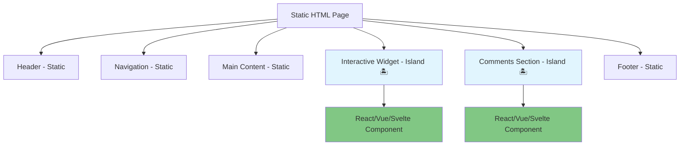

::: tip 学习目标
- 掌握 Astro 组件语法和编写规范
- 理解 Islands Architecture 架构模式
- 学会使用 Astro 的内置组件和 API
- 熟练运用 frontmatter 和 props 传递
:::

## Astro 组件语法

### .astro 文件结构

Astro 组件由三部分组成：

```astro
---
// 组件脚本 (Frontmatter)
// 在构建时执行的 JavaScript/TypeScript 代码
const title = "我的组件";
const items = ["item1", "item2", "item3"];
---

<!-- 组件模板 (Template) -->
<!-- 类似 HTML，但支持 JSX 表达式 -->
<div class="container">
  <h1>{title}</h1>
  <ul>
    {items.map(item => <li>{item}</li>)}
  </ul>
</div>

<style>
  /* 组件样式 (Styles) */
  /* 默认作用域限定在当前组件 */
  .container {
    padding: 1rem;
    border: 1px solid #e5e7eb;
  }
</style>
```

### 组件 Props 和数据传递

```astro
---
// src/components/UserCard.astro
export interface Props {
  name: string;
  email: string;
  avatar?: string;
  isActive?: boolean;
}

const { name, email, avatar, isActive = false } = Astro.props;
---

<div class="user-card" class:list={['user-card', { active: isActive }]}>
  {avatar && }
  <div class="info">
    <h3>{name}</h3>
    <p>{email}</p>
    {isActive && <span class="status">在线</span>}
  </div>
</div>

<style>
  .user-card {
    display: flex;
    align-items: center;
    padding: 1rem;
    border-radius: 8px;
    background: #f9fafb;
  }

  .user-card.active {
    background: #ecfdf5;
    border: 1px solid #10b981;
  }

  .avatar {
    width: 48px;
    height: 48px;
    border-radius: 50%;
    margin-right: 1rem;
  }

  .status {
    color: #10b981;
    font-weight: 500;
    font-size: 0.875rem;
  }
</style>
```

### 使用组件

```astro
---
// src/pages/users.astro
import UserCard from '../components/UserCard.astro';

const users = [
  {
    name: "张三",
    email: "zhangsan@example.com",
    avatar: "/avatars/zhang.jpg",
    isActive: true
  },
  {
    name: "李四",
    email: "lisi@example.com",
    isActive: false
  }
];
---

<html>
  <head>
    <title>用户列表</title>
  </head>
  <body>
    <h1>用户列表</h1>
    <div class="users-grid">
      {users.map(user => (
        <UserCard
          name={user.name}
          email={user.email}
          avatar={user.avatar}
          isActive={user.isActive}
        />
      ))}
    </div>
  </body>
</html>
```

## Islands Architecture 详解

### 什么是 Islands Architecture

Islands Architecture 是 Astro 的核心创新，它允许在静态 HTML 页面中创建独立的交互式"岛屿"。



### 客户端指令

Astro 提供了多种客户端指令来控制组件的水合时机：

```python
# 客户端指令示例说明
def astro_client_directives():
    """
    Astro 客户端指令详解
    """
    directives = {
        "client:load": {
            "description": "页面加载时立即水合",
            "use_case": "关键交互组件",
            "priority": "高"
        },
        "client:idle": {
            "description": "浏览器空闲时水合",
            "use_case": "次要交互组件",
            "priority": "中"
        },
        "client:visible": {
            "description": "组件进入视口时水合",
            "use_case": "页面下方的组件",
            "priority": "低"
        },
        "client:media": {
            "description": "匹配媒体查询时水合",
            "use_case": "移动端特定组件",
            "priority": "条件"
        },
        "client:only": {
            "description": "仅在客户端渲染",
            "use_case": "依赖浏览器 API 的组件",
            "priority": "特殊"
        }
    }

    print("Astro 客户端指令对比：")
    for directive, info in directives.items():
        print(f"{directive}:")
        print(f"  描述: {info['description']}")
        print(f"  用例: {info['use_case']}")
        print(f"  优先级: {info['priority']}")
        print()

    return directives

# 调用示例
directives_info = astro_client_directives()
```

### 实际应用示例

```astro
---
// src/pages/dashboard.astro
import Header from '../components/Header.astro';
import Sidebar from '../components/Sidebar.astro';
import SearchWidget from '../components/SearchWidget.vue';
import Chart from '../components/Chart.react';
import Comments from '../components/Comments.svelte';
---

<html>
  <head>
    <title>仪表板</title>
  </head>
  <body>
    <!-- 静态组件 - 无 JavaScript -->
    <Header />
    <Sidebar />

    <main>
      <!-- 立即水合 - 搜索功能很重要 -->
      <SearchWidget client:load />

      <!-- 空闲时水合 - 图表不是关键功能 -->
      <Chart client:idle data={chartData} />

      <!-- 进入视口时水合 - 评论在页面底部 -->
      <Comments client:visible postId="123" />

      <!-- 仅在移动端水合 -->
      <MobileMenu client:media="(max-width: 768px)" />
    </main>
  </body>
</html>
```

## Astro 内置组件和 API

### 内置组件

#### 1. `<Image />` 组件

```astro
---
import { Image } from 'astro:assets';
import heroImage from '../assets/hero.jpg';
---

<!-- 优化的图片组件 -->
<Image
  src={heroImage}
  alt="英雄图片"
  width={800}
  height={400}
  format="webp"
  quality={80}
/>

<!-- 远程图片 -->
<Image
  src="https://example.com/image.jpg"
  alt="远程图片"
  width={300}
  height={200}
  inferSize
/>
```

#### 2. `<Picture />` 组件

```astro
---
import { Picture } from 'astro:assets';
import responsiveImage from '../assets/responsive.jpg';
---

<Picture
  src={responsiveImage}
  alt="响应式图片"
  widths={[400, 800, 1200]}
  sizes="(max-width: 800px) 100vw, 800px"
  formats={['avif', 'webp', 'jpg']}
/>
```

### Astro 全局对象

```astro
---
// Astro.props - 组件属性
const { title, description } = Astro.props;

// Astro.request - 请求对象
const url = Astro.request.url;
const userAgent = Astro.request.headers.get('user-agent');

// Astro.params - 动态路由参数
const { slug } = Astro.params;

// Astro.url - 当前页面 URL
const currentPath = Astro.url.pathname;
const searchParams = Astro.url.searchParams;

// Astro.site - 站点配置
const siteUrl = Astro.site;

// Astro.generator - Astro 版本信息
const generator = Astro.generator;
---

<html>
  <head>
    <title>{title}</title>
    <meta name="description" content={description} />
    <meta name="generator" content={generator} />
  </head>
  <body>
    <h1>{title}</h1>
    <p>当前路径: {currentPath}</p>
    <p>用户代理: {userAgent}</p>
  </body>
</html>
```

## 高级 Frontmatter 用法

### 数据获取

```astro
---
// src/pages/blog/[slug].astro
import { getCollection, getEntry } from 'astro:content';

// 获取单个条目
const { slug } = Astro.params;
const post = await getEntry('blog', slug);

if (!post) {
  return Astro.redirect('/404');
}

// 获取相关文章
const allPosts = await getCollection('blog');
const relatedPosts = allPosts
  .filter(p => p.id !== slug && p.data.category === post.data.category)
  .slice(0, 3);

// 动态导入
const { formatDate } = await import('../../../utils/date.js');
---

<html>
  <head>
    <title>{post.data.title}</title>
    <meta name="description" content={post.data.description} />
  </head>
  <body>
    <article>
      <h1>{post.data.title}</h1>
      <p class="meta">发布于: {formatDate(post.data.publishDate)}</p>
      <div set:html={post.body} />
    </article>

    <aside>
      <h3>相关文章</h3>
      <ul>
        {relatedPosts.map(related => (
          <li>
            <a href={`/blog/${related.slug}`}>
              {related.data.title}
            </a>
          </li>
        ))}
      </ul>
    </aside>
  </body>
</html>
```

### 条件渲染和错误处理

```astro
---
// src/components/WeatherWidget.astro
export interface Props {
  city: string;
}

const { city } = Astro.props;

let weatherData = null;
let error = null;

try {
  const response = await fetch(`https://api.openweathermap.org/data/2.5/weather?q=${city}&appid=${import.meta.env.WEATHER_API_KEY}`);

  if (!response.ok) {
    throw new Error(`HTTP ${response.status}: ${response.statusText}`);
  }

  weatherData = await response.json();
} catch (err) {
  error = err.message;
  console.error(`天气数据获取失败: ${error}`);
}
---

<div class="weather-widget">
  <h3>天气信息 - {city}</h3>

  {error ? (
    <div class="error">
      <p>⚠️ 无法获取天气数据</p>
      <p class="error-detail">{error}</p>
    </div>
  ) : weatherData ? (
    <div class="weather-info">
      <div class="temperature">
        {Math.round(weatherData.main.temp - 273.15)}°C
      </div>
      <div class="description">
        {weatherData.weather[0].description}
      </div>
      <div class="details">
        <span>湿度: {weatherData.main.humidity}%</span>
        <span>风速: {weatherData.wind.speed} m/s</span>
      </div>
    </div>
  ) : (
    <div class="loading">
      <p>⏳ 加载中...</p>
    </div>
  )}
</div>

<style>
  .weather-widget {
    padding: 1rem;
    border-radius: 8px;
    background: linear-gradient(135deg, #667eea 0%, #764ba2 100%);
    color: white;
  }

  .error {
    color: #fecaca;
  }

  .error-detail {
    font-size: 0.875rem;
    opacity: 0.8;
  }

  .temperature {
    font-size: 2rem;
    font-weight: bold;
    margin: 0.5rem 0;
  }

  .details {
    display: flex;
    gap: 1rem;
    font-size: 0.875rem;
    margin-top: 0.5rem;
  }
</style>
```

## 样式和 CSS 集成

### 作用域样式

```astro
---
// src/components/Button.astro
export interface Props {
  variant?: 'primary' | 'secondary' | 'danger';
  size?: 'sm' | 'md' | 'lg';
  disabled?: boolean;
}

const { variant = 'primary', size = 'md', disabled = false } = Astro.props;
---

<button
  class={`btn btn-${variant} btn-${size}`}
  disabled={disabled}
  {...Astro.props}
>
  <slot />
</button>

<style>
  .btn {
    border: none;
    border-radius: 6px;
    font-weight: 500;
    cursor: pointer;
    transition: all 0.2s ease;
  }

  .btn:disabled {
    opacity: 0.5;
    cursor: not-allowed;
  }

  /* 尺寸变体 */
  .btn-sm { padding: 0.5rem 1rem; font-size: 0.875rem; }
  .btn-md { padding: 0.75rem 1.5rem; font-size: 1rem; }
  .btn-lg { padding: 1rem 2rem; font-size: 1.125rem; }

  /* 颜色变体 */
  .btn-primary {
    background: #3b82f6;
    color: white;
  }
  .btn-primary:hover:not(:disabled) {
    background: #2563eb;
  }

  .btn-secondary {
    background: #6b7280;
    color: white;
  }
  .btn-secondary:hover:not(:disabled) {
    background: #4b5563;
  }

  .btn-danger {
    background: #ef4444;
    color: white;
  }
  .btn-danger:hover:not(:disabled) {
    background: #dc2626;
  }
</style>
```

### 全局样式

```astro
---
// src/layouts/BaseLayout.astro
export interface Props {
  title: string;
  description?: string;
}

const { title, description } = Astro.props;
---

<html lang="zh-CN">
  <head>
    <meta charset="utf-8" />
    <meta name="viewport" content="width=device-width, initial-scale=1" />
    <title>{title}</title>
    {description && <meta name="description" content={description} />}
  </head>
  <body>
    <slot />
  </body>
</html>

<style is:global>
  /* 全局样式 */
  * {
    margin: 0;
    padding: 0;
    box-sizing: border-box;
  }

  body {
    font-family: system-ui, -apple-system, sans-serif;
    line-height: 1.6;
    color: #1f2937;
  }

  h1, h2, h3, h4, h5, h6 {
    margin-bottom: 0.5rem;
    font-weight: 600;
  }

  p {
    margin-bottom: 1rem;
  }

  a {
    color: #3b82f6;
    text-decoration: none;
  }

  a:hover {
    text-decoration: underline;
  }
</style>
```

## 小结

本章我们深入学习了 Astro 的核心特性：

1. **组件语法**：三段式结构（frontmatter、模板、样式）
2. **Islands Architecture**：选择性水合，优化性能
3. **客户端指令**：控制组件的水合时机
4. **内置组件**：Image、Picture 等优化组件
5. **Astro 全局对象**：访问请求、参数、URL 等信息
6. **高级 frontmatter**：数据获取、错误处理、条件渲染
7. **样式系统**：作用域样式和全局样式

::: note 核心思想
Astro 的设计哲学是"默认静态，按需交互"。通过 Islands Architecture，我们可以在保持优秀性能的同时，为需要的地方添加交互性。
:::

::: tip 最佳实践
- 优先使用静态组件，仅在必要时添加客户端指令
- 选择合适的水合时机（load、idle、visible）
- 利用 Astro 的内置组件优化图片等资源
- 合理使用作用域样式避免样式冲突
:::