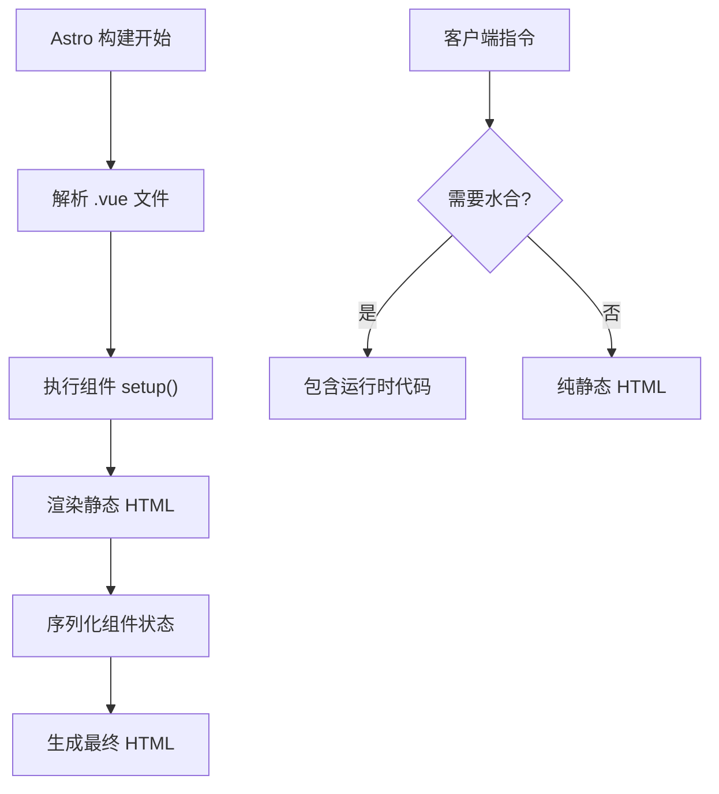

::: tip 学习目标
- 配置 Astro 项目支持 Vue 3
- 理解 Vue 组件在 Astro 中的生命周期
- 掌握客户端水合 (Hydration) 机制
- 学会在 Astro 中使用 Vue 3 的 Composition API
:::

## Vue 3 集成配置

### 安装 Vue 3 集成

```bash
# 使用 Astro CLI 添加 Vue 集成
npx astro add vue

# 或手动安装
npm install @astrojs/vue vue
```

### 配置 astro.config.mjs

```javascript
// astro.config.mjs
import { defineConfig } from 'astro/config';
import vue from '@astrojs/vue';

export default defineConfig({
  integrations: [
    vue({
      // Vue 特定配置
      appEntrypoint: '/src/pages/_app', // 可选的 app 入口点
      jsx: true, // 启用 JSX 支持
    })
  ],
  vite: {
    // Vite 配置用于 Vue
    vue: {
      template: {
        compilerOptions: {
          // 自定义元素处理
          isCustomElement: (tag) => tag.includes('-')
        }
      }
    }
  }
});
```

### TypeScript 支持

```json
// tsconfig.json
{
  "extends": "astro/tsconfigs/strict",
  "compilerOptions": {
    "jsx": "preserve",
    "jsxImportSource": "vue"
  },
  "include": [
    "src/**/*",
    "src/**/*.vue"
  ]
}
```

```typescript
// src/env.d.ts
/// <reference types="astro/client" />
/// <reference types="@astrojs/vue/client" />

declare module '*.vue' {
  import type { DefineComponent } from 'vue';
  const component: DefineComponent<{}, {}, any>;
  export default component;
}
```

## Vue 组件在 Astro 中的生命周期

### 服务器端渲染 (SSR) 阶段



### 客户端水合阶段

```python
def vue_hydration_lifecycle():
    """
    Vue 组件在 Astro 中的水合生命周期
    """
    lifecycle_stages = {
        "1_server_render": {
            "stage": "服务器端渲染",
            "description": "组件在构建时渲染为静态 HTML",
            "vue_hooks": ["setup()", "computed", "watch"],
            "astro_role": "执行 Vue 组件并序列化状态"
        },
        "2_html_delivery": {
            "stage": "HTML 传输",
            "description": "静态 HTML 发送到客户端",
            "vue_hooks": [],
            "astro_role": "提供静态内容和水合指令"
        },
        "3_hydration_trigger": {
            "stage": "水合触发",
            "description": "根据客户端指令决定何时开始水合",
            "vue_hooks": [],
            "astro_role": "监听触发条件 (load/idle/visible)"
        },
        "4_client_activation": {
            "stage": "客户端激活",
            "description": "Vue 组件在客户端变为交互式",
            "vue_hooks": ["onMounted", "onUpdated"],
            "astro_role": "恢复组件状态并绑定事件"
        }
    }

    print("Vue 组件在 Astro 中的生命周期：")
    for stage_key, stage_info in lifecycle_stages.items():
        print(f"\n{stage_info['stage']}:")
        print(f"  描述: {stage_info['description']}")
        print(f"  Vue 钩子: {stage_info['vue_hooks']}")
        print(f"  Astro 作用: {stage_info['astro_role']}")

    return lifecycle_stages

# 调用示例
lifecycle_info = vue_hydration_lifecycle()
```

## Vue 3 Composition API 在 Astro 中的使用

### 基础响应式组件

```vue
<!-- src/components/Counter.vue -->
<template>
  <div class="counter">
    <h3>计数器</h3>
    <div class="display">
      <span class="count">{{ count }}</span>
      <span class="status" :class="{ 'high': count >= 10 }">
        {{ statusText }}
      </span>
    </div>
    <div class="controls">
      <button @click="decrement" :disabled="count <= 0">-</button>
      <button @click="reset">重置</button>
      <button @click="increment">+</button>
    </div>
    <div class="info">
      <p>双击次数: {{ doubleClicks }}</p>
      <p>总操作数: {{ totalOperations }}</p>
    </div>
  </div>
</template>

<script setup lang="ts">
import { ref, computed, watch, onMounted } from 'vue';

// 响应式状态
const count = ref(0);
const doubleClicks = ref(0);
const totalOperations = ref(0);

// 计算属性
const statusText = computed(() => {
  if (count.value === 0) return '起始';
  if (count.value < 5) return '较低';
  if (count.value < 10) return '中等';
  return '较高';
});

// 方法
const increment = () => {
  count.value++;
  totalOperations.value++;
};

const decrement = () => {
  if (count.value > 0) {
    count.value--;
    totalOperations.value++;
  }
};

const reset = () => {
  count.value = 0;
  totalOperations.value++;
};

// 监听器
watch(count, (newVal, oldVal) => {
  console.log(`计数从 ${oldVal} 变为 ${newVal}`);

  // 检测快速双击
  if (Math.abs(newVal - oldVal) === 2) {
    doubleClicks.value++;
  }
});

// 生命周期
onMounted(() => {
  console.log('计数器组件已挂载');
});

// 暴露给模板的数据和方法 (TypeScript 推断)
</script>

<style scoped>
.counter {
  padding: 1.5rem;
  border: 2px solid #e5e7eb;
  border-radius: 12px;
  background: #f9fafb;
  max-width: 300px;
  text-align: center;
}

.display {
  margin: 1rem 0;
}

.count {
  font-size: 2rem;
  font-weight: bold;
  color: #1f2937;
}

.status {
  display: block;
  font-size: 0.875rem;
  color: #6b7280;
  margin-top: 0.5rem;
}

.status.high {
  color: #ef4444;
  font-weight: bold;
}

.controls {
  display: flex;
  gap: 0.5rem;
  justify-content: center;
  margin: 1rem 0;
}

.controls button {
  padding: 0.5rem 1rem;
  border: none;
  border-radius: 6px;
  background: #3b82f6;
  color: white;
  cursor: pointer;
  transition: background-color 0.2s;
}

.controls button:hover:not(:disabled) {
  background: #2563eb;
}

.controls button:disabled {
  background: #9ca3af;
  cursor: not-allowed;
}

.info {
  font-size: 0.875rem;
  color: #6b7280;
  margin-top: 1rem;
}

.info p {
  margin: 0.25rem 0;
}
</style>
```

### 复杂状态管理组件

```vue
<!-- src/components/TaskManager.vue -->
<template>
  <div class="task-manager">
    <h3>任务管理器</h3>

    <!-- 添加新任务 -->
    <form @submit.prevent="addTask" class="add-form">
      <input
        v-model="newTaskTitle"
        type="text"
        placeholder="输入新任务..."
        required
        class="task-input"
      />
      <select v-model="newTaskPriority" class="priority-select">
        <option value="low">低优先级</option>
        <option value="medium">中优先级</option>
        <option value="high">高优先级</option>
      </select>
      <button type="submit" class="add-btn">添加</button>
    </form>

    <!-- 过滤器 -->
    <div class="filters">
      <button
        v-for="filter in filters"
        :key="filter.key"
        @click="currentFilter = filter.key"
        :class="['filter-btn', { active: currentFilter === filter.key }]"
      >
        {{ filter.label }} ({{ filter.count }})
      </button>
    </div>

    <!-- 任务列表 -->
    <div class="task-list">
      <div
        v-for="task in filteredTasks"
        :key="task.id"
        :class="['task-item', `priority-${task.priority}`, { completed: task.completed }]"
      >
        <input
          type="checkbox"
          v-model="task.completed"
          @change="toggleTask(task.id)"
          class="task-checkbox"
        />
        <span class="task-title">{{ task.title }}</span>
        <span class="task-priority">{{ task.priority }}</span>
        <button @click="removeTask(task.id)" class="remove-btn">删除</button>
      </div>
    </div>

    <!-- 统计信息 -->
    <div class="stats">
      <p>总任务: {{ tasks.length }}</p>
      <p>已完成: {{ completedTasksCount }}</p>
      <p>进度: {{ progressPercentage }}%</p>
    </div>
  </div>
</template>

<script setup lang="ts">
import { ref, computed, watch, onMounted } from 'vue';

// 类型定义
interface Task {
  id: number;
  title: string;
  priority: 'low' | 'medium' | 'high';
  completed: boolean;
  createdAt: Date;
}

type FilterKey = 'all' | 'active' | 'completed';

// 响应式状态
const tasks = ref<Task[]>([]);
const newTaskTitle = ref('');
const newTaskPriority = ref<Task['priority']>('medium');
const currentFilter = ref<FilterKey>('all');

// 计算属性
const completedTasksCount = computed(() =>
  tasks.value.filter(task => task.completed).length
);

const progressPercentage = computed(() =>
  tasks.value.length === 0 ? 0 : Math.round((completedTasksCount.value / tasks.value.length) * 100)
);

const filteredTasks = computed(() => {
  switch (currentFilter.value) {
    case 'active':
      return tasks.value.filter(task => !task.completed);
    case 'completed':
      return tasks.value.filter(task => task.completed);
    default:
      return tasks.value;
  }
});

const filters = computed(() => [
  { key: 'all' as FilterKey, label: '全部', count: tasks.value.length },
  { key: 'active' as FilterKey, label: '进行中', count: tasks.value.length - completedTasksCount.value },
  { key: 'completed' as FilterKey, label: '已完成', count: completedTasksCount.value }
]);

// 方法
const addTask = () => {
  if (newTaskTitle.value.trim()) {
    const newTask: Task = {
      id: Date.now(),
      title: newTaskTitle.value.trim(),
      priority: newTaskPriority.value,
      completed: false,
      createdAt: new Date()
    };

    tasks.value.unshift(newTask);
    newTaskTitle.value = '';
    saveToLocalStorage();
  }
};

const toggleTask = (taskId: number) => {
  const task = tasks.value.find(t => t.id === taskId);
  if (task) {
    task.completed = !task.completed;
    saveToLocalStorage();
  }
};

const removeTask = (taskId: number) => {
  tasks.value = tasks.value.filter(t => t.id !== taskId);
  saveToLocalStorage();
};

const saveToLocalStorage = () => {
  localStorage.setItem('astro-vue-tasks', JSON.stringify(tasks.value));
};

const loadFromLocalStorage = () => {
  const saved = localStorage.getItem('astro-vue-tasks');
  if (saved) {
    try {
      const parsed = JSON.parse(saved);
      tasks.value = parsed.map((task: any) => ({
        ...task,
        createdAt: new Date(task.createdAt)
      }));
    } catch (error) {
      console.error('加载任务失败:', error);
    }
  }
};

// 监听器
watch(tasks, (newTasks) => {
  console.log(`当前任务数: ${newTasks.length}`);
}, { deep: true });

// 生命周期
onMounted(() => {
  loadFromLocalStorage();
  console.log('任务管理器已挂载');
});
</script>

<style scoped>
.task-manager {
  max-width: 600px;
  margin: 0 auto;
  padding: 1.5rem;
  background: white;
  border-radius: 12px;
  box-shadow: 0 4px 6px -1px rgba(0, 0, 0, 0.1);
}

.add-form {
  display: flex;
  gap: 0.5rem;
  margin-bottom: 1.5rem;
}

.task-input {
  flex: 1;
  padding: 0.75rem;
  border: 1px solid #d1d5db;
  border-radius: 6px;
  font-size: 1rem;
}

.priority-select {
  padding: 0.75rem;
  border: 1px solid #d1d5db;
  border-radius: 6px;
  background: white;
}

.add-btn {
  padding: 0.75rem 1.5rem;
  background: #10b981;
  color: white;
  border: none;
  border-radius: 6px;
  cursor: pointer;
  font-weight: 500;
}

.add-btn:hover {
  background: #059669;
}

.filters {
  display: flex;
  gap: 0.5rem;
  margin-bottom: 1.5rem;
}

.filter-btn {
  padding: 0.5rem 1rem;
  border: 1px solid #d1d5db;
  background: white;
  border-radius: 6px;
  cursor: pointer;
  transition: all 0.2s;
}

.filter-btn.active {
  background: #3b82f6;
  color: white;
  border-color: #3b82f6;
}

.task-list {
  min-height: 200px;
  margin-bottom: 1.5rem;
}

.task-item {
  display: flex;
  align-items: center;
  gap: 1rem;
  padding: 1rem;
  border: 1px solid #e5e7eb;
  border-radius: 8px;
  margin-bottom: 0.5rem;
  transition: all 0.2s;
}

.task-item.completed {
  opacity: 0.6;
  background: #f3f4f6;
}

.task-item.priority-high {
  border-left: 4px solid #ef4444;
}

.task-item.priority-medium {
  border-left: 4px solid #f59e0b;
}

.task-item.priority-low {
  border-left: 4px solid #10b981;
}

.task-checkbox {
  width: 1.25rem;
  height: 1.25rem;
}

.task-title {
  flex: 1;
  font-weight: 500;
}

.task-item.completed .task-title {
  text-decoration: line-through;
}

.task-priority {
  font-size: 0.875rem;
  color: #6b7280;
  text-transform: capitalize;
}

.remove-btn {
  padding: 0.25rem 0.75rem;
  background: #ef4444;
  color: white;
  border: none;
  border-radius: 4px;
  cursor: pointer;
  font-size: 0.875rem;
}

.remove-btn:hover {
  background: #dc2626;
}

.stats {
  display: flex;
  justify-content: space-around;
  padding: 1rem;
  background: #f9fafb;
  border-radius: 8px;
  font-size: 0.875rem;
  color: #6b7280;
}
</style>
```

## 在 Astro 页面中使用 Vue 组件

### 基本使用

```astro
---
// src/pages/vue-demo.astro
import Layout from '../layouts/Layout.astro';
import Counter from '../components/Counter.vue';
import TaskManager from '../components/TaskManager.vue';
---

<Layout title="Vue 3 组件演示">
  <main class="container">
    <h1>Astro + Vue 3 演示</h1>

    <!-- 静态渲染（无 JavaScript） -->
    <section class="demo-section">
      <h2>静态计数器</h2>
      <p>这个组件在构建时渲染，客户端无交互：</p>
      <Counter />
    </section>

    <!-- 页面加载时水合 -->
    <section class="demo-section">
      <h2>交互式计数器</h2>
      <p>这个组件在页面加载时变为交互式：</p>
      <Counter client:load />
    </section>

    <!-- 空闲时水合 -->
    <section class="demo-section">
      <h2>任务管理器</h2>
      <p>这个组件在浏览器空闲时变为交互式：</p>
      <TaskManager client:idle />
    </section>

    <!-- 进入视口时水合 -->
    <section class="demo-section">
      <h2>延迟加载的计数器</h2>
      <p>这个组件在进入视口时才变为交互式：</p>
      <Counter client:visible />
    </section>
  </main>
</Layout>

<style>
  .container {
    max-width: 1200px;
    margin: 0 auto;
    padding: 2rem;
  }

  .demo-section {
    margin-bottom: 3rem;
    padding: 2rem;
    border: 1px solid #e5e7eb;
    border-radius: 12px;
    background: #fafafa;
  }

  .demo-section h2 {
    color: #1f2937;
    margin-bottom: 0.5rem;
  }

  .demo-section p {
    color: #6b7280;
    margin-bottom: 1.5rem;
  }
</style>
```

### 高级集成：Props 传递和事件处理

```astro
---
// src/pages/advanced-vue.astro
import Layout from '../layouts/Layout.astro';
import UserProfile from '../components/UserProfile.vue';
import NotificationCenter from '../components/NotificationCenter.vue';

// 模拟用户数据
const userData = {
  id: 1,
  name: "张三",
  email: "zhangsan@example.com",
  avatar: "/avatars/zhangsan.jpg",
  preferences: {
    theme: "light",
    notifications: true,
    language: "zh-CN"
  }
};

const notifications = [
  {
    id: 1,
    title: "欢迎使用 Astro + Vue 3",
    message: "您已成功集成 Vue 3 组件",
    type: "success",
    timestamp: new Date()
  },
  {
    id: 2,
    title: "系统更新",
    message: "新功能现已可用",
    type: "info",
    timestamp: new Date(Date.now() - 86400000)
  }
];
---

<Layout title="高级 Vue 集成">
  <div class="app-layout">
    <header class="app-header">
      <h1>用户仪表板</h1>
    </header>

    <div class="app-content">
      <aside class="sidebar">
        <!-- 用户资料组件 -->
        <UserProfile
          client:load
          user={userData}
          showSettings={true}
        />
      </aside>

      <main class="main-content">
        <!-- 通知中心组件 -->
        <NotificationCenter
          client:idle
          notifications={notifications}
          autoRefresh={true}
        />
      </main>
    </div>
  </div>
</Layout>

<style>
  .app-layout {
    min-height: 100vh;
    display: flex;
    flex-direction: column;
  }

  .app-header {
    background: #1f2937;
    color: white;
    padding: 1rem 2rem;
  }

  .app-content {
    flex: 1;
    display: grid;
    grid-template-columns: 300px 1fr;
    gap: 2rem;
    padding: 2rem;
  }

  .sidebar {
    background: #f9fafb;
    border-radius: 12px;
    padding: 1.5rem;
  }

  .main-content {
    background: white;
    border-radius: 12px;
    padding: 1.5rem;
    box-shadow: 0 1px 3px rgba(0, 0, 0, 0.1);
  }

  @media (max-width: 768px) {
    .app-content {
      grid-template-columns: 1fr;
    }
  }
</style>
```

## Vue 组件间通信

### 使用 provide/inject

```vue
<!-- src/components/ThemeProvider.vue -->
<template>
  <div :class="`theme-${currentTheme}`">
    <div class="theme-controls">
      <button
        v-for="theme in themes"
        :key="theme"
        @click="setTheme(theme)"
        :class="['theme-btn', { active: currentTheme === theme }]"
      >
        {{ theme }}
      </button>
    </div>
    <slot />
  </div>
</template>

<script setup lang="ts">
import { ref, provide, onMounted } from 'vue';

type Theme = 'light' | 'dark' | 'auto';

const currentTheme = ref<Theme>('light');
const themes: Theme[] = ['light', 'dark', 'auto'];

const setTheme = (theme: Theme) => {
  currentTheme.value = theme;
  localStorage.setItem('theme-preference', theme);
};

const loadTheme = () => {
  const saved = localStorage.getItem('theme-preference') as Theme;
  if (saved && themes.includes(saved)) {
    currentTheme.value = saved;
  }
};

// 提供主题上下文
provide('theme', {
  currentTheme,
  setTheme,
  themes
});

onMounted(() => {
  loadTheme();
});
</script>

<style scoped>
.theme-light {
  background: #ffffff;
  color: #1f2937;
}

.theme-dark {
  background: #1f2937;
  color: #f9fafb;
}

.theme-controls {
  display: flex;
  gap: 0.5rem;
  margin-bottom: 1rem;
  padding: 1rem;
  border-bottom: 1px solid #e5e7eb;
}

.theme-btn {
  padding: 0.5rem 1rem;
  border: 1px solid #d1d5db;
  background: transparent;
  border-radius: 6px;
  cursor: pointer;
  text-transform: capitalize;
}

.theme-btn.active {
  background: #3b82f6;
  color: white;
  border-color: #3b82f6;
}

.theme-dark .theme-controls {
  border-bottom-color: #374151;
}

.theme-dark .theme-btn {
  border-color: #6b7280;
  color: #f9fafb;
}
</style>
```

```vue
<!-- src/components/ThemedCard.vue -->
<template>
  <div class="themed-card">
    <h3>主题感知卡片</h3>
    <p>当前主题: {{ themeContext?.currentTheme }}</p>
    <p>这个卡片会根据全局主题变化样式</p>
  </div>
</template>

<script setup lang="ts">
import { inject } from 'vue';

// 注入主题上下文
const themeContext = inject('theme');
</script>

<style scoped>
.themed-card {
  padding: 1.5rem;
  border-radius: 8px;
  border: 1px solid #e5e7eb;
  margin: 1rem 0;
}
</style>
```

## 最佳实践与性能优化

### 1. 合理使用客户端指令

```python
def vue_hydration_best_practices():
    """
    Vue 组件水合的最佳实践指南
    """
    guidelines = {
        "client:load": {
            "适用场景": ["关键交互组件", "用户立即需要的功能"],
            "示例": ["导航菜单", "搜索框", "用户登录状态"],
            "注意事项": "会增加初始 JavaScript 包大小"
        },
        "client:idle": {
            "适用场景": ["次要功能", "非关键交互"],
            "示例": ["评论系统", "分享按钮", "推荐内容"],
            "注意事项": "浏览器空闲时才会水合，用户体验更好"
        },
        "client:visible": {
            "适用场景": ["页面下方内容", "折叠面板内容"],
            "示例": ["图表组件", "延迟加载的列表", "页脚交互"],
            "注意事项": "可以显著减少初始 JavaScript 执行"
        },
        "client:media": {
            "适用场景": ["响应式组件", "设备特定功能"],
            "示例": ["移动端菜单", "桌面端工具栏"],
            "注意事项": "基于媒体查询条件加载"
        },
        "no_directive": {
            "适用场景": ["纯展示内容", "静态数据"],
            "示例": ["文章内容", "产品展示", "关于页面"],
            "注意事项": "零 JavaScript，最佳性能"
        }
    }

    print("Vue 组件水合最佳实践：")
    for directive, info in guidelines.items():
        print(f"\n{directive}:")
        for key, value in info.items():
            if isinstance(value, list):
                print(f"  {key}: {', '.join(value)}")
            else:
                print(f"  {key}: {value}")

    return guidelines

# 调用示例
best_practices = vue_hydration_best_practices()
```

### 2. 组件拆分策略

```vue
<!-- 大组件拆分示例 -->
<!-- src/components/ProductPage.vue -->
<template>
  <div class="product-page">
    <!-- 静态内容 - 无需 JavaScript -->
    <ProductHeader :product="product" />
    <ProductGallery :images="product.images" />
    <ProductDescription :description="product.description" />

    <!-- 交互功能 - 按需加载 -->
    <ProductActions
      client:load
      :product="product"
      @add-to-cart="handleAddToCart"
    />
    <ReviewSystem
      client:visible
      :product-id="product.id"
    />
    <RecommendedProducts
      client:idle
      :category="product.category"
    />
  </div>
</template>

<script setup lang="ts">
// 组件逻辑...
</script>
```

## 小结

本章我们深入学习了 Vue 3 在 Astro 中的集成：

1. **集成配置**：安装和配置 Vue 3 集成插件
2. **生命周期理解**：Vue 组件在 SSR 和客户端的完整生命周期
3. **Composition API**：在 Astro 环境中使用 Vue 3 的现代 API
4. **水合策略**：选择合适的客户端指令优化性能
5. **组件通信**：使用 provide/inject 等 Vue 特性
6. **最佳实践**：性能优化和组件拆分策略

::: note 核心优势
Vue 3 + Astro 的组合为我们提供了：
- 熟悉的 Vue 开发体验
- 优秀的 SSR 性能
- 灵活的水合控制
- 强大的 TypeScript 支持
:::

::: tip 下一步预告
在下一章中，我们将学习如何集成 Tailwind CSS，构建现代化的样式系统，进一步提升开发效率和用户体验。
:::