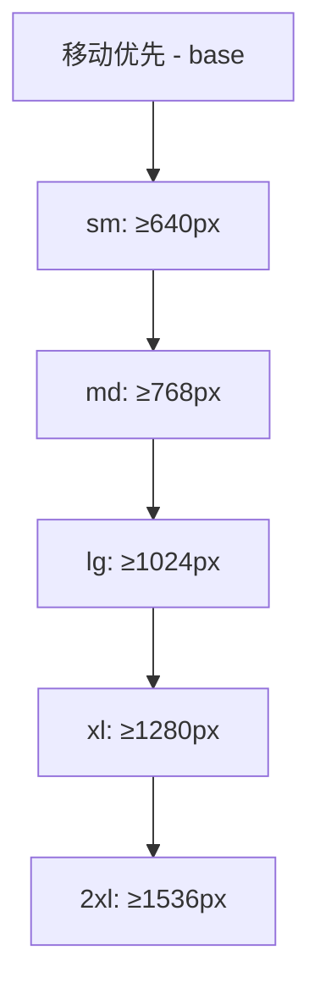

::: tip 学习目标
- 在 Astro 项目中配置和优化 Tailwind CSS
- 掌握响应式设计和样式组合技巧
- 学会自定义 Tailwind 配置和主题
- 实现组件级样式管理和复用
:::

## 知识点

### Tailwind CSS 与 Astro 集成

Tailwind CSS 是一个功能优先的 CSS 框架，与 Astro 的静态生成能力完美结合：

- **零运行时开销**：编译时生成最小化的 CSS
- **按需生成**：只包含实际使用的样式类
- **开发体验**：与 Astro 组件系统无缝集成
- **构建优化**：自动清除未使用的样式

### 响应式设计系统

Tailwind 提供了移动优先的响应式设计方案：



### 样式组合与复用策略

- **@apply 指令**：将 Tailwind 类组合成可复用的 CSS 类
- **组件类**：通过 CSS 组件层创建可复用的样式模式
- **CSS 变量**：结合 Tailwind 实现动态主题切换

## 安装与配置

### 基础安装

```bash
# 安装 Tailwind CSS 和相关依赖
npm install -D tailwindcss @tailwindcss/typography
npx tailwindcss init -p

# 安装 Astro Tailwind 集成
npx astro add tailwind
```

### Tailwind 配置文件

```javascript
// tailwind.config.js
/** @type {import('tailwindcss').Config} */
export default {
  content: ['./src/**/*.{astro,html,js,jsx,md,mdx,svelte,ts,tsx,vue}'],
  theme: {
    extend: {
      // 自定义颜色系统
      colors: {
        primary: {
          50: '#eff6ff',
          500: '#3b82f6',
          900: '#1e3a8a',
        },
        accent: '#f59e0b',
      },
      // 自定义字体
      fontFamily: {
        sans: ['Inter', 'system-ui', 'sans-serif'],
        mono: ['Fira Code', 'monospace'],
      },
      // 自定义间距
      spacing: {
        '18': '4.5rem',
        '88': '22rem',
      },
      // 自定义断点
      screens: {
        'xs': '475px',
        '3xl': '1600px',
      }
    },
  },
  plugins: [
    require('@tailwindcss/typography'),
  ],
}
```

### Astro 集成配置

```javascript
// astro.config.mjs
import { defineConfig } from 'astro/config';
import tailwind from '@astrojs/tailwind';

export default defineConfig({
  integrations: [
    tailwind({
      // 自定义配置路径
      config: { path: './custom-config.js' },
      // 应用基础样式
      applyBaseStyles: false,
    })
  ],
});
```

## 响应式设计实践

### 响应式布局组件

```astro
---
// src/components/ResponsiveGrid.astro
export interface Props {
  items: any[];
}

const { items } = Astro.props;
---

<div class="
  grid gap-4 p-4
  grid-cols-1           <!-- 移动端：单列 -->
  sm:grid-cols-2        <!-- 小屏：双列 -->
  md:grid-cols-3        <!-- 中屏：三列 -->
  lg:grid-cols-4        <!-- 大屏：四列 -->
  xl:gap-6              <!-- 超大屏：更大间距 -->
">
  {items.map((item) => (
    <div class="
      bg-white rounded-lg shadow-md p-4
      hover:shadow-lg transition-shadow duration-300
      dark:bg-gray-800 dark:text-white
    ">
      <h3 class="text-lg font-semibold mb-2">{item.title}</h3>
      <p class="text-gray-600 dark:text-gray-300">{item.description}</p>
    </div>
  ))}
</div>
```

### 响应式导航组件

```astro
---
// src/components/Navigation.astro
const navItems = [
  { href: '/', label: 'Home' },
  { href: '/about', label: 'About' },
  { href: '/blog', label: 'Blog' },
  { href: '/contact', label: 'Contact' },
];
---

<nav class="bg-white shadow-sm border-b">
  <div class="max-w-7xl mx-auto px-4 sm:px-6 lg:px-8">
    <div class="flex justify-between items-center h-16">

      <!-- Logo -->
      <div class="flex-shrink-0">
        <a href="/" class="text-xl font-bold text-primary-600">
          MyBrand
        </a>
      </div>

      <!-- Desktop Navigation -->
      <div class="hidden md:block">
        <div class="ml-10 flex items-baseline space-x-4">
          {navItems.map((item) => (
            <a
              href={item.href}
              class="
                text-gray-600 hover:text-primary-600
                px-3 py-2 rounded-md text-sm font-medium
                transition-colors duration-200
              "
            >
              {item.label}
            </a>
          ))}
        </div>
      </div>

      <!-- Mobile menu button -->
      <div class="md:hidden">
        <button
          type="button"
          class="
            text-gray-600 hover:text-primary-600
            p-2 rounded-md focus:outline-none
          "
          aria-label="Open menu"
        >
          <svg class="h-6 w-6" fill="none" viewBox="0 0 24 24" stroke="currentColor">
            <path stroke-linecap="round" stroke-linejoin="round" stroke-width="2" d="M4 6h16M4 12h16M4 18h16" />
          </svg>
        </button>
      </div>
    </div>
  </div>

  <!-- Mobile Navigation -->
  <div class="md:hidden">
    <div class="px-2 pt-2 pb-3 space-y-1 sm:px-3 bg-gray-50">
      {navItems.map((item) => (
        <a
          href={item.href}
          class="
            text-gray-600 hover:text-primary-600
            block px-3 py-2 rounded-md text-base font-medium
          "
        >
          {item.label}
        </a>
      ))}
    </div>
  </div>
</nav>
```

## 自定义主题系统

### 设计系统基础

```css
/* src/styles/design-system.css */
@import 'tailwindcss/base';
@import 'tailwindcss/components';
@import 'tailwindcss/utilities';

/* 设计 tokens */
:root {
  /* 颜色系统 */
  --color-primary-50: #eff6ff;
  --color-primary-500: #3b82f6;
  --color-primary-900: #1e3a8a;

  /* 字体系统 */
  --font-size-xs: 0.75rem;
  --font-size-sm: 0.875rem;
  --font-size-base: 1rem;
  --font-size-lg: 1.125rem;
  --font-size-xl: 1.25rem;

  /* 间距系统 */
  --spacing-xs: 0.25rem;
  --spacing-sm: 0.5rem;
  --spacing-md: 1rem;
  --spacing-lg: 1.5rem;
  --spacing-xl: 2rem;

  /* 阴影系统 */
  --shadow-sm: 0 1px 2px 0 rgb(0 0 0 / 0.05);
  --shadow-md: 0 4px 6px -1px rgb(0 0 0 / 0.1);
  --shadow-lg: 0 10px 15px -3px rgb(0 0 0 / 0.1);
}

/* 深色主题 */
[data-theme="dark"] {
  --color-bg: #1f2937;
  --color-text: #f9fafb;
  --color-border: #374151;
}
```

### 组件样式层

```css
/* 按钮组件样式 */
@layer components {
  .btn {
    @apply px-4 py-2 rounded-md font-medium transition-all duration-200;
    @apply focus:outline-none focus:ring-2 focus:ring-offset-2;
  }

  .btn-primary {
    @apply bg-primary-500 text-white hover:bg-primary-600;
    @apply focus:ring-primary-500;
  }

  .btn-secondary {
    @apply bg-gray-200 text-gray-900 hover:bg-gray-300;
    @apply focus:ring-gray-500;
  }

  .btn-large {
    @apply px-6 py-3 text-lg;
  }

  .btn-small {
    @apply px-3 py-1 text-sm;
  }
}

/* 卡片组件样式 */
@layer components {
  .card {
    @apply bg-white rounded-lg shadow-md overflow-hidden;
    @apply dark:bg-gray-800;
  }

  .card-header {
    @apply px-6 py-4 border-b border-gray-200;
    @apply dark:border-gray-700;
  }

  .card-body {
    @apply px-6 py-4;
  }

  .card-footer {
    @apply px-6 py-4 bg-gray-50 border-t border-gray-200;
    @apply dark:bg-gray-700 dark:border-gray-600;
  }
}
```

## 实际应用示例

### 博客文章卡片

```astro
---
// src/components/BlogCard.astro
export interface Props {
  title: string;
  excerpt: string;
  publishDate: string;
  author: string;
  tags: string[];
  slug: string;
}

const { title, excerpt, publishDate, author, tags, slug } = Astro.props;
---

<article class="card hover:shadow-lg transition-shadow duration-300">
  <!-- 文章头部 -->
  <div class="card-header">
    <div class="flex items-center justify-between">
      <time class="text-sm text-gray-500 dark:text-gray-400">
        {new Date(publishDate).toLocaleDateString('zh-CN')}
      </time>
      <span class="text-sm text-gray-500 dark:text-gray-400">
        作者：{author}
      </span>
    </div>
  </div>

  <!-- 文章内容 -->
  <div class="card-body">
    <h3 class="text-xl font-semibold mb-3 text-gray-900 dark:text-white">
      <a
        href={`/blog/${slug}`}
        class="hover:text-primary-600 transition-colors duration-200"
      >
        {title}
      </a>
    </h3>

    <p class="text-gray-600 dark:text-gray-300 mb-4 line-clamp-3">
      {excerpt}
    </p>

    <!-- 标签 -->
    <div class="flex flex-wrap gap-2">
      {tags.map((tag) => (
        <span class="
          inline-block px-2 py-1 text-xs font-medium
          bg-primary-100 text-primary-700 rounded-full
          dark:bg-primary-900 dark:text-primary-200
        ">
          #{tag}
        </span>
      ))}
    </div>
  </div>

  <!-- 文章底部 -->
  <div class="card-footer">
    <a
      href={`/blog/${slug}`}
      class="btn btn-primary btn-small inline-flex items-center"
    >
      阅读更多
      <svg class="w-4 h-4 ml-1" fill="currentColor" viewBox="0 0 20 20">
        <path fill-rule="evenodd" d="M10.293 3.293a1 1 0 011.414 0l6 6a1 1 0 010 1.414l-6 6a1 1 0 01-1.414-1.414L14.586 11H3a1 1 0 110-2h11.586l-4.293-4.293a1 1 0 010-1.414z" clip-rule="evenodd" />
      </svg>
    </a>
  </div>
</article>
```

### 响应式英雄区块

```astro
---
// src/components/Hero.astro
export interface Props {
  title: string;
  subtitle: string;
  ctaText: string;
  ctaLink: string;
}

const { title, subtitle, ctaText, ctaLink } = Astro.props;
---

<section class="
  relative bg-gradient-to-br from-primary-50 to-primary-100
  dark:from-gray-900 dark:to-gray-800
  py-20 sm:py-24 lg:py-32
">
  <div class="max-w-7xl mx-auto px-4 sm:px-6 lg:px-8">
    <div class="text-center">

      <!-- 主标题 -->
      <h1 class="
        text-4xl sm:text-5xl md:text-6xl font-bold
        text-gray-900 dark:text-white
        mb-6 leading-tight
      ">
        <span class="block">{title}</span>
      </h1>

      <!-- 副标题 -->
      <p class="
        max-w-3xl mx-auto text-lg sm:text-xl
        text-gray-600 dark:text-gray-300
        mb-8 leading-relaxed
      ">
        {subtitle}
      </p>

      <!-- CTA 按钮组 -->
      <div class="
        flex flex-col sm:flex-row gap-4
        justify-center items-center
      ">
        <a
          href={ctaLink}
          class="
            btn btn-primary btn-large
            w-full sm:w-auto
            shadow-lg hover:shadow-xl
          "
        >
          {ctaText}
        </a>

        <a
          href="/learn-more"
          class="
            btn btn-secondary btn-large
            w-full sm:w-auto
          "
        >
          了解更多
        </a>
      </div>
    </div>
  </div>

  <!-- 装饰性背景元素 -->
  <div class="absolute inset-0 overflow-hidden pointer-events-none">
    <div class="
      absolute -top-40 -right-40 w-80 h-80
      bg-primary-200 rounded-full mix-blend-multiply
      filter blur-xl opacity-70 animate-blob
    "></div>
    <div class="
      absolute -bottom-40 -left-40 w-80 h-80
      bg-accent-200 rounded-full mix-blend-multiply
      filter blur-xl opacity-70 animate-blob animation-delay-2000
    "></div>
  </div>
</section>

<style>
@keyframes blob {
  0% { transform: translate(0px, 0px) scale(1); }
  33% { transform: translate(30px, -50px) scale(1.1); }
  66% { transform: translate(-20px, 20px) scale(0.9); }
  100% { transform: translate(0px, 0px) scale(1); }
}

.animate-blob {
  animation: blob 7s infinite;
}

.animation-delay-2000 {
  animation-delay: 2s;
}
</style>
```

## 性能优化策略

### PurgeCSS 配置

```javascript
// tailwind.config.js
module.exports = {
  content: [
    './src/**/*.{astro,html,js,jsx,md,mdx,svelte,ts,tsx,vue}',
    // 确保包含动态生成的内容
    './src/content/**/*.md',
  ],
  // 白名单重要的动态类
  safelist: [
    'prose',
    'prose-lg',
    /^prose-/,
  ]
}
```

### CSS 分割策略

```astro
---
// src/layouts/BaseLayout.astro
// 只在需要时加载特定样式
const { pageType } = Astro.props;
---

<html>
<head>
  <!-- 基础样式 -->
  <link rel="stylesheet" href="/styles/base.css">

  <!-- 条件样式加载 -->
  {pageType === 'blog' && (
    <link rel="stylesheet" href="/styles/blog.css">
  )}

  {pageType === 'portfolio' && (
    <link rel="stylesheet" href="/styles/portfolio.css">
  )}
</head>
<body>
  <slot />
</body>
</html>
```

::: note 关键要点
1. **移动优先**：始终从移动端设计开始，向大屏扩展
2. **性能优化**：利用 PurgeCSS 移除未使用的样式
3. **设计系统**：建立一致的颜色、字体、间距规范
4. **组件化**：通过 @layer 指令创建可复用的组件样式
5. **深色模式**：使用 CSS 变量实现主题切换
:::

::: warning 注意事项
- 避免在 Tailwind 中使用 `!important`，优先使用权重管理
- 注意动态类名的白名单配置，防止被 PurgeCSS 误删
- 在生产环境中启用 CSS 压缩和优化
- 测试不同设备和浏览器的样式兼容性
:::