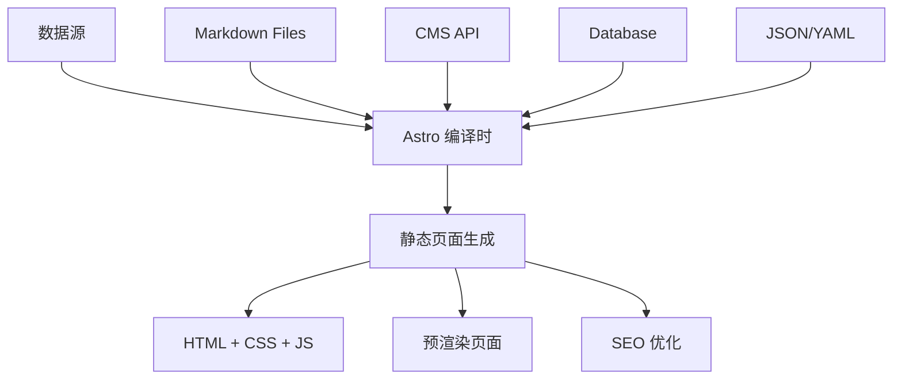

::: tip 学习目标
- 掌握 Astro 的数据获取模式 (getStaticPaths, Astro.props)
- 集成 CMS 和 API 数据源
- 实现 Markdown 和 MDX 内容处理
- 学会内容集合 (Content Collections) 的使用
:::

## 知识点

### Astro 数据获取机制

Astro 提供了多种数据获取方式，适应不同的应用场景：

- **编译时数据获取**：在构建阶段获取数据，生成静态页面
- **getStaticPaths**：用于动态路由的数据预获取
- **Content Collections**：类型安全的内容管理系统
- **API 集成**：与外部数据源的无缝对接

### 数据流架构



### 内容管理策略

- **本地内容**：Markdown/MDX 文件管理
- **无头 CMS**：Strapi, Contentful, Sanity 等
- **数据库集成**：PostgreSQL, MongoDB 等
- **API 聚合**：多数据源整合

## 静态路径生成

### getStaticPaths 基础用法

```astro
---
// src/pages/blog/[slug].astro

export async function getStaticPaths() {
  // 获取博客文章数据
  const posts = await fetch('https://api.example.com/posts')
    .then(res => res.json());

  return posts.map((post) => ({
    params: { slug: post.slug },
    props: { post }
  }));
}

const { post } = Astro.props;
---

<html>
<head>
  <title>{post.title}</title>
  <meta name="description" content={post.excerpt} />
</head>
<body>
  <article>
    <h1>{post.title}</h1>
    <time>{new Date(post.publishDate).toLocaleDateString()}</time>
    <div set:html={post.content} />
  </article>
</body>
</html>
```

### 分页数据处理

```astro
---
// src/pages/blog/page/[page].astro

export async function getStaticPaths({ paginate }) {
  const posts = await fetch('https://api.example.com/posts')
    .then(res => res.json());

  // 使用内置分页功能
  return paginate(posts, { pageSize: 6 });
}

const { page } = Astro.props;
---

<div class="blog-container">
  <div class="posts-grid">
    {page.data.map((post) => (
      <article class="post-card">
        <h2>
          <a href={`/blog/${post.slug}`}>{post.title}</a>
        </h2>
        <p>{post.excerpt}</p>
        <time>{new Date(post.publishDate).toLocaleDateString()}</time>
      </article>
    ))}
  </div>

  <!-- 分页导航 -->
  <nav class="pagination">
    {page.url.prev && (
      <a href={page.url.prev} class="pagination-link">← 上一页</a>
    )}

    <span class="pagination-info">
      第 {page.currentPage} 页，共 {page.lastPage} 页
    </span>

    {page.url.next && (
      <a href={page.url.next} class="pagination-link">下一页 →</a>
    )}
  </nav>
</div>
```

### 嵌套动态路由

```astro
---
// src/pages/category/[category]/[slug].astro

export async function getStaticPaths() {
  const posts = await fetch('https://api.example.com/posts')
    .then(res => res.json());

  return posts.map((post) => ({
    params: {
      category: post.category.slug,
      slug: post.slug
    },
    props: {
      post,
      category: post.category
    }
  }));
}

const { post, category } = Astro.props;
---

<div class="post-container">
  <!-- 面包屑导航 -->
  <nav class="breadcrumb">
    <a href="/">首页</a>
    <span>/</span>
    <a href={`/category/${category.slug}`}>{category.name}</a>
    <span>/</span>
    <span>{post.title}</span>
  </nav>

  <article class="post-content">
    <header>
      <h1>{post.title}</h1>
      <div class="post-meta">
        <span class="category">
          <a href={`/category/${category.slug}`}>{category.name}</a>
        </span>
        <time>{new Date(post.publishDate).toLocaleDateString()}</time>
      </div>
    </header>

    <div class="content" set:html={post.content} />
  </article>
</div>
```

## Content Collections

### 配置 Content Collections

```typescript
// src/content/config.ts
import { defineCollection, z } from 'astro:content';

const blogCollection = defineCollection({
  type: 'content',
  schema: z.object({
    title: z.string(),
    description: z.string(),
    publishDate: z.date(),
    author: z.string(),
    tags: z.array(z.string()),
    featured: z.boolean().default(false),
    draft: z.boolean().default(false),
    heroImage: z.string().optional(),
  }),
});

const projectCollection = defineCollection({
  type: 'content',
  schema: z.object({
    title: z.string(),
    description: z.string(),
    technology: z.array(z.string()),
    github: z.string().url(),
    demo: z.string().url().optional(),
    featured: z.boolean().default(false),
    completedDate: z.date(),
  }),
});

export const collections = {
  'blog': blogCollection,
  'projects': projectCollection,
};
```

### 使用 Content Collections

```astro
---
// src/pages/blog/index.astro
import { getCollection } from 'astro:content';
import BlogCard from '../../components/BlogCard.astro';

// 获取所有博客文章
const allPosts = await getCollection('blog');

// 过滤和排序
const publishedPosts = allPosts
  .filter(post => !post.data.draft)
  .sort((a, b) => b.data.publishDate.valueOf() - a.data.publishDate.valueOf());

// 获取特色文章
const featuredPosts = publishedPosts.filter(post => post.data.featured);
---

<div class="blog-index">
  <!-- 特色文章区域 -->
  {featuredPosts.length > 0 && (
    <section class="featured-posts">
      <h2>特色文章</h2>
      <div class="featured-grid">
        {featuredPosts.slice(0, 3).map((post) => (
          <BlogCard post={post} featured={true} />
        ))}
      </div>
    </section>
  )}

  <!-- 最新文章 -->
  <section class="recent-posts">
    <h2>最新文章</h2>
    <div class="posts-grid">
      {publishedPosts.map((post) => (
        <BlogCard post={post} />
      ))}
    </div>
  </section>
</div>
```

### 动态博客页面

```astro
---
// src/pages/blog/[...slug].astro
import { getCollection } from 'astro:content';
import BlogLayout from '../../layouts/BlogLayout.astro';

export async function getStaticPaths() {
  const posts = await getCollection('blog');

  return posts.map((post) => ({
    params: { slug: post.slug },
    props: post,
  }));
}

const post = Astro.props;
const { Content } = await post.render();
---

<BlogLayout frontmatter={post.data}>
  <article class="prose prose-lg max-w-4xl mx-auto">
    <header class="post-header">
      <h1>{post.data.title}</h1>

      <div class="post-meta">
        <time>{post.data.publishDate.toLocaleDateString('zh-CN')}</time>
        <span>作者：{post.data.author}</span>
      </div>

      {post.data.heroImage && (
        
      )}

      <p class="post-description">{post.data.description}</p>

      <!-- 标签 -->
      <div class="post-tags">
        {post.data.tags.map((tag) => (
          <a href={`/tags/${tag}`} class="tag">#{tag}</a>
        ))}
      </div>
    </header>

    <!-- 文章内容 -->
    <div class="post-content">
      <Content />
    </div>
  </article>
</BlogLayout>
```

## 外部数据源集成

### REST API 集成

```typescript
// src/lib/api.ts

interface Post {
  id: number;
  title: string;
  content: string;
  slug: string;
  publishDate: string;
  author: {
    name: string;
    avatar: string;
  };
  categories: string[];
}

export class BlogAPI {
  private baseURL = 'https://api.yourblog.com';

  async getPosts(page = 1, limit = 10): Promise<Post[]> {
    const response = await fetch(
      `${this.baseURL}/posts?page=${page}&limit=${limit}`
    );

    if (!response.ok) {
      throw new Error(`Failed to fetch posts: ${response.statusText}`);
    }

    return response.json();
  }

  async getPost(slug: string): Promise<Post> {
    const response = await fetch(`${this.baseURL}/posts/${slug}`);

    if (!response.ok) {
      throw new Error(`Failed to fetch post: ${response.statusText}`);
    }

    return response.json();
  }

  async getCategories(): Promise<string[]> {
    const response = await fetch(`${this.baseURL}/categories`);
    return response.json();
  }
}

export const blogAPI = new BlogAPI();
```

### GraphQL 集成

```typescript
// src/lib/graphql.ts

interface GraphQLResponse<T> {
  data: T;
  errors?: Array<{ message: string }>;
}

export class GraphQLClient {
  constructor(private endpoint: string) {}

  async query<T>(query: string, variables?: Record<string, any>): Promise<T> {
    const response = await fetch(this.endpoint, {
      method: 'POST',
      headers: {
        'Content-Type': 'application/json',
      },
      body: JSON.stringify({
        query,
        variables,
      }),
    });

    const result: GraphQLResponse<T> = await response.json();

    if (result.errors) {
      throw new Error(result.errors[0].message);
    }

    return result.data;
  }
}

// 使用示例
const client = new GraphQLClient('https://api.contentful.com/graphql');

export async function fetchBlogPosts() {
  const query = `
    query GetBlogPosts($limit: Int) {
      blogPostCollection(limit: $limit) {
        items {
          title
          slug
          content
          publishDate
          author {
            name
            bio
          }
          featuredImage {
            url
            description
          }
        }
      }
    }
  `;

  return client.query(query, { limit: 10 });
}
```

### CMS 集成示例

```astro
---
// src/pages/cms-blog/[slug].astro
import { fetchBlogPosts, fetchBlogPost } from '../../lib/contentful';

export async function getStaticPaths() {
  const posts = await fetchBlogPosts();

  return posts.items.map((post) => ({
    params: { slug: post.slug },
    props: { post }
  }));
}

const { post } = Astro.props;
---

<html>
<head>
  <title>{post.title}</title>
  <meta name="description" content={post.excerpt} />

  <!-- SEO 元数据 -->
  <meta property="og:title" content={post.title} />
  <meta property="og:description" content={post.excerpt} />
  <meta property="og:image" content={post.featuredImage?.url} />
  <meta property="og:type" content="article" />
</head>

<body>
  <article class="cms-post">
    <header>
      <h1>{post.title}</h1>

      {post.featuredImage && (
        
      )}

      <div class="post-meta">
        <time>{new Date(post.publishDate).toLocaleDateString()}</time>
        <span>作者：{post.author.name}</span>
      </div>
    </header>

    <!-- 使用富文本渲染器 -->
    <div class="content">
      <RichTextRenderer content={post.content} />
    </div>
  </article>
</body>
</html>
```

## MDX 集成与高级用法

### MDX 配置

```javascript
// astro.config.mjs
import { defineConfig } from 'astro/config';
import mdx from '@astrojs/mdx';
import remarkGfm from 'remark-gfm';
import remarkMath from 'remark-math';
import rehypeKatex from 'rehype-katex';
import rehypePrettyCode from 'rehype-pretty-code';

export default defineConfig({
  integrations: [
    mdx({
      remarkPlugins: [remarkGfm, remarkMath],
      rehypePlugins: [
        rehypeKatex,
        [rehypePrettyCode, {
          theme: 'github-dark',
          keepBackground: false,
        }]
      ],
    }),
  ],
});
```

### 自定义 MDX 组件

``` astro

// src/components/mdx/CodeBlock.astro
export interface Props {
  title?: string;
  language: string;
  code: string;
  showLineNumbers?: boolean;
}

const { title, language, code, showLineNumbers = false } = Astro.props;

<div class="code-block">
  {title && (
    <div class="code-title">
      <span class="language-label">{language}</span>
      <span class="title">{title}</span>
    </div>
  )}

  <pre class="code-content" class:list={[
    showLineNumbers && 'line-numbers'
  ]}>
    <code class={`language-${language}`} set:html={code} />
  </pre>
</div>
```

``` astro
---
// src/components/mdx/Callout.astro
export interface Props {
  type: 'info' | 'warning' | 'error' | 'success';
  title?: string;
}

const { type, title } = Astro.props;

const icons = {
  info: '💡',
  warning: '⚠️',
  error: '❌',
  success: '✅'
};
---

<div class={`callout callout-${type}`}>
  {title && (
    <div class="callout-title">
      <span class="callout-icon">{icons[type]}</span>
      <span>{title}</span>
    </div>
  )}
  <div class="callout-content">
    <slot></slot>
  </div>
</div>

<style>
.callout {
  @apply p-4 rounded-lg border-l-4 my-4;
}

.callout-info {
  @apply bg-blue-50 border-blue-400 text-blue-800;
}

.callout-warning {
  @apply bg-yellow-50 border-yellow-400 text-yellow-800;
}

.callout-error {
  @apply bg-red-50 border-red-400 text-red-800;
}

.callout-success {
  @apply bg-green-50 border-green-400 text-green-800;
}

.callout-title {
  @apply font-semibold flex items-center gap-2 mb-2;
}
</style>
```

### MDX 页面示例

```mdx
---
# src/content/blog/advanced-astro-patterns.mdx
title: "Astro 高级模式和最佳实践"
description: "深入探讨 Astro 的高级用法和架构模式"
publishDate: 2024-01-15
author: "开发者"
tags: ["Astro", "架构", "最佳实践"]
---

import { Callout } from '../../components/mdx/Callout.astro';
import { CodeBlock } from '../../components/mdx/CodeBlock.astro';

# Astro 高级模式和最佳实践

<Callout type="info" title="学习目标">
本文将介绍一些 Astro 的高级使用模式，帮助你构建更复杂的应用。
</Callout>

## 组件岛屿架构

Astro 的岛屿架构是其核心优势之一：

```astro
---
// 只有需要交互的组件才会被水合
---

<div class="page-layout">
  <!-- 静态内容，不会发送到客户端 -->
  <header>
    <h1>我的网站</h1>
  </header>

  <!-- 交互式组件，按需水合 -->
  <SearchWidget client:load />
  <UserProfile client:visible />
  <Newsletter client:idle />
</div>
```

<Callout type="warning" title="性能提示">
谨慎使用 `client:load` 指令，优先考虑 `client:visible` 或 `client:idle`。
</Callout>

## 数据获取最佳实践

### 1. 缓存策略
```
<CodeBlock
  title="缓存优化示例"
  language="typescript"
  code={`
// src/lib/cache.ts
const cache = new Map();

export async function fetchWithCache(url: string, ttl = 300000) {
  const cached = cache.get(url);

  if (cached && Date.now() - cached.timestamp < ttl) {
    return cached.data;
  }

  const data = await fetch(url).then(res => res.json());
  cache.set(url, { data, timestamp: Date.now() });

  return data;
}
  `}
  showLineNumbers={true}
/>
```
### 2. 错误处理

```typescript
export async function safeApiCall<T>(
  apiCall: () => Promise<T>,
  fallback: T
): Promise<T> {
  try {
    return await apiCall();
  } catch (error) {
    console.error('API call failed:', error);
    return fallback;
  }
}
```

<Callout type="success" title="生产就绪">
这种模式确保你的网站即使在 API 失败时也能正常运行。
</Callout>
```

## 数据验证与类型安全

### Zod 集成

```typescript
// src/lib/validation.ts
import { z } from 'zod';

// API 响应验证
export const PostSchema = z.object({
  id: z.number(),
  title: z.string().min(1),
  content: z.string(),
  publishDate: z.string().datetime(),
  author: z.object({
    name: z.string(),
    email: z.string().email(),
  }),
  tags: z.array(z.string()),
  featured: z.boolean().default(false),
});

export type Post = z.infer<typeof PostSchema>;

// 验证函数
export function validatePost(data: unknown): Post {
  return PostSchema.parse(data);
}

// 安全的 API 调用
export async function fetchValidatedPosts(): Promise<Post[]> {
  const response = await fetch('/api/posts');
  const data = await response.json();

  return z.array(PostSchema).parse(data);
}
```

### 环境变量验证

```typescript
// src/env.ts
import { z } from 'zod';

const envSchema = z.object({
  PUBLIC_SITE_URL: z.string().url(),
  CMS_API_KEY: z.string().min(1),
  DATABASE_URL: z.string().url(),
  NODE_ENV: z.enum(['development', 'production', 'test']),
});

export const env = envSchema.parse(process.env);
```

::: note 关键要点
1. **类型安全**：使用 TypeScript 和 Zod 确保数据结构的正确性
2. **缓存策略**：合理使用缓存减少 API 调用次数
3. **错误处理**：提供降级方案确保网站可用性
4. **Content Collections**：利用类型化的内容管理系统
5. **性能优化**：只在必要时进行客户端水合
:::

::: warning 注意事项
- 在 `getStaticPaths` 中的数据获取发生在构建时，不是运行时
- 大量数据可能会影响构建时间，考虑使用增量构建
- 敏感信息不要暴露在客户端代码中
- 定期验证外部 API 的可用性和数据格式
:::