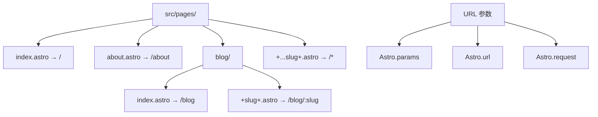

::: tip 学习目标
- 深入理解 Astro 的文件系统路由
- 实现动态路由和嵌套路由
- 构建导航组件和面包屑系统
- 优化页面间的转换和加载性能
:::

## 知识点

### Astro 路由系统

Astro 使用基于文件系统的路由机制，具有以下特点：

- **零配置路由**：文件路径直接映射为 URL 路径
- **静态优先**：默认生成静态页面，支持动态路由
- **嵌套路由**：通过文件夹结构实现路由嵌套
- **灵活匹配**：支持动态参数和通配符路由

### 路由层级结构



### 导航性能优化

- **预取策略**：智能预加载链接资源
- **视图过渡**：平滑的页面切换动画
- **路由缓存**：客户端路由状态管理
- **代码分割**：按路由拆分 JavaScript 包

## 文件系统路由

### 基础路由结构

```
src/pages/
├── index.astro          → /
├── about.astro          → /about
├── contact.astro        → /contact
├── blog/
│   ├── index.astro      → /blog
│   ├── [slug].astro     → /blog/:slug
│   └── category/
│       ├── index.astro  → /blog/category
│       └── [name].astro → /blog/category/:name
├── products/
│   ├── [id].astro       → /products/:id
│   └── [...slug].astro  → /products/* (catch-all)
└── api/
    ├── posts.json.ts    → /api/posts.json
    └── users/
        └── [id].json.ts → /api/users/:id.json
```

### 动态路由参数

```astro
---
// src/pages/blog/[slug].astro

// 通过 Astro.params 获取路由参数
const { slug } = Astro.params;

// 通过 Astro.url 获取完整 URL 信息
const url = Astro.url;
const searchParams = url.searchParams;

// 示例：/blog/my-post?category=tech&featured=true
console.log(slug);                    // "my-post"
console.log(searchParams.get('category')); // "tech"
console.log(searchParams.get('featured')); // "true"
---

<h1>文章：{slug}</h1>
<p>当前 URL：{url.pathname}</p>
```

### 嵌套路由布局

```astro
---
// src/layouts/BlogLayout.astro
export interface Props {
  frontmatter?: {
    title?: string;
    description?: string;
  };
}

const { frontmatter } = Astro.props;
---

<html>
<head>
  <title>{frontmatter?.title || 'Blog'}</title>
  <meta name="description" content={frontmatter?.description || ''} />
</head>
<body>
  <div class="blog-layout">
    <!-- 博客导航 -->
    <nav class="blog-nav">
      <a href="/blog">所有文章</a>
      <a href="/blog/category">分类</a>
      <a href="/blog/tags">标签</a>
      <a href="/blog/archive">归档</a>
    </nav>

    <!-- 主要内容区域 -->
    <main class="blog-content">
      <slot />
    </main>

    <!-- 侧边栏 -->
    <aside class="blog-sidebar">
      <div class="recent-posts">
        <h3>最新文章</h3>
        <!-- 最新文章列表 -->
      </div>

      <div class="categories">
        <h3>分类</h3>
        <!-- 分类列表 -->
      </div>
    </aside>
  </div>
</body>
</html>
```

### 通配符路由

```astro
---
// src/pages/docs/[...slug].astro

export async function getStaticPaths() {
  // 生成所有可能的文档路径
  const docs = [
    { slug: 'getting-started' },
    { slug: 'api/introduction' },
    { slug: 'api/authentication' },
    { slug: 'guides/deployment' },
    { slug: 'guides/best-practices' },
  ];

  return docs.map(doc => ({
    params: { slug: doc.slug },
    props: { doc }
  }));
}

const { slug } = Astro.params;
const { doc } = Astro.props;

// slug 可能是 "api/introduction" 这样的嵌套路径
const pathSegments = slug.split('/');
const section = pathSegments[0];     // "api"
const page = pathSegments[1];        // "introduction"
---

<div class="docs-page">
  <!-- 面包屑导航 -->
  <nav class="breadcrumb">
    <a href="/docs">文档</a>
    {pathSegments.map((segment, index) => {
      const path = pathSegments.slice(0, index + 1).join('/');
      return (
        <>
          <span>/</span>
          <a href={`/docs/${path}`}>{segment}</a>
        </>
      );
    })}
  </nav>

  <!-- 文档内容 -->
  <article class="doc-content">
    <h1>{doc.title}</h1>
    <!-- 文档内容 -->
  </article>
</div>
```

## 导航组件开发

### 智能导航菜单

```astro
---
// src/components/Navigation.astro

interface NavItem {
  label: string;
  href: string;
  children?: NavItem[];
  icon?: string;
}

const navItems: NavItem[] = [
  { label: '首页', href: '/', icon: 'home' },
  {
    label: '博客',
    href: '/blog',
    icon: 'blog',
    children: [
      { label: '所有文章', href: '/blog' },
      { label: '技术分享', href: '/blog/category/tech' },
      { label: '生活随笔', href: '/blog/category/life' },
    ]
  },
  {
    label: '项目',
    href: '/projects',
    icon: 'projects',
    children: [
      { label: '开源项目', href: '/projects/open-source' },
      { label: '个人作品', href: '/projects/personal' },
    ]
  },
  { label: '关于', href: '/about', icon: 'about' },
  { label: '联系', href: '/contact', icon: 'contact' },
];

// 获取当前页面路径
const currentPath = Astro.url.pathname;

// 判断是否为当前页面或子页面
function isActive(href: string): boolean {
  if (href === '/') {
    return currentPath === '/';
  }
  return currentPath.startsWith(href);
}

// 判断是否有活跃的子项
function hasActiveChild(item: NavItem): boolean {
  if (!item.children) return false;
  return item.children.some(child => isActive(child.href));
}
---

<nav class="main-navigation">
  <div class="nav-container">
    <!-- Logo -->
    <div class="nav-logo">
      <a href="/">
        
      </a>
    </div>

    <!-- 导航菜单 -->
    <ul class="nav-menu">
      {navItems.map((item) => (
        <li class={`nav-item ${isActive(item.href) || hasActiveChild(item) ? 'active' : ''}`}>
          <a
            href={item.href}
            class={`nav-link ${isActive(item.href) ? 'current' : ''}`}
          >
            {item.icon && <i class={`icon-${item.icon}`}></i>}
            <span>{item.label}</span>
            {item.children && <i class="icon-arrow-down"></i>}
          </a>

          <!-- 子菜单 -->
          {item.children && (
            <ul class="sub-menu">
              {item.children.map((child) => (
                <li class="sub-item">
                  <a
                    href={child.href}
                    class={`sub-link ${isActive(child.href) ? 'current' : ''}`}
                  >
                    {child.label}
                  </a>
                </li>
              ))}
            </ul>
          )}
        </li>
      ))}
    </ul>

    <!-- 移动端菜单按钮 -->
    <button class="mobile-menu-toggle" aria-label="切换菜单">
      <span></span>
      <span></span>
      <span></span>
    </button>
  </div>
</nav>

<style>
.main-navigation {
  @apply bg-white shadow-sm border-b sticky top-0 z-50;
}

.nav-container {
  @apply max-w-7xl mx-auto px-4 sm:px-6 lg:px-8;
  @apply flex items-center justify-between h-16;
}

.nav-logo img {
  @apply h-8 w-auto;
}

.nav-menu {
  @apply hidden md:flex space-x-8;
}

.nav-item {
  @apply relative;
}

.nav-link {
  @apply flex items-center space-x-1 px-3 py-2 rounded-md;
  @apply text-gray-600 hover:text-gray-900 transition-colors;
}

.nav-link.current {
  @apply text-blue-600 font-medium;
}

.nav-item.active > .nav-link {
  @apply text-blue-600;
}

.sub-menu {
  @apply absolute left-0 mt-2 w-48 bg-white shadow-lg rounded-md py-1;
  @apply opacity-0 invisible transform translate-y-1 transition-all;
}

.nav-item:hover .sub-menu {
  @apply opacity-100 visible translate-y-0;
}

.sub-link {
  @apply block px-4 py-2 text-sm text-gray-700 hover:bg-gray-100;
}

.sub-link.current {
  @apply text-blue-600 bg-blue-50;
}

.mobile-menu-toggle {
  @apply md:hidden flex flex-col justify-center items-center w-6 h-6 space-y-1;
}

.mobile-menu-toggle span {
  @apply block w-6 h-0.5 bg-gray-600 transition-all;
}
</style>
```

### 面包屑导航

```astro
---
// src/components/Breadcrumb.astro

export interface Props {
  items?: Array<{ label: string; href: string }>;
}

const { items } = Astro.props;

// 如果没有提供 items，从当前路径自动生成
const breadcrumbItems = items || generateBreadcrumb(Astro.url.pathname);

function generateBreadcrumb(pathname: string) {
  const segments = pathname.split('/').filter(Boolean);
  const breadcrumb = [{ label: '首页', href: '/' }];

  let currentPath = '';
  segments.forEach((segment, index) => {
    currentPath += `/${segment}`;

    // 转换路径段为可读标签
    const label = segment
      .replace(/-/g, ' ')
      .replace(/^\w/, c => c.toUpperCase());

    breadcrumb.push({
      label,
      href: currentPath
    });
  });

  return breadcrumb;
}
---

{breadcrumbItems.length > 1 && (
  <nav class="breadcrumb" aria-label="面包屑导航">
    <ol class="breadcrumb-list">
      {breadcrumbItems.map((item, index) => (
        <li class="breadcrumb-item">
          {index === breadcrumbItems.length - 1 ? (
            <span class="breadcrumb-current" aria-current="page">
              {item.label}
            </span>
          ) : (
            <>
              <a href={item.href} class="breadcrumb-link">
                {item.label}
              </a>
              <span class="breadcrumb-separator" aria-hidden="true">
                /
              </span>
            </>
          )}
        </li>
      ))}
    </ol>
  </nav>
)}

<style>
.breadcrumb {
  @apply py-3 text-sm;
}

.breadcrumb-list {
  @apply flex items-center space-x-1;
}

.breadcrumb-item {
  @apply flex items-center;
}

.breadcrumb-link {
  @apply text-gray-500 hover:text-gray-700 transition-colors;
}

.breadcrumb-current {
  @apply text-gray-900 font-medium;
}

.breadcrumb-separator {
  @apply text-gray-400 mx-2;
}
</style>
```

### 分页导航

```astro
---
// src/components/Pagination.astro

export interface Props {
  currentPage: number;
  totalPages: number;
  baseUrl: string;
  showFirstLast?: boolean;
  showPrevNext?: boolean;
  maxVisible?: number;
}

const {
  currentPage,
  totalPages,
  baseUrl,
  showFirstLast = true,
  showPrevNext = true,
  maxVisible = 5
} = Astro.props;

// 计算显示的页码范围
function getVisiblePages(current: number, total: number, max: number) {
  if (total <= max) {
    return Array.from({ length: total }, (_, i) => i + 1);
  }

  const half = Math.floor(max / 2);
  let start = Math.max(1, current - half);
  let end = Math.min(total, start + max - 1);

  if (end - start + 1 < max) {
    start = Math.max(1, end - max + 1);
  }

  return Array.from({ length: end - start + 1 }, (_, i) => start + i);
}

const visiblePages = getVisiblePages(currentPage, totalPages, maxVisible);

function getPageUrl(page: number): string {
  if (page === 1) {
    return baseUrl;
  }
  return `${baseUrl}/page/${page}`;
}
---

{totalPages > 1 && (
  <nav class="pagination" aria-label="分页导航">
    <div class="pagination-info">
      第 {currentPage} 页，共 {totalPages} 页
    </div>

    <ul class="pagination-list">
      <!-- 首页 -->
      {showFirstLast && currentPage > 1 && (
        <li>
          <a href={getPageUrl(1)} class="pagination-link">
            <span class="sr-only">首页</span>
            <i class="icon-first"></i>
          </a>
        </li>
      )}

      <!-- 上一页 -->
      {showPrevNext && currentPage > 1 && (
        <li>
          <a href={getPageUrl(currentPage - 1)} class="pagination-link">
            <span class="sr-only">上一页</span>
            <i class="icon-prev"></i>
          </a>
        </li>
      )}

      <!-- 页码 -->
      {visiblePages.map((page) => (
        <li>
          {page === currentPage ? (
            <span class="pagination-current" aria-current="page">
              {page}
            </span>
          ) : (
            <a href={getPageUrl(page)} class="pagination-link">
              {page}
            </a>
          )}
        </li>
      ))}

      <!-- 下一页 -->
      {showPrevNext && currentPage < totalPages && (
        <li>
          <a href={getPageUrl(currentPage + 1)} class="pagination-link">
            <span class="sr-only">下一页</span>
            <i class="icon-next"></i>
          </a>
        </li>
      )}

      <!-- 末页 -->
      {showFirstLast && currentPage < totalPages && (
        <li>
          <a href={getPageUrl(totalPages)} class="pagination-link">
            <span class="sr-only">末页</span>
            <i class="icon-last"></i>
          </a>
        </li>
      )}
    </ul>
  </nav>
)}

<style>
.pagination {
  @apply flex flex-col sm:flex-row items-center justify-between gap-4 py-6;
}

.pagination-info {
  @apply text-sm text-gray-600;
}

.pagination-list {
  @apply flex items-center space-x-1;
}

.pagination-link {
  @apply flex items-center justify-center w-10 h-10 rounded-md;
  @apply text-gray-600 hover:text-gray-900 hover:bg-gray-100;
  @apply transition-colors duration-200;
}

.pagination-current {
  @apply flex items-center justify-center w-10 h-10 rounded-md;
  @apply bg-blue-600 text-white font-medium;
}

.sr-only {
  @apply sr-only;
}
</style>
```

## 视图过渡动画

### 启用视图过渡

```astro
---
// src/layouts/BaseLayout.astro
import { ViewTransitions } from 'astro:transitions';
---

<html>
<head>
  <ViewTransitions />
</head>
<body>
  <slot />
</body>
</html>
```

### 自定义过渡动画

```astro
---
// src/components/PageTransition.astro
import { fade, slide } from 'astro:transitions';
---

<div transition:animate={fade({ duration: '0.3s' })}>
  <slot />
</div>

<style>
/* 自定义过渡样式 */
::view-transition-old(root) {
  animation: slideOut 0.3s ease-out forwards;
}

::view-transition-new(root) {
  animation: slideIn 0.3s ease-out;
}

@keyframes slideOut {
  from { transform: translateX(0); }
  to { transform: translateX(-100%); }
}

@keyframes slideIn {
  from { transform: translateX(100%); }
  to { transform: translateX(0); }
}
</style>
```

### 条件过渡

```astro
---
// src/pages/blog/[slug].astro

// 根据来源页面选择不同的过渡动画
const referrer = Astro.request.headers.get('referer');
const fromBlogIndex = referrer?.includes('/blog');

const transitionName = fromBlogIndex ? 'blog-detail' : 'slide';
---

<div transition:name={transitionName}>
  <article>
    <!-- 文章内容 -->
  </article>
</div>
```

## 路由性能优化

### 智能预取

```astro
---
// src/components/SmartLink.astro

export interface Props {
  href: string;
  prefetch?: 'hover' | 'visible' | 'load' | false;
  class?: string;
}

const { href, prefetch = 'hover', class: className, ...rest } = Astro.props;
---

<a
  href={href}
  class={className}
  data-astro-prefetch={prefetch}
  {...rest}
>
  <slot />
</a>

<script>
// 自定义预取逻辑
document.addEventListener('DOMContentLoaded', () => {
  const links = document.querySelectorAll('a[data-astro-prefetch="hover"]');

  links.forEach(link => {
    let timeout: number;

    link.addEventListener('mouseenter', () => {
      timeout = setTimeout(() => {
        const href = link.getAttribute('href');
        if (href && !href.startsWith('#')) {
          // 预取页面资源
          fetch(href, { method: 'HEAD' });
        }
      }, 100);
    });

    link.addEventListener('mouseleave', () => {
      clearTimeout(timeout);
    });
  });
});
</script>
```

### 路由缓存策略

```typescript
// src/lib/router-cache.ts

interface CacheEntry {
  html: string;
  timestamp: number;
  etag?: string;
}

class RouterCache {
  private cache = new Map<string, CacheEntry>();
  private maxAge = 5 * 60 * 1000; // 5分钟

  async get(url: string): Promise<string | null> {
    const entry = this.cache.get(url);

    if (!entry) return null;

    // 检查是否过期
    if (Date.now() - entry.timestamp > this.maxAge) {
      this.cache.delete(url);
      return null;
    }

    return entry.html;
  }

  set(url: string, html: string, etag?: string): void {
    this.cache.set(url, {
      html,
      timestamp: Date.now(),
      etag
    });

    // 限制缓存大小
    if (this.cache.size > 50) {
      const firstKey = this.cache.keys().next().value;
      this.cache.delete(firstKey);
    }
  }

  clear(): void {
    this.cache.clear();
  }
}

export const routerCache = new RouterCache();
```

::: note 关键要点
1. **文件系统路由**：利用文件结构自动生成路由，零配置开发
2. **动态参数**：通过 `[param]` 语法支持动态路由
3. **嵌套布局**：使用布局组件实现页面结构复用
4. **导航状态**：准确判断当前页面状态，提供良好的用户体验
5. **性能优化**：合理使用预取和缓存策略
:::

::: warning 注意事项
- 动态路由需要通过 `getStaticPaths` 预生成所有可能的路径
- 视图过渡仅在支持的浏览器中生效，需要提供降级方案
- 预取策略要平衡用户体验和服务器负载
- 面包屑和导航状态需要考虑 i18n 和动态内容场景
:::