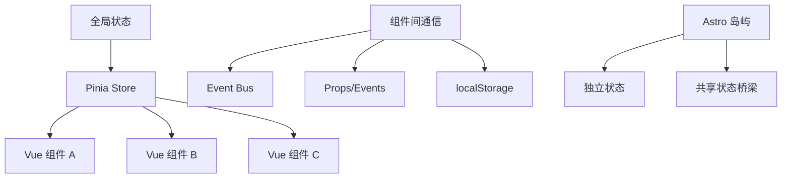

::: tip 学习目标
- 在 Astro + Vue 3 环境中实现状态管理
- 集成 Pinia 或 Vuex 进行复杂状态处理
- 实现组件间通信和事件处理
- 优化客户端交互性能
:::

## 知识点

### Astro 中的状态管理挑战

在 Astro 的岛屿架构中，状态管理面临独特挑战：

- **岛屿隔离**：不同组件岛屿默认不共享状态
- **水合时机**：组件在不同时机进行客户端水合
- **性能考量**：避免不必要的 JavaScript 传输
- **SSR 兼容**：确保服务端渲染的一致性

### 状态管理架构



### 交互性原则

- **渐进增强**：基础功能无 JavaScript 也能工作
- **按需加载**：只在需要时激活交互功能
- **优雅降级**：JavaScript 失败时的备用方案
- **性能优先**：最小化客户端 JavaScript

## Pinia 状态管理

### 安装和配置

```bash
# 安装 Pinia
npm install pinia
```

```typescript
// src/stores/index.ts
import { createPinia } from 'pinia';
import { createPersistedState } from 'pinia-plugin-persistedstate';

export const pinia = createPinia();

// 添加持久化插件
pinia.use(createPersistedState({
  key: id => `pinia-${id}`,
  storage: typeof window !== 'undefined' ? localStorage : undefined,
}));
```

### 用户状态管理

```typescript
// src/stores/user.ts
import { defineStore } from 'pinia';

interface User {
  id: number;
  name: string;
  email: string;
  avatar?: string;
  role: 'user' | 'admin';
}

interface UserState {
  user: User | null;
  isLoading: boolean;
  error: string | null;
}

export const useUserStore = defineStore('user', {
  state: (): UserState => ({
    user: null,
    isLoading: false,
    error: null,
  }),

  getters: {
    isAuthenticated: (state) => !!state.user,
    isAdmin: (state) => state.user?.role === 'admin',
    displayName: (state) => state.user?.name || '游客',
  },

  actions: {
    async login(email: string, password: string) {
      this.isLoading = true;
      this.error = null;

      try {
        const response = await fetch('/api/auth/login', {
          method: 'POST',
          headers: { 'Content-Type': 'application/json' },
          body: JSON.stringify({ email, password }),
        });

        if (!response.ok) {
          throw new Error('登录失败');
        }

        const userData = await response.json();
        this.user = userData;
      } catch (error) {
        this.error = error instanceof Error ? error.message : '未知错误';
      } finally {
        this.isLoading = false;
      }
    },

    async logout() {
      try {
        await fetch('/api/auth/logout', { method: 'POST' });
      } catch (error) {
        console.error('登出请求失败:', error);
      } finally {
        this.user = null;
        this.error = null;
      }
    },

    async fetchProfile() {
      if (!this.isAuthenticated) return;

      this.isLoading = true;
      try {
        const response = await fetch('/api/user/profile');
        if (response.ok) {
          this.user = await response.json();
        }
      } catch (error) {
        console.error('获取用户信息失败:', error);
      } finally {
        this.isLoading = false;
      }
    },
  },

  // 持久化配置
  persist: {
    paths: ['user'], // 只持久化 user 字段
  },
});
```

### 购物车状态管理

```typescript
// src/stores/cart.ts
import { defineStore } from 'pinia';

interface CartItem {
  id: number;
  name: string;
  price: number;
  quantity: number;
  image?: string;
}

interface CartState {
  items: CartItem[];
  isOpen: boolean;
}

export const useCartStore = defineStore('cart', {
  state: (): CartState => ({
    items: [],
    isOpen: false,
  }),

  getters: {
    totalItems: (state) => state.items.reduce((sum, item) => sum + item.quantity, 0),
    totalPrice: (state) => state.items.reduce((sum, item) => sum + item.price * item.quantity, 0),
    isEmpty: (state) => state.items.length === 0,

    // 格式化价格
    formattedTotal: (state) => {
      const total = state.items.reduce((sum, item) => sum + item.price * item.quantity, 0);
      return `¥${total.toFixed(2)}`;
    },
  },

  actions: {
    addItem(product: Omit<CartItem, 'quantity'>) {
      const existingItem = this.items.find(item => item.id === product.id);

      if (existingItem) {
        existingItem.quantity++;
      } else {
        this.items.push({ ...product, quantity: 1 });
      }

      // 添加成功后打开购物车
      this.isOpen = true;
    },

    removeItem(productId: number) {
      const index = this.items.findIndex(item => item.id === productId);
      if (index > -1) {
        this.items.splice(index, 1);
      }
    },

    updateQuantity(productId: number, quantity: number) {
      const item = this.items.find(item => item.id === productId);
      if (item) {
        if (quantity <= 0) {
          this.removeItem(productId);
        } else {
          item.quantity = quantity;
        }
      }
    },

    clearCart() {
      this.items = [];
      this.isOpen = false;
    },

    toggleCart() {
      this.isOpen = !this.isOpen;
    },
  },

  persist: true,
});
```

## Vue 组件集成

### 用户认证组件

```vue
<!-- src/components/vue/UserAuth.vue -->
<template>
  <div class="user-auth">
    <!-- 已登录状态 -->
    <div v-if="userStore.isAuthenticated" class="user-menu">
      <button @click="toggleMenu" class="user-button">
        
        <span v-else class="user-initial">
          {{ userStore.displayName[0].toUpperCase() }}
        </span>
        <span class="user-name">{{ userStore.displayName }}</span>
        <ChevronDownIcon class="w-4 h-4" />
      </button>

      <!-- 下拉菜单 -->
      <div v-show="isMenuOpen" class="user-dropdown">
        <a href="/profile" class="dropdown-item">
          <UserIcon class="w-4 h-4" />
          个人资料
        </a>
        <a href="/settings" class="dropdown-item">
          <CogIcon class="w-4 h-4" />
          设置
        </a>
        <hr class="dropdown-divider" />
        <button @click="handleLogout" class="dropdown-item text-red-600">
          <LogoutIcon class="w-4 h-4" />
          退出登录
        </button>
      </div>
    </div>

    <!-- 未登录状态 -->
    <div v-else class="auth-buttons">
      <button @click="showLoginForm = true" class="btn btn-outline">
        登录
      </button>
      <a href="/register" class="btn btn-primary">
        注册
      </a>
    </div>

    <!-- 登录表单模态框 -->
    <LoginModal
      v-if="showLoginForm"
      @close="showLoginForm = false"
      @success="handleLoginSuccess"
    />
  </div>
</template>

<script setup lang="ts">
import { ref, onMounted, onUnmounted } from 'vue';
import { useUserStore } from '../../stores/user';
import LoginModal from './LoginModal.vue';
import {
  ChevronDownIcon,
  UserIcon,
  CogIcon,
  LogoutIcon
} from '@heroicons/vue/24/outline';

const userStore = useUserStore();
const isMenuOpen = ref(false);
const showLoginForm = ref(false);

function toggleMenu() {
  isMenuOpen.value = !isMenuOpen.value;
}

async function handleLogout() {
  await userStore.logout();
  isMenuOpen.value = false;
  window.location.reload(); // 刷新页面以更新 Astro 状态
}

function handleLoginSuccess() {
  showLoginForm.value = false;
  window.location.reload();
}

// 点击外部关闭菜单
function handleClickOutside(event: MouseEvent) {
  const target = event.target as Element;
  if (!target.closest('.user-menu')) {
    isMenuOpen.value = false;
  }
}

onMounted(() => {
  document.addEventListener('click', handleClickOutside);
  // 获取最新用户信息
  userStore.fetchProfile();
});

onUnmounted(() => {
  document.removeEventListener('click', handleClickOutside);
});
</script>

<style scoped>
.user-auth {
  @apply relative;
}

.user-button {
  @apply flex items-center space-x-2 px-3 py-2 rounded-md;
  @apply bg-gray-100 hover:bg-gray-200 transition-colors;
}

.user-avatar {
  @apply w-8 h-8 rounded-full object-cover;
}

.user-initial {
  @apply w-8 h-8 rounded-full bg-blue-500 text-white;
  @apply flex items-center justify-center font-medium;
}

.user-dropdown {
  @apply absolute right-0 mt-2 w-48 bg-white shadow-lg rounded-md py-1 z-50;
  @apply border border-gray-200;
}

.dropdown-item {
  @apply flex items-center space-x-2 px-4 py-2 text-sm;
  @apply hover:bg-gray-100 transition-colors;
}

.dropdown-divider {
  @apply border-gray-200 my-1;
}

.auth-buttons {
  @apply flex items-center space-x-2;
}

.btn {
  @apply px-4 py-2 rounded-md font-medium transition-colors;
}

.btn-outline {
  @apply border border-gray-300 text-gray-700 hover:bg-gray-50;
}

.btn-primary {
  @apply bg-blue-600 text-white hover:bg-blue-700;
}
</style>
```

### 购物车组件

```vue
<!-- src/components/vue/ShoppingCart.vue -->
<template>
  <div class="shopping-cart">
    <!-- 购物车图标 -->
    <button @click="cartStore.toggleCart()" class="cart-button">
      <ShoppingCartIcon class="w-6 h-6" />
      <span v-if="cartStore.totalItems > 0" class="cart-badge">
        {{ cartStore.totalItems }}
      </span>
    </button>

    <!-- 购物车侧边栏 -->
    <div
      v-show="cartStore.isOpen"
      class="cart-overlay"
      @click="cartStore.toggleCart()"
    >
      <div
        class="cart-sidebar"
        @click.stop
      >
        <!-- 标题 -->
        <div class="cart-header">
          <h3 class="cart-title">购物车</h3>
          <button @click="cartStore.toggleCart()" class="close-button">
            <XMarkIcon class="w-6 h-6" />
          </button>
        </div>

        <!-- 购物车内容 -->
        <div class="cart-content">
          <!-- 空购物车 -->
          <div v-if="cartStore.isEmpty" class="empty-cart">
            <ShoppingCartIcon class="w-16 h-16 text-gray-300" />
            <p class="text-gray-500">购物车为空</p>
            <button
              @click="cartStore.toggleCart()"
              class="btn btn-primary"
            >
              继续购物
            </button>
          </div>

          <!-- 购物车商品 -->
          <div v-else class="cart-items">
            <div
              v-for="item in cartStore.items"
              :key="item.id"
              class="cart-item"
            >
              <!-- 商品图片 -->
              
              <div v-else class="item-placeholder"></div>

              <!-- 商品信息 -->
              <div class="item-details">
                <h4 class="item-name">{{ item.name }}</h4>
                <p class="item-price">¥{{ item.price.toFixed(2) }}</p>

                <!-- 数量控制 -->
                <div class="quantity-controls">
                  <button
                    @click="cartStore.updateQuantity(item.id, item.quantity - 1)"
                    class="quantity-btn"
                  >
                    <MinusIcon class="w-4 h-4" />
                  </button>
                  <span class="quantity">{{ item.quantity }}</span>
                  <button
                    @click="cartStore.updateQuantity(item.id, item.quantity + 1)"
                    class="quantity-btn"
                  >
                    <PlusIcon class="w-4 h-4" />
                  </button>
                </div>
              </div>

              <!-- 删除按钮 -->
              <button
                @click="cartStore.removeItem(item.id)"
                class="remove-button"
              >
                <TrashIcon class="w-4 h-4" />
              </button>
            </div>
          </div>
        </div>

        <!-- 购物车底部 -->
        <div v-if="!cartStore.isEmpty" class="cart-footer">
          <div class="cart-total">
            <span class="total-label">总计：</span>
            <span class="total-price">{{ cartStore.formattedTotal }}</span>
          </div>

          <div class="cart-actions">
            <button
              @click="clearCart"
              class="btn btn-outline btn-small"
            >
              清空购物车
            </button>
            <button
              @click="goToCheckout"
              class="btn btn-primary"
            >
              去结算
            </button>
          </div>
        </div>
      </div>
    </div>
  </div>
</template>

<script setup lang="ts">
import { useCartStore } from '../../stores/cart';
import {
  ShoppingCartIcon,
  XMarkIcon,
  MinusIcon,
  PlusIcon,
  TrashIcon
} from '@heroicons/vue/24/outline';

const cartStore = useCartStore();

function clearCart() {
  if (confirm('确定要清空购物车吗？')) {
    cartStore.clearCart();
  }
}

function goToCheckout() {
  cartStore.toggleCart();
  window.location.href = '/checkout';
}
</script>

<style scoped>
.cart-button {
  @apply relative p-2 rounded-md hover:bg-gray-100 transition-colors;
}

.cart-badge {
  @apply absolute -top-1 -right-1 w-5 h-5 bg-red-500 text-white;
  @apply text-xs rounded-full flex items-center justify-center;
}

.cart-overlay {
  @apply fixed inset-0 bg-black bg-opacity-50 z-50;
}

.cart-sidebar {
  @apply fixed right-0 top-0 h-full w-96 bg-white shadow-xl;
  @apply flex flex-col;
}

.cart-header {
  @apply flex items-center justify-between p-4 border-b;
}

.cart-title {
  @apply text-lg font-semibold;
}

.close-button {
  @apply p-1 hover:bg-gray-100 rounded-md transition-colors;
}

.cart-content {
  @apply flex-1 overflow-y-auto p-4;
}

.empty-cart {
  @apply flex flex-col items-center justify-center h-full space-y-4;
}

.cart-items {
  @apply space-y-4;
}

.cart-item {
  @apply flex items-center space-x-3 p-3 border rounded-md;
}

.item-image {
  @apply w-16 h-16 object-cover rounded-md;
}

.item-placeholder {
  @apply w-16 h-16 bg-gray-200 rounded-md;
}

.item-details {
  @apply flex-1;
}

.item-name {
  @apply font-medium text-sm;
}

.item-price {
  @apply text-gray-600 text-sm;
}

.quantity-controls {
  @apply flex items-center space-x-2 mt-2;
}

.quantity-btn {
  @apply w-6 h-6 flex items-center justify-center;
  @apply bg-gray-100 hover:bg-gray-200 rounded transition-colors;
}

.quantity {
  @apply text-sm font-medium min-w-8 text-center;
}

.remove-button {
  @apply p-1 text-red-500 hover:bg-red-50 rounded transition-colors;
}

.cart-footer {
  @apply border-t p-4 space-y-4;
}

.cart-total {
  @apply flex items-center justify-between text-lg font-semibold;
}

.cart-actions {
  @apply flex space-x-2;
}

.btn {
  @apply px-4 py-2 rounded-md font-medium transition-colors;
}

.btn-small {
  @apply px-3 py-1 text-sm;
}

.btn-outline {
  @apply border border-gray-300 text-gray-700 hover:bg-gray-50;
}

.btn-primary {
  @apply bg-blue-600 text-white hover:bg-blue-700 flex-1;
}
</style>
```

## 组件间通信

### 事件总线

```typescript
// src/lib/event-bus.ts
import { reactive } from 'vue';

interface EventBus {
  on(event: string, callback: Function): void;
  emit(event: string, ...args: any[]): void;
  off(event: string, callback: Function): void;
}

class EventBusImpl implements EventBus {
  private events: { [key: string]: Function[] } = reactive({});

  on(event: string, callback: Function): void {
    if (!this.events[event]) {
      this.events[event] = [];
    }
    this.events[event].push(callback);
  }

  emit(event: string, ...args: any[]): void {
    if (this.events[event]) {
      this.events[event].forEach(callback => callback(...args));
    }
  }

  off(event: string, callback: Function): void {
    if (this.events[event]) {
      const index = this.events[event].indexOf(callback);
      if (index > -1) {
        this.events[event].splice(index, 1);
      }
    }
  }
}

export const eventBus = new EventBusImpl();
```

### 通知系统

```vue
<!-- src/components/vue/NotificationSystem.vue -->
<template>
  <Teleport to="body">
    <div class="notification-container">
      <TransitionGroup name="notification" tag="div">
        <div
          v-for="notification in notifications"
          :key="notification.id"
          :class="notificationClass(notification.type)"
          class="notification"
        >
          <div class="notification-content">
            <component :is="getIcon(notification.type)" class="notification-icon" />
            <div class="notification-text">
              <h4 v-if="notification.title" class="notification-title">
                {{ notification.title }}
              </h4>
              <p class="notification-message">
                {{ notification.message }}
              </p>
            </div>
          </div>

          <button
            @click="removeNotification(notification.id)"
            class="notification-close"
          >
            <XMarkIcon class="w-4 h-4" />
          </button>
        </div>
      </TransitionGroup>
    </div>
  </Teleport>
</template>

<script setup lang="ts">
import { ref, onMounted } from 'vue';
import { eventBus } from '../../lib/event-bus';
import {
  CheckCircleIcon,
  ExclamationCircleIcon,
  InformationCircleIcon,
  XCircleIcon,
  XMarkIcon
} from '@heroicons/vue/24/outline';

interface Notification {
  id: string;
  type: 'success' | 'error' | 'warning' | 'info';
  title?: string;
  message: string;
  duration?: number;
}

const notifications = ref<Notification[]>([]);

function addNotification(notification: Omit<Notification, 'id'>) {
  const id = Math.random().toString(36).substr(2, 9);
  const newNotification = { ...notification, id };

  notifications.value.push(newNotification);

  // 自动移除
  const duration = notification.duration || 5000;
  if (duration > 0) {
    setTimeout(() => {
      removeNotification(id);
    }, duration);
  }
}

function removeNotification(id: string) {
  const index = notifications.value.findIndex(n => n.id === id);
  if (index > -1) {
    notifications.value.splice(index, 1);
  }
}

function getIcon(type: string) {
  const icons = {
    success: CheckCircleIcon,
    error: XCircleIcon,
    warning: ExclamationCircleIcon,
    info: InformationCircleIcon,
  };
  return icons[type] || InformationCircleIcon;
}

function notificationClass(type: string) {
  const classes = {
    success: 'notification-success',
    error: 'notification-error',
    warning: 'notification-warning',
    info: 'notification-info',
  };
  return classes[type] || classes.info;
}

onMounted(() => {
  eventBus.on('notify', addNotification);
});
</script>

<style scoped>
.notification-container {
  @apply fixed top-4 right-4 z-50 space-y-2;
}

.notification {
  @apply flex items-start p-4 rounded-md shadow-lg min-w-80 max-w-md;
  @apply backdrop-blur-sm;
}

.notification-success {
  @apply bg-green-50 border-l-4 border-green-400 text-green-800;
}

.notification-error {
  @apply bg-red-50 border-l-4 border-red-400 text-red-800;
}

.notification-warning {
  @apply bg-yellow-50 border-l-4 border-yellow-400 text-yellow-800;
}

.notification-info {
  @apply bg-blue-50 border-l-4 border-blue-400 text-blue-800;
}

.notification-content {
  @apply flex-1 flex items-start space-x-3;
}

.notification-icon {
  @apply w-5 h-5 mt-0.5 flex-shrink-0;
}

.notification-title {
  @apply font-medium text-sm;
}

.notification-message {
  @apply text-sm;
}

.notification-close {
  @apply ml-4 flex-shrink-0 p-1 rounded-md hover:bg-black hover:bg-opacity-10;
}

/* 过渡动画 */
.notification-enter-active,
.notification-leave-active {
  @apply transition-all duration-300;
}

.notification-enter-from {
  @apply opacity-0 transform translate-x-full;
}

.notification-leave-to {
  @apply opacity-0 transform translate-x-full;
}
</style>
```

## 性能优化策略

### 懒加载和代码分割

```astro
---
// src/components/LazyVueComponent.astro

export interface Props {
  component: string;
  props?: Record<string, any>;
  loading?: string;
}

const { component, props = {}, loading = 'Loading...' } = Astro.props;
---

<div
  data-vue-component={component}
  data-vue-props={JSON.stringify(props)}
  class="vue-component-placeholder"
>
  {loading}
</div>

<script>
// 懒加载 Vue 组件
class VueComponentLoader {
  private observer: IntersectionObserver;
  private loadedComponents = new Set<string>();

  constructor() {
    this.observer = new IntersectionObserver(
      (entries) => {
        entries.forEach((entry) => {
          if (entry.isIntersecting) {
            this.loadComponent(entry.target as HTMLElement);
          }
        });
      },
      { rootMargin: '50px' }
    );

    this.init();
  }

  private init() {
    const placeholders = document.querySelectorAll('[data-vue-component]');
    placeholders.forEach((el) => {
      this.observer.observe(el);
    });
  }

  private async loadComponent(element: HTMLElement) {
    const componentName = element.dataset.vueComponent;
    const propsData = element.dataset.vueProps;

    if (!componentName || this.loadedComponents.has(componentName)) {
      return;
    }

    try {
      // 动态导入组件
      const { createApp } = await import('vue');
      const { pinia } = await import('../stores');

      // 根据组件名动态导入
      const componentModule = await import(`../vue/${componentName}.vue`);
      const component = componentModule.default;

      // 创建 Vue 应用实例
      const app = createApp(component, propsData ? JSON.parse(propsData) : {});
      app.use(pinia);

      // 挂载到元素
      app.mount(element);

      this.loadedComponents.add(componentName);
      this.observer.unobserve(element);
    } catch (error) {
      console.error(`Failed to load component ${componentName}:`, error);
      element.innerHTML = `<div class="error">Failed to load component</div>`;
    }
  }
}

// 初始化懒加载器
if (typeof window !== 'undefined') {
  new VueComponentLoader();
}
</script>
```

### 状态持久化优化

```typescript
// src/lib/storage.ts

interface StorageAdapter {
  getItem(key: string): string | null;
  setItem(key: string, value: string): void;
  removeItem(key: string): void;
}

class SmartStorage implements StorageAdapter {
  private storage: Storage;
  private compression: boolean;

  constructor(storage: Storage = localStorage, compression = false) {
    this.storage = storage;
    this.compression = compression;
  }

  getItem(key: string): string | null {
    try {
      const value = this.storage.getItem(key);
      if (!value) return null;

      if (this.compression) {
        // 解压缩逻辑（如果需要）
        return this.decompress(value);
      }

      return value;
    } catch (error) {
      console.error('Failed to get item from storage:', error);
      return null;
    }
  }

  setItem(key: string, value: string): void {
    try {
      const finalValue = this.compression ? this.compress(value) : value;
      this.storage.setItem(key, finalValue);
    } catch (error) {
      console.error('Failed to set item in storage:', error);
      // 存储空间不足时的处理
      this.handleStorageQuotaExceeded();
    }
  }

  removeItem(key: string): void {
    try {
      this.storage.removeItem(key);
    } catch (error) {
      console.error('Failed to remove item from storage:', error);
    }
  }

  private compress(value: string): string {
    // 简单的压缩实现（实际应用中可使用更好的压缩算法）
    return btoa(value);
  }

  private decompress(value: string): string {
    return atob(value);
  }

  private handleStorageQuotaExceeded(): void {
    // 清理旧数据的策略
    const keys = Object.keys(this.storage);
    const oldKeys = keys.filter(key => key.startsWith('pinia-'));

    // 移除最旧的数据
    if (oldKeys.length > 0) {
      this.storage.removeItem(oldKeys[0]);
    }
  }
}

export const smartStorage = new SmartStorage();
```

::: note 关键要点
1. **岛屿架构适配**：在 Astro 的岛屿模式下正确实现状态共享
2. **性能优先**：只在必要时加载和执行 JavaScript
3. **渐进增强**：确保基础功能无 JavaScript 也能工作
4. **状态持久化**：合理使用本地存储保持用户状态
5. **组件通信**：通过事件总线和状态管理实现组件间协作
:::

::: warning 注意事项
- 注意 SSR 和客户端状态的同步问题
- 避免在服务端访问浏览器 API
- 合理使用客户端指令控制组件水合时机
- 状态持久化要考虑数据安全和隐私保护
:::