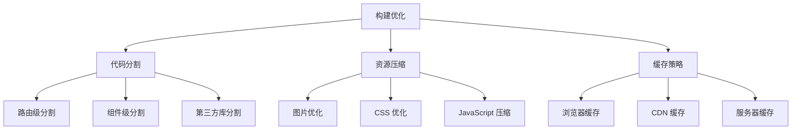

::: tip 学习目标
- 配置生产环境构建优化
- 实现代码分割和懒加载策略
- 优化图片、字体等静态资源
- 掌握多种部署方式 (Vercel, Netlify, 自托管)
:::

## 知识点

### 构建优化策略

Astro 的构建优化围绕以下核心原则：

- **零 JavaScript 默认**：只在需要时发送 JavaScript
- **静态优先**：尽可能生成静态 HTML
- **资源优化**：自动压缩和优化各类资源
- **渐进增强**：确保核心功能无 JavaScript 也能工作

### 性能优化图解



## 构建配置优化

### Astro 配置文件

```javascript
// astro.config.mjs
import { defineConfig } from 'astro/config';
import vue from '@astrojs/vue';
import tailwind from '@astrojs/tailwind';
import sitemap from '@astrojs/sitemap';
import robotsTxt from 'astro-robots-txt';
import { resolve } from 'path';

export default defineConfig({
  site: 'https://your-domain.com',

  // 构建配置
  build: {
    // 内联小于 4kb 的资源
    inlineStylesheets: 'auto',
    // 资源分割阈值
    assetsPrefix: '/assets/',
  },

  // 输出配置
  output: 'static', // 'static' | 'server' | 'hybrid'

  // Vite 配置
  vite: {
    // 构建优化
    build: {
      // 代码分割配置
      rollupOptions: {
        output: {
          // 手动分割第三方库
          manualChunks: {
            'vue-vendor': ['vue', 'pinia'],
            'ui-vendor': ['@headlessui/vue', '@heroicons/vue'],
          },
        },
      },
      // 压缩配置
      minify: 'terser',
      terserOptions: {
        compress: {
          drop_console: true,
          drop_debugger: true,
        },
      },
    },

    // 开发服务器配置
    server: {
      host: true,
      port: 3000,
    },

    // 别名配置
    resolve: {
      alias: {
        '@': resolve('./src'),
        '@components': resolve('./src/components'),
        '@layouts': resolve('./src/layouts'),
        '@pages': resolve('./src/pages'),
        '@stores': resolve('./src/stores'),
        '@utils': resolve('./src/utils'),
      },
    },

    // CSS 配置
    css: {
      devSourcemap: true,
    },
  },

  // 集成配置
  integrations: [
    vue({
      // Vue 配置
      template: {
        compilerOptions: {
          // 生产环境移除注释
          comments: false,
        },
      },
    }),

    tailwind({
      // Tailwind 配置
      config: {
        content: ['./src/**/*.{astro,html,js,jsx,md,mdx,svelte,ts,tsx,vue}'],
      },
    }),

    sitemap({
      // 站点地图配置
      changefreq: 'weekly',
      priority: 0.7,
      lastmod: new Date(),
    }),

    robotsTxt({
      // robots.txt 配置
      policy: [
        {
          userAgent: '*',
          allow: '/',
          disallow: ['/admin', '/api'],
        },
      ],
      sitemap: true,
    }),
  ],

  // Markdown 配置
  markdown: {
    // 代码高亮
    shikiConfig: {
      theme: 'github-dark',
      wrap: true,
    },
    // 插件配置
    remarkPlugins: [],
    rehypePlugins: [],
  },

  // 预取配置
  prefetch: {
    prefetchAll: true,
    defaultStrategy: 'hover',
  },

  // 实验性功能
  experimental: {
    contentCollectionCache: true,
  },
});
```

### 环境变量配置

```bash
# .env.production
PUBLIC_SITE_URL=https://your-domain.com
PUBLIC_GA_ID=G-XXXXXXXXXX
PUBLIC_API_BASE_URL=https://api.your-domain.com

# 构建优化
VITE_DROP_CONSOLE=true
VITE_BUNDLE_ANALYZER=false
```

```typescript
// src/env.d.ts
/// <reference types="astro/client" />

interface ImportMetaEnv {
  readonly PUBLIC_SITE_URL: string;
  readonly PUBLIC_GA_ID: string;
  readonly PUBLIC_API_BASE_URL: string;
}

interface ImportMeta {
  readonly env: ImportMetaEnv;
}
```

## 资源优化

### 图片优化

```astro
---
// src/components/OptimizedImage.astro

export interface Props {
  src: string;
  alt: string;
  width?: number;
  height?: number;
  quality?: number;
  format?: 'webp' | 'avif' | 'jpeg' | 'png';
  loading?: 'lazy' | 'eager';
  sizes?: string;
  class?: string;
}

const {
  src,
  alt,
  width = 800,
  height,
  quality = 80,
  format = 'webp',
  loading = 'lazy',
  sizes = '(max-width: 768px) 100vw, (max-width: 1200px) 50vw, 33vw',
  class: className,
} = Astro.props;

// 生成不同尺寸的图片
const widths = [400, 800, 1200, 1600];
const aspectRatio = height ? width / height : undefined;

function generateSrcSet(baseSrc: string, widths: number[]): string {
  return widths
    .map(w => {
      const h = aspectRatio ? Math.round(w / aspectRatio) : undefined;
      const params = new URLSearchParams({
        w: w.toString(),
        ...(h && { h: h.toString() }),
        q: quality.toString(),
        fm: format,
      });
      return `${baseSrc}?${params} ${w}w`;
    })
    .join(', ');
}

const srcSet = generateSrcSet(src, widths);
const optimizedSrc = `${src}?w=${width}&h=${height || ''}&q=${quality}&fm=${format}`;
---

<picture class={className}>
  <!-- WebP 格式 -->
  <source
    srcset={generateSrcSet(src, widths)}
    sizes={sizes}
    type="image/webp"
  />

  <!-- AVIF 格式（如果支持） -->
  {format === 'avif' && (
    <source
      srcset={generateSrcSet(src.replace(/\?.*/, '?fm=avif'), widths)}
      sizes={sizes}
      type="image/avif"
    />
  )}

  <!-- 后备图片 -->
  
</picture>

<style>
picture img {
  @apply w-full h-auto;
}
</style>
```

### 字体优化

```astro
---
// src/layouts/BaseLayout.astro
---

<html lang="zh-CN">
<head>
  <meta charset="UTF-8" />
  <meta name="viewport" content="width=device-width, initial-scale=1.0" />

  <!-- 字体预加载 -->
  <link
    rel="preload"
    href="/fonts/inter-var.woff2"
    as="font"
    type="font/woff2"
    crossorigin
  />

  <!-- 字体优化 -->
  <link rel="preconnect" href="https://fonts.googleapis.com" />
  <link rel="preconnect" href="https://fonts.gstatic.com" crossorigin />
  <link
    href="https://fonts.googleapis.com/css2?family=Inter:wght@300;400;500;600;700&display=swap"
    rel="stylesheet"
  />

  <style>
    /* 字体回退策略 */
    @font-face {
      font-family: 'Inter var';
      src: url('/fonts/inter-var.woff2') format('woff2');
      font-weight: 300 700;
      font-style: normal;
      font-display: swap;
    }

    :root {
      --font-sans: 'Inter var', 'Inter', system-ui, -apple-system, BlinkMacSystemFont, 'Segoe UI', Roboto, sans-serif;
    }

    body {
      font-family: var(--font-sans);
    }
  </style>
</head>
<body>
  <slot />
</body>
</html>
```

### CSS 优化

```css
/* src/styles/critical.css - 关键路径 CSS */

/* 基础重置和布局 */
*,
*::before,
*::after {
  box-sizing: border-box;
}

html {
  -webkit-text-size-adjust: 100%;
  tab-size: 4;
}

body {
  margin: 0;
  font-family: var(--font-sans);
  line-height: 1.6;
  -webkit-font-smoothing: antialiased;
  -moz-osx-font-smoothing: grayscale;
}

/* 关键布局样式 */
.container {
  max-width: 1200px;
  margin: 0 auto;
  padding: 0 1rem;
}

.sr-only {
  position: absolute;
  width: 1px;
  height: 1px;
  padding: 0;
  margin: -1px;
  overflow: hidden;
  clip: rect(0, 0, 0, 0);
  white-space: nowrap;
  border: 0;
}

/* 性能优化的动画 */
@media (prefers-reduced-motion: no-preference) {
  .animate-fade-in {
    animation: fadeIn 0.3s ease-out;
  }

  @keyframes fadeIn {
    from { opacity: 0; transform: translateY(10px); }
    to { opacity: 1; transform: translateY(0); }
  }
}

/* 减少重排的样式 */
.gpu-accelerated {
  transform: translateZ(0);
  will-change: transform;
}
```

## 代码分割策略

### 路由级分割

```astro
---
// src/pages/admin/[...admin].astro

// 动态导入管理界面
const AdminApp = () => import('../../components/admin/AdminApp.vue');
---

<html>
<head>
  <title>管理后台</title>
</head>
<body>
  <!-- 只在管理页面加载管理相关代码 -->
  <div id="admin-app" data-component="AdminApp"></div>

  <script>
    // 懒加载管理应用
    async function loadAdminApp() {
      const { createApp } = await import('vue');
      const { default: AdminApp } = await import('../../components/admin/AdminApp.vue');
      const { pinia } = await import('../../stores');

      const app = createApp(AdminApp);
      app.use(pinia);
      app.mount('#admin-app');
    }

    // 检查用户权限后再加载
    fetch('/api/auth/check-admin')
      .then(res => res.ok ? loadAdminApp() : window.location.href = '/login')
      .catch(() => window.location.href = '/login');
  </script>
</body>
</html>
```

### 组件级懒加载

```vue
<!-- src/components/LazyDashboard.vue -->
<template>
  <div class="dashboard">
    <Suspense>
      <template #default>
        <div class="dashboard-grid">
          <!-- 异步组件 -->
          <AsyncChartComponent :data="chartData" />
          <AsyncDataTable :items="tableData" />
          <AsyncUserStats :stats="userStats" />
        </div>
      </template>

      <template #fallback>
        <div class="loading-skeleton">
          <div class="skeleton-item"></div>
          <div class="skeleton-item"></div>
          <div class="skeleton-item"></div>
        </div>
      </template>
    </Suspense>
  </div>
</template>

<script setup lang="ts">
import { defineAsyncComponent, ref, onMounted } from 'vue';

// 异步组件定义
const AsyncChartComponent = defineAsyncComponent(() =>
  import('./charts/ChartComponent.vue')
);

const AsyncDataTable = defineAsyncComponent(() =>
  import('./tables/DataTable.vue')
);

const AsyncUserStats = defineAsyncComponent(() =>
  import('./stats/UserStats.vue')
);

// 数据
const chartData = ref([]);
const tableData = ref([]);
const userStats = ref({});

// 数据获取
onMounted(async () => {
  // 并行获取数据
  const [charts, tables, stats] = await Promise.all([
    fetch('/api/charts').then(r => r.json()),
    fetch('/api/tables').then(r => r.json()),
    fetch('/api/stats').then(r => r.json()),
  ]);

  chartData.value = charts;
  tableData.value = tables;
  userStats.value = stats;
});
</script>

<style scoped>
.dashboard-grid {
  @apply grid grid-cols-1 md:grid-cols-2 lg:grid-cols-3 gap-6;
}

.loading-skeleton {
  @apply grid grid-cols-1 md:grid-cols-2 lg:grid-cols-3 gap-6;
}

.skeleton-item {
  @apply bg-gray-200 rounded-lg h-64 animate-pulse;
}
</style>
```

## 部署配置

### Vercel 部署

```json
// vercel.json
{
  "framework": "astro",
  "buildCommand": "npm run build",
  "outputDirectory": "dist",
  "installCommand": "npm install",
  "devCommand": "npm run dev",
  "functions": {
    "src/pages/api/**/*.ts": {
      "runtime": "nodejs18.x"
    }
  },
  "rewrites": [
    {
      "source": "/api/(.*)",
      "destination": "/api/$1"
    }
  ],
  "headers": [
    {
      "source": "/(.*)",
      "headers": [
        {
          "key": "X-Content-Type-Options",
          "value": "nosniff"
        },
        {
          "key": "X-Frame-Options",
          "value": "DENY"
        },
        {
          "key": "X-XSS-Protection",
          "value": "1; mode=block"
        }
      ]
    },
    {
      "source": "/assets/(.*)",
      "headers": [
        {
          "key": "Cache-Control",
          "value": "public, max-age=31536000, immutable"
        }
      ]
    }
  ]
}
```

### Netlify 部署

```toml
# netlify.toml
[build]
  command = "npm run build"
  publish = "dist"

[build.environment]
  NODE_VERSION = "18"

[[redirects]]
  from = "/api/*"
  to = "/.netlify/functions/api/:splat"
  status = 200

[[headers]]
  for = "/*"
  [headers.values]
    X-Frame-Options = "DENY"
    X-XSS-Protection = "1; mode=block"
    X-Content-Type-Options = "nosniff"
    Referrer-Policy = "strict-origin-when-cross-origin"

[[headers]]
  for = "/assets/*"
  [headers.values]
    Cache-Control = "public, max-age=31536000, immutable"

# 表单处理
[[forms]]
  name = "contact"

# Edge Functions
[[edge_functions]]
  function = "auth"
  path = "/admin/*"
```

### Docker 部署

```dockerfile
# Dockerfile
FROM node:18-alpine AS builder

WORKDIR /app

# 复制包文件
COPY package*.json ./
RUN npm ci --only=production

# 复制源码
COPY . .

# 构建应用
RUN npm run build

# 生产镜像
FROM nginx:alpine AS runtime

# 复制构建结果
COPY --from=builder /app/dist /usr/share/nginx/html

# 复制 Nginx 配置
COPY nginx.conf /etc/nginx/nginx.conf

EXPOSE 80

CMD ["nginx", "-g", "daemon off;"]
```

```nginx
# nginx.conf
events {
    worker_connections 1024;
}

http {
    include       /etc/nginx/mime.types;
    default_type  application/octet-stream;

    # Gzip 压缩
    gzip on;
    gzip_vary on;
    gzip_min_length 1024;
    gzip_types
        text/plain
        text/css
        text/xml
        text/javascript
        application/javascript
        application/xml+rss
        application/json;

    server {
        listen 80;
        server_name localhost;

        root /usr/share/nginx/html;
        index index.html;

        # 资源缓存
        location /assets/ {
            expires 1y;
            add_header Cache-Control "public, immutable";
        }

        # SPA 路由处理
        location / {
            try_files $uri $uri/ /index.html;
        }

        # 安全头
        add_header X-Frame-Options DENY;
        add_header X-XSS-Protection "1; mode=block";
        add_header X-Content-Type-Options nosniff;
    }
}
```

### GitHub Actions CI/CD

```yaml
# .github/workflows/deploy.yml
name: Deploy to Production

on:
  push:
    branches: [main]

jobs:
  build-and-deploy:
    runs-on: ubuntu-latest

    steps:
      - uses: actions/checkout@v3

      - uses: actions/setup-node@v3
        with:
          node-version: '18'
          cache: 'npm'

      - name: Install dependencies
        run: npm ci

      - name: Run tests
        run: npm test

      - name: Build application
        run: npm run build
        env:
          PUBLIC_SITE_URL: ${{ secrets.SITE_URL }}
          PUBLIC_GA_ID: ${{ secrets.GA_ID }}

      - name: Deploy to Vercel
        uses: amondnet/vercel-action@v25
        with:
          vercel-token: ${{ secrets.VERCEL_TOKEN }}
          vercel-org-id: ${{ secrets.ORG_ID }}
          vercel-project-id: ${{ secrets.PROJECT_ID }}
          vercel-args: '--prod'
```

## 性能监控

### Web Vitals 监控

```typescript
// src/lib/analytics.ts

interface WebVital {
  name: string;
  value: number;
  id: string;
}

class PerformanceMonitor {
  private vitals: WebVital[] = [];

  init() {
    if (typeof window === 'undefined') return;

    // 监控核心 Web Vitals
    this.measureCLS();
    this.measureFID();
    this.measureLCP();
    this.measureFCP();
    this.measureTTFB();
  }

  private measureCLS() {
    import('web-vitals').then(({ getCLS }) => {
      getCLS((metric) => {
        this.reportVital({
          name: 'CLS',
          value: metric.value,
          id: metric.id,
        });
      });
    });
  }

  private measureFID() {
    import('web-vitals').then(({ getFID }) => {
      getFID((metric) => {
        this.reportVital({
          name: 'FID',
          value: metric.value,
          id: metric.id,
        });
      });
    });
  }

  private measureLCP() {
    import('web-vitals').then(({ getLCP }) => {
      getLCP((metric) => {
        this.reportVital({
          name: 'LCP',
          value: metric.value,
          id: metric.id,
        });
      });
    });
  }

  private measureFCP() {
    import('web-vitals').then(({ getFCP }) => {
      getFCP((metric) => {
        this.reportVital({
          name: 'FCP',
          value: metric.value,
          id: metric.id,
        });
      });
    });
  }

  private measureTTFB() {
    import('web-vitals').then(({ getTTFB }) => {
      getTTFB((metric) => {
        this.reportVital({
          name: 'TTFB',
          value: metric.value,
          id: metric.id,
        });
      });
    });
  }

  private reportVital(vital: WebVital) {
    this.vitals.push(vital);

    // 发送到分析服务
    if (import.meta.env.PUBLIC_GA_ID) {
      gtag('event', vital.name, {
        value: Math.round(vital.value),
        metric_id: vital.id,
        custom_parameter: vital.value,
      });
    }

    // 也可以发送到自定义分析端点
    fetch('/api/analytics/vitals', {
      method: 'POST',
      headers: { 'Content-Type': 'application/json' },
      body: JSON.stringify(vital),
    }).catch(console.error);
  }
}

export const performanceMonitor = new PerformanceMonitor();
```

::: note 关键要点
1. **构建优化**：合理配置 Astro 和 Vite 的构建选项
2. **资源优化**：图片、字体、CSS 的全面优化策略
3. **代码分割**：路由级和组件级的智能分割
4. **部署策略**：多平台部署的最佳实践
5. **性能监控**：持续监控和优化 Web Vitals 指标
:::

::: warning 注意事项
- 过度的代码分割可能增加网络请求次数
- 图片优化要平衡质量和加载速度
- 缓存策略需要考虑内容更新频率
- 性能监控数据要定期分析和优化
:::