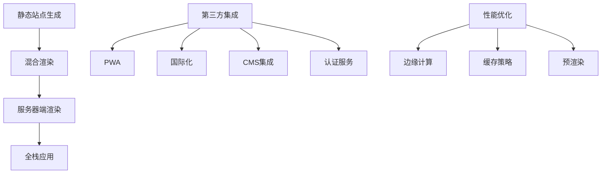

::: tip 学习目标
- 实现服务器端渲染 (SSR) 模式
- 集成第三方服务和 API
- 添加 PWA 功能和离线支持
- 实现国际化 (i18n) 和多语言支持
:::

## 知识点

### Astro 高级特性概览

Astro 提供了丰富的高级特性来满足复杂应用需求：

- **混合渲染**：静态生成与服务器渲染的结合
- **中间件系统**：请求处理和认证
- **API 端点**：全栈应用开发能力
- **集成生态**：丰富的第三方集成

### 架构演进图



## 服务器端渲染 (SSR)

### SSR 配置

```javascript
// astro.config.mjs
import { defineConfig } from 'astro/config';
import node from '@astrojs/node';
import vue from '@astrojs/vue';

export default defineConfig({
  // 混合渲染模式
  output: 'hybrid',

  // 或者完全 SSR 模式
  // output: 'server',

  adapter: node({
    mode: 'standalone'
  }),

  integrations: [vue()],

  // 预渲染配置
  experimental: {
    hybridOutput: true,
  },
});
```

### 混合渲染策略

```astro
---
// src/pages/products/[id].astro

// 静态预渲染特定产品
export const prerender = true;

export async function getStaticPaths() {
  // 只预渲染热门产品
  const popularProducts = await fetch('/api/products/popular')
    .then(res => res.json());

  return popularProducts.map(product => ({
    params: { id: product.id.toString() },
    props: { product }
  }));
}

// 对于非预渲染的产品，使用 SSR
const { id } = Astro.params;
let product = Astro.props.product;

if (!product) {
  // SSR 路径：动态获取产品数据
  try {
    const response = await fetch(`${import.meta.env.API_BASE_URL}/products/${id}`);
    if (response.ok) {
      product = await response.json();
    } else {
      return Astro.redirect('/404');
    }
  } catch (error) {
    console.error('获取产品失败:', error);
    return Astro.redirect('/404');
  }
}
---

<html>
<head>
  <title>{product.name} - 产品详情</title>
  <meta name="description" content={product.description} />

  <!-- SEO 优化 -->
  <meta property="og:title" content={product.name} />
  <meta property="og:description" content={product.description} />
  <meta property="og:image" content={product.image} />
  <meta property="og:type" content="product" />

  <!-- 结构化数据 -->
  <script type="application/ld+json" set:html={JSON.stringify({
    "@context": "https://schema.org/",
    "@type": "Product",
    "name": product.name,
    "description": product.description,
    "image": product.image,
    "offers": {
      "@type": "Offer",
      "price": product.price,
      "priceCurrency": "CNY"
    }
  })} />
</head>
<body>
  <main>
    <div class="product-detail">
      
      <div class="product-info">
        <h1>{product.name}</h1>
        <p class="price">¥{product.price}</p>
        <p class="description">{product.description}</p>

        <!-- 交互组件在客户端水合 -->
        <AddToCartButton client:load product={product} />
      </div>
    </div>
  </main>
</body>
</html>
```

### 中间件实现

```typescript
// src/middleware/index.ts
import { defineMiddleware } from 'astro:middleware';
import { verifyJWT } from '../lib/auth';

export const onRequest = defineMiddleware(async (context, next) => {
  const { request, locals, redirect } = context;

  // 认证中间件
  if (request.url.includes('/admin')) {
    const token = request.headers.get('authorization')?.replace('Bearer ', '');

    if (!token) {
      return redirect('/login');
    }

    try {
      const user = await verifyJWT(token);
      locals.user = user;
    } catch (error) {
      return redirect('/login');
    }
  }

  // 速率限制中间件
  if (request.url.includes('/api')) {
    const clientIP = request.headers.get('x-forwarded-for') || 'unknown';
    const isRateLimited = await checkRateLimit(clientIP);

    if (isRateLimited) {
      return new Response('Rate limit exceeded', { status: 429 });
    }
  }

  // 安全头中间件
  const response = await next();

  response.headers.set('X-Frame-Options', 'DENY');
  response.headers.set('X-Content-Type-Options', 'nosniff');
  response.headers.set('X-XSS-Protection', '1; mode=block');

  return response;
});

// 速率限制实现
const rateLimitStore = new Map<string, { count: number; resetTime: number }>();

async function checkRateLimit(clientIP: string): Promise<boolean> {
  const now = Date.now();
  const windowMs = 15 * 60 * 1000; // 15分钟
  const maxRequests = 100;

  const current = rateLimitStore.get(clientIP);

  if (!current || now > current.resetTime) {
    rateLimitStore.set(clientIP, {
      count: 1,
      resetTime: now + windowMs
    });
    return false;
  }

  if (current.count >= maxRequests) {
    return true;
  }

  current.count++;
  return false;
}
```

## API 端点开发

### RESTful API 实现

```typescript
// src/pages/api/posts/[id].ts
import type { APIRoute } from 'astro';
import { z } from 'zod';

// 请求验证模式
const UpdatePostSchema = z.object({
  title: z.string().min(1).max(200),
  content: z.string().min(1),
  tags: z.array(z.string()).optional(),
  published: z.boolean().optional(),
});

export const GET: APIRoute = async ({ params, request }) => {
  const { id } = params;

  try {
    const post = await getPostById(id);

    if (!post) {
      return new Response(
        JSON.stringify({ error: 'Post not found' }),
        { status: 404, headers: { 'Content-Type': 'application/json' } }
      );
    }

    return new Response(JSON.stringify(post), {
      status: 200,
      headers: { 'Content-Type': 'application/json' }
    });
  } catch (error) {
    return new Response(
      JSON.stringify({ error: 'Internal server error' }),
      { status: 500, headers: { 'Content-Type': 'application/json' } }
    );
  }
};

export const PUT: APIRoute = async ({ params, request, locals }) => {
  const { id } = params;

  // 检查认证
  if (!locals.user) {
    return new Response(
      JSON.stringify({ error: 'Unauthorized' }),
      { status: 401, headers: { 'Content-Type': 'application/json' } }
    );
  }

  try {
    const body = await request.json();
    const validatedData = UpdatePostSchema.parse(body);

    const updatedPost = await updatePost(id, validatedData, locals.user.id);

    return new Response(JSON.stringify(updatedPost), {
      status: 200,
      headers: { 'Content-Type': 'application/json' }
    });
  } catch (error) {
    if (error instanceof z.ZodError) {
      return new Response(
        JSON.stringify({ error: 'Validation error', details: error.errors }),
        { status: 400, headers: { 'Content-Type': 'application/json' } }
      );
    }

    return new Response(
      JSON.stringify({ error: 'Internal server error' }),
      { status: 500, headers: { 'Content-Type': 'application/json' } }
    );
  }
};

export const DELETE: APIRoute = async ({ params, locals }) => {
  const { id } = params;

  if (!locals.user) {
    return new Response(
      JSON.stringify({ error: 'Unauthorized' }),
      { status: 401, headers: { 'Content-Type': 'application/json' } }
    );
  }

  try {
    await deletePost(id, locals.user.id);

    return new Response(null, { status: 204 });
  } catch (error) {
    return new Response(
      JSON.stringify({ error: 'Internal server error' }),
      { status: 500, headers: { 'Content-Type': 'application/json' } }
    );
  }
};

// 数据库操作函数
async function getPostById(id: string) {
  // 实际的数据库查询逻辑
  return null;
}

async function updatePost(id: string, data: any, userId: string) {
  // 实际的更新逻辑
  return null;
}

async function deletePost(id: string, userId: string) {
  // 实际的删除逻辑
}
```

### GraphQL 集成

```typescript
// src/pages/api/graphql.ts
import type { APIRoute } from 'astro';
import { graphqlHTTP } from 'express-graphql';
import { buildSchema } from 'graphql';

// GraphQL Schema
const schema = buildSchema(`
  type Post {
    id: ID!
    title: String!
    content: String!
    author: User!
    createdAt: String!
    tags: [String!]!
  }

  type User {
    id: ID!
    name: String!
    email: String!
    posts: [Post!]!
  }

  type Query {
    posts: [Post!]!
    post(id: ID!): Post
    users: [User!]!
    user(id: ID!): User
  }

  type Mutation {
    createPost(title: String!, content: String!, tags: [String!]): Post!
    updatePost(id: ID!, title: String, content: String, tags: [String!]): Post!
    deletePost(id: ID!): Boolean!
  }
`);

// Resolvers
const rootValue = {
  posts: async () => {
    // 获取所有文章
    return await getAllPosts();
  },

  post: async ({ id }: { id: string }) => {
    return await getPostById(id);
  },

  createPost: async ({ title, content, tags }: { title: string; content: string; tags: string[] }) => {
    return await createPost({ title, content, tags });
  },

  updatePost: async ({ id, title, content, tags }: { id: string; title?: string; content?: string; tags?: string[] }) => {
    return await updatePost(id, { title, content, tags });
  },

  deletePost: async ({ id }: { id: string }) => {
    await deletePost(id);
    return true;
  },
};

const graphqlHandler = graphqlHTTP({
  schema,
  rootValue,
  graphiql: import.meta.env.DEV, // 开发环境启用 GraphiQL
});

export const ALL: APIRoute = async ({ request }) => {
  return new Promise((resolve) => {
    graphqlHandler(request, {
      json: (data) => {
        resolve(new Response(JSON.stringify(data), {
          headers: { 'Content-Type': 'application/json' }
        }));
      }
    } as any, () => {});
  });
};
```

## PWA 实现

### Service Worker 配置

```javascript
// public/sw.js
const CACHE_NAME = 'astro-pwa-v1';
const urlsToCache = [
  '/',
  '/offline',
  '/assets/css/main.css',
  '/assets/js/main.js',
  '/images/logo.png',
];

// 安装事件
self.addEventListener('install', (event) => {
  event.waitUntil(
    caches.open(CACHE_NAME)
      .then((cache) => {
        return cache.addAll(urlsToCache);
      })
  );
});

// 激活事件
self.addEventListener('activate', (event) => {
  event.waitUntil(
    caches.keys().then((cacheNames) => {
      return Promise.all(
        cacheNames.map((cacheName) => {
          if (cacheName !== CACHE_NAME) {
            return caches.delete(cacheName);
          }
        })
      );
    })
  );
});

// 请求拦截
self.addEventListener('fetch', (event) => {
  event.respondWith(
    caches.match(event.request)
      .then((response) => {
        // 缓存命中，返回缓存的资源
        if (response) {
          return response;
        }

        return fetch(event.request).then((response) => {
          // 检查响应是否有效
          if (!response || response.status !== 200 || response.type !== 'basic') {
            return response;
          }

          // 克隆响应
          const responseToCache = response.clone();

          caches.open(CACHE_NAME)
            .then((cache) => {
              cache.put(event.request, responseToCache);
            });

          return response;
        }).catch(() => {
          // 网络请求失败，返回离线页面
          if (event.request.destination === 'document') {
            return caches.match('/offline');
          }
        });
      })
  );
});

// 后台同步
self.addEventListener('sync', (event) => {
  if (event.tag === 'background-sync') {
    event.waitUntil(
      syncData()
    );
  }
});

async function syncData() {
  // 同步离线时保存的数据
  const offlineData = await getOfflineData();

  for (const data of offlineData) {
    try {
      await fetch('/api/sync', {
        method: 'POST',
        body: JSON.stringify(data),
        headers: { 'Content-Type': 'application/json' }
      });

      // 同步成功，删除本地数据
      await removeOfflineData(data.id);
    } catch (error) {
      console.error('同步失败:', error);
    }
  }
}
```

### PWA 清单文件

```json
// public/manifest.json
{
  "name": "Astro PWA 应用",
  "short_name": "AstroPWA",
  "description": "基于 Astro 构建的渐进式 Web 应用",
  "start_url": "/",
  "display": "standalone",
  "background_color": "#ffffff",
  "theme_color": "#000000",
  "orientation": "portrait-primary",
  "icons": [
    {
      "src": "/icons/icon-72x72.png",
      "sizes": "72x72",
      "type": "image/png"
    },
    {
      "src": "/icons/icon-96x96.png",
      "sizes": "96x96",
      "type": "image/png"
    },
    {
      "src": "/icons/icon-128x128.png",
      "sizes": "128x128",
      "type": "image/png"
    },
    {
      "src": "/icons/icon-144x144.png",
      "sizes": "144x144",
      "type": "image/png"
    },
    {
      "src": "/icons/icon-152x152.png",
      "sizes": "152x152",
      "type": "image/png"
    },
    {
      "src": "/icons/icon-192x192.png",
      "sizes": "192x192",
      "type": "image/png"
    },
    {
      "src": "/icons/icon-384x384.png",
      "sizes": "384x384",
      "type": "image/png"
    },
    {
      "src": "/icons/icon-512x512.png",
      "sizes": "512x512",
      "type": "image/png",
      "purpose": "maskable"
    }
  ],
  "categories": ["productivity", "utilities"],
  "screenshots": [
    {
      "src": "/screenshots/desktop.png",
      "sizes": "1280x720",
      "type": "image/png",
      "form_factor": "wide"
    },
    {
      "src": "/screenshots/mobile.png",
      "sizes": "360x640",
      "type": "image/png",
      "form_factor": "narrow"
    }
  ]
}
```

### PWA 组件集成

```astro
---
// src/components/PWAInstallPrompt.astro
---

<div id="pwa-install-prompt" class="pwa-prompt hidden">
  <div class="pwa-prompt-content">
    <h3>安装应用</h3>
    <p>安装此应用到您的设备，获得更好的体验！</p>
    <div class="pwa-prompt-actions">
      <button id="pwa-install-btn" class="btn-primary">安装</button>
      <button id="pwa-dismiss-btn" class="btn-secondary">取消</button>
    </div>
  </div>
</div>

<script>
class PWAInstaller {
  private deferredPrompt: any = null;
  private installPrompt: HTMLElement | null = null;

  constructor() {
    this.installPrompt = document.getElementById('pwa-install-prompt');
    this.init();
  }

  private init() {
    // 监听 beforeinstallprompt 事件
    window.addEventListener('beforeinstallprompt', (e) => {
      e.preventDefault();
      this.deferredPrompt = e;
      this.showInstallPrompt();
    });

    // 监听应用安装
    window.addEventListener('appinstalled', () => {
      console.log('PWA 已安装');
      this.hideInstallPrompt();
      this.deferredPrompt = null;
    });

    // 绑定按钮事件
    document.getElementById('pwa-install-btn')?.addEventListener('click', () => {
      this.installApp();
    });

    document.getElementById('pwa-dismiss-btn')?.addEventListener('click', () => {
      this.hideInstallPrompt();
    });

    // 注册 Service Worker
    this.registerServiceWorker();
  }

  private showInstallPrompt() {
    this.installPrompt?.classList.remove('hidden');
  }

  private hideInstallPrompt() {
    this.installPrompt?.classList.add('hidden');
  }

  private async installApp() {
    if (!this.deferredPrompt) return;

    this.deferredPrompt.prompt();
    const { outcome } = await this.deferredPrompt.userChoice;

    if (outcome === 'accepted') {
      console.log('用户接受了安装');
    } else {
      console.log('用户拒绝了安装');
    }

    this.deferredPrompt = null;
    this.hideInstallPrompt();
  }

  private async registerServiceWorker() {
    if ('serviceWorker' in navigator) {
      try {
        const registration = await navigator.serviceWorker.register('/sw.js');
        console.log('Service Worker 注册成功:', registration);

        // 监听更新
        registration.addEventListener('updatefound', () => {
          const newWorker = registration.installing;
          if (newWorker) {
            newWorker.addEventListener('statechange', () => {
              if (newWorker.state === 'installed' && navigator.serviceWorker.controller) {
                // 有新版本可用
                this.showUpdatePrompt();
              }
            });
          }
        });
      } catch (error) {
        console.error('Service Worker 注册失败:', error);
      }
    }
  }

  private showUpdatePrompt() {
    if (confirm('有新版本可用，是否刷新页面？')) {
      window.location.reload();
    }
  }
}

// 初始化 PWA 安装器
new PWAInstaller();
</script>

<style>
.pwa-prompt {
  @apply fixed bottom-4 left-4 right-4 bg-white shadow-lg rounded-lg p-4 z-50;
  @apply border border-gray-200;
}

.pwa-prompt.hidden {
  @apply hidden;
}

.pwa-prompt-content h3 {
  @apply text-lg font-semibold mb-2;
}

.pwa-prompt-content p {
  @apply text-gray-600 mb-4;
}

.pwa-prompt-actions {
  @apply flex space-x-2;
}

.btn-primary {
  @apply bg-blue-600 text-white px-4 py-2 rounded-md hover:bg-blue-700;
}

.btn-secondary {
  @apply bg-gray-200 text-gray-800 px-4 py-2 rounded-md hover:bg-gray-300;
}

@media (min-width: 768px) {
  .pwa-prompt {
    @apply max-w-sm right-4 left-auto;
  }
}
</style>
```

## 国际化 (i18n)

### 多语言配置

```typescript
// src/i18n/config.ts

export const languages = {
  'zh-CN': '简体中文',
  'en': 'English',
  'ja': '日本語',
  'ko': '한국어',
};

export const defaultLang = 'zh-CN';

export interface Translation {
  [key: string]: string | Translation;
}

export const translations: Record<string, Translation> = {
  'zh-CN': {
    nav: {
      home: '首页',
      about: '关于',
      blog: '博客',
      contact: '联系',
    },
    common: {
      loading: '加载中...',
      error: '出错了',
      retry: '重试',
      cancel: '取消',
      confirm: '确认',
    },
    blog: {
      title: '博客',
      readMore: '阅读更多',
      publishedAt: '发布于',
      tags: '标签',
    },
  },
  'en': {
    nav: {
      home: 'Home',
      about: 'About',
      blog: 'Blog',
      contact: 'Contact',
    },
    common: {
      loading: 'Loading...',
      error: 'Something went wrong',
      retry: 'Retry',
      cancel: 'Cancel',
      confirm: 'Confirm',
    },
    blog: {
      title: 'Blog',
      readMore: 'Read More',
      publishedAt: 'Published at',
      tags: 'Tags',
    },
  },
};

export function getLangFromUrl(url: URL): string {
  const [, lang] = url.pathname.split('/');
  if (lang in languages) return lang;
  return defaultLang;
}

export function useTranslations(lang: string) {
  return function t(key: string): string {
    const keys = key.split('.');
    let value: any = translations[lang] || translations[defaultLang];

    for (const k of keys) {
      value = value?.[k];
    }

    return value || key;
  };
}
```

### 多语言页面生成

```astro
---
// src/pages/[lang]/blog/[slug].astro

import { languages, getLangFromUrl, useTranslations } from '../../../i18n/config';
import { getCollection } from 'astro:content';

export async function getStaticPaths() {
  const posts = await getCollection('blog');

  return Object.keys(languages).flatMap(lang =>
    posts.map(post => ({
      params: {
        lang,
        slug: post.slug
      },
      props: {
        post,
        lang
      }
    }))
  );
}

const { post, lang } = Astro.props;
const t = useTranslations(lang);

// 获取本地化的文章内容
const localizedPost = post.data[lang] || post.data[defaultLang];
---

<html lang={lang}>
<head>
  <title>{localizedPost.title}</title>
  <meta name="description" content={localizedPost.description} />

  <!-- 语言替代链接 -->
  {Object.keys(languages).map(altLang => (
    <link
      rel="alternate"
      hreflang={altLang}
      href={`/${altLang}/blog/${post.slug}`}
    />
  ))}

  <!-- 默认语言 -->
  <link
    rel="alternate"
    hreflang="x-default"
    href={`/${defaultLang}/blog/${post.slug}`}
  />
</head>
<body>
  <nav>
    <LanguageSwitcher currentLang={lang} currentPath={Astro.url.pathname} />
  </nav>

  <main>
    <article class="blog-post">
      <header>
        <h1>{localizedPost.title}</h1>
        <p class="meta">
          {t('blog.publishedAt')} {localizedPost.publishDate.toLocaleDateString(lang)}
        </p>

        {localizedPost.tags && (
          <div class="tags">
            <span>{t('blog.tags')}:</span>
            {localizedPost.tags.map(tag => (
              <a href={`/${lang}/blog/tags/${tag}`} class="tag">#{tag}</a>
            ))}
          </div>
        )}
      </header>

      <div class="content" set:html={localizedPost.content} />
    </article>
  </main>
</body>
</html>
```

### 语言切换组件

```vue
<!-- src/components/LanguageSwitcher.vue -->
<template>
  <div class="language-switcher">
    <button
      @click="toggleDropdown"
      class="language-button"
      :aria-expanded="isOpen"
      aria-haspopup="true"
    >
      <GlobeIcon class="w-5 h-5" />
      <span>{{ languages[currentLang] }}</span>
      <ChevronDownIcon class="w-4 h-4" />
    </button>

    <div v-show="isOpen" class="language-dropdown">
      <a
        v-for="(name, code) in languages"
        :key="code"
        :href="getLocalizedPath(code)"
        :class="['language-option', { active: code === currentLang }]"
        @click="switchLanguage(code)"
      >
        <span class="language-name">{{ name }}</span>
        <span class="language-code">{{ code }}</span>
      </a>
    </div>
  </div>
</template>

<script setup lang="ts">
import { ref, onMounted, onUnmounted } from 'vue';
import { languages } from '../i18n/config';
import { GlobeIcon, ChevronDownIcon } from '@heroicons/vue/24/outline';

interface Props {
  currentLang: string;
  currentPath: string;
}

const props = defineProps<Props>();
const isOpen = ref(false);

function toggleDropdown() {
  isOpen.value = !isOpen.value;
}

function getLocalizedPath(langCode: string): string {
  // 移除当前语言前缀，添加新的语言前缀
  const pathWithoutLang = props.currentPath.replace(`/${props.currentLang}`, '');
  return `/${langCode}${pathWithoutLang}`;
}

function switchLanguage(langCode: string) {
  isOpen.value = false;
  // 保存用户语言偏好
  localStorage.setItem('preferred-language', langCode);
}

function handleClickOutside(event: MouseEvent) {
  const target = event.target as Element;
  if (!target.closest('.language-switcher')) {
    isOpen.value = false;
  }
}

onMounted(() => {
  document.addEventListener('click', handleClickOutside);
});

onUnmounted(() => {
  document.removeEventListener('click', handleClickOutside);
});
</script>

<style scoped>
.language-switcher {
  @apply relative;
}

.language-button {
  @apply flex items-center space-x-2 px-3 py-2 rounded-md;
  @apply bg-gray-100 hover:bg-gray-200 transition-colors;
}

.language-dropdown {
  @apply absolute top-full left-0 mt-1 bg-white shadow-lg rounded-md py-1 z-50;
  @apply border border-gray-200 min-w-40;
}

.language-option {
  @apply flex items-center justify-between px-4 py-2 text-sm;
  @apply hover:bg-gray-100 transition-colors;
}

.language-option.active {
  @apply bg-blue-50 text-blue-600;
}

.language-name {
  @apply font-medium;
}

.language-code {
  @apply text-xs text-gray-500 uppercase;
}
</style>
```

::: note 关键要点
1. **混合渲染**：合理使用静态生成和服务器渲染
2. **中间件系统**：实现认证、安全、速率限制等功能
3. **PWA 功能**：提供原生应用般的用户体验
4. **国际化支持**：完整的多语言解决方案
5. **API 集成**：RESTful 和 GraphQL API 的最佳实践
:::

::: warning 注意事项
- SSR 模式会增加服务器负载，需要合理使用
- PWA 功能需要 HTTPS 环境才能正常工作
- 国际化要考虑 SEO 和搜索引擎索引
- 中间件的执行顺序很重要，需要仔细设计
:::