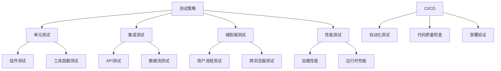

::: tip 学习目标
- 建立单元测试和集成测试框架
- 实现端到端测试和性能测试
- 配置 CI/CD 流水线
- 建立代码质量和监控体系
:::

## 知识点

### 测试策略金字塔

Astro 应用的测试策略遵循测试金字塔原则：

- **单元测试**：组件和工具函数的独立测试
- **集成测试**：API 端点和数据流测试
- **端到端测试**：完整用户流程测试
- **性能测试**：加载速度和用户体验测试

### 测试架构图



## 单元测试

### Vitest 配置

```typescript
// vitest.config.ts
import { defineConfig } from 'vitest/config';
import { getViteConfig } from 'astro/config';

export default defineConfig(
  getViteConfig({
    test: {
      globals: true,
      environment: 'jsdom',
      setupFiles: ['./src/test/setup.ts'],
      coverage: {
        reporter: ['text', 'json', 'html'],
        exclude: [
          'node_modules/',
          'src/test/',
          '**/*.d.ts',
          '**/*.config.*',
          'dist/',
        ],
      },
    },
  })
);
```

```typescript
// src/test/setup.ts
import { vi } from 'vitest';
import '@testing-library/jest-dom';

// 模拟浏览器 API
Object.defineProperty(window, 'matchMedia', {
  writable: true,
  value: vi.fn().mockImplementation(query => ({
    matches: false,
    media: query,
    onchange: null,
    addListener: vi.fn(), // Deprecated
    removeListener: vi.fn(), // Deprecated
    addEventListener: vi.fn(),
    removeEventListener: vi.fn(),
    dispatchEvent: vi.fn(),
  })),
});

// 模拟 IntersectionObserver
global.IntersectionObserver = vi.fn().mockImplementation(() => ({
  observe: vi.fn(),
  unobserve: vi.fn(),
  disconnect: vi.fn(),
}));

// 模拟 ResizeObserver
global.ResizeObserver = vi.fn().mockImplementation(() => ({
  observe: vi.fn(),
  unobserve: vi.fn(),
  disconnect: vi.fn(),
}));
```

### 组件测试

```typescript
// src/components/__tests__/BlogCard.test.ts
import { describe, it, expect } from 'vitest';
import { render, screen } from '@testing-library/vue';
import BlogCard from '../BlogCard.vue';

const mockPost = {
  id: 1,
  title: '测试文章标题',
  excerpt: '这是一篇测试文章的摘要',
  publishDate: '2024-01-15',
  author: '测试作者',
  tags: ['Vue', 'Astro', '测试'],
  slug: 'test-post',
};

describe('BlogCard', () => {
  it('应该正确渲染文章信息', () => {
    render(BlogCard, {
      props: { post: mockPost }
    });

    expect(screen.getByText(mockPost.title)).toBeInTheDocument();
    expect(screen.getByText(mockPost.excerpt)).toBeInTheDocument();
    expect(screen.getByText(mockPost.author)).toBeInTheDocument();
  });

  it('应该渲染正确的链接', () => {
    render(BlogCard, {
      props: { post: mockPost }
    });

    const titleLink = screen.getByRole('link', { name: mockPost.title });
    expect(titleLink).toHaveAttribute('href', `/blog/${mockPost.slug}`);
  });

  it('应该显示所有标签', () => {
    render(BlogCard, {
      props: { post: mockPost }
    });

    mockPost.tags.forEach(tag => {
      expect(screen.getByText(`#${tag}`)).toBeInTheDocument();
    });
  });

  it('应该格式化日期显示', () => {
    render(BlogCard, {
      props: { post: mockPost }
    });

    const formattedDate = new Date(mockPost.publishDate).toLocaleDateString('zh-CN');
    expect(screen.getByText(formattedDate)).toBeInTheDocument();
  });

  it('应该处理缺少可选字段的情况', () => {
    const postWithoutOptionalFields = {
      ...mockPost,
      tags: [],
    };

    render(BlogCard, {
      props: { post: postWithoutOptionalFields }
    });

    expect(screen.getByText(mockPost.title)).toBeInTheDocument();
    // 确保没有标签时不会崩溃
    expect(screen.queryByText('#')).not.toBeInTheDocument();
  });
});
```

### 工具函数测试

```typescript
// src/utils/__tests__/formatters.test.ts
import { describe, it, expect } from 'vitest';
import {
  formatPrice,
  formatDate,
  slugify,
  truncateText,
  validateEmail,
} from '../formatters';

describe('formatters', () => {
  describe('formatPrice', () => {
    it('应该正确格式化价格', () => {
      expect(formatPrice(1234.56)).toBe('¥1,234.56');
      expect(formatPrice(0)).toBe('¥0.00');
      expect(formatPrice(999.9)).toBe('¥999.90');
    });

    it('应该处理负数', () => {
      expect(formatPrice(-100)).toBe('-¥100.00');
    });

    it('应该支持自定义货币符号', () => {
      expect(formatPrice(100, '$')).toBe('$100.00');
    });
  });

  describe('formatDate', () => {
    it('应该格式化日期字符串', () => {
      const date = '2024-01-15';
      expect(formatDate(date, 'zh-CN')).toBe('2024/1/15');
    });

    it('应该格式化 Date 对象', () => {
      const date = new Date('2024-01-15');
      expect(formatDate(date, 'zh-CN')).toBe('2024/1/15');
    });

    it('应该支持不同的语言环境', () => {
      const date = '2024-01-15';
      expect(formatDate(date, 'en-US')).toBe('1/15/2024');
    });
  });

  describe('slugify', () => {
    it('应该将文本转换为 URL 友好的 slug', () => {
      expect(slugify('Hello World')).toBe('hello-world');
      expect(slugify('Vue.js 开发指南')).toBe('vue-js-开发指南');
    });

    it('应该移除特殊字符', () => {
      expect(slugify('Hello, World!')).toBe('hello-world');
      expect(slugify('Test@#$%^&*()')).toBe('test');
    });

    it('应该处理连续的空格和分隔符', () => {
      expect(slugify('  hello   world  ')).toBe('hello-world');
      expect(slugify('hello---world')).toBe('hello-world');
    });
  });

  describe('truncateText', () => {
    it('应该截断长文本', () => {
      const longText = 'This is a very long text that should be truncated';
      expect(truncateText(longText, 20)).toBe('This is a very long...');
    });

    it('应该保持短文本不变', () => {
      const shortText = 'Short text';
      expect(truncateText(shortText, 20)).toBe('Short text');
    });

    it('应该自定义省略符号', () => {
      const text = 'This is a long text';
      expect(truncateText(text, 10, ' →')).toBe('This is a →');
    });
  });

  describe('validateEmail', () => {
    it('应该验证有效的邮箱地址', () => {
      expect(validateEmail('test@example.com')).toBe(true);
      expect(validateEmail('user.name+tag@domain.co.uk')).toBe(true);
    });

    it('应该拒绝无效的邮箱地址', () => {
      expect(validateEmail('invalid-email')).toBe(false);
      expect(validateEmail('@domain.com')).toBe(false);
      expect(validateEmail('user@')).toBe(false);
      expect(validateEmail('')).toBe(false);
    });
  });
});
```

### Store 测试

```typescript
// src/stores/__tests__/cart.test.ts
import { describe, it, expect, beforeEach } from 'vitest';
import { setActivePinia, createPinia } from 'pinia';
import { useCartStore } from '../cart';

const mockProduct = {
  id: 1,
  name: '测试产品',
  price: 99.99,
  image: '/test-image.jpg',
};

describe('Cart Store', () => {
  beforeEach(() => {
    setActivePinia(createPinia());
  });

  it('应该初始化为空购物车', () => {
    const cart = useCartStore();

    expect(cart.items).toEqual([]);
    expect(cart.totalItems).toBe(0);
    expect(cart.totalPrice).toBe(0);
    expect(cart.isEmpty).toBe(true);
  });

  it('应该正确添加商品', () => {
    const cart = useCartStore();

    cart.addItem(mockProduct);

    expect(cart.items).toHaveLength(1);
    expect(cart.items[0]).toEqual({ ...mockProduct, quantity: 1 });
    expect(cart.totalItems).toBe(1);
    expect(cart.totalPrice).toBe(99.99);
  });

  it('应该增加现有商品的数量', () => {
    const cart = useCartStore();

    cart.addItem(mockProduct);
    cart.addItem(mockProduct);

    expect(cart.items).toHaveLength(1);
    expect(cart.items[0].quantity).toBe(2);
    expect(cart.totalItems).toBe(2);
    expect(cart.totalPrice).toBe(199.98);
  });

  it('应该正确移除商品', () => {
    const cart = useCartStore();

    cart.addItem(mockProduct);
    cart.removeItem(mockProduct.id);

    expect(cart.items).toHaveLength(0);
    expect(cart.isEmpty).toBe(true);
  });

  it('应该更新商品数量', () => {
    const cart = useCartStore();

    cart.addItem(mockProduct);
    cart.updateQuantity(mockProduct.id, 3);

    expect(cart.items[0].quantity).toBe(3);
    expect(cart.totalItems).toBe(3);
  });

  it('应该在数量为 0 时移除商品', () => {
    const cart = useCartStore();

    cart.addItem(mockProduct);
    cart.updateQuantity(mockProduct.id, 0);

    expect(cart.items).toHaveLength(0);
  });

  it('应该清空购物车', () => {
    const cart = useCartStore();

    cart.addItem(mockProduct);
    cart.clearCart();

    expect(cart.items).toHaveLength(0);
    expect(cart.isOpen).toBe(false);
  });

  it('应该正确格式化总价', () => {
    const cart = useCartStore();

    cart.addItem(mockProduct);
    cart.updateQuantity(mockProduct.id, 2);

    expect(cart.formattedTotal).toBe('¥199.98');
  });
});
```

## 集成测试

### API 端点测试

```typescript
// src/pages/api/__tests__/posts.test.ts
import { describe, it, expect, beforeEach, afterEach } from 'vitest';
import { GET, POST } from '../posts.ts';

// 模拟数据库
const mockPosts = [
  {
    id: 1,
    title: '测试文章 1',
    content: '测试内容 1',
    author: 'test-user',
    createdAt: '2024-01-15T00:00:00Z',
  },
  {
    id: 2,
    title: '测试文章 2',
    content: '测试内容 2',
    author: 'test-user',
    createdAt: '2024-01-16T00:00:00Z',
  },
];

// 模拟数据库操作
vi.mock('../../../lib/database', () => ({
  getAllPosts: vi.fn().mockResolvedValue(mockPosts),
  createPost: vi.fn().mockImplementation((data) => ({
    id: 3,
    ...data,
    createdAt: new Date().toISOString(),
  })),
}));

describe('Posts API', () => {
  describe('GET /api/posts', () => {
    it('应该返回所有文章', async () => {
      const request = new Request('http://localhost:3000/api/posts');
      const response = await GET({ request, params: {}, locals: {} });

      expect(response.status).toBe(200);

      const data = await response.json();
      expect(data).toEqual(mockPosts);
    });

    it('应该支持分页参数', async () => {
      const request = new Request('http://localhost:3000/api/posts?page=1&limit=1');
      const response = await GET({ request, params: {}, locals: {} });

      expect(response.status).toBe(200);
      // 验证分页逻辑
    });
  });

  describe('POST /api/posts', () => {
    it('应该创建新文章', async () => {
      const postData = {
        title: '新文章',
        content: '新文章内容',
      };

      const request = new Request('http://localhost:3000/api/posts', {
        method: 'POST',
        headers: { 'Content-Type': 'application/json' },
        body: JSON.stringify(postData),
      });

      const response = await POST({
        request,
        params: {},
        locals: { user: { id: 'test-user' } },
      });

      expect(response.status).toBe(201);

      const data = await response.json();
      expect(data.title).toBe(postData.title);
      expect(data.content).toBe(postData.content);
    });

    it('应该验证请求数据', async () => {
      const invalidData = {
        title: '', // 空标题应该被拒绝
      };

      const request = new Request('http://localhost:3000/api/posts', {
        method: 'POST',
        headers: { 'Content-Type': 'application/json' },
        body: JSON.stringify(invalidData),
      });

      const response = await POST({
        request,
        params: {},
        locals: { user: { id: 'test-user' } },
      });

      expect(response.status).toBe(400);
    });

    it('应该要求用户认证', async () => {
      const postData = {
        title: '新文章',
        content: '新文章内容',
      };

      const request = new Request('http://localhost:3000/api/posts', {
        method: 'POST',
        headers: { 'Content-Type': 'application/json' },
        body: JSON.stringify(postData),
      });

      const response = await POST({
        request,
        params: {},
        locals: {}, // 没有用户信息
      });

      expect(response.status).toBe(401);
    });
  });
});
```

## 端到端测试

### Playwright 配置

```typescript
// playwright.config.ts
import { defineConfig, devices } from '@playwright/test';

export default defineConfig({
  testDir: './e2e',
  fullyParallel: true,
  forbidOnly: !!process.env.CI,
  retries: process.env.CI ? 2 : 0,
  workers: process.env.CI ? 1 : undefined,
  reporter: 'html',

  use: {
    baseURL: 'http://localhost:3000',
    trace: 'on-first-retry',
    screenshot: 'only-on-failure',
  },

  projects: [
    {
      name: 'chromium',
      use: { ...devices['Desktop Chrome'] },
    },
    {
      name: 'firefox',
      use: { ...devices['Desktop Firefox'] },
    },
    {
      name: 'webkit',
      use: { ...devices['Desktop Safari'] },
    },
    {
      name: 'Mobile Chrome',
      use: { ...devices['Pixel 5'] },
    },
  ],

  webServer: {
    command: 'npm run dev',
    url: 'http://localhost:3000',
    reuseExistingServer: !process.env.CI,
  },
});
```

### 用户流程测试

```typescript
// e2e/blog.spec.ts
import { test, expect } from '@playwright/test';

test.describe('博客功能', () => {
  test('应该能浏览文章列表', async ({ page }) => {
    await page.goto('/blog');

    // 检查页面标题
    await expect(page).toHaveTitle(/博客/);

    // 检查文章列表
    const articleCards = page.locator('.blog-card');
    await expect(articleCards).toHaveCount(6); // 假设每页显示 6 篇文章

    // 检查每个文章卡片的基本元素
    const firstCard = articleCards.first();
    await expect(firstCard.locator('h2')).toBeVisible();
    await expect(firstCard.locator('.excerpt')).toBeVisible();
    await expect(firstCard.locator('time')).toBeVisible();
  });

  test('应该能点击文章进入详情页', async ({ page }) => {
    await page.goto('/blog');

    const firstArticleLink = page.locator('.blog-card h2 a').first();
    const articleTitle = await firstArticleLink.textContent();

    await firstArticleLink.click();

    // 检查是否跳转到正确的文章页面
    await expect(page.locator('h1')).toHaveText(articleTitle!);
    await expect(page.locator('.post-content')).toBeVisible();
  });

  test('应该能使用搜索功能', async ({ page }) => {
    await page.goto('/blog');

    const searchInput = page.locator('input[type="search"]');
    await searchInput.fill('Vue');
    await searchInput.press('Enter');

    // 检查搜索结果
    await expect(page.locator('.search-results')).toBeVisible();
    await expect(page.locator('.blog-card')).toHaveCount(3); // 假设有 3 篇相关文章
  });

  test('应该能按标签筛选文章', async ({ page }) => {
    await page.goto('/blog');

    const tagFilter = page.locator('.tag-filter').first();
    const tagName = await tagFilter.textContent();

    await tagFilter.click();

    // 检查筛选结果
    await expect(page.url()).toContain(`/blog/tags/${tagName?.replace('#', '')}`);
    await expect(page.locator('.blog-card')).toHaveCountGreaterThan(0);
  });

  test('应该支持分页导航', async ({ page }) => {
    await page.goto('/blog');

    // 点击下一页
    const nextButton = page.locator('.pagination a[aria-label="下一页"]');
    if (await nextButton.isVisible()) {
      await nextButton.click();

      // 检查 URL 变化
      await expect(page.url()).toContain('/blog/page/2');

      // 检查页面内容更新
      await expect(page.locator('.blog-card')).toHaveCountGreaterThan(0);
    }
  });
});
```

### 购物车功能测试

```typescript
// e2e/shopping-cart.spec.ts
import { test, expect } from '@playwright/test';

test.describe('购物车功能', () => {
  test('应该能添加商品到购物车', async ({ page }) => {
    await page.goto('/products/1');

    // 检查商品页面
    await expect(page.locator('h1')).toBeVisible();
    await expect(page.locator('.price')).toBeVisible();

    // 添加到购物车
    const addToCartButton = page.locator('button[data-testid="add-to-cart"]');
    await addToCartButton.click();

    // 检查购物车图标更新
    const cartBadge = page.locator('.cart-badge');
    await expect(cartBadge).toHaveText('1');

    // 检查成功消息
    await expect(page.locator('.notification')).toContainText('已添加到购物车');
  });

  test('应该能在购物车中管理商品', async ({ page }) => {
    // 先添加商品
    await page.goto('/products/1');
    await page.locator('button[data-testid="add-to-cart"]').click();

    // 打开购物车
    await page.locator('.cart-button').click();

    // 检查购物车内容
    await expect(page.locator('.cart-sidebar')).toBeVisible();
    await expect(page.locator('.cart-item')).toHaveCount(1);

    // 增加数量
    await page.locator('.quantity-btn[aria-label="增加"]').click();
    await expect(page.locator('.quantity')).toHaveText('2');

    // 检查总价更新
    await expect(page.locator('.total-price')).toContainText('¥199.98');

    // 移除商品
    await page.locator('.remove-button').click();
    await expect(page.locator('.empty-cart')).toBeVisible();
  });

  test('应该能完成结算流程', async ({ page }) => {
    // 添加商品并进入结算
    await page.goto('/products/1');
    await page.locator('button[data-testid="add-to-cart"]').click();
    await page.locator('.cart-button').click();
    await page.locator('button:has-text("去结算")').click();

    // 检查结算页面
    await expect(page).toHaveURL('/checkout');
    await expect(page.locator('.checkout-form')).toBeVisible();

    // 填写配送信息
    await page.fill('input[name="name"]', '张三');
    await page.fill('input[name="phone"]', '13800138000');
    await page.fill('textarea[name="address"]', '北京市朝阳区测试地址123号');

    // 选择支付方式
    await page.click('input[value="alipay"]');

    // 提交订单
    await page.click('button[type="submit"]');

    // 检查成功页面
    await expect(page).toHaveURL(/\/order\/success/);
    await expect(page.locator('.success-message')).toBeVisible();
  });
});
```

## 性能测试

### Lighthouse CI 配置

```json
// .lighthouserc.json
{
  "ci": {
    "collect": {
      "url": [
        "http://localhost:3000/",
        "http://localhost:3000/blog",
        "http://localhost:3000/products"
      ],
      "startServerCommand": "npm run preview",
      "numberOfRuns": 3
    },
    "assert": {
      "assertions": {
        "categories:performance": ["warn", {"minScore": 0.9}],
        "categories:accessibility": ["error", {"minScore": 0.9}],
        "categories:best-practices": ["warn", {"minScore": 0.9}],
        "categories:seo": ["error", {"minScore": 0.9}]
      }
    },
    "upload": {
      "target": "temporary-public-storage"
    }
  }
}
```

### 性能基准测试

```typescript
// src/test/performance.test.ts
import { describe, it, expect } from 'vitest';
import { performance } from 'perf_hooks';

describe('性能基准测试', () => {
  it('slugify 函数应该在合理时间内执行', () => {
    const longText = 'A'.repeat(1000);
    const iterations = 1000;

    const start = performance.now();

    for (let i = 0; i < iterations; i++) {
      slugify(longText);
    }

    const end = performance.now();
    const duration = end - start;

    // 1000 次调用应该在 100ms 内完成
    expect(duration).toBeLessThan(100);
  });

  it('大数据集排序应该保持良好性能', () => {
    const largeDataset = Array.from({ length: 10000 }, (_, i) => ({
      id: i,
      name: `Item ${i}`,
      score: Math.random(),
    }));

    const start = performance.now();

    const sorted = largeDataset.sort((a, b) => b.score - a.score);

    const end = performance.now();
    const duration = end - start;

    expect(duration).toBeLessThan(50); // 50ms 内完成排序
    expect(sorted[0].score).toBeGreaterThanOrEqual(sorted[1].score);
  });
});
```

## CI/CD 配置

### GitHub Actions 工作流

```yaml
# .github/workflows/test.yml
name: Test and Quality Assurance

on:
  push:
    branches: [main, develop]
  pull_request:
    branches: [main]

jobs:
  test:
    runs-on: ubuntu-latest

    strategy:
      matrix:
        node-version: [18.x, 20.x]

    steps:
      - uses: actions/checkout@v3

      - name: Use Node.js ${{ matrix.node-version }}
        uses: actions/setup-node@v3
        with:
          node-version: ${{ matrix.node-version }}
          cache: 'npm'

      - name: Install dependencies
        run: npm ci

      - name: Run linting
        run: npm run lint

      - name: Run type checking
        run: npm run typecheck

      - name: Run unit tests
        run: npm run test:unit

      - name: Run coverage
        run: npm run test:coverage

      - name: Upload coverage to Codecov
        uses: codecov/codecov-action@v3
        with:
          file: ./coverage/lcov.info

  e2e-tests:
    runs-on: ubuntu-latest

    steps:
      - uses: actions/checkout@v3

      - uses: actions/setup-node@v3
        with:
          node-version: '18.x'
          cache: 'npm'

      - name: Install dependencies
        run: npm ci

      - name: Install Playwright browsers
        run: npx playwright install --with-deps

      - name: Build application
        run: npm run build

      - name: Run Playwright tests
        run: npm run test:e2e

      - name: Upload test results
        uses: actions/upload-artifact@v3
        if: failure()
        with:
          name: playwright-report
          path: playwright-report/

  lighthouse:
    runs-on: ubuntu-latest

    steps:
      - uses: actions/checkout@v3

      - uses: actions/setup-node@v3
        with:
          node-version: '18.x'
          cache: 'npm'

      - name: Install dependencies
        run: npm ci

      - name: Build application
        run: npm run build

      - name: Run Lighthouse CI
        run: |
          npm install -g @lhci/cli@0.12.x
          lhci autorun

  security:
    runs-on: ubuntu-latest

    steps:
      - uses: actions/checkout@v3

      - name: Run security audit
        run: npm audit --audit-level=high

      - name: Run dependency check
        uses: dependency-check/Dependency-Check_Action@main
        with:
          project: 'astro-app'
          path: '.'
          format: 'ALL'

      - name: Upload security results
        uses: actions/upload-artifact@v3
        with:
          name: dependency-check-report
          path: reports/
```

### 代码质量配置

```json
// package.json scripts
{
  "scripts": {
    "dev": "astro dev",
    "build": "astro build",
    "preview": "astro preview",
    "test": "vitest",
    "test:unit": "vitest run",
    "test:coverage": "vitest run --coverage",
    "test:e2e": "playwright test",
    "test:e2e:ui": "playwright test --ui",
    "lint": "eslint . --ext .js,.ts,.vue,.astro",
    "lint:fix": "eslint . --ext .js,.ts,.vue,.astro --fix",
    "typecheck": "astro check && tsc --noEmit",
    "format": "prettier --write .",
    "format:check": "prettier --check .",
    "lighthouse": "lhci autorun"
  }
}
```

```javascript
// .eslintrc.js
module.exports = {
  extends: [
    'eslint:recommended',
    '@typescript-eslint/recommended',
    'plugin:astro/recommended',
    'plugin:vue/vue3-recommended',
  ],
  parserOptions: {
    ecmaVersion: 'latest',
    sourceType: 'module',
  },
  rules: {
    // 自定义规则
    'no-console': 'warn',
    'no-debugger': 'error',
    '@typescript-eslint/no-unused-vars': 'error',
    'vue/no-unused-vars': 'error',
  },
  overrides: [
    {
      files: ['*.astro'],
      parser: 'astro-eslint-parser',
      parserOptions: {
        parser: '@typescript-eslint/parser',
        extraFileExtensions: ['.astro'],
      },
    },
  ],
};
```

::: note 关键要点
1. **分层测试**：单元测试、集成测试、端到端测试各司其职
2. **自动化流程**：CI/CD 确保代码质量和部署安全
3. **性能监控**：持续监控应用性能指标
4. **代码质量**：Lint、格式化、类型检查保证代码标准
5. **安全检查**：依赖审计和安全扫描防范潜在风险
:::

::: warning 注意事项
- 测试覆盖率要平衡完整性和维护成本
- E2E 测试执行时间较长，需要合理设计测试用例
- 性能测试要在稳定环境中进行
- CI/CD 流水线要考虑执行效率和资源消耗
:::