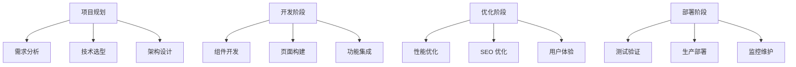

::: tip 学习目标
- 开发完整的博客或内容管理系统
- 构建电商展示网站或企业官网
- 实现复杂的交互功能和动画效果
- 优化 SEO 和用户体验指标
:::

## 知识点

### 实战项目类型

通过三个完整的实战项目来巩固 Astro 知识：

- **个人博客系统**：内容管理、SEO 优化、性能提升
- **电商展示站**：产品展示、购物车、支付集成
- **企业官网**：品牌展示、联系表单、多语言支持

### 项目架构设计



## 项目一：个人博客系统

### 项目架构设计

```
src/
├── components/
│   ├── blog/
│   │   ├── BlogCard.vue
│   │   ├── BlogList.astro
│   │   ├── CategoryFilter.vue
│   │   └── TagCloud.vue
│   ├── common/
│   │   ├── Header.astro
│   │   ├── Footer.astro
│   │   ├── SEO.astro
│   │   └── ThemeToggle.vue
│   └── ui/
│       ├── Button.vue
│       ├── Input.vue
│       └── Modal.vue
├── content/
│   ├── blog/
│   ├── config.ts
│   └── authors/
├── layouts/
│   ├── BaseLayout.astro
│   ├── BlogLayout.astro
│   └── PostLayout.astro
├── pages/
│   ├── blog/
│   │   ├── index.astro
│   │   ├── [slug].astro
│   │   ├── category/
│   │   └── tags/
│   ├── about.astro
│   ├── contact.astro
│   └── rss.xml.ts
├── stores/
│   ├── theme.ts
│   └── search.ts
└── utils/
    ├── seo.ts
    ├── reading-time.ts
    └── related-posts.ts
```

### 内容集合配置

```typescript
// src/content/config.ts
import { defineCollection, z } from 'astro:content';

const blogCollection = defineCollection({
  type: 'content',
  schema: ({ image }) => z.object({
    title: z.string(),
    description: z.string(),
    publishDate: z.date(),
    updateDate: z.date().optional(),
    author: z.string().default('默认作者'),
    tags: z.array(z.string()),
    category: z.string(),
    featured: z.boolean().default(false),
    draft: z.boolean().default(false),
    heroImage: image().optional(),
    heroAlt: z.string().optional(),
    // SEO 相关
    ogImage: image().optional(),
    ogDescription: z.string().optional(),
    // 阅读时间（自动计算）
    readingTime: z.number().optional(),
    // 相关文章（自动生成）
    relatedPosts: z.array(z.string()).optional(),
  }),
});

const authorsCollection = defineCollection({
  type: 'data',
  schema: ({ image }) => z.object({
    name: z.string(),
    bio: z.string(),
    avatar: image(),
    social: z.object({
      website: z.string().url().optional(),
      twitter: z.string().optional(),
      github: z.string().optional(),
      linkedin: z.string().optional(),
    }).optional(),
  }),
});

export const collections = {
  'blog': blogCollection,
  'authors': authorsCollection,
};
```

### 博客首页实现

```astro
---
// src/pages/blog/index.astro
import { getCollection } from 'astro:content';
import BaseLayout from '../../layouts/BaseLayout.astro';
import BlogCard from '../../components/blog/BlogCard.vue';
import CategoryFilter from '../../components/blog/CategoryFilter.vue';
import FeaturedPosts from '../../components/blog/FeaturedPosts.astro';
import { calculateReadingTime } from '../../utils/reading-time';

// 获取所有已发布的文章
const allPosts = await getCollection('blog', ({ data }) => {
  return !data.draft && data.publishDate <= new Date();
});

// 计算阅读时间
const postsWithReadingTime = await Promise.all(
  allPosts.map(async (post) => {
    const { remarkPluginFrontmatter } = await post.render();
    return {
      ...post,
      data: {
        ...post.data,
        readingTime: remarkPluginFrontmatter.readingTime,
      },
    };
  })
);

// 按发布日期排序
const sortedPosts = postsWithReadingTime.sort(
  (a, b) => b.data.publishDate.valueOf() - a.data.publishDate.valueOf()
);

// 获取特色文章
const featuredPosts = sortedPosts.filter(post => post.data.featured).slice(0, 3);

// 获取最新文章（排除特色文章）
const latestPosts = sortedPosts.filter(post => !post.data.featured).slice(0, 9);

// 获取所有分类
const categories = [...new Set(sortedPosts.map(post => post.data.category))];

// 获取热门标签
const allTags = sortedPosts.flatMap(post => post.data.tags);
const tagCounts = allTags.reduce((acc, tag) => {
  acc[tag] = (acc[tag] || 0) + 1;
  return acc;
}, {} as Record<string, number>);

const popularTags = Object.entries(tagCounts)
  .sort(([,a], [,b]) => b - a)
  .slice(0, 10)
  .map(([tag]) => tag);
---

<BaseLayout
  title="博客 - 技术分享与思考"
  description="分享前端开发、Astro 框架、Vue.js 等技术文章和个人思考"
  ogImage="/images/blog-og.jpg"
>
  <main class="container mx-auto px-4 py-8">
    <!-- 特色文章区域 -->
    {featuredPosts.length > 0 && (
      <section class="mb-16">
        <h2 class="text-3xl font-bold mb-8 text-center">特色文章</h2>
        <FeaturedPosts posts={featuredPosts} />
      </section>
    )}

    <div class="grid lg:grid-cols-4 gap-8">
      <!-- 主要内容区域 -->
      <div class="lg:col-span-3">
        <!-- 分类筛选 -->
        <div class="mb-8">
          <CategoryFilter
            client:load
            categories={categories}
            currentCategory=""
          />
        </div>

        <!-- 文章列表 -->
        <div class="space-y-8">
          <h2 class="text-2xl font-bold">最新文章</h2>
          <div class="grid md:grid-cols-2 xl:grid-cols-3 gap-6">
            {latestPosts.map((post) => (
              <BlogCard
                client:visible
                post={{
                  title: post.data.title,
                  description: post.data.description,
                  publishDate: post.data.publishDate.toISOString(),
                  author: post.data.author,
                  category: post.data.category,
                  tags: post.data.tags,
                  slug: post.slug,
                  readingTime: post.data.readingTime,
                  heroImage: post.data.heroImage?.src,
                }}
              />
            ))}
          </div>
        </div>

        <!-- 分页 -->
        <div class="mt-12 flex justify-center">
          <a
            href="/blog/page/2"
            class="bg-blue-600 text-white px-6 py-3 rounded-lg hover:bg-blue-700 transition-colors"
          >
            查看更多文章
          </a>
        </div>
      </div>

      <!-- 侧边栏 -->
      <div class="lg:col-span-1">
        <div class="sticky top-8 space-y-8">
          <!-- 搜索框 -->
          <div class="bg-white dark:bg-gray-800 rounded-lg p-6 shadow-md">
            <h3 class="font-semibold mb-4">搜索文章</h3>
            <BlogSearch client:load />
          </div>

          <!-- 热门标签 -->
          <div class="bg-white dark:bg-gray-800 rounded-lg p-6 shadow-md">
            <h3 class="font-semibold mb-4">热门标签</h3>
            <div class="flex flex-wrap gap-2">
              {popularTags.map((tag) => (
                <a
                  href={`/blog/tags/${tag}`}
                  class="bg-gray-100 dark:bg-gray-700 text-sm px-3 py-1 rounded-full hover:bg-blue-100 dark:hover:bg-blue-900 transition-colors"
                >
                  #{tag}
                </a>
              ))}
            </div>
          </div>

          <!-- 最近更新 -->
          <div class="bg-white dark:bg-gray-800 rounded-lg p-6 shadow-md">
            <h3 class="font-semibold mb-4">最近更新</h3>
            <div class="space-y-3">
              {sortedPosts.slice(0, 5).map((post) => (
                <a
                  href={`/blog/${post.slug}`}
                  class="block hover:text-blue-600 transition-colors"
                >
                  <div class="text-sm font-medium line-clamp-2">
                    {post.data.title}
                  </div>
                  <div class="text-xs text-gray-500 mt-1">
                    {post.data.publishDate.toLocaleDateString('zh-CN')}
                  </div>
                </a>
              ))}
            </div>
          </div>
        </div>
      </div>
    </div>
  </main>
</BaseLayout>
```

### 文章详情页

```astro
---
// src/pages/blog/[slug].astro
import { getCollection } from 'astro:content';
import PostLayout from '../../layouts/PostLayout.astro';
import RelatedPosts from '../../components/blog/RelatedPosts.astro';
import ShareButtons from '../../components/blog/ShareButtons.vue';
import TableOfContents from '../../components/blog/TableOfContents.vue';
import Comments from '../../components/blog/Comments.vue';
import { findRelatedPosts } from '../../utils/related-posts';

export async function getStaticPaths() {
  const posts = await getCollection('blog');
  return posts.map((post) => ({
    params: { slug: post.slug },
    props: { post },
  }));
}

const { post } = Astro.props;
const { Content, headings, remarkPluginFrontmatter } = await post.render();

// 获取相关文章
const allPosts = await getCollection('blog');
const relatedPosts = findRelatedPosts(post, allPosts, 3);

// 获取作者信息
const authors = await getCollection('authors');
const author = authors.find(a => a.id === post.data.author);

// 结构化数据
const structuredData = {
  "@context": "https://schema.org",
  "@type": "BlogPosting",
  "headline": post.data.title,
  "description": post.data.description,
  "image": post.data.heroImage?.src,
  "author": {
    "@type": "Person",
    "name": author?.data.name || post.data.author
  },
  "publisher": {
    "@type": "Organization",
    "name": "你的网站名",
    "logo": {
      "@type": "ImageObject",
      "url": "/logo.png"
    }
  },
  "datePublished": post.data.publishDate.toISOString(),
  "dateModified": (post.data.updateDate || post.data.publishDate).toISOString(),
  "mainEntityOfPage": {
    "@type": "WebPage",
    "@id": `${Astro.site}blog/${post.slug}`
  }
};
---

<PostLayout
  title={post.data.title}
  description={post.data.description}
  ogImage={post.data.ogImage?.src || post.data.heroImage?.src}
  publishDate={post.data.publishDate}
  updateDate={post.data.updateDate}
  author={author?.data.name || post.data.author}
  readingTime={remarkPluginFrontmatter.readingTime}
  tags={post.data.tags}
  category={post.data.category}
>
  <!-- 结构化数据 -->
  <script type="application/ld+json" set:html={JSON.stringify(structuredData)} />

  <article class="max-w-4xl mx-auto">
    <!-- 文章头部 -->
    <header class="mb-8">
      {post.data.heroImage && (
        
      )}

      <div class="flex items-center justify-between mb-4">
        <div class="flex items-center space-x-4">
          {author?.data.avatar && (
            
          )}
          <div>
            <div class="font-medium">{author?.data.name || post.data.author}</div>
            <div class="text-sm text-gray-500">
              {post.data.publishDate.toLocaleDateString('zh-CN')}
              · {remarkPluginFrontmatter.readingTime} 分钟阅读
            </div>
          </div>
        </div>

        <ShareButtons
          client:load
          url={`${Astro.site}blog/${post.slug}`}
          title={post.data.title}
          description={post.data.description}
        />
      </div>

      <h1 class="text-4xl font-bold mb-4">{post.data.title}</h1>
      <p class="text-xl text-gray-600 dark:text-gray-300">
        {post.data.description}
      </p>

      <!-- 标签和分类 -->
      <div class="flex flex-wrap items-center gap-4 mt-6">
        <a
          href={`/blog/category/${post.data.category}`}
          class="bg-blue-100 text-blue-800 px-3 py-1 rounded-full text-sm font-medium"
        >
          {post.data.category}
        </a>

        <div class="flex flex-wrap gap-2">
          {post.data.tags.map((tag) => (
            <a
              href={`/blog/tags/${tag}`}
              class="bg-gray-100 text-gray-700 px-2 py-1 rounded text-sm hover:bg-gray-200 transition-colors"
            >
              #{tag}
            </a>
          ))}
        </div>
      </div>
    </header>

    <div class="grid lg:grid-cols-4 gap-8">
      <!-- 文章内容 -->
      <div class="lg:col-span-3">
        <div class="prose prose-lg max-w-none dark:prose-invert">
          <Content />
        </div>

        <!-- 文章底部操作 -->
        <div class="mt-12 pt-8 border-t border-gray-200 dark:border-gray-700">
          <div class="flex justify-between items-center">
            <ShareButtons
              client:load
              url={`${Astro.site}blog/${post.slug}`}
              title={post.data.title}
              description={post.data.description}
              showLabel={true}
            />

            <div class="text-sm text-gray-500">
              {post.data.updateDate && (
                <span>最后更新：{post.data.updateDate.toLocaleDateString('zh-CN')}</span>
              )}
            </div>
          </div>
        </div>

        <!-- 作者信息 -->
        {author && (
          <div class="mt-12 p-6 bg-gray-50 dark:bg-gray-800 rounded-lg">
            <div class="flex items-start space-x-4">
              
              <div>
                <h3 class="font-semibold text-lg">{author.data.name}</h3>
                <p class="text-gray-600 dark:text-gray-300 mt-2">{author.data.bio}</p>
                {author.data.social && (
                  <div class="flex space-x-4 mt-4">
                    {author.data.social.website && (
                      <a href={author.data.social.website} class="text-blue-600 hover:underline">
                        网站
                      </a>
                    )}
                    {author.data.social.twitter && (
                      <a href={`https://twitter.com/${author.data.social.twitter}`} class="text-blue-600 hover:underline">
                        Twitter
                      </a>
                    )}
                    {author.data.social.github && (
                      <a href={`https://github.com/${author.data.social.github}`} class="text-blue-600 hover:underline">
                        GitHub
                      </a>
                    )}
                  </div>
                )}
              </div>
            </div>
          </div>
        )}

        <!-- 评论区 -->
        <div class="mt-12">
          <Comments
            client:load
            postId={post.slug}
            title={post.data.title}
          />
        </div>
      </div>

      <!-- 侧边栏 -->
      <div class="lg:col-span-1">
        <div class="sticky top-8">
          <TableOfContents
            client:load
            headings={headings}
          />
        </div>
      </div>
    </div>

    <!-- 相关文章 -->
    {relatedPosts.length > 0 && (
      <div class="mt-16">
        <RelatedPosts posts={relatedPosts} />
      </div>
    )}
  </article>
</PostLayout>
```

### RSS 订阅生成

```typescript
// src/pages/rss.xml.ts
import rss from '@astrojs/rss';
import { getCollection } from 'astro:content';

export async function GET(context) {
  const posts = await getCollection('blog', ({ data }) => {
    return !data.draft && data.publishDate <= new Date();
  });

  const sortedPosts = posts.sort(
    (a, b) => b.data.publishDate.valueOf() - a.data.publishDate.valueOf()
  );

  return rss({
    title: '个人博客 RSS',
    description: '分享前端开发技术和个人思考',
    site: context.site,
    items: sortedPosts.map((post) => ({
      title: post.data.title,
      description: post.data.description,
      pubDate: post.data.publishDate,
      author: post.data.author,
      categories: [post.data.category, ...post.data.tags],
      link: `/blog/${post.slug}/`,
    })),
    customData: `
      <language>zh-CN</language>
      <lastBuildDate>${new Date().toUTCString()}</lastBuildDate>
      <ttl>60</ttl>
    `,
  });
}
```

## 项目二：电商展示网站

### 产品展示页面

```astro
---
// src/pages/products/index.astro
import { getCollection } from 'astro:content';
import BaseLayout from '../../layouts/BaseLayout.astro';
import ProductCard from '../../components/product/ProductCard.vue';
import ProductFilter from '../../components/product/ProductFilter.vue';
import ProductSort from '../../components/product/ProductSort.vue';

// 获取所有产品
const products = await getCollection('products');

// 获取分类
const categories = [...new Set(products.map(p => p.data.category))];

// 获取品牌
const brands = [...new Set(products.map(p => p.data.brand))];

// 价格范围
const prices = products.map(p => p.data.price);
const priceRange = {
  min: Math.min(...prices),
  max: Math.max(...prices),
};
---

<BaseLayout
  title="产品展示 - 精选商品"
  description="浏览我们的精选产品，找到最适合您的商品"
>
  <main class="container mx-auto px-4 py-8">
    <div class="flex justify-between items-center mb-8">
      <h1 class="text-3xl font-bold">产品展示</h1>
      <ProductSort client:load />
    </div>

    <div class="grid lg:grid-cols-4 gap-8">
      <!-- 筛选侧边栏 -->
      <div class="lg:col-span-1">
        <ProductFilter
          client:load
          categories={categories}
          brands={brands}
          priceRange={priceRange}
        />
      </div>

      <!-- 产品网格 -->
      <div class="lg:col-span-3">
        <div class="grid md:grid-cols-2 xl:grid-cols-3 gap-6">
          {products.map((product) => (
            <ProductCard
              client:visible
              product={{
                id: product.id,
                name: product.data.name,
                price: product.data.price,
                originalPrice: product.data.originalPrice,
                image: product.data.images[0]?.src,
                rating: product.data.rating,
                reviewCount: product.data.reviewCount,
                slug: product.slug,
                category: product.data.category,
                brand: product.data.brand,
                inStock: product.data.stock > 0,
              }}
            />
          ))}
        </div>

        <!-- 分页 -->
        <div class="mt-12">
          <Pagination
            currentPage={1}
            totalPages={Math.ceil(products.length / 12)}
            baseUrl="/products"
          />
        </div>
      </div>
    </div>
  </main>
</BaseLayout>
```

### 产品详情页

```astro
---
// src/pages/products/[slug].astro
import { getCollection } from 'astro:content';
import ProductLayout from '../../layouts/ProductLayout.astro';
import ProductGallery from '../../components/product/ProductGallery.vue';
import ProductInfo from '../../components/product/ProductInfo.vue';
import ProductReviews from '../../components/product/ProductReviews.vue';
import RelatedProducts from '../../components/product/RelatedProducts.astro';

export async function getStaticPaths() {
  const products = await getCollection('products');
  return products.map((product) => ({
    params: { slug: product.slug },
    props: { product },
  }));
}

const { product } = Astro.props;

// 获取相关产品
const allProducts = await getCollection('products');
const relatedProducts = allProducts
  .filter(p =>
    p.data.category === product.data.category &&
    p.slug !== product.slug
  )
  .slice(0, 4);

// 结构化数据
const structuredData = {
  "@context": "https://schema.org",
  "@type": "Product",
  "name": product.data.name,
  "description": product.data.description,
  "image": product.data.images.map(img => img.src),
  "brand": {
    "@type": "Brand",
    "name": product.data.brand
  },
  "offers": {
    "@type": "Offer",
    "price": product.data.price,
    "priceCurrency": "CNY",
    "availability": product.data.stock > 0 ?
      "https://schema.org/InStock" :
      "https://schema.org/OutOfStock",
    "seller": {
      "@type": "Organization",
      "name": "你的商店名"
    }
  },
  "aggregateRating": {
    "@type": "AggregateRating",
    "ratingValue": product.data.rating,
    "reviewCount": product.data.reviewCount
  }
};
---

<ProductLayout
  title={`${product.data.name} - 产品详情`}
  description={product.data.description}
  ogImage={product.data.images[0]?.src}
>
  <script type="application/ld+json" set:html={JSON.stringify(structuredData)} />

  <main class="container mx-auto px-4 py-8">
    <!-- 面包屑 -->
    <nav class="mb-8">
      <ol class="flex items-center space-x-2 text-sm">
        <li><a href="/" class="text-blue-600 hover:underline">首页</a></li>
        <li>/</li>
        <li><a href="/products" class="text-blue-600 hover:underline">产品</a></li>
        <li>/</li>
        <li><a href={`/products/category/${product.data.category}`} class="text-blue-600 hover:underline">
          {product.data.category}
        </a></li>
        <li>/</li>
        <li class="text-gray-500">{product.data.name}</li>
      </ol>
    </nav>

    <div class="grid lg:grid-cols-2 gap-12">
      <!-- 产品图片 -->
      <div>
        <ProductGallery
          client:load
          images={product.data.images.map(img => ({
            src: img.src,
            alt: img.alt || product.data.name
          }))}
        />
      </div>

      <!-- 产品信息 -->
      <div>
        <ProductInfo
          client:load
          product={{
            id: product.id,
            name: product.data.name,
            price: product.data.price,
            originalPrice: product.data.originalPrice,
            description: product.data.description,
            features: product.data.features,
            specifications: product.data.specifications,
            rating: product.data.rating,
            reviewCount: product.data.reviewCount,
            stock: product.data.stock,
            brand: product.data.brand,
            category: product.data.category,
            sku: product.data.sku,
            variants: product.data.variants,
          }}
        />
      </div>
    </div>

    <!-- 产品详细信息 -->
    <div class="mt-16">
      <div class="border-b border-gray-200">
        <nav class="-mb-px flex space-x-8">
          <button class="tab-button active" data-tab="description">
            产品描述
          </button>
          <button class="tab-button" data-tab="specifications">
            规格参数
          </button>
          <button class="tab-button" data-tab="reviews">
            用户评价 ({product.data.reviewCount})
          </button>
        </nav>
      </div>

      <div class="tab-content mt-8">
        <!-- 产品描述 -->
        <div id="description" class="tab-panel active">
          <div class="prose max-w-none">
            <div set:html={product.data.detailedDescription} />
          </div>
        </div>

        <!-- 规格参数 -->
        <div id="specifications" class="tab-panel hidden">
          <div class="grid md:grid-cols-2 gap-8">
            {Object.entries(product.data.specifications).map(([key, value]) => (
              <div class="flex justify-between py-2 border-b border-gray-100">
                <span class="font-medium">{key}</span>
                <span class="text-gray-600">{value}</span>
              </div>
            ))}
          </div>
        </div>

        <!-- 用户评价 -->
        <div id="reviews" class="tab-panel hidden">
          <ProductReviews
            client:load
            productId={product.id}
            averageRating={product.data.rating}
            totalReviews={product.data.reviewCount}
          />
        </div>
      </div>
    </div>

    <!-- 相关产品 -->
    {relatedProducts.length > 0 && (
      <div class="mt-16">
        <RelatedProducts products={relatedProducts} />
      </div>
    )}
  </main>
</ProductLayout>

<script>
// 标签页切换功能
document.addEventListener('DOMContentLoaded', () => {
  const tabButtons = document.querySelectorAll('.tab-button');
  const tabPanels = document.querySelectorAll('.tab-panel');

  tabButtons.forEach(button => {
    button.addEventListener('click', () => {
      const tabId = button.getAttribute('data-tab');

      // 更新按钮状态
      tabButtons.forEach(btn => btn.classList.remove('active'));
      button.classList.add('active');

      // 显示对应面板
      tabPanels.forEach(panel => {
        if (panel.id === tabId) {
          panel.classList.remove('hidden');
          panel.classList.add('active');
        } else {
          panel.classList.add('hidden');
          panel.classList.remove('active');
        }
      });
    });
  });
});
</script>

<style>
.tab-button {
  @apply py-2 px-1 border-b-2 border-transparent text-gray-500 hover:text-gray-700 hover:border-gray-300 font-medium text-sm;
}

.tab-button.active {
  @apply text-blue-600 border-blue-600;
}
</style>
```

## 项目三：企业官网

### 首页实现

```astro
---
// src/pages/index.astro
import BaseLayout from '../layouts/BaseLayout.astro';
import Hero from '../components/home/Hero.astro';
import Features from '../components/home/Features.astro';
import Services from '../components/home/Services.astro';
import Testimonials from '../components/home/Testimonials.vue';
import Stats from '../components/home/Stats.vue';
import CTA from '../components/home/CTA.astro';
import LatestNews from '../components/home/LatestNews.astro';

// 获取最新新闻
const latestNews = await getCollection('news', ({ data }) => {
  return data.featured && data.publishDate <= new Date();
});

const sortedNews = latestNews
  .sort((a, b) => b.data.publishDate.valueOf() - a.data.publishDate.valueOf())
  .slice(0, 3);
---

<BaseLayout
  title="首页 - 专业的技术服务提供商"
  description="我们提供专业的Web开发、移动应用开发和技术咨询服务，助力企业数字化转型"
  ogImage="/images/home-og.jpg"
>
  <!-- 英雄区域 -->
  <Hero />

  <!-- 特色功能 -->
  <Features />

  <!-- 服务介绍 -->
  <Services />

  <!-- 数据统计 -->
  <Stats
    client:visible
    stats={[
      { label: '服务客户', value: 500, suffix: '+' },
      { label: '完成项目', value: 1200, suffix: '+' },
      { label: '团队成员', value: 50, suffix: '+' },
      { label: '服务年限', value: 8, suffix: '年' },
    ]}
  />

  <!-- 客户证言 -->
  <Testimonials
    client:visible
    testimonials={[
      {
        id: 1,
        name: '张总',
        company: 'ABC科技有限公司',
        content: '合作非常愉快，项目质量很高，团队专业度很强。',
        avatar: '/images/testimonial-1.jpg',
        rating: 5,
      },
      {
        id: 2,
        name: '李经理',
        company: 'XYZ集团',
        content: '交付及时，后续服务到位，是值得信赖的合作伙伴。',
        avatar: '/images/testimonial-2.jpg',
        rating: 5,
      },
    ]}
  />

  <!-- 最新动态 -->
  {sortedNews.length > 0 && (
    <LatestNews news={sortedNews} />
  )}

  <!-- 行动号召 -->
  <CTA />
</BaseLayout>
```

### 联系表单组件

```vue
<!-- src/components/contact/ContactForm.vue -->
<template>
  <form @submit.prevent="submitForm" class="max-w-2xl mx-auto">
    <div class="grid md:grid-cols-2 gap-6">
      <!-- 姓名 -->
      <div>
        <label for="name" class="block text-sm font-medium mb-2">
          姓名 <span class="text-red-500">*</span>
        </label>
        <input
          id="name"
          v-model="form.name"
          type="text"
          required
          class="form-input"
          :class="{ 'border-red-500': errors.name }"
          placeholder="请输入您的姓名"
        />
        <p v-if="errors.name" class="text-red-500 text-sm mt-1">
          {{ errors.name }}
        </p>
      </div>

      <!-- 邮箱 -->
      <div>
        <label for="email" class="block text-sm font-medium mb-2">
          邮箱 <span class="text-red-500">*</span>
        </label>
        <input
          id="email"
          v-model="form.email"
          type="email"
          required
          class="form-input"
          :class="{ 'border-red-500': errors.email }"
          placeholder="请输入您的邮箱"
        />
        <p v-if="errors.email" class="text-red-500 text-sm mt-1">
          {{ errors.email }}
        </p>
      </div>

      <!-- 电话 -->
      <div>
        <label for="phone" class="block text-sm font-medium mb-2">
          电话
        </label>
        <input
          id="phone"
          v-model="form.phone"
          type="tel"
          class="form-input"
          placeholder="请输入您的电话号码"
        />
      </div>

      <!-- 公司 -->
      <div>
        <label for="company" class="block text-sm font-medium mb-2">
          公司
        </label>
        <input
          id="company"
          v-model="form.company"
          type="text"
          class="form-input"
          placeholder="请输入您的公司名称"
        />
      </div>
    </div>

    <!-- 服务类型 -->
    <div class="mt-6">
      <label for="service" class="block text-sm font-medium mb-2">
        感兴趣的服务
      </label>
      <select
        id="service"
        v-model="form.service"
        class="form-select"
      >
        <option value="">请选择服务类型</option>
        <option value="web-development">Web开发</option>
        <option value="mobile-development">移动应用开发</option>
        <option value="consulting">技术咨询</option>
        <option value="maintenance">系统维护</option>
        <option value="other">其他</option>
      </select>
    </div>

    <!-- 消息内容 -->
    <div class="mt-6">
      <label for="message" class="block text-sm font-medium mb-2">
        消息内容 <span class="text-red-500">*</span>
      </label>
      <textarea
        id="message"
        v-model="form.message"
        required
        rows="5"
        class="form-textarea"
        :class="{ 'border-red-500': errors.message }"
        placeholder="请详细描述您的需求..."
      ></textarea>
      <p v-if="errors.message" class="text-red-500 text-sm mt-1">
        {{ errors.message }}
      </p>
    </div>

    <!-- 提交按钮 -->
    <div class="mt-8">
      <button
        type="submit"
        :disabled="isSubmitting"
        class="w-full bg-blue-600 text-white py-3 px-6 rounded-lg font-medium hover:bg-blue-700 disabled:opacity-50 disabled:cursor-not-allowed transition-colors"
      >
        <span v-if="isSubmitting" class="flex items-center justify-center">
          <svg class="animate-spin -ml-1 mr-3 h-5 w-5 text-white" xmlns="http://www.w3.org/2000/svg" fill="none" viewBox="0 0 24 24">
            <circle class="opacity-25" cx="12" cy="12" r="10" stroke="currentColor" stroke-width="4"></circle>
            <path class="opacity-75" fill="currentColor" d="M4 12a8 8 0 018-8V0C5.373 0 0 5.373 0 12h4zm2 5.291A7.962 7.962 0 014 12H0c0 3.042 1.135 5.824 3 7.938l3-2.647z"></path>
          </svg>
          发送中...
        </span>
        <span v-else>发送消息</span>
      </button>
    </div>

    <!-- 成功消息 -->
    <div
      v-if="showSuccess"
      class="mt-6 p-4 bg-green-50 border border-green-200 rounded-lg"
    >
      <div class="flex">
        <CheckCircleIcon class="h-5 w-5 text-green-400" />
        <div class="ml-3">
          <p class="text-sm font-medium text-green-800">
            消息发送成功！
          </p>
          <p class="mt-1 text-sm text-green-700">
            我们会在24小时内回复您的消息。
          </p>
        </div>
      </div>
    </div>
  </form>
</template>

<script setup lang="ts">
import { ref, reactive } from 'vue';
import { CheckCircleIcon } from '@heroicons/vue/24/solid';

const form = reactive({
  name: '',
  email: '',
  phone: '',
  company: '',
  service: '',
  message: '',
});

const errors = reactive({
  name: '',
  email: '',
  message: '',
});

const isSubmitting = ref(false);
const showSuccess = ref(false);

function validateForm() {
  // 重置错误
  Object.keys(errors).forEach(key => {
    errors[key] = '';
  });

  let isValid = true;

  // 验证姓名
  if (!form.name.trim()) {
    errors.name = '请输入姓名';
    isValid = false;
  }

  // 验证邮箱
  if (!form.email.trim()) {
    errors.email = '请输入邮箱';
    isValid = false;
  } else if (!/^[^\s@]+@[^\s@]+\.[^\s@]+$/.test(form.email)) {
    errors.email = '请输入有效的邮箱地址';
    isValid = false;
  }

  // 验证消息
  if (!form.message.trim()) {
    errors.message = '请输入消息内容';
    isValid = false;
  } else if (form.message.trim().length < 10) {
    errors.message = '消息内容至少需要10个字符';
    isValid = false;
  }

  return isValid;
}

async function submitForm() {
  if (!validateForm()) {
    return;
  }

  isSubmitting.value = true;

  try {
    const response = await fetch('/api/contact', {
      method: 'POST',
      headers: {
        'Content-Type': 'application/json',
      },
      body: JSON.stringify(form),
    });

    if (response.ok) {
      showSuccess.value = true;
      // 重置表单
      Object.keys(form).forEach(key => {
        form[key] = '';
      });

      // 3秒后隐藏成功消息
      setTimeout(() => {
        showSuccess.value = false;
      }, 3000);
    } else {
      throw new Error('发送失败');
    }
  } catch (error) {
    alert('发送失败，请稍后重试');
  } finally {
    isSubmitting.value = false;
  }
}
</script>

<style scoped>
.form-input,
.form-select,
.form-textarea {
  @apply w-full px-3 py-2 border border-gray-300 rounded-md shadow-sm;
  @apply focus:outline-none focus:ring-2 focus:ring-blue-500 focus:border-blue-500;
  @apply dark:bg-gray-700 dark:border-gray-600 dark:text-white;
}

.form-textarea {
  @apply resize-vertical;
}
</style>
```

::: note 关键要点
1. **项目规划**：合理的架构设计和目录结构
2. **内容管理**：使用 Content Collections 进行类型安全的内容管理
3. **SEO 优化**：结构化数据、元标签、站点地图等
4. **用户体验**：响应式设计、加载性能、交互反馈
5. **功能完整性**：从展示到交互的完整功能实现
:::

::: warning 注意事项
- 重视移动端适配和响应式设计
- 确保表单验证的前后端一致性
- 合理使用缓存策略提升性能
- 定期备份内容和配置文件
:::