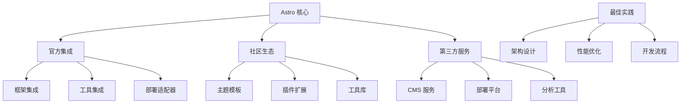

::: tip 学习目标
- 探索 Astro 生态系统和社区资源
- 学习行业最佳实践和设计模式
- 掌握性能调优和问题排查技巧
- 了解 Astro 发展趋势和未来规划
:::

## 知识点

### Astro 生态系统概览

Astro 拥有丰富的生态系统，包含多个层面的支持：

- **官方集成**：框架集成、工具链、部署适配器
- **社区贡献**：主题模板、插件扩展、工具库
- **第三方服务**：CMS、部署平台、分析工具
- **学习资源**：文档、教程、视频、博客

### 生态系统架构



## 官方集成生态

### 框架集成

```javascript
// astro.config.mjs - 多框架集成示例
import { defineConfig } from 'astro/config';
import vue from '@astrojs/vue';
import react from '@astrojs/react';
import svelte from '@astrojs/svelte';
import solid from '@astrojs/solid-js';

export default defineConfig({
  integrations: [
    // Vue 3 集成
    vue({
      appEntrypoint: '/src/pages/_app',
      jsx: true, // 支持 JSX
    }),

    // React 集成
    react({
      include: ['**/react/*'],
      experimentalReactChildren: true,
    }),

    // Svelte 集成
    svelte({
      include: ['**/svelte/*'],
    }),

    // Solid.js 集成
    solid({
      include: ['**/solid/*'],
    }),
  ],
});
```

### 工具链集成

```javascript
// 完整的工具链集成配置
import { defineConfig } from 'astro/config';
import tailwind from '@astrojs/tailwind';
import sitemap from '@astrojs/sitemap';
import robotsTxt from 'astro-robots-txt';
import compress from 'astro-compress';
import critters from 'astro-critters';
import webmanifest from 'astro-webmanifest';

export default defineConfig({
  site: 'https://your-domain.com',

  integrations: [
    // CSS 框架
    tailwind({
      config: { applyBaseStyles: false },
    }),

    // SEO 工具
    sitemap({
      changefreq: 'weekly',
      priority: 0.7,
    }),

    robotsTxt({
      policy: [
        { userAgent: '*', allow: '/' },
        { userAgent: '*', disallow: '/admin' },
      ],
    }),

    // 性能优化
    compress({
      CSS: true,
      HTML: {
        removeAttributeQuotes: false,
      },
      Image: false, // 使用专门的图片优化
      JavaScript: true,
      SVG: true,
    }),

    // 关键 CSS 内联
    critters({
      config: {
        path: 'dist/',
        logLevel: 'info',
      },
    }),

    // PWA 清单
    webmanifest({
      name: '应用名称',
      icon: 'src/images/icon.png',
      start_url: '/',
      theme_color: '#000000',
      background_color: '#ffffff',
    }),
  ],
});
```

### 部署适配器

```javascript
// 多平台部署配置
import { defineConfig } from 'astro/config';

// 根据环境选择适配器
const getAdapter = () => {
  switch (process.env.DEPLOYMENT_PLATFORM) {
    case 'vercel':
      return import('@astrojs/vercel/serverless');
    case 'netlify':
      return import('@astrojs/netlify/functions');
    case 'cloudflare':
      return import('@astrojs/cloudflare');
    case 'node':
      return import('@astrojs/node');
    default:
      return null; // 静态生成
  }
};

export default defineConfig({
  output: process.env.DEPLOYMENT_PLATFORM ? 'server' : 'static',
  adapter: await getAdapter(),
});
```

## 社区生态资源

### 优秀主题和模板

```bash
# 博客主题
npm create astro@latest -- --template blog
npm create astro@latest -- --template minimal

# 商业主题
npm create astro@latest -- --template portfolio
npm create astro@latest -- --template docs

# 社区主题
git clone https://github.com/satnaing/astro-paper.git
git clone https://github.com/chrismwilliams/astro-theme-cactus.git
```

### 常用社区插件

```javascript
// package.json - 推荐的社区插件
{
  "dependencies": {
    // 图片优化
    "astro-imagetools": "^0.9.0",

    // 字体优化
    "astro-google-fonts-optimizer": "^0.2.0",

    // 分析工具
    "astro-analytics": "^2.3.0",

    // 评论系统
    "astro-giscus": "^0.1.0",

    // 搜索功能
    "astro-pagefind": "^1.0.0",

    // 国际化
    "astro-i18next": "^1.0.0",

    // 代码高亮
    "astro-expressive-code": "^0.27.0",

    // 图标支持
    "astro-icon": "^0.8.0"
  }
}
```

### 工具库推荐

```typescript
// src/lib/utils.ts - 推荐的工具库集成

// 日期处理
import { format, parseISO } from 'date-fns';
import { zhCN } from 'date-fns/locale';

// 验证库
import { z } from 'zod';

// 样式工具
import { clsx } from 'clsx';
import { twMerge } from 'tailwind-merge';

// Markdown 处理
import { marked } from 'marked';
import DOMPurify from 'dompurify';

// 图片处理
import sharp from 'sharp';

// 工具函数组合
export function cn(...inputs: string[]) {
  return twMerge(clsx(inputs));
}

// 安全的 Markdown 渲染
export function renderMarkdown(content: string): string {
  const html = marked(content);
  return DOMPurify.sanitize(html);
}

// 响应式图片生成
export async function generateResponsiveImage(
  inputPath: string,
  outputPath: string,
  widths: number[] = [400, 800, 1200]
) {
  const image = sharp(inputPath);

  await Promise.all(
    widths.map(async (width) => {
      await image
        .resize(width)
        .webp({ quality: 80 })
        .toFile(`${outputPath}-${width}w.webp`);
    })
  );
}

// 日期格式化
export function formatDate(date: string | Date, locale = 'zh-CN'): string {
  const dateObj = typeof date === 'string' ? parseISO(date) : date;
  return format(dateObj, 'PPP', { locale: zhCN });
}
```

## 最佳实践指南

### 项目结构最佳实践

```
src/
├── components/           # 组件目录
│   ├── ui/              # 基础 UI 组件
│   ├── layout/          # 布局组件
│   ├── features/        # 功能组件
│   └── pages/           # 页面特定组件
├── content/             # 内容集合
│   ├── blog/
│   ├── products/
│   └── config.ts
├── layouts/             # 页面布局
│   ├── BaseLayout.astro
│   └── MarkdownLayout.astro
├── pages/               # 路由页面
│   ├── api/             # API 端点
│   ├── blog/
│   └── [...slug].astro  # 通配符路由
├── styles/              # 样式文件
│   ├── global.css
│   └── components.css
├── utils/               # 工具函数
│   ├── constants.ts
│   ├── helpers.ts
│   └── types.ts
├── stores/              # 状态管理
├── middleware/          # 中间件
└── env.d.ts            # 环境类型定义
```

### 组件设计模式

```astro
---
// src/components/ui/Button.astro - 可复用按钮组件

export interface Props {
  variant?: 'primary' | 'secondary' | 'outline' | 'ghost';
  size?: 'sm' | 'md' | 'lg';
  type?: 'button' | 'submit' | 'reset';
  disabled?: boolean;
  loading?: boolean;
  href?: string;
  target?: string;
  class?: string;
}

const {
  variant = 'primary',
  size = 'md',
  type = 'button',
  disabled = false,
  loading = false,
  href,
  target,
  class: className,
  ...rest
} = Astro.props;

// 样式计算
const baseClasses = 'inline-flex items-center justify-center font-medium rounded-md transition-colors focus:outline-none focus:ring-2 focus:ring-offset-2';

const variantClasses = {
  primary: 'bg-blue-600 text-white hover:bg-blue-700 focus:ring-blue-500',
  secondary: 'bg-gray-600 text-white hover:bg-gray-700 focus:ring-gray-500',
  outline: 'border border-gray-300 bg-transparent hover:bg-gray-50 focus:ring-gray-500',
  ghost: 'bg-transparent hover:bg-gray-100 focus:ring-gray-500',
};

const sizeClasses = {
  sm: 'px-3 py-1.5 text-sm',
  md: 'px-4 py-2 text-base',
  lg: 'px-6 py-3 text-lg',
};

const classes = [
  baseClasses,
  variantClasses[variant],
  sizeClasses[size],
  disabled && 'opacity-50 cursor-not-allowed',
  className,
].filter(Boolean).join(' ');

// 根据是否有 href 决定渲染元素
const Element = href ? 'a' : 'button';
---

<Element
  class={classes}
  type={!href ? type : undefined}
  href={href}
  target={target}
  disabled={disabled || loading}
  aria-disabled={disabled || loading}
  {...rest}
>
  {loading && (
    <svg class="animate-spin -ml-1 mr-2 h-4 w-4" fill="none" viewBox="0 0 24 24">
      <circle class="opacity-25" cx="12" cy="12" r="10" stroke="currentColor" stroke-width="4"></circle>
      <path class="opacity-75" fill="currentColor" d="M4 12a8 8 0 018-8V0C5.373 0 0 5.373 0 12h4zm2 5.291A7.962 7.962 0 014 12H0c0 3.042 1.135 5.824 3 7.938l3-2.647z"></path>
    </svg>
  )}

  <slot />
</Element>
```

### 性能优化模式

```typescript
// src/utils/performance.ts - 性能优化工具

// 图片懒加载
export function setupImageLazyLoading() {
  if ('IntersectionObserver' in window) {
    const imageObserver = new IntersectionObserver((entries) => {
      entries.forEach((entry) => {
        if (entry.isIntersecting) {
          const img = entry.target as HTMLImageElement;
          const src = img.dataset.src;

          if (src) {
            img.src = src;
            img.classList.remove('lazy');
            imageObserver.unobserve(img);
          }
        }
      });
    });

    document.querySelectorAll('img[data-src]').forEach((img) => {
      imageObserver.observe(img);
    });
  }
}

// 预取重要资源
export function prefetchCriticalResources() {
  const criticalPages = ['/about', '/contact', '/services'];

  criticalPages.forEach((page) => {
    const link = document.createElement('link');
    link.rel = 'prefetch';
    link.href = page;
    document.head.appendChild(link);
  });
}

// 防抖和节流
export function debounce<T extends (...args: any[]) => any>(
  func: T,
  wait: number
): (...args: Parameters<T>) => void {
  let timeout: NodeJS.Timeout;

  return (...args: Parameters<T>) => {
    clearTimeout(timeout);
    timeout = setTimeout(() => func.apply(this, args), wait);
  };
}

export function throttle<T extends (...args: any[]) => any>(
  func: T,
  limit: number
): (...args: Parameters<T>) => void {
  let inThrottle: boolean;

  return (...args: Parameters<T>) => {
    if (!inThrottle) {
      func.apply(this, args);
      inThrottle = true;
      setTimeout(() => inThrottle = false, limit);
    }
  };
}

// 性能监控
export class PerformanceMonitor {
  private metrics: Map<string, number> = new Map();

  mark(name: string): void {
    this.metrics.set(name, performance.now());
  }

  measure(startMark: string, endMark?: string): number {
    const start = this.metrics.get(startMark);
    const end = endMark ? this.metrics.get(endMark) : performance.now();

    if (start === undefined) {
      throw new Error(`Mark "${startMark}" not found`);
    }

    return end! - start;
  }

  reportWebVitals(): void {
    // 集成 web-vitals 库进行性能监控
    import('web-vitals').then(({ getCLS, getFID, getFCP, getLCP, getTTFB }) => {
      getCLS(console.log);
      getFID(console.log);
      getFCP(console.log);
      getLCP(console.log);
      getTTFB(console.log);
    });
  }
}
```

### SEO 最佳实践

```astro
---
// src/components/SEO.astro - 完整的 SEO 组件

export interface Props {
  title: string;
  description: string;
  canonical?: string;
  ogImage?: string;
  ogType?: 'website' | 'article';
  twitterCard?: 'summary' | 'summary_large_image';
  publishDate?: Date;
  modifiedDate?: Date;
  author?: string;
  tags?: string[];
  noindex?: boolean;
  nofollow?: boolean;
}

const {
  title,
  description,
  canonical = Astro.url.href,
  ogImage = '/images/og-default.jpg',
  ogType = 'website',
  twitterCard = 'summary_large_image',
  publishDate,
  modifiedDate,
  author,
  tags = [],
  noindex = false,
  nofollow = false,
} = Astro.props;

const siteName = 'Your Site Name';
const twitterHandle = '@yourhandle';

// 生成结构化数据
const structuredData = {
  '@context': 'https://schema.org',
  '@type': ogType === 'article' ? 'Article' : 'WebPage',
  headline: title,
  description,
  image: ogImage,
  author: author ? { '@type': 'Person', name: author } : undefined,
  publisher: {
    '@type': 'Organization',
    name: siteName,
  },
  datePublished: publishDate?.toISOString(),
  dateModified: modifiedDate?.toISOString(),
  keywords: tags.join(', '),
};
---

<!-- 基础 Meta 标签 -->
<title>{title}</title>
<meta name="description" content={description} />
<meta name="author" content={author || siteName} />
{tags.length > 0 && <meta name="keywords" content={tags.join(', ')} />}

<!-- Canonical URL -->
<link rel="canonical" href={canonical} />

<!-- Open Graph -->
<meta property="og:type" content={ogType} />
<meta property="og:title" content={title} />
<meta property="og:description" content={description} />
<meta property="og:image" content={new URL(ogImage, Astro.site)} />
<meta property="og:url" content={canonical} />
<meta property="og:site_name" content={siteName} />
{publishDate && <meta property="article:published_time" content={publishDate.toISOString()} />}
{modifiedDate && <meta property="article:modified_time" content={modifiedDate.toISOString()} />}
{author && <meta property="article:author" content={author} />}

<!-- Twitter Card -->
<meta name="twitter:card" content={twitterCard} />
<meta name="twitter:site" content={twitterHandle} />
<meta name="twitter:creator" content={twitterHandle} />
<meta name="twitter:title" content={title} />
<meta name="twitter:description" content={description} />
<meta name="twitter:image" content={new URL(ogImage, Astro.site)} />

<!-- 机器人指令 -->
<meta name="robots" content={`${noindex ? 'noindex' : 'index'},${nofollow ? 'nofollow' : 'follow'}`} />

<!-- 结构化数据 -->
<script type="application/ld+json" set:html={JSON.stringify(structuredData)} />

<!-- 预连接重要域名 -->
<link rel="preconnect" href="https://fonts.googleapis.com" />
<link rel="preconnect" href="https://fonts.gstatic.com" crossorigin />

<!-- DNS 预取 -->
<link rel="dns-prefetch" href="//analytics.google.com" />
<link rel="dns-prefetch" href="//www.google-analytics.com" />
```

## 问题排查和调试

### 常见问题诊断

```typescript
// src/utils/debug.ts - 调试工具

export class AstroDebugger {
  private static instance: AstroDebugger;
  private debugMode: boolean;

  constructor() {
    this.debugMode = import.meta.env.DEV ||
                    import.meta.env.PUBLIC_DEBUG === 'true';
  }

  static getInstance(): AstroDebugger {
    if (!AstroDebugger.instance) {
      AstroDebugger.instance = new AstroDebugger();
    }
    return AstroDebugger.instance;
  }

  log(message: string, data?: any): void {
    if (this.debugMode) {
      console.log(`[Astro Debug] ${message}`, data);
    }
  }

  error(message: string, error?: Error): void {
    if (this.debugMode) {
      console.error(`[Astro Error] ${message}`, error);
    }
  }

  // 检查水合问题
  checkHydrationIssues(): void {
    if (typeof window === 'undefined') return;

    // 检查未水合的组件
    const unhydratedComponents = document.querySelectorAll('[data-astro-component]');
    if (unhydratedComponents.length > 0) {
      this.log(`Found ${unhydratedComponents.length} unhydrated components`);
    }

    // 检查 Vue 组件
    const vueComponents = document.querySelectorAll('[data-vue-component]');
    vueComponents.forEach((el) => {
      if (!el.hasAttribute('data-vue-hydrated')) {
        this.log('Vue component not hydrated:', el);
      }
    });
  }

  // 检查性能问题
  checkPerformanceIssues(): void {
    if (typeof window === 'undefined') return;

    // 检查大图片
    const images = document.querySelectorAll('img');
    images.forEach((img) => {
      if (img.naturalWidth > 2000 || img.naturalHeight > 2000) {
        this.log('Large image detected:', {
          src: img.src,
          width: img.naturalWidth,
          height: img.naturalHeight,
        });
      }
    });

    // 检查未优化的资源
    const scripts = document.querySelectorAll('script[src]');
    scripts.forEach((script) => {
      const src = script.getAttribute('src');
      if (src && !src.includes('.min.') && !src.includes('localhost')) {
        this.log('Unminified script detected:', src);
      }
    });
  }

  // 检查 SEO 问题
  checkSEOIssues(): void {
    if (typeof window === 'undefined') return;

    const issues: string[] = [];

    // 检查标题
    const title = document.title;
    if (!title) {
      issues.push('Missing page title');
    } else if (title.length > 60) {
      issues.push('Page title too long (>60 characters)');
    }

    // 检查描述
    const description = document.querySelector('meta[name="description"]');
    if (!description) {
      issues.push('Missing meta description');
    } else {
      const content = description.getAttribute('content');
      if (content && content.length > 160) {
        issues.push('Meta description too long (>160 characters)');
      }
    }

    // 检查 H1 标签
    const h1s = document.querySelectorAll('h1');
    if (h1s.length === 0) {
      issues.push('Missing H1 tag');
    } else if (h1s.length > 1) {
      issues.push('Multiple H1 tags found');
    }

    if (issues.length > 0) {
      this.log('SEO issues found:', issues);
    }
  }

  // 运行所有检查
  runAllChecks(): void {
    if (typeof window === 'undefined') return;

    setTimeout(() => {
      this.checkHydrationIssues();
      this.checkPerformanceIssues();
      this.checkSEOIssues();
    }, 1000);
  }
}

// 在开发环境中自动运行检查
if (import.meta.env.DEV) {
  const debugger = AstroDebugger.getInstance();

  if (typeof window !== 'undefined') {
    window.addEventListener('load', () => {
      debugger.runAllChecks();
    });
  }
}
```

### 开发工具配置

```json
// .vscode/settings.json - VS Code 配置
{
  "emmet.includeLanguages": {
    "astro": "html"
  },
  "files.associations": {
    "*.astro": "astro"
  },
  "eslint.validate": [
    "javascript",
    "javascriptreact",
    "typescript",
    "typescriptreact",
    "astro"
  ],
  "prettier.documentSelectors": ["**/*.astro"],
  "editor.quickSuggestions": {
    "strings": true
  },
  "typescript.preferences.includePackageJsonAutoImports": "on",
  "astro.typescript.allowArbitraryAttributes": true
}
```

```json
// .vscode/extensions.json - 推荐扩展
{
  "recommendations": [
    "astro-build.astro-vscode",
    "bradlc.vscode-tailwindcss",
    "vue.volar",
    "esbenp.prettier-vscode",
    "dbaeumer.vscode-eslint",
    "ms-vscode.vscode-typescript-next",
    "formulahendry.auto-rename-tag",
    "christian-kohler.path-intellisense"
  ]
}
```

## 未来发展趋势

### Astro 路线图

- **性能优化**：更快的构建速度和运行时性能
- **DX 改进**：更好的开发者体验和工具支持
- **新特性**：边缘渲染、增量静态再生
- **生态扩展**：更多集成和官方适配器

### 新兴技术集成

```typescript
// 未来技术预览
// Edge Computing 集成
export const config = {
  runtime: 'edge',
  regions: ['iad1', 'sfo1'],
};

// WebAssembly 集成
import wasm from '../assets/compute.wasm';

export async function processData(data: ArrayBuffer) {
  const wasmModule = await wasm();
  return wasmModule.process(data);
}

// 流式 SSR
export async function GET() {
  const stream = new ReadableStream({
    start(controller) {
      // 流式生成内容
    }
  });

  return new Response(stream, {
    headers: { 'Content-Type': 'text/html' }
  });
}
```

### 学习资源推荐

```yaml
# 官方资源
docs: https://docs.astro.build/
blog: https://astro.build/blog/
discord: https://astro.build/chat/

# 学习路径
beginner:
  - Astro 官方教程
  - 构建第一个 Astro 网站
  - 理解岛屿架构

intermediate:
  - 集成前端框架
  - 内容管理系统
  - 部署和优化

advanced:
  - 自定义集成开发
  - 高级性能优化
  - 企业级项目实战

# 社区资源
awesome-astro: https://github.com/one-aalam/awesome-astro
themes: https://astro.build/themes/
integrations: https://astro.build/integrations/
```

::: note 关键要点
1. **生态丰富**：充分利用官方和社区提供的集成和工具
2. **最佳实践**：遵循行业标准和社区认可的开发模式
3. **性能优先**：始终关注 Web Vitals 和用户体验指标
4. **持续学习**：跟上 Astro 的发展步伐和新技术趋势
5. **社区参与**：积极参与社区讨论和贡献
:::

::: warning 注意事项
- 评估新技术和插件的稳定性和维护状态
- 定期更新依赖和集成到最新稳定版本
- 关注安全漏洞和最佳安全实践
- 平衡功能需求和性能影响
:::