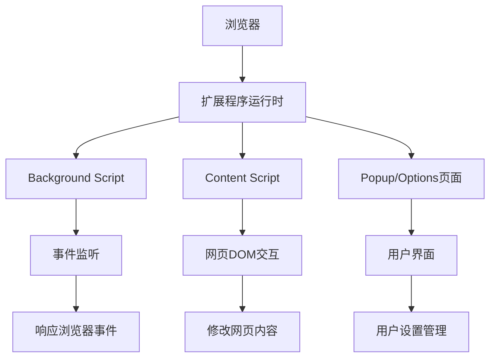

# 第 1 章：Chrome Extension 基础入门

::: tip 学习目标
1. 了解 Chrome Extension 的基本概念和工作原理
2. 理解扩展程序的组成结构和核心文件
3. 掌握 Chrome Web Store 的发布流程
:::

## 知识点总结

### Chrome Extension 基本概念

Chrome Extension（Chrome扩展程序）是一种小型软件程序，可以修改和增强 Google Chrome 浏览器的功能。扩展程序使用标准的 Web 技术构建：HTML、CSS 和 JavaScript。

::: note 扩展程序的特点
- **轻量级**：扩展程序体积小，功能专注
- **模块化**：各个组件相互独立，通过消息传递进行通信
- **安全性**：运行在沙盒环境中，权限受限
- **跨平台**：可在所有支持 Chrome 的平台上运行
:::

### 扩展程序的工作原理



### 扩展程序的核心组成

| 组件 | 作用 | 运行环境 | 必需性 |
|------|------|----------|--------|
| manifest.json | 配置文件，声明扩展信息 | - | 必需 |
| Background Script | 后台逻辑处理 | 扩展进程 | 可选 |
| Content Script | 网页内容交互 | 网页上下文 | 可选 |
| Popup | 点击图标弹出界面 | 独立窗口 | 可选 |
| Options | 设置页面 | 独立页面 | 可选 |
| Icons | 扩展程序图标 | - | 推荐 |

## 创建第一个扩展程序

### 基本目录结构

```text
扩展程序基本目录结构示例：

MyFirstExtension/
├── manifest.json      # 必需：扩展配置文件
├── popup.html         # 弹出页面
├── popup.js           # 弹出页面脚本
├── images/            # 图标目录
│   ├── icon-16.png
│   ├── icon-48.png
│   └── icon-128.png
├── scripts/           # 脚本目录
│   ├── background.js  # 后台脚本
│   └── content.js     # 内容脚本
└── styles/            # 样式目录
    └── popup.css
```

```json
// manifest.json - 扩展配置文件示例
{
  "manifest_version": 3,  // 使用最新的Manifest V3
  "name": "MyFirstExtension",
  "version": "1.0.0",
  "description": "我的第一个Chrome扩展",
  "icons": {
    "16": "images/icon-16.png",
    "48": "images/icon-48.png",
    "128": "images/icon-128.png"
  },
  "action": {
    "default_popup": "popup.html",
    "default_icon": {
      "16": "images/icon-16.png",
      "48": "images/icon-48.png",
      "128": "images/icon-128.png"
    }
  },
  "permissions": []  // 根据需要添加权限
}
```

### Hello World 扩展示例

**Hello World 扩展完整示例**

```json
// manifest.json
{
  "manifest_version": 3,
  "name": "Hello World Extension",
  "version": "1.0",
  "description": "一个简单的Hello World扩展",
  "action": {
    "default_popup": "popup.html",
    "default_title": "点击查看Hello World"
  },
  "permissions": ["activeTab", "scripting"]  // 获取当前标签页和脚本执行权限
}
```

```html
<!-- popup.html -->
<!DOCTYPE html>
<html>
<head>
  <meta charset="utf-8">
  <style>
    body {
      width: 200px;
      padding: 10px;
      font-family: Arial, sans-serif;
    }
    h1 {
      color: #4CAF50;
      font-size: 18px;
    }
    button {
      background-color: #4CAF50;
      color: white;
      border: none;
      padding: 8px 16px;
      cursor: pointer;
      border-radius: 4px;
      width: 100%;
      margin-top: 10px;
    }
    button:hover {
      background-color: #45a049;
    }
  </style>
</head>
<body>
  <h1>Hello World!</h1>
  <p id="message">欢迎使用Chrome扩展</p>
  <button id="changeColor">改变页面背景色</button>
  <script src="popup.js"></script>
</body>
</html>
```

```javascript
// popup.js - 弹出页面脚本
document.addEventListener('DOMContentLoaded', function() {
  // 获取按钮元素
  const button = document.getElementById('changeColor');
  const message = document.getElementById('message');

  // 添加点击事件监听器
  button.addEventListener('click', async () => {
    // 获取当前活动标签页
    const [tab] = await chrome.tabs.query({
      active: true,
      currentWindow: true
    });

    // 在当前标签页中执行脚本
    chrome.scripting.executeScript({
      target: { tabId: tab.id },
      function: changeBackgroundColor,
    });

    // 更新消息
    message.textContent = '背景色已改变！';
  });
});

// 这个函数将在网页上下文中执行
function changeBackgroundColor() {
  // 生成随机颜色
  const colors = ['#FFE4B5', '#E6F3FF', '#F0FFF0', '#FFF0F5', '#F5F5DC'];
  const randomColor = colors[Math.floor(Math.random() * colors.length)];
  document.body.style.backgroundColor = randomColor;
}
```

## 安装和调试扩展程序

### 加载开发中的扩展

::: warning 开发者模式
在加载未发布的扩展之前，需要先开启Chrome的开发者模式
:::

**加载扩展步骤：**

1. 打开 Chrome 浏览器
2. 访问 `chrome://extensions/`
3. 开启右上角的「开发者模式」
4. 点击「加载已解压的扩展程序」
5. 选择扩展程序目录

**调试命令参考：**

| 操作 | 方法 |
|------|------|
| 查看Service Worker | `chrome://extensions/` → 点击「Service Worker」链接 |
| 查看弹窗页 | 右键扩展图标 → 审查弹出内容 |
| 查看Content Script | F12打开开发者工具 → Sources → Content Scripts |
| 重新加载扩展 | `chrome://extensions/` → 点击刷新按钮 |

```javascript
// 在开发者控制台中常用的调试命令

// 查看存储数据
chrome.storage.local.get(null, (data) => {
  console.log('Local Storage:', data);
});

// 清除存储数据
chrome.storage.local.clear(() => {
  console.log('Storage cleared');
});

// 查看所有权限
chrome.permissions.getAll((permissions) => {
  console.log('Permissions:', permissions);
});

// 验证manifest.json必需字段
const requiredFields = ['manifest_version', 'name', 'version'];
// manifest_version 必须是 2 或 3
```

## Chrome Web Store 发布流程

### 发布准备清单

**发布前检查清单：**

| 状态 | 必需性 | 任务 |
|------|--------|------|
| ⬜ | 必需 | 完成功能开发和测试 |
| ⬜ | 必需 | 准备扩展图标 (128x128, 48x48, 16x16) |
| ⬜ | 必需 | 创建商店列表图标 (440x280) |
| ⬜ | 必需 | 准备至少1张截图 (1280x800 或 640x400) |
| ⬜ | 必需 | 编写详细的扩展描述 |
| ⬜ | 必需 | 设置适当的权限（最小权限原则） |
| ⬜ | 可选 | 创建隐私政策（如果收集用户数据） |
| ⬜ | 必需 | 准备$5美元的开发者注册费 |
| ⬜ | 必需 | 压缩扩展为.zip文件 |
| ⬜ | 可选 | 测试不同Chrome版本兼容性 |

**商店列表信息结构：**

```javascript
// 商店列表所需信息
const storeAssets = {
  name: "My Awesome Extension",
  shortDescription: "",      // 最多132个字符
  detailedDescription: "",   // 最多16,000个字符
  category: "",              // 如：生产力工具、娱乐、社交等
  language: "zh-CN",
  screenshots: [],           // 至少1张，最多5张
  promotionalImages: {
    smallTile: "440x280.png",   // 小型推广图块（必需）
    largeTile: "920x680.png",   // 大型推广图块（可选）
    marquee: "1400x560.png"     // 横幅推广图（可选）
  },
  supportUrl: "",            // 支持网站或邮箱
  privacyPolicyUrl: ""       // 隐私政策链接
};
```

### 发布步骤指南

::: tip 发布流程概览
1. **注册开发者账号** → 支付$5注册费
2. **准备发布资源** → 图标、截图、描述
3. **上传扩展包** → 提交.zip文件
4. **填写商店信息** → 完善列表信息
5. **提交审核** → 等待Google审核
6. **发布上线** → 审核通过后上线
:::

**详细发布步骤：**

**步骤1：注册开发者账号**
1. 访问 https://chrome.google.com/webstore/devconsole
2. 使用Google账号登录
3. 支付$5美元一次性注册费
4. 填写开发者信息

**步骤2：上传扩展包**
- 文件大小：最大 100MB
- 文件格式：.zip
- 不包含 node_modules 等开发文件

**步骤3：提交审核**
审核要点：
- 功能性测试
- 安全性检查
- 政策合规性
- 用户体验

预计审核时间：1-3个工作日

**审核状态说明：**

| 状态 | 说明 |
|------|------|
| pending | 等待提交 |
| under_review | 审核中 |
| approved | 审核通过，可以发布 |
| rejected | 审核未通过，需要修改 |

**常见拒绝原因：**
- 权限过度申请
- 功能描述不准确
- 包含恶意代码
- 违反内容政策

::: note 发布后的维护
- **版本更新**: 修复bug、添加功能时需要更新版本号
- **用户反馈**: 及时回复用户评论和问题
- **数据分析**: 关注下载量、活跃用户等数据
- **政策更新**: 关注Chrome政策变化，及时调整
:::

## 本章小结

本章介绍了Chrome Extension的基础知识，包括：

1. **基本概念**: 了解了扩展程序的定义、特点和工作原理
2. **核心组件**: 学习了manifest.json、各类脚本的作用
3. **开发流程**: 创建了第一个Hello World扩展
4. **调试方法**: 掌握了加载和调试扩展的方法
5. **发布流程**: 了解了发布到Chrome Web Store的完整流程

下一章将深入学习开发环境的搭建和工具的使用。