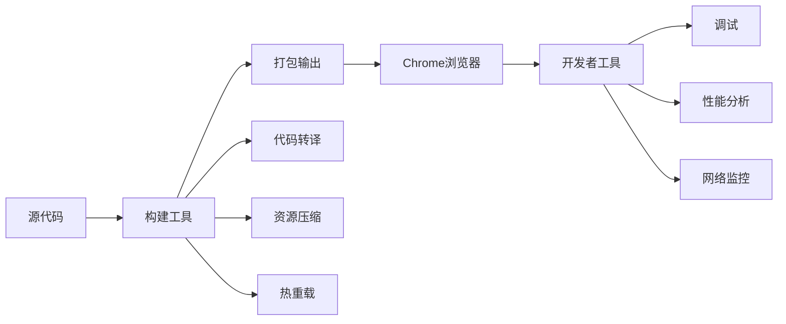

# 第 2 章：开发环境搭建与工具

::: tip 学习目标
1. 配置 Chrome Extension 开发环境
2. 掌握开发者工具和调试技巧
3. 了解常用的开发工具和框架
:::

## 知识点总结

### 开发环境组成

Chrome Extension 开发环境主要包含以下几个部分：

- **浏览器环境**: Chrome 浏览器（开发版或稳定版）
- **代码编辑器**: VS Code、WebStorm 等
- **版本控制**: Git
- **构建工具**: Webpack、Vite、Parcel（可选）
- **开发框架**: React、Vue、Angular（可选）

### 开发工具链架构



## 基础开发环境搭建

### 必要工具安装

**环境检查命令：**

```bash
# 检查各工具是否安装
google-chrome --version    # Chrome 浏览器
node --version             # Node.js
npm --version              # NPM
git --version              # Git
code --version             # VS Code
```

**Chrome 开发者模式设置：**
1. 打开 Chrome 浏览器
2. 访问 `chrome://extensions/`
3. 启用右上角的「开发者模式」开关

**项目目录结构：**

```text
my-chrome-extension/
├── src/
│   ├── background/      # 后台脚本
│   ├── content/         # 内容脚本
│   ├── popup/           # 弹出页面
│   ├── options/         # 选项页面
│   └── assets/
│       ├── icons/       # 图标
│       └── images/      # 图片资源
├── dist/                # 构建输出
├── test/                # 测试文件
└── docs/                # 文档
```

**package.json 配置：**

```json
{
  "name": "my-chrome-extension",
  "version": "1.0.0",
  "description": "Chrome Extension project",
  "scripts": {
    "build": "webpack --mode production",
    "dev": "webpack --mode development --watch",
    "test": "jest",
    "lint": "eslint src/"
  },
  "devDependencies": {
    "webpack": "^5.0.0",
    "webpack-cli": "^4.0.0",
    "copy-webpack-plugin": "^9.0.0",
    "clean-webpack-plugin": "^4.0.0",
    "eslint": "^8.0.0",
    "jest": "^27.0.0"
  }
}
```

**.gitignore 配置：**

```gitignore
# Dependencies
node_modules/

# Build output
dist/
build/
*.zip

# IDE files
.vscode/
.idea/
*.swp
*.swo

# OS files
.DS_Store
Thumbs.db

# Logs
npm-debug.log*
yarn-debug.log*
yarn-error.log*

# Environment variables
.env
.env.local

# Test coverage
coverage/
```

### VS Code 扩展配置

**推荐的 VS Code 扩展 (.vscode/extensions.json)：**

```json
{
  "recommendations": [
    "dbaeumer.vscode-eslint",
    "esbenp.prettier-vscode",
    "christian-kohler.path-intellisense",
    "formulahendry.auto-rename-tag",
    "ritwickdey.liveserver",
    "ms-vscode.vscode-typescript-tslint-plugin",
    "octref.vetur",
    "dsznajder.es7-react-js-snippets",
    "msjsdiag.debugger-for-chrome",
    "naumovs.color-highlight"
  ]
}
```

**工作区设置 (.vscode/settings.json)：**

```json
{
  "editor.formatOnSave": true,
  "editor.codeActionsOnSave": {
    "source.fixAll.eslint": true
  },
  "editor.tabSize": 2,
  "editor.wordWrap": "on",
  "files.autoSave": "afterDelay",
  "files.autoSaveDelay": 1000,
  "eslint.validate": [
    "javascript",
    "javascriptreact",
    "typescript",
    "typescriptreact"
  ],
  "emmet.includeLanguages": {
    "javascript": "javascriptreact"
  },
  "search.exclude": {
    "**/node_modules": true,
    "**/dist": true,
    "**/build": true
  }
}
```

**代码片段 (.vscode/chrome-extension.code-snippets)：**

```json
{
  "Chrome Extension Manifest": {
    "prefix": "manifest",
    "body": [
      "{",
      "  \"manifest_version\": 3,",
      "  \"name\": \"${1:Extension Name}\",",
      "  \"version\": \"${2:1.0.0}\",",
      "  \"description\": \"${3:Description}\",",
      "  \"permissions\": [${4}],",
      "  \"action\": {",
      "    \"default_popup\": \"popup.html\"",
      "  }",
      "}"
    ],
    "description": "Chrome Extension Manifest V3 template"
  },
  "Content Script": {
    "prefix": "content",
    "body": [
      "// Content script for Chrome Extension",
      "console.log('Content script loaded');",
      "",
      "// Interact with the page DOM",
      "document.addEventListener('DOMContentLoaded', () => {",
      "  ${1:// Your code here}",
      "});"
    ],
    "description": "Content script template"
  },
  "Chrome Storage Get": {
    "prefix": "chromeget",
    "body": [
      "chrome.storage.${1|local,sync|}.get(['${2:key}'], (result) => {",
      "  console.log('Value:', result.${2:key});",
      "  ${3:// Handle the result}",
      "});"
    ],
    "description": "Chrome storage get template"
  }
}
```

**调试启动配置 (.vscode/launch.json)：**

```json
{
  "version": "0.2.0",
  "configurations": [
    {
      "name": "Launch Chrome Extension",
      "type": "chrome",
      "request": "launch",
      "url": "http://localhost:3000",
      "webRoot": "${workspaceFolder}/src",
      "runtimeArgs": [
        "--load-extension=${workspaceFolder}/dist"
      ]
    }
  ]
}
```

## 开发者工具使用

### Chrome DevTools 功能详解

**DevTools 面板功能：**

| 面板 | 功能 |
|------|------|
| Elements | 检查和修改 DOM/CSS |
| Console | JavaScript 控制台 |
| Sources | 调试 JavaScript 代码 |
| Network | 监控网络请求 |
| Performance | 性能分析 |
| Memory | 内存分析 |
| Application | 存储和缓存管理 |
| Security | 安全性检查 |

**扩展程序调试指南：**

**背景脚本调试：**
1. 打开 `chrome://extensions/`
2. 找到你的扩展
3. 点击「Service Worker」链接
4. DevTools 将打开，显示背景脚本控制台

**弹窗页面调试：**
1. 右键点击扩展图标
2. 选择「审查弹出内容」
3. DevTools 将打开，显示弹窗页面

**内容脚本调试：**
1. 在目标网页上按 F12
2. 转到 Sources 面板
3. 在左侧找到 Content Scripts 部分
4. 选择你的扩展脚本

**控制台实用命令：**

| 命令 | 说明 |
|------|------|
| `$_` | 返回最近一次表达式的值 |
| `$0-$4` | 返回最近选择的 DOM 元素 |
| `$(selector)` | 等同于 `document.querySelector` |
| `$$(selector)` | 等同于 `document.querySelectorAll` |
| `clear()` | 清空控制台 |
| `copy(object)` | 复制对象到剪贴板 |
| `debug(function)` | 在函数入口设置断点 |
| `monitor(function)` | 监控函数调用 |
| `monitorEvents(element, events)` | 监控元素事件 |
| `getEventListeners(element)` | 获取元素的事件监听器 |

**扩展专用命令：**

```javascript
// 获取 manifest 信息
chrome.runtime.getManifest()

// 获取扩展 ID
chrome.runtime.id

// 获取扩展详情
chrome.management.getSelf(console.log)

// 查看本地存储
chrome.storage.local.get(null, console.log)

// 查看权限
chrome.permissions.getAll(console.log)
```

**性能分析工具：**

| 工具 | 目的 | 关键指标 |
|------|------|----------|
| Performance Panel | 记录运行时性能 | FPS、CPU使用率、网络活动、内存 |
| Memory Panel | 内存分析和泄漏检测 | 堆内存大小、对象数量、内存分配 |
| Coverage Panel | 代码覆盖率分析 | JS覆盖率、CSS覆盖率 |

### 调试技巧和最佳实践

**断点策略详解：**

| 断点类型 | 说明 | 使用方法 |
|----------|------|----------|
| 条件断点 | 只在特定条件下暂停 (如 `i === 5`) | 右键点击行号 → 添加条件断点 |
| 日志断点 | 不暂停，只输出日志 | 右键点击行号 → 添加日志点 |
| DOM 断点 | DOM 变化时触发（子树修改、属性修改、节点删除） | Elements 面板 → 右键元素 → Break on |
| XHR/Fetch 断点 | 网络请求时触发 | Sources 面板 → XHR/fetch Breakpoints |
| 事件监听器断点 | 特定事件触发时暂停（鼠标、键盘、触摸等） | Sources 面板 → Event Listener Breakpoints |

**错误处理模式示例：**

```javascript
// 1. 全局错误捕获
window.addEventListener('error', (event) => {
  console.error('Global error:', event.error);
  // 发送错误报告
  reportError({
    message: event.message,
    source: event.filename,
    line: event.lineno,
    column: event.colno,
    error: event.error.stack
  });
});

// 2. Promise 错误捕获
window.addEventListener('unhandledrejection', (event) => {
  console.error('Unhandled promise rejection:', event.reason);
  event.preventDefault();
});

// 3. Chrome Extension 错误处理
chrome.runtime.onMessage.addListener((request, sender, sendResponse) => {
  try {
    // 处理消息
    handleMessage(request, sender, sendResponse);
  } catch (error) {
    console.error('Message handling error:', error);
    sendResponse({ success: false, error: error.message });
  }
  return true;  // 保持消息通道开放
});

// 4. 异步错误处理
async function safeAsyncOperation() {
  try {
    const result = await riskyOperation();
    return { success: true, data: result };
  } catch (error) {
    console.error('Async operation failed:', error);
    return { success: false, error: error.message };
  }
}

// 5. 开发环境调试辅助
const DEBUG = true;  // 生产环境设为 false

function debugLog(...args) {
  if (DEBUG) {
    console.log('[DEBUG]', new Date().toISOString(), ...args);
  }
}

// 6. 性能监控
function measurePerformance(functionName, fn) {
  return function(...args) {
    const startTime = performance.now();
    const result = fn.apply(this, args);
    const endTime = performance.now();
    console.log(`${functionName} took ${endTime - startTime}ms`);
    return result;
  };
}
```

**远程调试配置：**

**启动 Chrome 远程调试：**
```bash
chrome --remote-debugging-port=9222
```
- 目的：允许外部工具连接调试
- 用途：自动化测试、远程开发、CI/CD 集成

**连接到远程调试：**
- URL：`http://localhost:9222`
- 支持工具：Chrome DevTools、VS Code、Puppeteer
- 能力：检查页面、执行脚本、性能分析

**扩展程序自动重载：**
- 工具：Extension Reloader
- 好处：修改代码后自动重新加载扩展

## 常用开发工具和框架

### 构建工具配置

**Webpack 配置示例 (webpack.config.js)：**

```javascript
// webpack.config.js
const path = require('path');
const CopyWebpackPlugin = require('copy-webpack-plugin');
const { CleanWebpackPlugin } = require('clean-webpack-plugin');
const HtmlWebpackPlugin = require('html-webpack-plugin');

module.exports = {
  mode: process.env.NODE_ENV || 'development',
  devtool: 'inline-source-map',

  entry: {
    popup: './src/popup/popup.js',
    options: './src/options/options.js',
    background: './src/background/background.js',
    content: './src/content/content.js'
  },

  output: {
    path: path.resolve(__dirname, 'dist'),
    filename: '[name]/[name].js'
  },

  module: {
    rules: [
      {
        test: /\.js$/,
        exclude: /node_modules/,
        use: {
          loader: 'babel-loader',
          options: {
            presets: ['@babel/preset-env']
          }
        }
      },
      {
        test: /\.css$/,
        use: ['style-loader', 'css-loader']
      },
      {
        test: /\.(png|jpg|gif|svg)$/,
        use: {
          loader: 'file-loader',
          options: {
            name: '[name].[ext]',
            outputPath: 'assets/'
          }
        }
      }
    ]
  },

  plugins: [
    new CleanWebpackPlugin(),

    new CopyWebpackPlugin({
      patterns: [
        { from: 'src/manifest.json' },
        { from: 'src/assets', to: 'assets' }
      ]
    }),

    new HtmlWebpackPlugin({
      template: 'src/popup/popup.html',
      filename: 'popup/popup.html',
      chunks: ['popup']
    }),

    new HtmlWebpackPlugin({
      template: 'src/options/options.html',
      filename: 'options/options.html',
      chunks: ['options']
    })
  ],

  optimization: {
    splitChunks: {
      chunks: 'all',
      cacheGroups: {
        vendor: {
          test: /[\\/]node_modules[\\/]/,
          name: 'vendor',
          priority: 10
        }
      }
    }
  }
};
```

**Vite 配置示例 (vite.config.js)：**

```javascript
// vite.config.js
import { defineConfig } from 'vite';
import { crx } from '@crxjs/vite-plugin';
import manifest from './src/manifest.json';

export default defineConfig({
  plugins: [
    crx({ manifest })
  ],

  build: {
    rollupOptions: {
      input: {
        popup: 'src/popup/index.html',
        options: 'src/options/index.html'
      },
      output: {
        entryFileNames: '[name]/[name].js',
        chunkFileNames: 'chunks/[name]-[hash].js',
        assetFileNames: 'assets/[name]-[hash].[ext]'
      }
    }
  },

  server: {
    port: 3000,
    hmr: {
      port: 3001
    }
  }
});
```

**NPM Scripts 配置：**

```json
{
  "scripts": {
    "dev": "webpack --mode development --watch",
    "build": "webpack --mode production",
    "build:firefox": "cross-env TARGET=firefox webpack --mode production",
    "clean": "rimraf dist",
    "test": "jest",
    "test:watch": "jest --watch",
    "lint": "eslint src/ --ext .js,.jsx",
    "lint:fix": "eslint src/ --ext .js,.jsx --fix",
    "format": "prettier --write 'src/**/*.{js,jsx,css,html}'",
    "analyze": "webpack-bundle-analyzer dist/stats.json",
    "zip": "node scripts/zip.js",
    "release": "npm run clean && npm run build && npm run zip"
  }
}
```

### 框架集成示例

**React 集成示例：**

```jsx
// React Popup 组件示例
import React, { useState, useEffect } from 'react';
import ReactDOM from 'react-dom';

function PopupApp() {
  const [tabs, setTabs] = useState([]);
  const [activeTab, setActiveTab] = useState(null);

  useEffect(() => {
    // 获取所有标签页
    chrome.tabs.query({}, (tabs) => {
      setTabs(tabs);
    });

    // 获取当前活动标签页
    chrome.tabs.query({ active: true, currentWindow: true }, (tabs) => {
      if (tabs[0]) {
        setActiveTab(tabs[0]);
      }
    });
  }, []);

  const handleTabClick = (tabId) => {
    chrome.tabs.update(tabId, { active: true });
  };

  return (
    <div className="popup-container">
      <h2>Tab Manager</h2>
      <div className="current-tab">
        {activeTab && (
          <div>
            <strong>当前标签：</strong>
            <p>{activeTab.title}</p>
          </div>
        )}
      </div>
      <div className="tab-list">
        <h3>所有标签页</h3>
        {tabs.map(tab => (
          <div
            key={tab.id}
            className="tab-item"
            onClick={() => handleTabClick(tab.id)}
          >
            
            <span>{tab.title}</span>
          </div>
        ))}
      </div>
    </div>
  );
}

ReactDOM.render(<PopupApp />, document.getElementById('root'));
```

**Vue 集成示例：**

```vue
<!-- Vue Popup 组件示例 -->
<template>
  <div id="app">
    <h2>{{ title }}</h2>
    <div class="settings">
      <label>
        <input type="checkbox" v-model="darkMode" @change="saveSetting">
        启用深色模式
      </label>
      <label>
        <input type="checkbox" v-model="notifications" @change="saveSetting">
        启用通知
      </label>
    </div>
    <div class="actions">
      <button @click="captureTab">截取当前页面</button>
      <button @click="clearData">清除数据</button>
    </div>
  </div>
</template>

<script>
export default {
  name: 'PopupApp',
  data() {
    return {
      title: 'Extension Settings',
      darkMode: false,
      notifications: true
    }
  },

  mounted() {
    this.loadSettings();
  },

  methods: {
    loadSettings() {
      chrome.storage.sync.get(['darkMode', 'notifications'], (result) => {
        this.darkMode = result.darkMode || false;
        this.notifications = result.notifications !== false;
      });
    },

    saveSetting() {
      chrome.storage.sync.set({
        darkMode: this.darkMode,
        notifications: this.notifications
      });
    },

    captureTab() {
      chrome.tabs.captureVisibleTab((dataUrl) => {
        // 处理截图
        console.log('Screenshot captured');
      });
    },

    clearData() {
      if (confirm('确定要清除所有数据吗？')) {
        chrome.storage.sync.clear(() => {
          console.log('Data cleared');
          this.loadSettings();
        });
      }
    }
  }
}
</script>
```

**TypeScript 配置示例 (tsconfig.json)：**

```json
{
  "compilerOptions": {
    "target": "ES2020",
    "module": "commonjs",
    "lib": ["ES2020", "DOM", "DOM.Iterable"],
    "jsx": "react",
    "outDir": "./dist",
    "rootDir": "./src",
    "strict": true,
    "esModuleInterop": true,
    "skipLibCheck": true,
    "forceConsistentCasingInFileNames": true,
    "resolveJsonModule": true,
    "types": ["chrome", "node"],
    "sourceMap": true
  },
  "include": ["src/**/*"],
  "exclude": ["node_modules", "dist"]
}
```

**TypeScript 类型安全的消息处理：**

```typescript
// Chrome API 类型定义示例
interface ExtensionMessage {
  type: string;
  payload: any;
}

interface TabInfo {
  id: number;
  url: string;
  title: string;
  active: boolean;
}

// 类型安全的消息处理
chrome.runtime.onMessage.addListener(
  (message: ExtensionMessage, sender: chrome.runtime.MessageSender,
   sendResponse: (response?: any) => void) => {
    switch(message.type) {
      case 'GET_TAB_INFO':
        const tabInfo: TabInfo = {
          id: sender.tab?.id || 0,
          url: sender.tab?.url || '',
          title: sender.tab?.title || '',
          active: sender.tab?.active || false
        };
        sendResponse(tabInfo);
        break;
    }
    return true;
  }
);
```

## 开发工作流优化

### 自动化工作流

**热重载脚本 (hot-reload.js)：**

```javascript
// hot-reload.js - 开发环境自动重载脚本
const filesInDirectory = dir => new Promise(resolve =>
  dir.createReader().readEntries(entries =>
    Promise.all(entries.filter(e => e.name[0] !== '.').map(e =>
      e.isDirectory
        ? filesInDirectory(e)
        : new Promise(resolve => e.file(resolve))
    ))
    .then(files => [].concat(...files))
    .then(resolve)
  )
);

const timestampForFilesInDirectory = dir =>
  filesInDirectory(dir).then(files =>
    files.map(f => f.name + f.lastModified).join()
  );

const watchChanges = (dir, lastTimestamp) => {
  timestampForFilesInDirectory(dir).then(timestamp => {
    if (!lastTimestamp || (lastTimestamp === timestamp)) {
      setTimeout(() => watchChanges(dir, timestamp), 1000);
    } else {
      chrome.runtime.reload();
    }
  });
};

// 仅在开发环境启用
if (process.env.NODE_ENV === 'development') {
  chrome.management.getSelf(self => {
    if (self.installType === 'development') {
      chrome.runtime.getPackageDirectoryEntry(dir =>
        watchChanges(dir)
      );
    }
  });
}
```

**Git Hooks 配置：**

`.git/hooks/pre-commit`:
```bash
#!/bin/sh
# 运行 lint 检查
npm run lint

# 运行测试
npm test

# 检查是否有console.log
FILES=$(git diff --cached --name-only --diff-filter=ACM | grep -E '\.(js|jsx|ts|tsx)$')
if [ -n "$FILES" ]; then
    echo "$FILES" | xargs grep -n "console\.log" && {
        echo "发现 console.log，请移除后再提交"
        exit 1
    }
fi

exit 0
```

`.git/hooks/pre-push`:
```bash
#!/bin/sh
# 构建项目
npm run build

# 运行完整测试套件
npm run test:full

exit 0
```

`.git/hooks/commit-msg`:
```bash
#!/bin/sh
# 验证提交消息格式
commit_regex='^(feat|fix|docs|style|refactor|test|chore)(\(.+\))?: .{1,50}'

if ! grep -qE "$commit_regex" "$1"; then
    echo "提交消息格式错误！"
    echo "格式: <type>(<scope>): <subject>"
    echo "示例: feat(popup): add new feature"
    exit 1
fi
```

**CI/CD Pipeline 配置 (.github/workflows/ci.yml)：**

```yaml
name: CI/CD Pipeline

on:
  push:
    branches: [ main, develop ]
  pull_request:
    branches: [ main ]

jobs:
  test:
    runs-on: ubuntu-latest

    steps:
    - uses: actions/checkout@v2

    - name: Setup Node.js
      uses: actions/setup-node@v2
      with:
        node-version: '16'
        cache: 'npm'

    - name: Install dependencies
      run: npm ci

    - name: Run linting
      run: npm run lint

    - name: Run tests
      run: npm test -- --coverage

    - name: Build extension
      run: npm run build

    - name: Upload build artifacts
      uses: actions/upload-artifact@v2
      with:
        name: extension-build
        path: dist/

  release:
    needs: test
    runs-on: ubuntu-latest
    if: github.ref == 'refs/heads/main'

    steps:
    - uses: actions/checkout@v2

    - name: Setup Node.js
      uses: actions/setup-node@v2
      with:
        node-version: '16'

    - name: Install dependencies
      run: npm ci

    - name: Build for production
      run: npm run build:prod

    - name: Create release package
      run: npm run package

    - name: Upload to Chrome Web Store
      env:
        CLIENT_ID: ${{ secrets.CHROME_CLIENT_ID }}
        CLIENT_SECRET: ${{ secrets.CHROME_CLIENT_SECRET }}
        REFRESH_TOKEN: ${{ secrets.CHROME_REFRESH_TOKEN }}
      run: |
        npx chrome-webstore-upload-cli upload \
          --source extension.zip \
          --extension-id ${{ secrets.EXTENSION_ID }}
```

::: tip 开发效率提升建议
1. **使用代码片段**: 创建常用代码模板，快速生成样板代码
2. **配置别名**: 设置路径别名，简化导入语句
3. **启用热重载**: 自动重新加载扩展，无需手动刷新
4. **使用调试工具**: 充分利用Chrome DevTools的所有功能
5. **版本控制**: 使用Git进行版本管理，定期提交代码
:::

## 本章小结

本章详细介绍了Chrome Extension开发环境的搭建和工具使用：

1. **基础环境搭建**: 配置了开发所需的基本工具和项目结构
2. **VS Code配置**: 设置了适合扩展开发的编辑器环境
3. **调试工具使用**: 掌握了Chrome DevTools的各种调试技巧
4. **构建工具配置**: 学习了Webpack和Vite的配置方法
5. **框架集成**: 了解了React、Vue和TypeScript的集成方式
6. **工作流优化**: 配置了自动化工具提升开发效率

下一章将深入学习Manifest文件的详细配置。