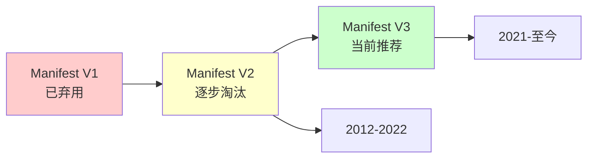

# 第 3 章：Manifest 文件详解

::: tip 学习目标
1. 深入理解 manifest.json 的各个配置项
2. 掌握权限声明和安全配置
3. 了解 Manifest V2 和 V3 的差异
:::

## 知识点总结

### Manifest 文件概述

Manifest 文件是 Chrome Extension 的配置文件，定义了扩展的元数据、权限、资源和行为。它是每个扩展程序的必需文件，位于扩展根目录。

### Manifest 版本演进



## Manifest V3 核心配置

### 基本信息字段

```json
{
  "manifest_version": 3,
  "name": "My Extension",
  "version": "1.0.0",
  "version_name": "v1.0.0",
  "description": "这是一个强大的Chrome扩展",
  "short_name": "MyExt",
  "author": "Developer Name",
  "icons": {
    "16": "icons/icon-16.png",
    "32": "icons/icon-32.png",
    "48": "icons/icon-48.png",
    "128": "icons/icon-128.png"
  }
}
```

**配置说明**:
- `manifest_version`: 必需，版本号（推荐使用 3）
- `name`: 必需，扩展名称
- `version`: 必需，版本号
- `description`: 扩展描述（最多132个字符）
- `short_name`: 简短名称（最多12个字符）
- `author`: 作者信息
- `version_name`: 用户友好的版本标识
- `icons`: 图标尺寸和路径的映射

### Action 配置（原 Browser Action）

**Action 配置示例**

**简单弹窗**:
```json
{
  "action": {
    "default_popup": "popup.html",
    "default_title": "点击打开扩展"
  }
}
```

**多尺寸图标**:
```json
{
  "action": {
    "default_icon": {
      "16": "icons/icon-16.png",
      "24": "icons/icon-24.png",
      "32": "icons/icon-32.png"
    },
    "default_title": "我的扩展"
  }
}
```

**仅图标（无弹窗）**:
```json
{
  "action": {
    "default_icon": "icon.png",
    "default_title": "点击触发后台事件"
  }
}
```

## 权限系统详解

### 权限类型和声明

**权限分类**

**基础权限**:
- `activeTab` - 访问当前活动标签页
- `tabs` - 访问所有标签页信息
- `storage` - 使用存储API
- `contextMenus` - 添加右键菜单
- `notifications` - 显示通知
- `alarms` - 定时器
- `clipboardRead` - 读取剪贴板
- `clipboardWrite` - 写入剪贴板

**高级权限**:
- `bookmarks` - 访问书签
- `history` - 访问历史记录
- `downloads` - 管理下载
- `management` - 管理其他扩展
- `cookies` - 访问Cookies
- `webRequest` - 拦截网络请求
- `webRequestBlocking` - 阻止网络请求
- `proxy` - 控制代理设置
- `debugger` - 使用调试器API

**主机权限**:
- `<all_urls>` - 访问所有网站
- `*://*.google.com/*` - 特定域名
- `https://*/` - 所有HTTPS网站
- `file:///*` - 本地文件

**权限配置示例**:
```json
{
  "permissions": ["storage", "tabs"],
  "optional_permissions": ["bookmarks", "downloads"],
  "host_permissions": ["https://*.example.com/*"]
}
```

**权限最佳实践**

**1. 最小权限原则** - 只申请必要的权限
```json
{
  "permissions": ["storage", "activeTab"],
  "optional_permissions": ["downloads", "bookmarks"]
}
```

**2. 动态权限请求** - 运行时请求可选权限
```javascript
// 请求可选权限
chrome.permissions.request({
    permissions: ['bookmarks'],
    origins: ['https://www.example.com/']
}, (granted) => {
    if (granted) {
        // 权限已授予
        console.log('权限已获得');
    } else {
        // 用户拒绝
        console.log('权限被拒绝');
    }
});
```

**3. 权限检查** - 使用前检查权限
```javascript
// 检查权限
chrome.permissions.contains({
    permissions: ['bookmarks'],
    origins: ['https://www.example.com/']
}, (result) => {
    if (result) {
        // 已有权限
        performAction();
    } else {
        // 请求权限
        requestPermission();
    }
});
```

### 内容安全策略（CSP）

**CSP配置示例**

**默认CSP（最严格）**:
```json
{
  "content_security_policy": {
    "extension_pages": "script-src 'self'; object-src 'self'"
  }
}
```

**允许WASM**:
```json
{
  "content_security_policy": {
    "extension_pages": "script-src 'self' 'wasm-unsafe-eval'; object-src 'self'"
  }
}
```

**沙盒页面CSP**:
```json
{
  "content_security_policy": {
    "sandbox": "sandbox allow-scripts allow-forms allow-popups allow-modals; script-src 'self' 'unsafe-inline' 'unsafe-eval'; child-src 'self';"
  }
}
```

**CSP违规事件处理**:
```javascript
// 监听CSP违规事件
document.addEventListener('securitypolicyviolation', (e) => {
    console.error('CSP违规:', {
        blockedURI: e.blockedURI,
        violatedDirective: e.violatedDirective,
        originalPolicy: e.originalPolicy,
        sourceFile: e.sourceFile,
        lineNumber: e.lineNumber
    });

    // 报告违规到后台
    chrome.runtime.sendMessage({
        type: 'csp_violation',
        details: {
            uri: e.blockedURI,
            directive: e.violatedDirective
        }
    });
});
```

## Background Scripts 配置

### Service Worker（Manifest V3）

**Manifest V3 使用 Service Worker**:
```json
{
  "background": {
    "service_worker": "background.js",
    "type": "module"
  }
}
```

**Service Worker 示例代码**:
```javascript
// background.js - Service Worker

// 扩展安装事件
chrome.runtime.onInstalled.addListener((details) => {
    console.log('扩展已安装:', details);

    // 根据安装原因执行不同操作
    switch(details.reason) {
        case 'install':
            console.log('首次安装');
            // 设置默认值
            chrome.storage.local.set({
                installed: true,
                version: chrome.runtime.getManifest().version
            });
            break;
        case 'update':
            console.log('扩展更新');
            // 执行迁移逻辑
            migrateData(details.previousVersion);
            break;
        case 'chrome_update':
            console.log('Chrome更新');
            break;
    }
});

// 监听来自content script的消息
chrome.runtime.onMessage.addListener((request, sender, sendResponse) => {
    console.log('收到消息:', request, '来自:', sender);

    // 异步处理
    (async () => {
        try {
            const result = await handleMessage(request, sender);
            sendResponse({success: true, data: result});
        } catch (error) {
            sendResponse({success: false, error: error.message});
        }
    })();

    return true; // 保持消息通道开放
});

// 监听标签页更新
chrome.tabs.onUpdated.addListener((tabId, changeInfo, tab) => {
    if (changeInfo.status === 'complete') {
        console.log('标签页加载完成:', tab.url);
    }
});

// 定时任务
chrome.alarms.create('periodicTask', {
    periodInMinutes: 30  // 每30分钟执行
});

chrome.alarms.onAlarm.addListener((alarm) => {
    if (alarm.name === 'periodicTask') {
        performPeriodicTask();
    }
});

// Service Worker 生命周期
self.addEventListener('activate', (event) => {
    console.log('Service Worker 激活');
});

// 处理fetch事件（仅在特定场景下需要）
self.addEventListener('fetch', (event) => {
    // 可以拦截和修改网络请求
    console.log('Fetch事件:', event.request.url);
});

async function handleMessage(request, sender) {
    // 消息处理逻辑
    switch(request.type) {
        case 'GET_DATA':
            return await getData(request.key);
        case 'SAVE_DATA':
            return await saveData(request.key, request.value);
        default:
            throw new Error('未知的消息类型');
    }
}

async function performPeriodicTask() {
    // 定期执行的任务
    console.log('执行定期任务');
}
```

## Content Scripts 配置

### 内容脚本注入配置

**静态声明方式**:
```json
{
  "content_scripts": [
    {
      "matches": ["*://*.example.com/*"],
      "js": ["content.js"],
      "css": ["content.css"],
      "run_at": "document_end",
      "all_frames": false,
      "match_about_blank": false,
      "world": "ISOLATED"
    }
  ]
}
```

**注入时机选项**:
- `document_start` - DOM构建开始时（最早）
- `document_end` - DOM构建完成时（默认）
- `document_idle` - 页面空闲时或DOM完成后

**执行环境选项 (V3)**:
- `ISOLATED` - 隔离环境（默认，有自己的全局作用域）
- `MAIN` - 主世界（与页面共享全局作用域）

**动态注入示例**:
```javascript
// 动态注入内容脚本
chrome.tabs.query({active: true, currentWindow: true}, (tabs) => {
    chrome.scripting.executeScript({
        target: {tabId: tabs[0].id},
        files: ['content.js']
    });

    // 或者注入CSS
    chrome.scripting.insertCSS({
        target: {tabId: tabs[0].id},
        files: ['content.css']
    });

    // 或者注入函数
    chrome.scripting.executeScript({
        target: {tabId: tabs[0].id},
        func: injectedFunction,
        args: ['arg1', 'arg2']
    });
});

function injectedFunction(arg1, arg2) {
    console.log('注入的函数执行:', arg1, arg2);
    // 这个函数会在页面上下文中执行
}
```

**高级匹配模式**:

**包含特定路径**:
```json
["*://example.com/path/*"]
```

**排除特定页面**:
```json
{
  "matches": ["*://example.com/*"],
  "exclude_matches": ["*://example.com/admin/*"]
}
```

**使用glob模式**:
```json
{
  "matches": ["*://example.com/*"],
  "include_globs": ["*://example.com/user/*"],
  "exclude_globs": ["*://example.com/*/private/*"]
}
```

## Manifest V2 vs V3 差异

### 主要差异对比

| 特性 | Manifest V2 | Manifest V3 | 说明 |
|------|-------------|-------------|------|
| 后台脚本 | `background: { scripts: ['bg.js'], persistent: false }` | `background: { service_worker: 'sw.js' }` | V3使用Service Worker替代后台页面 |
| 主机权限 | `permissions: ['<all_urls>']` | `host_permissions: ['<all_urls>']` | V3将主机权限分离到单独字段 |
| Action API | `browser_action 或 page_action` | `action（统一）` | V3统一为action API |
| Web Request API | `完整的blocking webRequest` | `declarativeNetRequest（声明式）` | V3限制了阻塞式网络请求 |
| 内容安全策略 | `可以使用unsafe-eval` | `禁止unsafe-eval（除WASM）` | V3加强了安全限制 |
| 远程代码 | `可以加载远程代码` | `禁止远程代码执行` | V3要求所有代码打包在扩展内 |

### Manifest V2 到 V3 迁移指南

**1. 更新manifest_version**
```json
// V2
"manifest_version": 2

// V3
"manifest_version": 3
```

**2. 迁移后台脚本**
```javascript
// V2 - background.js
chrome.browserAction.onClicked.addListener(() => {
    // 处理点击
});

// V3 - service-worker.js
chrome.action.onClicked.addListener(() => {
    // 处理点击
});
```

**3. 更新权限声明**
```json
// V2
{
    "permissions": [
        "tabs",
        "https://example.com/*"
    ]
}

// V3
{
    "permissions": ["tabs"],
    "host_permissions": ["https://example.com/*"]
}
```

**4. 替换Web Request API**
```javascript
// V2 - 使用webRequest
chrome.webRequest.onBeforeRequest.addListener(
    (details) => {
        return {cancel: true};
    },
    {urls: ["*://example.com/*"]},
    ["blocking"]
);

// V3 - 使用declarativeNetRequest
chrome.declarativeNetRequest.updateDynamicRules({
    addRules: [{
        id: 1,
        priority: 1,
        action: {type: "block"},
        condition: {urlFilter: "example.com"}
    }]
});
```

**5. 处理Service Worker生命周期**
```javascript
// V3 - Service Worker会自动休眠
// 使用chrome.storage而不是全局变量
let data; // ❌ 避免使用

// ✅ 使用storage
chrome.storage.local.set({data: value});
chrome.storage.local.get(['data'], (result) => {
    // 使用数据
});
```

## 完整Manifest示例

### 实战项目配置

**完整的Manifest V3配置示例**:
```json
{
  "manifest_version": 3,
  "name": "Advanced Chrome Extension",
  "version": "2.0.0",
  "description": "功能完整的Chrome扩展示例",
  "author": "Your Name",

  "icons": {
    "16": "icons/icon-16.png",
    "32": "icons/icon-32.png",
    "48": "icons/icon-48.png",
    "128": "icons/icon-128.png"
  },

  "action": {
    "default_popup": "popup/popup.html",
    "default_icon": {
      "16": "icons/icon-16.png",
      "32": "icons/icon-32.png"
    },
    "default_title": "点击查看选项"
  },

  "background": {
    "service_worker": "background/service-worker.js",
    "type": "module"
  },

  "content_scripts": [
    {
      "matches": ["<all_urls>"],
      "js": ["content/content.js"],
      "css": ["content/content.css"],
      "run_at": "document_idle",
      "all_frames": false
    }
  ],

  "permissions": [
    "storage",
    "tabs",
    "notifications",
    "alarms",
    "contextMenus"
  ],

  "optional_permissions": [
    "bookmarks",
    "history",
    "downloads"
  ],

  "host_permissions": [
    "https://*/*",
    "http://localhost/*"
  ],

  "options_page": "options/options.html",

  "web_accessible_resources": [
    {
      "resources": ["images/*.png", "styles/*.css"],
      "matches": ["<all_urls>"]
    }
  ],

  "content_security_policy": {
    "extension_pages": "script-src 'self'; object-src 'self'"
  },

  "commands": {
    "_execute_action": {
      "suggested_key": {
        "default": "Ctrl+Shift+Y",
        "mac": "Command+Shift+Y"
      },
      "description": "打开扩展弹窗"
    },
    "toggle-feature": {
      "suggested_key": {
        "default": "Ctrl+Shift+U"
      },
      "description": "切换功能开关"
    }
  },

  "minimum_chrome_version": "88",
  "default_locale": "en"
}
```

**配置验证脚本**:
```javascript
// 验证Manifest配置
async function validateManifest() {
    const manifest = chrome.runtime.getManifest();

    console.log('Manifest验证:');
    console.log('- 版本:', manifest.version);
    console.log('- 权限:', manifest.permissions);
    console.log('- 主机权限:', manifest.host_permissions);

    // 检查必需字段
    const required = ['manifest_version', 'name', 'version'];
    const missing = required.filter(field => !manifest[field]);

    if (missing.length > 0) {
        console.error('缺少必需字段:', missing);
        return false;
    }

    // 检查版本格式
    const versionPattern = /^\d+\.\d+\.\d+$/;
    if (!versionPattern.test(manifest.version)) {
        console.error('版本格式错误:', manifest.version);
        return false;
    }

    console.log('✅ Manifest验证通过');
    return true;
}

validateManifest();
```

::: warning 注意事项
1. **版本兼容性**: 确保目标Chrome版本支持所使用的API
2. **权限申请**: 遵循最小权限原则，避免过度申请
3. **安全策略**: 严格遵守CSP规则，确保扩展安全
4. **迁移计划**: V2扩展需要尽快迁移到V3
:::

## 本章小结

本章深入学习了Chrome Extension的Manifest文件配置：

1. **基本配置**: 掌握了必需字段和基本信息设置
2. **权限系统**: 理解了权限类型和申请策略
3. **后台脚本**: 学习了Service Worker的配置方法
4. **内容脚本**: 了解了内容脚本的注入配置
5. **版本差异**: 对比了V2和V3的主要区别
6. **迁移指南**: 掌握了从V2到V3的迁移方法

下一章将学习Content Scripts的详细开发。