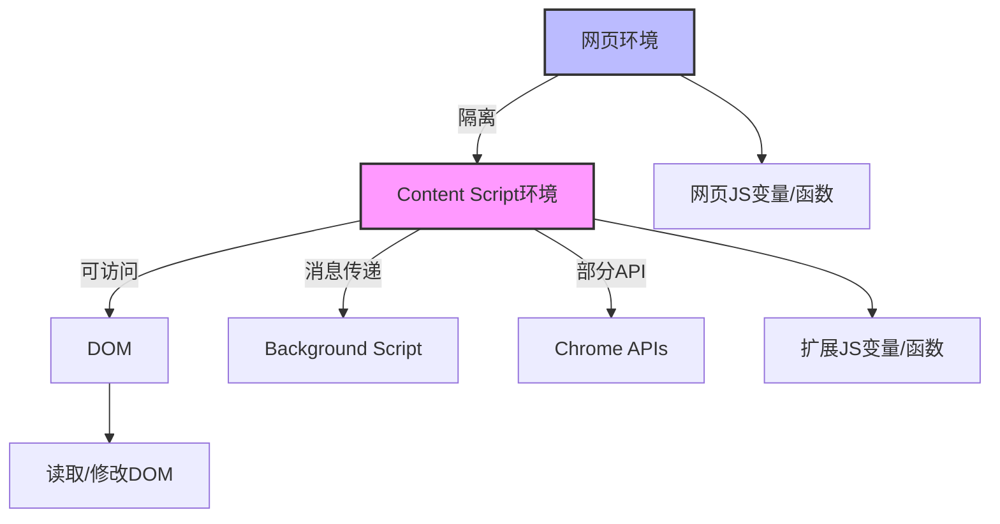

# 第 4 章：Content Scripts 内容脚本

::: tip 学习目标
1. 理解 Content Scripts 的作用和执行环境
2. 掌握与网页 DOM 的交互方法
3. 学习脚本注入的时机控制
:::

## 知识点总结

### Content Scripts 概述

Content Scripts 是在网页上下文中运行的 JavaScript 文件，可以读取和修改网页的 DOM。它们在隔离的环境中执行，拥有对网页 DOM 的完全访问权限，但与网页的 JavaScript 环境相互隔离。

### 执行环境架构



## Content Scripts 基础

### 环境隔离机制

**Content Script 隔离环境示例**

```javascript
// content-script.js

// 1. Content Script 有自己的全局作用域
let myVariable = 'content script variable';

// 2. 无法直接访问页面的JavaScript变量
console.log(typeof window.pageVariable); // undefined

// 3. 但可以访问和修改DOM
document.body.style.backgroundColor = '#f0f0f0';

// 4. 共享DOM但不共享JavaScript环境
const button = document.createElement('button');
button.textContent = '扩展按钮';
button.onclick = function() {
    // 这个函数在content script环境中执行
    console.log('Button clicked in content script');
};
document.body.appendChild(button);

// 5. 与页面通信需要通过DOM事件或postMessage
// 发送消息到页面
window.postMessage({
    type: 'FROM_CONTENT_SCRIPT',
    data: 'Hello from extension'
}, '*');

// 监听来自页面的消息
window.addEventListener('message', (event) => {
    if (event.data.type === 'FROM_PAGE') {
        console.log('Received from page:', event.data);
    }
});
```

**网页脚本示例**

```javascript
// 网页的JavaScript

// 页面有自己的变量
window.pageVariable = 'page variable';

// 监听来自content script的消息
window.addEventListener('message', (event) => {
    if (event.data.type === 'FROM_CONTENT_SCRIPT') {
        console.log('Received from extension:', event.data);

        // 回复消息
        window.postMessage({
            type: 'FROM_PAGE',
            data: 'Hello from page'
        }, '*');
    }
});
```

**共享DOM访问示例**

```javascript
// content-script.js - DOM操作示例

class DOMManipulator {
    constructor() {
        this.init();
    }

    init() {
        // 等待DOM加载完成
        if (document.readyState === 'loading') {
            document.addEventListener('DOMContentLoaded', () => this.setup());
        } else {
            this.setup();
        }
    }

    setup() {
        // 1. 查找元素
        this.findAndModifyElements();

        // 2. 监听DOM变化
        this.observeDOM();

        // 3. 添加自定义元素
        this.injectCustomElements();

        // 4. 修改样式
        this.modifyStyles();
    }

    findAndModifyElements() {
        // 查找所有链接
        const links = document.querySelectorAll('a[href]');
        links.forEach(link => {
            // 为外部链接添加图标
            if (link.hostname !== window.location.hostname) {
                link.classList.add('external-link');
                link.setAttribute('target', '_blank');
                link.setAttribute('rel', 'noopener noreferrer');
            }
        });

        // 查找并高亮特定文本
        this.highlightText('important', '#ffff00');
    }

    highlightText(keyword, color) {
        const walker = document.createTreeWalker(
            document.body,
            NodeFilter.SHOW_TEXT,
            null,
            false
        );

        const textNodes = [];
        let node;

        while (node = walker.nextNode()) {
            if (node.nodeValue.toLowerCase().includes(keyword)) {
                textNodes.push(node);
            }
        }

        textNodes.forEach(node => {
            const span = document.createElement('span');
            span.style.backgroundColor = color;
            span.textContent = node.nodeValue;
            node.parentNode.replaceChild(span, node);
        });
    }

    observeDOM() {
        // 监听DOM变化
        const observer = new MutationObserver((mutations) => {
            mutations.forEach(mutation => {
                if (mutation.type === 'childList') {
                    mutation.addedNodes.forEach(node => {
                        if (node.nodeType === 1) { // 元素节点
                            console.log('New element added:', node.tagName);
                            this.processNewElement(node);
                        }
                    });
                }
            });
        });

        // 配置观察选项
        observer.observe(document.body, {
            childList: true,
            subtree: true,
            attributes: true,
            attributeOldValue: true
        });
    }

    processNewElement(element) {
        // 处理新添加的元素
        if (element.tagName === 'IMG') {
            // 添加懒加载
            element.loading = 'lazy';
        }
    }

    injectCustomElements() {
        // 创建悬浮工具栏
        const toolbar = document.createElement('div');
        toolbar.id = 'extension-toolbar';
        toolbar.innerHTML = `
            <button id="ext-btn-highlight">高亮</button>
            <button id="ext-btn-export">导出</button>
            <button id="ext-btn-settings">设置</button>
        `;
        toolbar.style.cssText = `
            position: fixed;
            top: 10px;
            right: 10px;
            z-index: 10000;
            background: white;
            border: 1px solid #ccc;
            padding: 10px;
            border-radius: 5px;
            box-shadow: 0 2px 5px rgba(0,0,0,0.2);
        `;

        document.body.appendChild(toolbar);

        // 绑定事件
        this.bindToolbarEvents(toolbar);
    }

    bindToolbarEvents(toolbar) {
        toolbar.addEventListener('click', (e) => {
            if (e.target.tagName === 'BUTTON') {
                switch (e.target.id) {
                    case 'ext-btn-highlight':
                        this.toggleHighlight();
                        break;
                    case 'ext-btn-export':
                        this.exportPageContent();
                        break;
                    case 'ext-btn-settings':
                        this.openSettings();
                        break;
                }
            }
        });
    }

    modifyStyles() {
        // 注入自定义CSS
        const style = document.createElement('style');
        style.textContent = `
            .external-link::after {
                content: ' ↗';
                font-size: 0.8em;
                vertical-align: super;
            }

            .extension-highlight {
                background-color: yellow !important;
                color: black !important;
            }

            #extension-toolbar button {
                margin: 0 5px;
                padding: 5px 10px;
                cursor: pointer;
                background: #4CAF50;
                color: white;
                border: none;
                border-radius: 3px;
            }

            #extension-toolbar button:hover {
                background: #45a049;
            }
        `;
        document.head.appendChild(style);
    }

    toggleHighlight() {
        document.body.classList.toggle('extension-highlight-mode');
    }

    exportPageContent() {
        const content = document.body.innerText;
        // 发送到后台脚本处理
        chrome.runtime.sendMessage({
            action: 'export',
            data: content
        });
    }

    openSettings() {
        chrome.runtime.sendMessage({action: 'openSettings'});
    }
}

// 初始化
new DOMManipulator();
```

### 注入时机控制

#### document_start

**描述**: 在任何DOM构建之前，CSS加载之前
**用例**: 需要阻止页面脚本执行或修改初始DOM

```json
// manifest.json
{
    "content_scripts": [{
        "matches": ["<all_urls>"],
        "js": ["content.js"],
        "run_at": "document_start"
    }]
}
```

```javascript
// content.js
console.log('document_start: DOM还未开始构建');

// 可以设置早期的事件监听器
document.addEventListener('DOMContentLoaded', () => {
    console.log('DOM加载完成');
});

// 注入脚本到页面上下文（需要在DOM构建前）
const script = document.createElement('script');
script.textContent = `
    // 这段代码会在页面上下文中执行
    console.log('Injected at document_start');
    // 可以重写页面的全局函数
    window.alert = function(msg) {
        console.log('Alert blocked:', msg);
    };
`;
(document.head || document.documentElement).appendChild(script);
script.remove();
```

#### document_end

**描述**: DOM构建完成，但图片等资源可能还在加载
**用例**: 大多数DOM操作的默认选择

```javascript
// content.js - document_end
console.log('document_end: DOM已构建完成');

// 可以安全地访问DOM
const allLinks = document.querySelectorAll('a');
console.log(`Found ${allLinks.length} links`);

// 修改DOM
document.body.insertAdjacentHTML('afterbegin',
    '<div id="extension-banner">Extension Loaded</div>'
);

// 但图片可能还未加载
const images = document.querySelectorAll('img');
images.forEach(img => {
    if (!img.complete) {
        img.addEventListener('load', () => {
            console.log('Image loaded:', img.src);
        });
    }
});
```

#### document_idle

**描述**: DOM空闲时或window.onload后
**用例**: 不急需的初始化，性能优化

```javascript
// content.js - document_idle
console.log('document_idle: 页面已经渲染完成或空闲');

// 执行不紧急的初始化
function initializeExtensionFeatures() {
    // 分析页面内容
    analyzePageContent();

    // 预加载资源
    prefetchResources();

    // 设置性能监控
    setupPerformanceMonitoring();
}

function analyzePageContent() {
    const wordCount = document.body.innerText.split(/\s+/).length;
    const readingTime = Math.ceil(wordCount / 200); // 假设每分钟200词

    console.log(`Page stats: ${wordCount} words, ~${readingTime} min read`);
}

function prefetchResources() {
    // 预加载扩展可能需要的资源
    const link = document.createElement('link');
    link.rel = 'prefetch';
    link.href = chrome.runtime.getURL('assets/data.json');
    document.head.appendChild(link);
}

function setupPerformanceMonitoring() {
    // 监控页面性能
    const observer = new PerformanceObserver((list) => {
        for (const entry of list.getEntries()) {
            console.log('Performance entry:', entry.name, entry.duration);
        }
    });

    observer.observe({entryTypes: ['measure', 'navigation']});
}

initializeExtensionFeatures();
```

#### 动态注入示例

```javascript
// background.js - 动态注入content script

// 1. 程序化注入文件
chrome.action.onClicked.addListener((tab) => {
    chrome.scripting.executeScript({
        target: {tabId: tab.id},
        files: ['content-script.js']
    });
});

// 2. 注入函数
function injectedFunction(color) {
    document.body.style.backgroundColor = color;
    return document.title;
}

chrome.tabs.query({active: true, currentWindow: true}, (tabs) => {
    chrome.scripting.executeScript({
        target: {tabId: tabs[0].id},
        func: injectedFunction,
        args: ['#e8f5e9']
    }, (results) => {
        console.log('Page title:', results[0].result);
    });
});

// 3. 注入CSS
chrome.scripting.insertCSS({
    target: {tabId: tab.id},
    css: 'body { border: 5px solid red !important; }'
});

// 或注入CSS文件
chrome.scripting.insertCSS({
    target: {tabId: tab.id},
    files: ['styles/content.css']
});

// 4. 条件注入
chrome.tabs.onUpdated.addListener((tabId, changeInfo, tab) => {
    if (changeInfo.status === 'complete' && tab.url) {
        if (tab.url.includes('github.com')) {
            chrome.scripting.executeScript({
                target: {tabId: tabId},
                files: ['github-enhancer.js']
            });
        }
    }
});

// 5. 在所有frame中注入
chrome.scripting.executeScript({
    target: {
        tabId: tab.id,
        allFrames: true  // 注入到所有frame
    },
    func: () => {
        console.log('Injected in frame:', window.location.href);
    }
});

// 6. 指定frame注入
chrome.scripting.executeScript({
    target: {
        tabId: tab.id,
        frameIds: [0]  // 只注入主frame
    },
    files: ['content.js']
});
```

## 与页面交互

### 页面脚本注入

```javascript
// content-script.js

// 方法1: 创建script标签注入
function injectScript(file, node) {
    const script = document.createElement('script');
    script.setAttribute('type', 'text/javascript');
    script.setAttribute('src', file);
    node.appendChild(script);
}

// 注入扩展中的脚本文件
injectScript(chrome.runtime.getURL('injected.js'), document.head);

// 方法2: 内联代码注入
function injectInlineScript(code) {
    const script = document.createElement('script');
    script.textContent = code;
    (document.head || document.documentElement).appendChild(script);
    script.remove(); // 注入后移除标签
}

// 注入内联代码
injectInlineScript(`
    // 这段代码在页面上下文中执行
    console.log('Page context:', window);

    // 可以访问页面的全局变量
    if (typeof jQuery !== 'undefined') {
        console.log('jQuery version:', jQuery.fn.jquery);
    }

    // 重写页面函数
    const originalFetch = window.fetch;
    window.fetch = function(...args) {
        console.log('Fetch intercepted:', args[0]);
        return originalFetch.apply(this, args);
    };

    // 添加全局函数供页面使用
    window.extensionAPI = {
        version: '1.0.0',
        sendMessage: function(data) {
            window.postMessage({
                source: 'extension-api',
                payload: data
            }, '*');
        }
    };
`);

// 方法3: 使用Web Accessible Resources
// manifest.json
{
    "web_accessible_resources": [{
        "resources": ["injected.js", "styles/*.css"],
        "matches": ["<all_urls>"]
    }]
}

// 然后在content script中注入
const script = document.createElement('script');
script.src = chrome.runtime.getURL('injected.js');
script.onload = function() {
    this.remove();
};
(document.head || document.documentElement).appendChild(script);
```

#### 双向通信实现

```javascript
// content-script.js
// Content Script端的通信设置

class PageBridge {
    constructor() {
        this.setupMessageChannel();
    }

    setupMessageChannel() {
        // 监听来自页面的消息
        window.addEventListener('message', (event) => {
            // 验证来源
            if (event.source !== window) return;

            if (event.data.source === 'page-script') {
                this.handlePageMessage(event.data);
            }
        });

        // 监听来自扩展的消息
        chrome.runtime.onMessage.addListener((request, sender, sendResponse) => {
            if (request.action === 'forward-to-page') {
                this.sendToPage(request.data);
            }
        });
    }

    handlePageMessage(data) {
        console.log('Message from page:', data);

        // 根据消息类型处理
        switch(data.type) {
            case 'GET_EXTENSION_DATA':
                this.sendToPage({
                    type: 'EXTENSION_DATA',
                    data: this.getExtensionData()
                });
                break;

            case 'SEND_TO_BACKGROUND':
                // 转发到后台脚本
                chrome.runtime.sendMessage({
                    action: 'from-page',
                    data: data.payload
                }, response => {
                    this.sendToPage({
                        type: 'BACKGROUND_RESPONSE',
                        data: response
                    });
                });
                break;
        }
    }

    sendToPage(data) {
        window.postMessage({
            source: 'content-script',
            ...data
        }, '*');
    }

    getExtensionData() {
        return {
            version: chrome.runtime.getManifest().version,
            id: chrome.runtime.id
        };
    }
}

// 初始化通信桥
const bridge = new PageBridge();

// injected.js
// 页面上下文中的脚本

(function() {
    'use strict';

    class ExtensionInterface {
        constructor() {
            this.setupCommunication();
        }

        setupCommunication() {
            // 监听来自content script的消息
            window.addEventListener('message', (event) => {
                if (event.data.source === 'content-script') {
                    this.handleExtensionMessage(event.data);
                }
            });
        }

        handleExtensionMessage(data) {
            console.log('Message from extension:', data);

            // 触发自定义事件供页面监听
            const customEvent = new CustomEvent('extension-message', {
                detail: data
            });
            window.dispatchEvent(customEvent);
        }

        sendToExtension(type, payload) {
            window.postMessage({
                source: 'page-script',
                type: type,
                payload: payload
            }, '*');
        }

        // 公开API给页面使用
        requestExtensionData() {
            this.sendToExtension('GET_EXTENSION_DATA');
        }

        sendToBackground(data) {
            this.sendToExtension('SEND_TO_BACKGROUND', data);
        }
    }

    // 将接口暴露给页面
    window.ExtensionInterface = new ExtensionInterface();

    // 页面可以这样使用:
    // window.ExtensionInterface.requestExtensionData();
    // window.ExtensionInterface.sendToBackground({action: 'save', data: {}});
})();
```

## 高级DOM操作

### 性能优化技巧

```javascript
// content-script-optimized.js

class OptimizedContentScript {
    constructor() {
        this.cache = new Map();
        this.observers = [];
        this.init();
    }

    init() {
        // 使用requestIdleCallback延迟非关键初始化
        if ('requestIdleCallback' in window) {
            requestIdleCallback(() => this.lazyInit());
        } else {
            setTimeout(() => this.lazyInit(), 1);
        }

        // 关键初始化
        this.criticalInit();
    }

    criticalInit() {
        // 只执行必要的初始化
        this.injectCriticalStyles();
    }

    lazyInit() {
        // 延迟执行的初始化
        this.setupObservers();
        this.bindEvents();
        this.processExistingElements();
    }

    // 1. 批量DOM操作
    batchDOMUpdates(updates) {
        // 使用DocumentFragment批量插入
        const fragment = document.createDocumentFragment();

        updates.forEach(update => {
            const element = this.createElement(update);
            fragment.appendChild(element);
        });

        // 一次性插入所有元素
        document.body.appendChild(fragment);
    }

    // 2. 防抖和节流
    debounce(func, wait) {
        let timeout;
        return function executedFunction(...args) {
            const later = () => {
                clearTimeout(timeout);
                func(...args);
            };
            clearTimeout(timeout);
            timeout = setTimeout(later, wait);
        };
    }

    throttle(func, limit) {
        let inThrottle;
        return function(...args) {
            if (!inThrottle) {
                func.apply(this, args);
                inThrottle = true;
                setTimeout(() => inThrottle = false, limit);
            }
        };
    }

    // 3. 虚拟滚动实现
    setupVirtualScroll(container, items, itemHeight) {
        const totalHeight = items.length * itemHeight;
        const viewportHeight = container.clientHeight;
        const visibleCount = Math.ceil(viewportHeight / itemHeight);

        // 创建占位元素
        const spacer = document.createElement('div');
        spacer.style.height = `${totalHeight}px`;
        container.appendChild(spacer);

        // 渲染可见元素
        const renderVisibleItems = this.throttle(() => {
            const scrollTop = container.scrollTop;
            const startIndex = Math.floor(scrollTop / itemHeight);
            const endIndex = Math.min(
                startIndex + visibleCount + 1,
                items.length
            );

            // 清除旧元素
            container.querySelectorAll('.item').forEach(el => el.remove());

            // 渲染新元素
            for (let i = startIndex; i < endIndex; i++) {
                const item = this.renderItem(items[i], i);
                item.style.position = 'absolute';
                item.style.top = `${i * itemHeight}px`;
                container.appendChild(item);
            }
        }, 100);

        container.addEventListener('scroll', renderVisibleItems);
        renderVisibleItems();
    }

    // 4. 缓存DOM查询
    querySelector(selector, forceRefresh = false) {
        if (!this.cache.has(selector) || forceRefresh) {
            this.cache.set(selector, document.querySelector(selector));
        }
        return this.cache.get(selector);
    }

    querySelectorAll(selector, forceRefresh = false) {
        const key = `all_${selector}`;
        if (!this.cache.has(key) || forceRefresh) {
            this.cache.set(key, [...document.querySelectorAll(selector)]);
        }
        return this.cache.get(key);
    }

    // 5. 智能观察者
    setupObservers() {
        // Intersection Observer for lazy loading
        const lazyImageObserver = new IntersectionObserver((entries) => {
            entries.forEach(entry => {
                if (entry.isIntersecting) {
                    const img = entry.target;
                    img.src = img.dataset.src;
                    img.classList.add('loaded');
                    lazyImageObserver.unobserve(img);
                }
            });
        });

        // 观察所有懒加载图片
        document.querySelectorAll('img[data-src]').forEach(img => {
            lazyImageObserver.observe(img);
        });

        this.observers.push(lazyImageObserver);

        // Resize Observer for responsive elements
        const resizeObserver = new ResizeObserver(
            this.debounce((entries) => {
                entries.forEach(entry => {
                    this.handleResize(entry.target, entry.contentRect);
                });
            }, 250)
        );

        // 观察需要响应式处理的元素
        const responsiveElements = document.querySelectorAll('.responsive');
        responsiveElements.forEach(el => resizeObserver.observe(el));

        this.observers.push(resizeObserver);
    }

    // 6. 事件委托
    bindEvents() {
        // 使用事件委托而不是为每个元素绑定
        document.body.addEventListener('click', (e) => {
            const target = e.target;

            // 处理不同类型的点击
            if (target.matches('.button-class')) {
                this.handleButtonClick(target);
            } else if (target.matches('a.special-link')) {
                this.handleSpecialLink(target, e);
            } else if (target.closest('.widget')) {
                this.handleWidgetClick(target.closest('.widget'));
            }
        });

        // 优化滚动事件
        let ticking = false;
        const updateOnScroll = () => {
            if (!ticking) {
                window.requestAnimationFrame(() => {
                    this.handleScroll();
                    ticking = false;
                });
                ticking = true;
            }
        };

        window.addEventListener('scroll', updateOnScroll, {passive: true});
    }

    // 7. Web Workers for heavy computation
    setupWorker() {
        const workerCode = `
            self.onmessage = function(e) {
                const result = heavyComputation(e.data);
                self.postMessage(result);
            };

            function heavyComputation(data) {
                // 执行耗时计算
                let result = 0;
                for (let i = 0; i < data.length; i++) {
                    result += complexCalculation(data[i]);
                }
                return result;
            }

            function complexCalculation(item) {
                // 复杂计算逻辑
                return item * 2;
            }
        `;

        const blob = new Blob([workerCode], {type: 'application/javascript'});
        const workerUrl = URL.createObjectURL(blob);
        this.worker = new Worker(workerUrl);

        this.worker.onmessage = (e) => {
            console.log('Worker result:', e.data);
        };
    }

    // 8. 清理函数
    cleanup() {
        // 断开所有观察者
        this.observers.forEach(observer => observer.disconnect());

        // 清除缓存
        this.cache.clear();

        // 终止Worker
        if (this.worker) {
            this.worker.terminate();
        }

        // 移除事件监听器
        // ... 清理事件监听器
    }
}

// 初始化优化的content script
const optimizedScript = new OptimizedContentScript();

// 页面卸载时清理
window.addEventListener('unload', () => {
    optimizedScript.cleanup();
});
```

## 安全最佳实践

### 安全注意事项

```javascript
// secure-content-script.js

class SecureContentScript {
    constructor() {
        this.trustedTypes = this.setupTrustedTypes();
        this.init();
    }

    // 1. 设置Trusted Types（如果可用）
    setupTrustedTypes() {
        if (typeof trustedTypes !== 'undefined') {
            const policy = trustedTypes.createPolicy('extension-policy', {
                createHTML: (string) => {
                    // 清理HTML输入
                    return DOMPurify.sanitize(string);
                },
                createScriptURL: (string) => {
                    // 验证脚本URL
                    if (this.isValidScriptURL(string)) {
                        return string;
                    }
                    throw new Error('Invalid script URL');
                }
            });
            return policy;
        }
        return null;
    }

    // 2. 输入验证和清理
    sanitizeInput(input) {
        // 移除潜在危险字符
        return input
            .replace(/<script[^>]*>.*?<\\/script>/gi, '')
            .replace(/on\\w+="[^"]*"/gi, '')
            .replace(/javascript:/gi, '');
    }

    // 3. 安全的DOM操作
    safeSetInnerHTML(element, html) {
        if (this.trustedTypes) {
            element.innerHTML = this.trustedTypes.createHTML(html);
        } else {
            // 使用textContent代替innerHTML当可能时
            element.textContent = '';
            const temp = document.createElement('div');
            temp.innerHTML = this.sanitizeInput(html);

            // 移除所有script标签
            temp.querySelectorAll('script').forEach(s => s.remove());

            // 移除所有内联事件处理器
            temp.querySelectorAll('*').forEach(el => {
                Array.from(el.attributes).forEach(attr => {
                    if (attr.name.startsWith('on')) {
                        el.removeAttribute(attr.name);
                    }
                });
            });

            // 克隆节点到目标元素
            while (temp.firstChild) {
                element.appendChild(temp.firstChild);
            }
        }
    }

    // 4. 安全的消息传递
    sendSecureMessage(data) {
        // 验证数据
        if (!this.validateMessageData(data)) {
            throw new Error('Invalid message data');
        }

        // 添加nonce用于验证
        const nonce = this.generateNonce();
        const message = {
            source: 'content-script',
            nonce: nonce,
            timestamp: Date.now(),
            data: data
        };

        // 签名消息
        message.signature = this.signMessage(message);

        chrome.runtime.sendMessage(message);
    }

    validateMessageData(data) {
        // 验证数据结构和类型
        if (typeof data !== 'object') return false;
        if (data.constructor !== Object && !Array.isArray(data)) return false;

        // 检查危险属性
        const dangerous = ['__proto__', 'constructor', 'prototype'];
        for (const key of dangerous) {
            if (key in data) return false;
        }

        return true;
    }

    generateNonce() {
        const array = new Uint8Array(16);
        crypto.getRandomValues(array);
        return Array.from(array, byte => byte.toString(16).padStart(2, '0')).join('');
    }

    signMessage(message) {
        // 简单的签名示例（实际应用中应使用更强的算法）
        const str = JSON.stringify(message.data) + message.nonce + message.timestamp;
        return this.simpleHash(str);
    }

    simpleHash(str) {
        let hash = 0;
        for (let i = 0; i < str.length; i++) {
            const char = str.charCodeAt(i);
            hash = ((hash << 5) - hash) + char;
            hash = hash & hash;
        }
        return hash.toString(36);
    }

    // 5. 防止XSS攻击
    preventXSS() {
        // 使用CSP meta标签
        const meta = document.createElement('meta');
        meta.httpEquiv = 'Content-Security-Policy';
        meta.content = "default-src 'self'; script-src 'self' 'unsafe-inline'";
        document.head.appendChild(meta);

        // 监听并阻止危险的DOM变化
        const observer = new MutationObserver((mutations) => {
            mutations.forEach(mutation => {
                mutation.addedNodes.forEach(node => {
                    if (node.nodeName === 'SCRIPT') {
                        // 检查并可能移除未授权的脚本
                        if (!this.isAuthorizedScript(node)) {
                            node.remove();
                            console.warn('Unauthorized script blocked');
                        }
                    }
                });
            });
        });

        observer.observe(document.documentElement, {
            childList: true,
            subtree: true
        });
    }

    isAuthorizedScript(scriptNode) {
        // 检查脚本是否来自可信源
        const src = scriptNode.src;
        if (!src) return false;

        const trustedDomains = [
            chrome.runtime.getURL(''),
            'https://trusted-cdn.com/'
        ];

        return trustedDomains.some(domain => src.startsWith(domain));
    }

    // 6. 安全的数据存储
    async secureStore(key, value) {
        // 加密敏感数据
        const encrypted = await this.encrypt(JSON.stringify(value));

        chrome.storage.local.set({
            [key]: {
                data: encrypted,
                timestamp: Date.now(),
                version: chrome.runtime.getManifest().version
            }
        });
    }

    async secureRetrieve(key) {
        return new Promise((resolve) => {
            chrome.storage.local.get(key, async (result) => {
                if (!result[key]) {
                    resolve(null);
                    return;
                }

                try {
                    const decrypted = await this.decrypt(result[key].data);
                    resolve(JSON.parse(decrypted));
                } catch (error) {
                    console.error('Decryption failed:', error);
                    resolve(null);
                }
            });
        });
    }

    async encrypt(text) {
        // 简单加密示例（实际应用中应使用Web Crypto API）
        const encoder = new TextEncoder();
        const data = encoder.encode(text);

        // 这里应该使用实际的加密算法
        return btoa(String.fromCharCode(...data));
    }

    async decrypt(encrypted) {
        // 简单解密示例
        const data = Uint8Array.from(atob(encrypted), c => c.charCodeAt(0));
        const decoder = new TextDecoder();
        return decoder.decode(data);
    }

    // 7. 限制API调用频率
    rateLimiter(func, limit, window) {
        const calls = [];
        return function(...args) {
            const now = Date.now();
            calls.push(now);

            // 移除过期的调用记录
            while (calls.length > 0 && calls[0] <= now - window) {
                calls.shift();
            }

            if (calls.length <= limit) {
                return func.apply(this, args);
            } else {
                console.warn('Rate limit exceeded');
                return null;
            }
        };
    }
}

// 初始化安全的content script
const secureScript = new SecureContentScript();
```

::: warning 安全提醒
1. **永远不要信任用户输入**: 始终验证和清理所有输入
2. **避免eval()**: 不要使用eval()或new Function()执行字符串代码
3. **使用HTTPS**: 只在安全的HTTPS页面上运行敏感操作
4. **最小权限**: 只请求必要的权限和访问
5. **定期更新**: 及时更新依赖库和安全补丁
:::

## 本章小结

本章深入学习了Chrome Extension的Content Scripts开发：

1. **执行环境**: 理解了Content Script的隔离环境和DOM访问机制
2. **注入时机**: 掌握了不同注入时机的特点和使用场景
3. **页面交互**: 学习了与页面脚本的通信方法
4. **性能优化**: 了解了各种性能优化技术
5. **安全实践**: 掌握了安全开发的最佳实践

下一章将学习Background Scripts的开发。