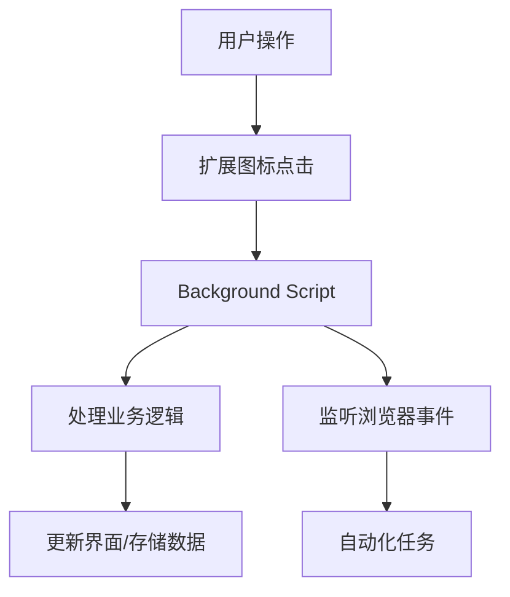
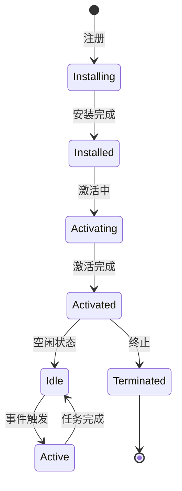

# 第5章：Background Scripts 后台脚本

## 学习目标
1. 理解Background Scripts的概念和作用机制
2. 掌握Service Worker在Chrome扩展中的应用
3. 学会事件监听和生命周期管理
4. 熟练运用后台脚本进行数据处理和API调用

## 5.1 Background Scripts概述

Background Scripts是Chrome扩展中的核心组件，它在浏览器后台持续运行，不依赖于特定网页或用户界面。

### 5.1.1 基本概念



:::tip 核心特点
- 独立于网页运行
- 可以监听浏览器事件
- 处理长时间运行的任务
- 管理扩展状态
:::

### 5.1.2 Manifest配置

在Manifest V3中，使用Service Worker替代传统的Background Pages：

```json
{
  "manifest_version": 3,
  "name": "My Extension",
  "version": "1.0",
  "background": {
    "service_worker": "background.js"
  },
  "permissions": [
    "storage",
    "tabs"
  ]
}
```

## 5.2 Service Worker基础

### 5.2.1 Service Worker生命周期



### 5.2.2 基础事件监听

```javascript
// background.js
// 扩展安装或更新时触发
chrome.runtime.onInstalled.addListener((details) => {
  console.log('Extension installed:', details);

  if (details.reason === 'install') {
    // 首次安装
    initializeExtension();
  } else if (details.reason === 'update') {
    // 扩展更新
    handleUpdate();
  }
});

// 扩展启动时触发
chrome.runtime.onStartup.addListener(() => {
  console.log('Extension started');
});

function initializeExtension() {
  // 设置默认配置
  chrome.storage.sync.set({
    'isEnabled': true,
    'theme': 'light'
  });
}

function handleUpdate() {
  // 处理更新逻辑
  console.log('Extension updated');
}
```

### 5.2.3 后台工作器模拟示例

```javascript
// background_worker.js - 模拟Chrome扩展背景脚本的实现
class BackgroundWorker {
  /**
   * 模拟Chrome扩展Background Script的类
   */
  constructor() {
    this.isRunning = false;
    this.eventListeners = {};
    this.storage = {};
  }

  async start() {
    /**
     * 启动后台工作器
     */
    this.isRunning = true;
    console.log(`[${new Date().toISOString()}] Background worker started`);

    // 模拟onInstalled事件
    await this.triggerEvent('onInstalled', { reason: 'startup' });

    // 开始事件循环
    while (this.isRunning) {
      await new Promise(resolve => setTimeout(resolve, 1000));
      await this.processEvents();
    }
  }

  addListener(eventName, callback) {
    /**
     * 添加事件监听器
     * @param {string} eventName - 事件名称
     * @param {Function} callback - 回调函数
     */
    if (!this.eventListeners[eventName]) {
      this.eventListeners[eventName] = [];
    }
    this.eventListeners[eventName].push(callback);
  }

  async triggerEvent(eventName, data) {
    /**
     * 触发事件
     * @param {string} eventName - 事件名称
     * @param {Object} data - 事件数据
     */
    if (this.eventListeners[eventName]) {
      for (const callback of this.eventListeners[eventName]) {
        await callback(data);
      }
    }
  }

  async processEvents() {
    /**
     * 处理周期性事件
     */
    // 模拟定期检查任务
    const currentTime = new Date();
    if (currentTime.getSeconds() % 30 === 0) { // 每30秒触发一次
      await this.triggerEvent('periodic_check', { time: currentTime });
    }
  }
}

// 使用示例
async function onInstalledHandler(details) {
  console.log('Extension installed:', details);
}

async function periodicCheckHandler(details) {
  console.log('Periodic check at:', details.time);
}

// 创建后台工作器实例
const worker = new BackgroundWorker();
worker.addListener('onInstalled', onInstalledHandler);
worker.addListener('periodic_check', periodicCheckHandler);

// 启动工作器（注释掉实际运行代码）
// worker.start();
```

## 5.3 事件监听与处理

### 5.3.1 浏览器事件监听

```javascript
// 标签页事件监听
chrome.tabs.onCreated.addListener((tab) => {
  console.log('新标签页创建:', tab.url);
  processNewTab(tab);
});

chrome.tabs.onUpdated.addListener((tabId, changeInfo, tab) => {
  if (changeInfo.status === 'complete') {
    console.log('页面加载完成:', tab.url);
    analyzePageContent(tab);
  }
});

chrome.tabs.onRemoved.addListener((tabId, removeInfo) => {
  console.log('标签页关闭:', tabId);
  cleanupTabData(tabId);
});

// 处理新标签页
function processNewTab(tab) {
  // 检查URL是否需要特殊处理
  if (tab.url.includes('github.com')) {
    // 为GitHub页面添加特殊功能
    chrome.tabs.sendMessage(tab.id, {
      action: 'initGithubFeatures'
    });
  }
}

function analyzePageContent(tab) {
  // 分析页面内容
  chrome.scripting.executeScript({
    target: { tabId: tab.id },
    func: extractPageInfo
  });
}

function extractPageInfo() {
  // 在页面中执行的函数
  const title = document.title;
  const description = document.querySelector('meta[name="description"]')?.content;

  chrome.runtime.sendMessage({
    action: 'pageAnalyzed',
    data: { title, description, url: location.href }
  });
}

function cleanupTabData(tabId) {
  // 清理与标签页相关的数据
  chrome.storage.local.remove([`tab_${tabId}_data`]);
}
```

### 5.3.2 消息监听

```javascript
// 监听来自content script或popup的消息
chrome.runtime.onMessage.addListener((message, sender, sendResponse) => {
  console.log('收到消息:', message);

  switch (message.action) {
    case 'getData':
      handleGetData(message, sendResponse);
      return true; // 异步响应

    case 'saveData':
      handleSaveData(message.data, sendResponse);
      return true;

    case 'processUrl':
      processUrl(message.url, sendResponse);
      return true;

    default:
      sendResponse({ error: '未知操作' });
  }
});

async function handleGetData(message, sendResponse) {
  try {
    const data = await chrome.storage.sync.get(message.key);
    sendResponse({ success: true, data });
  } catch (error) {
    sendResponse({ success: false, error: error.message });
  }
}

async function handleSaveData(data, sendResponse) {
  try {
    await chrome.storage.sync.set(data);
    sendResponse({ success: true });
  } catch (error) {
    sendResponse({ success: false, error: error.message });
  }
}
```

## 5.4 定时任务和周期性操作

### 5.4.1 使用Alarms API

```javascript
// 设置定时任务
chrome.alarms.create('dataSync', {
  delayInMinutes: 1,
  periodInMinutes: 30
});

chrome.alarms.create('dailyCleanup', {
  when: Date.now() + 24 * 60 * 60 * 1000 // 24小时后
});

// 监听定时器事件
chrome.alarms.onAlarm.addListener((alarm) => {
  console.log('定时器触发:', alarm.name);

  switch (alarm.name) {
    case 'dataSync':
      performDataSync();
      break;

    case 'dailyCleanup':
      performDailyCleanup();
      break;
  }
});

async function performDataSync() {
  try {
    console.log('开始数据同步...');

    // 获取本地数据
    const localData = await chrome.storage.local.get(null);

    // 同步到服务器
    const response = await fetch('https://api.example.com/sync', {
      method: 'POST',
      headers: {
        'Content-Type': 'application/json'
      },
      body: JSON.stringify(localData)
    });

    if (response.ok) {
      console.log('数据同步成功');
      // 更新最后同步时间
      chrome.storage.sync.set({
        'lastSyncTime': Date.now()
      });
    }
  } catch (error) {
    console.error('数据同步失败:', error);
  }
}

function performDailyCleanup() {
  console.log('执行日常清理...');

  // 清理过期数据
  chrome.storage.local.get(null, (items) => {
    const keysToRemove = [];
    const oneWeekAgo = Date.now() - 7 * 24 * 60 * 60 * 1000;

    for (const [key, value] of Object.entries(items)) {
      if (value.timestamp && value.timestamp < oneWeekAgo) {
        keysToRemove.push(key);
      }
    }

    if (keysToRemove.length > 0) {
      chrome.storage.local.remove(keysToRemove);
      console.log(`清理了 ${keysToRemove.length} 个过期项目`);
    }
  });

  // 设置下一次清理
  chrome.alarms.create('dailyCleanup', {
    when: Date.now() + 24 * 60 * 60 * 1000
  });
}
```

### 5.4.2 定时任务系统模拟

```javascript
// alarm_system.js - 模拟Chrome扩展Alarm系统
class AlarmSystem {
  /**
   * 模拟Chrome扩展的Alarm系统
   */
  constructor() {
    this.alarms = {};
    this.running = false;
    this.listeners = [];
  }

  createAlarm(name, options = {}) {
    /**
     * 创建定时器
     * @param {string} name - 定时器名称
     * @param {Object} options - 配置选项
     * @param {number} options.delayMinutes - 延迟分钟数
     * @param {number} options.periodMinutes - 周期分钟数
     * @param {number} options.whenTimestamp - 指定执行时间戳
     */
    const now = Date.now();
    let nextRun;

    if (options.whenTimestamp) {
      nextRun = options.whenTimestamp;
    } else if (options.delayMinutes) {
      nextRun = now + (options.delayMinutes * 60 * 1000);
    } else {
      nextRun = now;
    }

    this.alarms[name] = {
      name: name,
      nextRun: nextRun,
      periodMinutes: options.periodMinutes
    };

    console.log(`创建定时器: ${name}, 下次执行: ${new Date(nextRun).toISOString()}`);
  }

  addListener(callback) {
    /**
     * 添加定时器监听器
     * @param {Function} callback - 回调函数
     */
    this.listeners.push(callback);
  }

  async start() {
    /**
     * 启动定时器系统
     */
    this.running = true;
    console.log('定时器系统启动');

    while (this.running) {
      const currentTime = Date.now();

      for (const [alarmName, alarmInfo] of Object.entries(this.alarms)) {
        if (currentTime >= alarmInfo.nextRun) {
          // 触发定时器
          await this.triggerAlarm(alarmInfo);

          // 如果是周期性定时器，设置下次执行时间
          if (alarmInfo.periodMinutes) {
            alarmInfo.nextRun = currentTime + (alarmInfo.periodMinutes * 60 * 1000);
          } else {
            // 一次性定时器，删除
            delete this.alarms[alarmName];
          }
        }
      }

      await new Promise(resolve => setTimeout(resolve, 1000)); // 每秒检查一次
    }
  }

  async triggerAlarm(alarmInfo) {
    /**
     * 触发定时器事件
     * @param {Object} alarmInfo - 定时器信息
     */
    console.log(`定时器触发: ${alarmInfo.name}`);

    for (const listener of this.listeners) {
      await listener(alarmInfo);
    }
  }

  stop() {
    /**
     * 停止定时器系统
     */
    this.running = false;
    console.log('定时器系统停止');
  }
}

// 使用示例
async function alarmHandler(alarmInfo) {
  const alarmName = alarmInfo.name;

  if (alarmName === 'dataSync') {
    await performDataSync();
  } else if (alarmName === 'dailyCleanup') {
    await performDailyCleanup();
  }
}

async function performDataSync() {
  console.log('执行数据同步...');
  // 模拟数据同步逻辑
  await new Promise(resolve => setTimeout(resolve, 2000));
  console.log('数据同步完成');
}

async function performDailyCleanup() {
  console.log('执行日常清理...');
  // 模拟清理逻辑
  await new Promise(resolve => setTimeout(resolve, 1000));
  console.log('清理完成');
}

// 创建并使用定时器系统
const alarmSystem = new AlarmSystem();
alarmSystem.addListener(alarmHandler);

// 设置定时器
alarmSystem.createAlarm('dataSync', { delayMinutes: 1, periodMinutes: 30 });
alarmSystem.createAlarm('dailyCleanup', { whenTimestamp: Date.now() + 5000 });

// 启动系统（注释掉实际运行）
// alarmSystem.start();
```

## 5.5 数据处理和API调用

### 5.5.1 网络请求处理

```javascript
// API调用管理
class APIManager {
  constructor() {
    this.baseUrl = 'https://api.example.com';
    this.apiKey = null;
    this.requestQueue = [];
    this.rateLimitDelay = 1000; // 1秒
  }

  async initialize() {
    // 从存储中获取API密钥
    const result = await chrome.storage.sync.get(['apiKey']);
    this.apiKey = result.apiKey;
  }

  async makeRequest(endpoint, options = {}) {
    const url = `${this.baseUrl}${endpoint}`;

    const defaultOptions = {
      headers: {
        'Content-Type': 'application/json',
        'Authorization': `Bearer ${this.apiKey}`
      }
    };

    const requestOptions = { ...defaultOptions, ...options };

    try {
      const response = await fetch(url, requestOptions);

      if (!response.ok) {
        throw new Error(`HTTP error! status: ${response.status}`);
      }

      return await response.json();
    } catch (error) {
      console.error('API请求失败:', error);
      throw error;
    }
  }

  async fetchUserData(userId) {
    return await this.makeRequest(`/users/${userId}`);
  }

  async updateUserPreferences(userId, preferences) {
    return await this.makeRequest(`/users/${userId}/preferences`, {
      method: 'PUT',
      body: JSON.stringify(preferences)
    });
  }

  // 批量处理请求
  async batchProcess(requests) {
    const results = [];

    for (const request of requests) {
      try {
        const result = await this.makeRequest(request.endpoint, request.options);
        results.push({ success: true, data: result });

        // 添加延迟以避免率限
        await new Promise(resolve => setTimeout(resolve, this.rateLimitDelay));
      } catch (error) {
        results.push({ success: false, error: error.message });
      }
    }

    return results;
  }
}

// 初始化API管理器
const apiManager = new APIManager();
apiManager.initialize();
```

### 5.5.2 数据缓存和优化

```javascript
// 数据缓存管理
class DataCache {
  constructor() {
    this.cachePrefix = 'cache_';
    this.defaultTTL = 5 * 60 * 1000; // 5分钟
  }

  async set(key, data, ttl = this.defaultTTL) {
    const cacheItem = {
      data: data,
      timestamp: Date.now(),
      ttl: ttl
    };

    await chrome.storage.local.set({
      [`${this.cachePrefix}${key}`]: cacheItem
    });
  }

  async get(key) {
    const result = await chrome.storage.local.get([`${this.cachePrefix}${key}`]);
    const cacheItem = result[`${this.cachePrefix}${key}`];

    if (!cacheItem) {
      return null;
    }

    // 检查是否过期
    if (Date.now() - cacheItem.timestamp > cacheItem.ttl) {
      await this.delete(key);
      return null;
    }

    return cacheItem.data;
  }

  async delete(key) {
    await chrome.storage.local.remove([`${this.cachePrefix}${key}`]);
  }

  async clear() {
    const allData = await chrome.storage.local.get(null);
    const cacheKeys = Object.keys(allData).filter(key =>
      key.startsWith(this.cachePrefix)
    );

    if (cacheKeys.length > 0) {
      await chrome.storage.local.remove(cacheKeys);
    }
  }

  // 获取带缓存的数据
  async getWithCache(key, fetchFunction, ttl) {
    let data = await this.get(key);

    if (data === null) {
      // 缓存未命中，执行获取函数
      data = await fetchFunction();
      await this.set(key, data, ttl);
    }

    return data;
  }
}

// 使用示例
const dataCache = new DataCache();

// 带缓存的API调用
async function getCachedUserProfile(userId) {
  return await dataCache.getWithCache(
    `user_profile_${userId}`,
    () => apiManager.fetchUserData(userId),
    10 * 60 * 1000 // 10分钟缓存
  );
}
```

:::warning 注意事项
在Manifest V3中，Service Worker有以下限制：
- 不支持DOM操作
- 无法使用同步存储API
- 生命周期受限，可能会被浏览器终止
- 需要使用Promise-based API
:::

## 5.6 错误处理和日志

### 5.6.1 统一错误处理

```javascript
// 错误处理管理器
class ErrorHandler {
  constructor() {
    this.errorLog = [];
    this.maxLogSize = 100;
  }

  logError(error, context = '') {
    const errorInfo = {
      message: error.message,
      stack: error.stack,
      context: context,
      timestamp: new Date().toISOString(),
      url: location.href
    };

    this.errorLog.push(errorInfo);

    // 保持日志大小限制
    if (this.errorLog.length > this.maxLogSize) {
      this.errorLog = this.errorLog.slice(-this.maxLogSize);
    }

    // 存储到本地
    chrome.storage.local.set({ 'errorLog': this.errorLog });

    console.error('捕获错误:', errorInfo);
  }

  async getErrorLog() {
    const result = await chrome.storage.local.get(['errorLog']);
    return result.errorLog || [];
  }

  clearErrorLog() {
    this.errorLog = [];
    chrome.storage.local.remove(['errorLog']);
  }
}

const errorHandler = new ErrorHandler();

// 全局错误捕获
self.addEventListener('error', (event) => {
  errorHandler.logError(event.error, '全局错误');
});

self.addEventListener('unhandledrejection', (event) => {
  errorHandler.logError(new Error(event.reason), 'Promise拒绝');
});
```

:::tip 实践建议
1. **性能监控**: 定期监控后台脚本的性能
2. **资源管理**: 及时清理不需要的数据和监听器
3. **错误恢复**: 实现优雅的错误处理和恢复机制
4. **调试工具**: 使用Chrome开发者工具调试Service Worker
:::

:::note 总结
本章介绍了Chrome扩展Background Scripts的核心概念和实践应用。掌握Service Worker的生命周期管理、事件监听机制、定时任务处理和数据管理是开发高效Chrome扩展的基础。在下一章中，我们将学习如何开发用户交互的Popup弹窗界面。
:::