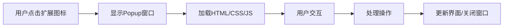

# 第6章：Popup 弹窗界面开发

## 学习目标
1. 理解Chrome扩展Popup的作用和特点
2. 掌握Popup页面的HTML、CSS、JavaScript开发
3. 学会Popup与Background Script的通信
4. 实现响应式设计和用户体验优化

## 6.1 Popup概述

Popup是用户点击扩展图标时显示的小窗口界面，是用户与扩展交互的主要入口。

### 6.1.1 Popup特点



:::tip 核心特性
- 小窗口界面，通常宽度320-800px
- 点击扩展图标外区域会自动关闭
- 每次打开都会重新加载
- 可以与Background Script通信
- 支持完整的Web技术栈
:::

### 6.1.2 Manifest配置

```json
{
  "manifest_version": 3,
  "name": "My Extension",
  "version": "1.0",
  "action": {
    "default_popup": "popup.html",
    "default_title": "我的扩展",
    "default_icon": {
      "16": "icons/icon16.png",
      "48": "icons/icon48.png",
      "128": "icons/icon128.png"
    }
  },
  "permissions": [
    "storage",
    "tabs"
  ]
}
```

## 6.2 HTML结构设计

### 6.2.1 基础HTML模板

```html
<!-- popup.html -->
<!DOCTYPE html>
<html lang="zh-CN">
<head>
  <meta charset="UTF-8">
  <meta name="viewport" content="width=device-width, initial-scale=1.0">
  <title>我的扩展</title>
  <link rel="stylesheet" href="popup.css">
</head>
<body>
  <div class="container">
    <!-- 头部区域 -->
    <header class="header">
      <div class="logo">
        
        <h1>我的扩展</h1>
      </div>
      <div class="status-indicator" id="statusIndicator">
        <span class="status-dot"></span>
        <span class="status-text">已连接</span>
      </div>
    </header>

    <!-- 主要内容区域 -->
    <main class="main-content">
      <!-- 功能按钮组 -->
      <section class="action-buttons">
        <button class="btn btn-primary" id="toggleFeature">
          <span class="btn-icon">🔧</span>
          <span class="btn-text">启用功能</span>
        </button>
        <button class="btn btn-secondary" id="analyzeePage">
          <span class="btn-icon">📊</span>
          <span class="btn-text">分析页面</span>
        </button>
      </section>

      <!-- 信息展示区域 -->
      <section class="info-section">
        <div class="info-card" id="pageInfo">
          <h3>页面信息</h3>
          <div class="info-content">
            <p class="url-info" id="urlInfo">等待获取...</p>
            <p class="title-info" id="titleInfo">等待获取...</p>
          </div>
        </div>

        <div class="info-card" id="statsInfo">
          <h3>使用统计</h3>
          <div class="stats-grid">
            <div class="stat-item">
              <span class="stat-value" id="clickCount">0</span>
              <span class="stat-label">点击次数</span>
            </div>
            <div class="stat-item">
              <span class="stat-value" id="activeTime">0</span>
              <span class="stat-label">活跃时间</span>
            </div>
          </div>
        </div>
      </section>

      <!-- 设置区域 -->
      <section class="settings-section">
        <div class="setting-item">
          <label class="setting-label">
            <input type="checkbox" id="autoMode" class="setting-checkbox">
            <span class="checkmark"></span>
            自动模式
          </label>
        </div>
        <div class="setting-item">
          <label class="setting-label">主题</label>
          <select id="themeSelect" class="setting-select">
            <option value="light">浅色</option>
            <option value="dark">深色</option>
            <option value="auto">跟随系统</option>
          </select>
        </div>
      </section>
    </main>

    <!-- 底部区域 -->
    <footer class="footer">
      <div class="footer-buttons">
        <button class="btn btn-small" id="settingsBtn">设置</button>
        <button class="btn btn-small" id="helpBtn">帮助</button>
      </div>
    </footer>
  </div>

  <!-- 加载指示器 -->
  <div class="loading-overlay" id="loadingOverlay" style="display: none;">
    <div class="spinner"></div>
    <p>处理中...</p>
  </div>

  <script src="popup.js"></script>
</body>
</html>
```

### 6.2.2 HTML生成器配置示例

```javascript
// popup-generator.js - Chrome扩展Popup HTML生成器
class PopupGenerator {
  constructor() {
    this.title = "Chrome扩展";
    this.width = 400;
    this.height = 600;
    this.theme = "light";
    this.components = [];
  }

  setConfig(title, width = 400, height = 600, theme = "light") {
    this.title = title;
    this.width = width;
    this.height = height;
    this.theme = theme;
  }

  addHeader(logoPath, statusText = "已连接") {
    this.components.push({
      type: "header",
      logo: logoPath,
      title: this.title,
      status: statusText
    });
  }

  addButtonGroup(buttons) {
    this.components.push({
      type: "button_group",
      buttons: buttons
    });
  }

  addInfoCard(title, contentType = "text", contentId = "") {
    this.components.push({
      type: "info_card",
      title: title,
      contentType: contentType,
      contentId: contentId
    });
  }

  addSettingsSection(settings) {
    this.components.push({
      type: "settings",
      settings: settings
    });
  }

  generateHTML() {
    const componentsHTML = this._generateComponents();
    return `<!DOCTYPE html>
<html lang="zh-CN">
<head>
    <meta charset="UTF-8">
    <meta name="viewport" content="width=device-width, initial-scale=1.0">
    <title>${this.title}</title>
    <link rel="stylesheet" href="popup.css">
    <style>
        body { width: ${this.width}px; min-height: ${this.height}px; }
    </style>
</head>
<body class="${this.theme}-theme">
    <div class="container">
        ${componentsHTML}
    </div>
    <script src="popup.js"></script>
</body>
</html>`;
  }

  _generateComponents() {
    return this.components.map(component => {
      switch (component.type) {
        case "header":
          return this._generateHeader(component);
        case "button_group":
          return this._generateButtonGroup(component);
        case "info_card":
          return this._generateInfoCard(component);
        case "settings":
          return this._generateSettings(component);
        default:
          return '';
      }
    }).join('\n');
  }

  _generateHeader(header) {
    return `
        <header class="header">
            <div class="logo">
                
                <h1>${header.title}</h1>
            </div>
            <div class="status-indicator">
                <span class="status-dot"></span>
                <span class="status-text">${header.status}</span>
            </div>
        </header>`;
  }

  _generateButtonGroup(buttonGroup) {
    const buttonsHTML = buttonGroup.buttons.map(button => `
            <button class="btn btn-${button.style || 'primary'}" id="${button.id}">
                <span class="btn-icon">${button.icon || '🔧'}</span>
                <span class="btn-text">${button.text}</span>
            </button>`).join('');

    return `
        <section class="action-buttons">
            ${buttonsHTML}
        </section>`;
  }

  _generateInfoCard(infoCard) {
    return `
        <section class="info-section">
            <div class="info-card" id="${infoCard.contentId}">
                <h3>${infoCard.title}</h3>
                <div class="info-content">
                    <p class="info-text">等待获取...</p>
                </div>
            </div>
        </section>`;
  }

  _generateSettings(settingsSection) {
    const settingsHTML = settingsSection.settings.map(setting => {
      if (setting.type === "checkbox") {
        return `
                <div class="setting-item">
                    <label class="setting-label">
                        <input type="checkbox" id="${setting.id}" class="setting-checkbox">
                        <span class="checkmark"></span>
                        ${setting.label}
                    </label>
                </div>`;
      } else if (setting.type === "select") {
        const optionsHTML = setting.options.map(option =>
          `<option value="${option.value}">${option.text}</option>`
        ).join('');

        return `
                <div class="setting-item">
                    <label class="setting-label">${setting.label}</label>
                    <select id="${setting.id}" class="setting-select">
                        ${optionsHTML}
                    </select>
                </div>`;
      }
      return '';
    }).join('');

    return `
        <section class="settings-section">
            ${settingsHTML}
        </section>`;
  }
}

// 使用示例
const generator = new PopupGenerator();
generator.setConfig("我的Chrome扩展", 400, 600, "light");

// 添加组件
generator.addHeader("icons/icon48.png", "已连接");

generator.addButtonGroup([
  { id: "toggleFeature", text: "启用功能", icon: "🔧", style: "primary" },
  { id: "analyzePage", text: "分析页面", icon: "📊", style: "secondary" }
]);

generator.addInfoCard("页面信息", "text", "pageInfo");

generator.addSettingsSection([
  { type: "checkbox", id: "autoMode", label: "自动模式" },
  {
    type: "select",
    id: "themeSelect",
    label: "主题",
    options: [
      { value: "light", text: "浅色" },
      { value: "dark", text: "深色" },
      { value: "auto", text: "跟随系统" }
    ]
  }
]);

// 生成HTML
const htmlContent = generator.generateHTML();
console.log("生成的Popup HTML:");
console.log(htmlContent.substring(0, 500) + "...");  // 显示前500字符
```

## 6.3 CSS样式设计

### 6.3.1 现代化样式

```css
/* popup.css */
:root {
  --primary-color: #4285f4;
  --secondary-color: #34a853;
  --danger-color: #ea4335;
  --warning-color: #fbbc05;
  --text-primary: #202124;
  --text-secondary: #5f6368;
  --background-primary: #ffffff;
  --background-secondary: #f8f9fa;
  --border-color: #dadce0;
  --shadow-light: 0 1px 3px rgba(0, 0, 0, 0.1);
  --shadow-medium: 0 4px 6px rgba(0, 0, 0, 0.1);
  --border-radius: 8px;
  --transition: all 0.2s ease;
}

/* 深色主题 */
.dark-theme {
  --text-primary: #e8eaed;
  --text-secondary: #9aa0a6;
  --background-primary: #202124;
  --background-secondary: #303134;
  --border-color: #5f6368;
}

* {
  margin: 0;
  padding: 0;
  box-sizing: border-box;
}

body {
  width: 400px;
  min-height: 500px;
  font-family: -apple-system, BlinkMacSystemFont, 'Segoe UI', Roboto, sans-serif;
  font-size: 14px;
  line-height: 1.5;
  color: var(--text-primary);
  background-color: var(--background-primary);
  overflow-x: hidden;
}

.container {
  display: flex;
  flex-direction: column;
  min-height: 100vh;
}

/* 头部样式 */
.header {
  padding: 16px;
  border-bottom: 1px solid var(--border-color);
  background-color: var(--background-primary);
}

.logo {
  display: flex;
  align-items: center;
  gap: 12px;
  margin-bottom: 8px;
}

.logo img {
  width: 24px;
  height: 24px;
  border-radius: 4px;
}

.logo h1 {
  font-size: 18px;
  font-weight: 500;
  color: var(--text-primary);
}

.status-indicator {
  display: flex;
  align-items: center;
  gap: 6px;
  font-size: 12px;
  color: var(--text-secondary);
}

.status-dot {
  width: 8px;
  height: 8px;
  border-radius: 50%;
  background-color: var(--secondary-color);
}

/* 主内容区域 */
.main-content {
  flex: 1;
  padding: 16px;
  display: flex;
  flex-direction: column;
  gap: 20px;
}

/* 按钮样式 */
.action-buttons {
  display: flex;
  flex-direction: column;
  gap: 8px;
}

.btn {
  display: flex;
  align-items: center;
  gap: 8px;
  padding: 12px 16px;
  border: none;
  border-radius: var(--border-radius);
  font-size: 14px;
  font-weight: 500;
  cursor: pointer;
  transition: var(--transition);
  text-align: left;
}

.btn:hover {
  transform: translateY(-1px);
  box-shadow: var(--shadow-medium);
}

.btn:active {
  transform: translateY(0);
}

.btn-primary {
  background-color: var(--primary-color);
  color: white;
}

.btn-primary:hover {
  background-color: #3367d6;
}

.btn-secondary {
  background-color: var(--background-secondary);
  color: var(--text-primary);
  border: 1px solid var(--border-color);
}

.btn-secondary:hover {
  background-color: var(--border-color);
}

.btn-small {
  padding: 8px 12px;
  font-size: 12px;
}

.btn-icon {
  font-size: 16px;
}

/* 信息卡片 */
.info-section {
  display: flex;
  flex-direction: column;
  gap: 12px;
}

.info-card {
  padding: 16px;
  border: 1px solid var(--border-color);
  border-radius: var(--border-radius);
  background-color: var(--background-secondary);
}

.info-card h3 {
  font-size: 14px;
  font-weight: 500;
  margin-bottom: 8px;
  color: var(--text-primary);
}

.info-content {
  font-size: 12px;
  color: var(--text-secondary);
}

.url-info, .title-info {
  margin-bottom: 4px;
  word-break: break-word;
}

/* 统计网格 */
.stats-grid {
  display: grid;
  grid-template-columns: 1fr 1fr;
  gap: 16px;
}

.stat-item {
  text-align: center;
}

.stat-value {
  display: block;
  font-size: 20px;
  font-weight: 600;
  color: var(--primary-color);
}

.stat-label {
  display: block;
  font-size: 11px;
  color: var(--text-secondary);
  margin-top: 2px;
}

/* 设置区域 */
.settings-section {
  display: flex;
  flex-direction: column;
  gap: 12px;
  padding-top: 12px;
  border-top: 1px solid var(--border-color);
}

.setting-item {
  display: flex;
  align-items: center;
  justify-content: space-between;
}

.setting-label {
  display: flex;
  align-items: center;
  gap: 8px;
  font-size: 13px;
  color: var(--text-primary);
  cursor: pointer;
}

/* 自定义复选框 */
.setting-checkbox {
  display: none;
}

.checkmark {
  width: 16px;
  height: 16px;
  border: 2px solid var(--border-color);
  border-radius: 3px;
  position: relative;
  transition: var(--transition);
}

.setting-checkbox:checked + .checkmark {
  background-color: var(--primary-color);
  border-color: var(--primary-color);
}

.setting-checkbox:checked + .checkmark::after {
  content: '✓';
  position: absolute;
  top: 50%;
  left: 50%;
  transform: translate(-50%, -50%);
  color: white;
  font-size: 10px;
  font-weight: bold;
}

/* 选择框 */
.setting-select {
  padding: 6px 8px;
  border: 1px solid var(--border-color);
  border-radius: 4px;
  background-color: var(--background-primary);
  color: var(--text-primary);
  font-size: 12px;
  cursor: pointer;
}

.setting-select:focus {
  outline: none;
  border-color: var(--primary-color);
  box-shadow: 0 0 0 2px rgba(66, 133, 244, 0.2);
}

/* 底部区域 */
.footer {
  padding: 12px 16px;
  border-top: 1px solid var(--border-color);
  background-color: var(--background-secondary);
}

.footer-buttons {
  display: flex;
  gap: 8px;
  justify-content: center;
}

/* 加载指示器 */
.loading-overlay {
  position: fixed;
  top: 0;
  left: 0;
  width: 100%;
  height: 100%;
  background-color: rgba(255, 255, 255, 0.9);
  display: flex;
  flex-direction: column;
  align-items: center;
  justify-content: center;
  z-index: 1000;
}

.spinner {
  width: 32px;
  height: 32px;
  border: 3px solid var(--border-color);
  border-top: 3px solid var(--primary-color);
  border-radius: 50%;
  animation: spin 1s linear infinite;
  margin-bottom: 16px;
}

@keyframes spin {
  0% { transform: rotate(0deg); }
  100% { transform: rotate(360deg); }
}

/* 响应式设计 */
@media (max-width: 320px) {
  body {
    width: 300px;
  }

  .container {
    padding: 0 8px;
  }

  .btn {
    padding: 10px 12px;
    font-size: 13px;
  }
}

/* 动画效果 */
.fade-in {
  animation: fadeIn 0.3s ease;
}

@keyframes fadeIn {
  from { opacity: 0; transform: translateY(10px); }
  to { opacity: 1; transform: translateY(0); }
}

.slide-in {
  animation: slideIn 0.3s ease;
}

@keyframes slideIn {
  from { transform: translateX(-100%); }
  to { transform: translateX(0); }
}

/* 焦点可访问性 */
button:focus,
select:focus,
input:focus {
  outline: 2px solid var(--primary-color);
  outline-offset: 2px;
}

/* 滚动条样式 */
::-webkit-scrollbar {
  width: 6px;
}

::-webkit-scrollbar-track {
  background: var(--background-secondary);
}

::-webkit-scrollbar-thumb {
  background: var(--border-color);
  border-radius: 3px;
}

::-webkit-scrollbar-thumb:hover {
  background: var(--text-secondary);
}
```

## 6.4 JavaScript交互逻辑

### 6.4.1 主要脚本文件

```javascript
// popup.js
class PopupManager {
  constructor() {
    this.isInitialized = false;
    this.currentTab = null;
    this.settings = {
      autoMode: false,
      theme: 'light'
    };

    this.init();
  }

  async init() {
    try {
      // 显示加载状态
      this.showLoading(true);

      // 获取当前标签页
      await this.getCurrentTab();

      // 加载设置
      await this.loadSettings();

      // 初始化UI
      this.initializeUI();

      // 绑定事件
      this.bindEvents();

      // 更新页面信息
      await this.updatePageInfo();

      // 更新统计信息
      await this.updateStats();

      this.isInitialized = true;
      this.showLoading(false);

    } catch (error) {
      console.error('初始化失败:', error);
      this.showError('初始化失败，请重试');
    }
  }

  async getCurrentTab() {
    const tabs = await chrome.tabs.query({ active: true, currentWindow: true });
    this.currentTab = tabs[0];
  }

  async loadSettings() {
    const result = await chrome.storage.sync.get(['autoMode', 'theme']);
    this.settings.autoMode = result.autoMode || false;
    this.settings.theme = result.theme || 'light';
  }

  initializeUI() {
    // 设置主题
    document.body.className = `${this.settings.theme}-theme`;

    // 设置复选框状态
    const autoModeCheckbox = document.getElementById('autoMode');
    if (autoModeCheckbox) {
      autoModeCheckbox.checked = this.settings.autoMode;
    }

    // 设置主题选择
    const themeSelect = document.getElementById('themeSelect');
    if (themeSelect) {
      themeSelect.value = this.settings.theme;
    }

    // 添加动画类
    document.querySelectorAll('.info-card, .action-buttons').forEach(el => {
      el.classList.add('fade-in');
    });
  }

  bindEvents() {
    // 功能开关按钮
    const toggleFeatureBtn = document.getElementById('toggleFeature');
    if (toggleFeatureBtn) {
      toggleFeatureBtn.addEventListener('click', () => this.toggleFeature());
    }

    // 分析页面按钮
    const analyzePageBtn = document.getElementById('analyzeePage');
    if (analyzePageBtn) {
      analyzePageBtn.addEventListener('click', () => this.analyzePage());
    }

    // 自动模式开关
    const autoModeCheckbox = document.getElementById('autoMode');
    if (autoModeCheckbox) {
      autoModeCheckbox.addEventListener('change', (e) => {
        this.updateSetting('autoMode', e.target.checked);
      });
    }

    // 主题选择
    const themeSelect = document.getElementById('themeSelect');
    if (themeSelect) {
      themeSelect.addEventListener('change', (e) => {
        this.updateTheme(e.target.value);
      });
    }

    // 设置按钮
    const settingsBtn = document.getElementById('settingsBtn');
    if (settingsBtn) {
      settingsBtn.addEventListener('click', () => this.openSettings());
    }

    // 帮助按钮
    const helpBtn = document.getElementById('helpBtn');
    if (helpBtn) {
      helpBtn.addEventListener('click', () => this.openHelp());
    }
  }

  async updatePageInfo() {
    if (!this.currentTab) return;

    const urlInfo = document.getElementById('urlInfo');
    const titleInfo = document.getElementById('titleInfo');

    if (urlInfo) {
      urlInfo.textContent = `URL: ${this.currentTab.url}`;
    }

    if (titleInfo) {
      titleInfo.textContent = `标题: ${this.currentTab.title}`;
    }
  }

  async updateStats() {
    try {
      // 从background script获取统计数据
      const response = await this.sendMessage({ action: 'getStats' });

      if (response.success) {
        const clickCount = document.getElementById('clickCount');
        const activeTime = document.getElementById('activeTime');

        if (clickCount) {
          clickCount.textContent = response.data.clickCount || 0;
        }

        if (activeTime) {
          activeTime.textContent = this.formatTime(response.data.activeTime || 0);
        }
      }
    } catch (error) {
      console.error('获取统计数据失败:', error);
    }
  }

  async toggleFeature() {
    try {
      this.showLoading(true);

      const response = await this.sendMessage({
        action: 'toggleFeature',
        tabId: this.currentTab.id
      });

      if (response.success) {
        // 更新按钮状态
        const btn = document.getElementById('toggleFeature');
        const btnText = btn.querySelector('.btn-text');

        if (response.enabled) {
          btnText.textContent = '禁用功能';
          btn.classList.add('btn-danger');
          btn.classList.remove('btn-primary');
        } else {
          btnText.textContent = '启用功能';
          btn.classList.add('btn-primary');
          btn.classList.remove('btn-danger');
        }

        this.showSuccess('功能已' + (response.enabled ? '启用' : '禁用'));
      } else {
        this.showError(response.error || '操作失败');
      }
    } catch (error) {
      this.showError('操作失败: ' + error.message);
    } finally {
      this.showLoading(false);
    }
  }

  async analyzePage() {
    try {
      this.showLoading(true);

      const response = await this.sendMessage({
        action: 'analyzePage',
        tabId: this.currentTab.id
      });

      if (response.success) {
        this.displayAnalysisResults(response.data);
        this.showSuccess('页面分析完成');
      } else {
        this.showError(response.error || '分析失败');
      }
    } catch (error) {
      this.showError('分析失败: ' + error.message);
    } finally {
      this.showLoading(false);
    }
  }

  displayAnalysisResults(data) {
    // 创建分析结果显示
    const resultsHtml = `
      <div class="analysis-results">
        <h4>分析结果</h4>
        <ul>
          <li>页面元素: ${data.elementCount} 个</li>
          <li>图片数量: ${data.imageCount} 个</li>
          <li>链接数量: ${data.linkCount} 个</li>
          <li>加载时间: ${data.loadTime}ms</li>
        </ul>
      </div>
    `;

    const pageInfo = document.getElementById('pageInfo');
    if (pageInfo) {
      pageInfo.querySelector('.info-content').innerHTML = resultsHtml;
    }
  }

  async updateSetting(key, value) {
    this.settings[key] = value;

    try {
      await chrome.storage.sync.set({ [key]: value });

      // 通知background script设置变更
      this.sendMessage({
        action: 'settingChanged',
        key: key,
        value: value
      });

    } catch (error) {
      console.error('保存设置失败:', error);
    }
  }

  async updateTheme(theme) {
    this.settings.theme = theme;
    document.body.className = `${theme}-theme`;

    await this.updateSetting('theme', theme);
  }

  openSettings() {
    chrome.runtime.openOptionsPage();
  }

  openHelp() {
    chrome.tabs.create({
      url: 'https://example.com/help'
    });
  }

  // 工具方法
  async sendMessage(message) {
    return new Promise((resolve) => {
      chrome.runtime.sendMessage(message, (response) => {
        resolve(response || { success: false, error: '无响应' });
      });
    });
  }

  formatTime(seconds) {
    const hours = Math.floor(seconds / 3600);
    const minutes = Math.floor((seconds % 3600) / 60);

    if (hours > 0) {
      return `${hours}h ${minutes}m`;
    } else {
      return `${minutes}m`;
    }
  }

  showLoading(show) {
    const overlay = document.getElementById('loadingOverlay');
    if (overlay) {
      overlay.style.display = show ? 'flex' : 'none';
    }
  }

  showSuccess(message) {
    this.showToast(message, 'success');
  }

  showError(message) {
    this.showToast(message, 'error');
  }

  showToast(message, type = 'info') {
    // 创建提示消息
    const toast = document.createElement('div');
    toast.className = `toast toast-${type}`;
    toast.textContent = message;

    // 添加样式
    toast.style.cssText = `
      position: fixed;
      top: 16px;
      right: 16px;
      padding: 12px 16px;
      border-radius: 4px;
      color: white;
      font-size: 12px;
      z-index: 10000;
      animation: slideIn 0.3s ease;
      background-color: ${type === 'success' ? '#34a853' : type === 'error' ? '#ea4335' : '#4285f4'};
    `;

    document.body.appendChild(toast);

    // 3秒后自动移除
    setTimeout(() => {
      toast.style.animation = 'fadeOut 0.3s ease';
      setTimeout(() => {
        if (toast.parentNode) {
          toast.parentNode.removeChild(toast);
        }
      }, 300);
    }, 3000);
  }
}

// 文档加载完成后初始化
document.addEventListener('DOMContentLoaded', () => {
  new PopupManager();
});

// 添加键盘快捷键支持
document.addEventListener('keydown', (e) => {
  // Ctrl/Cmd + K: 快速功能切换
  if ((e.ctrlKey || e.metaKey) && e.key === 'k') {
    e.preventDefault();
    document.getElementById('toggleFeature')?.click();
  }

  // Escape: 关闭弹窗
  if (e.key === 'Escape') {
    window.close();
  }
});
```

### 6.4.2 交互逻辑演示示例

```javascript
// popup-demo.js - Chrome扩展Popup交互管理演示
class PopupManagerDemo {
  constructor() {
    this.isInitialized = false;
    this.currentTab = null;
    this.settings = {
      autoMode: false,
      theme: 'light'
    };
    this.stats = {
      clickCount: 0,
      activeTime: 0
    };
  }

  async initialize() {
    console.log("初始化Popup管理器...");

    await this.loadCurrentTab();
    await this.loadSettings();
    await this.updateStats();

    this.isInitialized = true;
    console.log("Popup管理器初始化完成");
  }

  async loadCurrentTab() {
    // 模拟获取当前标签页
    this.currentTab = {
      id: 1,
      url: 'https://www.example.com',
      title: '示例页面',
      active: true
    };
    console.log(`加载标签页: ${this.currentTab.title}`);
  }

  async loadSettings() {
    // 模拟从存储加载设置
    console.log("加载设置:");
    for (const [key, value] of Object.entries(this.settings)) {
      console.log(`  ${key}: ${value}`);
    }
  }

  async updateStats() {
    // 模拟更新统计
    this.stats.clickCount += 1;
    this.stats.activeTime += 30; // 增加30秒活跃时间
    console.log(`统计更新: 点击次数=${this.stats.clickCount}, 活跃时间=${this.stats.activeTime}s`);
  }

  async toggleFeature() {
    try {
      // 模拟功能切换
      const currentState = this.settings.featureEnabled || false;
      const newState = !currentState;

      this.settings.featureEnabled = newState;

      console.log(`功能状态切换: ${currentState} -> ${newState}`);

      return {
        success: true,
        enabled: newState,
        message: `功能已${newState ? '启用' : '禁用'}`
      };

    } catch (error) {
      return {
        success: false,
        error: error.message
      };
    }
  }

  async analyzePage() {
    try {
      console.log("开始分析页面...");

      // 模拟页面分析
      await new Promise(resolve => setTimeout(resolve, 1000));

      const analysisData = {
        elementCount: 245,
        imageCount: 12,
        linkCount: 38,
        loadTime: 1250,
        timestamp: new Date().toISOString()
      };

      console.log("页面分析完成:");
      for (const [key, value] of Object.entries(analysisData)) {
        console.log(`  ${key}: ${value}`);
      }

      return {
        success: true,
        data: analysisData
      };

    } catch (error) {
      return {
        success: false,
        error: error.message
      };
    }
  }

  async updateSetting(key, value) {
    const oldValue = this.settings[key];
    this.settings[key] = value;

    console.log(`设置更新: ${key}: ${oldValue} -> ${value}`);

    // 模拟保存到存储
    await this.saveSettings();
  }

  async saveSettings() {
    console.log("保存设置到存储...");
    // 模拟存储操作
  }

  getPageInfo() {
    if (!this.currentTab) {
      return { url: '未知', title: '未知' };
    }

    return {
      url: this.currentTab.url,
      title: this.currentTab.title
    };
  }

  formatTime(seconds) {
    const hours = Math.floor(seconds / 3600);
    const minutes = Math.floor((seconds % 3600) / 60);

    if (hours > 0) {
      return `${hours}h ${minutes}m`;
    } else {
      return `${minutes}m`;
    }
  }
}

// 使用示例
async function demoPopupInteraction() {
  const popup = new PopupManagerDemo();

  // 初始化
  await popup.initialize();

  // 获取页面信息
  const pageInfo = popup.getPageInfo();
  console.log('\n页面信息:');
  console.log(`  URL: ${pageInfo.url}`);
  console.log(`  标题: ${pageInfo.title}`);

  // 切换功能
  const result = await popup.toggleFeature();
  console.log('\n功能切换结果:', result);

  // 分析页面
  const analysisResult = await popup.analyzePage();
  console.log('\n分析结果:', analysisResult);

  // 更新设置
  await popup.updateSetting('autoMode', true);
  await popup.updateSetting('theme', 'dark');

  // 显示格式化时间
  const formattedTime = popup.formatTime(popup.stats.activeTime);
  console.log(`\n格式化时间: ${formattedTime}`);
}

// 运行演示（注释掉实际执行）
// demoPopupInteraction();
```

## 6.5 与Background Script通信

### 6.5.1 消息传递机制

```javascript
// background.js 中的消息处理
chrome.runtime.onMessage.addListener((message, sender, sendResponse) => {
  console.log('Background收到消息:', message);

  switch (message.action) {
    case 'getStats':
      handleGetStats(sendResponse);
      return true; // 异步响应

    case 'toggleFeature':
      handleToggleFeature(message.tabId, sendResponse);
      return true;

    case 'analyzePage':
      handleAnalyzePage(message.tabId, sendResponse);
      return true;

    case 'settingChanged':
      handleSettingChanged(message.key, message.value, sendResponse);
      return true;

    default:
      sendResponse({ success: false, error: '未知操作' });
  }
});

async function handleGetStats(sendResponse) {
  try {
    const stats = await chrome.storage.local.get(['clickCount', 'activeTime']);
    sendResponse({
      success: true,
      data: {
        clickCount: stats.clickCount || 0,
        activeTime: stats.activeTime || 0
      }
    });
  } catch (error) {
    sendResponse({ success: false, error: error.message });
  }
}

async function handleToggleFeature(tabId, sendResponse) {
  try {
    // 获取当前功能状态
    const result = await chrome.storage.sync.get(['featureEnabled']);
    const currentState = result.featureEnabled || false;
    const newState = !currentState;

    // 保存新状态
    await chrome.storage.sync.set({ featureEnabled: newState });

    // 向content script发送消息
    chrome.tabs.sendMessage(tabId, {
      action: 'updateFeatureState',
      enabled: newState
    });

    sendResponse({
      success: true,
      enabled: newState
    });

    // 更新点击统计
    const stats = await chrome.storage.local.get(['clickCount']);
    await chrome.storage.local.set({
      clickCount: (stats.clickCount || 0) + 1
    });

  } catch (error) {
    sendResponse({ success: false, error: error.message });
  }
}

async function handleAnalyzePage(tabId, sendResponse) {
  try {
    // 执行页面分析脚本
    const results = await chrome.scripting.executeScript({
      target: { tabId: tabId },
      func: analyzePageContent
    });

    if (results && results[0]) {
      sendResponse({
        success: true,
        data: results[0].result
      });
    } else {
      sendResponse({ success: false, error: '分析失败' });
    }

  } catch (error) {
    sendResponse({ success: false, error: error.message });
  }
}

// 页面分析函数（注入到页面中执行）
function analyzePageContent() {
  const elements = document.querySelectorAll('*');
  const images = document.querySelectorAll('img');
  const links = document.querySelectorAll('a');

  const performanceEntries = performance.getEntriesByType('navigation');
  const loadTime = performanceEntries.length > 0
    ? Math.round(performanceEntries[0].loadEventEnd - performanceEntries[0].fetchStart)
    : 0;

  return {
    elementCount: elements.length,
    imageCount: images.length,
    linkCount: links.length,
    loadTime: loadTime
  };
}
```

:::warning 常见问题
1. **消息超时**: 在sendResponse前使用`return true`保持消息通道开启
2. **上下文丢失**: Popup关闭后所有状态都会丢失，需要存储重要数据
3. **权限限制**: 某些API需要相应的权限声明
4. **跨域问题**: 访问外部资源需要在manifest中声明
:::

## 6.6 响应式设计和优化

### 6.6.1 自适应布局

```css
/* 响应式断点 */
@media (max-width: 400px) {
  body {
    width: 320px;
  }

  .stats-grid {
    grid-template-columns: 1fr;
    gap: 8px;
  }

  .action-buttons {
    flex-direction: column;
  }
}

@media (max-height: 500px) {
  .main-content {
    gap: 12px;
  }

  .info-card {
    padding: 12px;
  }
}

/* 高DPI屏幕优化 */
@media (-webkit-min-device-pixel-ratio: 2), (min-resolution: 2dppx) {
  .logo img {
    image-rendering: -webkit-optimize-contrast;
    image-rendering: crisp-edges;
  }
}
```

### 6.6.2 性能优化

```javascript
// 防抖函数
function debounce(func, wait) {
  let timeout;
  return function executedFunction(...args) {
    const later = () => {
      clearTimeout(timeout);
      func(...args);
    };
    clearTimeout(timeout);
    timeout = setTimeout(later, wait);
  };
}

// 优化的设置更新
const updateSettingDebounced = debounce(async (key, value) => {
  await chrome.storage.sync.set({ [key]: value });
}, 300);

// 虚拟滚动（对大列表数据）
class VirtualList {
  constructor(container, itemHeight, renderItem) {
    this.container = container;
    this.itemHeight = itemHeight;
    this.renderItem = renderItem;
    this.items = [];
    this.visibleStart = 0;
    this.visibleEnd = 0;
  }

  setItems(items) {
    this.items = items;
    this.update();
  }

  update() {
    const containerHeight = this.container.clientHeight;
    const visibleCount = Math.ceil(containerHeight / this.itemHeight);
    const startIndex = Math.max(0, this.visibleStart);
    const endIndex = Math.min(this.items.length, startIndex + visibleCount + 1);

    // 清空容器
    this.container.innerHTML = '';

    // 渲染可见项目
    for (let i = startIndex; i < endIndex; i++) {
      const element = this.renderItem(this.items[i], i);
      element.style.position = 'absolute';
      element.style.top = `${i * this.itemHeight}px`;
      element.style.height = `${this.itemHeight}px`;
      this.container.appendChild(element);
    }

    // 设置容器总高度
    this.container.style.height = `${this.items.length * this.itemHeight}px`;
  }
}
```

:::tip 优化建议
1. **减小包体积**: 压缩CSS/JS文件，移除未使用的代码
2. **懒加载**: 延迟加载非关键内容
3. **缓存策略**: 合理使用localStorage缓存
4. **动画优化**: 使用CSS transform替代位置变化
5. **图片优化**: 使用WebP格式，设置合适的尺寸
:::

:::note 总结
本章详细介绍了Chrome扩展Popup界面的开发，包括HTML结构设计、CSS样式编写、JavaScript交互逻辑实现，以及与Background Script的通信机制。掌握这些技能将帮助你创建用户友好的扩展界面。下一章我们将学习如何开发Options选项页面，提供更丰富的配置功能。
:::