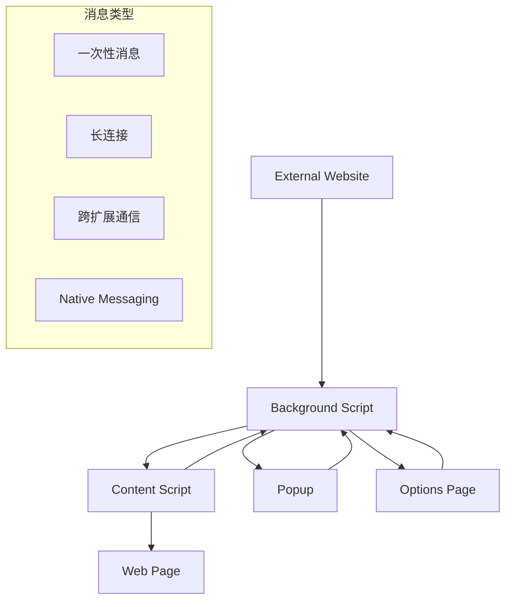

# 第8章：消息传递机制

## 学习目标
1. 理解Chrome扩展的消息传递架构
2. 掌握不同组件间的通信方式
3. 学会处理异步消息和错误
4. 实现高效的数据传输策略

## 8.1 消息传递概述

Chrome扩展的消息传递机制是连接各个组件的桥梁，实现background script、content script、popup和options页面之间的通信。

### 8.1.1 消息传递架构



:::tip 通信特点
- 基于JSON的消息格式
- 异步通信模式
- 支持请求-响应模式
- 可以传递复杂数据结构
- 具备错误处理机制
:::

### 8.1.2 消息类型分类

```javascript
// 消息类型定义
const MessageTypes = {
  // 一次性消息
  SIMPLE_REQUEST: 'simple_request',

  // 长连接消息
  PORT_CONNECT: 'port_connect',

  // 扩展内部通信
  INTERNAL_COMMAND: 'internal_command',

  // 外部通信
  EXTERNAL_REQUEST: 'external_request'
};

// 消息结构标准
const MessageStructure = {
  action: 'string',      // 操作类型
  data: 'any',          // 数据载荷
  timestamp: 'number',   // 时间戳
  requestId: 'string',   // 请求ID（可选）
  source: 'string'       // 来源标识
};
```

## 8.2 一次性消息传递

### 8.2.1 基本消息发送

```javascript
// background.js - 消息监听
chrome.runtime.onMessage.addListener((message, sender, sendResponse) => {
  console.log('收到消息:', message, '来自:', sender);

  switch (message.action) {
    case 'getUserData':
      handleGetUserData(message, sendResponse);
      return true; // 保持消息通道开启

    case 'updateSettings':
      handleUpdateSettings(message.data, sendResponse);
      return true;

    case 'performAction':
      handlePerformAction(message, sender, sendResponse);
      return true;

    default:
      sendResponse({
        success: false,
        error: '未知操作类型'
      });
  }
});

// 处理获取用户数据
async function handleGetUserData(message, sendResponse) {
  try {
    const userData = await chrome.storage.sync.get(['userProfile', 'preferences']);

    sendResponse({
      success: true,
      data: {
        profile: userData.userProfile,
        preferences: userData.preferences
      }
    });
  } catch (error) {
    sendResponse({
      success: false,
      error: error.message
    });
  }
}

// 处理设置更新
async function handleUpdateSettings(settings, sendResponse) {
  try {
    await chrome.storage.sync.set(settings);

    // 通知其他组件设置已更新
    chrome.tabs.query({}, (tabs) => {
      tabs.forEach(tab => {
        chrome.tabs.sendMessage(tab.id, {
          action: 'settingsUpdated',
          data: settings
        }).catch(() => {
          // 忽略无法发送消息的标签页
        });
      });
    });

    sendResponse({ success: true });
  } catch (error) {
    sendResponse({
      success: false,
      error: error.message
    });
  }
}
```

### 8.2.2 从Content Script发送消息

```javascript
// content-script.js
class ContentScriptMessenger {
  constructor() {
    this.requestCounter = 0;
    this.pendingRequests = new Map();
  }

  // 生成请求ID
  generateRequestId() {
    return `req_${++this.requestCounter}_${Date.now()}`;
  }

  // 发送消息并返回Promise
  sendMessage(action, data = null) {
    return new Promise((resolve, reject) => {
      const requestId = this.generateRequestId();
      const message = {
        action,
        data,
        requestId,
        timestamp: Date.now(),
        source: 'content-script'
      };

      // 设置超时
      const timeout = setTimeout(() => {
        this.pendingRequests.delete(requestId);
        reject(new Error('消息发送超时'));
      }, 10000); // 10秒超时

      this.pendingRequests.set(requestId, { resolve, reject, timeout });

      chrome.runtime.sendMessage(message, (response) => {
        const request = this.pendingRequests.get(requestId);

        if (request) {
          clearTimeout(request.timeout);
          this.pendingRequests.delete(requestId);

          if (chrome.runtime.lastError) {
            reject(new Error(chrome.runtime.lastError.message));
          } else if (response && response.success === false) {
            reject(new Error(response.error || '操作失败'));
          } else {
            resolve(response);
          }
        }
      });
    });
  }

  // 批量发送消息
  async sendBatchMessages(messages) {
    const promises = messages.map(msg =>
      this.sendMessage(msg.action, msg.data)
    );

    try {
      const results = await Promise.allSettled(promises);
      return results.map((result, index) => ({
        index,
        success: result.status === 'fulfilled',
        data: result.status === 'fulfilled' ? result.value : null,
        error: result.status === 'rejected' ? result.reason.message : null
      }));
    } catch (error) {
      throw new Error(`批量消息发送失败: ${error.message}`);
    }
  }

  // 监听来自background的消息
  setupMessageListener() {
    chrome.runtime.onMessage.addListener((message, sender, sendResponse) => {
      console.log('Content script收到消息:', message);

      switch (message.action) {
        case 'settingsUpdated':
          this.handleSettingsUpdate(message.data);
          sendResponse({ received: true });
          break;

        case 'pageAction':
          this.handlePageAction(message.data, sendResponse);
          return true;

        case 'extractData':
          this.handleDataExtraction(message.data, sendResponse);
          return true;

        default:
          sendResponse({ error: '未处理的消息类型' });
      }
    });
  }

  handleSettingsUpdate(settings) {
    // 应用新设置到页面
    console.log('应用新设置:', settings);

    if (settings.theme) {
      this.applyTheme(settings.theme);
    }

    if (settings.fontSize) {
      this.adjustFontSize(settings.fontSize);
    }
  }

  async handlePageAction(actionData, sendResponse) {
    try {
      let result;

      switch (actionData.type) {
        case 'highlight':
          result = this.highlightText(actionData.text);
          break;

        case 'extract':
          result = this.extractPageData(actionData.selector);
          break;

        case 'modify':
          result = this.modifyContent(actionData.changes);
          break;

        default:
          throw new Error('未知的页面操作类型');
      }

      sendResponse({ success: true, result });
    } catch (error) {
      sendResponse({ success: false, error: error.message });
    }
  }

  extractPageData(selector) {
    const elements = document.querySelectorAll(selector || '*');
    const data = [];

    elements.forEach((element, index) => {
      if (index < 100) { // 限制数量避免数据过大
        data.push({
          tag: element.tagName.toLowerCase(),
          text: element.textContent.substring(0, 200),
          attributes: this.getElementAttributes(element)
        });
      }
    });

    return {
      count: elements.length,
      data: data,
      url: window.location.href,
      title: document.title
    };
  }

  getElementAttributes(element) {
    const attrs = {};
    for (let attr of element.attributes) {
      attrs[attr.name] = attr.value;
    }
    return attrs;
  }
}

// 初始化消息处理器
const messenger = new ContentScriptMessenger();
messenger.setupMessageListener();

// 使用示例
async function exampleUsage() {
  try {
    // 获取用户数据
    const userData = await messenger.sendMessage('getUserData');
    console.log('用户数据:', userData);

    // 更新设置
    await messenger.sendMessage('updateSettings', {
      theme: 'dark',
      autoSave: true
    });

    // 批量发送消息
    const batchResults = await messenger.sendBatchMessages([
      { action: 'getStats', data: null },
      { action: 'checkUpdates', data: null },
      { action: 'syncData', data: { force: true } }
    ]);

    console.log('批量操作结果:', batchResults);

  } catch (error) {
    console.error('消息发送失败:', error);
  }
}
```

### 8.2.3 消息传递系统架构

#### 消息源类型定义

```javascript
// 消息源枚举
const MessageSource = {
  BACKGROUND: 'background',
  CONTENT_SCRIPT: 'content_script',
  POPUP: 'popup',
  OPTIONS: 'options'
};

// 消息对象结构
class Message {
  constructor(action, data = null, source = MessageSource.BACKGROUND) {
    this.action = action;
    this.data = data;
    this.source = source;
    this.requestId = this.generateRequestId();
    this.timestamp = Date.now();
  }

  generateRequestId() {
    return `${Date.now()}_${Math.random().toString(36).substr(2, 9)}`;
  }
}
```

#### 消息总线实现

```javascript
// 模拟Chrome扩展消息总线
class MessageBus {
  constructor() {
    this.listeners = {
      [MessageSource.BACKGROUND]: [],
      [MessageSource.CONTENT_SCRIPT]: [],
      [MessageSource.POPUP]: [],
      [MessageSource.OPTIONS]: []
    };
    this.pendingResponses = new Map();
    this.responseTimeout = 10000; // 10秒超时
  }

  // 添加消息监听器
  addListener(source, callback) {
    this.listeners[source].push(callback);
    console.log(`为 ${source} 添加了消息监听器`);
  }

  // 发送消息
  async sendMessage(message, target) {
    console.log(`发送消息: ${message.action} 从 ${message.source} 到 ${target}`);

    return new Promise((resolve, reject) => {
      const timeoutId = setTimeout(() => {
        this.pendingResponses.delete(message.requestId);
        reject(new Error('消息发送超时'));
      }, this.responseTimeout);

      this.pendingResponses.set(message.requestId, { resolve, reject, timeoutId });

      // 查找目标监听器
      const targetListeners = this.listeners[target] || [];

      if (targetListeners.length === 0) {
        clearTimeout(timeoutId);
        this.pendingResponses.delete(message.requestId);
        reject(new Error(`没有找到 ${target} 的监听器`));
        return;
      }

      // 调用第一个监听器（模拟Chrome的行为）
      const listener = targetListeners[0];
      this.handleMessage(message, listener).catch(error => {
        const pending = this.pendingResponses.get(message.requestId);
        if (pending) {
          clearTimeout(pending.timeoutId);
          this.pendingResponses.delete(message.requestId);
          reject(error);
        }
      });
    });
  }

  // 处理消息
  async handleMessage(message, listener) {
    const sendResponse = (responseData) => {
      const pending = this.pendingResponses.get(message.requestId);
      if (pending) {
        clearTimeout(pending.timeoutId);
        pending.resolve(responseData);
        this.pendingResponses.delete(message.requestId);
      }
    };

    try {
      await listener(message, sendResponse);
    } catch (error) {
      sendResponse({
        success: false,
        error: error.message
      });
    }
  }
}
```

#### Background Script模拟

```javascript
// 模拟Background Script
class BackgroundScript {
  constructor(messageBus) {
    this.messageBus = messageBus;
    this.storage = {};
    messageBus.addListener(MessageSource.BACKGROUND, this.handleMessage.bind(this));
  }

  async handleMessage(message, sendResponse) {
    console.log(`Background处理消息: ${message.action}`);

    try {
      switch (message.action) {
        case 'getUserData':
          sendResponse({
            success: true,
            data: {
              profile: this.storage.userProfile || {},
              preferences: this.storage.preferences || {}
            }
          });
          break;

        case 'updateSettings':
          Object.assign(this.storage, message.data);
          await this.broadcastSettingsUpdate(message.data);
          sendResponse({ success: true });
          break;

        case 'getStats':
          // 模拟异步操作
          await new Promise(resolve => setTimeout(resolve, 100));
          sendResponse({
            success: true,
            data: {
              clickCount: 42,
              activeTime: 3600,
              lastUpdate: Date.now()
            }
          });
          break;

        default:
          sendResponse({
            success: false,
            error: `未知操作: ${message.action}`
          });
      }
    } catch (error) {
      sendResponse({
        success: false,
        error: error.message
      });
    }
  }

  async broadcastSettingsUpdate(settings) {
    const updateMessage = new Message(
      'settingsUpdated',
      settings,
      MessageSource.BACKGROUND
    );

    try {
      await this.messageBus.sendMessage(
        updateMessage,
        MessageSource.CONTENT_SCRIPT
      );
    } catch (error) {
      console.error('广播设置更新失败:', error);
    }
  }
}
```

#### Content Script模拟

```javascript
// 模拟Content Script
class ContentScript {
  constructor(messageBus) {
    this.messageBus = messageBus;
    this.pageData = {
      url: 'https://example.com',
      title: '示例页面',
      elements: ['div', 'p', 'span', 'a']
    };
    messageBus.addListener(MessageSource.CONTENT_SCRIPT, this.handleMessage.bind(this));
  }

  async handleMessage(message, sendResponse) {
    console.log(`Content Script处理消息: ${message.action}`);

    try {
      switch (message.action) {
        case 'extractData':
          sendResponse({
            success: true,
            data: {
              url: this.pageData.url,
              title: this.pageData.title,
              elements: this.pageData.elements.length,
              timestamp: Date.now()
            }
          });
          break;

        case 'settingsUpdated':
          console.log('应用新设置:', message.data);
          sendResponse({ received: true });
          break;

        case 'pageAction':
          const result = await this.performPageAction(message.data);
          sendResponse({
            success: true,
            result: result
          });
          break;

        default:
          sendResponse({
            success: false,
            error: `未处理的消息类型: ${message.action}`
          });
      }
    } catch (error) {
      sendResponse({
        success: false,
        error: error.message
      });
    }
  }

  async performPageAction(actionData) {
    const actionType = actionData.type;

    switch (actionType) {
      case 'highlight':
        return { highlighted: true, text: actionData.text };
      case 'extract':
        return { extracted: this.pageData };
      case 'modify':
        return { modified: true, changes: actionData.changes };
      default:
        throw new Error(`未知操作类型: ${actionType}`);
    }
  }

  async sendToBackground(action, data = null) {
    const message = new Message(action, data, MessageSource.CONTENT_SCRIPT);
    return await this.messageBus.sendMessage(message, MessageSource.BACKGROUND);
  }
}
```

#### Popup Script模拟

```javascript
// 模拟Popup Script
class PopupScript {
  constructor(messageBus) {
    this.messageBus = messageBus;
    messageBus.addListener(MessageSource.POPUP, this.handleMessage.bind(this));
  }

  async handleMessage(message, sendResponse) {
    console.log(`Popup处理消息: ${message.action}`);
    sendResponse({ received: true });
  }

  async getUserData() {
    const message = new Message('getUserData', null, MessageSource.POPUP);
    return await this.messageBus.sendMessage(message, MessageSource.BACKGROUND);
  }

  async updateSettings(settings) {
    const message = new Message('updateSettings', settings, MessageSource.POPUP);
    return await this.messageBus.sendMessage(message, MessageSource.BACKGROUND);
  }
}
```

#### 使用示例

```javascript
// 演示消息传递系统
async function demoMessageSystem() {
  console.log('=== Chrome扩展消息传递系统演示 ===\n');

  // 创建消息总线和组件
  const messageBus = new MessageBus();
  const background = new BackgroundScript(messageBus);
  const contentScript = new ContentScript(messageBus);
  const popup = new PopupScript(messageBus);

  try {
    // 1. Popup获取用户数据
    console.log('1. Popup获取用户数据:');
    const userData = await popup.getUserData();
    console.log('   结果:', userData);

    // 2. Popup更新设置
    console.log('\n2. Popup更新设置:');
    const updateResult = await popup.updateSettings({
      theme: 'dark',
      autoSave: true
    });
    console.log('   结果:', updateResult);

    // 3. Content Script发送数据到Background
    console.log('\n3. Content Script发送数据到Background:');
    const statsResult = await contentScript.sendToBackground('getStats');
    console.log('   结果:', statsResult);

    // 4. 向Content Script发送页面操作指令
    console.log('\n4. 向Content Script发送页面操作指令:');
    const pageActionMessage = new Message(
      'pageAction',
      { type: 'extract', selector: 'div' },
      MessageSource.BACKGROUND
    );
    const actionResult = await messageBus.sendMessage(
      pageActionMessage,
      MessageSource.CONTENT_SCRIPT
    );
    console.log('   结果:', actionResult);

    console.log('\n=== 演示完成 ===');
  } catch (error) {
    console.error('演示过程中出错:', error);
  }
}

// 运行演示
// demoMessageSystem();
```

## 8.3 长连接通信（Port）

### 8.3.1 建立长连接

```javascript
// background.js - 长连接处理
class ConnectionManager {
  constructor() {
    this.activeConnections = new Map();
    this.setupConnectionListener();
  }

  setupConnectionListener() {
    chrome.runtime.onConnect.addListener((port) => {
      console.log('新连接建立:', port.name);

      const connectionId = this.generateConnectionId();

      const connection = {
        id: connectionId,
        port: port,
        type: port.name,
        sender: port.sender,
        createdAt: Date.now(),
        lastActivity: Date.now()
      };

      this.activeConnections.set(connectionId, connection);

      // 设置消息监听
      port.onMessage.addListener((message) => {
        this.handlePortMessage(connectionId, message);
      });

      // 设置断开连接监听
      port.onDisconnect.addListener(() => {
        this.handlePortDisconnect(connectionId);
      });

      // 发送连接确认
      port.postMessage({
        type: 'connectionEstablished',
        connectionId: connectionId,
        timestamp: Date.now()
      });
    });
  }

  generateConnectionId() {
    return `conn_${Date.now()}_${Math.random().toString(36).substr(2, 9)}`;
  }

  handlePortMessage(connectionId, message) {
    const connection = this.activeConnections.get(connectionId);
    if (!connection) return;

    // 更新活动时间
    connection.lastActivity = Date.now();

    console.log(`连接 ${connectionId} 收到消息:`, message);

    switch (message.type) {
      case 'subscribe':
        this.handleSubscription(connectionId, message.data);
        break;

      case 'unsubscribe':
        this.handleUnsubscription(connectionId, message.data);
        break;

      case 'dataRequest':
        this.handleDataRequest(connectionId, message.data);
        break;

      case 'liveUpdate':
        this.handleLiveUpdate(connectionId, message.data);
        break;

      default:
        this.sendToConnection(connectionId, {
          type: 'error',
          message: '未知消息类型'
        });
    }
  }

  handlePortDisconnect(connectionId) {
    const connection = this.activeConnections.get(connectionId);
    if (connection) {
      console.log(`连接 ${connectionId} 已断开`);
      this.activeConnections.delete(connectionId);
    }
  }

  sendToConnection(connectionId, message) {
    const connection = this.activeConnections.get(connectionId);
    if (connection && connection.port) {
      try {
        connection.port.postMessage({
          ...message,
          timestamp: Date.now(),
          connectionId: connectionId
        });
      } catch (error) {
        console.error(`发送消息到连接 ${connectionId} 失败:`, error);
        this.activeConnections.delete(connectionId);
      }
    }
  }

  // 广播消息到所有连接
  broadcast(message, filter = null) {
    for (const [connectionId, connection] of this.activeConnections) {
      if (!filter || filter(connection)) {
        this.sendToConnection(connectionId, message);
      }
    }
  }

  // 广播到特定类型的连接
  broadcastToType(connectionType, message) {
    this.broadcast(message, (conn) => conn.type === connectionType);
  }

  handleSubscription(connectionId, subscriptionData) {
    const connection = this.activeConnections.get(connectionId);
    if (!connection) return;

    if (!connection.subscriptions) {
      connection.subscriptions = new Set();
    }

    connection.subscriptions.add(subscriptionData.topic);

    this.sendToConnection(connectionId, {
      type: 'subscribed',
      topic: subscriptionData.topic,
      message: `已订阅 ${subscriptionData.topic}`
    });

    // 发送初始数据
    this.sendTopicData(connectionId, subscriptionData.topic);
  }

  sendTopicData(connectionId, topic) {
    let data;

    switch (topic) {
      case 'stats':
        data = {
          clickCount: 42,
          activeTime: 3600,
          lastUpdate: Date.now()
        };
        break;

      case 'notifications':
        data = {
          unreadCount: 5,
          latest: 'New update available'
        };
        break;

      default:
        data = { message: `没有 ${topic} 的数据` };
    }

    this.sendToConnection(connectionId, {
      type: 'topicData',
      topic: topic,
      data: data
    });
  }
}

// 实例化连接管理器
const connectionManager = new ConnectionManager();

// 定期向订阅了stats的连接发送更新
setInterval(() => {
  const statsUpdate = {
    type: 'topicData',
    topic: 'stats',
    data: {
      clickCount: Math.floor(Math.random() * 100),
      activeTime: Math.floor(Math.random() * 10000),
      lastUpdate: Date.now()
    }
  };

  connectionManager.broadcast(statsUpdate, (conn) => {
    return conn.subscriptions && conn.subscriptions.has('stats');
  });
}, 5000); // 每5秒更新一次
```

### 8.3.2 客户端长连接

```javascript
// popup.js 或 content-script.js - 长连接客户端
class LongConnectionClient {
  constructor(connectionName) {
    this.connectionName = connectionName;
    this.port = null;
    this.connectionId = null;
    this.isConnected = false;
    this.reconnectAttempts = 0;
    this.maxReconnectAttempts = 5;
    this.reconnectDelay = 1000; // 1秒
    this.subscriptions = new Set();
    this.messageHandlers = new Map();

    this.connect();
  }

  connect() {
    try {
      console.log(`建立连接: ${this.connectionName}`);

      this.port = chrome.runtime.connect({ name: this.connectionName });

      this.port.onMessage.addListener((message) => {
        this.handleMessage(message);
      });

      this.port.onDisconnect.addListener(() => {
        this.handleDisconnect();
      });

    } catch (error) {
      console.error('建立连接失败:', error);
      this.scheduleReconnect();
    }
  }

  handleMessage(message) {
    console.log('收到端口消息:', message);

    switch (message.type) {
      case 'connectionEstablished':
        this.onConnectionEstablished(message);
        break;

      case 'subscribed':
        console.log(`订阅成功: ${message.topic}`);
        break;

      case 'topicData':
        this.handleTopicData(message);
        break;

      case 'error':
        console.error('服务器错误:', message.message);
        break;

      default:
        // 调用自定义消息处理器
        const handler = this.messageHandlers.get(message.type);
        if (handler) {
          handler(message);
        }
    }
  }

  onConnectionEstablished(message) {
    this.connectionId = message.connectionId;
    this.isConnected = true;
    this.reconnectAttempts = 0;

    console.log(`连接已建立: ${this.connectionId}`);

    // 恢复订阅
    this.subscriptions.forEach(topic => {
      this.subscribe(topic);
    });

    // 触发连接成功事件
    this.onConnected();
  }

  handleDisconnect() {
    console.log('连接已断开');
    this.isConnected = false;
    this.connectionId = null;

    this.onDisconnected();
    this.scheduleReconnect();
  }

  scheduleReconnect() {
    if (this.reconnectAttempts < this.maxReconnectAttempts) {
      this.reconnectAttempts++;
      const delay = this.reconnectDelay * this.reconnectAttempts;

      console.log(`${delay}ms后尝试重连 (${this.reconnectAttempts}/${this.maxReconnectAttempts})`);

      setTimeout(() => {
        this.connect();
      }, delay);
    } else {
      console.error('重连次数已达上限');
    }
  }

  // 发送消息
  sendMessage(message) {
    if (this.isConnected && this.port) {
      try {
        this.port.postMessage(message);
        return true;
      } catch (error) {
        console.error('发送消息失败:', error);
        return false;
      }
    } else {
      console.warn('连接未建立，无法发送消息');
      return false;
    }
  }

  // 订阅主题
  subscribe(topic) {
    this.subscriptions.add(topic);

    if (this.isConnected) {
      this.sendMessage({
        type: 'subscribe',
        data: { topic: topic }
      });
    }
  }

  // 取消订阅
  unsubscribe(topic) {
    this.subscriptions.delete(topic);

    if (this.isConnected) {
      this.sendMessage({
        type: 'unsubscribe',
        data: { topic: topic }
      });
    }
  }

  // 注册消息处理器
  onMessage(messageType, handler) {
    this.messageHandlers.set(messageType, handler);
  }

  // 处理主题数据
  handleTopicData(message) {
    const topic = message.topic;
    const data = message.data;

    console.log(`收到主题数据 ${topic}:`, data);

    // 触发主题特定的处理
    const event = new CustomEvent(`topic:${topic}`, {
      detail: data
    });
    document.dispatchEvent(event);
  }

  // 连接成功回调（可重写）
  onConnected() {
    console.log('连接成功回调');
  }

  // 连接断开回调（可重写）
  onDisconnected() {
    console.log('连接断开回调');
  }

  // 断开连接
  disconnect() {
    if (this.port) {
      this.port.disconnect();
    }
  }
}

// 实际使用示例
class StatsDisplayClient extends LongConnectionClient {
  constructor() {
    super('statsDisplay');

    this.setupEventListeners();
  }

  onConnected() {
    super.onConnected();

    // 连接成功后订阅统计数据
    this.subscribe('stats');
    this.subscribe('notifications');
  }

  setupEventListeners() {
    // 监听统计数据更新
    document.addEventListener('topic:stats', (event) => {
      this.updateStatsDisplay(event.detail);
    });

    // 监听通知更新
    document.addEventListener('topic:notifications', (event) => {
      this.updateNotifications(event.detail);
    });
  }

  updateStatsDisplay(statsData) {
    const clickCountElement = document.getElementById('clickCount');
    const activeTimeElement = document.getElementById('activeTime');

    if (clickCountElement) {
      clickCountElement.textContent = statsData.clickCount;
    }

    if (activeTimeElement) {
      activeTimeElement.textContent = this.formatTime(statsData.activeTime);
    }
  }

  updateNotifications(notificationData) {
    const notificationBadge = document.getElementById('notificationBadge');

    if (notificationBadge) {
      notificationBadge.textContent = notificationData.unreadCount;
      notificationBadge.style.display = notificationData.unreadCount > 0 ? 'block' : 'none';
    }
  }

  formatTime(seconds) {
    const hours = Math.floor(seconds / 3600);
    const minutes = Math.floor((seconds % 3600) / 60);
    return `${hours}h ${minutes}m`;
  }
}

// 在popup或content script中使用
// const statsClient = new StatsDisplayClient();
```

## 8.4 跨扩展通信

### 8.4.1 扩展间消息传递

```javascript
// 发送方扩展
class ExternalMessenger {
  constructor() {
    this.trustedExtensions = [
      'abcdefghijklmnopqrstuvwxyz123456', // 信任的扩展ID
      'zyxwvutsrqponmlkjihgfedcba654321'
    ];
  }

  // 发送消息到其他扩展
  async sendToExtension(extensionId, message) {
    if (!this.trustedExtensions.includes(extensionId)) {
      throw new Error('不信任的扩展ID');
    }

    return new Promise((resolve, reject) => {
      chrome.runtime.sendMessage(extensionId, {
        ...message,
        timestamp: Date.now(),
        source: chrome.runtime.id
      }, (response) => {
        if (chrome.runtime.lastError) {
          reject(new Error(chrome.runtime.lastError.message));
        } else {
          resolve(response);
        }
      });
    });
  }

  // 广播消息到所有信任的扩展
  async broadcastToTrustedExtensions(message) {
    const promises = this.trustedExtensions.map(extensionId =>
      this.sendToExtension(extensionId, message).catch(error => ({
        extensionId,
        error: error.message
      }))
    );

    const results = await Promise.allSettled(promises);

    return results.map((result, index) => ({
      extensionId: this.trustedExtensions[index],
      success: result.status === 'fulfilled' && !result.value.error,
      data: result.status === 'fulfilled' ? result.value : null,
      error: result.status === 'rejected' ? result.reason.message :
             (result.value && result.value.error) || null
    }));
  }
}

// 接收方扩展
chrome.runtime.onMessageExternal.addListener((message, sender, sendResponse) => {
  console.log('收到外部消息:', message, '来自:', sender.id);

  // 验证发送者
  const trustedSenders = [
    'abcdefghijklmnopqrstuvwxyz123456',
    'fedcba9876543210abcdef1234567890'
  ];

  if (!trustedSenders.includes(sender.id)) {
    sendResponse({
      success: false,
      error: '未授权的扩展'
    });
    return;
  }

  // 处理消息
  switch (message.action) {
    case 'getData':
      handleExternalDataRequest(message, sendResponse);
      return true;

    case 'syncSettings':
      handleSettingsSync(message, sendResponse);
      return true;

    case 'notify':
      handleExternalNotification(message, sendResponse);
      return true;

    default:
      sendResponse({
        success: false,
        error: '未知操作'
      });
  }
});

async function handleExternalDataRequest(message, sendResponse) {
  try {
    const requestedData = await chrome.storage.sync.get(message.keys);
    sendResponse({
      success: true,
      data: requestedData
    });
  } catch (error) {
    sendResponse({
      success: false,
      error: error.message
    });
  }
}
```

## 8.5 错误处理和调试

### 8.5.1 消息错误处理

```javascript
// 消息错误处理器
class MessageErrorHandler {
  constructor() {
    this.errorLog = [];
    this.retryCount = new Map();
    this.maxRetries = 3;
  }

  // 带重试的消息发送
  async sendMessageWithRetry(message, maxRetries = this.maxRetries) {
    let lastError;

    for (let attempt = 1; attempt <= maxRetries; attempt++) {
      try {
        console.log(`发送消息尝试 ${attempt}/${maxRetries}:`, message.action);

        const response = await this.sendMessage(message);

        if (response && response.success !== false) {
          // 重置重试计数
          this.retryCount.delete(message.action);
          return response;
        } else {
          throw new Error(response?.error || '操作失败');
        }

      } catch (error) {
        lastError = error;
        console.warn(`消息发送失败 (尝试 ${attempt}/${maxRetries}):`, error.message);

        this.logError(message, error, attempt);

        if (attempt < maxRetries) {
          await this.delay(1000 * attempt); // 递增延迟
        }
      }
    }

    // 所有尝试都失败
    this.recordFailedMessage(message, lastError);
    throw new Error(`消息发送最终失败: ${lastError.message}`);
  }

  async sendMessage(message) {
    return new Promise((resolve, reject) => {
      const timeout = setTimeout(() => {
        reject(new Error('消息发送超时'));
      }, 10000);

      chrome.runtime.sendMessage(message, (response) => {
        clearTimeout(timeout);

        if (chrome.runtime.lastError) {
          reject(new Error(chrome.runtime.lastError.message));
        } else {
          resolve(response);
        }
      });
    });
  }

  logError(message, error, attempt) {
    const errorEntry = {
      timestamp: Date.now(),
      message: message,
      error: error.message,
      attempt: attempt
    };

    this.errorLog.push(errorEntry);

    // 限制日志大小
    if (this.errorLog.length > 100) {
      this.errorLog = this.errorLog.slice(-50);
    }
  }

  recordFailedMessage(message, error) {
    const current = this.retryCount.get(message.action) || 0;
    this.retryCount.set(message.action, current + 1);

    console.error(`消息 ${message.action} 失败:`, error.message);
  }

  getErrorLog() {
    return [...this.errorLog];
  }

  getFailureStats() {
    const stats = {};
    for (const [action, count] of this.retryCount) {
      stats[action] = count;
    }
    return stats;
  }

  delay(ms) {
    return new Promise(resolve => setTimeout(resolve, ms));
  }
}

// 消息调试器
class MessageDebugger {
  constructor() {
    this.messageLog = [];
    this.enabled = false;
  }

  enable() {
    this.enabled = true;
    this.setupMessageInterception();
  }

  setupMessageInterception() {
    // 拦截发送的消息
    const originalSendMessage = chrome.runtime.sendMessage;
    chrome.runtime.sendMessage = (message, responseCallback) => {
      if (this.enabled) {
        this.logOutgoingMessage(message);
      }

      return originalSendMessage.call(chrome.runtime, message, (response) => {
        if (this.enabled) {
          this.logMessageResponse(message, response);
        }

        if (responseCallback) {
          responseCallback(response);
        }
      });
    };
  }

  logOutgoingMessage(message) {
    this.messageLog.push({
      type: 'outgoing',
      timestamp: Date.now(),
      message: JSON.parse(JSON.stringify(message))
    });

    console.log('📤 发送消息:', message);
  }

  logMessageResponse(originalMessage, response) {
    this.messageLog.push({
      type: 'response',
      timestamp: Date.now(),
      originalMessage: JSON.parse(JSON.stringify(originalMessage)),
      response: JSON.parse(JSON.stringify(response))
    });

    console.log('📥 消息响应:', response);
  }

  getMessageLog() {
    return [...this.messageLog];
  }

  clearLog() {
    this.messageLog = [];
  }

  exportLog() {
    const logData = {
      timestamp: new Date().toISOString(),
      messages: this.messageLog
    };

    const blob = new Blob([JSON.stringify(logData, null, 2)], {
      type: 'application/json'
    });

    const url = URL.createObjectURL(blob);
    const a = document.createElement('a');
    a.href = url;
    a.download = `message-log-${Date.now()}.json`;
    a.click();

    URL.revokeObjectURL(url);
  }
}

// 全局实例
const messageErrorHandler = new MessageErrorHandler();
const messageDebugger = new MessageDebugger();

// 开发模式下启用调试
if (process.env.NODE_ENV === 'development') {
  messageDebugger.enable();
}
```

:::warning 注意事项
1. **消息大小限制**: Chrome对消息大小有限制，避免发送过大的数据
2. **异步处理**: 总是使用`return true`保持异步消息通道开启
3. **错误处理**: 检查`chrome.runtime.lastError`和响应的错误状态
4. **内存泄漏**: 及时清理事件监听器和定时器
5. **安全验证**: 验证消息来源和内容的合法性
:::

:::tip 最佳实践
- 定义统一的消息格式和错误处理策略
- 实现消息重试和超时机制
- 使用TypeScript增强类型安全
- 添加消息日志和调试工具
- 考虑使用消息队列处理大量消息
:::

:::note 总结
本章深入介绍了Chrome扩展的消息传递机制，包括一次性消息、长连接通信、跨扩展通信等各种场景的实现方法。掌握这些通信技术是构建复杂Chrome扩展的关键。下一章我们将学习存储和数据管理，实现数据的持久化和同步。
:::