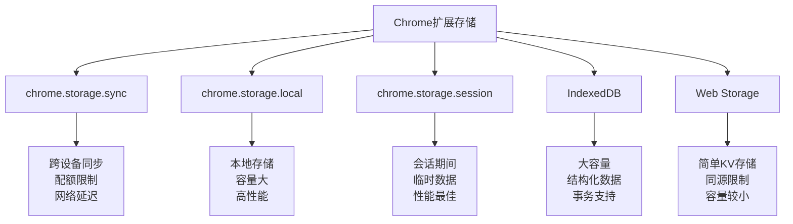

# 第9章：存储和数据管理

## 学习目标
1. 掌握Chrome扩展的各种存储机制
2. 学会设计高效的数据存储策略
3. 实现数据同步和备份功能
4. 优化存储性能和管理存储配额

## 9.1 存储机制概述

Chrome扩展提供了多种存储选项，每种都有其特定的用途和限制。

### 9.1.1 存储类型对比



### 9.1.2 存储容量和限制

```javascript
// 存储配额信息
const StorageQuotas = {
  sync: {
    totalBytes: 102400,        // 100KB
    maxItems: 512,             // 最大项目数
    quotaBytesPerItem: 8192,   // 单项8KB
    maxWriteOperationsPerHour: 1800,
    maxWriteOperationsPerMinute: 120
  },

  local: {
    totalBytes: 5242880,       // 5MB
    maxItems: Infinity,        // 无限制
    quotaBytesPerItem: Infinity // 无限制
  },

  session: {
    totalBytes: 10485760,      // 10MB
    maxItems: Infinity,        // 无限制
    quotaBytesPerItem: Infinity // 无限制
  }
};

// 检查存储使用情况
async function checkStorageUsage() {
  const syncUsage = await chrome.storage.sync.getBytesInUse();
  const localUsage = await chrome.storage.local.getBytesInUse();

  console.log('存储使用情况:');
  console.log(`Sync: ${syncUsage}/${StorageQuotas.sync.totalBytes} bytes`);
  console.log(`Local: ${localUsage}/${StorageQuotas.local.totalBytes} bytes`);

  return {
    sync: {
      used: syncUsage,
      total: StorageQuotas.sync.totalBytes,
      percentage: (syncUsage / StorageQuotas.sync.totalBytes * 100).toFixed(2)
    },
    local: {
      used: localUsage,
      total: StorageQuotas.local.totalBytes,
      percentage: (localUsage / StorageQuotas.local.totalBytes * 100).toFixed(2)
    }
  };
}
```

## 9.2 Chrome Storage API

### 9.2.1 基础操作封装

```javascript
// storage-manager.js - 存储管理器
class StorageManager {
  constructor() {
    this.cache = new Map(); // 内存缓存
    this.syncQueue = [];    // 同步队列
    this.isOnline = navigator.onLine;
    this.setupNetworkListener();
  }

  setupNetworkListener() {
    window.addEventListener('online', () => {
      this.isOnline = true;
      this.processSyncQueue();
    });

    window.addEventListener('offline', () => {
      this.isOnline = false;
    });
  }

  // === Sync Storage 操作 ===

  async setSyncData(key, value, options = {}) {
    const { enableCache = true, priority = 'normal' } = options;

    try {
      // 验证数据大小
      const dataSize = this.calculateDataSize({ [key]: value });
      if (dataSize > StorageQuotas.sync.quotaBytesPerItem) {
        throw new Error(`数据过大: ${dataSize} bytes，超过单项限制`);
      }

      // 保存到存储
      await chrome.storage.sync.set({ [key]: value });

      // 更新缓存
      if (enableCache) {
        this.cache.set(`sync:${key}`, value);
      }

      console.log(`Sync数据已保存: ${key}`);
      return true;

    } catch (error) {
      console.error('保存Sync数据失败:', error);

      // 离线时加入同步队列
      if (!this.isOnline) {
        this.syncQueue.push({
          type: 'set',
          storage: 'sync',
          key,
          value,
          timestamp: Date.now(),
          priority
        });
        console.log('已加入同步队列，等待网络连接');
      }

      throw error;
    }
  }

  async getSyncData(key, defaultValue = null, useCache = true) {
    try {
      // 先检查缓存
      if (useCache && this.cache.has(`sync:${key}`)) {
        return this.cache.get(`sync:${key}`);
      }

      // 从存储读取
      const result = await chrome.storage.sync.get(key);
      const value = result[key] !== undefined ? result[key] : defaultValue;

      // 更新缓存
      if (useCache && value !== null) {
        this.cache.set(`sync:${key}`, value);
      }

      return value;

    } catch (error) {
      console.error('获取Sync数据失败:', error);
      return defaultValue;
    }
  }

  async removeSyncData(key) {
    try {
      await chrome.storage.sync.remove(key);
      this.cache.delete(`sync:${key}`);
      console.log(`Sync数据已删除: ${key}`);
      return true;
    } catch (error) {
      console.error('删除Sync数据失败:', error);
      throw error;
    }
  }

  // === Local Storage 操作 ===

  async setLocalData(key, value, options = {}) {
    const {
      enableCache = true,
      compress = false,
      ttl = null // 生存时间（秒）
    } = options;

    try {
      let dataToStore = value;

      // 添加TTL信息
      if (ttl) {
        dataToStore = {
          data: value,
          timestamp: Date.now(),
          ttl: ttl * 1000 // 转换为毫秒
        };
      }

      // 数据压缩
      if (compress && typeof value === 'string') {
        dataToStore = this.compressString(dataToStore);
      }

      await chrome.storage.local.set({ [key]: dataToStore });

      // 更新缓存
      if (enableCache) {
        this.cache.set(`local:${key}`, value);
      }

      console.log(`Local数据已保存: ${key}`);
      return true;

    } catch (error) {
      console.error('保存Local数据失败:', error);
      throw error;
    }
  }

  async getLocalData(key, defaultValue = null, useCache = true) {
    try {
      // 先检查缓存
      if (useCache && this.cache.has(`local:${key}`)) {
        return this.cache.get(`local:${key}`);
      }

      const result = await chrome.storage.local.get(key);
      let value = result[key];

      if (value === undefined) {
        return defaultValue;
      }

      // 检查TTL
      if (value && typeof value === 'object' && value.ttl) {
        const now = Date.now();
        if (now - value.timestamp > value.ttl) {
          // 数据已过期，删除并返回默认值
          await this.removeLocalData(key);
          return defaultValue;
        }
        value = value.data;
      }

      // 解压缩
      if (typeof value === 'object' && value._compressed) {
        value = this.decompressString(value);
      }

      // 更新缓存
      if (useCache && value !== null) {
        this.cache.set(`local:${key}`, value);
      }

      return value;

    } catch (error) {
      console.error('获取Local数据失败:', error);
      return defaultValue;
    }
  }

  async removeLocalData(key) {
    try {
      await chrome.storage.local.remove(key);
      this.cache.delete(`local:${key}`);
      console.log(`Local数据已删除: ${key}`);
      return true;
    } catch (error) {
      console.error('删除Local数据失败:', error);
      throw error;
    }
  }

  // === Session Storage 操作 ===

  async setSessionData(key, value) {
    try {
      await chrome.storage.session.set({ [key]: value });
      this.cache.set(`session:${key}`, value);
      console.log(`Session数据已保存: ${key}`);
      return true;
    } catch (error) {
      console.error('保存Session数据失败:', error);
      throw error;
    }
  }

  async getSessionData(key, defaultValue = null) {
    try {
      // 先检查缓存
      if (this.cache.has(`session:${key}`)) {
        return this.cache.get(`session:${key}`);
      }

      const result = await chrome.storage.session.get(key);
      const value = result[key] !== undefined ? result[key] : defaultValue;

      // 更新缓存
      if (value !== null) {
        this.cache.set(`session:${key}`, value);
      }

      return value;
    } catch (error) {
      console.error('获取Session数据失败:', error);
      return defaultValue;
    }
  }

  // === 批量操作 ===

  async setBulkData(data, storageType = 'local') {
    const operations = [];

    for (const [key, value] of Object.entries(data)) {
      switch (storageType) {
        case 'sync':
          operations.push(this.setSyncData(key, value));
          break;
        case 'local':
          operations.push(this.setLocalData(key, value));
          break;
        case 'session':
          operations.push(this.setSessionData(key, value));
          break;
      }
    }

    try {
      await Promise.all(operations);
      console.log(`批量保存完成: ${Object.keys(data).length} 项`);
      return true;
    } catch (error) {
      console.error('批量保存失败:', error);
      throw error;
    }
  }

  async getBulkData(keys, storageType = 'local', defaultValues = {}) {
    try {
      const result = {};

      for (const key of keys) {
        const defaultValue = defaultValues[key] || null;

        switch (storageType) {
          case 'sync':
            result[key] = await this.getSyncData(key, defaultValue);
            break;
          case 'local':
            result[key] = await this.getLocalData(key, defaultValue);
            break;
          case 'session':
            result[key] = await this.getSessionData(key, defaultValue);
            break;
        }
      }

      return result;
    } catch (error) {
      console.error('批量获取失败:', error);
      throw error;
    }
  }

  // === 工具方法 ===

  calculateDataSize(data) {
    return new Blob([JSON.stringify(data)]).size;
  }

  compressString(str) {
    // 简单的压缩实现（实际项目中应使用专业压缩库）
    try {
      const compressed = btoa(unescape(encodeURIComponent(str)));
      return {
        _compressed: true,
        data: compressed,
        originalSize: str.length,
        compressedSize: compressed.length
      };
    } catch (error) {
      console.warn('压缩失败，使用原始数据');
      return str;
    }
  }

  decompressString(compressedObj) {
    try {
      if (compressedObj._compressed) {
        return decodeURIComponent(escape(atob(compressedObj.data)));
      }
      return compressedObj;
    } catch (error) {
      console.warn('解压失败，返回原始数据');
      return compressedObj;
    }
  }

  async processSyncQueue() {
    if (this.syncQueue.length === 0) return;

    console.log(`处理同步队列: ${this.syncQueue.length} 项`);

    // 按优先级排序
    this.syncQueue.sort((a, b) => {
      const priorityOrder = { high: 0, normal: 1, low: 2 };
      return priorityOrder[a.priority] - priorityOrder[b.priority];
    });

    const failedItems = [];

    for (const item of this.syncQueue) {
      try {
        if (item.type === 'set') {
          await this.setSyncData(item.key, item.value, { enableCache: false });
        }
      } catch (error) {
        console.error('同步队列项目失败:', error);
        failedItems.push(item);
      }
    }

    // 更新队列，保留失败的项目
    this.syncQueue = failedItems;

    if (failedItems.length > 0) {
      console.warn(`${failedItems.length} 个项目同步失败`);
    }
  }

  // 清理缓存
  clearCache() {
    this.cache.clear();
    console.log('缓存已清理');
  }

  // 获取缓存统计
  getCacheStats() {
    return {
      size: this.cache.size,
      keys: Array.from(this.cache.keys())
    };
  }
}

// 单例模式
const storageManager = new StorageManager();
window.storageManager = storageManager; // 开发调试用
```

### 9.2.2 数据模型设计

```javascript
// data-models.js - 数据模型定义
class DataModel {
  constructor(data = {}) {
    this.id = data.id || this.generateId();
    this.createdAt = data.createdAt || Date.now();
    this.updatedAt = data.updatedAt || Date.now();
    this.version = data.version || 1;
  }

  generateId() {
    return `${Date.now()}_${Math.random().toString(36).substr(2, 9)}`;
  }

  update(newData) {
    Object.assign(this, newData);
    this.updatedAt = Date.now();
    this.version += 1;
  }

  toJSON() {
    return {
      id: this.id,
      createdAt: this.createdAt,
      updatedAt: this.updatedAt,
      version: this.version,
      ...this.getData()
    };
  }

  getData() {
    // 子类实现
    return {};
  }
}

// 用户设置模型
class UserSettings extends DataModel {
  constructor(data = {}) {
    super(data);
    this.theme = data.theme || 'light';
    this.language = data.language || 'zh-CN';
    this.notifications = data.notifications !== undefined ? data.notifications : true;
    this.autoSave = data.autoSave !== undefined ? data.autoSave : true;
    this.fontSize = data.fontSize || 14;
    this.shortcuts = data.shortcuts || {};
  }

  getData() {
    return {
      theme: this.theme,
      language: this.language,
      notifications: this.notifications,
      autoSave: this.autoSave,
      fontSize: this.fontSize,
      shortcuts: this.shortcuts
    };
  }

  static getStorageKey() {
    return 'userSettings';
  }

  async save() {
    return await storageManager.setSyncData(
      UserSettings.getStorageKey(),
      this.toJSON()
    );
  }

  static async load() {
    const data = await storageManager.getSyncData(
      UserSettings.getStorageKey(),
      {}
    );
    return new UserSettings(data);
  }
}

// 用户数据模型
class UserProfile extends DataModel {
  constructor(data = {}) {
    super(data);
    this.username = data.username || '';
    this.email = data.email || '';
    this.avatar = data.avatar || '';
    this.preferences = data.preferences || {};
    this.statistics = data.statistics || {
      clickCount: 0,
      activeTime: 0,
      lastLogin: null
    };
  }

  getData() {
    return {
      username: this.username,
      email: this.email,
      avatar: this.avatar,
      preferences: this.preferences,
      statistics: this.statistics
    };
  }

  incrementClickCount() {
    this.statistics.clickCount += 1;
    this.update({});
  }

  updateActiveTime(seconds) {
    this.statistics.activeTime += seconds;
    this.update({});
  }

  static getStorageKey() {
    return 'userProfile';
  }

  async save() {
    return await storageManager.setSyncData(
      UserProfile.getStorageKey(),
      this.toJSON()
    );
  }

  static async load() {
    const data = await storageManager.getSyncData(
      UserProfile.getStorageKey(),
      {}
    );
    return new UserProfile(data);
  }
}

// 缓存数据模型
class CacheEntry extends DataModel {
  constructor(data = {}) {
    super(data);
    this.key = data.key;
    this.value = data.value;
    this.ttl = data.ttl || 3600000; // 1小时默认TTL
    this.accessCount = data.accessCount || 0;
    this.lastAccessed = data.lastAccessed || Date.now();
  }

  isExpired() {
    return Date.now() - this.createdAt > this.ttl;
  }

  access() {
    this.accessCount += 1;
    this.lastAccessed = Date.now();
  }

  getData() {
    return {
      key: this.key,
      value: this.value,
      ttl: this.ttl,
      accessCount: this.accessCount,
      lastAccessed: this.lastAccessed
    };
  }

  static getStorageKey(key) {
    return `cache:${key}`;
  }

  async save() {
    return await storageManager.setLocalData(
      CacheEntry.getStorageKey(this.key),
      this.toJSON(),
      { ttl: this.ttl / 1000 } // 转换为秒
    );
  }

  static async load(key) {
    const data = await storageManager.getLocalData(
      CacheEntry.getStorageKey(key),
      null
    );

    if (!data) return null;

    const entry = new CacheEntry(data);
    if (entry.isExpired()) {
      await storageManager.removeLocalData(CacheEntry.getStorageKey(key));
      return null;
    }

    return entry;
  }
}
```

### 9.2.3 存储系统核心概念

**存储类型枚举**

| 类型 | 说明 |
|------|------|
| SYNC | 跨设备同步存储 |
| LOCAL | 本地存储 |
| SESSION | 会话存储 |

**存储配额规格**

| 存储类型 | 总容量 | 最大项数 | 单项限制 | 小时写入限制 | 分钟写入限制 |
|---------|--------|---------|---------|-------------|-------------|
| SYNC | 100KB | 512 | 8KB | 1800次 | 120次 |
| LOCAL | 5MB | 无限 | 无限 | 无限制 | 无限制 |
| SESSION | 10MB | 无限 | 无限 | 无限制 | 无限制 |

**高级存储管理器示例**

```javascript
// advanced-storage-manager.js - 高级存储管理器
class AdvancedStorageManager {
  constructor() {
    this.syncQueue = [];
    this.ttlCache = new Map();
    this.writeOperations = [];
  }

  // 计算数据大小
  calculateSize(data) {
    return new Blob([JSON.stringify(data)]).size;
  }

  // 检查存储配额
  async checkQuota(storageType, key, value) {
    const quotas = {
      sync: { totalBytes: 102400, maxItems: 512, quotaBytesPerItem: 8192 },
      local: { totalBytes: 5242880, maxItems: Infinity, quotaBytesPerItem: Infinity },
      session: { totalBytes: 10485760, maxItems: Infinity, quotaBytesPerItem: Infinity }
    };

    const quota = quotas[storageType];
    const storage = await chrome.storage[storageType].get(null);
    const currentItems = Object.keys(storage).length;

    // 检查项目数限制
    if (currentItems >= quota.maxItems && !(key in storage)) {
      throw new Error(`存储项目数超过限制: ${quota.maxItems}`);
    }

    // 检查单项大小
    const itemSize = this.calculateSize(value);
    if (itemSize > quota.quotaBytesPerItem) {
      throw new Error(`单项数据过大: ${itemSize} bytes，限制: ${quota.quotaBytesPerItem}`);
    }

    // 检查总大小
    const totalSize = await chrome.storage[storageType].getBytesInUse();
    if (totalSize + itemSize > quota.totalBytes) {
      throw new Error(`总存储容量超限: ${totalSize + itemSize} bytes，限制: ${quota.totalBytes}`);
    }

    return true;
  }

  // 检查写入频率限制（仅针对sync）
  checkWriteOperations() {
    const now = Date.now();

    // 清理1小时前的记录
    this.writeOperations = this.writeOperations.filter(op => now - op < 3600000);

    // 检查小时限制
    if (this.writeOperations.length >= 1800) {
      throw new Error('写入操作超过小时限制');
    }

    // 检查分钟限制
    const recentOps = this.writeOperations.filter(op => now - op < 60000);
    if (recentOps.length >= 120) {
      throw new Error('写入操作超过分钟限制');
    }

    return true;
  }

  // 设置带TTL的数据
  async setWithTTL(storageType, key, value, ttlSeconds) {
    const expiryTime = Date.now() + (ttlSeconds * 1000);
    const wrappedValue = {
      data: value,
      expiry: expiryTime,
      created: Date.now()
    };

    await chrome.storage[storageType].set({ [key]: wrappedValue });
    this.ttlCache.set(`${storageType}:${key}`, expiryTime);

    console.log(`TTL数据已保存: ${key}, 过期时间: ${ttlSeconds}秒后`);
  }

  // 获取带TTL的数据
  async getWithTTL(storageType, key, defaultValue = null) {
    const cacheKey = `${storageType}:${key}`;

    // 检查是否过期
    if (this.ttlCache.has(cacheKey)) {
      if (Date.now() > this.ttlCache.get(cacheKey)) {
        await chrome.storage[storageType].remove(key);
        this.ttlCache.delete(cacheKey);
        return defaultValue;
      }
    }

    const result = await chrome.storage[storageType].get(key);
    const wrappedValue = result[key];

    if (!wrappedValue) return defaultValue;

    // 检查包装的数据是否过期
    if (wrappedValue.expiry && Date.now() > wrappedValue.expiry) {
      await chrome.storage[storageType].remove(key);
      this.ttlCache.delete(cacheKey);
      return defaultValue;
    }

    return wrappedValue.data || wrappedValue;
  }

  // 批量设置数据
  async setBulk(storageType, dataDict) {
    const failedKeys = [];

    for (const [key, value] of Object.entries(dataDict)) {
      try {
        await chrome.storage[storageType].set({ [key]: value });
      } catch (error) {
        console.error(`批量设置失败 ${key}:`, error);
        failedKeys.push(key);
      }
    }

    console.log(`批量设置完成, 失败: ${failedKeys.length} 项`);
    return failedKeys;
  }

  // 批量获取数据
  async getBulk(storageType, keys, defaultValues = {}) {
    const result = {};

    for (const key of keys) {
      const data = await chrome.storage[storageType].get(key);
      result[key] = data[key] !== undefined ? data[key] : defaultValues[key];
    }

    return result;
  }

  // 清理过期数据
  async cleanupExpired() {
    const currentTime = Date.now();
    const expiredKeys = [];

    for (const [cacheKey, expiryTime] of this.ttlCache.entries()) {
      if (currentTime > expiryTime) {
        const [storageType, key] = cacheKey.split(':');
        await chrome.storage[storageType].remove(key);
        expiredKeys.push(cacheKey);
      }
    }

    for (const key of expiredKeys) {
      this.ttlCache.delete(key);
    }

    if (expiredKeys.length > 0) {
      console.log(`清理了 ${expiredKeys.length} 个过期项目`);
    }

    return expiredKeys.length;
  }

  // 导出数据
  async exportData(storageType) {
    const data = await chrome.storage[storageType].get(null);
    const exportData = {
      type: storageType,
      exportedAt: new Date().toISOString(),
      data: data
    };

    const blob = new Blob([JSON.stringify(exportData, null, 2)], { type: 'application/json' });
    const url = URL.createObjectURL(blob);
    const timestamp = new Date().toISOString().replace(/[:.]/g, '-');
    const filename = `${storageType}_export_${timestamp}.json`;

    // 触发下载
    const a = document.createElement('a');
    a.href = url;
    a.download = filename;
    a.click();
    URL.revokeObjectURL(url);

    console.log(`数据已导出: ${filename}`);
    return filename;
  }

  // 导入数据
  async importData(file, storageType = null) {
    return new Promise((resolve, reject) => {
      const reader = new FileReader();

      reader.onload = async (e) => {
        try {
          const importData = JSON.parse(e.target.result);
          const targetStorageType = storageType || importData.type;
          const data = importData.data;

          const failedKeys = await this.setBulk(targetStorageType, data);

          if (failedKeys.length > 0) {
            console.log(`导入完成，${failedKeys.length} 项失败:`, failedKeys);
          } else {
            console.log('数据导入成功');
          }

          resolve(failedKeys.length === 0);
        } catch (error) {
          console.error('导入失败:', error);
          reject(error);
        }
      };

      reader.onerror = () => reject(new Error('文件读取失败'));
      reader.readAsText(file);
    });
  }

  // 获取存储信息
  async getStorageInfo() {
    const info = {};
    const types = ['sync', 'local', 'session'];

    for (const type of types) {
      const bytesInUse = await chrome.storage[type].getBytesInUse();
      const allData = await chrome.storage[type].get(null);
      const itemCount = Object.keys(allData).length;

      const quotas = {
        sync: 102400,
        local: 5242880,
        session: 10485760
      };

      info[type] = {
        usedBytes: bytesInUse,
        totalBytes: quotas[type],
        usedPercentage: ((bytesInUse / quotas[type]) * 100).toFixed(2),
        usedItems: itemCount,
        availableBytes: quotas[type] - bytesInUse
      };
    }

    return info;
  }
}

// 使用示例
async function demoAdvancedStorage() {
  console.log('=== 高级存储管理器演示 ===\n');

  const manager = new AdvancedStorageManager();

  // 1. 基础存储操作
  console.log('1. 基础存储操作:');
  await chrome.storage.sync.set({ username: 'john_doe' });
  await chrome.storage.local.set({ large_data: { items: Array.from({length: 100}, (_, i) => i) } });

  const { username } = await chrome.storage.sync.get('username');
  const { large_data } = await chrome.storage.local.get('large_data');
  console.log(`   用户名: ${username}`);
  console.log(`   大数据项目数: ${large_data.items.length}`);

  // 2. TTL存储
  console.log('\n2. TTL存储:');
  await manager.setWithTTL('local', 'temp_token', 'abc123', 5); // 5秒后过期
  let token = await manager.getWithTTL('local', 'temp_token');
  console.log(`   临时令牌: ${token}`);

  // 3. 批量操作
  console.log('\n3. 批量操作:');
  const bulkData = {
    setting1: true,
    setting2: 'value2',
    setting3: { nested: 'data' }
  };

  const failedKeys = await manager.setBulk('sync', bulkData);
  const retrievedData = await manager.getBulk('sync', Object.keys(bulkData));
  console.log(`   批量设置失败键: ${failedKeys}`);
  console.log(`   批量获取结果: ${Object.keys(retrievedData).length} 项`);

  // 4. 存储使用情况
  console.log('\n4. 存储使用情况:');
  const info = await manager.getStorageInfo();
  for (const [type, stats] of Object.entries(info)) {
    console.log(`   ${type}:`);
    console.log(`     使用: ${stats.usedBytes} bytes (${stats.usedPercentage}%)`);
    console.log(`     项目: ${stats.usedItems}`);
  }

  console.log('\n=== 演示完成 ===');
}

// 全局实例
const advancedStorageManager = new AdvancedStorageManager();
window.advancedStorageManager = advancedStorageManager;
```

## 9.3 IndexedDB高级存储

### 9.3.1 IndexedDB封装

```javascript
// indexeddb-manager.js - IndexedDB高级封装
class IndexedDBManager {
  constructor(dbName, version = 1) {
    this.dbName = dbName;
    this.version = version;
    this.db = null;
    this.objectStores = new Map();
  }

  // 定义对象存储
  defineStore(storeName, options = {}) {
    const {
      keyPath = 'id',
      autoIncrement = false,
      indexes = []
    } = options;

    this.objectStores.set(storeName, {
      keyPath,
      autoIncrement,
      indexes
    });
  }

  // 初始化数据库
  async init() {
    return new Promise((resolve, reject) => {
      const request = indexedDB.open(this.dbName, this.version);

      request.onerror = () => {
        reject(new Error(`数据库打开失败: ${request.error}`));
      };

      request.onsuccess = (event) => {
        this.db = event.target.result;
        console.log(`数据库 ${this.dbName} 初始化成功`);
        resolve(this.db);
      };

      request.onupgradeneeded = (event) => {
        const db = event.target.result;
        console.log(`数据库升级: 版本 ${event.oldVersion} -> ${event.newVersion}`);

        // 创建对象存储
        for (const [storeName, config] of this.objectStores) {
          if (!db.objectStoreNames.contains(storeName)) {
            const objectStore = db.createObjectStore(storeName, {
              keyPath: config.keyPath,
              autoIncrement: config.autoIncrement
            });

            // 创建索引
            config.indexes.forEach(index => {
              objectStore.createIndex(
                index.name,
                index.keyPath,
                index.options || {}
              );
            });

            console.log(`对象存储 ${storeName} 创建成功`);
          }
        }
      };
    });
  }

  // 执行事务
  async transaction(storeNames, mode = 'readonly', operation) {
    if (!this.db) {
      throw new Error('数据库未初始化');
    }

    return new Promise((resolve, reject) => {
      const transaction = this.db.transaction(storeNames, mode);

      transaction.oncomplete = () => resolve(transaction);
      transaction.onerror = () => reject(new Error(`事务失败: ${transaction.error}`));
      transaction.onabort = () => reject(new Error('事务被中止'));

      try {
        const result = operation(transaction);
        if (result instanceof Promise) {
          result.catch(reject);
        }
      } catch (error) {
        reject(error);
      }
    });
  }

  // 添加数据
  async add(storeName, data) {
    return this.transaction([storeName], 'readwrite', (transaction) => {
      const objectStore = transaction.objectStore(storeName);
      const request = objectStore.add(data);

      return new Promise((resolve, reject) => {
        request.onsuccess = () => resolve(request.result);
        request.onerror = () => reject(new Error(`添加数据失败: ${request.error}`));
      });
    });
  }

  // 更新数据
  async put(storeName, data) {
    return this.transaction([storeName], 'readwrite', (transaction) => {
      const objectStore = transaction.objectStore(storeName);
      const request = objectStore.put(data);

      return new Promise((resolve, reject) => {
        request.onsuccess = () => resolve(request.result);
        request.onerror = () => reject(new Error(`更新数据失败: ${request.error}`));
      });
    });
  }

  // 获取数据
  async get(storeName, key) {
    return this.transaction([storeName], 'readonly', (transaction) => {
      const objectStore = transaction.objectStore(storeName);
      const request = objectStore.get(key);

      return new Promise((resolve, reject) => {
        request.onsuccess = () => resolve(request.result);
        request.onerror = () => reject(new Error(`获取数据失败: ${request.error}`));
      });
    });
  }

  // 获取所有数据
  async getAll(storeName, query = null, count = null) {
    return this.transaction([storeName], 'readonly', (transaction) => {
      const objectStore = transaction.objectStore(storeName);
      const request = objectStore.getAll(query, count);

      return new Promise((resolve, reject) => {
        request.onsuccess = () => resolve(request.result);
        request.onerror = () => reject(new Error(`获取所有数据失败: ${request.error}`));
      });
    });
  }

  // 删除数据
  async delete(storeName, key) {
    return this.transaction([storeName], 'readwrite', (transaction) => {
      const objectStore = transaction.objectStore(storeName);
      const request = objectStore.delete(key);

      return new Promise((resolve, reject) => {
        request.onsuccess = () => resolve(request.result);
        request.onerror = () => reject(new Error(`删除数据失败: ${request.error}`));
      });
    });
  }

  // 清空存储
  async clear(storeName) {
    return this.transaction([storeName], 'readwrite', (transaction) => {
      const objectStore = transaction.objectStore(storeName);
      const request = objectStore.clear();

      return new Promise((resolve, reject) => {
        request.onsuccess = () => resolve(request.result);
        request.onerror = () => reject(new Error(`清空存储失败: ${request.error}`));
      });
    });
  }

  // 通过索引查询
  async queryByIndex(storeName, indexName, query) {
    return this.transaction([storeName], 'readonly', (transaction) => {
      const objectStore = transaction.objectStore(storeName);
      const index = objectStore.index(indexName);
      const request = index.getAll(query);

      return new Promise((resolve, reject) => {
        request.onsuccess = () => resolve(request.result);
        request.onerror = () => reject(new Error(`索引查询失败: ${request.error}`));
      });
    });
  }

  // 游标遍历
  async forEach(storeName, callback, keyRange = null) {
    return this.transaction([storeName], 'readonly', (transaction) => {
      const objectStore = transaction.objectStore(storeName);
      const request = objectStore.openCursor(keyRange);

      return new Promise((resolve, reject) => {
        request.onsuccess = (event) => {
          const cursor = event.target.result;
          if (cursor) {
            const shouldContinue = callback(cursor.value, cursor.key);
            if (shouldContinue !== false) {
              cursor.continue();
            } else {
              resolve();
            }
          } else {
            resolve();
          }
        };

        request.onerror = () => reject(new Error(`游标遍历失败: ${request.error}`));
      });
    });
  }

  // 批量操作
  async batch(storeName, operations) {
    return this.transaction([storeName], 'readwrite', async (transaction) => {
      const objectStore = transaction.objectStore(storeName);
      const promises = [];

      for (const operation of operations) {
        const { type, data, key } = operation;
        let request;

        switch (type) {
          case 'add':
            request = objectStore.add(data);
            break;
          case 'put':
            request = objectStore.put(data);
            break;
          case 'delete':
            request = objectStore.delete(key || data);
            break;
          default:
            throw new Error(`未知操作类型: ${type}`);
        }

        promises.push(new Promise((resolve, reject) => {
          request.onsuccess = () => resolve(request.result);
          request.onerror = () => reject(new Error(`批量操作失败: ${request.error}`));
        }));
      }

      return Promise.all(promises);
    });
  }

  // 获取存储统计信息
  async getStoreStats(storeName) {
    return this.transaction([storeName], 'readonly', (transaction) => {
      const objectStore = transaction.objectStore(storeName);
      const countRequest = objectStore.count();

      return new Promise((resolve, reject) => {
        countRequest.onsuccess = () => {
          resolve({
            storeName,
            count: countRequest.result,
            keyPath: objectStore.keyPath,
            autoIncrement: objectStore.autoIncrement,
            indexes: Array.from(objectStore.indexNames)
          });
        };

        countRequest.onerror = () => reject(new Error(`获取统计失败: ${countRequest.error}`));
      });
    });
  }

  // 导出数据
  async exportStore(storeName) {
    const allData = await this.getAll(storeName);
    const stats = await this.getStoreStats(storeName);

    return {
      storeName,
      exportDate: new Date().toISOString(),
      stats,
      data: allData
    };
  }

  // 导入数据
  async importStore(storeName, exportData, options = {}) {
    const { clearFirst = false, skipExisting = false } = options;

    if (clearFirst) {
      await this.clear(storeName);
    }

    const operations = exportData.data.map(item => ({
      type: skipExisting ? 'add' : 'put',
      data: item
    }));

    try {
      await this.batch(storeName, operations);
      console.log(`导入完成: ${operations.length} 项数据`);
      return true;
    } catch (error) {
      console.error('导入失败:', error);
      return false;
    }
  }

  // 关闭数据库
  close() {
    if (this.db) {
      this.db.close();
      this.db = null;
      console.log('数据库连接已关闭');
    }
  }
}

// 应用数据管理器
class AppDataManager {
  constructor() {
    this.dbManager = new IndexedDBManager('ExtensionDB', 1);
    this.isInitialized = false;
  }

  async init() {
    if (this.isInitialized) return;

    // 定义存储结构
    this.dbManager.defineStore('users', {
      keyPath: 'id',
      autoIncrement: false,
      indexes: [
        { name: 'email', keyPath: 'email', options: { unique: true } },
        { name: 'username', keyPath: 'username', options: { unique: false } },
        { name: 'createdAt', keyPath: 'createdAt', options: { unique: false } }
      ]
    });

    this.dbManager.defineStore('articles', {
      keyPath: 'id',
      autoIncrement: false,
      indexes: [
        { name: 'title', keyPath: 'title', options: { unique: false } },
        { name: 'category', keyPath: 'category', options: { unique: false } },
        { name: 'publishedAt', keyPath: 'publishedAt', options: { unique: false } },
        { name: 'author', keyPath: 'authorId', options: { unique: false } }
      ]
    });

    this.dbManager.defineStore('cache', {
      keyPath: 'key',
      autoIncrement: false,
      indexes: [
        { name: 'expiry', keyPath: 'expiry', options: { unique: false } },
        { name: 'category', keyPath: 'category', options: { unique: false } }
      ]
    });

    await this.dbManager.init();
    this.isInitialized = true;

    // 启动清理任务
    this.startCleanupTasks();

    console.log('应用数据管理器初始化完成');
  }

  // 用户管理
  async createUser(userData) {
    const user = {
      id: this.generateId(),
      ...userData,
      createdAt: Date.now(),
      updatedAt: Date.now()
    };

    try {
      await this.dbManager.add('users', user);
      console.log('用户创建成功:', user.id);
      return user;
    } catch (error) {
      if (error.message.includes('Key already exists')) {
        throw new Error('用户已存在');
      }
      throw error;
    }
  }

  async getUserByEmail(email) {
    const users = await this.dbManager.queryByIndex('users', 'email', email);
    return users.length > 0 ? users[0] : null;
  }

  async updateUser(userId, updates) {
    const user = await this.dbManager.get('users', userId);
    if (!user) {
      throw new Error('用户不存在');
    }

    const updatedUser = {
      ...user,
      ...updates,
      updatedAt: Date.now()
    };

    await this.dbManager.put('users', updatedUser);
    return updatedUser;
  }

  // 文章管理
  async createArticle(articleData) {
    const article = {
      id: this.generateId(),
      ...articleData,
      createdAt: Date.now(),
      updatedAt: Date.now()
    };

    await this.dbManager.add('articles', article);
    console.log('文章创建成功:', article.id);
    return article;
  }

  async getArticlesByCategory(category) {
    return await this.dbManager.queryByIndex('articles', 'category', category);
  }

  async getRecentArticles(limit = 10) {
    const allArticles = await this.dbManager.getAll('articles');
    return allArticles
      .sort((a, b) => b.publishedAt - a.publishedAt)
      .slice(0, limit);
  }

  // 缓存管理
  async setCache(key, value, ttl = 3600000) {
    const cacheEntry = {
      key,
      value,
      expiry: Date.now() + ttl,
      category: 'general',
      createdAt: Date.now()
    };

    await this.dbManager.put('cache', cacheEntry);
  }

  async getCache(key) {
    const entry = await this.dbManager.get('cache', key);

    if (!entry) return null;

    if (Date.now() > entry.expiry) {
      await this.dbManager.delete('cache', key);
      return null;
    }

    return entry.value;
  }

  async clearExpiredCache() {
    const now = Date.now();
    let expiredCount = 0;

    await this.dbManager.forEach('cache', async (entry, key) => {
      if (entry.expiry < now) {
        await this.dbManager.delete('cache', key);
        expiredCount++;
      }
    });

    console.log(`清理了 ${expiredCount} 个过期缓存项`);
    return expiredCount;
  }

  // 定期清理任务
  startCleanupTasks() {
    // 每小时清理一次过期缓存
    setInterval(() => {
      this.clearExpiredCache().catch(console.error);
    }, 3600000); // 1小时

    console.log('清理任务已启动');
  }

  generateId() {
    return `${Date.now()}_${Math.random().toString(36).substr(2, 9)}`;
  }

  // 数据统计
  async getDataStats() {
    const [userStats, articleStats, cacheStats] = await Promise.all([
      this.dbManager.getStoreStats('users'),
      this.dbManager.getStoreStats('articles'),
      this.dbManager.getStoreStats('cache')
    ]);

    return {
      users: userStats,
      articles: articleStats,
      cache: cacheStats,
      totalRecords: userStats.count + articleStats.count + cacheStats.count
    };
  }

  // 数据备份
  async backup() {
    const [users, articles, cache] = await Promise.all([
      this.dbManager.exportStore('users'),
      this.dbManager.exportStore('articles'),
      this.dbManager.exportStore('cache')
    ]);

    const backup = {
      version: '1.0',
      timestamp: Date.now(),
      stores: { users, articles, cache }
    };

    return backup;
  }

  async restore(backupData, options = {}) {
    const { clearFirst = false } = options;

    try {
      for (const [storeName, storeData] of Object.entries(backupData.stores)) {
        await this.dbManager.importStore(storeName, storeData, { clearFirst });
      }

      console.log('数据恢复完成');
      return true;
    } catch (error) {
      console.error('数据恢复失败:', error);
      return false;
    }
  }
}

// 全局实例
const appDataManager = new AppDataManager();

// 初始化
appDataManager.init().catch(console.error);

// 导出到全局作用域供其他文件使用
window.appDataManager = appDataManager;
```

:::warning 存储注意事项
1. **配额管理**: 合理使用存储配额，避免超限
2. **数据同步**: sync存储依赖网络，需要处理离线情况
3. **性能优化**: 大量数据操作时使用批量接口
4. **数据迁移**: 版本升级时处理数据结构变化
5. **安全考虑**: 敏感数据需要加密存储
:::

:::tip 最佳实践
- 根据数据特性选择合适的存储类型
- 实现数据分层和缓存策略
- 定期清理过期和无用数据
- 提供数据备份和恢复功能
- 监控存储使用情况和性能
:::

:::note 总结
本章全面介绍了Chrome扩展的存储和数据管理技术，包括Chrome Storage API的各种用法、IndexedDB的高级应用，以及数据管理的最佳实践。合理的数据管理策略是构建可靠扩展的基础。下一章我们将学习Chrome APIs的深入应用，探索更多强大的浏览器功能。
:::