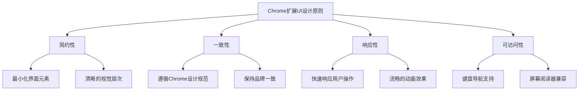

# 第11章：用户界面设计与体验优化

## 学习目标
1. 掌握Chrome扩展的UI设计最佳实践
2. 学会实现响应式和自适应界面
3. 优化用户交互体验和性能
4. 实现无障碍访问和国际化支持

## 11.1 UI设计原则

### 11.1.1 设计哲学



### 11.1.2 现代UI框架集成

```javascript
// ui-framework.js - 轻量级UI框架
class ChromeExtensionUI {
  constructor() {
    this.components = new Map();
    this.themes = new Map();
    this.currentTheme = 'light';
    this.animations = new Map();
    this.init();
  }

  init() {
    this.setupThemes();
    this.registerBaseComponents();
    this.setupGlobalStyles();
    this.bindEvents();
  }

  setupThemes() {
    // 浅色主题
    this.themes.set('light', {
      primary: '#4285f4',
      secondary: '#34a853',
      danger: '#ea4335',
      warning: '#fbbc05',
      background: '#ffffff',
      surface: '#f8f9fa',
      'on-background': '#202124',
      'on-surface': '#5f6368',
      border: '#dadce0',
      shadow: '0 2px 4px rgba(0,0,0,0.1)'
    });

    // 深色主题
    this.themes.set('dark', {
      primary: '#8ab4f8',
      secondary: '#81c995',
      danger: '#f28b82',
      warning: '#fdd663',
      background: '#202124',
      surface: '#303134',
      'on-background': '#e8eaed',
      'on-surface': '#9aa0a6',
      border: '#5f6368',
      shadow: '0 2px 4px rgba(0,0,0,0.3)'
    });
  }

  registerBaseComponents() {
    // 按钮组件
    this.registerComponent('button', {
      template: `
        <button class="ce-button {{variant}} {{size}} {{disabled}}"
                {{disabled}} data-ripple="true">
          {{#if icon}}<span class="ce-button-icon">{{icon}}</span>{{/if}}
          <span class="ce-button-text">{{text}}</span>
        </button>
      `,
      props: {
        text: '',
        icon: '',
        variant: 'primary', // primary, secondary, outline, ghost
        size: 'medium', // small, medium, large
        disabled: false,
        onClick: null
      },
      mounted() {
        this.addRippleEffect();
        if (this.props.onClick) {
          this.element.addEventListener('click', this.props.onClick);
        }
      }
    });

    // 输入框组件
    this.registerComponent('input', {
      template: `
        <div class="ce-input-group {{state}}">
          {{#if label}}<label class="ce-input-label">{{label}}</label>{{/if}}
          <input type="{{type}}" class="ce-input" placeholder="{{placeholder}}"
                 value="{{value}}" {{required}} {{disabled}}>
          {{#if helperText}}<span class="ce-input-helper">{{helperText}}</span>{{/if}}
          {{#if errorText}}<span class="ce-input-error">{{errorText}}</span>{{/if}}
        </div>
      `,
      props: {
        type: 'text',
        label: '',
        placeholder: '',
        value: '',
        helperText: '',
        errorText: '',
        required: false,
        disabled: false,
        state: 'normal' // normal, error, success
      },
      mounted() {
        this.setupValidation();
        this.setupFloatingLabel();
      }
    });

    // 卡片组件
    this.registerComponent('card', {
      template: `
        <div class="ce-card {{variant}} {{elevation}}">
          {{#if header}}
          <div class="ce-card-header">
            {{#if title}}<h3 class="ce-card-title">{{title}}</h3>{{/if}}
            {{#if subtitle}}<p class="ce-card-subtitle">{{subtitle}}</p>{{/if}}
            {{#if actions}}<div class="ce-card-actions">{{actions}}</div>{{/if}}
          </div>
          {{/if}}
          <div class="ce-card-content">{{content}}</div>
          {{#if footer}}
          <div class="ce-card-footer">{{footer}}</div>
          {{/if}}
        </div>
      `,
      props: {
        title: '',
        subtitle: '',
        content: '',
        actions: '',
        footer: '',
        variant: 'default', // default, outlined, filled
        elevation: 'medium' // none, low, medium, high
      }
    });

    // 模态框组件
    this.registerComponent('modal', {
      template: `
        <div class="ce-modal-overlay {{visible}}" role="dialog" aria-modal="true">
          <div class="ce-modal-container {{size}}">
            <div class="ce-modal-header">
              <h2 class="ce-modal-title">{{title}}</h2>
              <button class="ce-modal-close" aria-label="关闭">&times;</button>
            </div>
            <div class="ce-modal-content">{{content}}</div>
            <div class="ce-modal-footer">{{footer}}</div>
          </div>
        </div>
      `,
      props: {
        title: '',
        content: '',
        footer: '',
        size: 'medium', // small, medium, large
        visible: false,
        onClose: null
      },
      mounted() {
        this.setupCloseHandlers();
        this.setupKeyboardNavigation();
        this.setupFocusTrap();
      }
    });
  }

  registerComponent(name, definition) {
    this.components.set(name, definition);
  }

  createElement(componentName, props = {}) {
    const component = this.components.get(componentName);
    if (!component) {
      throw new Error(`组件 ${componentName} 不存在`);
    }

    const mergedProps = { ...component.props, ...props };
    const html = this.renderTemplate(component.template, mergedProps);

    const element = this.createElementFromHTML(html);

    // 创建组件实例
    const instance = {
      element,
      props: mergedProps,
      component,
      // 添加组件方法
      addRippleEffect: this.addRippleEffect.bind({ element }),
      setupValidation: this.setupValidation.bind({ element }),
      setupFloatingLabel: this.setupFloatingLabel.bind({ element }),
      setupCloseHandlers: this.setupCloseHandlers.bind({ element, props: mergedProps }),
      setupKeyboardNavigation: this.setupKeyboardNavigation.bind({ element }),
      setupFocusTrap: this.setupFocusTrap.bind({ element })
    };

    // 调用mounted生命周期
    if (component.mounted) {
      component.mounted.call(instance);
    }

    return instance;
  }

  renderTemplate(template, props) {
    return template.replace(/\{\{(\#if\s+)?(\#unless\s+)?([^}]+)\}\}/g, (match, ifStatement, unlessStatement, propPath) => {
      if (ifStatement) {
        const prop = propPath.trim();
        return props[prop] ? '' : '<!--';
      }

      if (unlessStatement) {
        const prop = propPath.trim();
        return !props[prop] ? '' : '<!--';
      }

      const value = this.getNestedProp(props, propPath.trim());
      return value !== undefined ? value : '';
    });
  }

  getNestedProp(obj, path) {
    return path.split('.').reduce((current, key) => current?.[key], obj);
  }

  createElementFromHTML(html) {
    const template = document.createElement('template');
    template.innerHTML = html.trim();
    return template.content.firstChild;
  }

  // 组件方法实现
  addRippleEffect() {
    this.element.addEventListener('click', (e) => {
      const ripple = document.createElement('span');
      const rect = this.element.getBoundingClientRect();
      const size = Math.max(rect.width, rect.height);
      const x = e.clientX - rect.left - size / 2;
      const y = e.clientY - rect.top - size / 2;

      ripple.style.cssText = `
        position: absolute;
        border-radius: 50%;
        background: rgba(255, 255, 255, 0.6);
        transform: scale(0);
        animation: ripple 0.6s linear;
        left: ${x}px;
        top: ${y}px;
        width: ${size}px;
        height: ${size}px;
      `;

      this.element.appendChild(ripple);

      setTimeout(() => {
        ripple.remove();
      }, 600);
    });
  }

  setupValidation() {
    const input = this.element.querySelector('.ce-input');
    if (!input) return;

    input.addEventListener('blur', () => {
      this.validateInput(input);
    });

    input.addEventListener('input', () => {
      if (this.element.classList.contains('error')) {
        this.validateInput(input);
      }
    });
  }

  validateInput(input) {
    const value = input.value.trim();
    const required = input.hasAttribute('required');

    let isValid = true;
    let errorMessage = '';

    if (required && !value) {
      isValid = false;
      errorMessage = '此字段为必填项';
    } else if (input.type === 'email' && value && !this.isValidEmail(value)) {
      isValid = false;
      errorMessage = '请输入有效的邮箱地址';
    } else if (input.type === 'url' && value && !this.isValidUrl(value)) {
      isValid = false;
      errorMessage = '请输入有效的URL';
    }

    this.element.classList.toggle('error', !isValid);
    this.element.classList.toggle('success', isValid && value);

    const errorElement = this.element.querySelector('.ce-input-error');
    if (errorElement) {
      errorElement.textContent = errorMessage;
    }

    return isValid;
  }

  isValidEmail(email) {
    return /^[^\s@]+@[^\s@]+\.[^\s@]+$/.test(email);
  }

  isValidUrl(url) {
    try {
      new URL(url);
      return true;
    } catch {
      return false;
    }
  }

  setupFloatingLabel() {
    const input = this.element.querySelector('.ce-input');
    const label = this.element.querySelector('.ce-input-label');

    if (!input || !label) return;

    const updateLabelState = () => {
      const hasValue = input.value.trim() !== '';
      const isFocused = document.activeElement === input;

      this.element.classList.toggle('focused', isFocused);
      this.element.classList.toggle('has-value', hasValue);
    };

    input.addEventListener('focus', updateLabelState);
    input.addEventListener('blur', updateLabelState);
    input.addEventListener('input', updateLabelState);

    // 初始状态
    updateLabelState();
  }

  setupCloseHandlers() {
    const closeBtn = this.element.querySelector('.ce-modal-close');
    const overlay = this.element.querySelector('.ce-modal-overlay');

    if (closeBtn && this.props.onClose) {
      closeBtn.addEventListener('click', this.props.onClose);
    }

    if (overlay && this.props.onClose) {
      overlay.addEventListener('click', (e) => {
        if (e.target === overlay) {
          this.props.onClose();
        }
      });
    }
  }

  setupKeyboardNavigation() {
    this.element.addEventListener('keydown', (e) => {
      if (e.key === 'Escape' && this.props.onClose) {
        this.props.onClose();
      }
    });
  }

  setupFocusTrap() {
    const focusableElements = this.element.querySelectorAll(
      'button, [href], input, select, textarea, [tabindex]:not([tabindex="-1"])'
    );

    const firstFocusable = focusableElements[0];
    const lastFocusable = focusableElements[focusableElements.length - 1];

    this.element.addEventListener('keydown', (e) => {
      if (e.key === 'Tab') {
        if (e.shiftKey) {
          if (document.activeElement === firstFocusable) {
            e.preventDefault();
            lastFocusable.focus();
          }
        } else {
          if (document.activeElement === lastFocusable) {
            e.preventDefault();
            firstFocusable.focus();
          }
        }
      }
    });

    // 自动聚焦第一个元素
    firstFocusable?.focus();
  }

  // 主题管理
  setTheme(themeName) {
    const theme = this.themes.get(themeName);
    if (!theme) return;

    this.currentTheme = themeName;
    const root = document.documentElement;

    Object.entries(theme).forEach(([property, value]) => {
      root.style.setProperty(`--ce-${property}`, value);
    });

    document.body.setAttribute('data-theme', themeName);
  }

  getCurrentTheme() {
    return this.currentTheme;
  }

  // 动画管理
  registerAnimation(name, keyframes, options = {}) {
    this.animations.set(name, { keyframes, options });
  }

  animate(element, animationName, customOptions = {}) {
    const animation = this.animations.get(animationName);
    if (!animation) return;

    const options = { ...animation.options, ...customOptions };
    return element.animate(animation.keyframes, options);
  }

  setupGlobalStyles() {
    const styles = `
      .ce-button {
        position: relative;
        display: inline-flex;
        align-items: center;
        gap: 8px;
        padding: 8px 16px;
        border: none;
        border-radius: 4px;
        font-size: 14px;
        font-weight: 500;
        cursor: pointer;
        transition: all 0.2s ease;
        overflow: hidden;
      }

      .ce-button.primary {
        background-color: var(--ce-primary);
        color: white;
      }

      .ce-button.secondary {
        background-color: var(--ce-secondary);
        color: white;
      }

      .ce-button.outline {
        background-color: transparent;
        color: var(--ce-primary);
        border: 1px solid var(--ce-primary);
      }

      .ce-button.ghost {
        background-color: transparent;
        color: var(--ce-primary);
      }

      .ce-button:hover:not([disabled]) {
        transform: translateY(-1px);
        box-shadow: var(--ce-shadow);
      }

      .ce-button:disabled {
        opacity: 0.6;
        cursor: not-allowed;
        transform: none;
      }

      .ce-input-group {
        position: relative;
        margin-bottom: 16px;
      }

      .ce-input {
        width: 100%;
        padding: 12px;
        border: 1px solid var(--ce-border);
        border-radius: 4px;
        font-size: 14px;
        transition: all 0.2s ease;
      }

      .ce-input:focus {
        outline: none;
        border-color: var(--ce-primary);
        box-shadow: 0 0 0 2px rgba(66, 133, 244, 0.2);
      }

      .ce-input-label {
        display: block;
        margin-bottom: 4px;
        font-size: 12px;
        font-weight: 500;
        color: var(--ce-on-surface);
      }

      .ce-input-helper {
        display: block;
        margin-top: 4px;
        font-size: 12px;
        color: var(--ce-on-surface);
      }

      .ce-input-error {
        display: block;
        margin-top: 4px;
        font-size: 12px;
        color: var(--ce-danger);
      }

      .ce-input-group.error .ce-input {
        border-color: var(--ce-danger);
      }

      .ce-input-group.success .ce-input {
        border-color: var(--ce-secondary);
      }

      .ce-card {
        background-color: var(--ce-surface);
        border-radius: 8px;
        overflow: hidden;
        transition: all 0.2s ease;
      }

      .ce-card.outlined {
        border: 1px solid var(--ce-border);
      }

      .ce-card.elevation-low {
        box-shadow: 0 1px 3px rgba(0, 0, 0, 0.1);
      }

      .ce-card.elevation-medium {
        box-shadow: 0 4px 6px rgba(0, 0, 0, 0.1);
      }

      .ce-card.elevation-high {
        box-shadow: 0 8px 16px rgba(0, 0, 0, 0.15);
      }

      .ce-card-header {
        padding: 16px;
        border-bottom: 1px solid var(--ce-border);
      }

      .ce-card-title {
        margin: 0;
        font-size: 16px;
        font-weight: 500;
      }

      .ce-card-subtitle {
        margin: 4px 0 0 0;
        font-size: 14px;
        color: var(--ce-on-surface);
      }

      .ce-card-content {
        padding: 16px;
      }

      .ce-card-footer {
        padding: 16px;
        border-top: 1px solid var(--ce-border);
      }

      .ce-modal-overlay {
        position: fixed;
        top: 0;
        left: 0;
        width: 100%;
        height: 100%;
        background-color: rgba(0, 0, 0, 0.5);
        display: flex;
        align-items: center;
        justify-content: center;
        z-index: 1000;
        opacity: 0;
        visibility: hidden;
        transition: all 0.3s ease;
      }

      .ce-modal-overlay.visible {
        opacity: 1;
        visibility: visible;
      }

      .ce-modal-container {
        background-color: var(--ce-background);
        border-radius: 8px;
        max-height: 90vh;
        overflow: hidden;
        transform: scale(0.9);
        transition: transform 0.3s ease;
      }

      .ce-modal-overlay.visible .ce-modal-container {
        transform: scale(1);
      }

      .ce-modal-container.small {
        width: 400px;
      }

      .ce-modal-container.medium {
        width: 600px;
      }

      .ce-modal-container.large {
        width: 800px;
      }

      .ce-modal-header {
        display: flex;
        align-items: center;
        justify-content: space-between;
        padding: 16px;
        border-bottom: 1px solid var(--ce-border);
      }

      .ce-modal-title {
        margin: 0;
        font-size: 18px;
        font-weight: 500;
      }

      .ce-modal-close {
        background: none;
        border: none;
        font-size: 24px;
        cursor: pointer;
        color: var(--ce-on-surface);
      }

      .ce-modal-content {
        padding: 16px;
        max-height: 60vh;
        overflow-y: auto;
      }

      .ce-modal-footer {
        padding: 16px;
        border-top: 1px solid var(--ce-border);
        display: flex;
        gap: 8px;
        justify-content: flex-end;
      }

      @keyframes ripple {
        to {
          transform: scale(4);
          opacity: 0;
        }
      }

      @media (max-width: 480px) {
        .ce-modal-container {
          width: 90vw !important;
          max-height: 80vh;
        }
      }
    `;

    const styleElement = document.createElement('style');
    styleElement.textContent = styles;
    document.head.appendChild(styleElement);
  }

  bindEvents() {
    // 全局键盘事件
    document.addEventListener('keydown', (e) => {
      // Escape键关闭模态框
      if (e.key === 'Escape') {
        const visibleModal = document.querySelector('.ce-modal-overlay.visible');
        if (visibleModal) {
          const closeBtn = visibleModal.querySelector('.ce-modal-close');
          closeBtn?.click();
        }
      }
    });
  }
}

// 使用示例
const ui = new ChromeExtensionUI();

// 创建按钮
const saveButton = ui.createElement('button', {
  text: '保存',
  icon: '💾',
  variant: 'primary',
  onClick: () => console.log('保存按钮被点击')
});

// 创建输入框
const emailInput = ui.createElement('input', {
  type: 'email',
  label: '邮箱地址',
  placeholder: '请输入邮箱',
  required: true
});

// 创建卡片
const infoCard = ui.createElement('card', {
  title: '扩展信息',
  subtitle: '版本 1.0.0',
  content: '<p>这是一个功能强大的Chrome扩展。</p>'
});

// 导出UI框架
window.ChromeExtensionUI = ChromeExtensionUI;
```

## 11.2 响应式设计

### 11.2.1 自适应布局系统

```css
/* responsive-layout.css - 响应式布局系统 */
:root {
  /* 断点定义 */
  --mobile: 480px;
  --tablet: 768px;
  --desktop: 1024px;
  --large: 1200px;

  /* 间距系统 */
  --space-xs: 4px;
  --space-sm: 8px;
  --space-md: 16px;
  --space-lg: 24px;
  --space-xl: 32px;
  --space-xxl: 48px;

  /* 字体系统 */
  --font-xs: 12px;
  --font-sm: 14px;
  --font-md: 16px;
  --font-lg: 18px;
  --font-xl: 20px;
  --font-xxl: 24px;
}

/* 容器系统 */
.container {
  width: 100%;
  max-width: var(--large);
  margin: 0 auto;
  padding: 0 var(--space-md);
}

.container-fluid {
  width: 100%;
  padding: 0 var(--space-md);
}

/* 网格系统 */
.grid {
  display: grid;
  gap: var(--space-md);
}

.grid-cols-1 { grid-template-columns: repeat(1, 1fr); }
.grid-cols-2 { grid-template-columns: repeat(2, 1fr); }
.grid-cols-3 { grid-template-columns: repeat(3, 1fr); }
.grid-cols-4 { grid-template-columns: repeat(4, 1fr); }
.grid-cols-6 { grid-template-columns: repeat(6, 1fr); }
.grid-cols-12 { grid-template-columns: repeat(12, 1fr); }

/* 弹性布局 */
.flex {
  display: flex;
}

.flex-col {
  flex-direction: column;
}

.flex-wrap {
  flex-wrap: wrap;
}

.items-center {
  align-items: center;
}

.items-start {
  align-items: flex-start;
}

.items-end {
  align-items: flex-end;
}

.justify-center {
  justify-content: center;
}

.justify-between {
  justify-content: space-between;
}

.justify-around {
  justify-content: space-around;
}

.flex-1 {
  flex: 1;
}

/* 间距工具类 */
.p-0 { padding: 0; }
.p-xs { padding: var(--space-xs); }
.p-sm { padding: var(--space-sm); }
.p-md { padding: var(--space-md); }
.p-lg { padding: var(--space-lg); }
.p-xl { padding: var(--space-xl); }

.m-0 { margin: 0; }
.m-xs { margin: var(--space-xs); }
.m-sm { margin: var(--space-sm); }
.m-md { margin: var(--space-md); }
.m-lg { margin: var(--space-lg); }
.m-xl { margin: var(--space-xl); }

.mt-auto { margin-top: auto; }
.mb-auto { margin-bottom: auto; }
.ml-auto { margin-left: auto; }
.mr-auto { margin-right: auto; }

/* 文本样式 */
.text-xs { font-size: var(--font-xs); }
.text-sm { font-size: var(--font-sm); }
.text-md { font-size: var(--font-md); }
.text-lg { font-size: var(--font-lg); }
.text-xl { font-size: var(--font-xl); }

.font-normal { font-weight: 400; }
.font-medium { font-weight: 500; }
.font-bold { font-weight: 700; }

.text-left { text-align: left; }
.text-center { text-align: center; }
.text-right { text-align: right; }

/* 显示控制 */
.hidden { display: none; }
.block { display: block; }
.inline { display: inline; }
.inline-block { display: inline-block; }

/* 响应式断点 */
@media (max-width: 480px) {
  .mobile\:hidden { display: none; }
  .mobile\:block { display: block; }
  .mobile\:flex { display: flex; }
  .mobile\:grid-cols-1 { grid-template-columns: repeat(1, 1fr); }
  .mobile\:flex-col { flex-direction: column; }
  .mobile\:text-center { text-align: center; }

  .container {
    padding: 0 var(--space-sm);
  }

  .grid {
    gap: var(--space-sm);
  }
}

@media (min-width: 481px) and (max-width: 768px) {
  .tablet\:hidden { display: none; }
  .tablet\:block { display: block; }
  .tablet\:flex { display: flex; }
  .tablet\:grid-cols-2 { grid-template-columns: repeat(2, 1fr); }
  .tablet\:grid-cols-3 { grid-template-columns: repeat(3, 1fr); }
}

@media (min-width: 769px) {
  .desktop\:hidden { display: none; }
  .desktop\:block { display: block; }
  .desktop\:flex { display: flex; }
  .desktop\:grid-cols-3 { grid-template-columns: repeat(3, 1fr); }
  .desktop\:grid-cols-4 { grid-template-columns: repeat(4, 1fr); }
}

/* 扩展特定的响应式类 */
.extension-popup {
  width: 400px;
  min-height: 300px;
  max-height: 600px;
}

@media (max-width: 480px) {
  .extension-popup {
    width: 320px;
    min-height: 250px;
  }
}

.extension-options {
  max-width: 800px;
  margin: 0 auto;
}

@media (max-width: 768px) {
  .extension-options {
    max-width: 100%;
    padding: var(--space-sm);
  }
}

/* 滚动容器 */
.scrollable {
  overflow-y: auto;
  max-height: 400px;
}

.scrollable::-webkit-scrollbar {
  width: 6px;
}

.scrollable::-webkit-scrollbar-track {
  background: var(--ce-surface);
}

.scrollable::-webkit-scrollbar-thumb {
  background: var(--ce-border);
  border-radius: 3px;
}

.scrollable::-webkit-scrollbar-thumb:hover {
  background: var(--ce-on-surface);
}

/* 加载状态 */
.loading {
  position: relative;
  pointer-events: none;
  opacity: 0.6;
}

.loading::before {
  content: '';
  position: absolute;
  top: 50%;
  left: 50%;
  width: 20px;
  height: 20px;
  margin: -10px 0 0 -10px;
  border: 2px solid var(--ce-border);
  border-top: 2px solid var(--ce-primary);
  border-radius: 50%;
  animation: spin 1s linear infinite;
  z-index: 1;
}

@keyframes spin {
  0% { transform: rotate(0deg); }
  100% { transform: rotate(360deg); }
}

/* 过渡动画 */
.transition {
  transition: all 0.2s ease;
}

.transition-fast {
  transition: all 0.1s ease;
}

.transition-slow {
  transition: all 0.3s ease;
}

/* 悬浮效果 */
.hover-lift:hover {
  transform: translateY(-2px);
  box-shadow: 0 4px 8px rgba(0, 0, 0, 0.15);
}

.hover-scale:hover {
  transform: scale(1.02);
}

/* 焦点状态 */
.focus-visible {
  outline: 2px solid var(--ce-primary);
  outline-offset: 2px;
}

/* 错误状态 */
.error {
  border-color: var(--ce-danger) !important;
  color: var(--ce-danger);
}

.success {
  border-color: var(--ce-secondary) !important;
  color: var(--ce-secondary);
}

/* 禁用状态 */
.disabled {
  opacity: 0.6;
  pointer-events: none;
  cursor: not-allowed;
}

/* 辅助类 */
.sr-only {
  position: absolute;
  width: 1px;
  height: 1px;
  padding: 0;
  margin: -1px;
  overflow: hidden;
  clip: rect(0, 0, 0, 0);
  white-space: nowrap;
  border: 0;
}

.truncate {
  overflow: hidden;
  text-overflow: ellipsis;
  white-space: nowrap;
}

.line-clamp-2 {
  display: -webkit-box;
  -webkit-line-clamp: 2;
  -webkit-box-orient: vertical;
  overflow: hidden;
}

.line-clamp-3 {
  display: -webkit-box;
  -webkit-line-clamp: 3;
  -webkit-box-orient: vertical;
  overflow: hidden;
}

/* 高对比度模式支持 */
@media (prefers-contrast: high) {
  :root {
    --ce-border: #000000;
    --ce-primary: #0000ff;
    --ce-danger: #ff0000;
    --ce-secondary: #008000;
  }
}

/* 减少动画偏好 */
@media (prefers-reduced-motion: reduce) {
  * {
    animation-duration: 0.01ms !important;
    animation-iteration-count: 1 !important;
    transition-duration: 0.01ms !important;
  }
}

/* 打印样式 */
@media print {
  .no-print {
    display: none !important;
  }

  .extension-popup,
  .extension-options {
    width: auto !important;
    max-width: none !important;
    max-height: none !important;
  }

  .scrollable {
    max-height: none !important;
    overflow: visible !important;
  }
}
```

## 11.3 性能优化

### 11.3.1 渲染性能优化

```javascript
// performance-optimizer.js - 性能优化工具
class PerformanceOptimizer {
  constructor() {
    this.observers = new Map();
    this.debounceTimers = new Map();
    this.throttleTimers = new Map();
    this.virtualScrollers = new Map();
    this.imageLoaders = new Map();
    this.init();
  }

  init() {
    this.setupIntersectionObserver();
    this.setupPerformanceMonitoring();
    this.setupResourceOptimization();
  }

  // 防抖函数
  debounce(func, wait, immediate = false) {
    const key = func.toString();

    return (...args) => {
      const later = () => {
        this.debounceTimers.delete(key);
        if (!immediate) func.apply(this, args);
      };

      const callNow = immediate && !this.debounceTimers.has(key);

      if (this.debounceTimers.has(key)) {
        clearTimeout(this.debounceTimers.get(key));
      }

      this.debounceTimers.set(key, setTimeout(later, wait));

      if (callNow) func.apply(this, args);
    };
  }

  // 节流函数
  throttle(func, wait) {
    const key = func.toString();

    return (...args) => {
      if (this.throttleTimers.has(key)) {
        return;
      }

      this.throttleTimers.set(key, setTimeout(() => {
        this.throttleTimers.delete(key);
      }, wait));

      func.apply(this, args);
    };
  }

  // 虚拟滚动实现
  createVirtualScroller(container, items, renderItem, itemHeight = 50) {
    const scroller = {
      container,
      items,
      renderItem,
      itemHeight,
      visibleStart: 0,
      visibleEnd: 0,
      scrollTop: 0,
      containerHeight: container.clientHeight,
      visibleCount: Math.ceil(container.clientHeight / itemHeight),
      buffer: 5 // 缓冲区项目数量
    };

    this.virtualScrollers.set(container, scroller);

    // 创建滚动容器
    const scrollContainer = document.createElement('div');
    scrollContainer.style.height = `${items.length * itemHeight}px`;
    scrollContainer.style.position = 'relative';

    const visibleContainer = document.createElement('div');
    visibleContainer.style.position = 'absolute';
    visibleContainer.style.top = '0';
    visibleContainer.style.width = '100%';

    scrollContainer.appendChild(visibleContainer);
    container.appendChild(scrollContainer);

    // 滚动事件处理
    const handleScroll = this.throttle(() => {
      this.updateVirtualScroller(container);
    }, 16); // 60fps

    container.addEventListener('scroll', handleScroll);

    // 初始渲染
    this.updateVirtualScroller(container);

    return {
      update: (newItems) => {
        scroller.items = newItems;
        scrollContainer.style.height = `${newItems.length * itemHeight}px`;
        this.updateVirtualScroller(container);
      },
      destroy: () => {
        container.removeEventListener('scroll', handleScroll);
        this.virtualScrollers.delete(container);
      }
    };
  }

  updateVirtualScroller(container) {
    const scroller = this.virtualScrollers.get(container);
    if (!scroller) return;

    const scrollTop = container.scrollTop;
    const visibleStart = Math.max(0, Math.floor(scrollTop / scroller.itemHeight) - scroller.buffer);
    const visibleEnd = Math.min(
      scroller.items.length,
      visibleStart + scroller.visibleCount + scroller.buffer * 2
    );

    if (visibleStart !== scroller.visibleStart || visibleEnd !== scroller.visibleEnd) {
      scroller.visibleStart = visibleStart;
      scroller.visibleEnd = visibleEnd;

      const visibleContainer = container.querySelector('div > div');
      visibleContainer.innerHTML = '';
      visibleContainer.style.top = `${visibleStart * scroller.itemHeight}px`;

      for (let i = visibleStart; i < visibleEnd; i++) {
        const item = scroller.items[i];
        const element = scroller.renderItem(item, i);
        element.style.height = `${scroller.itemHeight}px`;
        visibleContainer.appendChild(element);
      }
    }
  }

  // 图片懒加载
  setupLazyLoading(selector = 'img[data-src]') {
    const images = document.querySelectorAll(selector);

    const imageObserver = new IntersectionObserver((entries) => {
      entries.forEach(entry => {
        if (entry.isIntersecting) {
          const img = entry.target;
          this.loadImage(img);
          imageObserver.unobserve(img);
        }
      });
    }, {
      rootMargin: '50px'
    });

    images.forEach(img => imageObserver.observe(img));
    this.observers.set('lazyImages', imageObserver);
  }

  async loadImage(img) {
    const src = img.dataset.src;
    if (!src) return;

    try {
      const loadPromise = new Promise((resolve, reject) => {
        const tempImg = new Image();
        tempImg.onload = () => resolve(tempImg);
        tempImg.onerror = reject;
        tempImg.src = src;
      });

      await loadPromise;
      img.src = src;
      img.classList.add('loaded');
      img.removeAttribute('data-src');
    } catch (error) {
      console.error('图片加载失败:', src, error);
      img.classList.add('error');
    }
  }

  // 组件懒渲染
  setupLazyComponents(selector = '[data-lazy-component]') {
    const components = document.querySelectorAll(selector);

    const componentObserver = new IntersectionObserver((entries) => {
      entries.forEach(entry => {
        if (entry.isIntersecting) {
          const component = entry.target;
          this.loadComponent(component);
          componentObserver.unobserve(component);
        }
      });
    }, {
      rootMargin: '100px'
    });

    components.forEach(component => componentObserver.observe(component));
    this.observers.set('lazyComponents', componentObserver);
  }

  async loadComponent(element) {
    const componentName = element.dataset.lazyComponent;
    const componentProps = element.dataset.componentProps;

    try {
      element.classList.add('loading');

      // 动态导入组件
      const module = await import(`./components/${componentName}.js`);
      const Component = module.default || module[componentName];

      // 创建组件实例
      const props = componentProps ? JSON.parse(componentProps) : {};
      const instance = new Component(element, props);

      // 渲染组件
      await instance.render();

      element.classList.remove('loading');
      element.classList.add('loaded');
    } catch (error) {
      console.error('组件加载失败:', componentName, error);
      element.classList.remove('loading');
      element.classList.add('error');
    }
  }

  // DOM 操作批量处理
  batchDOMUpdates(updates) {
    return new Promise(resolve => {
      requestAnimationFrame(() => {
        updates.forEach(update => update());
        resolve();
      });
    });
  }

  // 内存泄漏检测
  startMemoryMonitoring() {
    const memoryInfo = performance.memory;
    let lastUsedJSHeapSize = memoryInfo.usedJSHeapSize;

    setInterval(() => {
      const currentUsedJSHeapSize = performance.memory.usedJSHeapSize;
      const memoryDelta = currentUsedJSHeapSize - lastUsedJSHeapSize;

      if (memoryDelta > 10 * 1024 * 1024) { // 10MB增长
        console.warn('内存使用增长过快:', {
          delta: `${(memoryDelta / 1024 / 1024).toFixed(2)}MB`,
          current: `${(currentUsedJSHeapSize / 1024 / 1024).toFixed(2)}MB`,
          limit: `${(memoryInfo.jsHeapSizeLimit / 1024 / 1024).toFixed(2)}MB`
        });
      }

      lastUsedJSHeapSize = currentUsedJSHeapSize;
    }, 10000); // 每10秒检查一次
  }

  // 性能指标监控
  setupPerformanceMonitoring() {
    // 监控长任务
    if ('PerformanceObserver' in window) {
      const longTaskObserver = new PerformanceObserver(list => {
        list.getEntries().forEach(entry => {
          console.warn('长任务检测:', {
            duration: entry.duration,
            startTime: entry.startTime,
            name: entry.name
          });
        });
      });

      try {
        longTaskObserver.observe({ entryTypes: ['longtask'] });
      } catch (error) {
        // 某些环境可能不支持longtask
      }
    }

    // 监控资源加载
    window.addEventListener('load', () => {
      const navigation = performance.getEntriesByType('navigation')[0];
      const resources = performance.getEntriesByType('resource');

      console.log('页面性能指标:', {
        domContentLoaded: navigation.domContentLoadedEventEnd - navigation.domContentLoadedEventStart,
        loadComplete: navigation.loadEventEnd - navigation.loadEventStart,
        resourceCount: resources.length,
        totalSize: resources.reduce((sum, resource) => sum + (resource.transferSize || 0), 0)
      });
    });
  }

  setupResourceOptimization() {
    // 预加载关键资源
    this.preloadCriticalResources([
      { href: 'icons/icon48.png', as: 'image' },
      { href: 'css/critical.css', as: 'style' }
    ]);

    // 预连接外部域名
    this.preconnectDomains([
      'https://fonts.googleapis.com',
      'https://api.example.com'
    ]);
  }

  preloadCriticalResources(resources) {
    resources.forEach(resource => {
      const link = document.createElement('link');
      link.rel = 'preload';
      link.href = chrome.runtime.getURL(resource.href);
      link.as = resource.as;
      if (resource.type) link.type = resource.type;
      document.head.appendChild(link);
    });
  }

  preconnectDomains(domains) {
    domains.forEach(domain => {
      const link = document.createElement('link');
      link.rel = 'preconnect';
      link.href = domain;
      document.head.appendChild(link);
    });
  }

  setupIntersectionObserver() {
    // 为动画元素设置观察器
    const animationObserver = new IntersectionObserver((entries) => {
      entries.forEach(entry => {
        if (entry.isIntersecting) {
          entry.target.classList.add('animate-in');
        }
      });
    }, {
      threshold: 0.1
    });

    const animatableElements = document.querySelectorAll('[data-animate]');
    animatableElements.forEach(el => animationObserver.observe(el));
    this.observers.set('animation', animationObserver);
  }

  // 清理资源
  cleanup() {
    this.observers.forEach(observer => observer.disconnect());
    this.observers.clear();

    this.debounceTimers.forEach(timer => clearTimeout(timer));
    this.debounceTimers.clear();

    this.throttleTimers.forEach(timer => clearTimeout(timer));
    this.throttleTimers.clear();

    this.virtualScrollers.clear();
    this.imageLoaders.clear();
  }

  // 获取性能报告
  getPerformanceReport() {
    const navigation = performance.getEntriesByType('navigation')[0];
    const resources = performance.getEntriesByType('resource');
    const memory = performance.memory;

    return {
      timing: {
        domContentLoaded: navigation.domContentLoadedEventEnd - navigation.domContentLoadedEventStart,
        loadComplete: navigation.loadEventEnd - navigation.loadEventStart,
        firstPaint: performance.getEntriesByName('first-paint')[0]?.startTime || 0,
        firstContentfulPaint: performance.getEntriesByName('first-contentful-paint')[0]?.startTime || 0
      },
      resources: {
        count: resources.length,
        totalSize: resources.reduce((sum, r) => sum + (r.transferSize || 0), 0),
        slowResources: resources.filter(r => r.duration > 1000)
      },
      memory: {
        used: `${(memory.usedJSHeapSize / 1024 / 1024).toFixed(2)}MB`,
        total: `${(memory.totalJSHeapSize / 1024 / 1024).toFixed(2)}MB`,
        limit: `${(memory.jsHeapSizeLimit / 1024 / 1024).toFixed(2)}MB`
      },
      observers: {
        active: this.observers.size,
        virtualScrollers: this.virtualScrollers.size
      }
    };
  }
}

// 全局性能优化器实例
const performanceOptimizer = new PerformanceOptimizer();

// 导出供其他模块使用
window.performanceOptimizer = performanceOptimizer;
```

## 11.4 无障碍访问

### 11.4.1 无障碍支持实现

```javascript
// accessibility.js - 无障碍访问支持
class AccessibilityManager {
  constructor() {
    this.focusableElements = [
      'button',
      'input',
      'select',
      'textarea',
      'a[href]',
      '[tabindex]:not([tabindex="-1"])',
      '[contenteditable="true"]'
    ];
    this.announcements = [];
    this.init();
  }

  init() {
    this.setupKeyboardNavigation();
    this.setupScreenReaderSupport();
    this.setupFocusManagement();
    this.setupAriaLiveRegion();
    this.enhanceFormAccessibility();
  }

  setupKeyboardNavigation() {
    document.addEventListener('keydown', (e) => {
      this.handleGlobalKeyboard(e);
    });

    // 为所有可聚焦元素添加焦点指示器
    const focusableSelectors = this.focusableElements.join(', ');
    document.addEventListener('focusin', (e) => {
      if (e.target.matches(focusableSelectors)) {
        e.target.classList.add('keyboard-focused');
      }
    });

    document.addEventListener('focusout', (e) => {
      e.target.classList.remove('keyboard-focused');
    });
  }

  handleGlobalKeyboard(e) {
    // Escape键处理
    if (e.key === 'Escape') {
      this.handleEscapeKey();
    }

    // Tab键陷阱
    if (e.key === 'Tab') {
      this.handleTabKey(e);
    }

    // 方向键导航
    if (['ArrowUp', 'ArrowDown', 'ArrowLeft', 'ArrowRight'].includes(e.key)) {
      this.handleArrowKeys(e);
    }

    // 快捷键处理
    this.handleShortcuts(e);
  }

  handleEscapeKey() {
    // 关闭模态框
    const modal = document.querySelector('.ce-modal-overlay.visible');
    if (modal) {
      const closeBtn = modal.querySelector('.ce-modal-close');
      closeBtn?.click();
      return;
    }

    // 关闭下拉菜单
    const dropdown = document.querySelector('.dropdown.open');
    if (dropdown) {
      dropdown.classList.remove('open');
      return;
    }

    // 清除焦点
    if (document.activeElement && document.activeElement !== document.body) {
      document.activeElement.blur();
    }
  }

  handleTabKey(e) {
    const modal = document.querySelector('.ce-modal-overlay.visible');
    if (modal) {
      this.trapFocusInModal(e, modal);
    }
  }

  trapFocusInModal(e, modal) {
    const focusableElements = modal.querySelectorAll(this.focusableElements.join(', '));
    const firstElement = focusableElements[0];
    const lastElement = focusableElements[focusableElements.length - 1];

    if (e.shiftKey) {
      if (document.activeElement === firstElement) {
        e.preventDefault();
        lastElement.focus();
      }
    } else {
      if (document.activeElement === lastElement) {
        e.preventDefault();
        firstElement.focus();
      }
    }
  }

  handleArrowKeys(e) {
    const target = e.target;

    // 菜单导航
    if (target.closest('.menu, .dropdown-menu')) {
      this.handleMenuNavigation(e);
    }

    // 表格导航
    if (target.closest('table')) {
      this.handleTableNavigation(e);
    }

    // 网格导航
    if (target.closest('.grid[role="grid"]')) {
      this.handleGridNavigation(e);
    }
  }

  handleMenuNavigation(e) {
    const menu = e.target.closest('.menu, .dropdown-menu');
    const items = menu.querySelectorAll('[role="menuitem"]');
    const currentIndex = Array.from(items).indexOf(e.target);

    let nextIndex;
    switch (e.key) {
      case 'ArrowDown':
        nextIndex = (currentIndex + 1) % items.length;
        break;
      case 'ArrowUp':
        nextIndex = (currentIndex - 1 + items.length) % items.length;
        break;
      case 'Home':
        nextIndex = 0;
        break;
      case 'End':
        nextIndex = items.length - 1;
        break;
      default:
        return;
    }

    e.preventDefault();
    items[nextIndex].focus();
  }

  handleTableNavigation(e) {
    const table = e.target.closest('table');
    const cells = table.querySelectorAll('td, th');
    const currentCell = e.target.closest('td, th');
    const currentIndex = Array.from(cells).indexOf(currentCell);

    const row = currentCell.parentElement;
    const cellsInRow = row.querySelectorAll('td, th');
    const columnIndex = Array.from(cellsInRow).indexOf(currentCell);

    let nextCell;
    switch (e.key) {
      case 'ArrowRight':
        nextCell = cells[currentIndex + 1];
        break;
      case 'ArrowLeft':
        nextCell = cells[currentIndex - 1];
        break;
      case 'ArrowDown':
        const nextRow = row.nextElementSibling;
        if (nextRow) {
          nextCell = nextRow.querySelectorAll('td, th')[columnIndex];
        }
        break;
      case 'ArrowUp':
        const prevRow = row.previousElementSibling;
        if (prevRow) {
          nextCell = prevRow.querySelectorAll('td, th')[columnIndex];
        }
        break;
      default:
        return;
    }

    if (nextCell) {
      e.preventDefault();
      nextCell.focus();
    }
  }

  handleShortcuts(e) {
    // Alt + 快捷键
    if (e.altKey) {
      switch (e.key) {
        case 's':
          e.preventDefault();
          this.skipToMainContent();
          break;
        case 'h':
          e.preventDefault();
          this.skipToHeader();
          break;
        case 'f':
          e.preventDefault();
          this.skipToFooter();
          break;
      }
    }

    // Ctrl/Cmd + 快捷键
    if (e.ctrlKey || e.metaKey) {
      switch (e.key) {
        case '/':
          e.preventDefault();
          this.focusSearchInput();
          break;
        case 'k':
          e.preventDefault();
          this.openCommandPalette();
          break;
      }
    }
  }

  setupScreenReaderSupport() {
    // 动态内容变化通知
    const observer = new MutationObserver((mutations) => {
      mutations.forEach((mutation) => {
        if (mutation.type === 'childList') {
          this.announceContentChanges(mutation);
        }
      });
    });

    observer.observe(document.body, {
      childList: true,
      subtree: true,
      attributes: false
    });

    // 为动态内容添加适当的ARIA属性
    this.enhanceAriaLabels();
  }

  announceContentChanges(mutation) {
    const addedNodes = Array.from(mutation.addedNodes);
    const importantChanges = addedNodes.filter(node => {
      return node.nodeType === Node.ELEMENT_NODE &&
             (node.matches('.alert, .notification, .error, .success') ||
              node.hasAttribute('aria-live'));
    });

    importantChanges.forEach(node => {
      const text = node.textContent.trim();
      if (text) {
        this.announce(text, 'polite');
      }
    });
  }

  enhanceAriaLabels() {
    // 为没有标签的表单控件添加标签
    const unlabeledInputs = document.querySelectorAll('input:not([aria-label]):not([aria-labelledby])');
    unlabeledInputs.forEach(input => {
      const label = input.closest('.form-group, .input-group')?.querySelector('label');
      if (label && !label.getAttribute('for')) {
        const id = input.id || `input_${Date.now()}_${Math.random().toString(36).substr(2, 9)}`;
        input.id = id;
        label.setAttribute('for', id);
      } else if (!label) {
        const placeholder = input.getAttribute('placeholder');
        if (placeholder) {
          input.setAttribute('aria-label', placeholder);
        }
      }
    });

    // 为按钮添加描述性标签
    const iconButtons = document.querySelectorAll('button:not([aria-label]):not([aria-labelledby])');
    iconButtons.forEach(button => {
      if (!button.textContent.trim()) {
        const icon = button.querySelector('.icon, [class*="icon"]');
        if (icon) {
          const action = this.guessButtonAction(button);
          button.setAttribute('aria-label', action);
        }
      }
    });
  }

  guessButtonAction(button) {
    const classes = button.className.toLowerCase();
    const iconClasses = button.querySelector('.icon, [class*="icon"]')?.className.toLowerCase() || '';

    if (classes.includes('close') || iconClasses.includes('close')) return '关闭';
    if (classes.includes('delete') || iconClasses.includes('delete')) return '删除';
    if (classes.includes('edit') || iconClasses.includes('edit')) return '编辑';
    if (classes.includes('save') || iconClasses.includes('save')) return '保存';
    if (classes.includes('search') || iconClasses.includes('search')) return '搜索';
    if (classes.includes('menu') || iconClasses.includes('menu')) return '菜单';

    return '按钮';
  }

  setupFocusManagement() {
    // 页面加载时设置初始焦点
    window.addEventListener('load', () => {
      this.setInitialFocus();
    });

    // 动态内容的焦点管理
    document.addEventListener('ce:content-loaded', (e) => {
      this.manageDynamicFocus(e.detail.container);
    });
  }

  setInitialFocus() {
    // 查找第一个错误字段
    const errorField = document.querySelector('.error input, .error select, .error textarea');
    if (errorField) {
      errorField.focus();
      return;
    }

    // 查找主要操作按钮
    const primaryAction = document.querySelector('.btn-primary, [role="button"][data-primary]');
    if (primaryAction) {
      primaryAction.focus();
      return;
    }

    // 查找第一个表单字段
    const firstInput = document.querySelector('input, select, textarea');
    if (firstInput) {
      firstInput.focus();
      return;
    }
  }

  manageDynamicFocus(container) {
    // 为新内容设置适当的焦点
    const focusableElement = container.querySelector(this.focusableElements.join(', '));
    if (focusableElement) {
      focusableElement.focus();
    }
  }

  setupAriaLiveRegion() {
    // 创建用于通知的live region
    const liveRegion = document.createElement('div');
    liveRegion.setAttribute('aria-live', 'polite');
    liveRegion.setAttribute('aria-atomic', 'true');
    liveRegion.className = 'sr-only';
    liveRegion.id = 'aria-live-region';
    document.body.appendChild(liveRegion);

    // 创建紧急通知的live region
    const urgentRegion = document.createElement('div');
    urgentRegion.setAttribute('aria-live', 'assertive');
    urgentRegion.setAttribute('aria-atomic', 'true');
    urgentRegion.className = 'sr-only';
    urgentRegion.id = 'aria-live-urgent';
    document.body.appendChild(urgentRegion);
  }

  announce(message, priority = 'polite') {
    const regionId = priority === 'assertive' ? 'aria-live-urgent' : 'aria-live-region';
    const region = document.getElementById(regionId);

    if (region) {
      // 清除之前的消息
      region.textContent = '';

      // 延迟设置新消息，确保屏幕阅读器能够察觉到变化
      setTimeout(() => {
        region.textContent = message;
      }, 100);

      // 记录通知历史
      this.announcements.push({
        message,
        priority,
        timestamp: Date.now()
      });

      // 限制历史记录长度
      if (this.announcements.length > 50) {
        this.announcements = this.announcements.slice(-25);
      }
    }
  }

  enhanceFormAccessibility() {
    // 为表单添加fieldset和legend
    const forms = document.querySelectorAll('form');
    forms.forEach(form => {
      this.addFormStructure(form);
      this.addFormValidation(form);
    });
  }

  addFormStructure(form) {
    // 检查是否已有适当的结构
    if (form.querySelector('fieldset')) return;

    const inputs = form.querySelectorAll('input, select, textarea');
    if (inputs.length > 3) {
      // 创建fieldset包装多个相关字段
      const fieldset = document.createElement('fieldset');
      const legend = document.createElement('legend');
      legend.textContent = form.getAttribute('data-form-title') || '表单';

      fieldset.appendChild(legend);

      // 移动所有子元素到fieldset中
      while (form.firstChild) {
        fieldset.appendChild(form.firstChild);
      }

      form.appendChild(fieldset);
    }
  }

  addFormValidation(form) {
    form.addEventListener('submit', (e) => {
      const isValid = this.validateForm(form);
      if (!isValid) {
        e.preventDefault();
        this.focusFirstError(form);
        this.announce('表单验证失败，请检查错误字段', 'assertive');
      }
    });

    // 实时验证
    const inputs = form.querySelectorAll('input, select, textarea');
    inputs.forEach(input => {
      input.addEventListener('blur', () => {
        this.validateField(input);
      });
    });
  }

  validateForm(form) {
    const inputs = form.querySelectorAll('input, select, textarea');
    let isValid = true;

    inputs.forEach(input => {
      if (!this.validateField(input)) {
        isValid = false;
      }
    });

    return isValid;
  }

  validateField(input) {
    const value = input.value.trim();
    const required = input.hasAttribute('required');
    let isValid = true;
    let errorMessage = '';

    if (required && !value) {
      isValid = false;
      errorMessage = '此字段为必填项';
    } else if (input.type === 'email' && value && !this.isValidEmail(value)) {
      isValid = false;
      errorMessage = '请输入有效的邮箱地址';
    }

    this.setFieldError(input, isValid ? null : errorMessage);
    return isValid;
  }

  setFieldError(input, errorMessage) {
    const container = input.closest('.form-group, .input-group, .ce-input-group');
    if (!container) return;

    // 移除之前的错误状态
    container.classList.remove('error');
    const existingError = container.querySelector('.field-error');
    if (existingError) {
      existingError.remove();
    }

    if (errorMessage) {
      // 添加错误状态
      container.classList.add('error');

      // 创建错误消息元素
      const errorElement = document.createElement('div');
      errorElement.className = 'field-error';
      errorElement.textContent = errorMessage;
      errorElement.setAttribute('role', 'alert');

      // 关联错误消息到输入字段
      const errorId = `error_${input.id || Date.now()}`;
      errorElement.id = errorId;
      input.setAttribute('aria-describedby', errorId);

      container.appendChild(errorElement);
    } else {
      input.removeAttribute('aria-describedby');
    }
  }

  focusFirstError(form) {
    const errorField = form.querySelector('.error input, .error select, .error textarea');
    if (errorField) {
      errorField.focus();
      errorField.scrollIntoView({ behavior: 'smooth', block: 'center' });
    }
  }

  // 便捷方法
  skipToMainContent() {
    const main = document.querySelector('main, [role="main"], #main');
    if (main) {
      main.focus();
      main.scrollIntoView({ behavior: 'smooth' });
    }
  }

  skipToHeader() {
    const header = document.querySelector('header, [role="banner"], .header');
    if (header) {
      header.focus();
      header.scrollIntoView({ behavior: 'smooth' });
    }
  }

  skipToFooter() {
    const footer = document.querySelector('footer, [role="contentinfo"], .footer');
    if (footer) {
      footer.focus();
      footer.scrollIntoView({ behavior: 'smooth' });
    }
  }

  focusSearchInput() {
    const searchInput = document.querySelector('input[type="search"], input[placeholder*="搜索"], #search');
    if (searchInput) {
      searchInput.focus();
    }
  }

  openCommandPalette() {
    // 打开命令面板的逻辑
    this.announce('命令面板已打开', 'polite');
  }

  isValidEmail(email) {
    return /^[^\s@]+@[^\s@]+\.[^\s@]+$/.test(email);
  }

  // 获取无障碍状态报告
  getAccessibilityReport() {
    const issues = this.checkAccessibilityIssues();

    return {
      score: this.calculateAccessibilityScore(issues),
      issues: issues,
      announcements: this.announcements.length,
      focusableElements: document.querySelectorAll(this.focusableElements.join(', ')).length
    };
  }

  checkAccessibilityIssues() {
    const issues = [];

    // 检查缺少alt属性的图片
    const imagesWithoutAlt = document.querySelectorAll('img:not([alt])');
    if (imagesWithoutAlt.length > 0) {
      issues.push({
        type: 'missing-alt',
        count: imagesWithoutAlt.length,
        description: '图片缺少alt属性'
      });
    }

    // 检查缺少标签的表单控件
    const unlabeledInputs = document.querySelectorAll('input:not([aria-label]):not([aria-labelledby])');
    if (unlabeledInputs.length > 0) {
      issues.push({
        type: 'unlabeled-input',
        count: unlabeledInputs.length,
        description: '表单控件缺少标签'
      });
    }

    // 检查颜色对比度（简单检查）
    const lowContrastElements = this.findLowContrastElements();
    if (lowContrastElements.length > 0) {
      issues.push({
        type: 'low-contrast',
        count: lowContrastElements.length,
        description: '颜色对比度不足'
      });
    }

    return issues;
  }

  findLowContrastElements() {
    // 简单的对比度检查实现
    const elements = document.querySelectorAll('*');
    const lowContrast = [];

    elements.forEach(el => {
      const style = window.getComputedStyle(el);
      const color = style.color;
      const backgroundColor = style.backgroundColor;

      // 这里需要更复杂的对比度计算算法
      // 简化版本仅作示例
      if (color && backgroundColor && this.hasLowContrast(color, backgroundColor)) {
        lowContrast.push(el);
      }
    });

    return lowContrast.slice(0, 10); // 限制数量
  }

  hasLowContrast(color, backgroundColor) {
    // 简化的对比度检查
    // 实际实现需要更复杂的颜色分析
    return false; // 占位符
  }

  calculateAccessibilityScore(issues) {
    let score = 100;

    issues.forEach(issue => {
      switch (issue.type) {
        case 'missing-alt':
          score -= issue.count * 5;
          break;
        case 'unlabeled-input':
          score -= issue.count * 10;
          break;
        case 'low-contrast':
          score -= issue.count * 3;
          break;
      }
    });

    return Math.max(0, score);
  }
}

// 全局无障碍管理器实例
const accessibilityManager = new AccessibilityManager();

// 导出供其他模块使用
window.accessibilityManager = accessibilityManager;
```

:::warning 无障碍要求
确保Chrome扩展满足WCAG 2.1 AA级标准：
- 所有交互元素可通过键盘访问
- 提供适当的ARIA标签和描述
- 保证足够的颜色对比度
- 支持屏幕阅读器
- 提供跳转链接和导航快捷键
:::

:::tip 最佳实践
1. **渐进增强**: 确保基础功能在所有环境下可用
2. **性能优先**: 优化关键渲染路径和交互响应时间
3. **用户测试**: 进行真实用户的可用性测试
4. **国际化**: 支持多语言和不同文化背景的用户
5. **错误处理**: 提供清晰的错误信息和恢复路径
:::

:::note 总结
本章全面介绍了Chrome扩展的用户界面设计与体验优化，包括现代UI框架实现、响应式设计、性能优化和无障碍访问支持。优秀的用户体验是扩展成功的关键因素。下一章我们将学习安全性和权限管理，保障扩展和用户数据的安全。
:::