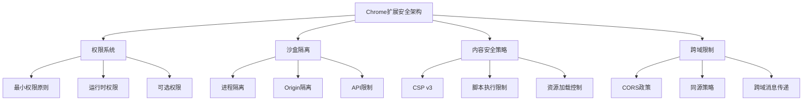

# 第12章：安全性和权限管理

## 学习目标
1. 掌握Chrome扩展的安全架构和威胁模型
2. 学会正确配置和管理权限
3. 实现安全的数据处理和通信机制
4. 防范常见的安全攻击和漏洞

## 12.1 安全架构概述

### 12.1.1 Chrome扩展安全模型



### 12.1.2 安全威胁分析

```javascript
// security-analyzer.js - 安全威胁分析器
class SecurityAnalyzer {
  constructor() {
    this.threats = new Map();
    this.vulnerabilities = new Set();
    this.securityPolicies = new Map();
    this.auditLog = [];
    this.init();
  }

  init() {
    this.setupThreatDetection();
    this.setupVulnerabilityScanning();
    this.setupSecurityPolicies();
    this.startSecurityMonitoring();
  }

  // 威胁模型定义
  defineThreatModel() {
    return {
      // 数据泄露威胁
      dataExfiltration: {
        description: '敏感数据被恶意访问或传输',
        likelihood: 'medium',
        impact: 'high',
        mitigations: [
          '数据加密',
          '访问控制',
          '审计日志',
          '最小权限原则'
        ]
      },

      // 代码注入威胁
      codeInjection: {
        description: '恶意代码被注入到扩展中',
        likelihood: 'medium',
        impact: 'critical',
        mitigations: [
          'CSP策略',
          '输入验证',
          '代码审查',
          '沙盒执行'
        ]
      },

      // 权限滥用威胁
      privilegeEscalation: {
        description: '扩展权限被不当利用',
        likelihood: 'low',
        impact: 'high',
        mitigations: [
          '权限最小化',
          '动态权限',
          '用户授权',
          '权限审计'
        ]
      },

      // 跨站脚本攻击
      xssAttack: {
        description: '恶意脚本在网页中执行',
        likelihood: 'high',
        impact: 'medium',
        mitigations: [
          '输出编码',
          '输入过滤',
          'CSP保护',
          '域名验证'
        ]
      },

      // 中间人攻击
      mitm: {
        description: '网络通信被拦截或篡改',
        likelihood: 'low',
        impact: 'high',
        mitigations: [
          'HTTPS强制',
          '证书验证',
          '请求签名',
          '通信加密'
        ]
      }
    };
  }

  setupThreatDetection() {
    // 检测可疑的网络请求
    this.monitorNetworkRequests();

    // 检测异常的权限使用
    this.monitorPermissionUsage();

    // 检测潜在的XSS攻击
    this.monitorXSSAttempts();

    // 检测数据泄露风险
    this.monitorDataAccess();
  }

  monitorNetworkRequests() {
    // 包装fetch和XMLHttpRequest
    const originalFetch = window.fetch;
    window.fetch = (...args) => {
      this.analyzeRequest('fetch', args);
      return originalFetch.apply(this, args);
    };

    const originalXHROpen = XMLHttpRequest.prototype.open;
    XMLHttpRequest.prototype.open = function(...args) {
      this.analyzeRequest('xhr', args);
      return originalXHROpen.apply(this, args);
    }.bind(this);
  }

  analyzeRequest(type, args) {
    const url = args[0] || args[1];

    if (typeof url === 'string') {
      // 检查是否请求可疑域名
      if (this.isSuspiciousDomain(url)) {
        this.reportThreat('suspicious_domain', {
          url,
          type,
          timestamp: Date.now()
        });
      }

      // 检查是否使用HTTP（应该使用HTTPS）
      if (url.startsWith('http://') && !url.includes('localhost')) {
        this.reportThreat('insecure_connection', {
          url,
          type,
          timestamp: Date.now()
        });
      }

      // 检查是否携带敏感数据
      if (this.containsSensitiveData(args)) {
        this.reportThreat('sensitive_data_transmission', {
          url,
          type,
          timestamp: Date.now()
        });
      }
    }
  }

  monitorPermissionUsage() {
    // 包装chrome API调用
    const originalTabsQuery = chrome.tabs.query;
    chrome.tabs.query = (...args) => {
      this.auditAPIUsage('tabs.query', args);
      return originalTabsQuery.apply(chrome.tabs, args);
    };

    const originalStorageGet = chrome.storage.sync.get;
    chrome.storage.sync.get = (...args) => {
      this.auditAPIUsage('storage.sync.get', args);
      return originalStorageGet.apply(chrome.storage.sync, args);
    };
  }

  auditAPIUsage(api, args) {
    const usage = {
      api,
      args: this.sanitizeArgs(args),
      timestamp: Date.now(),
      callStack: new Error().stack
    };

    this.auditLog.push(usage);

    // 检查是否有异常频繁的API调用
    const recentUsage = this.auditLog.filter(log =>
      log.api === api &&
      Date.now() - log.timestamp < 60000 // 最近一分钟
    );

    if (recentUsage.length > 100) {
      this.reportThreat('excessive_api_usage', {
        api,
        count: recentUsage.length,
        timestamp: Date.now()
      });
    }
  }

  monitorXSSAttempts() {
    // 监控DOM插入操作
    const observer = new MutationObserver((mutations) => {
      mutations.forEach((mutation) => {
        if (mutation.type === 'childList') {
          mutation.addedNodes.forEach(node => {
            if (node.nodeType === Node.ELEMENT_NODE) {
              this.scanForXSS(node);
            }
          });
        }
      });
    });

    observer.observe(document.body, {
      childList: true,
      subtree: true
    });
  }

  scanForXSS(element) {
    const suspiciousPatterns = [
      /<script[^>]*>.*<\/script>/gi,
      /javascript:/gi,
      /on\w+\s*=/gi,
      /<iframe[^>]*>/gi
    ];

    const innerHTML = element.innerHTML;
    suspiciousPatterns.forEach(pattern => {
      if (pattern.test(innerHTML)) {
        this.reportThreat('potential_xss', {
          element: element.tagName,
          content: innerHTML.substring(0, 200),
          timestamp: Date.now()
        });
      }
    });
  }

  monitorDataAccess() {
    // 监控localStorage访问
    const originalSetItem = localStorage.setItem;
    localStorage.setItem = function(key, value) {
      this.auditDataAccess('localStorage.setItem', key, value);
      return originalSetItem.call(localStorage, key, value);
    }.bind(this);

    const originalGetItem = localStorage.getItem;
    localStorage.getItem = function(key) {
      this.auditDataAccess('localStorage.getItem', key);
      return originalGetItem.call(localStorage, key);
    }.bind(this);
  }

  auditDataAccess(operation, key, value = null) {
    // 检查是否访问敏感数据
    if (this.isSensitiveKey(key)) {
      this.auditLog.push({
        operation,
        key,
        hasSensitiveValue: value && this.isSensitiveValue(value),
        timestamp: Date.now()
      });
    }
  }

  isSuspiciousDomain(url) {
    const suspiciousDomains = [
      'malicious-site.com',
      'phishing-domain.net',
      'suspicious-tracker.org'
    ];

    try {
      const domain = new URL(url).hostname;
      return suspiciousDomains.some(suspiciousDomain =>
        domain.includes(suspiciousDomain)
      );
    } catch {
      return false;
    }
  }

  containsSensitiveData(requestArgs) {
    const requestBody = JSON.stringify(requestArgs);
    const sensitivePatterns = [
      /\b\d{4}[\s-]?\d{4}[\s-]?\d{4}[\s-]?\d{4}\b/g, // 信用卡号
      /\b[A-Za-z0-9._%+-]+@[A-Za-z0-9.-]+\.[A-Z|a-z]{2,}\b/g, // 邮箱
      /\b\d{11}\b/g, // 手机号
      /password|token|secret|key/gi // 敏感关键词
    ];

    return sensitivePatterns.some(pattern => pattern.test(requestBody));
  }

  isSensitiveKey(key) {
    const sensitiveKeys = [
      'password', 'token', 'secret', 'apiKey', 'privateKey',
      'creditCard', 'ssn', 'personalData', 'authToken'
    ];

    return sensitiveKeys.some(sensitiveKey =>
      key.toLowerCase().includes(sensitiveKey.toLowerCase())
    );
  }

  isSensitiveValue(value) {
    if (typeof value !== 'string') return false;

    // 检查是否像密码
    if (value.length > 8 && /[A-Z]/.test(value) && /[0-9]/.test(value)) {
      return true;
    }

    // 检查是否像令牌
    if (value.length > 32 && /^[A-Za-z0-9+/]+=*$/.test(value)) {
      return true;
    }

    return false;
  }

  reportThreat(threatType, details) {
    const threat = {
      type: threatType,
      details,
      severity: this.calculateSeverity(threatType),
      timestamp: Date.now(),
      resolved: false
    };

    this.threats.set(`${threatType}_${Date.now()}`, threat);

    console.warn('安全威胁检测:', threat);

    // 发送到安全监控服务（如果有的话）
    this.sendSecurityAlert(threat);
  }

  calculateSeverity(threatType) {
    const severityMap = {
      'suspicious_domain': 'high',
      'insecure_connection': 'medium',
      'sensitive_data_transmission': 'high',
      'excessive_api_usage': 'medium',
      'potential_xss': 'high',
      'unauthorized_access': 'critical'
    };

    return severityMap[threatType] || 'low';
  }

  sendSecurityAlert(threat) {
    // 这里可以发送到安全监控服务
    // 或者记录到本地日志
    chrome.runtime.sendMessage({
      action: 'securityAlert',
      threat: threat
    });
  }

  sanitizeArgs(args) {
    // 移除敏感信息
    return args.map(arg => {
      if (typeof arg === 'string' && this.isSensitiveValue(arg)) {
        return '[SENSITIVE_DATA]';
      }
      if (typeof arg === 'object' && arg !== null) {
        const sanitized = {};
        Object.keys(arg).forEach(key => {
          sanitized[key] = this.isSensitiveKey(key) ? '[SENSITIVE_DATA]' : arg[key];
        });
        return sanitized;
      }
      return arg;
    });
  }

  setupVulnerabilityScanning() {
    // 定期扫描已知漏洞
    setInterval(() => {
      this.scanForVulnerabilities();
    }, 300000); // 每5分钟扫描一次
  }

  scanForVulnerabilities() {
    // 检查依赖项安全问题
    this.checkDependencyVulnerabilities();

    // 检查配置安全问题
    this.checkConfigurationSecurity();

    // 检查权限使用问题
    this.checkPermissionSecurity();
  }

  checkDependencyVulnerabilities() {
    // 检查是否使用了有已知漏洞的库
    const knownVulnerableLibraries = [
      'jquery@1.x.x',
      'lodash@4.17.11',
      'axios@0.18.0'
    ];

    // 这里应该检查实际加载的库
    // 简化示例
    knownVulnerableLibraries.forEach(lib => {
      if (this.isLibraryLoaded(lib)) {
        this.vulnerabilities.add(`vulnerable_dependency: ${lib}`);
      }
    });
  }

  checkConfigurationSecurity() {
    // 检查CSP配置
    const csp = document.querySelector('meta[http-equiv="Content-Security-Policy"]');
    if (!csp || !this.isSecureCSP(csp.content)) {
      this.vulnerabilities.add('weak_csp');
    }

    // 检查是否使用HTTPS
    if (location.protocol !== 'https:' && location.hostname !== 'localhost') {
      this.vulnerabilities.add('insecure_protocol');
    }
  }

  checkPermissionSecurity() {
    // 检查是否使用了过多权限
    chrome.management.getSelf((extensionInfo) => {
      const permissions = extensionInfo.permissions;
      const excessivePermissions = [
        'tabs', 'history', 'bookmarks'
      ];

      const hasExcessive = permissions.some(permission =>
        excessivePermissions.includes(permission)
      );

      if (hasExcessive) {
        this.vulnerabilities.add('excessive_permissions');
      }
    });
  }

  isLibraryLoaded(libraryPattern) {
    // 简化检查，实际应该更复杂
    return false;
  }

  isSecureCSP(cspContent) {
    if (!cspContent) return false;

    // 检查是否禁止了不安全的内联脚本
    if (cspContent.includes("'unsafe-inline'")) return false;

    // 检查是否禁止了eval
    if (cspContent.includes("'unsafe-eval'")) return false;

    // 检查是否有适当的源限制
    if (!cspContent.includes('self') && !cspContent.includes('none')) return false;

    return true;
  }

  setupSecurityPolicies() {
    this.securityPolicies.set('dataRetention', {
      maxAge: 90 * 24 * 60 * 60 * 1000, // 90天
      sensitiveDataMaxAge: 7 * 24 * 60 * 60 * 1000, // 7天
      cleanupInterval: 24 * 60 * 60 * 1000 // 每天清理
    });

    this.securityPolicies.set('networkSecurity', {
      allowedDomains: ['*.example.com', 'api.service.com'],
      requireHTTPS: true,
      maxRequestSize: 1024 * 1024, // 1MB
      timeoutMs: 30000
    });

    this.securityPolicies.set('accessControl', {
      maxLoginAttempts: 3,
      lockoutDurationMs: 15 * 60 * 1000, // 15分钟
      sessionTimeoutMs: 2 * 60 * 60 * 1000, // 2小时
      requireReauthentication: true
    });
  }

  startSecurityMonitoring() {
    // 定期清理敏感数据
    setInterval(() => {
      this.cleanupSensitiveData();
    }, 24 * 60 * 60 * 1000); // 每天

    // 监控异常行为
    setInterval(() => {
      this.analyzeUserBehavior();
    }, 60 * 1000); // 每分钟
  }

  cleanupSensitiveData() {
    const policy = this.securityPolicies.get('dataRetention');
    const now = Date.now();

    // 清理过期的审计日志
    this.auditLog = this.auditLog.filter(log =>
      now - log.timestamp < policy.maxAge
    );

    // 清理过期的威胁记录
    for (const [key, threat] of this.threats.entries()) {
      if (now - threat.timestamp > policy.maxAge) {
        this.threats.delete(key);
      }
    }
  }

  analyzeUserBehavior() {
    // 分析最近的活动模式
    const recentActivity = this.auditLog.filter(log =>
      Date.now() - log.timestamp < 5 * 60 * 1000 // 最近5分钟
    );

    // 检查异常活动
    if (recentActivity.length > 50) {
      this.reportThreat('unusual_activity', {
        activityCount: recentActivity.length,
        timeWindow: '5 minutes'
      });
    }

    // 检查权限使用模式
    const apiUsage = {};
    recentActivity.forEach(log => {
      if (log.api) {
        apiUsage[log.api] = (apiUsage[log.api] || 0) + 1;
      }
    });

    Object.entries(apiUsage).forEach(([api, count]) => {
      if (count > 20) {
        this.reportThreat('excessive_api_usage', {
          api,
          count,
          timeWindow: '5 minutes'
        });
      }
    });
  }

  // 获取安全报告
  getSecurityReport() {
    const now = Date.now();
    const oneDayAgo = now - 24 * 60 * 60 * 1000;

    const recentThreats = Array.from(this.threats.values())
      .filter(threat => threat.timestamp > oneDayAgo);

    const threatsByType = {};
    recentThreats.forEach(threat => {
      threatsByType[threat.type] = (threatsByType[threat.type] || 0) + 1;
    });

    const criticalThreats = recentThreats.filter(threat =>
      threat.severity === 'critical'
    );

    const highThreats = recentThreats.filter(threat =>
      threat.severity === 'high'
    );

    return {
      summary: {
        totalThreats: recentThreats.length,
        criticalThreats: criticalThreats.length,
        highThreats: highThreats.length,
        vulnerabilities: Array.from(this.vulnerabilities),
        securityScore: this.calculateSecurityScore()
      },
      threatsByType,
      recentThreats: recentThreats.slice(0, 10), // 最近10个威胁
      auditStats: {
        totalEvents: this.auditLog.length,
        recentEvents: this.auditLog.filter(log =>
          log.timestamp > oneDayAgo
        ).length
      }
    };
  }

  calculateSecurityScore() {
    let score = 100;

    // 根据威胁数量扣分
    const threats = Array.from(this.threats.values());
    const criticalThreats = threats.filter(t => t.severity === 'critical');
    const highThreats = threats.filter(t => t.severity === 'high');
    const mediumThreats = threats.filter(t => t.severity === 'medium');

    score -= criticalThreats.length * 25;
    score -= highThreats.length * 10;
    score -= mediumThreats.length * 5;

    // 根据漏洞数量扣分
    score -= this.vulnerabilities.size * 15;

    return Math.max(0, Math.min(100, score));
  }
}

// 全局安全分析器实例
const securityAnalyzer = new SecurityAnalyzer();

// 导出供其他模块使用
window.securityAnalyzer = securityAnalyzer;
```

## 12.2 权限管理

### 12.2.1 动态权限系统

```javascript
// permission-manager.js - 权限管理器
class PermissionManager {
  constructor() {
    this.requiredPermissions = new Set();
    this.optionalPermissions = new Set();
    this.grantedPermissions = new Set();
    this.permissionRequests = new Map();
    this.permissionUsage = new Map();
    this.init();
  }

  async init() {
    await this.loadCurrentPermissions();
    this.setupPermissionMonitoring();
    this.setupPermissionPolicies();
  }

  async loadCurrentPermissions() {
    return new Promise((resolve) => {
      chrome.permissions.getAll((permissions) => {
        permissions.permissions.forEach(permission => {
          this.grantedPermissions.add(permission);
        });

        permissions.origins.forEach(origin => {
          this.grantedPermissions.add(origin);
        });

        console.log('当前已授权权限:', Array.from(this.grantedPermissions));
        resolve();
      });
    });
  }

  // 权限分类管理
  definePermissions() {
    // 必需权限（manifest中声明的）
    this.requiredPermissions = new Set([
      'storage',
      'activeTab'
    ]);

    // 可选权限（按需申请的）
    this.optionalPermissions = new Set([
      'tabs',
      'history',
      'bookmarks',
      'downloads',
      'notifications',
      'contextMenus',
      'https://*.example.com/*',
      'https://api.service.com/*'
    ]);
  }

  // 请求权限
  async requestPermission(permission, justification = '') {
    if (this.grantedPermissions.has(permission)) {
      return { granted: true, alreadyGranted: true };
    }

    if (!this.optionalPermissions.has(permission)) {
      return {
        granted: false,
        error: '权限不在可选权限列表中'
      };
    }

    const requestId = this.generateRequestId();
    const request = {
      id: requestId,
      permission,
      justification,
      timestamp: Date.now(),
      status: 'pending'
    };

    this.permissionRequests.set(requestId, request);

    try {
      // 显示权限请求对话框
      const userApproved = await this.showPermissionDialog(permission, justification);

      if (!userApproved) {
        request.status = 'denied';
        return { granted: false, userDenied: true };
      }

      // 请求Chrome权限
      const granted = await this.requestChromePermission(permission);

      if (granted) {
        this.grantedPermissions.add(permission);
        request.status = 'granted';
        this.logPermissionUsage(permission, 'granted');

        return { granted: true, newlyGranted: true };
      } else {
        request.status = 'denied';
        return { granted: false, chromeDenied: true };
      }

    } catch (error) {
      request.status = 'error';
      request.error = error.message;
      return { granted: false, error: error.message };
    }
  }

  async showPermissionDialog(permission, justification) {
    return new Promise((resolve) => {
      const modal = this.createPermissionModal(permission, justification);

      const approveBtn = modal.querySelector('.approve-btn');
      const denyBtn = modal.querySelector('.deny-btn');

      approveBtn.addEventListener('click', () => {
        document.body.removeChild(modal);
        resolve(true);
      });

      denyBtn.addEventListener('click', () => {
        document.body.removeChild(modal);
        resolve(false);
      });

      document.body.appendChild(modal);

      // 自动聚焦到拒绝按钮（更安全的默认选择）
      denyBtn.focus();
    });
  }

  createPermissionModal(permission, justification) {
    const modal = document.createElement('div');
    modal.className = 'permission-modal-overlay';

    const permissionInfo = this.getPermissionInfo(permission);

    modal.innerHTML = `
      <div class="permission-modal">
        <div class="modal-header">
          <h3>权限请求</h3>
          <span class="security-badge">${permissionInfo.riskLevel}</span>
        </div>

        <div class="modal-body">
          <div class="permission-icon">
            <span>${permissionInfo.icon}</span>
          </div>

          <h4>${permissionInfo.name}</h4>
          <p class="permission-description">${permissionInfo.description}</p>

          ${justification ? `
            <div class="justification">
              <h5>需要此权限的原因：</h5>
              <p>${justification}</p>
            </div>
          ` : ''}

          <div class="risk-info">
            <h5>风险提示：</h5>
            <ul>
              ${permissionInfo.risks.map(risk => `<li>${risk}</li>`).join('')}
            </ul>
          </div>

          <div class="usage-info">
            <h5>此权限将用于：</h5>
            <ul>
              ${permissionInfo.usages.map(usage => `<li>${usage}</li>`).join('')}
            </ul>
          </div>
        </div>

        <div class="modal-footer">
          <button class="btn deny-btn">拒绝</button>
          <button class="btn approve-btn">授权</button>
        </div>
      </div>
    `;

    return modal;
  }

  getPermissionInfo(permission) {
    const permissionMap = {
      'tabs': {
        name: '标签页访问',
        icon: '🗂️',
        riskLevel: 'high',
        description: '允许扩展查看和控制浏览器标签页',
        risks: [
          '可以访问所有标签页的URL和标题',
          '可以关闭或修改标签页',
          '可能泄露浏览记录'
        ],
        usages: [
          '管理标签页',
          '同步标签页状态',
          '提供标签页相关功能'
        ]
      },

      'history': {
        name: '浏览历史',
        icon: '📚',
        riskLevel: 'high',
        description: '允许扩展访问浏览历史记录',
        risks: [
          '可以查看完整浏览历史',
          '可能泄露隐私信息',
          '可以删除历史记录'
        ],
        usages: [
          '分析浏览习惯',
          '提供历史记录搜索',
          '生成统计报告'
        ]
      },

      'bookmarks': {
        name: '书签管理',
        icon: '🔖',
        riskLevel: 'medium',
        description: '允许扩展访问和管理书签',
        risks: [
          '可以查看所有书签',
          '可以修改或删除书签',
          '可能泄露个人喜好'
        ],
        usages: [
          '同步书签',
          '管理书签',
          '导入/导出书签'
        ]
      },

      'downloads': {
        name: '下载管理',
        icon: '💾',
        riskLevel: 'medium',
        description: '允许扩展管理下载项目',
        risks: [
          '可以查看下载历史',
          '可以控制下载行为',
          '可以访问下载文件'
        ],
        usages: [
          '管理下载队列',
          '提供下载增强功能',
          '监控下载进度'
        ]
      },

      'notifications': {
        name: '桌面通知',
        icon: '🔔',
        riskLevel: 'low',
        description: '允许扩展显示桌面通知',
        risks: [
          '可能显示干扰性通知',
          '可能被用于垃圾信息'
        ],
        usages: [
          '重要事件提醒',
          '状态更新通知',
          '用户交互反馈'
        ]
      }
    };

    return permissionMap[permission] || {
      name: permission,
      icon: '⚠️',
      riskLevel: 'unknown',
      description: `${permission} 权限`,
      risks: ['未知风险'],
      usages: ['未知用途']
    };
  }

  async requestChromePermission(permission) {
    return new Promise((resolve) => {
      const permissionObject = {
        permissions: [],
        origins: []
      };

      if (permission.includes('://')) {
        permissionObject.origins.push(permission);
      } else {
        permissionObject.permissions.push(permission);
      }

      chrome.permissions.request(permissionObject, (granted) => {
        resolve(granted);
      });
    });
  }

  // 撤销权限
  async revokePermission(permission) {
    if (!this.grantedPermissions.has(permission)) {
      return { revoked: false, notGranted: true };
    }

    try {
      const permissionObject = {
        permissions: [],
        origins: []
      };

      if (permission.includes('://')) {
        permissionObject.origins.push(permission);
      } else {
        permissionObject.permissions.push(permission);
      }

      const revoked = await new Promise((resolve) => {
        chrome.permissions.remove(permissionObject, resolve);
      });

      if (revoked) {
        this.grantedPermissions.delete(permission);
        this.logPermissionUsage(permission, 'revoked');
        return { revoked: true };
      } else {
        return { revoked: false, error: 'Chrome权限撤销失败' };
      }

    } catch (error) {
      return { revoked: false, error: error.message };
    }
  }

  // 检查权限
  hasPermission(permission) {
    return this.grantedPermissions.has(permission);
  }

  async checkPermission(permission) {
    return new Promise((resolve) => {
      const permissionObject = {
        permissions: [],
        origins: []
      };

      if (permission.includes('://')) {
        permissionObject.origins.push(permission);
      } else {
        permissionObject.permissions.push(permission);
      }

      chrome.permissions.contains(permissionObject, resolve);
    });
  }

  // 批量权限管理
  async requestMultiplePermissions(permissions, justifications = {}) {
    const results = {};

    for (const permission of permissions) {
      const justification = justifications[permission] || '';
      results[permission] = await this.requestPermission(permission, justification);

      // 如果用户拒绝了权限，询问是否继续
      if (!results[permission].granted && results[permission].userDenied) {
        const shouldContinue = confirm('某些权限被拒绝，是否继续请求其他权限？');
        if (!shouldContinue) break;
      }
    }

    return results;
  }

  // 权限使用监控
  setupPermissionMonitoring() {
    chrome.permissions.onAdded.addListener((permissions) => {
      permissions.permissions.forEach(permission => {
        this.grantedPermissions.add(permission);
        console.log('权限已添加:', permission);
      });

      permissions.origins.forEach(origin => {
        this.grantedPermissions.add(origin);
        console.log('权限已添加:', origin);
      });
    });

    chrome.permissions.onRemoved.addListener((permissions) => {
      permissions.permissions.forEach(permission => {
        this.grantedPermissions.delete(permission);
        console.log('权限已移除:', permission);
      });

      permissions.origins.forEach(origin => {
        this.grantedPermissions.delete(origin);
        console.log('权限已移除:', origin);
      });
    });
  }

  logPermissionUsage(permission, action, details = {}) {
    const usage = {
      permission,
      action,
      details,
      timestamp: Date.now()
    };

    if (!this.permissionUsage.has(permission)) {
      this.permissionUsage.set(permission, []);
    }

    this.permissionUsage.get(permission).push(usage);

    // 限制日志大小
    const logs = this.permissionUsage.get(permission);
    if (logs.length > 100) {
      logs.splice(0, logs.length - 50);
    }
  }

  setupPermissionPolicies() {
    // 设置权限使用策略
    this.policies = {
      // 权限自动撤销策略
      autoRevoke: {
        enabled: true,
        unusedDays: 30, // 30天未使用自动撤销
        excludePermissions: ['storage', 'activeTab'] // 排除基础权限
      },

      // 权限使用警告策略
      usageWarning: {
        enabled: true,
        excessiveUsageThreshold: 100, // 单小时内使用超过100次
        warningCooldown: 24 * 60 * 60 * 1000 // 24小时内不重复警告
      },

      // 敏感权限策略
      sensitivePermissions: {
        permissions: ['history', 'bookmarks', 'downloads'],
        requireReconfirmation: true,
        reconfirmationInterval: 7 * 24 * 60 * 60 * 1000 // 7天重新确认
      }
    };

    // 启动政策执行
    this.startPolicyEnforcement();
  }

  startPolicyEnforcement() {
    // 每天检查一次权限使用情况
    setInterval(() => {
      this.enforcePermissionPolicies();
    }, 24 * 60 * 60 * 1000);

    // 每小时检查使用模式
    setInterval(() => {
      this.checkUsagePatterns();
    }, 60 * 60 * 1000);
  }

  enforcePermissionPolicies() {
    if (this.policies.autoRevoke.enabled) {
      this.revokeUnusedPermissions();
    }

    if (this.policies.sensitivePermissions.requireReconfirmation) {
      this.checkSensitivePermissionReconfirmation();
    }
  }

  revokeUnusedPermissions() {
    const cutoffTime = Date.now() - (this.policies.autoRevoke.unusedDays * 24 * 60 * 60 * 1000);

    this.grantedPermissions.forEach(permission => {
      if (this.policies.autoRevoke.excludePermissions.includes(permission)) {
        return;
      }

      const usageLogs = this.permissionUsage.get(permission) || [];
      const recentUsage = usageLogs.filter(log =>
        log.timestamp > cutoffTime && log.action === 'used'
      );

      if (recentUsage.length === 0) {
        console.log(`权限 ${permission} 已${this.policies.autoRevoke.unusedDays}天未使用，考虑撤销`);

        // 在这里可以选择自动撤销或通知用户
        this.promptPermissionRevoke(permission);
      }
    });
  }

  promptPermissionRevoke(permission) {
    const shouldRevoke = confirm(
      `权限 "${permission}" 已长时间未使用，是否撤销该权限？\n\n` +
      '撤销后可以在需要时重新申请。'
    );

    if (shouldRevoke) {
      this.revokePermission(permission);
    }
  }

  checkUsagePatterns() {
    const oneHourAgo = Date.now() - 60 * 60 * 1000;

    this.permissionUsage.forEach((logs, permission) => {
      const recentUsage = logs.filter(log =>
        log.timestamp > oneHourAgo && log.action === 'used'
      );

      if (recentUsage.length > this.policies.usageWarning.excessiveUsageThreshold) {
        this.warnExcessiveUsage(permission, recentUsage.length);
      }
    });
  }

  warnExcessiveUsage(permission, count) {
    console.warn(`权限 ${permission} 在过去一小时内使用了 ${count} 次，可能存在异常`);

    // 记录到安全分析器
    if (window.securityAnalyzer) {
      window.securityAnalyzer.reportThreat('excessive_permission_usage', {
        permission,
        count,
        timeWindow: '1 hour'
      });
    }
  }

  generateRequestId() {
    return `req_${Date.now()}_${Math.random().toString(36).substr(2, 9)}`;
  }

  // 获取权限报告
  getPermissionReport() {
    const totalPermissions = this.grantedPermissions.size;
    const requiredCount = Array.from(this.grantedPermissions).filter(p =>
      this.requiredPermissions.has(p)
    ).length;
    const optionalCount = totalPermissions - requiredCount;

    const usageStats = {};
    this.permissionUsage.forEach((logs, permission) => {
      usageStats[permission] = {
        totalUsage: logs.length,
        recentUsage: logs.filter(log =>
          Date.now() - log.timestamp < 24 * 60 * 60 * 1000
        ).length,
        lastUsed: logs.length > 0 ? Math.max(...logs.map(log => log.timestamp)) : null
      };
    });

    return {
      summary: {
        totalPermissions,
        requiredPermissions: requiredCount,
        optionalPermissions: optionalCount,
        pendingRequests: Array.from(this.permissionRequests.values()).filter(req =>
          req.status === 'pending'
        ).length
      },
      permissions: Array.from(this.grantedPermissions),
      usageStats,
      recentRequests: Array.from(this.permissionRequests.values())
        .filter(req => Date.now() - req.timestamp < 24 * 60 * 60 * 1000)
        .sort((a, b) => b.timestamp - a.timestamp)
    };
  }
}

// 全局权限管理器实例
const permissionManager = new PermissionManager();

// 导出供其他模块使用
window.permissionManager = permissionManager;
```

## 12.3 数据加密和保护

### 12.3.1 数据加密实现

```javascript
// crypto-manager.js - 加密管理器
class CryptoManager {
  constructor() {
    this.keyCache = new Map();
    this.encryptionAlgorithm = 'AES-GCM';
    this.keyDerivationAlgorithm = 'PBKDF2';
    this.hashAlgorithm = 'SHA-256';
    this.init();
  }

  async init() {
    // 检查浏览器加密支持
    if (!window.crypto || !window.crypto.subtle) {
      throw new Error('浏览器不支持Web Crypto API');
    }

    console.log('加密管理器初始化完成');
  }

  // 生成随机密钥
  async generateKey(algorithm = this.encryptionAlgorithm) {
    try {
      const key = await crypto.subtle.generateKey(
        {
          name: algorithm,
          length: 256
        },
        true, // 可导出
        ['encrypt', 'decrypt']
      );

      return key;
    } catch (error) {
      console.error('密钥生成失败:', error);
      throw error;
    }
  }

  // 从密码派生密钥
  async deriveKeyFromPassword(password, salt = null) {
    // 如果没有提供salt，生成一个新的
    if (!salt) {
      salt = crypto.getRandomValues(new Uint8Array(16));
    }

    const encoder = new TextEncoder();
    const passwordBuffer = encoder.encode(password);

    // 导入密码作为密钥材料
    const keyMaterial = await crypto.subtle.importKey(
      'raw',
      passwordBuffer,
      { name: this.keyDerivationAlgorithm },
      false,
      ['deriveKey']
    );

    // 派生AES密钥
    const derivedKey = await crypto.subtle.deriveKey(
      {
        name: this.keyDerivationAlgorithm,
        salt: salt,
        iterations: 100000, // OWASP推荐的最小值
        hash: this.hashAlgorithm
      },
      keyMaterial,
      {
        name: this.encryptionAlgorithm,
        length: 256
      },
      false, // 不可导出（更安全）
      ['encrypt', 'decrypt']
    );

    return {
      key: derivedKey,
      salt: salt
    };
  }

  // 加密数据
  async encryptData(data, key = null) {
    try {
      // 如果没有提供密钥，生成一个新的
      if (!key) {
        key = await this.generateKey();
      }

      // 生成随机IV
      const iv = crypto.getRandomValues(new Uint8Array(12));

      // 将数据转换为ArrayBuffer
      const encoder = new TextEncoder();
      const dataBuffer = encoder.encode(JSON.stringify(data));

      // 执行加密
      const encrypted = await crypto.subtle.encrypt(
        {
          name: this.encryptionAlgorithm,
          iv: iv
        },
        key,
        dataBuffer
      );

      // 导出密钥（如果可导出）
      let exportedKey = null;
      try {
        exportedKey = await crypto.subtle.exportKey('jwk', key);
      } catch (e) {
        // 密钥不可导出，这是正常的
      }

      return {
        encrypted: Array.from(new Uint8Array(encrypted)),
        iv: Array.from(iv),
        key: exportedKey,
        algorithm: this.encryptionAlgorithm
      };

    } catch (error) {
      console.error('数据加密失败:', error);
      throw error;
    }
  }

  // 解密数据
  async decryptData(encryptedData, key = null) {
    try {
      let cryptoKey = key;

      // 如果提供的是导出的密钥，需要导入它
      if (key && typeof key === 'object' && key.kty) {
        cryptoKey = await crypto.subtle.importKey(
          'jwk',
          key,
          { name: this.encryptionAlgorithm },
          false,
          ['decrypt']
        );
      }

      if (!cryptoKey) {
        throw new Error('解密密钥不可用');
      }

      // 转换数据格式
      const encrypted = new Uint8Array(encryptedData.encrypted);
      const iv = new Uint8Array(encryptedData.iv);

      // 执行解密
      const decrypted = await crypto.subtle.decrypt(
        {
          name: encryptedData.algorithm || this.encryptionAlgorithm,
          iv: iv
        },
        cryptoKey,
        encrypted
      );

      // 转换回原始数据
      const decoder = new TextDecoder();
      const decryptedString = decoder.decode(decrypted);

      return JSON.parse(decryptedString);

    } catch (error) {
      console.error('数据解密失败:', error);
      throw error;
    }
  }

  // 计算数据哈希
  async hashData(data, algorithm = this.hashAlgorithm) {
    try {
      const encoder = new TextEncoder();
      const dataBuffer = encoder.encode(JSON.stringify(data));

      const hashBuffer = await crypto.subtle.digest(algorithm, dataBuffer);
      const hashArray = Array.from(new Uint8Array(hashBuffer));

      return hashArray.map(b => b.toString(16).padStart(2, '0')).join('');

    } catch (error) {
      console.error('数据哈希失败:', error);
      throw error;
    }
  }

  // 生成HMAC
  async generateHMAC(data, secret) {
    try {
      const encoder = new TextEncoder();

      // 导入密钥
      const key = await crypto.subtle.importKey(
        'raw',
        encoder.encode(secret),
        { name: 'HMAC', hash: this.hashAlgorithm },
        false,
        ['sign']
      );

      // 生成HMAC
      const signature = await crypto.subtle.sign(
        'HMAC',
        key,
        encoder.encode(JSON.stringify(data))
      );

      const signatureArray = Array.from(new Uint8Array(signature));
      return signatureArray.map(b => b.toString(16).padStart(2, '0')).join('');

    } catch (error) {
      console.error('HMAC生成失败:', error);
      throw error;
    }
  }

  // 验证HMAC
  async verifyHMAC(data, signature, secret) {
    try {
      const expectedSignature = await this.generateHMAC(data, secret);
      return expectedSignature === signature;

    } catch (error) {
      console.error('HMAC验证失败:', error);
      return false;
    }
  }

  // 安全存储数据
  async secureStore(key, data, password = null) {
    try {
      let encryptionKey;

      if (password) {
        // 使用密码派生密钥
        const derivedKeyInfo = await this.deriveKeyFromPassword(password);
        encryptionKey = derivedKeyInfo.key;

        // 存储salt以便后续使用
        const saltKey = `${key}_salt`;
        await chrome.storage.local.set({
          [saltKey]: Array.from(derivedKeyInfo.salt)
        });
      } else {
        // 生成随机密钥并存储
        encryptionKey = await this.generateKey();
        const exportedKey = await crypto.subtle.exportKey('jwk', encryptionKey);

        const keyStorageKey = `${key}_key`;
        await chrome.storage.local.set({
          [keyStorageKey]: exportedKey
        });
      }

      // 加密数据
      const encryptedData = await this.encryptData(data, encryptionKey);

      // 存储加密后的数据
      await chrome.storage.local.set({
        [key]: {
          encrypted: encryptedData.encrypted,
          iv: encryptedData.iv,
          algorithm: encryptedData.algorithm,
          timestamp: Date.now(),
          protected: !!password
        }
      });

      console.log(`数据已安全存储: ${key}`);
      return true;

    } catch (error) {
      console.error('安全存储失败:', error);
      throw error;
    }
  }

  // 安全读取数据
  async secureRetrieve(key, password = null) {
    try {
      // 获取加密数据
      const result = await chrome.storage.local.get(key);
      const encryptedData = result[key];

      if (!encryptedData) {
        return null;
      }

      let decryptionKey;

      if (encryptedData.protected && password) {
        // 获取salt并重新派生密钥
        const saltResult = await chrome.storage.local.get(`${key}_salt`);
        const salt = new Uint8Array(saltResult[`${key}_salt`]);

        const derivedKeyInfo = await this.deriveKeyFromPassword(password, salt);
        decryptionKey = derivedKeyInfo.key;

      } else if (!encryptedData.protected) {
        // 获取存储的密钥
        const keyResult = await chrome.storage.local.get(`${key}_key`);
        const exportedKey = keyResult[`${key}_key`];

        if (exportedKey) {
          decryptionKey = await crypto.subtle.importKey(
            'jwk',
            exportedKey,
            { name: this.encryptionAlgorithm },
            false,
            ['decrypt']
          );
        }
      } else {
        throw new Error('需要密码来解密受保护的数据');
      }

      if (!decryptionKey) {
        throw new Error('解密密钥不可用');
      }

      // 解密数据
      const decryptedData = await this.decryptData(encryptedData, decryptionKey);

      console.log(`数据已安全读取: ${key}`);
      return decryptedData;

    } catch (error) {
      console.error('安全读取失败:', error);
      throw error;
    }
  }

  // 安全删除数据
  async secureDelete(key) {
    try {
      const keysToRemove = [
        key,
        `${key}_key`,
        `${key}_salt`
      ];

      await chrome.storage.local.remove(keysToRemove);

      // 清理密钥缓存
      this.keyCache.delete(key);

      console.log(`安全数据已删除: ${key}`);
      return true;

    } catch (error) {
      console.error('安全删除失败:', error);
      throw error;
    }
  }

  // 生成安全随机数
  generateSecureRandom(length = 32) {
    return Array.from(crypto.getRandomValues(new Uint8Array(length)));
  }

  // 生成安全随机字符串
  generateSecureRandomString(length = 32) {
    const chars = 'ABCDEFGHIJKLMNOPQRSTUVWXYZabcdefghijklmnopqrstuvwxyz0123456789';
    const randomBytes = crypto.getRandomValues(new Uint8Array(length));

    return Array.from(randomBytes)
      .map(byte => chars[byte % chars.length])
      .join('');
  }

  // 密码强度检查
  checkPasswordStrength(password) {
    const checks = {
      length: password.length >= 12,
      uppercase: /[A-Z]/.test(password),
      lowercase: /[a-z]/.test(password),
      numbers: /[0-9]/.test(password),
      symbols: /[^A-Za-z0-9]/.test(password),
      noCommonWords: !this.containsCommonWords(password),
      noRepeatedChars: !this.hasRepeatedChars(password)
    };

    const score = Object.values(checks).filter(Boolean).length;
    const maxScore = Object.keys(checks).length;

    let strength;
    if (score < 3) strength = 'weak';
    else if (score < 5) strength = 'medium';
    else if (score < 7) strength = 'strong';
    else strength = 'very_strong';

    return {
      strength,
      score,
      maxScore,
      checks,
      suggestions: this.getPasswordSuggestions(checks)
    };
  }

  containsCommonWords(password) {
    const commonWords = [
      'password', '123456', 'qwerty', 'admin', 'welcome',
      'letmein', 'monkey', 'dragon', 'master', 'login'
    ];

    return commonWords.some(word =>
      password.toLowerCase().includes(word)
    );
  }

  hasRepeatedChars(password) {
    return /(.)\1{2,}/.test(password); // 检查连续3个或更多相同字符
  }

  getPasswordSuggestions(checks) {
    const suggestions = [];

    if (!checks.length) suggestions.push('使用至少12个字符');
    if (!checks.uppercase) suggestions.push('包含大写字母');
    if (!checks.lowercase) suggestions.push('包含小写字母');
    if (!checks.numbers) suggestions.push('包含数字');
    if (!checks.symbols) suggestions.push('包含特殊符号');
    if (!checks.noCommonWords) suggestions.push('避免使用常见词汇');
    if (!checks.noRepeatedChars) suggestions.push('避免重复字符');

    return suggestions;
  }

  // 数据完整性验证
  async createIntegrityChecksum(data) {
    const hash = await this.hashData(data);
    const timestamp = Date.now();

    return {
      checksum: hash,
      timestamp,
      algorithm: this.hashAlgorithm
    };
  }

  async verifyIntegrity(data, integrity) {
    try {
      const currentHash = await this.hashData(data);
      return currentHash === integrity.checksum;
    } catch (error) {
      console.error('完整性验证失败:', error);
      return false;
    }
  }

  // 获取加密状态报告
  getCryptoReport() {
    const supportedAlgorithms = {
      encryption: [this.encryptionAlgorithm],
      hashing: [this.hashAlgorithm],
      keyDerivation: [this.keyDerivationAlgorithm]
    };

    const securityFeatures = {
      webCryptoSupported: !!window.crypto.subtle,
      randomGenerationSupported: !!window.crypto.getRandomValues,
      keyStorage: 'chrome.storage.local',
      passwordProtection: true,
      integrityChecking: true
    };

    return {
      supportedAlgorithms,
      securityFeatures,
      keyCache: {
        size: this.keyCache.size,
        keys: Array.from(this.keyCache.keys())
      }
    };
  }
}

// 全局加密管理器实例
const cryptoManager = new CryptoManager();

// 导出供其他模块使用
window.cryptoManager = cryptoManager;
```

:::warning 安全注意事项
1. **权限最小化**: 只申请必要的权限，避免过度权限
2. **数据加密**: 敏感数据必须加密存储
3. **输入验证**: 严格验证所有用户输入
4. **HTTPS强制**: 所有网络通信必须使用HTTPS
5. **定期审计**: 定期检查权限使用和安全配置
:::

:::tip 最佳实践
- 实施多层防护机制
- 使用强密码和多因素认证
- 定期更新安全策略和依赖项
- 建立安全事件响应流程
- 进行安全测试和代码审查
:::

:::note 总结
本章深入介绍了Chrome扩展的安全架构、权限管理和数据保护技术。安全性是扩展开发中最重要的考虑因素之一，直接影响用户信任和扩展的成功。下一章我们将学习测试和调试技巧，确保扩展的质量和稳定性。
:::