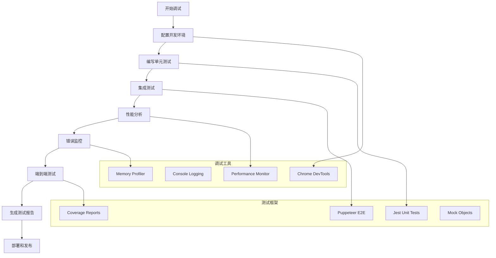

# 第13章：测试和调试技巧

## 学习目标
1. 掌握Chrome扩展的调试工具使用
2. 理解单元测试和集成测试在扩展开发中的应用
3. 学会使用开发者工具进行性能分析
4. 掌握错误处理和异常监控
5. 学会测试环境的搭建和配置

## 1. Chrome扩展调试基础

### 1.1 开发者工具的使用

Chrome扩展调试主要依靠浏览器的开发者工具。

```javascript
// manifest.json - 开发环境配置
{
  "manifest_version": 3,
  "name": "Debug Extension",
  "version": "1.0",
  "permissions": ["tabs", "storage", "debugger"],
  "background": {
    "service_worker": "background.js",
    "type": "module"
  },
  "content_scripts": [{
    "matches": ["<all_urls>"],
    "js": ["debug-content.js"]
  }],
  "action": {
    "default_popup": "popup.html"
  },
  "devtools_page": "devtools.html"
}
```

```javascript
// background.js - 调试工具集成
class ExtensionDebugger {
  constructor() {
    this.isDebugMode = true;
    this.logs = [];
    this.setupErrorHandling();
  }

  log(level, message, data = {}) {
    const logEntry = {
      timestamp: new Date().toISOString(),
      level,
      message,
      data,
      stack: new Error().stack
    };

    this.logs.push(logEntry);

    if (this.isDebugMode) {
      console.group(`[${level.toUpperCase()}] ${message}`);
      console.log('Data:', data);
      console.log('Stack:', logEntry.stack);
      console.groupEnd();
    }
  }

  setupErrorHandling() {
    // 全局错误处理
    self.addEventListener('error', (event) => {
      this.log('error', 'Global Error', {
        message: event.message,
        filename: event.filename,
        lineno: event.lineno,
        colno: event.colno,
        error: event.error
      });
    });

    // Promise拒绝处理
    self.addEventListener('unhandledrejection', (event) => {
      this.log('error', 'Unhandled Promise Rejection', {
        reason: event.reason,
        promise: event.promise
      });
    });
  }

  async exportLogs() {
    const blob = new Blob([JSON.stringify(this.logs, null, 2)], {
      type: 'application/json'
    });

    // 将日志保存到storage
    await chrome.storage.local.set({
      debugLogs: this.logs
    });

    return blob;
  }
}

const debugger = new ExtensionDebugger();
```

### 1.2 高级调试工具类

```javascript
// advanced-debugger.js - 高级调试工具
class ChromeExtensionDebugger {
  constructor() {
    this.debugMode = true;
    this.logs = [];
    this.performanceMarks = {};
    this.memoryUsage = {};
  }

  log(level, message, data = {}) {
    const logEntry = {
      timestamp: new Date().toISOString(),
      level,
      message,
      data,
      stack: new Error().stack
    };

    this.logs.push(logEntry);

    if (this.debugMode) {
      console.group(`[${level.toUpperCase()}] ${message}`);
      if (Object.keys(data).length > 0) {
        console.log('Data:', JSON.stringify(data, null, 2));
      }
      console.groupEnd();
    }
  }

  markPerformance(label) {
    this.performanceMarks[label] = Date.now();
    performance.mark(label);
  }

  measurePerformance(startLabel, endLabel) {
    if (this.performanceMarks[startLabel] && this.performanceMarks[endLabel]) {
      const startTime = this.performanceMarks[startLabel];
      const endTime = this.performanceMarks[endLabel];
      const duration = endTime - startTime;

      this.log('performance', `Duration: ${startLabel} to ${endLabel}`, {
        duration_ms: duration,
        start_time: new Date(startTime).toISOString(),
        end_time: new Date(endTime).toISOString()
      });

      return duration;
    }
    return 0;
  }

  trackMemory(component) {
    if (performance.memory) {
      const memoryInfo = performance.memory;

      this.memoryUsage[component] = {
        timestamp: new Date().toISOString(),
        used: memoryInfo.usedJSHeapSize,
        total: memoryInfo.totalJSHeapSize,
        limit: memoryInfo.jsHeapSizeLimit,
        percent: (memoryInfo.usedJSHeapSize / memoryInfo.jsHeapSizeLimit * 100).toFixed(2)
      };

      this.log('memory', `Memory usage for ${component}`, this.memoryUsage[component]);
    } else {
      this.log('warning', 'Memory API not available');
    }
  }

  exportLogs() {
    return {
      timestamp: new Date().toISOString(),
      totalLogs: this.logs.length,
      logs: this.logs,
      memoryUsage: this.memoryUsage,
      performanceMarks: this.performanceMarks
    };
  }
}

// 测试工具类
class ChromeExtensionTestCase {
  constructor() {
    this.debugger = new ChromeExtensionDebugger();
    this.chromeMock = this.createChromeMock();
  }

  createChromeMock() {
    return {
      storage: {
        local: {
          set: jest.fn().mockResolvedValue(true),
          get: jest.fn(),
          remove: jest.fn()
        }
      },
      runtime: {
        sendMessage: jest.fn(),
        onMessage: {
          addListener: jest.fn()
        }
      }
    };
  }

  async testBackgroundScript() {
    // 测试后台脚本功能
    const result = await this.simulateStorageOperation();

    if (result) {
      this.debugger.log('info', 'Background script test passed');
      return true;
    } else {
      this.debugger.log('error', 'Background script test failed');
      return false;
    }
  }

  async simulateStorageOperation() {
    try {
      const data = { test_key: 'test_value' };
      this.debugger.log('info', 'Storing data', data);

      await this.chromeMock.storage.local.set(data);
      return true;
    } catch (error) {
      this.debugger.log('error', 'Storage failed', { error: error.message });
      return false;
    }
  }
}

// 使用示例
async function runDebuggerExample() {
  const debugger = new ChromeExtensionDebugger();
  debugger.log('info', 'Extension started');
  debugger.markPerformance('start');

  // 模拟一些操作
  await new Promise(resolve => setTimeout(resolve, 100));

  debugger.markPerformance('end');
  debugger.measurePerformance('start', 'end');
  debugger.trackMemory('background_script');

  console.log(`\nTotal logs: ${debugger.logs.length}`);

  // 导出日志
  const report = debugger.exportLogs();
  console.log('Debug Report:', report);
}

// 运行测试
async function runTests() {
  const testCase = new ChromeExtensionTestCase();
  await testCase.testBackgroundScript();
}
```

## 2. 单元测试和集成测试

### 2.1 Jest测试框架集成

```javascript
// test-setup.js - 测试环境配置
import { jest } from '@jest/globals';

// 模拟Chrome API
global.chrome = {
  runtime: {
    sendMessage: jest.fn(),
    onMessage: {
      addListener: jest.fn(),
      removeListener: jest.fn()
    },
    getManifest: jest.fn(() => ({
      name: 'Test Extension',
      version: '1.0'
    }))
  },
  storage: {
    local: {
      get: jest.fn(),
      set: jest.fn(),
      remove: jest.fn()
    },
    sync: {
      get: jest.fn(),
      set: jest.fn(),
      remove: jest.fn()
    }
  },
  tabs: {
    query: jest.fn(),
    create: jest.fn(),
    update: jest.fn()
  }
};

// 模拟DOM
global.document = {
  createElement: jest.fn(),
  getElementById: jest.fn(),
  querySelector: jest.fn(),
  querySelectorAll: jest.fn()
};
```

```javascript
// storage.test.js - 存储功能测试
import { StorageManager } from '../src/storage.js';

describe('StorageManager', () => {
  let storageManager;

  beforeEach(() => {
    storageManager = new StorageManager();
    jest.clearAllMocks();
  });

  test('should save data to local storage', async () => {
    const testData = { key: 'value' };
    chrome.storage.local.set.mockResolvedValue();

    await storageManager.saveLocal('testKey', testData);

    expect(chrome.storage.local.set).toHaveBeenCalledWith({
      testKey: testData
    });
  });

  test('should retrieve data from local storage', async () => {
    const testData = { testKey: { key: 'value' } };
    chrome.storage.local.get.mockResolvedValue(testData);

    const result = await storageManager.getLocal('testKey');

    expect(chrome.storage.local.get).toHaveBeenCalledWith('testKey');
    expect(result).toEqual({ key: 'value' });
  });

  test('should handle storage errors', async () => {
    chrome.storage.local.set.mockRejectedValue(new Error('Storage error'));

    await expect(storageManager.saveLocal('testKey', 'value'))
      .rejects.toThrow('Storage error');
  });
});
```

```javascript
// message.test.js - 消息传递测试
import { MessageHandler } from '../src/message.js';

describe('MessageHandler', () => {
  let messageHandler;

  beforeEach(() => {
    messageHandler = new MessageHandler();
    jest.clearAllMocks();
  });

  test('should send message correctly', async () => {
    chrome.runtime.sendMessage.mockResolvedValue({ success: true });

    const response = await messageHandler.sendMessage('test', { data: 'value' });

    expect(chrome.runtime.sendMessage).toHaveBeenCalledWith({
      action: 'test',
      payload: { data: 'value' }
    });
    expect(response).toEqual({ success: true });
  });

  test('should register message listeners', () => {
    const handler = jest.fn();
    messageHandler.onMessage('test', handler);

    expect(chrome.runtime.onMessage.addListener).toHaveBeenCalled();
  });
});
```

### 2.2 端到端测试

```javascript
// e2e.test.js - 端到端测试
import puppeteer from 'puppeteer';
import path from 'path';

describe('Extension E2E Tests', () => {
  let browser;
  let page;
  const extensionPath = path.join(__dirname, '../dist');

  beforeAll(async () => {
    browser = await puppeteer.launch({
      headless: false,
      args: [
        `--disable-extensions-except=${extensionPath}`,
        `--load-extension=${extensionPath}`,
        '--no-sandbox'
      ]
    });

    page = await browser.newPage();
  });

  afterAll(async () => {
    await browser.close();
  });

  test('should load extension popup', async () => {
    // 获取扩展ID
    const targets = await browser.targets();
    const extensionTarget = targets.find(
      target => target.type() === 'service_worker'
    );

    expect(extensionTarget).toBeDefined();

    // 测试popup页面
    const popupPage = await browser.newPage();
    await popupPage.goto(`chrome-extension://${extensionTarget.url().split('/')[2]}/popup.html`);

    const title = await popupPage.title();
    expect(title).toBe('Extension Popup');
  });

  test('should inject content script', async () => {
    await page.goto('https://example.com');

    // 等待content script加载
    await page.waitForFunction(() => window.extensionInjected === true);

    const injected = await page.evaluate(() => window.extensionInjected);
    expect(injected).toBe(true);
  });
});
```

## 3. 性能分析和优化

### 3.1 性能监控工具

```javascript
// performance-monitor.js
class PerformanceMonitor {
  constructor() {
    this.metrics = new Map();
    this.observers = [];
    this.setupObservers();
  }

  setupObservers() {
    // 性能观察者
    if (typeof PerformanceObserver !== 'undefined') {
      const observer = new PerformanceObserver((list) => {
        for (const entry of list.getEntries()) {
          this.recordMetric(entry.name, entry.duration, entry.entryType);
        }
      });

      observer.observe({ entryTypes: ['measure', 'navigation'] });
      this.observers.push(observer);
    }

    // 内存使用监控
    setInterval(() => {
      if (performance.memory) {
        this.recordMemoryUsage();
      }
    }, 5000);
  }

  recordMetric(name, value, type = 'custom') {
    const timestamp = Date.now();
    if (!this.metrics.has(name)) {
      this.metrics.set(name, []);
    }

    this.metrics.get(name).push({
      value,
      type,
      timestamp
    });

    // 保持最近100条记录
    const entries = this.metrics.get(name);
    if (entries.length > 100) {
      entries.splice(0, entries.length - 100);
    }
  }

  recordMemoryUsage() {
    const memory = performance.memory;
    this.recordMetric('memory.used', memory.usedJSHeapSize, 'memory');
    this.recordMetric('memory.total', memory.totalJSHeapSize, 'memory');
    this.recordMetric('memory.limit', memory.jsHeapSizeLimit, 'memory');
  }

  mark(name) {
    performance.mark(name);
  }

  measure(name, startMark, endMark) {
    performance.measure(name, startMark, endMark);
  }

  getMetrics() {
    const result = {};
    for (const [name, values] of this.metrics) {
      result[name] = {
        count: values.length,
        average: values.reduce((sum, v) => sum + v.value, 0) / values.length,
        min: Math.min(...values.map(v => v.value)),
        max: Math.max(...values.map(v => v.value)),
        latest: values[values.length - 1]
      };
    }
    return result;
  }

  generateReport() {
    const metrics = this.getMetrics();
    const report = {
      timestamp: new Date().toISOString(),
      metrics,
      recommendations: this.generateRecommendations(metrics)
    };

    console.table(metrics);
    return report;
  }

  generateRecommendations(metrics) {
    const recommendations = [];

    // 内存使用建议
    if (metrics['memory.used']?.average > 50 * 1024 * 1024) {
      recommendations.push({
        type: 'memory',
        severity: 'warning',
        message: 'High memory usage detected. Consider optimizing data structures.'
      });
    }

    // 性能建议
    for (const [name, data] of Object.entries(metrics)) {
      if (data.average > 100 && name !== 'memory.limit') {
        recommendations.push({
          type: 'performance',
          severity: 'info',
          message: `${name} has high average duration (${data.average.toFixed(2)}ms)`
        });
      }
    }

    return recommendations;
  }
}

// 使用示例
const monitor = new PerformanceMonitor();

// 在关键操作前后添加标记
monitor.mark('operation-start');
// 执行操作...
monitor.mark('operation-end');
monitor.measure('operation-duration', 'operation-start', 'operation-end');
```

## 4. 错误处理和异常监控

### 4.1 错误监控系统

```javascript
// error-monitor.js
class ErrorMonitor {
  constructor() {
    this.errors = [];
    this.maxErrors = 1000;
    this.listeners = new Set();
    this.setupErrorHandlers();
  }

  setupErrorHandlers() {
    // JavaScript错误
    self.addEventListener('error', (event) => {
      this.captureError({
        type: 'javascript',
        message: event.message,
        filename: event.filename,
        lineno: event.lineno,
        colno: event.colno,
        stack: event.error?.stack,
        timestamp: Date.now()
      });
    });

    // Promise拒绝
    self.addEventListener('unhandledrejection', (event) => {
      this.captureError({
        type: 'promise',
        message: event.reason?.message || 'Unhandled Promise Rejection',
        reason: event.reason,
        stack: event.reason?.stack,
        timestamp: Date.now()
      });
    });

    // Chrome扩展特定错误
    if (chrome?.runtime?.lastError) {
      this.captureError({
        type: 'chrome',
        message: chrome.runtime.lastError.message,
        timestamp: Date.now()
      });
    }
  }

  captureError(error) {
    // 添加上下文信息
    const enrichedError = {
      ...error,
      id: this.generateErrorId(),
      url: location?.href || 'unknown',
      userAgent: navigator?.userAgent || 'unknown',
      manifest: chrome?.runtime?.getManifest() || {}
    };

    this.errors.push(enrichedError);

    // 限制错误数量
    if (this.errors.length > this.maxErrors) {
      this.errors.shift();
    }

    // 通知监听器
    this.notifyListeners(enrichedError);

    // 记录到控制台
    console.error('[ErrorMonitor]', enrichedError);
  }

  generateErrorId() {
    return Date.now().toString(36) + Math.random().toString(36).substr(2);
  }

  notifyListeners(error) {
    this.listeners.forEach(listener => {
      try {
        listener(error);
      } catch (e) {
        console.error('Error in error listener:', e);
      }
    });
  }

  onError(listener) {
    this.listeners.add(listener);
    return () => this.listeners.delete(listener);
  }

  getErrors(filter = {}) {
    let filtered = this.errors;

    if (filter.type) {
      filtered = filtered.filter(e => e.type === filter.type);
    }

    if (filter.since) {
      filtered = filtered.filter(e => e.timestamp >= filter.since);
    }

    if (filter.message) {
      filtered = filtered.filter(e =>
        e.message.toLowerCase().includes(filter.message.toLowerCase())
      );
    }

    return filtered.sort((a, b) => b.timestamp - a.timestamp);
  }

  generateErrorReport() {
    const now = Date.now();
    const lastHour = now - 3600000;
    const recentErrors = this.getErrors({ since: lastHour });

    const report = {
      timestamp: new Date().toISOString(),
      totalErrors: this.errors.length,
      recentErrors: recentErrors.length,
      errorTypes: this.groupBy(this.errors, 'type'),
      topErrors: this.getTopErrors(5),
      timeline: this.generateTimeline()
    };

    return report;
  }

  groupBy(array, key) {
    return array.reduce((groups, item) => {
      const group = item[key] || 'unknown';
      groups[group] = (groups[group] || 0) + 1;
      return groups;
    }, {});
  }

  getTopErrors(count = 5) {
    const errorGroups = this.groupBy(this.errors, 'message');
    return Object.entries(errorGroups)
      .sort(([,a], [,b]) => b - a)
      .slice(0, count)
      .map(([message, count]) => ({ message, count }));
  }

  generateTimeline() {
    const hours = 24;
    const timeline = new Array(hours).fill(0);
    const now = Date.now();

    this.errors.forEach(error => {
      const hoursAgo = Math.floor((now - error.timestamp) / 3600000);
      if (hoursAgo < hours) {
        timeline[hours - 1 - hoursAgo]++;
      }
    });

    return timeline;
  }

  async exportErrors() {
    const report = this.generateErrorReport();
    const blob = new Blob([JSON.stringify(report, null, 2)], {
      type: 'application/json'
    });

    // 保存到storage
    await chrome.storage.local.set({
      errorReport: report,
      lastReportTime: Date.now()
    });

    return blob;
  }
}

// 全局错误监控实例
const errorMonitor = new ErrorMonitor();

// 错误通知示例
errorMonitor.onError((error) => {
  if (error.type === 'javascript' && error.message.includes('critical')) {
    // 发送紧急通知
    chrome.notifications?.create({
      type: 'basic',
      iconUrl: 'icon.png',
      title: 'Extension Error',
      message: 'A critical error occurred in the extension'
    });
  }
});
```

::: tip 调试技巧
1. 使用console.group()组织日志输出
2. 利用performance.mark()和performance.measure()测量性能
3. 在开发环境启用详细日志记录
4. 使用Chrome DevTools的Network和Performance面板
:::

::: warning 注意事项
- 生产环境要关闭调试日志以避免性能影响
- 错误监控不应影响正常功能的执行
- 注意保护用户隐私，不要收集敏感信息
:::

## 5. 测试自动化和CI/CD集成

### 5.1 GitHub Actions配置

```yaml
# .github/workflows/test.yml
name: Chrome Extension Tests

on:
  push:
    branches: [ main, develop ]
  pull_request:
    branches: [ main ]

jobs:
  test:
    runs-on: ubuntu-latest

    steps:
    - uses: actions/checkout@v3

    - name: Setup Node.js
      uses: actions/setup-node@v3
      with:
        node-version: '18'
        cache: 'npm'

    - name: Install dependencies
      run: npm ci

    - name: Run linting
      run: npm run lint

    - name: Run unit tests
      run: npm test -- --coverage

    - name: Build extension
      run: npm run build

    - name: Run E2E tests
      run: npm run test:e2e

    - name: Upload coverage reports
      uses: codecov/codecov-action@v3
      with:
        file: ./coverage/lcov.info

    - name: Package extension
      if: github.ref == 'refs/heads/main'
      run: npm run package

    - name: Upload artifacts
      uses: actions/upload-artifact@v3
      with:
        name: extension-package
        path: dist/*.zip
```

## 学习小结

本章学习了Chrome扩展的测试和调试技巧：

1. **调试工具使用**：掌握了Chrome开发者工具在扩展调试中的应用
2. **测试框架集成**：学会了Jest单元测试和Puppeteer端到端测试
3. **性能监控**：实现了性能指标收集和分析系统
4. **错误处理**：建立了完整的错误监控和报告机制
5. **自动化测试**：配置了CI/CD流程确保代码质量

这些技能将帮助开发者构建更稳定、高性能的Chrome扩展应用。

## Mermaid流程图

