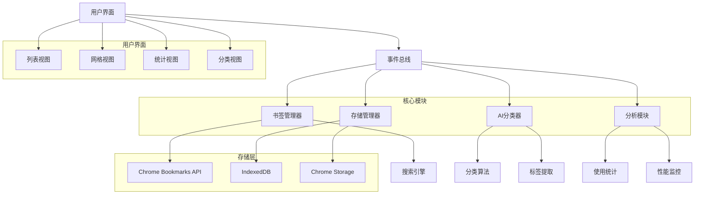

# 第14章：实战项目开发

## 学习目标
1. 掌握完整的Chrome扩展项目开发流程
2. 学会项目架构设计和模块化开发
3. 理解复杂功能的实现方案
4. 掌握项目协作和版本管理
5. 学会性能优化和用户体验提升

## 1. 项目规划和架构设计

### 1.1 项目需求分析

我们将开发一个名为"智能书签管理器"的Chrome扩展，具备以下功能：

- 智能分类书签
- 快速搜索和访问
- 书签导入导出
- 访问统计和分析
- 云端同步
- 标签管理

```javascript
// project-spec.js - 项目规格说明
const ProjectSpec = {
  name: "Smart Bookmark Manager",
  version: "1.0.0",
  description: "Intelligent bookmark management with AI-powered categorization",

  features: {
    core: [
      "bookmark_creation",
      "bookmark_editing",
      "bookmark_deletion",
      "folder_management"
    ],
    advanced: [
      "ai_categorization",
      "smart_search",
      "duplicate_detection",
      "import_export"
    ],
    analytics: [
      "visit_tracking",
      "usage_statistics",
      "popular_sites"
    ],
    sync: [
      "cloud_backup",
      "cross_device_sync",
      "offline_support"
    ]
  },

  architecture: {
    background: "Service Worker for data processing",
    popup: "Main interface for bookmark operations",
    options: "Settings and configuration",
    content: "Website integration and data extraction",
    storage: "IndexedDB for complex data, Chrome Storage for settings"
  },

  permissions: [
    "bookmarks",
    "storage",
    "unlimitedStorage",
    "tabs",
    "activeTab",
    "identity"
  ]
};
```

### 1.2 项目架构设计

```javascript
// src/architecture.js - 架构设计
class ProjectArchitecture {
  constructor() {
    this.modules = {
      core: new CoreModule(),
      ui: new UIModule(),
      storage: new StorageModule(),
      analytics: new AnalyticsModule(),
      sync: new SyncModule(),
      ai: new AIModule()
    };
  }

  initialize() {
    // 初始化所有模块
    Object.values(this.modules).forEach(module => {
      module.initialize();
    });

    // 建立模块间通信
    this.setupModuleCommunication();
  }

  setupModuleCommunication() {
    const eventBus = new EventBus();

    // 为所有模块注册事件总线
    Object.values(this.modules).forEach(module => {
      module.setEventBus(eventBus);
    });
  }
}

// 事件总线
class EventBus {
  constructor() {
    this.listeners = new Map();
  }

  on(event, callback) {
    if (!this.listeners.has(event)) {
      this.listeners.set(event, []);
    }
    this.listeners.get(event).push(callback);
  }

  emit(event, data) {
    if (this.listeners.has(event)) {
      this.listeners.get(event).forEach(callback => callback(data));
    }
  }

  off(event, callback) {
    if (this.listeners.has(event)) {
      const callbacks = this.listeners.get(event);
      const index = callbacks.indexOf(callback);
      if (index > -1) {
        callbacks.splice(index, 1);
      }
    }
  }
}
```

### 1.3 项目结构配置

**项目目录结构 (JSON)**

```json
{
  "src": {
    "background": ["background.js"],
    "content": ["content.js"],
    "popup": ["popup.html", "popup.css", "popup.js"],
    "options": ["options.html", "options.css", "options.js"],
    "components": ["header.js", "sidebar.js", "main.js"],
    "modules": ["storage.js", "analytics.js", "ai.js"],
    "utils": ["helpers.js", "constants.js", "api.js"],
    "styles": ["global.css", "variables.css", "components.css"]
  },
  "assets": {
    "icons": ["icon16.png", "icon48.png", "icon128.png"],
    "images": [],
    "fonts": []
  },
  "tests": {
    "unit": ["storage.test.js", "analytics.test.js"],
    "integration": ["popup.test.js", "background.test.js"],
    "e2e": ["extension.e2e.js"]
  },
  "docs": ["README.md", "API.md", "CHANGELOG.md"],
  "build": [],
  "dist": []
}
```

**manifest.json 配置**

```json
{
  "manifest_version": 3,
  "name": "Smart Bookmark Manager",
  "version": "1.0.0",
  "description": "Smart Bookmark Manager Chrome Extension",
  "permissions": [
    "storage",
    "unlimitedStorage",
    "bookmarks",
    "tabs",
    "activeTab"
  ],
  "background": {
    "service_worker": "src/background/background.js",
    "type": "module"
  },
  "content_scripts": [{
    "matches": ["<all_urls>"],
    "js": ["src/content/content.js"]
  }],
  "action": {
    "default_popup": "src/popup/popup.html",
    "default_title": "Smart Bookmark Manager"
  },
  "options_page": "src/options/options.html",
  "icons": {
    "16": "assets/icons/icon16.png",
    "48": "assets/icons/icon48.png",
    "128": "assets/icons/icon128.png"
  }
}
```

**package.json 配置**

```json
{
  "name": "smart-bookmark-manager",
  "version": "1.0.0",
  "description": "Smart Bookmark Manager Chrome Extension",
  "scripts": {
    "build": "webpack --mode=production",
    "dev": "webpack --mode=development --watch",
    "test": "jest",
    "test:watch": "jest --watch",
    "lint": "eslint src/",
    "lint:fix": "eslint src/ --fix",
    "package": "npm run build && zip -r dist/extension.zip dist/"
  },
  "devDependencies": {
    "webpack": "^5.0.0",
    "webpack-cli": "^4.0.0",
    "jest": "^29.0.0",
    "eslint": "^8.0.0",
    "puppeteer": "^19.0.0"
  },
  "dependencies": {}
}
```

**background.js 模板**

```javascript
// background.js - Service Worker
import { StorageManager } from '../modules/storage.js';
import { AnalyticsManager } from '../modules/analytics.js';

class BackgroundService {
  constructor() {
    this.storage = new StorageManager();
    this.analytics = new AnalyticsManager();
    this.initialize();
  }

  initialize() {
    this.setupEventListeners();
    this.setupPeriodicTasks();
  }

  setupEventListeners() {
    chrome.runtime.onInstalled.addListener(() => {
      console.log('Extension installed');
    });

    chrome.bookmarks.onCreated.addListener((id, bookmark) => {
      this.handleBookmarkCreated(bookmark);
    });
  }

  setupPeriodicTasks() {
    chrome.alarms.create('sync', { periodInMinutes: 30 });
    chrome.alarms.onAlarm.addListener((alarm) => {
      if (alarm.name === 'sync') {
        this.syncData();
      }
    });
  }

  async handleBookmarkCreated(bookmark) {
    await this.analytics.trackEvent('bookmark_created', {
      url: bookmark.url,
      title: bookmark.title
    });
  }

  async syncData() {
    console.log('Syncing data...');
  }
}

new BackgroundService();
```

**popup.html 模板**

```html
<!DOCTYPE html>
<html>
<head>
  <meta charset="utf-8">
  <meta name="viewport" content="width=device-width, initial-scale=1">
  <title>Smart Bookmark Manager</title>
  <link rel="stylesheet" href="popup.css">
</head>
<body>
  <div id="app">
    <header class="header">
      <h1>Bookmark Manager</h1>
      <button id="settings-btn" class="icon-btn">⚙️</button>
    </header>

    <div class="search-container">
      <input type="text" id="search-input" placeholder="Search bookmarks...">
      <button id="search-btn">🔍</button>
    </div>

    <div class="content">
      <div id="bookmarks-list" class="bookmarks-list">
        <!-- Bookmarks will be rendered here -->
      </div>
    </div>

    <footer class="footer">
      <button id="add-bookmark-btn" class="primary-btn">Add Bookmark</button>
    </footer>
  </div>

  <script src="popup.js"></script>
</body>
</html>
```

**项目管理脚本示例**

```javascript
// scripts/project-manager.js - Chrome Extension 项目管理工具
const fs = require('fs').promises;
const path = require('path');
const { execSync } = require('child_process');

class ChromeExtensionProject {
  constructor(projectName, projectPath) {
    this.projectName = projectName;
    this.projectPath = projectPath;
    this.config = {};
    this.modules = {};
  }

  async createProjectStructure() {
    const structure = {
      'src': {
        'background': ['background.js'],
        'content': ['content.js'],
        'popup': ['popup.html', 'popup.css', 'popup.js'],
        'options': ['options.html', 'options.css', 'options.js'],
        'components': ['header.js', 'sidebar.js', 'main.js'],
        'modules': ['storage.js', 'analytics.js', 'ai.js'],
        'utils': ['helpers.js', 'constants.js', 'api.js'],
        'styles': ['global.css', 'variables.css', 'components.css']
      },
      'assets': {
        'icons': ['icon16.png', 'icon48.png', 'icon128.png'],
        'images': [],
        'fonts': []
      },
      'tests': {
        'unit': ['storage.test.js', 'analytics.test.js'],
        'integration': ['popup.test.js', 'background.test.js'],
        'e2e': ['extension.e2e.js']
      },
      'docs': ['README.md', 'API.md', 'CHANGELOG.md'],
      'build': [],
      'dist': []
    };

    await this.createDirectories(this.projectPath, structure);
    await this.createManifest();
    await this.createPackageJson();
    console.log(`Project structure created at: ${this.projectPath}`);
  }

  async createDirectories(basePath, structure) {
    for (const [name, content] of Object.entries(structure)) {
      const dirPath = path.join(basePath, name);
      await fs.mkdir(dirPath, { recursive: true });

      if (typeof content === 'object' && !Array.isArray(content)) {
        await this.createDirectories(dirPath, content);
      } else if (Array.isArray(content)) {
        for (const fileName of content) {
          const filePath = path.join(dirPath, fileName);
          try {
            await fs.access(filePath);
          } catch {
            const template = this.getTemplateContent(fileName);
            await fs.writeFile(filePath, template, 'utf-8');
          }
        }
      }
    }
  }

  getTemplateContent(fileName) {
    const templates = {
      'background.js': '// background.js\n',
      'content.js': '// content.js\n',
      'popup.js': '// popup.js\n',
      'popup.html': '<!DOCTYPE html>\n<html>\n<head>\n  <title>Popup</title>\n</head>\n<body>\n</body>\n</html>\n',
      'popup.css': '/* popup.css */\n'
    };
    return templates[fileName] || `// ${fileName}\n`;
  }

  async createManifest() {
    const manifest = {
      "manifest_version": 3,
      "name": this.projectName,
      "version": "1.0.0",
      "description": `${this.projectName} Chrome Extension`,
      "permissions": ["storage", "unlimitedStorage", "bookmarks", "tabs", "activeTab"],
      "background": {
        "service_worker": "src/background/background.js",
        "type": "module"
      },
      "content_scripts": [{
        "matches": ["<all_urls>"],
        "js": ["src/content/content.js"]
      }],
      "action": {
        "default_popup": "src/popup/popup.html",
        "default_title": this.projectName
      },
      "options_page": "src/options/options.html",
      "icons": {
        "16": "assets/icons/icon16.png",
        "48": "assets/icons/icon48.png",
        "128": "assets/icons/icon128.png"
      }
    };

    const manifestPath = path.join(this.projectPath, 'manifest.json');
    await fs.writeFile(manifestPath, JSON.stringify(manifest, null, 2), 'utf-8');
  }

  async createPackageJson() {
    const pkg = {
      "name": this.projectName.toLowerCase().replace(/\s+/g, '-'),
      "version": "1.0.0",
      "description": `${this.projectName} Chrome Extension`,
      "scripts": {
        "build": "webpack --mode=production",
        "dev": "webpack --mode=development --watch",
        "test": "jest",
        "test:watch": "jest --watch",
        "lint": "eslint src/",
        "lint:fix": "eslint src/ --fix",
        "package": "npm run build && zip -r dist/extension.zip dist/"
      },
      "devDependencies": {
        "webpack": "^5.0.0",
        "webpack-cli": "^4.0.0",
        "jest": "^29.0.0",
        "eslint": "^8.0.0",
        "puppeteer": "^19.0.0"
      },
      "dependencies": {}
    };

    const packagePath = path.join(this.projectPath, 'package.json');
    await fs.writeFile(packagePath, JSON.stringify(pkg, null, 2), 'utf-8');
  }

  async addModule(moduleName, moduleContent) {
    this.modules[moduleName] = moduleContent;
    const modulePath = path.join(this.projectPath, 'src', 'modules', `${moduleName}.js`);
    await fs.writeFile(modulePath, moduleContent, 'utf-8');
    console.log(`Module ${moduleName} added successfully`);
  }

  runTests() {
    try {
      const output = execSync('npm test', {
        cwd: this.projectPath,
        encoding: 'utf-8'
      });
      return { success: true, output, error: null };
    } catch (error) {
      return { success: false, output: null, error: error.message };
    }
  }

  buildProject() {
    try {
      const output = execSync('npm run build', {
        cwd: this.projectPath,
        encoding: 'utf-8'
      });
      return { success: true, output, error: null };
    } catch (error) {
      return { success: false, output: null, error: error.message };
    }
  }

  packageExtension() {
    try {
      const output = execSync('npm run package', {
        cwd: this.projectPath,
        encoding: 'utf-8'
      });
      return {
        success: true,
        output,
        error: null,
        packagePath: path.join(this.projectPath, 'dist', 'extension.zip')
      };
    } catch (error) {
      return { success: false, output: null, error: error.message, packagePath: null };
    }
  }

  async getProjectInfo() {
    const manifestPath = path.join(this.projectPath, 'manifest.json');
    const packagePath = path.join(this.projectPath, 'package.json');

    const info = {
      name: this.projectName,
      path: this.projectPath,
      created: new Date().toISOString(),
      modules: Object.keys(this.modules)
    };

    try {
      const manifestData = await fs.readFile(manifestPath, 'utf-8');
      info.manifest = JSON.parse(manifestData);
    } catch {}

    try {
      const packageData = await fs.readFile(packagePath, 'utf-8');
      info.package = JSON.parse(packageData);
    } catch {}

    return info;
  }
}

// 使用示例
async function main() {
  const project = new ChromeExtensionProject(
    "Smart Bookmark Manager",
    "/tmp/smart-bookmark-manager"
  );

  await project.createProjectStructure();

  // 添加存储模块
  const storageModule = `
// storage.js - 存储管理模块
export class StorageManager {
  constructor() {
    this.cache = new Map();
  }

  async save(key, data) {
    await chrome.storage.local.set({ [key]: data });
    this.cache.set(key, data);
  }

  async get(key) {
    if (this.cache.has(key)) {
      return this.cache.get(key);
    }

    const result = await chrome.storage.local.get(key);
    const data = result[key];
    if (data) {
      this.cache.set(key, data);
    }
    return data;
  }
}
`;

  await project.addModule('storage', storageModule);

  // 获取项目信息
  const info = await project.getProjectInfo();
  console.log(`Project created: ${info.name}`);
  console.log(`Modules: ${info.modules}`);
}

// 如果直接运行此脚本
if (require.main === module) {
  main().catch(console.error);
}

module.exports = ChromeExtensionProject;
```

## 2. 核心功能实现

### 2.1 智能书签管理

```javascript
// src/modules/bookmark-manager.js
class BookmarkManager {
  constructor(storage, ai, analytics) {
    this.storage = storage;
    this.ai = ai;
    this.analytics = analytics;
    this.bookmarks = new Map();
    this.categories = new Map();
    this.tags = new Set();
  }

  async initialize() {
    await this.loadBookmarks();
    await this.loadCategories();
    this.setupBookmarkListeners();
  }

  async loadBookmarks() {
    try {
      const tree = await chrome.bookmarks.getTree();
      this.processBookmarkTree(tree);

      // 加载本地数据
      const localData = await this.storage.get('bookmarks_metadata');
      if (localData) {
        this.mergeLocalData(localData);
      }
    } catch (error) {
      console.error('Failed to load bookmarks:', error);
    }
  }

  processBookmarkTree(tree) {
    const processNode = (node) => {
      if (node.url) {
        const bookmark = {
          id: node.id,
          title: node.title,
          url: node.url,
          dateAdded: node.dateAdded,
          parentId: node.parentId,
          category: null,
          tags: [],
          visitCount: 0,
          lastVisit: null,
          favicon: null
        };
        this.bookmarks.set(node.id, bookmark);
      }

      if (node.children) {
        node.children.forEach(processNode);
      }
    };

    tree.forEach(processNode);
  }

  async addBookmark(bookmarkData) {
    try {
      // 创建书签
      const bookmark = await chrome.bookmarks.create({
        parentId: bookmarkData.parentId || '1',
        title: bookmarkData.title,
        url: bookmarkData.url
      });

      // AI分析分类
      const category = await this.ai.categorizeBookmark(bookmarkData);

      // 提取标签
      const tags = await this.ai.extractTags(bookmarkData);

      // 获取网站信息
      const siteInfo = await this.extractSiteInfo(bookmarkData.url);

      const enrichedBookmark = {
        ...bookmark,
        category,
        tags,
        favicon: siteInfo.favicon,
        description: siteInfo.description,
        keywords: siteInfo.keywords
      };

      this.bookmarks.set(bookmark.id, enrichedBookmark);
      await this.saveBookmarkMetadata(bookmark.id, enrichedBookmark);

      // 记录分析数据
      this.analytics.trackEvent('bookmark_added', {
        category,
        tags,
        domain: new URL(bookmarkData.url).hostname
      });

      return enrichedBookmark;
    } catch (error) {
      console.error('Failed to add bookmark:', error);
      throw error;
    }
  }

  async extractSiteInfo(url) {
    try {
      const response = await fetch(url);
      const html = await response.text();
      const parser = new DOMParser();
      const doc = parser.parseFromString(html, 'text/html');

      return {
        title: doc.querySelector('title')?.textContent || '',
        description: doc.querySelector('meta[name="description"]')?.content || '',
        keywords: doc.querySelector('meta[name="keywords"]')?.content?.split(',') || [],
        favicon: this.getFaviconUrl(url, doc)
      };
    } catch (error) {
      console.warn('Failed to extract site info:', error);
      return {
        title: '',
        description: '',
        keywords: [],
        favicon: null
      };
    }
  }

  getFaviconUrl(url, doc) {
    const faviconLink = doc.querySelector('link[rel="icon"], link[rel="shortcut icon"]');
    if (faviconLink) {
      return new URL(faviconLink.href, url).href;
    }
    return `${new URL(url).origin}/favicon.ico`;
  }

  async searchBookmarks(query, options = {}) {
    const results = [];
    const searchTerm = query.toLowerCase();

    for (const [id, bookmark] of this.bookmarks) {
      let score = 0;

      // 标题匹配
      if (bookmark.title.toLowerCase().includes(searchTerm)) {
        score += 10;
      }

      // URL匹配
      if (bookmark.url.toLowerCase().includes(searchTerm)) {
        score += 5;
      }

      // 标签匹配
      if (bookmark.tags?.some(tag => tag.toLowerCase().includes(searchTerm))) {
        score += 8;
      }

      // 分类匹配
      if (bookmark.category?.toLowerCase().includes(searchTerm)) {
        score += 6;
      }

      // 描述匹配
      if (bookmark.description?.toLowerCase().includes(searchTerm)) {
        score += 3;
      }

      // 访问频率加权
      if (bookmark.visitCount > 0) {
        score += Math.min(bookmark.visitCount / 10, 5);
      }

      if (score > 0) {
        results.push({ ...bookmark, score });
      }
    }

    // 排序和过滤
    results.sort((a, b) => b.score - a.score);

    if (options.category) {
      return results.filter(r => r.category === options.category);
    }

    if (options.limit) {
      return results.slice(0, options.limit);
    }

    return results;
  }

  async organizeBookmarks() {
    const categories = await this.ai.suggestCategories(Array.from(this.bookmarks.values()));

    for (const category of categories) {
      // 创建分类文件夹
      const folder = await chrome.bookmarks.create({
        parentId: '1',
        title: category.name
      });

      // 移动相关书签
      for (const bookmarkId of category.bookmarkIds) {
        await chrome.bookmarks.move(bookmarkId, { parentId: folder.id });
      }
    }

    this.analytics.trackEvent('bookmarks_organized', {
      categories: categories.length,
      bookmarks: this.bookmarks.size
    });
  }

  async detectDuplicates() {
    const duplicates = [];
    const urlMap = new Map();

    for (const [id, bookmark] of this.bookmarks) {
      const normalizedUrl = this.normalizeUrl(bookmark.url);

      if (urlMap.has(normalizedUrl)) {
        duplicates.push({
          original: urlMap.get(normalizedUrl),
          duplicate: bookmark
        });
      } else {
        urlMap.set(normalizedUrl, bookmark);
      }
    }

    return duplicates;
  }

  normalizeUrl(url) {
    try {
      const urlObj = new URL(url);
      // 移除查询参数和片段
      return `${urlObj.protocol}//${urlObj.host}${urlObj.pathname}`.toLowerCase();
    } catch {
      return url.toLowerCase();
    }
  }

  setupBookmarkListeners() {
    chrome.bookmarks.onCreated.addListener((id, bookmark) => {
      this.handleBookmarkCreated(bookmark);
    });

    chrome.bookmarks.onRemoved.addListener((id, removeInfo) => {
      this.handleBookmarkRemoved(id, removeInfo);
    });

    chrome.bookmarks.onChanged.addListener((id, changeInfo) => {
      this.handleBookmarkChanged(id, changeInfo);
    });
  }

  async handleBookmarkCreated(bookmark) {
    if (bookmark.url) {
      const enriched = await this.addBookmark(bookmark);
      this.notifyBookmarkAdded(enriched);
    }
  }

  handleBookmarkRemoved(id, removeInfo) {
    this.bookmarks.delete(id);
    this.analytics.trackEvent('bookmark_removed', { id });
  }

  async handleBookmarkChanged(id, changeInfo) {
    const bookmark = this.bookmarks.get(id);
    if (bookmark) {
      Object.assign(bookmark, changeInfo);
      await this.saveBookmarkMetadata(id, bookmark);
    }
  }

  notifyBookmarkAdded(bookmark) {
    // 发送通知给UI组件
    chrome.runtime.sendMessage({
      action: 'bookmark_added',
      bookmark
    });
  }

  async saveBookmarkMetadata(id, metadata) {
    const key = `bookmark_${id}`;
    await this.storage.save(key, metadata);
  }

  async getBookmarkStats() {
    const stats = {
      total: this.bookmarks.size,
      categories: this.categories.size,
      tags: this.tags.size,
      topDomains: this.getTopDomains(10),
      recentlyAdded: this.getRecentlyAdded(10),
      mostVisited: this.getMostVisited(10)
    };

    return stats;
  }

  getTopDomains(limit) {
    const domains = new Map();

    for (const bookmark of this.bookmarks.values()) {
      try {
        const domain = new URL(bookmark.url).hostname;
        domains.set(domain, (domains.get(domain) || 0) + 1);
      } catch {
        // 忽略无效URL
      }
    }

    return Array.from(domains.entries())
      .sort((a, b) => b[1] - a[1])
      .slice(0, limit)
      .map(([domain, count]) => ({ domain, count }));
  }

  getRecentlyAdded(limit) {
    return Array.from(this.bookmarks.values())
      .sort((a, b) => b.dateAdded - a.dateAdded)
      .slice(0, limit);
  }

  getMostVisited(limit) {
    return Array.from(this.bookmarks.values())
      .filter(b => b.visitCount > 0)
      .sort((a, b) => b.visitCount - a.visitCount)
      .slice(0, limit);
  }
}
```

### 2.2 AI智能分类系统

```javascript
// src/modules/ai-categorizer.js
class AICategorizer {
  constructor() {
    this.categories = [
      'Development',
      'Design',
      'News',
      'Entertainment',
      'Education',
      'Shopping',
      'Social',
      'Business',
      'Technology',
      'Health',
      'Travel',
      'Finance',
      'Sports',
      'Other'
    ];

    this.keywords = this.loadKeywordMap();
    this.model = null;
  }

  loadKeywordMap() {
    return {
      'Development': ['github', 'stackoverflow', 'developer', 'api', 'documentation', 'code', 'programming'],
      'Design': ['dribbble', 'behance', 'figma', 'design', 'ui', 'ux', 'creative'],
      'News': ['news', 'article', 'blog', 'journalism', 'breaking', 'latest'],
      'Entertainment': ['youtube', 'netflix', 'movie', 'music', 'game', 'entertainment'],
      'Education': ['course', 'tutorial', 'learn', 'education', 'university', 'mooc'],
      'Shopping': ['amazon', 'shop', 'buy', 'store', 'ecommerce', 'retail'],
      'Social': ['facebook', 'twitter', 'instagram', 'social', 'chat', 'community'],
      'Business': ['business', 'corporate', 'company', 'enterprise', 'professional'],
      'Technology': ['tech', 'ai', 'machine', 'learning', 'innovation', 'startup'],
      'Health': ['health', 'medical', 'fitness', 'wellness', 'doctor', 'hospital'],
      'Travel': ['travel', 'booking', 'hotel', 'flight', 'vacation', 'tourism'],
      'Finance': ['bank', 'finance', 'investment', 'money', 'trading', 'crypto'],
      'Sports': ['sport', 'football', 'basketball', 'soccer', 'game', 'athlete']
    };
  }

  async categorizeBookmark(bookmark) {
    const features = this.extractFeatures(bookmark);
    const scores = this.calculateCategoryScores(features);

    const bestCategory = Object.entries(scores)
      .sort((a, b) => b[1] - a[1])[0];

    return {
      category: bestCategory[0],
      confidence: bestCategory[1],
      alternatives: Object.entries(scores)
        .sort((a, b) => b[1] - a[1])
        .slice(1, 4)
        .map(([cat, score]) => ({ category: cat, confidence: score }))
    };
  }

  extractFeatures(bookmark) {
    const features = {
      title: bookmark.title?.toLowerCase() || '',
      url: bookmark.url?.toLowerCase() || '',
      description: bookmark.description?.toLowerCase() || '',
      domain: '',
      path: '',
      keywords: bookmark.keywords || []
    };

    try {
      const urlObj = new URL(bookmark.url);
      features.domain = urlObj.hostname;
      features.path = urlObj.pathname;
    } catch {
      // 忽略无效URL
    }

    return features;
  }

  calculateCategoryScores(features) {
    const scores = {};

    for (const [category, keywords] of Object.entries(this.keywords)) {
      let score = 0;

      // 域名匹配 (权重最高)
      for (const keyword of keywords) {
        if (features.domain.includes(keyword)) {
          score += 10;
        }
      }

      // 标题匹配
      for (const keyword of keywords) {
        if (features.title.includes(keyword)) {
          score += 8;
        }
      }

      // URL路径匹配
      for (const keyword of keywords) {
        if (features.path.includes(keyword)) {
          score += 6;
        }
      }

      // 描述匹配
      for (const keyword of keywords) {
        if (features.description.includes(keyword)) {
          score += 4;
        }
      }

      // 关键词匹配
      for (const keyword of features.keywords) {
        if (keywords.includes(keyword.toLowerCase())) {
          score += 5;
        }
      }

      scores[category] = Math.min(score / 10, 1); // 标准化到0-1
    }

    return scores;
  }

  async extractTags(bookmark) {
    const features = this.extractFeatures(bookmark);
    const tags = new Set();

    // 从标题提取标签
    const titleWords = features.title.split(/\s+/)
      .filter(word => word.length > 3)
      .filter(word => !this.isStopWord(word));

    titleWords.forEach(word => tags.add(word));

    // 从URL提取标签
    const pathWords = features.path.split(/[\/\-\_\.]/)
      .filter(word => word.length > 3)
      .filter(word => !this.isStopWord(word));

    pathWords.forEach(word => tags.add(word));

    // 从关键词提取
    features.keywords.forEach(keyword => {
      if (keyword.length > 2) {
        tags.add(keyword.toLowerCase());
      }
    });

    return Array.from(tags).slice(0, 10); // 限制标签数量
  }

  isStopWord(word) {
    const stopWords = [
      'the', 'and', 'or', 'but', 'in', 'on', 'at', 'to', 'for', 'of',
      'with', 'by', 'from', 'up', 'about', 'into', 'through', 'during',
      'before', 'after', 'above', 'below', 'between', 'among', 'this',
      'that', 'these', 'those', 'what', 'which', 'who', 'when', 'where',
      'why', 'how', 'all', 'any', 'both', 'each', 'few', 'more', 'most',
      'other', 'some', 'such', 'only', 'own', 'same', 'so', 'than',
      'too', 'very', 'can', 'will', 'just', 'should', 'now'
    ];

    return stopWords.includes(word.toLowerCase());
  }

  async suggestCategories(bookmarks) {
    const categoryGroups = {};

    // 按现有分类分组
    for (const bookmark of bookmarks) {
      const result = await this.categorizeBookmark(bookmark);
      const category = result.category;

      if (!categoryGroups[category]) {
        categoryGroups[category] = [];
      }
      categoryGroups[category].push(bookmark);
    }

    // 生成重组建议
    const suggestions = [];
    for (const [category, bookmarks] of Object.entries(categoryGroups)) {
      if (bookmarks.length >= 3) {
        suggestions.push({
          name: category,
          bookmarkIds: bookmarks.map(b => b.id),
          count: bookmarks.length,
          confidence: bookmarks.reduce((sum, b) => sum +
            this.calculateCategoryScores(this.extractFeatures(b))[category], 0) / bookmarks.length
        });
      }
    }

    return suggestions.sort((a, b) => b.confidence - a.confidence);
  }
}
```

## 3. 用户界面开发

### 3.1 现代化Popup界面

```javascript
// src/popup/popup.js
class PopupApp {
  constructor() {
    this.bookmarkManager = null;
    this.searchDebounce = null;
    this.currentBookmarks = [];
    this.currentView = 'list';

    this.initialize();
  }

  async initialize() {
    await this.setupComponents();
    await this.loadBookmarks();
    this.setupEventListeners();
    this.renderUI();
  }

  async setupComponents() {
    // 初始化组件
    this.searchComponent = new SearchComponent();
    this.listComponent = new BookmarkListComponent();
    this.statsComponent = new StatsComponent();
    this.categoryComponent = new CategoryComponent();
  }

  async loadBookmarks() {
    try {
      const response = await chrome.runtime.sendMessage({
        action: 'get_bookmarks'
      });

      this.currentBookmarks = response.bookmarks || [];
      this.renderBookmarks();
    } catch (error) {
      this.showError('Failed to load bookmarks');
    }
  }

  setupEventListeners() {
    // 搜索功能
    const searchInput = document.getElementById('search-input');
    searchInput.addEventListener('input', (e) => {
      clearTimeout(this.searchDebounce);
      this.searchDebounce = setTimeout(() => {
        this.handleSearch(e.target.value);
      }, 300);
    });

    // 视图切换
    const viewButtons = document.querySelectorAll('.view-btn');
    viewButtons.forEach(btn => {
      btn.addEventListener('click', (e) => {
        this.switchView(e.target.dataset.view);
      });
    });

    // 添加书签
    const addBtn = document.getElementById('add-bookmark-btn');
    addBtn.addEventListener('click', () => {
      this.showAddBookmarkDialog();
    });

    // 设置按钮
    const settingsBtn = document.getElementById('settings-btn');
    settingsBtn.addEventListener('click', () => {
      chrome.runtime.openOptionsPage();
    });

    // 分类筛选
    const categorySelect = document.getElementById('category-filter');
    categorySelect.addEventListener('change', (e) => {
      this.filterByCategory(e.target.value);
    });
  }

  async handleSearch(query) {
    if (!query.trim()) {
      this.renderBookmarks(this.currentBookmarks);
      return;
    }

    try {
      const response = await chrome.runtime.sendMessage({
        action: 'search_bookmarks',
        query: query
      });

      this.renderBookmarks(response.results || []);
    } catch (error) {
      this.showError('Search failed');
    }
  }

  switchView(view) {
    this.currentView = view;

    // 更新按钮状态
    document.querySelectorAll('.view-btn').forEach(btn => {
      btn.classList.toggle('active', btn.dataset.view === view);
    });

    // 切换视图
    this.renderUI();
  }

  renderUI() {
    const container = document.getElementById('content');

    switch (this.currentView) {
      case 'list':
        this.renderListView(container);
        break;
      case 'grid':
        this.renderGridView(container);
        break;
      case 'stats':
        this.renderStatsView(container);
        break;
      case 'categories':
        this.renderCategoryView(container);
        break;
    }
  }

  renderBookmarks(bookmarks = this.currentBookmarks) {
    const container = document.getElementById('bookmarks-list');

    if (!bookmarks.length) {
      container.innerHTML = `
        <div class="empty-state">
          <div class="empty-icon">📚</div>
          <h3>No bookmarks found</h3>
          <p>Start by adding your first bookmark</p>
        </div>
      `;
      return;
    }

    const html = bookmarks.map(bookmark => `
      <div class="bookmark-item" data-id="${bookmark.id}">
        <div class="bookmark-favicon">
          
        </div>
        <div class="bookmark-content">
          <h4 class="bookmark-title">${this.escapeHtml(bookmark.title)}</h4>
          <p class="bookmark-url">${this.escapeHtml(bookmark.url)}</p>
          ${bookmark.tags ? `
            <div class="bookmark-tags">
              ${bookmark.tags.map(tag => `<span class="tag">${tag}</span>`).join('')}
            </div>
          ` : ''}
          ${bookmark.category ? `
            <span class="bookmark-category">${bookmark.category}</span>
          ` : ''}
        </div>
        <div class="bookmark-actions">
          <button class="action-btn" onclick="popup.openBookmark('${bookmark.url}')">
            <svg width="16" height="16" viewBox="0 0 24 24">
              <path d="M19 19H5V5h7V3H5c-1.11 0-2 .9-2 2v14c0 1.1.89 2 2 2h14c1.1 0 2-.9 2-2v-7h-2v7zM14 3v2h3.59l-9.83 9.83 1.41 1.41L19 6.41V10h2V3h-7z"/>
            </svg>
          </button>
          <button class="action-btn" onclick="popup.editBookmark('${bookmark.id}')">
            <svg width="16" height="16" viewBox="0 0 24 24">
              <path d="M3 17.25V21h3.75L17.81 9.94l-3.75-3.75L3 17.25zM20.71 7.04c.39-.39.39-1.02 0-1.41l-2.34-2.34c-.39-.39-1.02-.39-1.41 0l-1.83 1.83 3.75 3.75 1.83-1.83z"/>
            </svg>
          </button>
          <button class="action-btn delete" onclick="popup.deleteBookmark('${bookmark.id}')">
            <svg width="16" height="16" viewBox="0 0 24 24">
              <path d="M6 19c0 1.1.9 2 2 2h8c1.1 0 2-.9 2-2V7H6v12zM19 4h-3.5l-1-1h-5l-1 1H5v2h14V4z"/>
            </svg>
          </button>
        </div>
      </div>
    `).join('');

    container.innerHTML = html;
  }

  renderGridView(container) {
    const html = this.currentBookmarks.map(bookmark => `
      <div class="bookmark-card" data-id="${bookmark.id}">
        <div class="card-header">
          
          <h4 class="card-title">${this.escapeHtml(bookmark.title)}</h4>
        </div>
        <div class="card-body">
          <p class="card-url">${this.truncateUrl(bookmark.url)}</p>
          <div class="card-meta">
            ${bookmark.category ? `<span class="card-category">${bookmark.category}</span>` : ''}
            ${bookmark.visitCount ? `<span class="card-visits">${bookmark.visitCount} visits</span>` : ''}
          </div>
        </div>
      </div>
    `).join('');

    container.innerHTML = `<div class="bookmark-grid">${html}</div>`;
  }

  async renderStatsView(container) {
    try {
      const response = await chrome.runtime.sendMessage({
        action: 'get_bookmark_stats'
      });

      const stats = response.stats;
      const html = `
        <div class="stats-container">
          <div class="stat-card">
            <h3>Total Bookmarks</h3>
            <div class="stat-number">${stats.total}</div>
          </div>
          <div class="stat-card">
            <h3>Categories</h3>
            <div class="stat-number">${stats.categories}</div>
          </div>
          <div class="stat-card">
            <h3>Tags</h3>
            <div class="stat-number">${stats.tags}</div>
          </div>

          <div class="chart-container">
            <h3>Top Domains</h3>
            ${this.renderDomainChart(stats.topDomains)}
          </div>

          <div class="recent-bookmarks">
            <h3>Recently Added</h3>
            ${this.renderRecentBookmarks(stats.recentlyAdded)}
          </div>
        </div>
      `;

      container.innerHTML = html;
    } catch (error) {
      this.showError('Failed to load stats');
    }
  }

  renderDomainChart(domains) {
    if (!domains.length) return '<p>No data available</p>';

    const maxCount = Math.max(...domains.map(d => d.count));

    return domains.map(domain => `
      <div class="domain-bar">
        <span class="domain-name">${domain.domain}</span>
        <div class="bar-container">
          <div class="bar" style="width: ${(domain.count / maxCount) * 100}%"></div>
          <span class="count">${domain.count}</span>
        </div>
      </div>
    `).join('');
  }

  renderRecentBookmarks(bookmarks) {
    return bookmarks.map(bookmark => `
      <div class="recent-item">
        
        <div class="recent-content">
          <h4>${this.escapeHtml(bookmark.title)}</h4>
          <p>${this.timeAgo(bookmark.dateAdded)}</p>
        </div>
      </div>
    `).join('');
  }

  async showAddBookmarkDialog() {
    const currentTab = await this.getCurrentTab();

    const dialog = document.createElement('div');
    dialog.className = 'modal-overlay';
    dialog.innerHTML = `
      <div class="modal">
        <div class="modal-header">
          <h3>Add Bookmark</h3>
          <button class="modal-close">&times;</button>
        </div>
        <div class="modal-body">
          <form id="add-bookmark-form">
            <div class="form-group">
              <label>Title</label>
              <input type="text" name="title" value="${currentTab?.title || ''}" required>
            </div>
            <div class="form-group">
              <label>URL</label>
              <input type="url" name="url" value="${currentTab?.url || ''}" required>
            </div>
            <div class="form-group">
              <label>Category</label>
              <select name="category">
                <option value="">Auto-detect</option>
                <option value="Development">Development</option>
                <option value="Design">Design</option>
                <option value="News">News</option>
                <option value="Entertainment">Entertainment</option>
              </select>
            </div>
            <div class="form-group">
              <label>Tags</label>
              <input type="text" name="tags" placeholder="Separate with commas">
            </div>
          </form>
        </div>
        <div class="modal-footer">
          <button type="button" class="btn btn-secondary" id="cancel-btn">Cancel</button>
          <button type="submit" class="btn btn-primary" form="add-bookmark-form">Add Bookmark</button>
        </div>
      </div>
    `;

    document.body.appendChild(dialog);

    // 事件处理
    dialog.querySelector('.modal-close').onclick = () => dialog.remove();
    dialog.querySelector('#cancel-btn').onclick = () => dialog.remove();

    dialog.querySelector('#add-bookmark-form').onsubmit = async (e) => {
      e.preventDefault();
      const formData = new FormData(e.target);

      try {
        await chrome.runtime.sendMessage({
          action: 'add_bookmark',
          bookmarkData: {
            title: formData.get('title'),
            url: formData.get('url'),
            category: formData.get('category'),
            tags: formData.get('tags')?.split(',').map(t => t.trim()).filter(Boolean)
          }
        });

        dialog.remove();
        this.loadBookmarks(); // 重新加载书签
        this.showSuccess('Bookmark added successfully');
      } catch (error) {
        this.showError('Failed to add bookmark');
      }
    };
  }

  async getCurrentTab() {
    const tabs = await chrome.tabs.query({ active: true, currentWindow: true });
    return tabs[0];
  }

  openBookmark(url) {
    chrome.tabs.create({ url });
    window.close();
  }

  async deleteBookmark(id) {
    if (!confirm('Are you sure you want to delete this bookmark?')) return;

    try {
      await chrome.runtime.sendMessage({
        action: 'delete_bookmark',
        id
      });

      this.loadBookmarks();
      this.showSuccess('Bookmark deleted');
    } catch (error) {
      this.showError('Failed to delete bookmark');
    }
  }

  escapeHtml(text) {
    const div = document.createElement('div');
    div.textContent = text;
    return div.innerHTML;
  }

  truncateUrl(url, length = 30) {
    return url.length > length ? url.substring(0, length) + '...' : url;
  }

  timeAgo(timestamp) {
    const now = Date.now();
    const diff = now - timestamp;
    const minutes = Math.floor(diff / 60000);
    const hours = Math.floor(minutes / 60);
    const days = Math.floor(hours / 24);

    if (days > 0) return `${days} days ago`;
    if (hours > 0) return `${hours} hours ago`;
    if (minutes > 0) return `${minutes} minutes ago`;
    return 'Just now';
  }

  showSuccess(message) {
    this.showNotification(message, 'success');
  }

  showError(message) {
    this.showNotification(message, 'error');
  }

  showNotification(message, type) {
    const notification = document.createElement('div');
    notification.className = `notification notification-${type}`;
    notification.textContent = message;

    document.body.appendChild(notification);

    setTimeout(() => {
      notification.classList.add('show');
    }, 100);

    setTimeout(() => {
      notification.classList.remove('show');
      setTimeout(() => notification.remove(), 300);
    }, 3000);
  }
}

// 初始化应用
const popup = new PopupApp();
```

::: tip 项目开发技巧
1. 使用模块化架构分离关注点
2. 实现完整的错误处理和用户反馈
3. 使用事件总线进行组件间通信
4. 采用响应式设计适配不同屏幕尺寸
5. 实现数据持久化和离线支持
:::

::: note 性能优化
- 使用虚拟滚动处理大量书签
- 实现搜索防抖避免频繁查询
- 使用缓存减少重复计算
- 延迟加载非关键功能
:::

::: warning 开发注意事项
- 遵循Chrome扩展安全策略
- 处理异步操作的错误情况
- 确保界面在不同设备上的兼容性
- 实现完整的测试覆盖
:::

## 学习小结

本章通过"智能书签管理器"实战项目，学习了：

1. **项目架构设计**：模块化开发和组件通信
2. **核心功能实现**：AI分类、智能搜索、数据管理
3. **用户界面开发**：现代化UI和交互设计
4. **项目管理**：自动化构建、测试和部署

这个实战项目展示了如何将前面章节的知识综合运用，开发出功能完整、用户体验优秀的Chrome扩展。

## Mermaid架构图

