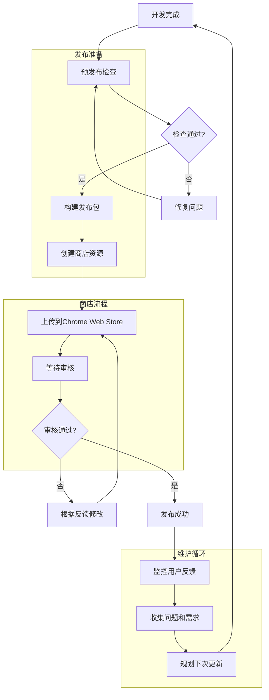

# 第15章：发布和维护

## 学习目标
1. 掌握Chrome Web Store发布流程
2. 学会扩展打包和优化技巧
3. 理解版本管理和更新策略
4. 掌握用户反馈收集和问题处理
5. 学会扩展的长期维护和运营

## 1. Chrome Web Store发布准备

### 1.1 发布前检查清单

在发布Chrome扩展之前，需要进行全面的检查和准备工作。

```javascript
// src/utils/pre-publish-checker.js
class PrePublishChecker {
  constructor() {
    this.checks = [
      { name: 'manifest_validation', required: true },
      { name: 'permissions_review', required: true },
      { name: 'icon_validation', required: true },
      { name: 'functionality_test', required: true },
      { name: 'performance_check', required: false },
      { name: 'security_audit', required: true },
      { name: 'compatibility_test', required: true },
      { name: 'documentation_review', required: false }
    ];

    this.results = new Map();
  }

  async runAllChecks() {
    console.log('🔍 Starting pre-publish validation...');

    for (const check of this.checks) {
      try {
        const result = await this.runCheck(check.name);
        this.results.set(check.name, result);

        if (check.required && !result.passed) {
          console.error(`❌ Required check failed: ${check.name}`);
          console.error(result.message);
        } else if (result.passed) {
          console.log(`✅ ${check.name}: PASSED`);
        } else {
          console.warn(`⚠️ ${check.name}: ${result.message}`);
        }
      } catch (error) {
        console.error(`💥 Error running ${check.name}:`, error);
        this.results.set(check.name, {
          passed: false,
          message: `Check failed with error: ${error.message}`
        });
      }
    }

    return this.generateReport();
  }

  async runCheck(checkName) {
    switch (checkName) {
      case 'manifest_validation':
        return this.validateManifest();
      case 'permissions_review':
        return this.reviewPermissions();
      case 'icon_validation':
        return this.validateIcons();
      case 'functionality_test':
        return this.testFunctionality();
      case 'performance_check':
        return this.checkPerformance();
      case 'security_audit':
        return this.auditSecurity();
      case 'compatibility_test':
        return this.testCompatibility();
      case 'documentation_review':
        return this.reviewDocumentation();
      default:
        throw new Error(`Unknown check: ${checkName}`);
    }
  }

  async validateManifest() {
    const manifest = chrome.runtime.getManifest();
    const issues = [];

    // 检查必需字段
    const requiredFields = ['name', 'version', 'manifest_version', 'description'];
    for (const field of requiredFields) {
      if (!manifest[field]) {
        issues.push(`Missing required field: ${field}`);
      }
    }

    // 检查版本格式
    const versionRegex = /^\d+(\.\d+){0,3}$/;
    if (!versionRegex.test(manifest.version)) {
      issues.push('Invalid version format. Use X.Y.Z.W format');
    }

    // 检查图标
    if (!manifest.icons || Object.keys(manifest.icons).length === 0) {
      issues.push('No icons specified');
    }

    // 检查权限合理性
    if (manifest.permissions) {
      const sensitivePermissions = ['<all_urls>', 'debugger', 'desktopCapture'];
      const hasSensitive = manifest.permissions.some(p => sensitivePermissions.includes(p));
      if (hasSensitive) {
        issues.push('Extension uses sensitive permissions that require justification');
      }
    }

    return {
      passed: issues.length === 0,
      message: issues.length > 0 ? issues.join('; ') : 'Manifest validation passed',
      details: { manifest, issues }
    };
  }

  async reviewPermissions() {
    const manifest = chrome.runtime.getManifest();
    const permissions = manifest.permissions || [];
    const warnings = [];

    // 权限使用建议
    const permissionAdvice = {
      'tabs': 'Consider using activeTab instead if you only need current tab access',
      'storage': 'Ensure you handle storage quota limits',
      'unlimitedStorage': 'Only request if you need to store large amounts of data',
      '<all_urls>': 'This is a sensitive permission. Provide clear justification',
      'webRequest': 'Consider using declarativeNetRequest for better performance'
    };

    for (const permission of permissions) {
      if (permissionAdvice[permission]) {
        warnings.push(`${permission}: ${permissionAdvice[permission]}`);
      }
    }

    return {
      passed: true,
      message: warnings.length > 0 ? 'Permission review completed with suggestions' : 'All permissions look appropriate',
      details: { permissions, warnings }
    };
  }

  async validateIcons() {
    const manifest = chrome.runtime.getManifest();
    const icons = manifest.icons || {};
    const issues = [];

    const requiredSizes = ['16', '48', '128'];
    for (const size of requiredSizes) {
      if (!icons[size]) {
        issues.push(`Missing ${size}px icon`);
      } else {
        // 尝试验证图标文件是否存在
        try {
          const response = await fetch(chrome.runtime.getURL(icons[size]));
          if (!response.ok) {
            issues.push(`${size}px icon file not found: ${icons[size]}`);
          }
        } catch (error) {
          issues.push(`Failed to verify ${size}px icon: ${error.message}`);
        }
      }
    }

    return {
      passed: issues.length === 0,
      message: issues.length > 0 ? issues.join('; ') : 'All required icons are present',
      details: { icons, issues }
    };
  }

  async testFunctionality() {
    const tests = [];

    // 基本功能测试
    try {
      // 测试存储功能
      await chrome.storage.local.set({ test_key: 'test_value' });
      const result = await chrome.storage.local.get('test_key');
      if (result.test_key === 'test_value') {
        tests.push({ name: 'Storage', passed: true });
      } else {
        tests.push({ name: 'Storage', passed: false, error: 'Storage test failed' });
      }
      await chrome.storage.local.remove('test_key');
    } catch (error) {
      tests.push({ name: 'Storage', passed: false, error: error.message });
    }

    // 测试消息传递
    try {
      const response = await chrome.runtime.sendMessage({ action: 'ping' });
      tests.push({ name: 'Messaging', passed: true });
    } catch (error) {
      tests.push({ name: 'Messaging', passed: false, error: 'No message handlers found' });
    }

    const failedTests = tests.filter(t => !t.passed);

    return {
      passed: failedTests.length === 0,
      message: failedTests.length > 0 ?
        `${failedTests.length} functionality tests failed` :
        'All functionality tests passed',
      details: { tests }
    };
  }

  async checkPerformance() {
    const metrics = {
      backgroundMemory: 0,
      loadTime: 0,
      responseTime: 0
    };

    // 检查内存使用
    if (performance.memory) {
      metrics.backgroundMemory = performance.memory.usedJSHeapSize / 1024 / 1024; // MB
    }

    // 检查加载时间
    const startTime = performance.now();
    // 模拟一些操作
    await new Promise(resolve => setTimeout(resolve, 100));
    metrics.loadTime = performance.now() - startTime;

    const warnings = [];
    if (metrics.backgroundMemory > 50) {
      warnings.push('High memory usage in background script');
    }

    if (metrics.loadTime > 1000) {
      warnings.push('Slow initialization detected');
    }

    return {
      passed: warnings.length === 0,
      message: warnings.length > 0 ? warnings.join('; ') : 'Performance checks passed',
      details: { metrics, warnings }
    };
  }

  async auditSecurity() {
    const issues = [];
    const manifest = chrome.runtime.getManifest();

    // 检查CSP设置
    if (!manifest.content_security_policy) {
      issues.push('No Content Security Policy defined');
    }

    // 检查外部连接
    if (manifest.permissions?.includes('<all_urls>')) {
      issues.push('Extension has access to all websites - ensure this is necessary');
    }

    // 检查web_accessible_resources
    if (manifest.web_accessible_resources) {
      issues.push('Web accessible resources detected - review for security implications');
    }

    return {
      passed: issues.length === 0,
      message: issues.length > 0 ?
        'Security audit found potential issues' :
        'Security audit passed',
      details: { issues }
    };
  }

  async testCompatibility() {
    const userAgent = navigator.userAgent;
    const chromeVersion = this.extractChromeVersion(userAgent);
    const issues = [];

    // 检查最低Chrome版本要求
    const manifest = chrome.runtime.getManifest();
    const minVersion = manifest.minimum_chrome_version;

    if (minVersion && chromeVersion < parseInt(minVersion)) {
      issues.push(`Current Chrome version ${chromeVersion} is below minimum required ${minVersion}`);
    }

    // 检查Manifest V3兼容性
    if (manifest.manifest_version < 3) {
      issues.push('Consider upgrading to Manifest V3 for better future compatibility');
    }

    return {
      passed: issues.length === 0,
      message: issues.length > 0 ? issues.join('; ') : 'Compatibility checks passed',
      details: { chromeVersion, issues }
    };
  }

  extractChromeVersion(userAgent) {
    const match = userAgent.match(/Chrome\/(\d+)/);
    return match ? parseInt(match[1]) : 0;
  }

  async reviewDocumentation() {
    const files = ['README.md', 'CHANGELOG.md', 'LICENSE'];
    const missingFiles = [];

    for (const file of files) {
      try {
        await fetch(chrome.runtime.getURL(file));
      } catch {
        missingFiles.push(file);
      }
    }

    return {
      passed: missingFiles.length === 0,
      message: missingFiles.length > 0 ?
        `Missing documentation files: ${missingFiles.join(', ')}` :
        'Documentation review passed',
      details: { missingFiles }
    };
  }

  generateReport() {
    const totalChecks = this.checks.length;
    const passedChecks = Array.from(this.results.values()).filter(r => r.passed).length;
    const requiredChecks = this.checks.filter(c => c.required).length;
    const passedRequired = this.checks
      .filter(c => c.required)
      .filter(c => this.results.get(c.name)?.passed).length;

    const isReady = passedRequired === requiredChecks;

    const report = {
      timestamp: new Date().toISOString(),
      ready: isReady,
      summary: {
        total: totalChecks,
        passed: passedChecks,
        failed: totalChecks - passedChecks,
        required_passed: passedRequired,
        required_total: requiredChecks
      },
      results: Object.fromEntries(this.results),
      recommendations: this.generateRecommendations()
    };

    console.log('\n📊 Pre-publish Report:');
    console.log(`Ready for publication: ${isReady ? '✅ YES' : '❌ NO'}`);
    console.log(`Checks passed: ${passedChecks}/${totalChecks}`);
    console.log(`Required checks: ${passedRequired}/${requiredChecks}`);

    if (!isReady) {
      console.log('\n⚠️ Issues to fix before publication:');
      for (const [checkName, result] of this.results) {
        const check = this.checks.find(c => c.name === checkName);
        if (check.required && !result.passed) {
          console.log(`  - ${checkName}: ${result.message}`);
        }
      }
    }

    return report;
  }

  generateRecommendations() {
    const recommendations = [];

    for (const [checkName, result] of this.results) {
      if (!result.passed) {
        switch (checkName) {
          case 'manifest_validation':
            recommendations.push('Fix manifest.json errors before publishing');
            break;
          case 'icon_validation':
            recommendations.push('Ensure all required icons (16px, 48px, 128px) are present');
            break;
          case 'security_audit':
            recommendations.push('Review and address security concerns');
            break;
          case 'performance_check':
            recommendations.push('Optimize extension performance for better user experience');
            break;
        }
      }
    }

    return recommendations;
  }
}
```

### 1.2 Node.js发布管理工具

```javascript
// build-tools/extension-publisher.js
const fs = require('fs').promises;
const path = require('path');
const archiver = require('archiver');
const crypto = require('crypto');

class ChromeExtensionPublisher {
  /**
   * Chrome扩展发布管理工具
   */
  constructor(projectPath) {
    this.projectPath = projectPath;
    this.distPath = path.join(projectPath, 'dist');
    this.buildPath = path.join(projectPath, 'build');
  }

  async prepareForPublishing() {
    /**
     * 准备发布包
     */
    console.log('🚀 Preparing extension for publishing...');

    const results = {
      success: false,
      packagePath: null,
      size: 0,
      filesCount: 0,
      errors: [],
      warnings: []
    };

    try {
      // 1. 清理构建目录
      await this.cleanBuildDirectory();

      // 2. 复制源文件
      await this.copySourceFiles();

      // 3. 优化文件
      await this.optimizeFiles();

      // 4. 验证manifest
      const { valid, errors } = await this.validateManifest();
      if (!valid) {
        results.errors.push(...errors);
        return results;
      }

      // 5. 创建发布包
      const packagePath = await this.createPackage();

      // 6. 生成校验和
      const checksum = await this.generateChecksum(packagePath);

      // 7. 获取包信息
      const stats = await fs.stat(packagePath);
      const packageSize = stats.size;
      const filesCount = await this.countFilesInZip(packagePath);

      Object.assign(results, {
        success: true,
        packagePath: packagePath,
        size: packageSize,
        filesCount: filesCount,
        checksum: checksum,
        buildTime: new Date().toISOString()
      });

      console.log(`✅ Package created successfully: ${packagePath}`);
      console.log(`📦 Size: ${(packageSize / 1024).toFixed(2)} KB`);
      console.log(`📄 Files: ${filesCount}`);
      console.log(`🔐 SHA256: ${checksum}`);

    } catch (error) {
      results.errors.push(`Build failed: ${error.message}`);
      console.error(`❌ Build failed: ${error}`);
    }

    return results;
  }

  async cleanBuildDirectory() {
    /**
     * 清理构建目录
     */
    const fsExtra = require('fs-extra');

    if (await fsExtra.pathExists(this.buildPath)) {
      await fsExtra.remove(this.buildPath);
    }
    await fsExtra.ensureDir(this.buildPath);

    if (await fsExtra.pathExists(this.distPath)) {
      await fsExtra.remove(this.distPath);
    }
    await fsExtra.ensureDir(this.distPath);
  }

  async copySourceFiles() {
    /**
     * 复制源文件到构建目录
     */
    const includePatterns = [
      'manifest.json',
      'src/**/*',
      'assets/**/*',
      'LICENSE',
      'README.md'
    ];

    const excludePatterns = [
      '**/.git/**',
      '**/node_modules/**',
      '**/*.test.js',
      '**/*.spec.js',
      '**/test/**',
      '**/tests/**',
      '**/*.map',
      '**/*.ts',
      '**/webpack.config.js',
      '**/package.json',
      '**/package-lock.json'
    ];

    await this.copyFilesWithPatterns(includePatterns, excludePatterns);
  }

  async copyFilesWithPatterns(includePatterns, excludePatterns) {
    /**
     * 根据模式复制文件
     */
    const fsExtra = require('fs-extra');
    const glob = require('glob');

    for (const pattern of includePatterns) {
      if (pattern === 'manifest.json') {
        const src = path.join(this.projectPath, 'manifest.json');
        if (await fsExtra.pathExists(src)) {
          await fsExtra.copy(src, path.join(this.buildPath, 'manifest.json'));
        }
      } else if (pattern.endsWith('/**/*')) {
        const baseDir = pattern.replace('/**/*', '');
        const srcDir = path.join(this.projectPath, baseDir);
        if (await fsExtra.pathExists(srcDir)) {
          const dstDir = path.join(this.buildPath, baseDir);
          await fsExtra.copy(srcDir, dstDir, {
            filter: (src) => {
              return !excludePatterns.some(exclude =>
                src.includes(exclude.replace('**/', '').replace('/**', ''))
              );
            }
          });
        }
      }
    }
  }

  async optimizeFiles() {
    /**
     * 优化文件
     */
    await this.minifyJavaScript();
    await this.minifyCSS();
    await this.optimizeImages();
  }

  async minifyJavaScript() {
    /**
     * 压缩JavaScript文件
     */
    const { minify } = require('terser');
    const files = await this.getFilesRecursive(this.buildPath, '.js');

    for (const file of files) {
      try {
        const code = await fs.readFile(file, 'utf-8');
        const result = await minify(code, {
          compress: true,
          mangle: true
        });

        if (result.code) {
          await fs.writeFile(file, result.code, 'utf-8');
        }
      } catch (error) {
        console.warn(`⚠️ Failed to minify ${file}: ${error.message}`);
      }
    }
  }

  async minifyCSS() {
    /**
     * 压缩CSS文件
     */
    const CleanCSS = require('clean-css');
    const cleanCSS = new CleanCSS();
    const files = await this.getFilesRecursive(this.buildPath, '.css');

    for (const file of files) {
      try {
        const content = await fs.readFile(file, 'utf-8');
        const output = cleanCSS.minify(content);

        if (!output.errors || output.errors.length === 0) {
          await fs.writeFile(file, output.styles, 'utf-8');
        }
      } catch (error) {
        console.warn(`⚠️ Failed to minify ${file}: ${error.message}`);
      }
    }
  }

  async optimizeImages() {
    /**
     * 优化图像文件
     * 可以集成imagemin等工具
     */
    // TODO: 实现图像优化
  }

  async getFilesRecursive(dir, extension) {
    /**
     * 递归获取指定扩展名的文件
     */
    const fsExtra = require('fs-extra');
    const files = [];

    const items = await fs.readdir(dir, { withFileTypes: true });

    for (const item of items) {
      const fullPath = path.join(dir, item.name);

      if (item.isDirectory()) {
        files.push(...await this.getFilesRecursive(fullPath, extension));
      } else if (item.name.endsWith(extension)) {
        files.push(fullPath);
      }
    }

    return files;
  }

  async validateManifest() {
    /**
     * 验证manifest文件
     */
    const manifestPath = path.join(this.buildPath, 'manifest.json');
    const errors = [];

    try {
      const content = await fs.readFile(manifestPath, 'utf-8');
      const manifest = JSON.parse(content);

      // 检查必需字段
      const requiredFields = ['name', 'version', 'manifest_version', 'description'];
      for (const field of requiredFields) {
        if (!manifest[field]) {
          errors.push(`Missing required field: ${field}`);
        }
      }

      // 检查版本格式
      const version = manifest.version || '';
      if (!/^\d+(\.\d+){0,3}$/.test(version)) {
        errors.push('Invalid version format');
      }

      // 检查图标
      if (!manifest.icons) {
        errors.push('No icons specified');
      } else {
        for (const [size, iconPath] of Object.entries(manifest.icons)) {
          const fullPath = path.join(this.buildPath, iconPath);
          const exists = await fs.access(fullPath).then(() => true).catch(() => false);
          if (!exists) {
            errors.push(`Icon file not found: ${iconPath}`);
          }
        }
      }

    } catch (error) {
      if (error.code === 'ENOENT') {
        errors.push('manifest.json not found');
      } else if (error instanceof SyntaxError) {
        errors.push(`Invalid JSON in manifest.json: ${error.message}`);
      } else {
        errors.push(`Error reading manifest.json: ${error.message}`);
      }
    }

    return { valid: errors.length === 0, errors };
  }

  async createPackage() {
    /**
     * 创建发布包
     */
    const manifestPath = path.join(this.buildPath, 'manifest.json');
    const content = await fs.readFile(manifestPath, 'utf-8');
    const manifest = JSON.parse(content);

    const extensionName = manifest.name.replace(/\s+/g, '-').toLowerCase();
    const version = manifest.version;
    const packageName = `${extensionName}-${version}.zip`;
    const packagePath = path.join(this.distPath, packageName);

    return new Promise((resolve, reject) => {
      const output = require('fs').createWriteStream(packagePath);
      const archive = archiver('zip', { zlib: { level: 9 } });

      output.on('close', () => resolve(packagePath));
      archive.on('error', reject);

      archive.pipe(output);
      archive.directory(this.buildPath, false);
      archive.finalize();
    });
  }

  async generateChecksum(filePath) {
    /**
     * 生成文件校验和
     */
    return new Promise((resolve, reject) => {
      const hash = crypto.createHash('sha256');
      const stream = require('fs').createReadStream(filePath);

      stream.on('data', (data) => hash.update(data));
      stream.on('end', () => resolve(hash.digest('hex')));
      stream.on('error', reject);
    });
  }

  async countFilesInZip(zipPath) {
    /**
     * 计算ZIP文件中的文件数量
     */
    const AdmZip = require('adm-zip');
    const zip = new AdmZip(zipPath);
    return zip.getEntries().length;
  }

  async createStoreAssets() {
    /**
     * 创建商店所需的资源
     */
    const fsExtra = require('fs-extra');
    const assets = {};

    // 创建截图目录
    const screenshotsDir = path.join(this.distPath, 'store-assets', 'screenshots');
    await fsExtra.ensureDir(screenshotsDir);

    // 创建推广图片目录
    const promoDir = path.join(this.distPath, 'store-assets', 'promotional');
    await fsExtra.ensureDir(promoDir);

    // 生成商店描述模板
    const descriptionFile = path.join(this.distPath, 'store-description.txt');
    await this.generateStoreDescription(descriptionFile);
    assets.description = descriptionFile;

    // 生成隐私政策模板
    const privacyFile = path.join(this.distPath, 'privacy-policy.md');
    await this.generatePrivacyPolicy(privacyFile);
    assets.privacyPolicy = privacyFile;

    return assets;
  }

  async generateStoreDescription(filePath) {
    /**
     * 生成商店描述模板
     */
    const manifestPath = path.join(this.buildPath, 'manifest.json');
    const content = await fs.readFile(manifestPath, 'utf-8');
    const manifest = JSON.parse(content);

    const description = `# ${manifest.name}

${manifest.description}

## Features
- Feature 1: Description
- Feature 2: Description
- Feature 3: Description

## How to Use
1. Install the extension
2. Click on the extension icon
3. Follow the on-screen instructions

## Privacy
This extension respects your privacy. See our privacy policy for details.

## Support
For support and feedback, please visit: [Your Support URL]

## Version ${manifest.version}
- Improvement 1
- Improvement 2
- Bug fixes
`;

    await fs.writeFile(filePath, description, 'utf-8');
  }

  async generatePrivacyPolicy(filePath) {
    /**
     * 生成隐私政策模板
     */
    const manifestPath = path.join(this.buildPath, 'manifest.json');
    const content = await fs.readFile(manifestPath, 'utf-8');
    const manifest = JSON.parse(content);

    const policy = `# Privacy Policy for ${manifest.name}

## Information Collection
This extension may collect the following types of information:
- [List the types of data collected]

## Information Use
We use the collected information for:
- [Describe how data is used]

## Information Sharing
We do not share your personal information with third parties except:
- [List any exceptions]

## Data Security
We implement appropriate security measures to protect your information.

## Changes to This Policy
We may update this privacy policy from time to time.

## Contact Us
If you have questions about this privacy policy, please contact us at: [Your Contact Email]

Last updated: ${new Date().toISOString().split('T')[0]}
`;

    await fs.writeFile(filePath, policy, 'utf-8');
  }

  async validatePackage(packagePath) {
    /**
     * 验证发布包
     */
    const fsExtra = require('fs-extra');
    const AdmZip = require('adm-zip');

    const results = {
      valid: true,
      issues: [],
      warnings: [],
      sizeMb: 0,
      files: []
    };

    if (!await fsExtra.pathExists(packagePath)) {
      results.valid = false;
      results.issues.push('Package file not found');
      return results;
    }

    // 检查文件大小
    const stats = await fs.stat(packagePath);
    const sizeBytes = stats.size;
    const sizeMb = sizeBytes / (1024 * 1024);
    results.sizeMb = sizeMb;

    if (sizeMb > 128) { // Chrome Web Store limit
      results.issues.push(`Package too large: ${sizeMb.toFixed(2)}MB (limit: 128MB)`);
    } else if (sizeMb > 100) {
      results.warnings.push(`Large package size: ${sizeMb.toFixed(2)}MB`);
    }

    // 验证ZIP内容
    try {
      const zip = new AdmZip(packagePath);
      const entries = zip.getEntries();
      const fileList = entries.map(entry => entry.entryName);
      results.files = fileList;

      // 检查必需文件
      if (!fileList.includes('manifest.json')) {
        results.issues.push('manifest.json not found in package');
      }

      // 检查可疑文件
      const suspiciousFiles = fileList.filter(f =>
        f.endsWith('.exe') || f.endsWith('.dll') || f.endsWith('.so')
      );

      if (suspiciousFiles.length > 0) {
        results.warnings.push(...suspiciousFiles.map(f => `Suspicious file: ${f}`));
      }

    } catch (error) {
      results.valid = false;
      results.issues.push(`Error reading package: ${error.message}`);
    }

    results.valid = results.issues.length === 0;
    return results;
  }
}

// 使用示例
async function main() {
  const publisher = new ChromeExtensionPublisher('/path/to/extension/project');

  // 准备发布包
  const result = await publisher.prepareForPublishing();

  if (result.success) {
    console.log(`\n📦 Package ready: ${result.packagePath}`);

    // 创建商店资源
    const assets = await publisher.createStoreAssets();
    console.log(`📝 Store assets created: ${Object.keys(assets).length} files`);

    // 验证包
    const validation = await publisher.validatePackage(result.packagePath);
    if (validation.valid) {
      console.log('✅ Package validation passed');
    } else {
      console.log('❌ Package validation failed:');
      validation.issues.forEach(issue => console.log(`  - ${issue}`));
    }
  } else {
    console.log('❌ Package preparation failed:');
    result.errors.forEach(error => console.log(`  - ${error}`));
  }
}

// 如果直接运行此脚本
if (require.main === module) {
  main().catch(console.error);
}

module.exports = ChromeExtensionPublisher;
```

**package.json依赖配置：**

```json
{
  "name": "chrome-extension-builder",
  "version": "1.0.0",
  "description": "Chrome Extension build and publish tools",
  "scripts": {
    "build": "node build-tools/extension-publisher.js"
  },
  "devDependencies": {
    "archiver": "^5.3.0",
    "adm-zip": "^0.5.10",
    "terser": "^5.16.0",
    "clean-css": "^5.3.0",
    "fs-extra": "^11.1.0"
  }
}
```

## 2. Chrome Web Store发布流程

### 2.1 开发者账户设置

```javascript
// src/utils/store-publisher.js
class StorePublisher {
  constructor(config) {
    this.config = config;
    this.apiEndpoint = 'https://www.googleapis.com/chromewebstore/v1.1';
  }

  async uploadExtension(packagePath, options = {}) {
    console.log('📤 Uploading extension to Chrome Web Store...');

    try {
      const accessToken = await this.getAccessToken();
      const uploadResult = await this.performUpload(packagePath, accessToken);

      if (options.publish) {
        const publishResult = await this.publishExtension(uploadResult.id, accessToken);
        return { upload: uploadResult, publish: publishResult };
      }

      return { upload: uploadResult };
    } catch (error) {
      console.error('❌ Upload failed:', error);
      throw error;
    }
  }

  async getAccessToken() {
    // 使用Google OAuth2获取访问令牌
    // 这需要预先配置的客户端凭据
    const tokenResponse = await fetch('https://oauth2.googleapis.com/token', {
      method: 'POST',
      headers: {
        'Content-Type': 'application/x-www-form-urlencoded'
      },
      body: new URLSearchParams({
        grant_type: 'refresh_token',
        refresh_token: this.config.refreshToken,
        client_id: this.config.clientId,
        client_secret: this.config.clientSecret
      })
    });

    const tokenData = await tokenResponse.json();

    if (!tokenResponse.ok) {
      throw new Error(`Failed to get access token: ${tokenData.error_description}`);
    }

    return tokenData.access_token;
  }

  async performUpload(packagePath, accessToken) {
    const packageData = await this.readPackageFile(packagePath);

    const response = await fetch(
      `${this.apiEndpoint}/items/${this.config.extensionId}`,
      {
        method: 'PUT',
        headers: {
          'Authorization': `Bearer ${accessToken}`,
          'Content-Type': 'application/zip'
        },
        body: packageData
      }
    );

    const result = await response.json();

    if (!response.ok) {
      throw new Error(`Upload failed: ${result.error?.message || 'Unknown error'}`);
    }

    console.log('✅ Extension uploaded successfully');
    return result;
  }

  async publishExtension(extensionId, accessToken) {
    const response = await fetch(
      `${this.apiEndpoint}/items/${extensionId}/publish`,
      {
        method: 'POST',
        headers: {
          'Authorization': `Bearer ${accessToken}`,
          'Content-Type': 'application/json'
        },
        body: JSON.stringify({
          target: 'default' // 或 'trustedTesters'
        })
      }
    );

    const result = await response.json();

    if (!response.ok) {
      throw new Error(`Publish failed: ${result.error?.message || 'Unknown error'}`);
    }

    console.log('🎉 Extension published successfully');
    return result;
  }

  async readPackageFile(packagePath) {
    const fs = require('fs').promises;
    return await fs.readFile(packagePath);
  }

  async getExtensionInfo(extensionId, accessToken) {
    const response = await fetch(
      `${this.apiEndpoint}/items/${extensionId}?projection=DRAFT`,
      {
        headers: {
          'Authorization': `Bearer ${accessToken}`
        }
      }
    );

    return await response.json();
  }

  async updateListing(extensionId, listingData, accessToken) {
    const response = await fetch(
      `${this.apiEndpoint}/items/${extensionId}`,
      {
        method: 'PUT',
        headers: {
          'Authorization': `Bearer ${accessToken}`,
          'Content-Type': 'application/json'
        },
        body: JSON.stringify(listingData)
      }
    );

    return await response.json();
  }
}

// 发布配置
const publishConfig = {
  extensionId: 'your-extension-id',
  clientId: 'your-client-id',
  clientSecret: 'your-client-secret',
  refreshToken: 'your-refresh-token'
};

const publisher = new StorePublisher(publishConfig);
```

### 2.2 商店资源准备

```javascript
// src/utils/store-assets-generator.js
class StoreAssetsGenerator {
  constructor() {
    this.requiredAssets = {
      screenshots: {
        count: { min: 1, max: 5 },
        size: '1280x800 or 640x400',
        format: 'JPEG or PNG'
      },
      icon: {
        sizes: ['128x128'],
        format: 'PNG'
      },
      promotionalImages: {
        small: '440x280',
        large: '1400x560',
        marquee: '1400x560' // optional
      }
    };
  }

  generateStoreDescription(manifest, features, changelog) {
    const description = {
      name: manifest.name,
      summary: manifest.description,
      detailedDescription: this.buildDetailedDescription(features),
      changelog: this.formatChangelog(changelog),
      category: this.suggestCategory(manifest),
      language: 'en',
      regions: ['US', 'GB', 'CA', 'AU'] // 可以根据需要调整
    };

    return description;
  }

  buildDetailedDescription(features) {
    let description = "## Key Features\n\n";

    features.forEach((feature, index) => {
      description += `${index + 1}. **${feature.title}**: ${feature.description}\n`;
    });

    description += "\n## How to Use\n\n";
    description += "1. Install the extension from Chrome Web Store\n";
    description += "2. Click on the extension icon in your browser toolbar\n";
    description += "3. Follow the on-screen instructions to get started\n\n";

    description += "## Privacy & Security\n\n";
    description += "This extension respects your privacy and follows Chrome's security best practices. ";
    description += "All data is stored locally on your device unless otherwise specified.\n\n";

    description += "## Support\n\n";
    description += "If you encounter any issues or have suggestions, please contact us through the support section.\n";

    return description;
  }

  formatChangelog(changelog) {
    return changelog.map(version => {
      let entry = `## Version ${version.version}\n`;
      if (version.date) {
        entry += `*Released: ${version.date}*\n\n`;
      }

      if (version.features && version.features.length > 0) {
        entry += "### New Features\n";
        version.features.forEach(feature => {
          entry += `- ${feature}\n`;
        });
        entry += "\n";
      }

      if (version.improvements && version.improvements.length > 0) {
        entry += "### Improvements\n";
        version.improvements.forEach(improvement => {
          entry += `- ${improvement}\n`;
        });
        entry += "\n";
      }

      if (version.bugfixes && version.bugfixes.length > 0) {
        entry += "### Bug Fixes\n";
        version.bugfixes.forEach(fix => {
          entry += `- ${fix}\n`;
        });
        entry += "\n";
      }

      return entry;
    }).join('\n---\n\n');
  }

  suggestCategory(manifest) {
    const categoryKeywords = {
      'Productivity': ['productivity', 'task', 'todo', 'note', 'organize', 'manage'],
      'Developer Tools': ['developer', 'code', 'debug', 'api', 'git'],
      'Communication': ['chat', 'email', 'social', 'message', 'contact'],
      'Shopping': ['shop', 'price', 'deal', 'coupon', 'buy'],
      'News & Weather': ['news', 'weather', 'feed', 'article'],
      'Education': ['learn', 'study', 'course', 'tutorial', 'education'],
      'Entertainment': ['game', 'music', 'video', 'fun', 'entertainment'],
      'Accessibility': ['accessibility', 'screen reader', 'magnifier', 'contrast']
    };

    const description = (manifest.description || '').toLowerCase();
    const name = (manifest.name || '').toLowerCase();
    const searchText = `${name} ${description}`;

    for (const [category, keywords] of Object.entries(categoryKeywords)) {
      if (keywords.some(keyword => searchText.includes(keyword))) {
        return category;
      }
    }

    return 'Productivity'; // 默认分类
  }

  generatePrivacyPolicy(extensionData) {
    const template = `# Privacy Policy

## Information Collection
This extension may collect and store the following information:
${extensionData.dataCollection.map(item => `- ${item}`).join('\n')}

## Information Usage
The collected information is used for:
${extensionData.dataUsage.map(item => `- ${item}`).join('\n')}

## Data Storage
${extensionData.storageLocation}

## Third-Party Services
${extensionData.thirdPartyServices || 'This extension does not use third-party services.'}

## Data Sharing
We do not share, sell, or rent your personal information to third parties.

## Security
We implement appropriate security measures to protect your information against unauthorized access, alteration, disclosure, or destruction.

## Changes to This Policy
We may update this privacy policy from time to time. We will notify you of any changes by posting the new policy on this page.

## Contact
If you have any questions about this privacy policy, please contact us at: ${extensionData.contactEmail}

*Last updated: ${new Date().toLocaleDateString()}*
`;

    return template;
  }

  validateAssets(assetsPath) {
    const validation = {
      valid: true,
      errors: [],
      warnings: []
    };

    // 验证截图
    const screenshotPath = `${assetsPath}/screenshots`;
    const screenshots = this.getImageFiles(screenshotPath);

    if (screenshots.length < 1) {
      validation.errors.push('At least 1 screenshot is required');
    } else if (screenshots.length > 5) {
      validation.warnings.push('Maximum 5 screenshots recommended');
    }

    // 验证图标
    const iconPath = `${assetsPath}/icon128.png`;
    if (!this.fileExists(iconPath)) {
      validation.errors.push('128x128 icon is required');
    }

    // 验证推广图片（可选）
    const promoPath = `${assetsPath}/promo-small.png`;
    if (!this.fileExists(promoPath)) {
      validation.warnings.push('Promotional image recommended for better visibility');
    }

    validation.valid = validation.errors.length === 0;
    return validation;
  }

  getImageFiles(directory) {
    // 模拟获取图片文件列表
    const fs = require('fs');
    if (!fs.existsSync(directory)) return [];

    return fs.readdirSync(directory)
      .filter(file => /\.(png|jpg|jpeg)$/i.test(file));
  }

  fileExists(filePath) {
    const fs = require('fs');
    return fs.existsSync(filePath);
  }
}

// 使用示例
const generator = new StoreAssetsGenerator();

const features = [
  {
    title: "Smart Organization",
    description: "Automatically organize your bookmarks with AI-powered categorization"
  },
  {
    title: "Quick Search",
    description: "Find any bookmark instantly with powerful search functionality"
  },
  {
    title: "Cloud Sync",
    description: "Keep your bookmarks synchronized across all your devices"
  }
];

const changelog = [
  {
    version: "1.2.0",
    date: "2024-01-15",
    features: ["Added AI categorization", "Improved search algorithm"],
    improvements: ["Better performance", "Enhanced UI"],
    bugfixes: ["Fixed sync issues", "Resolved popup layout problems"]
  },
  {
    version: "1.1.0",
    date: "2024-01-01",
    features: ["Cloud synchronization"],
    improvements: ["Faster loading times"],
    bugfixes: ["Fixed bookmark deletion bug"]
  }
];

const manifest = chrome.runtime.getManifest();
const storeDescription = generator.generateStoreDescription(manifest, features, changelog);
```

## 3. 版本管理和更新

### 3.1 自动化版本管理

```javascript
// src/utils/version-manager.js
class VersionManager {
  constructor() {
    this.manifest = chrome.runtime.getManifest();
    this.currentVersion = this.manifest.version;
  }

  parseVersion(version) {
    const parts = version.split('.').map(Number);
    return {
      major: parts[0] || 0,
      minor: parts[1] || 0,
      patch: parts[2] || 0,
      build: parts[3] || 0
    };
  }

  compareVersions(version1, version2) {
    const v1 = this.parseVersion(version1);
    const v2 = this.parseVersion(version2);

    const compareOrder = ['major', 'minor', 'patch', 'build'];

    for (const part of compareOrder) {
      if (v1[part] > v2[part]) return 1;
      if (v1[part] < v2[part]) return -1;
    }

    return 0;
  }

  incrementVersion(version, type = 'patch') {
    const parts = this.parseVersion(version);

    switch (type) {
      case 'major':
        parts.major++;
        parts.minor = 0;
        parts.patch = 0;
        parts.build = 0;
        break;
      case 'minor':
        parts.minor++;
        parts.patch = 0;
        parts.build = 0;
        break;
      case 'patch':
        parts.patch++;
        parts.build = 0;
        break;
      case 'build':
        parts.build++;
        break;
      default:
        throw new Error(`Invalid version type: ${type}`);
    }

    return `${parts.major}.${parts.minor}.${parts.patch}.${parts.build}`;
  }

  async checkForUpdates() {
    try {
      // 检查Chrome Web Store的版本
      const storeVersion = await this.getStoreVersion();
      const comparison = this.compareVersions(storeVersion, this.currentVersion);

      return {
        hasUpdate: comparison > 0,
        currentVersion: this.currentVersion,
        latestVersion: storeVersion,
        updateAvailable: comparison > 0
      };
    } catch (error) {
      console.error('Failed to check for updates:', error);
      return {
        hasUpdate: false,
        currentVersion: this.currentVersion,
        error: error.message
      };
    }
  }

  async getStoreVersion() {
    // 模拟从Chrome Web Store API获取版本信息
    // 实际实现需要使用Chrome Web Store API
    const response = await fetch(
      `https://chrome.google.com/webstore/detail/${chrome.runtime.id}`
    );

    if (!response.ok) {
      throw new Error('Failed to fetch store information');
    }

    const html = await response.text();
    const versionMatch = html.match(/Version:\s*(\d+\.\d+\.\d+(?:\.\d+)?)/);

    if (!versionMatch) {
      throw new Error('Could not extract version from store page');
    }

    return versionMatch[1];
  }

  generateUpdateNotes(fromVersion, toVersion, changes) {
    const notes = {
      version: toVersion,
      previousVersion: fromVersion,
      releaseDate: new Date().toISOString().split('T')[0],
      changes: changes || [],
      migrationSteps: this.getMigrationSteps(fromVersion, toVersion)
    };

    return notes;
  }

  getMigrationSteps(fromVersion, toVersion) {
    const steps = [];
    const from = this.parseVersion(fromVersion);
    const to = this.parseVersion(toVersion);

    // 主版本升级
    if (to.major > from.major) {
      steps.push({
        type: 'major_upgrade',
        description: 'Major version upgrade detected',
        actions: [
          'Clear old cache data',
          'Update storage schema',
          'Reset user preferences if needed'
        ]
      });
    }

    // 次版本升级
    if (to.minor > from.minor) {
      steps.push({
        type: 'minor_upgrade',
        description: 'New features available',
        actions: [
          'Update feature flags',
          'Migrate user settings'
        ]
      });
    }

    return steps;
  }

  async performUpdate(updateNotes) {
    console.log('🔄 Performing extension update...');

    try {
      // 执行迁移步骤
      for (const step of updateNotes.migrationSteps) {
        await this.executeMigrationStep(step);
      }

      // 更新版本记录
      await this.updateVersionHistory(updateNotes);

      // 显示更新通知
      await this.showUpdateNotification(updateNotes);

      console.log('✅ Update completed successfully');
    } catch (error) {
      console.error('❌ Update failed:', error);
      throw error;
    }
  }

  async executeMigrationStep(step) {
    console.log(`Executing migration step: ${step.type}`);

    switch (step.type) {
      case 'major_upgrade':
        await this.performMajorUpgrade();
        break;
      case 'minor_upgrade':
        await this.performMinorUpgrade();
        break;
      default:
        console.warn(`Unknown migration step type: ${step.type}`);
    }
  }

  async performMajorUpgrade() {
    // 清理旧数据
    const oldKeys = await chrome.storage.local.get();
    const keysToRemove = Object.keys(oldKeys).filter(key =>
      key.startsWith('legacy_') || key.startsWith('deprecated_')
    );

    if (keysToRemove.length > 0) {
      await chrome.storage.local.remove(keysToRemove);
    }

    // 更新存储架构
    await this.updateStorageSchema();
  }

  async performMinorUpgrade() {
    // 更新功能标志
    const currentFlags = await chrome.storage.local.get('feature_flags') || {};
    const updatedFlags = {
      ...currentFlags,
      new_feature_enabled: true,
      beta_features: false
    };

    await chrome.storage.local.set({ feature_flags: updatedFlags });
  }

  async updateStorageSchema() {
    // 检查当前存储架构版本
    const { storage_schema_version = 1 } = await chrome.storage.local.get('storage_schema_version');
    const currentSchemaVersion = 2; // 新的架构版本

    if (storage_schema_version < currentSchemaVersion) {
      // 执行架构迁移
      await this.migrateStorageSchema(storage_schema_version, currentSchemaVersion);
      await chrome.storage.local.set({ storage_schema_version: currentSchemaVersion });
    }
  }

  async migrateStorageSchema(fromVersion, toVersion) {
    if (fromVersion === 1 && toVersion >= 2) {
      // 示例：将旧格式的书签数据迁移到新格式
      const { bookmarks = [] } = await chrome.storage.local.get('bookmarks');

      const migratedBookmarks = bookmarks.map(bookmark => ({
        ...bookmark,
        createdAt: bookmark.dateAdded || Date.now(),
        updatedAt: Date.now(),
        version: 2
      }));

      await chrome.storage.local.set({ bookmarks: migratedBookmarks });
    }
  }

  async updateVersionHistory(updateNotes) {
    const { version_history = [] } = await chrome.storage.local.get('version_history');

    version_history.unshift({
      version: updateNotes.version,
      previousVersion: updateNotes.previousVersion,
      updateDate: new Date().toISOString(),
      changes: updateNotes.changes
    });

    // 只保留最近10次更新记录
    const recentHistory = version_history.slice(0, 10);

    await chrome.storage.local.set({ version_history: recentHistory });
  }

  async showUpdateNotification(updateNotes) {
    if (chrome.notifications) {
      await chrome.notifications.create({
        type: 'basic',
        iconUrl: 'assets/icon48.png',
        title: 'Extension Updated',
        message: `Updated to version ${updateNotes.version}. Click to see what's new.`,
        contextMessage: updateNotes.changes.slice(0, 2).join(', ')
      });
    }
  }

  async getVersionHistory() {
    const { version_history = [] } = await chrome.storage.local.get('version_history');
    return version_history;
  }
}

// 更新检查器
class UpdateChecker {
  constructor() {
    this.versionManager = new VersionManager();
    this.checkInterval = 24 * 60 * 60 * 1000; // 24小时检查一次
  }

  startPeriodicCheck() {
    // 立即检查一次
    this.checkForUpdates();

    // 设置定期检查
    setInterval(() => {
      this.checkForUpdates();
    }, this.checkInterval);
  }

  async checkForUpdates() {
    try {
      const updateInfo = await this.versionManager.checkForUpdates();

      if (updateInfo.hasUpdate) {
        await this.handleUpdateAvailable(updateInfo);
      }
    } catch (error) {
      console.error('Update check failed:', error);
    }
  }

  async handleUpdateAvailable(updateInfo) {
    console.log('📦 Update available:', updateInfo.latestVersion);

    // 可以选择自动更新或通知用户
    const shouldAutoUpdate = await this.shouldAutoUpdate();

    if (shouldAutoUpdate) {
      await this.performAutoUpdate(updateInfo);
    } else {
      await this.notifyUserOfUpdate(updateInfo);
    }
  }

  async shouldAutoUpdate() {
    const { auto_update = false } = await chrome.storage.local.get('auto_update');
    return auto_update;
  }

  async performAutoUpdate(updateInfo) {
    // Chrome会自动更新扩展，这里主要处理更新后的逻辑
    console.log('Auto-update enabled, preparing for update...');

    // 保存更新信息以便更新后处理
    await chrome.storage.local.set({
      pending_update: {
        fromVersion: updateInfo.currentVersion,
        toVersion: updateInfo.latestVersion,
        timestamp: Date.now()
      }
    });
  }

  async notifyUserOfUpdate(updateInfo) {
    if (chrome.notifications) {
      await chrome.notifications.create({
        type: 'basic',
        iconUrl: 'assets/icon48.png',
        title: 'Update Available',
        message: `Version ${updateInfo.latestVersion} is available. Your version: ${updateInfo.currentVersion}`,
        buttons: [
          { title: 'Update Now' },
          { title: 'Remind Later' }
        ]
      });
    }
  }

  async handlePostUpdateTasks() {
    const { pending_update } = await chrome.storage.local.get('pending_update');

    if (pending_update) {
      const updateNotes = this.versionManager.generateUpdateNotes(
        pending_update.fromVersion,
        pending_update.toVersion,
        ['Bug fixes and improvements', 'Performance enhancements']
      );

      await this.versionManager.performUpdate(updateNotes);
      await chrome.storage.local.remove('pending_update');
    }
  }
}

// 初始化更新检查器
const updateChecker = new UpdateChecker();
```

::: tip 发布最佳实践
1. 在发布前进行全面测试，包括不同Chrome版本
2. 准备详细的商店描述和截图
3. 设置合理的权限，避免过度请求
4. 提供清晰的隐私政策
5. 及时响应用户反馈和问题
:::

::: warning 发布注意事项
- Chrome Web Store审核可能需要几个工作日
- 确保遵循所有商店政策
- 敏感权限需要详细说明使用理由
- 避免在描述中使用误导性语言
:::

## 学习小结

本章学习了Chrome扩展的发布和维护：

1. **发布准备**：代码检查、打包优化、资源准备
2. **商店发布**：开发者账户、上传流程、商店优化
3. **版本管理**：自动更新、迁移策略、历史记录
4. **长期维护**：用户反馈、问题修复、功能更新

掌握这些技能将帮助开发者成功发布和维护Chrome扩展。

## Mermaid发布流程图

